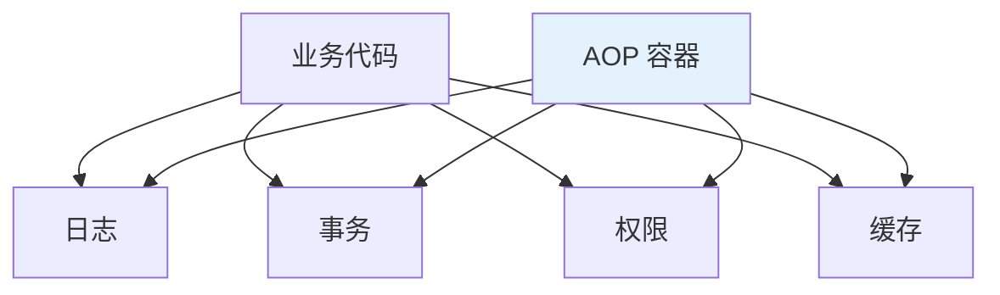
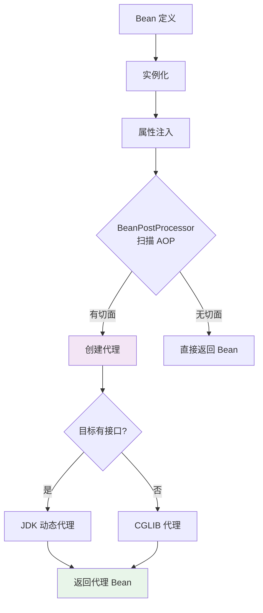

<!--
question:
  id: 06.spring-aop-principle
  topic: 06.spring
  difficulty: ⭐⭐⭐⭐
  frequency: 中频
  scenario_type: 反直觉代码
  tags: [06.spring, AOP, aop]
-->

# AOP 实现原理：JDK 动态代理 vs CGLIB

## 引子：日志、事务、权限——横切关注点怎么解耦？

```java
// 每个方法都写一样的模板代码？
public void transfer(Long from, Long to, BigDecimal amount) {
    log.info("transfer start: {} -> {}", from, to);    // 日志
    if (!hasPermission()) throw new AuthException();    // 权限
    try {
        tx.begin();                                     // 事务
        doTransfer(from, to, amount);
        tx.commit();
    } catch (Exception e) {
        tx.rollback();
        throw e;
    }
}

// 理想状态：业务代码只关心业务
public void transfer(Long from, Long to, BigDecimal amount) {
    doTransfer(from, to, amount);
    // 日志、权限、事务——自动织入
}
```

这就是 AOP 的价值——**横切关注点（日志/事务/权限）和业务代码分离**。

底层怎么实现？两种方案：**JDK 动态代理** vs **CGLIB**。

---

> 📚 **前置知识**：[AOP](../../../06.spring/01-core/aop/README.md)

## 一、什么是 AOP

**AOP**（Aspect-Oriented Programming，面向切面编程）：把**横切关注点**（日志、事务、权限、缓存）从业务代码中抽离。



**核心概念**：
- **切面（Aspect）**：横切逻辑的模块化（如 @Transactional）
- **连接点（Joinpoint）**：程序执行的某个点（方法调用）
- **切点（Pointcut）**：匹配连接点的表达式
- **通知（Advice）**：在切点执行的逻辑（Before / After / Around）
- **织入（Weaving）**：把切面应用到目标对象的过程

---

## 二、Spring AOP 的实现方式

### 两种代理方式

| 代理方式 | 条件 | 特点 |
|---------|------|------|
| **JDK 动态代理** | 目标类**实现接口** | 基于 `java.lang.reflect.Proxy`，只能代理接口方法 |
| **CGLIB** | 目标类**无接口** 或 强制使用 | 基于 ASM 字节码生成子类，可代理类的所有方法 |

**Spring 默认规则**：
- 有接口 → JDK 动态代理
- 无接口 → CGLIB
- Spring Boot 2.0+ 默认都用 CGLIB（`spring.aop.proxy-target-class=true`）

---

## 三、JDK 动态代理

```java
// 目标接口
public interface UserService {
    void save(User user);
}

// 目标类
public class UserServiceImpl implements UserService {
    public void save(User user) {
        System.out.println("save: " + user.getName());
    }
}

// InvocationHandler（织入逻辑）
public class LogHandler implements InvocationHandler {
    private final Object target;
    
    public LogHandler(Object target) {
        this.target = target;
    }
    
    @Override
    public Object invoke(Object proxy, Method method, Object[] args) throws Throwable {
        System.out.println("before: " + method.getName());
        Object result = method.invoke(target, args);  // 反射调用目标
        System.out.println("after: " + method.getName());
        return result;
    }
}

// 生成代理
UserService proxy = (UserService) Proxy.newProxyInstance(
    UserService.class.getClassLoader(),
    new Class[]{UserService.class},
    new LogHandler(new UserServiceImpl())
);

proxy.save(new User("Alice"));  // 调用代理对象
```

**核心**：`Proxy.newProxyInstance(classLoader, interfaces, handler)` 在运行时生成一个**实现指定接口**的代理类。

### 字节码示例
```java
// 生成的代理类（伪代码）
public class $Proxy0 extends Proxy implements UserService {
    private InvocationHandler h;
    
    public void save(User user) {
        h.invoke(this, UserService.class.getMethod("save", User.class), new Object[]{user});
    }
}
```

---

## 四、CGLIB 代理

```java
// 目标类（无接口）
public class UserService {
    public void save(User user) {
        System.out.println("save: " + user.getName());
    }
}

// MethodInterceptor（织入逻辑）
public class LogInterceptor implements MethodInterceptor {
    @Override
    public Object intercept(Object obj, Method method, Object[] args, MethodProxy proxy) 
            throws Throwable {
        System.out.println("before: " + method.getName());
        Object result = proxy.invokeSuper(obj, args);  // 调用父类（目标）方法
        System.out.println("after: " + method.getName());
        return result;
    }
}

// 生成代理
Enhancer enhancer = new Enhancer();
enhancer.setSuperClass(UserService.class);
enhancer.setCallback(new LogInterceptor());
UserService proxy = (UserService) enhancer.create();

proxy.save(new User("Alice"));
```

**核心**：CGLIB 通过 ASM 字节码框架**生成目标类的子类**，重写父类方法。

### 字节码示例
```java
// 生成的代理子类（伪代码）
public class UserService$$EnhancerByCGLIB extends UserService {
    private MethodInterceptor interceptor;
    
    @Override
    public void save(User user) {
        interceptor.intercept(this, UserService.class.getMethod("save"), 
                             new Object[]{user}, methodProxy);
    }
}
```

---

## 五、对比总结

| 维度 | JDK 动态代理 | CGLIB |
|------|-------------|-------|
| **依赖** | JDK 内置 | 第三方库（ASM） |
| **要求** | 目标必须实现接口 | 目标类不能是 final |
| **代理方式** | 实现接口 | 继承子类 |
| **性能** | 反射调用，较慢 | 字节码生成，较快 |
| **方法限制** | 只能代理接口方法 | 可代理类的所有非 final 方法 |
| **Spring 默认** | 有接口 | 无接口 或 强制 |

### 性能对比（JMH 测试）

| 场景 | JDK | CGLIB |
|------|-----|-------|
| 创建代理 | ⭐⭐⭐⭐ 快 | ⭐⭐ 慢（生成字节码） |
| 方法调用 | ⭐⭐ 慢（反射） | ⭐⭐⭐⭐ 快（直接调用） |

**结论**：JDK 创建快、调用慢；CGLIB 创建慢、调用快。**长生命周期 Bean 选 CGLIB**。

---

## 六、Spring AOP 的完整流程



**关键点**：
1. AOP 在 **BeanPostProcessor.postProcessAfterInitialization** 阶段应用
2. 如果 Bean 有切面匹配，生成代理对象替换原始 Bean
3. 容器中的 Bean 是**代理对象**，不是原始对象

---

## 七、常见陷阱

### 陷阱 1：同类方法调用 AOP 失效

```java
@Service
public class UserService {
    
    public void methodA() {
        methodB();  // ❌ AOP 失效（this.methodB 调用，绕过代理）
    }
    
    @Transactional
    public void methodB() {
        // 事务不生效
    }
}
```

**原因**：同类调用走 `this`，不经过代理。

**解决**：
```java
// 方案 1：自我注入
@Autowired private UserService self;
public void methodA() {
    self.methodB();  // 通过代理调用
}

// 方案 2：拆分到两个 Service
```

### 陷阱 2：final 方法无法代理

```java
@Service
public class UserService {
    @Transactional
    public final void save() {  // ❌ CGLIB 无法重写 final 方法
        // 事务不生效
    }
}
```

### 陷阱 3：private 方法无法代理

```java
@Service
public class UserService {
    @Transactional
    private void save() {  // ❌ 代理类无法访问 private
        // 事务不生效
    }
}
```

---

## 八、面试话术（30 秒版）

> "Spring AOP 有两种代理实现：
>
> 1. **JDK 动态代理**：目标类实现接口时用。基于 `Proxy.newProxyInstance`，在运行时生成实现指定接口的代理类，通过反射调用目标方法。
>
> 2. **CGLIB**：目标类无接口（或强制）时用。基于 ASM 字节码生成目标类的子类，重写父类方法。性能更好但无法代理 final 类 / 方法。
>
> **Spring Boot 2.0+ 默认用 CGLIB**。
>
> **AOP 在 Bean 生命周期的 BeanPostProcessor 阶段应用**：扫描切面 → 生成代理 → 替换原始 Bean。
>
> **常见陷阱**：同类方法调用（绕过代理）、final / private 方法（无法代理）—— 本质都是代理失效。"

---

## 九、交叉引用

- 主模块：[`06.spring`](../../06.spring/) — Spring 知识体系
- 相关：[`13.split-hairs/06.spring/transactional-pitfalls/`](../transactional-pitfalls/) — @Transactional 失效（AOP 失效的具体场景）
- 相关：[`13.split-hairs/06.spring/circular-dependency/`](../circular-dependency/) — 三级缓存（AOP 提前创建代理）

## 相关章节

- 深度阅读：[`06.spring`](../../06.spring/README.md) — 主模块详细内容

← [返回: 咬文嚼字 · aop-principle](../README.md)
