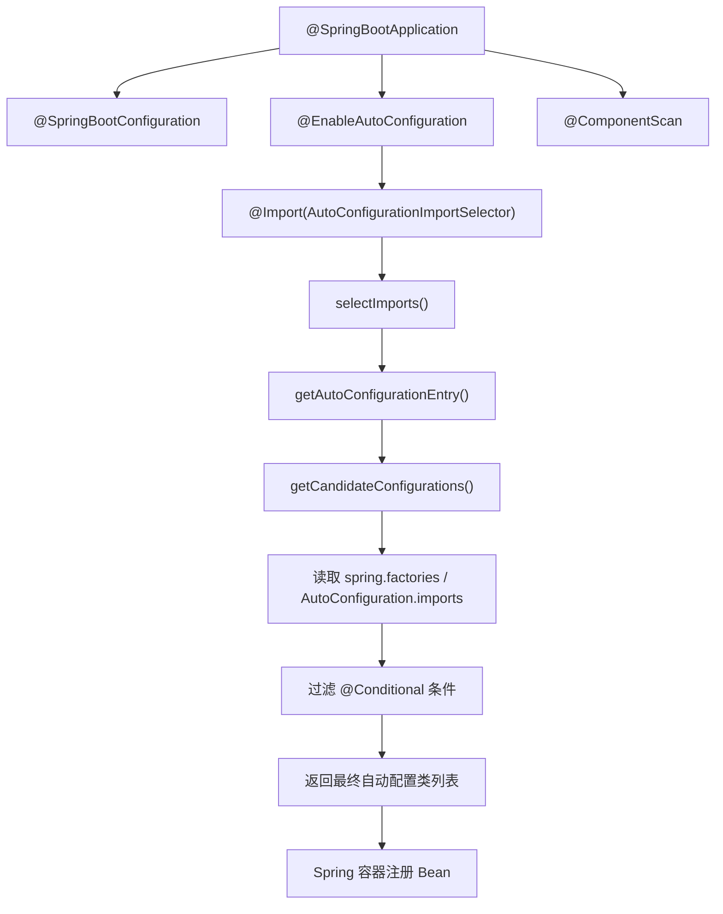

# Spring Boot 自动配置原理深度剖析

> 一句话：Spring Boot 通过 `@EnableAutoConfiguration` 导入 `AutoConfigurationImportSelector`，扫描 classpath 下所有候选自动配置类，结合 `@Conditional` 系列条件注解按需装配 Bean，实现"零 XML、开箱即用"的开发体验。

---

## 一、核心原理

`@SpringBootApplication` 是一个组合注解，等价于以下三个注解的叠加：

```java
@SpringBootConfiguration   // = @Configuration（标记为配置类）
@EnableAutoConfiguration   // 开启自动配置（核心）
@ComponentScan             // 组件扫描（默认扫启动类所在包及子包）
```

其中 **`@EnableAutoConfiguration`** 是自动配置的入口，它通过 `@Import` 导入了一个关键的 `ImportSelector`：

```java
@Import(AutoConfigurationImportSelector.class)
public @interface EnableAutoConfiguration { ... }
```

`AutoConfigurationImportSelector` 负责在容器启动时动态筛选并注册所有符合条件的自动配置类，这是整个机制的核心引擎。



---

## 二、自动配置流程源码

从 `@EnableAutoConfiguration` 到最终 Bean 注册，完整调用链如下：

### 2.1 入口：`@Import(AutoConfigurationImportSelector)`

Spring 在处理 `@Import` 时会回调 `AutoConfigurationImportSelector.selectImports()` 方法：

```java
@Override
public String[] selectImports(AnnotationMetadata annotationMetadata) {
    // 1. 检查自动配置是否启用（默认 true）
    if (!this.isEnabled(annotationMetadata)) {
        return NO_IMPORTS;
    }
    // 2. 获取自动配置元数据
    AutoConfigurationEntry autoConfigurationEntry = 
        getAutoConfigurationEntry(annotationMetadata);
    // 3. 返回需要导入的配置类全限定名数组
    return StringUtils.toStringArray(autoConfigurationEntry.getConfigurations());
}
```

### 2.2 核心：`getAutoConfigurationEntry()`

该方法完成去重、排除、过滤等关键逻辑：

```java
protected AutoConfigurationEntry getAutoConfigurationEntry(AnnotationMetadata annotationMetadata) {
    // 1. 获取所有候选配置类（从 spring.factories 或 imports 文件）
    List<String> configurations = getCandidateConfigurations(annotationMetadata);
    
    // 2. 去重
    configurations = removeDuplicates(configurations);
    
    // 3. 处理 @EnableAutoConfiguration(exclude=...) 排除项
    Set<String> exclusions = getExclusions(annotationMetadata);
    configurations.removeAll(exclusions);
    
    // 4. 应用 @Conditional 条件过滤（最关键一步）
    configurations = filter(configurations, autoConfigurationMetadata);
    
    // 5. 触发自动配置导入事件
    fireAutoConfigurationImportEvents(configurations, exclusions);
    
    return new AutoConfigurationEntry(configurations, exclusions);
}
```

### 2.3 加载：`getCandidateConfigurations()`

Spring Boot 2.7 前后有两套加载机制：

**Boot 2.7 之前** — 读取 `META-INF/spring.factories`：

```properties
# META-INF/spring.factories
org.springframework.boot.autoconfigure.EnableAutoConfiguration=\
  org.springframework.boot.autoconfigure.jdbc.DataSourceAutoConfiguration,\
  org.springframework.boot.autoconfigure.web.servlet.WebMvcAutoConfiguration,\
  org.springframework.boot.autoconfigure.data.redis.RedisAutoConfiguration,\
  ...
```

**Boot 2.7+（推荐）** — 读取 `META-INF/spring/org.springframework.boot.autoconfigure.AutoConfiguration.imports`：

```
# AutoConfiguration.imports
org.springframework.boot.autoconfigure.jdbc.DataSourceAutoConfiguration
org.springframework.boot.autoconfigure.web.servlet.WebMvcAutoConfiguration
org.springframework.boot.autoconfigure.data.redis.RedisAutoConfiguration
```

源码中通过 `SpringFactoriesLoader.loadFactoryNames()` 或新的 `AutoConfigurationImportHelper` 完成加载。

---

## 三、条件注解体系

自动配置类之所以能"按需装配"，完全依赖 `@Conditional` 系列注解。Spring Boot 提供了 **12+** 个常用条件注解：

| 注解 | 作用 | 典型应用场景 |
|------|------|-------------|
| `@ConditionalOnClass` | classpath 存在指定类时才生效 | 检测到 MySQL 驱动才配置 DataSource |
| `@ConditionalOnMissingClass` | classpath 不存在指定类时才生效 | 没有 HikariCP 才用 Tomcat 连接池 |
| `@ConditionalOnBean` | 容器中已存在指定 Bean 时才生效 | 已有 DataSource 才配 JdbcTemplate |
| `@ConditionalOnMissingBean` | 容器中不存在指定 Bean 时才生效 | 用户未自定义 RestTemplate 才提供默认值 |
| `@ConditionalOnProperty` | 配置文件存在指定 key 且值匹配时才生效 | `spring.redis.host` 存在才配 Redis |
| `@ConditionalOnWebApplication` | 当前是 Web 应用时才生效 | Servlet 环境才配 DispatcherServlet |
| `@ConditionalOnNotWebApplication` | 当前不是 Web 应用时才生效 | 非 Web 环境配定时任务 |
| `@ConditionalOnExpression` | SpEL 表达式结果为 true 时才生效 | 复杂条件判断 |
| `@ConditionalOnJava` | JVM 版本匹配时才生效 | Java 17+ 才启用新特性 |
| `@ConditionalOnSingleCandidate` | 容器中只有一个候选 Bean 时才生效 | 唯一性校验 |
| `@ConditionalOnResource` | classpath 存在指定资源文件时才生效 | 存在 schema.sql 才执行初始化 |
| `@ConditionalOnJndi` | JNDI 查找成功时才生效 | 企业服务器场景 |

**典型示例** — `DataSourceAutoConfiguration`：

```java
@Configuration(proxyBeanMethods = false)
@ConditionalOnClass({ DataSource.class, EmbeddedDatabaseType.class })
@ConditionalOnMissingBean(DataSource.class)
@ConditionalOnProperty(prefix = "spring.datasource", name = "url")
public class DataSourceAutoConfiguration {
    @Bean
    public DataSource dataSource() { ... }
}
```

只有当 classpath 有 `DataSource` 类、用户未自定义 DataSource、且配置了 `spring.datasource.url` 时，才会创建默认数据源。

---

## 四、自定义 Starter

编写一个 Spring Boot Starter 只需三步：

### Step 1：编写自动配置类

```java
@Configuration(proxyBeanMethods = false)  // Lite 模式，避免 CGLIB 代理开销
@ConditionalOnClass(MyService.class)
@EnableConfigurationProperties(MyProperties.class)
public class MyAutoConfiguration {

    @Bean
    @ConditionalOnMissingBean  // 用户可覆盖
    public MyService myService(MyProperties properties) {
        return new MyService(properties.getName());
    }
}
```

### Step 2：编写配置属性类

```java
@ConfigurationProperties(prefix = "my.starter")
@Data
public class MyProperties {
    private String name = "default";
}
```

### Step 3：注册自动配置类

**方式一（推荐，Boot 2.7+）**：在 `src/main/resources/META-INF/spring/` 下创建文件 `org.springframework.boot.autoconfigure.AutoConfiguration.imports`：

```
com.example.MyAutoConfiguration
```

**方式二（兼容旧版）**：在 `src/main/resources/META-INF/spring.factories` 中注册：

```properties
org.springframework.boot.autoconfigure.EnableAutoConfiguration=\
  com.example.MyAutoConfiguration
```

### 命名规范

- **官方 Starter**：`spring-boot-starter-xxx`（如 `spring-boot-starter-data-redis`）
- **第三方 Starter**：`xxx-spring-boot-starter`（如 `mybatis-spring-boot-starter`）

---

## 五、常见陷阱

### 5.1 @Configuration 的 Full vs Lite 模式

```java
@Configuration(proxyBeanMethods = true)   // Full 模式：方法被 CGLIB 代理，保证 @Bean 单例
@Configuration(proxyBeanMethods = false)  // Lite 模式：无代理，性能更高
```

**Full 模式**适用于 `@Bean` 方法之间存在相互调用的场景：

```java
@Configuration(proxyBeanMethods = true)
public class FullConfig {
    @Bean
    public A a(B b) { return new A(b); }  // 调用 b() 会走代理，返回同一个 B 实例
    
    @Bean
    public B b() { return new B(); }
}
```

**Lite 模式**适用于自动配置类（无内部调用），可显著降低启动开销。**Spring Boot 官方自动配置类全部使用 Lite 模式**。

### 5.2 配置优先级

```
用户自定义 @Bean > 自动配置类 @Bean（@ConditionalOnMissingBean 保证）
application.yml > 自动配置类的默认值
```

用户可以通过以下方式覆盖自动配置：

1. 自定义同类型 `@Bean`（利用 `@ConditionalOnMissingBean` 失效）
2. 在 `application.yml` 中设置属性
3. 使用 `@EnableAutoConfiguration(exclude = XxxAutoConfiguration.class)` 排除特定自动配置

### 5.3 spring.factories 在 Boot 2.7+ 被弃用

从 Spring Boot 2.7 开始，`spring.factories` 用于自动配置注册的方式已被标记为 `@Deprecated`，推荐使用新的 `AutoConfiguration.imports` 文件。但 `spring.factories` 仍可用于其他 SPI 扩展点（如 `ApplicationContextInitializer`、`ApplicationListener`）。

---

## 六、面试话术（30 秒版）

> "Spring Boot 自动配置的核心是 `@EnableAutoConfiguration`，它通过 `@Import(AutoConfigurationImportSelector)` 在启动时扫描 `META-INF/spring.factories`（或 Boot 2.7+ 的 `AutoConfiguration.imports`）拿到所有候选自动配置类。然后对每个配置类应用 `@Conditional` 系列条件注解——比如 `@ConditionalOnClass` 检查 classpath 是否有某个类、`@ConditionalOnMissingBean` 检查用户是否已经自定义了 Bean——只有条件满足时才真正注册 Bean。这样实现了'classpath 有什么就配什么、用户配了什么就不覆盖'的智能装配效果。自定义 Starter 只需要写一个 `@Configuration` 类，打上条件注解，然后在 `spring.factories` 或 `AutoConfiguration.imports` 里注册即可。"

---

## 七、交叉引用

- 主模块：[`06.spring`](../../../06.spring/) — Spring 知识体系
