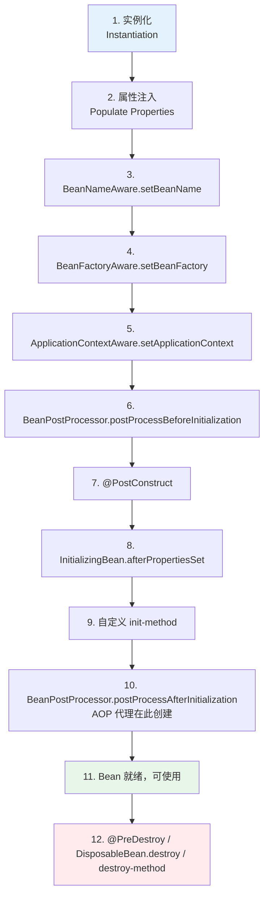

<!--
question:
  id: 06.spring-bean-lifecycle
  topic: 06.spring
  difficulty: 未标
  frequency: 高频
  scenario_type: 反直觉代码
  tags: [06.spring, Bean, bean]
-->

# Bean 生命周期

## 引子：一个 Bean 的"一生"

你写了个 `@Service`，Spring 帮你创建这个 Bean。但它不是 `new` 一下就完事了——

```java
@Service
public class OrderService {
    @Autowired private UserRepository userRepo;  // 第 2 步：属性注入
    
    @PostConstruct                                // 第 7 步：初始化回调
    public void init() { loadConfig(); }
    
    public void createOrder() { ... }             // 第 11 步：Bean 就绪
}
```

从创建到销毁，一个 Bean 要经历 **12 个步骤**。Spring 在每个步骤都留了"钩子"，让你能介入处理。

面试高频题：**说说 Bean 的生命周期？**

---

> 📚 **前置知识**：[IOC](../../../06.spring/01-core/ioc/README.md) | [Bean 生命周期](../../../06.spring/01-core/ioc/bean-lifecycle.md)

## 一、完整生命周期



---

## 二、12 步详解

### 阶段 1：实例化与属性注入
1. **实例化**：反射创建对象（`BeanUtils.instantiateClass`）
2. **属性注入**：依赖注入（`@Autowired` / `@Value`）

### 阶段 2：Aware 接口回调
3. **BeanNameAware**：设置 Bean 在工厂中的名字
4. **BeanFactoryAware**：设置 BeanFactory
5. **ApplicationContextAware**：设置 ApplicationContext

### 阶段 3：BeanPostProcessor 前置处理
6. **BeanPostProcessor.postProcessBeforeInitialization**：初始化前处理

### 阶段 4：初始化
7. **@PostConstruct**（JSR-250 注解）
8. **InitializingBean.afterPropertiesSet**（Spring 接口）
9. **自定义 init-method**（XML 配置）

### 阶段 5：BeanPostProcessor 后置处理
10. **BeanPostProcessor.postProcessAfterInitialization**：初始化后处理（AOP 代理在此创建）

### 阶段 6：使用
11. **Bean 就绪**，可被其他 Bean 使用

### 阶段 7：销毁
12. **@PreDestroy** → **DisposableBean.destroy** → **自定义 destroy-method**

---

## 三、代码示例

```java
@Component
public class MyBean implements InitializingBean, DisposableBean, 
                               BeanNameAware, BeanFactoryAware {
    
    private String beanName;
    
    public MyBean() {
        System.out.println("1. 构造方法（实例化）");
    }
    
    @Autowired
    public void setDependency(Dependency dep) {
        System.out.println("2. 属性注入");
    }
    
    @Override
    public void setBeanName(String name) {
        this.beanName = name;
        System.out.println("3. BeanNameAware.setBeanName");
    }
    
    @Override
    public void setBeanFactory(BeanFactory bf) {
        System.out.println("4. BeanFactoryAware.setBeanFactory");
    }
    
    @PostConstruct
    public void postConstruct() {
        System.out.println("7. @PostConstruct");
    }
    
    @Override
    public void afterPropertiesSet() {
        System.out.println("8. InitializingBean.afterPropertiesSet");
    }
    
    public void customInit() {
        System.out.println("9. init-method");
    }
    
    @PreDestroy
    public void preDestroy() {
        System.out.println("12. @PreDestroy");
    }
    
    @Override
    public void destroy() {
        System.out.println("12. DisposableBean.destroy");
    }
}
```

---

## 四、面试话术（30 秒版）

> "Bean 生命周期分 7 个阶段：
> 
> 1. **实例化**：反射创建对象
> 2. **属性注入**：依赖注入
> 3. **Aware 回调**：BeanName / BeanFactory / ApplicationContext
> 4. **BeanPostProcessor 前置**：初始化前处理
> 5. **初始化**：@PostConstruct → afterPropertiesSet → init-method
> 6. **BeanPostProcessor 后置**：AOP 代理在此创建
> 7. **销毁**：@PreDestroy → destroy → destroy-method
> 
> 关键点是 AOP 代理在初始化后创建，所以代理对象可以拦截初始化方法。"

---

## 五、交叉引用

- 主模块：[`06.spring`](../../06.spring/) — Spring 知识体系
- 相关：[`13.split-hairs/06.spring/not-use-@autowired/`](../not-use-@autowired/) — @Autowired 推荐用法
- 相关：[`13.split-hairs/06.spring/circular-dependency/`](../circular-dependency/) — 循环依赖解决

## 相关章节

- 深度阅读：[`06.spring`](../../06.spring/README.md) — 主模块详细内容

← [返回: 咬文嚼字 · bean-lifecycle](README.md)
