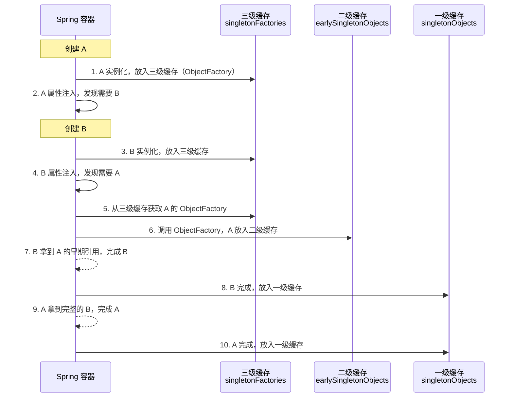

<!--
question:
  id: 06.spring-circular-dependency
  topic: 06.spring
  difficulty: ⭐⭐⭐⭐
  frequency: 中频
  scenario_type: 反直觉代码
  tags: [06.spring, circular, dependency]
-->

# 循环依赖三级缓存解决

## 引子：先有鸡还是先有蛋？

```java
@Service
public class A {
    @Autowired private B b;  // A 需要 B
}

@Service
public class B {
    @Autowired private A a;  // B 需要 A
}
```

创建 A → 需要 B → 创建 B → 需要 A → 创建 A → **死锁**！

这就是循环依赖。Spring 用**三级缓存 + 提前暴露半成品 Bean** 巧妙破解了这个死局。

---

> 📚 **前置知识**：[IOC](../../../06.spring/01-core/ioc/README.md) | [循环依赖](../../../06.spring/01-core/ioc/circular-dependency.md)

## 一、循环依赖问题

```java
@Service
public class A {
    @Autowired private B b;
}

@Service
public class B {
    @Autowired private A a;
}
```

**问题**：
- 创建 A → 需要 B → 创建 B → 需要 A → 创建 A → **死锁**

**Spring 的解决**：**三级缓存 + 提前暴露半成品 Bean**

---

## 二、三级缓存定义

| 缓存 | 作用 | 何时写入 |
|------|------|---------|
| **一级 singletonObjects** | 完全初始化好的 Bean | Bean 完整创建后 |
| **二级 earlySingletonObjects** | 早期 Bean（未注入属性） | 实例化后、属性注入前 |
| **三级 singletonFactories** | Bean 工厂（ObjectFactory） | 实例化后 |

```java
// DefaultSingletonBeanRegistry 核心字段
private final Map<String, Object> singletonObjects = new ConcurrentHashMap<>(256);
private final Map<String, Object> earlySingletonObjects = new ConcurrentHashMap<>(16);
private final Map<String, ObjectFactory<?>> singletonFactories = new HashMap<>(256);
```

---

## 三、解决流程



### 关键步骤

1. **A 实例化**：调用构造方法，**放入三级缓存**（ObjectFactory，可生成 A 的早期引用）
2. **A 属性注入**：发现需要 B
3. **创建 B**：同样流程，B 实例化后放入三级缓存
4. **B 属性注入**：发现需要 A
5. **从三级缓存获取 A**：调用 ObjectFactory，**将 A 的早期引用移到二级缓存**
6. **B 完成**：拿到 A 的早期引用（未注入属性，但对象已存在），B 完成
7. **A 完成**：拿到完整的 B，A 完成

---

## 四、为什么要三级？二级不行吗？

**只用二级缓存的场景**：
```text
A 实例化 → 放入二级缓存 → A 需要 B → 创建 B → B 需要 A → 从二级缓存拿到 A（早期）→ B 完成 → A 完成
```

**为什么要三级缓存**？

**三级缓存的作用**：**处理 AOP 代理**。

AOP 会在 Bean 完成前创建代理对象。如果只用二级缓存，代理逻辑无法提前执行。

```java
// 三级缓存的 ObjectFactory 逻辑
protected Object getEarlyBeanReference(String beanName, RootBeanDefinition mbd, Object bean) {
    Object exposedObject = bean;
    if (!mbd.isSingleton()) return exposedObject;
    
    // 关键：如果有后置处理器（AOP），提前创建代理
    for (BeanPostProcessor bp : this.beanPostProcessors) {
        if (bp instanceof SmartInstantiationAwareBeanPostProcessor) {
            exposedObject = ((SmartInstantiationAwareBeanPostProcessor) bp)
                .getEarlyBeanReference(bean, beanName);
        }
    }
    return exposedObject;
}
```

**流程**：
- 三级缓存存放 **ObjectFactory**（可调用生成代理）
- 循环依赖时，调用 ObjectFactory → 生成代理 → 放入二级缓存
- 后续从二级缓存直接拿代理（避免重复生成）

---

## 五、构造器注入无解

```java
@Service
public class A {
    public A(B b) { this.b = b; }  // 构造器注入
}

@Service
public class B {
    public B(A a) { this.a = a; }  // 构造器注入
}
```

**为什么 Spring 解决不了**？
- 构造器注入时，对象还没实例化，无法放入任何缓存
- 必须先实例化才能注入，但 A 和 B 互相等待

**解决方案**：
1. **改用 setter / 字段注入**
2. **@Lazy 延迟加载**

```java
@Service
public class A {
    private final B b;
    
    public A(@Lazy B b) {  // 延迟加载，注入代理
        this.b = b;
    }
}
```

---

## 六、Prototype 作用域无解

```java
@Service
@Scope("prototype")  // 每次请求都创建新实例
public class A {
    @Autowired private B b;
}
```

**为什么解决不了**？
- Prototype Bean 每次都是新的，缓存无意义
- Spring 直接抛异常

**解决方案**：
1. 改用 singleton 作用域
2. 使用 `@Lookup` 方法注入

---

## 七、Spring Boot 2.6+ 默认禁止循环依赖

```properties
# application.properties
spring.main.allow-circular-references=false  # 默认值
```

**为什么要禁止**？
- 循环依赖是**设计问题**的信号
- 应该重构代码，而不是依赖框架的"黑魔法"

**推荐做法**：
1. 重构：抽取共同依赖到 Service C
2. 事件：用 Spring Event 解耦

```java
// 重构前：A ↔ B 循环依赖
// 重构后：A → C ← B
@Service
public class C {
    // 共享逻辑放 C
}

@Service
public class A {
    @Autowired private C c;
}

@Service
public class B {
    @Autowired private C c;
}
```

---

## 八、面试话术（30 秒版）

> "Spring 用**三级缓存**解决 setter / 字段注入的循环依赖：
>
> - **一级缓存** singletonObjects：完整 Bean
> - **二级缓存** earlySingletonObjects：早期 Bean（未注入属性）
> - **三级缓存** singletonFactories：ObjectFactory（可生成代理）
>
> **流程**：A 实例化 → 放入三级 → 注入属性需要 B → 创建 B 放入三级 → B 需要 A → 从三级调 ObjectFactory 拿 A 早期引用 → B 完成 → A 完成。
>
> **三级缓存的作用**：**提前创建 AOP 代理**。如果没有 AOP，二级就够了。
>
> **无解场景**：
> 1. **构造器注入**：对象未实例化，无法缓存
> 2. **Prototype 作用域**：每次新对象，缓存无意义
>
> **Spring Boot 2.6+ 默认禁止循环依赖**，因为循环依赖是设计问题，应该重构而不是依赖框架。"

---

## 九、交叉引用

- 主模块：[`06.spring`](../../06.spring/) — Spring 知识体系
- 相关：[`13.split-hairs/06.spring/bean-lifecycle/`](../bean-lifecycle/) — Bean 生命周期（三级缓存是生命周期的一部分）
- 相关：[`13.split-hairs/06.spring/aop-principle/`](../aop-principle/) — AOP 原理（三级缓存的关键作用）

## 相关章节

- 深度阅读：[`06.spring`](../../06.spring/README.md) — 主模块详细内容

← [返回: 咬文嚼字 · circular-dependency](../README.md)
