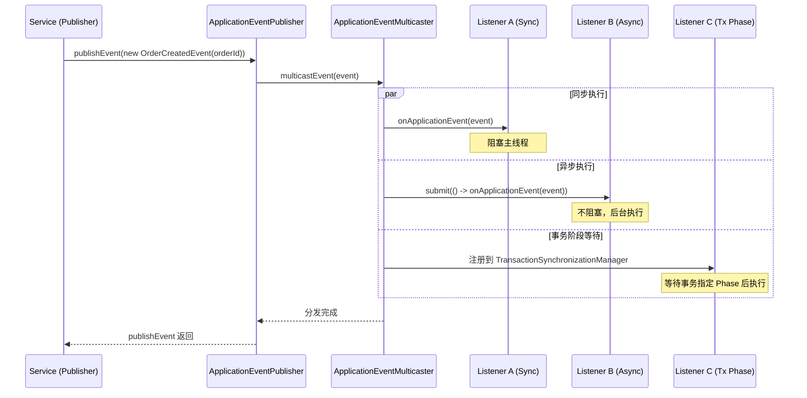
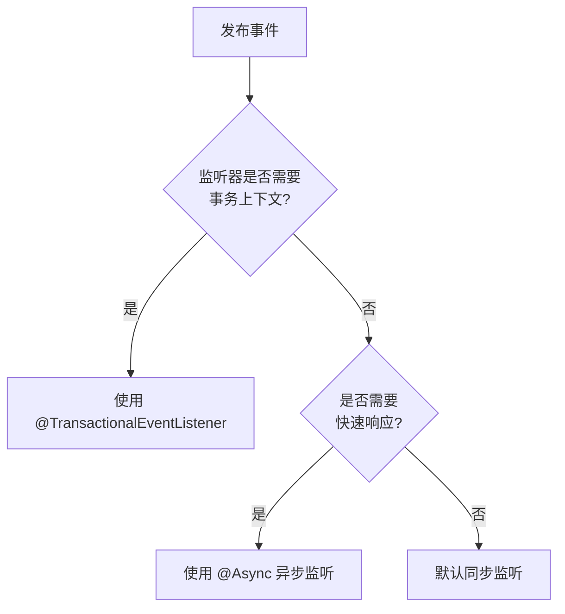

# Spring 事件机制深度剖析

> 一句话：Spring 事件机制基于观察者模式，通过发布-订阅模型实现组件间解耦与业务逻辑异步化。

---

## 一、核心原理

### 1.1 四大核心组件

| 组件 | 角色 | 职责 |
|------|------|------|
| `ApplicationEvent` | 事件 | 继承 `EventObject`，封装事件源和状态数据 |
| `ApplicationListener<E>` | 监听器 | 实现 `EventListener`，接收并处理特定类型事件 |
| `ApplicationEventPublisher` | 发布者 | 提供 `publishEvent()`，触发事件广播 |
| `ApplicationEventMulticaster` | 广播器 | 维护监听器注册表，分发事件到匹配的监听器 |

### 1.2 事件流转图



### 1.3 底层注册机制

容器启动时，`ApplicationListenerDetector` 扫描所有 `ApplicationListener` Bean 并注册到 `ApplicationEventMulticaster`。标注 `@EventListener` 的方法由 `EventListenerMethodProcessor` 适配为 `ApplicationListenerMethodAdapter`。

---

## 二、@EventListener 注解方式

### 2.1 基础用法

```java
@Component
public class OrderEventListener {
    @EventListener
    public void handleOrderCreated(OrderCreatedEvent event) {
        log.info("收到订单创建事件: orderId={}", event.getOrderId());
    }

    // SpEL 条件过滤
    @EventListener(condition = "#event.orderAmount > 1000")
    public void handleHighValueOrder(OrderCreatedEvent event) {
        log.warn("高价值订单预警: amount={}", event.getOrderAmount());
    }
}
```

**关键特性：** 自动匹配事件类型；SpEL 条件过滤；多事件监听 `@EventListener({EventA.class, EventB.class})`

### 2.2 @EventListener vs ApplicationListener

| 维度 | ApplicationListener | @EventListener |
|------|---------------------|----------------|
| 侵入性 | 需实现接口 | 纯注解，零侵入 |
| 灵活性 | 一个类一种事件 | 一个类多个监听方法 |
| 条件过滤 | 手动判断 | SpEL 声明式过滤 |

### 2.3 PayloadApplicationEvent 简化

```java
// 发布
publisher.publishEvent(new PayloadApplicationEvent<>(this, orderDTO));
// 监听
@EventListener
public void handleOrder(PayloadApplicationEvent<OrderDTO> event) {
    OrderDTO order = event.getPayload();
}
```

---

## 三、同步 vs 异步

### 3.1 默认行为：同步阻塞

**重要认知**：Spring 事件机制**默认同步**。调用 `publishEvent()` 后当前线程阻塞直到所有同步监听器执行完毕。

```java
@Transactional
public void createOrder(OrderRequest request) {
    orderMapper.insert(order);
    publisher.publishEvent(new OrderCreatedEvent(order.getId())); // 阻塞
    log.info("订单创建流程结束"); // 需等待监听器执行完
}
```

### 3.2 异步配置：启用 @Async

```java
@Configuration
@EnableAsync
public class AsyncConfig {
    @Bean(name = "eventExecutor")
    public Executor taskExecutor() {
        ThreadPoolTaskExecutor executor = new ThreadPoolTaskExecutor();
        executor.setCorePoolSize(4);
        executor.setMaxPoolSize(8);
        executor.setQueueCapacity(100);
        return executor;
    }
}

@Component
public class AsyncOrderListener {
    @Async("eventExecutor")
    @EventListener
    public void handleOrderCreated(OrderCreatedEvent event) {
        smsService.sendNotification(event.getOrderId());
    }
}
```

**可选**：自定义 `ApplicationEventMulticaster` 的 `TaskExecutor` 使所有监听器异步（影响全局，谨慎使用）。

### 3.3 同步与异步选择决策树



---

## 四、@TransactionalEventListener

### 4.1 四种 Phase 阶段

| Phase | 触发时机 | 典型场景 |
|-------|---------|---------|
| `BEFORE_COMMIT` | 事务提交前（flush 后） | 数据校验、最终确认 |
| `AFTER_COMMIT` | 事务成功提交后 | 发送通知、更新缓存 |
| `AFTER_ROLLBACK` | 事务回滚后 | 清理资源、告警通知 |
| `AFTER_COMPLETION` | 事务完成后 | 资源释放、审计日志 |

### 4.2 代码示例

```java
@Component
public class TransactionalOrderListener {
    @TransactionalEventListener(phase = TransactionPhase.AFTER_COMMIT)
    @Async("eventExecutor")
    public void sendSmsAfterCommit(OrderCreatedEvent event) {
        smsService.send(event.getOrderId());
    }

    @TransactionalEventListener(phase = TransactionPhase.AFTER_ROLLBACK)
    public void handleRollback(OrderCreatedEvent event) {
        alertService.notifyDevTeam("订单事务回滚", event.getOrderId());
    }
}
```

### 4.3 常见误区

**误区一**：认为会自动开启事务。**真相**：只控制在**已有事务**的哪个阶段执行。无事务上下文时，`AFTER_COMMIT` 和 `AFTER_ROLLBACK` 永不触发。

**误区二**：`@Async` + `@TransactionalEventListener` 组合使用。**真相**：`@Async` 使监听器在新线程执行，原事务上下文无法传递，`phase` 失效退化为 `AFTER_COMPLETION`。

---

## 五、实战场景

### 5.1 订单创建后解耦非核心逻辑

核心思路：定义事件类 → 核心服务发布事件 → 监听器处理非核心逻辑。

```java
@Getter
public class OrderCreatedEvent extends ApplicationEvent {
    private final Long orderId, userId;
    private final BigDecimal orderAmount;
    public OrderCreatedEvent(Object source, Long orderId, Long userId, BigDecimal orderAmount) {
        super(source);
        this.orderId = orderId;
        this.userId = userId;
        this.orderAmount = orderAmount;
    }
}

// 发布事件
eventPublisher.publishEvent(new OrderCreatedEvent(this, order.getId(), order.getUserId(), order.getAmount()));

// 监听器
@Component
public class OrderPostProcessListeners {
    @Async("eventExecutor")
    @EventListener
    public void sendNotification(OrderCreatedEvent event) {
        smsService.sendOrderConfirm(event.getOrderId());
    }
}
```

**架构收益**：核心链路清晰、新增非核心逻辑只需添加监听器、各监听器可独立设置线程池。

### 5.2 使用 @Order 控制顺序

```java
@Component
@Order(1)  // 优先级最高
public class FirstOrderListener {
    @EventListener
    public void handle(OrderCreatedEvent event) { /* 必须先执行 */ }
}
```

**注意**：值越小优先级越高。异步监听器的 `@Order` 仅控制提交线程池的顺序。

### 5.3 条件过滤

```java
@EventListener(condition = "#event.userLevel == 'VIP'")
public void handleVipOrder(OrderCreatedEvent event) {
    vipService.assignExclusiveManager(event.getUserId());
}
```

---

## 六、常见陷阱

### 陷阱一：监听器抛异常导致事务回滚

**解决方案**：监听器内部捕获所有异常；改为异步；使用 `@TransactionalEventListener(phase = AFTER_COMMIT)`

```java
@EventListener
public void handle(OrderCreatedEvent event) {
    try {
        smsService.send();
    } catch (Exception e) {
        log.error("短信发送失败，但不影响订单创建", e);
    }
}
```

### 陷阱二：同步监听器阻塞发布线程

**解决方案**：耗时监听器必须标注 `@Async`。

### 陷阱三：循环依赖导致启动失败

**解决方案**：使用 `@Lazy` 延迟注入。

### 陷阱四：事务未提交就执行监听器

**现象**：监听器中查询刚创建的订单结果为 null。**解决方案**：改用 `@TransactionalEventListener(phase = AFTER_COMMIT)`。

---

## 七、面试话术（30 秒版）

> Spring 事件机制基于观察者模式，核心组件包括 ApplicationEvent（事件）、ApplicationListener（监听器）、ApplicationEventPublisher（发布者）和 ApplicationEventMulticaster（广播器）。
>
> Spring 4.2+ 推荐使用 `@EventListener` 注解替代实现接口。默认情况下事件是**同步阻塞**的，如需异步需配合 `@Async` 注解。
>
> 对于需要在事务提交后执行的场景，应使用 `@TransactionalEventListener(phase = AFTER_COMMIT)`，避免出现"事务未提交但通知已发送"的数据不一致问题。
>
> 实战中常用于解耦核心链路与非核心逻辑，例如订单创建后异步发送短信、更新用户画像等。需注意监听器异常会导致主事务回滚，建议在监听器内部做好异常捕获或使用异步隔离。

---

## 八、交叉引用

- 主模块：[`06.spring`](../../../06.spring/) — Spring 知识体系
- [Spring 事务](../../../06.spring/03-data/transaction/README.md) — Spring 事务管理机制
- [Spring 事件](../../../06.spring/01-core/event.md) — Spring 异步编程模型
- [设计模式](../../../01.java/design-patterns/README.md) — 观察者模式详解
