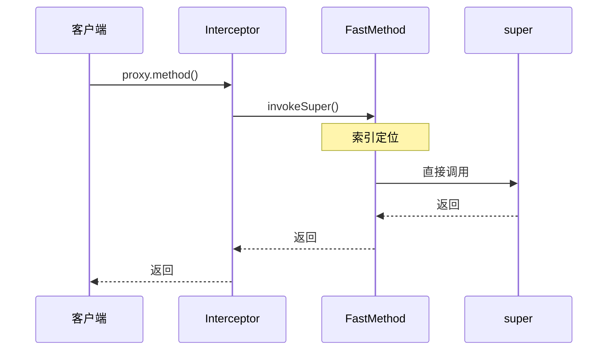
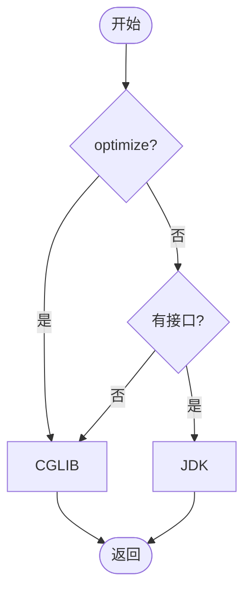

# JDK 动态代理 vs CGLIB 深度对比

> 一句话：JDK 动态代理基于反射要求目标类实现接口，CGLIB 通过字节码生成子类无需接口，Spring AOP 根据是否实现接口自动选择代理策略。

---

## 一、核心原理

### 1.1 本质区别

| 维度 | JDK 动态代理 | CGLIB 代理 |
|------|-------------|-----------|
| **底层机制** | Java 反射 API | ASM 字节码生成 |
| **接口依赖** | 必须实现接口 | 无需接口 |
| **实现方式** | `java.lang.reflect.Proxy` 实例 | 目标类的子类 |
| **方法限制** | 仅接口声明的方法 | 无法代理 `final`/`static`/`private` |
| **性能** | JDK 8+ 显著优化 | 首次生成慢，缓存后更快 |
| **依赖** | JDK 内置 | 需 cglib（Spring 内嵌） |

### 1.2 架构对比图

```mermaid
graph TB
    subgraph JDK["JDK 动态代理"]
        A[客户端] --> B[Proxy.newProxyInstance]
        B --> C[$Proxy0]
        C --> D[实现接口]
        D --> E[InvocationHandler]
        E --> F[Method.invoke]
        F --> G[目标对象]
    end
    subgraph CGLIB["CGLIB 代理"]
        H[客户端] --> I[Enhancer.create]
        I --> J[ASM 生成子类]
        J --> K[继承目标类]
        K --> L[MethodInterceptor]
        L --> M[FastClass]
        M --> N[super.method]
    end
    style JDK fill:#e1f5fe
    style CGLIB fill:#fff3e0
```



---

## 二、JDK 动态代理

### 2.1 核心 API

- **`Proxy`**：代理类父类，创建代理实例
- **`InvocationHandler`**：拦截逻辑，方法调用路由到 `invoke()`

### 2.2 示例代码

```java
// 业务接口
public interface UserService {
    String getUserById(Long id);
    void saveUser(String name);
}

// InvocationHandler
public class LogHandler implements InvocationHandler {
    private final Object target;
    public LogHandler(Object target) { this.target = target; }
    @Override
    public Object invoke(Object proxy, Method method, Object[] args) throws Throwable {
        System.out.println("[LOG] Before: " + method.getName());
        try { return method.invoke(target, args); }
        finally { System.out.println("[LOG] After: " + method.getName()); }
    }
}

// 使用
UserService proxy = (UserService) Proxy.newProxyInstance(
    target.getClass().getClassLoader(),
    target.getClass().getInterfaces(),
    new LogHandler(target));
proxy.getUserById(1L);
```

### 2.3 关键参数

```java
Object invoke(Object proxy, Method method, Object[] args)
```

| 参数 | 说明 | 注意 |
|------|------|------|
| `proxy` | 代理实例 | 禁止调用 `proxy.xxx()`，会 StackOverflow |
| `method` | 接口方法 | 来自接口定义 |
| `args` | 参数数组 | 无参为 `null` |

**源码要点**：`getProxyClass0` 缓存代理类，生成的 `$Proxy0` 继承 `Proxy` 实现接口，转发调用到 `invoke()`。

---

## 三、CGLIB

### 3.1 核心 API

- **`Enhancer`**：字节码增强器，创建代理子类
- **`MethodInterceptor`**：拦截器定义增强逻辑
- **`FastClass/FastMethod`**：避免反射的优化机制

### 3.2 示例代码

```java
// 目标类（无需接口）
public class OrderService {
    public String getOrderById(Long id) { return "Order-" + id; }
    public final String getStatus() { return "ACTIVE"; } // final 无法代理
}

// MethodInterceptor
public class TimerInterceptor implements MethodInterceptor {
    @Override
    public Object intercept(Object obj, Method method, Object[] args, 
                           MethodProxy proxy) throws Throwable {
        long start = System.nanoTime();
        try { return proxy.invokeSuper(obj, args); } // 关键：避免反射
        finally { System.out.println("cost=" + (System.nanoTime()-start) + "ns"); }
    }
}

// 使用
Enhancer enhancer = new Enhancer();
enhancer.setSuperclass(OrderService.class);
enhancer.setCallback(new TimerInterceptor());
OrderService proxy = (OrderService) enhancer.create();
proxy.getOrderById(100L);
proxy.getStatus(); // final 不拦截
```

### 3.3 关键参数

```java
Object intercept(Object obj, Method method, Object[] args, MethodProxy proxy)
```

| 参数 | 说明 |
|------|------|
| `obj` | 代理实例（子类） |
| `method` | 被拦截方法 |
| `args` | 参数 |
| `proxy` | **推荐** `proxy.invokeSuper()`，FastClass 优化 |

### 3.4 FastClass 优化



**反射调用**：查找 Method → 权限检查 → 装箱 → JNI

**FastClass**：索引直接定位 → 跳过反射，快 3-5 倍

---

## 四、对比与选型

### 4.1 全面对比表

| 维度 | JDK 代理 | CGLIB |
|------|---------|-------|
| **依赖** | JDK 内置 | cglib（Spring 内嵌） |
| **接口** | 必须有 | 无需 |
| **类型** | `Proxy` 子类 | 目标类子类 |
| **final** | 不涉及 | ❌ 无法代理 |
| **static/private** | 不涉及 | ❌ 无法代理 |
| **创建速度** | ~ms | ~10-100ms |
| **调用性能** | ~90% 原生 | ~95% 原生 |
| **内存** | 低 | 较高 |
| **调试** | 清晰 | 复杂类名 |
| **Spring Boot** | 否 | **默认** |

### 4.2 Spring AOP 选择逻辑

```java
public AopProxy createAopProxy(AdvisedSupport config) {
    if (config.isOptimize() || config.isProxyTargetClass())
        return new ObjenesisCglibAopProxy(config);
    if (!config.hasInterfaces())
        return new ObjenesisCglibAopProxy(config);
    return new JdkDynamicAopProxy(config);
}
```



### 4.3 Spring Boot 默认 CGLIB 原因

1. **语义一致**：JDK 代理导致 `instanceof` 失败
2. **减少陷阱**：避免接口漏加方法
3. **性能趋同**：JDK 8+ 差距 <5%
4. **现代实践**：注解驱动，接口非强制

---

## 五、常见陷阱

### 5.1 CGLIB 限制

```java
public class TrapService {
    public final String f() { return "no"; }     // ❌ final
    public static String s() { return "no"; }    // ❌ static
    private String p() { return "no"; }          // ❌ private
    public String ok() { return "yes"; }         // ✅
}
```

**方案**：提取接口用 JDK 代理，或 AspectJ 织入。

### 5.2 性能对比

| JDK 版本 | 对比 |
|---------|------|
| 6/7 | CGLIB 快 30% |
| 8 | 差距 10% |
| 11+ | JDK 甚至略快 |

**建议**：JMH 实测，勿凭经验。

### 5.3 自调用失效

```java
@Service
public class TxService {
    @Transactional public void outer() { inner(); } // ❌ 事务失效
    @Transactional public void inner() { /* DB */ }
}
```

**原因**：`this` 是目标对象，非代理。

**方案**：注入自身、`AopContext.currentProxy()`、拆分 Service。

---

## 六、面试话术（30 秒）

> 「JDK 代理基于反射，需实现接口，通过 `Proxy.newProxyInstance` 创建，调用路由到 `InvocationHandler.invoke`。CGLIB 基于 ASM 生成子类，通过 `MethodInterceptor.intercept` 拦截，用 FastClass 优化。
>
> JDK 需接口但轻量，CGLIB 无需接口但无法代理 `final`/`static`/`private`。Spring AOP 自动选择，Boot 2.x+ 默认 CGLIB 避免 `instanceof` 问题。
>
> JDK 8+ 优化后差距 <5%，应压测选型。」

---

## 七、交叉引用

- **主模块**：[`06.spring`](../../../06.spring/)
- **相关**：[AOP 原理](../../../06.spring/08-annotations/aop.md) | [事务传播](../../../06.spring/03-data/transaction/propagation-and-isolation.md) | [Bean 生命周期](../../../06.spring/01-core/ioc/bean-lifecycle.md)
- **延伸**：[cglib](https://github.com/cglib/cglib) | [Spring AOP](https://docs.spring.io/spring-framework/reference/core/aop.html)

---

*本文档属于 `note/13.split-hairs` 系列，深度等级 ⭐⭐⭐⭐*
