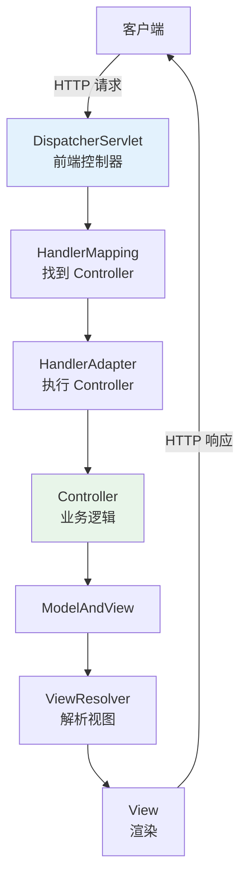
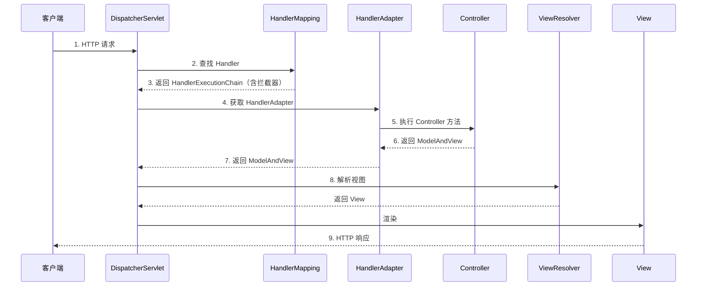
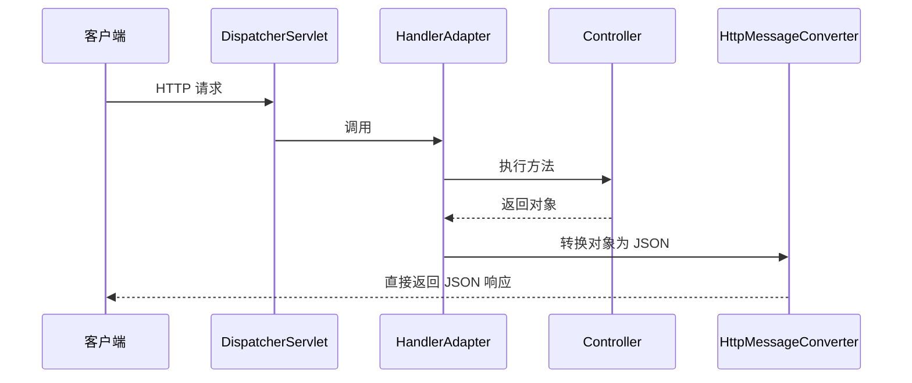

<!--
question:
  id: 06.spring-spring-mvc-flow
  topic: 06.spring
  difficulty: ⭐⭐⭐
  frequency: 中频
  scenario_type: 反直觉代码
  tags: [06.spring, Spring, spring]
-->

# Spring MVC 请求处理流程

## 引子：一个请求的 9 步旅程

```text
浏览器 → http://localhost:8080/api/users
```

你按下了回车。接下来 50 毫秒内发生了什么？

1. **DispatcherServlet** 接收请求（前端控制器）
2. **HandlerMapping** 找到对应的 Controller 方法
3. **HandlerAdapter** 调用 Controller
4. Controller 执行业务逻辑
5. 返回 **ModelAndView**
6. **ViewResolver** 解析视图
7. 渲染响应
8. 返回给浏览器

9 个组件各司其职，像工厂流水线一样精密协作。

---

> 📚 **前置知识**：[MVC](../../../06.spring/02-web/mvc/README.md) | [请求处理流程](../../../06.spring/02-web/mvc/dispatch-flow.md)

## 一、核心组件



| 组件 | 职责 |
|------|------|
| **DispatcherServlet** | 前端控制器，统一入口 |
| **HandlerMapping** | 根据 URL 找到对应的 Controller（Handler） |
| **HandlerAdapter** | 调用 Controller 方法（适配器模式） |
| **Controller** | 业务逻辑 |
| **ViewResolver** | 视图名 → 实际视图 |
| **View** | 渲染响应 |

---

## 二、完整 9 步流程



**详细步骤**：

1. **请求到达 DispatcherServlet**
2. **调用 HandlerMapping**：根据 URL 找到对应的 Controller（返回 HandlerExecutionChain，包含拦截器）
3. **调用 HandlerAdapter**：找到支持该 Handler 的适配器
4. **HandlerAdapter 调用 Controller**：通过反射执行业务方法
5. **Controller 返回 ModelAndView**
6. **ViewResolver 解析视图名**：如 "user/list" → "/WEB-INF/jsp/user/list.jsp"
7. **View 渲染**：将 Model 数据填充到视图
8. **返回响应**

---

## 三、@ResponseBody 的简化流程

当使用 `@RestController` 或 `@ResponseBody` 时，**不经过 ViewResolver**：



**核心**：`HttpMessageConverter`（如 `MappingJackson2HttpMessageConverter`）将对象序列化为 JSON，**绕过视图解析**。

---

## 四、关键组件详解

### 4.1 HandlerMapping 实现

| 实现 | 匹配方式 | 示例 |
|------|---------|------|
| **RequestMappingHandlerMapping** | `@RequestMapping` 注解 | `@GetMapping("/users")` |
| SimpleUrlHandlerMapping | URL 显式配置 | `<property name="urlMap">` |
| BeanNameUrlMapping | Bean 名称为 URL | `<bean name="/users">` |

### 4.2 HandlerAdapter 实现

| 实现 | 适用 |
|------|------|
| **RequestMappingHandlerAdapter** | `@RequestMapping` 注解（最常用） |
| HttpRequestHandlerAdapter | 实现 HttpRequestHandler 的类 |
| SimpleControllerHandlerAdapter | 实现 Controller 接口的类 |

### 4.3 拦截器（Interceptor）

```java
public class AuthInterceptor implements HandlerInterceptor {
    @Override
    public boolean preHandle(HttpServletRequest req, HttpServletResponse res, Object handler) {
        // 执行 Controller 之前
        if (!isAuthenticated(req)) {
            res.sendError(401);
            return false;  // 拦截
        }
        return true;  // 放行
    }
    
    @Override
    public void postHandle(...) {
        // Controller 执行后，视图渲染前
    }
    
    @Override
    public void afterCompletion(...) {
        // 视图渲染完成后
    }
}
```

**拦截器 vs 过滤器**：
| 维度 | 过滤器（Filter） | 拦截器（Interceptor） |
|------|----------------|---------------------|
| 规范 | Servlet 规范 | Spring 规范 |
| 配置 | web.xml / @WebFilter | Spring MVC 配置 |
| 作用范围 | 所有请求 | 仅 DispatcherServlet |
| 依赖 | 不依赖 Spring | 依赖 Spring 容器 |

---

## 五、异常处理

```java
@RestControllerAdvice
public class GlobalExceptionHandler {
    
    @ExceptionHandler(BusinessException.class)
    public ResponseEntity<Error> handleBusiness(BusinessException e) {
        return ResponseEntity.badRequest()
            .body(new Error(e.getCode(), e.getMessage()));
    }
    
    @ExceptionHandler(Exception.class)
    public ResponseEntity<Error> handleAll(Exception e) {
        return ResponseEntity.status(500)
            .body(new Error("INTERNAL_ERROR", "服务器内部错误"));
    }
}
```

**处理顺序**：
1. Controller 内 `@ExceptionHandler`
2. `@ControllerAdvice` 全局异常处理
3. SimpleMappingExceptionResolver（视图解析异常）
4. 默认处理（返回 500）

---

## 六、面试话术（30 秒版）

> "Spring MVC 流程分 9 步：
>
> 1. 请求到 **DispatcherServlet**
> 2. 调用 **HandlerMapping** 找 Controller（返回 HandlerExecutionChain + 拦截器）
> 3. 调用 **HandlerAdapter** 执行 Controller 方法
> 4. Controller 返回 **ModelAndView**
> 5. **ViewResolver** 解析视图名 → 实际 View
> 6. View 渲染，返回响应
>
> **@RestController 简化**：返回对象 → **HttpMessageConverter** 序列化为 JSON，直接响应，**不经过 ViewResolver**。
>
> **三大核心组件**：
> - DispatcherServlet：前端控制器
> - HandlerMapping：URL → Controller
> - HandlerAdapter：调用 Controller
>
> **拦截器**在 HandlerExecutionChain 中执行：preHandle → Controller → postHandle → afterCompletion。"

---

## 七、交叉引用

- 主模块：[`06.spring`](../../06.spring/) — Spring 知识体系
- 相关：[`13.split-hairs/06.spring/not-use-@autowired/`](../not-use-@autowired/) — @Autowired 推荐用法
- 待补：Spring Security 过滤器链

## 相关章节

- 深度阅读：[`06.spring`](../../06.spring/README.md) — 主模块详细内容

← [返回: 咬文嚼字 · spring-mvc-flow](../README.md)
