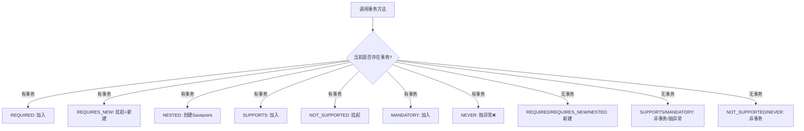
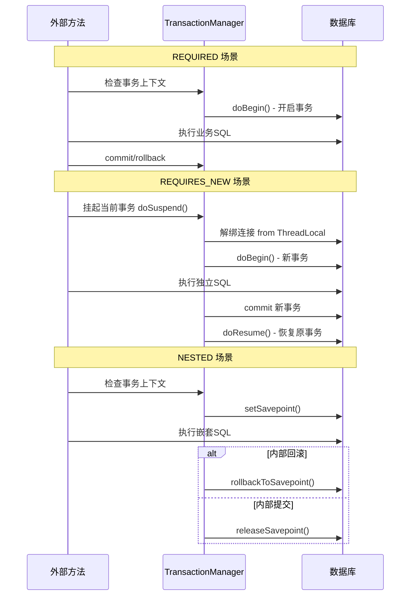

# @Transactional 传播行为 7 种详解

## 引子：嵌套事务怎么办？

```java
@Service
public class OrderService {
    
    @Transactional  // 外层事务
    public void createOrder() {
        orderMapper.insert(order);
        paymentService.charge();  // 调用支付
    }
}

@Service
public class PaymentService {
    
    @Transactional(propagation = Propagation.REQUIRES_NEW)  // 新的独立事务？
    public void charge() {
        paymentMapper.insert(payment);
    }
}
```

`charge()` 方法的事务应该怎么处理？

- 加入 `createOrder` 的事务？→ `REQUIRES`（默认）
- 开一个全新的独立事务？→ `REQUIRES_NEW`
- 没有外层事务才开事务？→ `NOT_SUPPORTED`

Spring 定义了 **7 种传播行为**，精确控制嵌套事务的归属。

---

> 📚 **前置知识**：[事务](../../06.spring/03-data/transaction/README.md) | [传播行为](../../06.spring/03-data/transaction/propagation-and-isolation.md)

## 一、核心原理

**传播行为（Propagation）** 是 Spring 事务管理中的关键概念，定义在 `org.springframework.transaction.TransactionDefinition` 接口中。它描述了当一个事务方法被另一个事务方法调用时，事务应该如何传播。

Spring 通过 `AbstractPlatformTransactionManager` 抽象类实现传播行为的控制逻辑，核心流程如下：

```
getTransaction() → determinePropagationBehavior() → doBegin() / doSuspend() / doResume()
```

- **doBegin()**：开启新事务
- **doSuspend()**：挂起当前事务（将现有连接从 ThreadLocal 中解绑）
- **doResume()**：恢复被挂起的事务（重新绑定连接到 ThreadLocal）

ThreadLocal 是 Spring 管理事务上下文的核心机制，每个线程持有一个独立的 `ConnectionHolder`，确保事务隔离性。

---

## 二、7 种传播行为对比

| 传播行为 | 有当前事务 | 无当前事务 | 典型场景 |
|---------|-----------|-----------|---------|
| `REQUIRED` (默认) | 加入当前事务 | 新建事务 | 通用业务逻辑 |
| `REQUIRES_NEW` | 挂起当前事务，新建独立事务 | 新建事务 | 日志记录、审计 |
| `NESTED` | 创建 Savepoint 嵌套事务 | 新建事务 | 部分回滚场景 |
| `SUPPORTS` | 加入当前事务 | 非事务方式执行 | 只读查询 |
| `NOT_SUPPORTED` | 挂起当前事务，非事务执行 | 非事务方式执行 | 批量操作优化 |
| `MANDATORY` | 加入当前事务 | 抛出异常 | 强制要求事务上下文 |
| `NEVER` | 抛出异常 | 非事务方式执行 | 禁止事务的场景 |



---

## 三、重点对比

### REQUIRED vs REQUIRES_NEW vs NESTED

| 维度 | REQUIRED | REQUIRES_NEW | NESTED |
|-----|----------|--------------|--------|
| 是否新建物理事务 | 否（加入已有） | 是（独立事务） | 否（Savepoint） |
| 是否挂起外部事务 | 否 | 是 | 否 |
| 内部回滚影响外部 | ✅ 影响 | ❌ 不影响 | ❌ 不影响 |
| 外部回滚影响内部 | ✅ 影响 | ❌ 不影响 | ✅ 影响 |
| 是否需要 JDBC 3.0+ | 否 | 否 | 是（Savepoint支持） |
| 连接池消耗 | 1个连接 | 2个连接 | 1个连接 |

**核心差异：**

- **REQUIRED**：最常见，多个方法共享同一事务，任意一方回滚则整体回滚。
- **REQUIRES_NEW**：完全独立的新事务，即使外部捕获异常，内部已提交的数据也不会回滚。**注意：需要额外数据库连接，高并发下可能耗尽连接池。**
- **NESTED**：基于 JDBC Savepoint 实现，本质仍是同一事务。内部回滚只回滚到 Savepoint，但外部最终回滚时，内部操作也会一起回滚。



---

## 四、代码示例 + 异常场景

### 1. REQUIRED（默认行为）

```java
@Service
public class OrderService {

    @Autowired
    private OrderMapper orderMapper;

    @Autowired
    private LogService logService;

    @Transactional(propagation = Propagation.REQUIRED)
    public void createOrder(Order order) {
        orderMapper.insert(order);          // SQL1
        logService.recordLog("订单创建");    // SQL2，加入同一事务
        // 任意一处异常 → 整体回滚
    }
}

@Service
public class LogService {

    @Autowired
    private LogMapper logMapper;

    @Transactional(propagation = Propagation.REQUIRED)
    public void recordLog(String message) {
        logMapper.insert(new Log(message));
    }
}
```

**回滚行为**：如果 `recordLog()` 抛出运行时异常，`createOrder()` 中的插入也会回滚。

### 2. REQUIRES_NEW（独立事务）

```java
@Service
public class LogService {

    @Autowired
    private LogMapper logMapper;

    @Transactional(propagation = Propagation.REQUIRES_NEW)
    public void recordAuditLog(String message) {
        logMapper.insert(new AuditLog(message));
        // 即使外部捕获异常，这条日志也已持久化
    }
}

@Service
public class OrderService {

    @Autowired
    private LogService logService;

    @Transactional(propagation = Propagation.REQUIRED)
    public void createOrderWithAudit(Order order) {
        orderMapper.insert(order);
        try {
            logService.recordAuditLog("审计日志");  // 独立事务，立即提交
        } catch (Exception e) {
            // 捕获异常，不影响主流程
        }
        throw new RuntimeException("订单处理失败");  // 订单回滚，但审计日志不回滚
    }
}
```

**关键点**：`REQUIRES_NEW` 会挂起外部事务并获取新的数据库连接。如果连接池配置过小（如 HikariCP maximumPoolSize=5），高并发下可能导致 `CannotGetJdbcConnectionException`。

### 3. NESTED（Savepoint 嵌套）

```java
@Service
public class BatchService {

    @Autowired
    private ItemMapper itemMapper;

    @Transactional(propagation = Propagation.NESTED)
    public void saveItem(Item item) {
        itemMapper.insert(item);
        if (item.getPrice() < 0) {
            throw new RuntimeException("价格无效");  // 只回滚到 Savepoint
        }
    }

    @Transactional(propagation = Propagation.REQUIRED)
    public void batchSave(List<Item> items) {
        for (Item item : items) {
            try {
                saveItem(item);  // NESTED 传播
            } catch (Exception e) {
                // 单个失败不影响其他项
            }
        }
    }
}
```

**回滚行为**：`saveItem()` 内部回滚只撤销自己的操作，`batchSave()` 可以继续处理后续项。但如果 `batchSave()` 最终抛出异常，所有已保存的项（包括之前成功的）都会回滚。

### 4. SUPPORTS / NOT_SUPPORTED / MANDATORY / NEVER

```java
// SUPPORTS: 有事务则加入，无事务则以非事务方式运行
@Transactional(propagation = Propagation.SUPPORTS)
public List<Order> queryOrders() {
    return orderMapper.selectAll();  // 只读查询，无需事务
}

// NOT_SUPPORTED: 挂起当前事务，以非事务方式运行
@Transactional(propagation = Propagation.NOT_SUPPORTED)
public void bulkInsert(List<Order> orders) {
    // 批量插入，避免事务开销
    for (Order order : orders) {
        orderMapper.insert(order);
    }
}

// MANDATORY: 必须在事务中运行，否则抛异常
@Transactional(propagation = Propagation.MANDATORY)
public void updateOrderStatus(Long orderId, String status) {
    orderMapper.updateStatus(orderId, status);
    // 如果外部没有事务 → IllegalTransactionStateException
}

// NEVER: 不能在事务中运行，否则抛异常
@Transactional(propagation = Propagation.NEVER)
public void sendNotification(String message) {
    // 发送通知，禁止事务
    notificationService.send(message);
    // 如果外部有事务 → IllegalTransactionStateException
}
```

---

## 五、常见陷阱

### 陷阱1：NESTED 需要 JDBC 驱动支持

`NESTED` 依赖 JDBC 3.0+ 的 Savepoint API。如果使用旧版驱动或不支持的数据库（如某些 NoSQL 适配器），会抛出 `NestedTransactionNotSupportedException`。

```java
// DataSourceTransactionManager 中的检查逻辑
if (!connectionSupportsSavepoints(connection)) {
    throw new NestedTransactionNotSupportedException(
        "Cannot create nested transaction: JDBC driver does not support Savepoints");
}
```

**解决方案**：确认数据库和驱动版本支持 Savepoint（MySQL 5.0+、PostgreSQL 8.0+、Oracle 9i+ 均支持）。

### 陷阱2：REQUIRES_NEW 可能耗尽连接池

`REQUIRES_NEW` 每次调用都需要额外的数据库连接。如果外部事务也持有连接，且连接池大小有限，高并发下会导致连接等待甚至超时。

```yaml
# application.yml - HikariCP 配置示例
spring:
  datasource:
    hikari:
      maximum-pool-size: 20      # 根据并发量调整
      connection-timeout: 30000  # 连接获取超时
      leak-detection-threshold: 60000  # 连接泄漏检测
```

**经验法则**：如果 QPS > 1000 且频繁使用 `REQUIRES_NEW`，考虑异步化处理（`@Async` + 独立数据源）或消息队列解耦。

### 陷阱3：自调用导致传播行为失效

```java
@Service
public class OrderService {

    @Transactional(propagation = Propagation.REQUIRES_NEW)
    public void independentMethod() {
        // ...
    }

    @Transactional(propagation = Propagation.REQUIRED)
    public void callerMethod() {
        this.independentMethod();  // ❌ 自调用，AOP 不生效，传播行为被忽略
    }
}
```

**原因**：Spring AOP 基于代理模式，自调用绕过代理，`@Transactional` 注解失效。

**解决方案**：注入自身代理或通过 `AopContext.currentProxy()` 调用。

### 陷阱4：异常类型导致不回滚

Spring 默认只对 `RuntimeException` 和 `Error` 回滚，检查型异常（checked exception）不会触发回滚。

```java
@Transactional(propagation = Propagation.REQUIRED, rollbackFor = Exception.class)
public void methodWithCheckedException() throws Exception {
    // 必须指定 rollbackFor = Exception.class 才能回滚
}
```

---

## 六、面试话术（30 秒版）

> "Spring 的 `@Transactional` 支持 7 种传播行为，最常用的是 `REQUIRED`（默认，有则加入无则新建）和 `REQUIRES_NEW`（总是新建独立事务，挂起当前事务）。`NESTED` 比较特殊，基于 JDBC Savepoint 实现嵌套事务，内部回滚不影响外部，但外部回滚会影响内部。其他四种 `SUPPORTS`、`NOT_SUPPORTED`、`MANDATORY`、`NEVER` 主要用于控制是否在事务中执行。实际开发中，`REQUIRES_NEW` 要注意连接池耗尽问题，`NESTED` 要确认 JDBC 驱动支持 Savepoint。另外，自调用会导致传播行为失效，因为绕过了 AOP 代理。"

---

## 七、交叉引用

- 主模块：[`06.spring`](../../../06.spring/) — Spring 知识体系
- [事务失效场景](../transactional-pitfalls/README.md) — @Transactional 失效场景
- [事务传播](../../../06.spring/03-data/transaction/propagation-and-isolation.md) — 事务传播与隔离级别详解
- [分布式事务](../../../04.system-design/02-distributed/distributed-transaction/README.md) — 分布式事务方案对比

## 相关章节

- 深度阅读：[`06.spring`](../../06.spring/README.md) — 主模块详细内容
