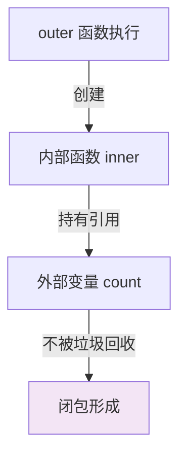

# 闭包（Closure）

## 引子：一个"有记忆"的函数

```javascript
function createCounter() {
  let count = 0
  return function() {
    count++
    return count
  }
}

const counter = createCounter()
console.log(counter())  // 1
console.log(counter())  // 2
console.log(counter())  // 3
```

`count` 变量明明在 `createCounter` 函数里，函数执行完应该被销毁。但为什么 `count` 还在？

因为内部函数"记住"了外部变量——这就是**闭包**。

闭包让"私有变量"成为可能，但也可能导致内存泄漏。

---

> 📚 **前置知识**：[JavaScript 基础](../../09.front-end/02-language/README.md)

## 一、核心原理

**闭包定义**：一个函数**记住**了它定义时的词法作用域，即使这个函数在其词法作用域之外执行。

```javascript
function outer() {
  let count = 0  // 外部变量
  
  return function inner() {  // 内部函数引用了 count
    count++
    return count
  }
}

const counter = outer()
console.log(counter())  // 1
console.log(counter())  // 2  ← count 被"记住"了
```

**为什么叫"闭包"？** 因为内部函数"包裹"住了外部变量，把它"封闭"在自己的作用域里。

---

## 二、闭包的本质



**关键机制**：
- JavaScript 用**引用**管理内存
- 正常情况下，函数执行完，局部变量被回收
- 但如果内部函数**引用了外部变量**，这个变量就被"锁住"，无法回收
- 这就是闭包

---

## 三、经典用例

### 1. 私有变量（模块模式）

```javascript
function createCounter() {
  let count = 0  // 私有变量
  
  return {
    increment: () => ++count,
    decrement: () => --count,
    getCount: () => count
  }
}

const counter = createCounter()
counter.increment()
counter.increment()
console.log(counter.getCount())  // 2
// count 无法直接访问，实现了"私有"
```

### 2. 函数柯里化

```javascript
function multiply(a) {
  return function(b) {
    return a * b
  }
}

const double = multiply(2)
const triple = multiply(3)

console.log(double(5))   // 10
console.log(triple(5))   // 15
```

### 3. 防抖 / 节流

```javascript
function debounce(fn, delay) {
  let timer = null  // 闭包保存 timer
  
  return function(...args) {
    clearTimeout(timer)
    timer = setTimeout(() => {
      fn.apply(this, args)
    }, delay)
  }
}

const debouncedSearch = debounce(search, 300)
```

---

## 四、常见陷阱

### 陷阱 1：循环中的闭包（最经典面试题）

```javascript
// ❌ 错误：所有回调共享同一个 i
for (var i = 0; i < 5; i++) {
  setTimeout(() => console.log(i), 100)
}
// 输出：5 5 5 5 5（不是 0 1 2 3 4）

// ✅ 修复 1：用 let（块级作用域）
for (let i = 0; i < 5; i++) {
  setTimeout(() => console.log(i), 100)
}
// 输出：0 1 2 3 4

// ✅ 修复 2：用闭包（IIFE）
for (var i = 0; i < 5; i++) {
  (function(j) {
    setTimeout(() => console.log(j), 100)
  })(i)
}
```

**原理**：
- `var` 没有块级作用域，所有回调共享同一个 `i`
- 循环结束时 `i = 5`，所有回调执行时读到 5
- `let` 每次循环创建新的作用域，每个回调有自己的 `i`
- IIFE（立即执行函数）用闭包"锁住"了当时的 `i`

### 陷阱 2：内存泄漏

```javascript
function setup() {
  const hugeData = loadHugeData()  // 100MB 数据
  
  return function() {
    console.log(hugeData.length)  // 闭包引用了 hugeData
  }
}

const fn = setup()
// fn 一直持有 hugeData 的引用，无法被 GC
// 即使 hugeData 不再需要，也占着内存
```

**修复**：
```javascript
function setup() {
  const hugeData = loadHugeData()
  const length = hugeData.length  // 只保存需要的信息
  hugeData = null  // 释放引用
  
  return function() {
    console.log(length)  // 只引用 length
  }
}
```

### 陷阱 3：React Hooks 中的闭包陷阱

```jsx
function Counter() {
  const [count, setCount] = useState(0)
  
  useEffect(() => {
    const timer = setInterval(() => {
      console.log(count)  // ❌ 永远是 0（闭包陷阱）
      setCount(count + 1)  // ❌ 永远是 1
    }, 1000)
    
    return () => clearInterval(timer)
  }, [])  // 空依赖数组，effect 只执行一次
  
  return <div>{count}</div>
}
```

**修复**：
```jsx
// 方案 1：依赖数组加上 count
useEffect(() => {
  const timer = setInterval(() => {
    setCount(c => c + 1)  // 函数式更新，读最新值
  }, 1000)
  return () => clearInterval(timer)
}, [])

// 方案 2：用 useRef 保存最新值
const countRef = useRef(count)
countRef.current = count

useEffect(() => {
  const timer = setInterval(() => {
    console.log(countRef.current)  // ✅ 读到最新值
  }, 1000)
  return () => clearInterval(timer)
}, [])
```

---

## 五、最佳实践

1. **只在必要时用闭包**：简单场景优先用 let/const
2. **警惕内存泄漏**：及时释放不用的外部引用
3. **React Hooks 注意依赖数组**：避免过时的闭包
4. **循环中优先用 let**：而非 IIFE 闭包
5. **模块模式用闭包**：实现私有变量是合理用法

---

## 六、面试话术（30 秒版）

> "闭包是函数加上它能访问的词法作用域。内部函数引用了外部变量，这个变量就被锁住无法回收。
> 
> **用途**：实现私有变量、函数柯里化、防抖节流。
> 
> **陷阱**：
> 1. 循环中用 var，所有回调共享同一个变量 → 用 let 解决
> 2. 闭包持有大对象引用导致内存泄漏 → 及时释放
> 3. React Hooks 中空依赖数组 → 用函数式更新或 useRef
> 
> 闭包是 JavaScript 最强大的特性之一，用得好能简化代码，用不好会造成内存问题。"

---

## 七、交叉引用

- 主模块：[`09.front-end`](../../09.front-end/) — 前端知识体系
- 相关：[`13.split-hairs/09.front-end/event-loop/`](../event-loop/) — 事件循环（闭包配合异步）
- 相关：[`13.split-hairs/09.front-end/promise-handwriting/`](../promise-handwriting/) — Promise 实现（闭包应用）
