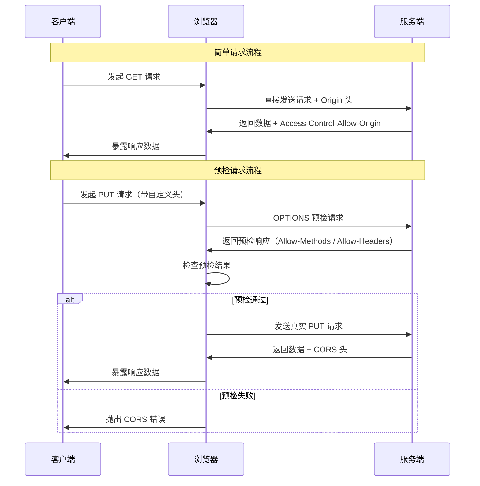

# CORS 跨域请求深度剖析

## 引子：前端最头疼的报错

```
Access to fetch at 'http://api.example.com/data' 
from origin 'http://localhost:3000' 
has been blocked by CORS policy: 
No 'Access-Control-Allow-Origin' header is present...
```

每个前端开发者都见过这个报错。

为什么浏览器要阻止跨域请求？因为**同源策略**——浏览器的核心安全机制，防止恶意网站窃取其他网站的数据。

但开发中又经常需要跨域。解决方案：**服务端显式声明"我允许这个来源访问"**。

这就是 CORS。

---

> 📚 **前置知识**：[CORS 安全](../../09.front-end/07-security/cors/README.md)

## 一、核心原理

### 1.1 同源策略（Same-Origin Policy）

同源策略是浏览器最核心的安全机制之一，由 Netscape 在 1995 年引入。其核心思想是：**限制不同源的文档或脚本之间的交互**，防止恶意网站窃取另一个网站的数据。

**"源"的定义**由三个要素组成：

| 要素 | 说明 | 示例 |
|------|------|------|
| 协议（Protocol） | http / https / ftp 等 | `https://` |
| 域名（Host） | 完整域名 | `api.example.com` |
| 端口（Port） | 默认端口可省略 | `:8080` |

只有当**协议、域名、端口三者完全一致**时，才视为同源。任意一项不同即为跨域。

### 1.2 跨域场景举例

```
同源示例：
  https://www.example.com/page  ↔  https://www.example.com/api/data   ✅

跨域示例：
  https://www.example.com       ↔  http://www.example.com              ❌ 协议不同
  https://www.example.com       ↔  https://api.example.com             ❌ 域名不同
  https://www.example.com:8080  ↔  https://www.example.com:3000        ❌ 端口不同
  https://a.example.com         ↔  https://b.example.com               ❌ 子域名不同
```

### 1.3 哪些标签天然支持跨域？

浏览器对部分资源加载标签做了例外处理，它们**不受同源策略限制**：

- `<script src="...">` — JSONP 的基础
- `` — 图片资源
- `<link rel="stylesheet" href="...">` — CSS 样式表
- `<video>` / `<audio>` — 媒体资源
- `<iframe>` — 但跨域 iframe 的 DOM 不可访问

CORS 的出现，正是为了给这些例外提供一套**可控、规范**的跨域通信机制。

---

## 二、简单请求 vs 预检请求

浏览器将 CORS 请求分为两类：**简单请求**和**预检请求**。判断标准如下：

### 2.1 简单请求的条件

必须**同时满足**以下所有条件：

1. **请求方法**仅限于：`GET`、`HEAD`、`POST`
2. **Content-Type** 仅限于：
   - `application/x-www-form-urlencoded`
   - `multipart/form-data`
   - `text/plain`
3. **无自定义请求头**（仅允许浏览器自动添加的标准头部，如 `Accept`、`Accept-Language`、`Content-Language` 等）
4. **XMLHttpRequest.upload** 未注册任何事件监听器
5. 请求中未使用 `ReadableStream` 对象

### 2.2 预检请求（Preflight Request）

只要不满足上述任一条件，浏览器就会先发送一个 `OPTIONS` 方法的预检请求，询问服务器是否允许该跨域请求。

预检请求携带的关键头部：

```
OPTIONS /api/data HTTP/1.1
Origin: https://www.example.com
Access-Control-Request-Method: PUT
Access-Control-Request-Headers: X-Custom-Header, Content-Type
```

只有在预检通过后，浏览器才会发送真正的业务请求。

### 2.3 流程对比图



---

## 三、CORS 响应头详解

服务端通过以下响应头控制跨域行为：

### 3.1 核心响应头

| 响应头 | 说明 | 示例值 |
|--------|------|--------|
| `Access-Control-Allow-Origin` | 允许的源，可为具体源或 `*` | `https://www.example.com` 或 `*` |
| `Access-Control-Allow-Methods` | 允许的 HTTP 方法 | `GET, POST, PUT, DELETE, OPTIONS` |
| `Access-Control-Allow-Headers` | 允许的请求头字段 | `X-Custom-Header, Content-Type` |
| `Access-Control-Expose-Headers` | 允许前端访问的响应头 | `X-Total-Count, X-Page-Info` |
| `Access-Control-Max-Age` | 预检请求缓存时间（秒） | `86400`（24 小时） |
| `Access-Control-Allow-Credentials` | 是否允许携带凭证（Cookie） | `true` 或 不设置 |

### 3.2 关键细节

**Access-Control-Allow-Origin**

- 值为 `*` 时，表示允许任意源访问，但**不能与 Allow-Credentials: true 共存**
- 值为具体源时，必须包含完整的协议、域名和端口

**Access-Control-Expose-Headers**

- 默认情况下，前端只能访问 6 个简单响应头：`Cache-Control`、`Content-Language`、`Content-Type`、`Expires`、`Last-Modified`、`Pragma`
- 如需访问其他自定义响应头，必须在 `Expose-Headers` 中显式声明

**Access-Control-Max-Age**

- 控制预检结果的缓存时长，避免每次请求都发送 OPTIONS
- 过短会导致频繁预检，过长可能导致策略更新不及时
- Chrome 上限为 2 小时（7200 秒），Firefox 上限为 24 小时

---

## 四、带 Cookie 的跨域

### 4.1 前端配置

```javascript
// XMLHttpRequest
const xhr = new XMLHttpRequest();
xhr.withCredentials = true;
xhr.open('GET', 'https://api.example.com/data');
xhr.send();

// Fetch API
fetch('https://api.example.com/data', {
  credentials: 'include'  // 等同于 withCredentials
});

// Axios
axios.get('https://api.example.com/data', {
  withCredentials: true
});
```

### 4.2 后端配置

```nginx
# Nginx 示例
add_header 'Access-Control-Allow-Origin' 'https://www.example.com';
add_header 'Access-Control-Allow-Credentials' 'true';
```

```java
// Spring Boot 示例
@CrossOrigin(origins = "https://www.example.com", allowCredentials = "true")
@GetMapping("/data")
public ResponseEntity<Data> getData() { ... }
```

### 4.3 核心规则

| 配置项 | 要求 |
|--------|------|
| `withCredentials: true` | 前端开启凭证传输 |
| `Allow-Credentials: true` | 服务端必须显式允许 |
| `Allow-Origin` | **不能为 `*`**，必须是具体源 |
| Cookie 作用域 | Cookie 仍需符合 `Domain` 和 `Path` 限制 |

⚠️ **常见错误**：前端设置了 `withCredentials: true`，但服务端返回 `Allow-Origin: *`，浏览器会拒绝该响应并抛出 CORS 错误。

---

## 五、解决方案对比

### 5.1 方案总览

| 方案 | 适用场景 | 优点 | 缺点 |
|------|----------|------|------|
| CORS | 现代 Web 应用主流方案 | 标准化、支持所有 HTTP 方法 | 需要服务端配合配置 |
| JSONP | 老旧浏览器兼容 | 无需服务端特殊配置 | 仅支持 GET、有安全风险 |
| Nginx 反向代理 | 前后端分离部署 | 前端无感知、性能高 | 需要运维支持 |
| WebSocket | 实时双向通信 | 不受同源策略限制 | 协议不同、需单独维护连接 |

### 5.2 JSONP 原理与限制

**原理**：利用 `<script>` 标签不受同源策略限制的特性，通过动态创建 script 标签加载跨域数据。

```javascript
// 前端
function handleResponse(data) {
  console.log('收到数据:', data);
}
const script = document.createElement('script');
script.src = 'https://api.example.com/data?callback=handleResponse';
document.body.appendChild(script);

// 服务端返回
// handleResponse({"name": "Alice", "age": 25})
```

**限制**：

1. **仅支持 GET 请求**，无法实现 POST/PUT/DELETE
2. **存在 XSS 风险**，执行的代码来自第三方服务器
3. **缺乏错误处理机制**，无法捕获网络错误
4. **非标准化方案**，逐渐被 CORS 取代

### 5.3 Nginx 反向代理方案

通过在 Nginx 层配置反向代理，将跨域请求转化为同源请求：

```nginx
server {
    listen 80;
    server_name www.example.com;

    # 前端静态资源
    location / {
        root /usr/share/nginx/html;
        index index.html;
    }

    # API 代理
    location /api/ {
        proxy_pass https://api.backend-server.com/;
        proxy_set_header Host api.backend-server.com;
        proxy_set_header X-Real-IP $remote_addr;
    }
}
```

前端访问 `/api/data` 时，Nginx 会将请求转发到 `https://api.backend-server.com/api/data`，对浏览器而言始终是同源请求。

### 5.4 WebSocket 跨域

WebSocket 握手阶段虽然会发送 `Origin` 头，但**不受同源策略限制**。服务端可以选择验证或忽略 Origin：

```javascript
const ws = new WebSocket('wss://ws.example.com/chat');
ws.onmessage = (event) => {
  console.log('收到消息:', event.data);
};
```

服务端可通过检查 `Origin` 头实现自己的跨域控制策略。

---

## 六、常见陷阱

### 6.1 预检请求缓存问题

```http
# 服务端返回
Access-Control-Max-Age: 86400
```

预检结果会被浏览器缓存，在缓存期内不会再次发送 OPTIONS 请求。这在开发调试时可能导致：

- 修改服务端 CORS 配置后，前端仍使用旧的缓存策略
- 清除浏览器缓存或使用隐私模式重新测试

### 6.2 重定向导致的跨域

当服务端返回 3xx 重定向时：

- 某些浏览器在跟随重定向时会**丢失原始请求的认证信息**
- 重定向目标 URL 可能触发新的跨域检查
- 建议服务端直接返回最终地址，避免 CORS 请求链中出现重定向

### 6.3 自定义头部触发预检

即使使用 `GET` 方法，添加自定义头部也会触发预检：

```javascript
// 这会触发预检请求
fetch('https://api.example.com/data', {
  headers: {
    'X-API-Key': 'secret-key'  // 自定义头部
  }
});
```

优化方案：将令牌放入查询参数或使用标准头部。

### 6.4 CORS 与 CSRF 的关系

| 维度 | CORS | CSRF |
|------|------|------|
| 目的 | 允许受控的跨域资源访问 | 防止未经授权的跨站请求伪造 |
| 机制 | 服务端通过响应头声明允许策略 | 服务端验证请求来源和令牌 |
| 关系 | CORS 不影响 CSRF 防护 | **CORS 配置不当可能削弱 CSRF 防护** |

⚠️ **重要提醒**：

- CORS 是浏览器的安全机制，**不是身份验证机制**
- 即使配置了 `Allow-Origin: *`，CSRF Token 验证仍然必要
- `Allow-Credentials: true` 时，必须配合严格的 Origin 白名单和 CSRF Token 验证

---

## 七、面试话术（30 秒版）

> "CORS 是浏览器基于同源策略的跨域安全机制。同源由协议、域名、端口三者决定，任一不同即为跨域。
>
> CORS 请求分为简单请求和预检请求。简单请求仅限 GET/HEAD/POST 方法，Content-Type 限于 form-data 等三种，且无自定义头部。不满足条件时会先发送 OPTIONS 预检请求，携带 Access-Control-Request-Method 和 Headers 头部询问服务端。
>
> 服务端通过 Access-Control-Allow-Origin/Methods/Headers 等响应头声明允许的跨域策略。需要注意 Allow-Origin 为星号时不能与 Allow-Credentials 共存，带 Cookie 跨域时必须指定具体源且前端设置 withCredentials。
>
> 除 CORS 外，还有 JSONP（仅 GET、已淘汰）、Nginx 反向代理（同源化）、WebSocket（不受同源限制）等方案。生产环境推荐 CORS + CSRF Token 双重防护。"

---

## 八、交叉引用

- 主模块：[`09.front-end`](../../../09.front-end/) — 前端知识体系
- [CORS 安全](../../../09.front-end/07-security/cors/README.md) — CORS 详解与最佳实践
- [CSRF 防护](../../../09.front-end/07-security/csrf/README.md) — CSRF 攻击与防御
