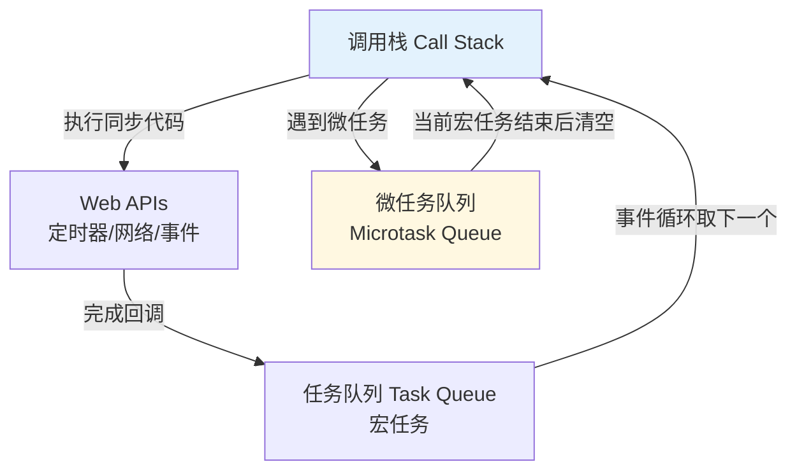

<!--
question:
  id: 09.front-end-event-loop
  topic: 09.front-end
  difficulty: ⭐⭐⭐⭐
  frequency: 中频
  scenario_type: 反直觉代码
  tags: [09.front-end, Loop, event]
-->

# 事件循环（Event Loop）

## 引子：这段代码的输出顺序是什么？

```javascript
console.log("1")

setTimeout(() => {
  console.log("2")
}, 0)

Promise.resolve().then(() => {
  console.log("3")
})

console.log("4")

// 输出：1 → 4 → 3 → 2
// 为什么 setTimeout 在 Promise 后面？
```

`setTimeout(fn, 0)` 不是"立即执行"吗？为什么 `Promise.then` 先执行了？

答案藏在 JavaScript 的**事件循环**机制里。单线程的 JS 通过事件循环实现了"非阻塞"异步，但执行顺序有讲究：**同步 → 微任务 → 宏任务**。

---

> 📚 **前置知识**：[浏览器渲染](../../../09.front-end/01-foundation/browser-rendering/README.md)

## 一、核心原理

### 为什么需要事件循环？

JavaScript 设计之初是为了处理用户交互和操作 DOM，如果用多线程会产生复杂的同步问题（比如同时操作 DOM 会冲突）。所以 JS 是**单线程**的。

但单线程意味着**一个任务会阻塞后续任务**。为了不让耗时的 I/O 操作（网络请求、定时器）阻塞主线程，浏览器引入了**事件循环机制**：把耗时任务交给浏览器其他线程处理，主线程继续执行后续代码，等耗时任务完成后再回到主线程执行回调。

### 执行模型



**核心机制**：
1. **调用栈（Call Stack）**：同步代码在此执行，LIFO（后进先出）
2. **Web APIs**：浏览器提供的异步 API（setTimeout、fetch、DOM 事件）
3. **宏任务队列（Macrotask / Task Queue）**：setTimeout、setInterval、I/O、UI 渲染 的回调
4. **微任务队列（Microtask Queue）**：Promise.then、MutationObserver、queueMicrotask 的回调

### 事件循环顺序

**一个完整的事件循环 tick**：
1. 执行一个**宏任务**（首次执行全局脚本）
2. 执行过程中产生的**微任务**全部清空
3. **UI 渲染**（浏览器可能跳过，如果帧率足够）
4. 取下一个**宏任务**，重复

> **关键**：微任务优先级高于宏任务。**每个宏任务结束后，必须清空微任务队列**，才能执行下一个宏任务。

---

## 二、代码示例

### 经典面试题

```javascript
console.log('1: sync')

setTimeout(() => {
  console.log('2: setTimeout')
}, 0)

Promise.resolve().then(() => {
  console.log('3: promise')
})

console.log('4: sync')

// 输出顺序：
// 1: sync
// 4: sync
// 3: promise     ← 微任务优先
// 2: setTimeout  ← 下一个宏任务
```

### 嵌套微任务

```javascript
setTimeout(() => {
  console.log('timeout 1')
  Promise.resolve().then(() => console.log('promise 1'))
}, 0)

setTimeout(() => {
  console.log('timeout 2')
}, 0)

// 输出：
// timeout 1
// promise 1    ← 当前宏任务中的微任务立即执行
// timeout 2
```

### async/await 的本质

```javascript
async function async1() {
  console.log('async1 start')
  await async2()
  console.log('async1 end')  // ← 这行是微任务
}

async function async2() {
  console.log('async2')
}

console.log('script start')
async1()
console.log('script end')

// 输出：
// script start
// async1 start
// async2
// script end
// async1 end    ← await 后面的代码变成微任务
```

**原理**：`async/await` 是 Promise 的语法糖。`await` 之后的代码会被"切割"到 `Promise.then()` 的回调中，成为微任务。

---

## 三、常见陷阱

### 陷阱 1：setTimeout(fn, 0) 不是立即执行

```javascript
console.log('A')
setTimeout(() => console.log('B'), 0)
console.log('C')

// 输出：A → C → B（不是 A → B → C）
```

`setTimeout(fn, 0)` 表示"尽快执行"，但要等**当前调用栈清空 + 微任务清空**后才能执行。实际延迟通常是 4ms+（浏览器规范最小值）。

### 陷阱 2：微任务中再产生微任务

```javascript
Promise.resolve().then(() => {
  console.log('P1')
  Promise.resolve().then(() => console.log('P2'))
}).then(() => console.log('P3'))

// 输出：P1 → P2 → P3（不是 P1 → P3 → P2）
```

微任务执行过程中产生的新微任务，会**在当前微任务队列清空前全部执行**。

### 陷阱 3：Node.js 的差异

Node.js 使用 libuv，有 **6 个阶段**的事件循环（timers → pending → poll → check 等），`process.nextTick` 优先级最高（在所有微任务之前）。

| 机制 | 浏览器 | Node.js |
|------|--------|---------|
| 微任务 | Promise.then / MutationObserver | Promise.then + process.nextTick |
| 优先级 | 微任务 > 宏任务 | nextTick > 其他微任务 > 宏任务 |

---

## 四、最佳实践

### 1. 避免微任务堆积导致主线程阻塞

```javascript
// ❌ 反模式：大量同步 Promise 阻塞主线程
for (let i = 0; i < 1000000; i++) {
  Promise.resolve().then(() => heavySyncWork())
}

// ✅ 正确：分批处理 + requestIdleCallback
function processInChunks(items, chunkSize = 100) {
  let index = 0
  function processChunk() {
    const end = Math.min(index + chunkSize, items.length)
    for (; index < end; index++) {
      heavySyncWork(items[index])
    }
    if (index < items.length) {
      requestIdleCallback(processChunk)  // 让出主线程
    }
  }
  processChunk()
}
```

### 2. 用 `queueMicrotask` 明确微任务语义

```javascript
// 明确表达"我想在下一个微任务执行"
queueMicrotask(() => {
  console.log('next microtask')
})
```

### 3. 注意 React/Vue 中的异步更新

```javascript
// React 18 批量更新
setState(1)
setState(2)
// 只触发一次渲染（batch update）

// 但要小心：setTimeout 中的 setState 不会被批量处理（React 17 及之前）
setTimeout(() => {
  setState(1)  // 渲染一次
  setState(2)  // 又渲染一次
}, 0)
```

---

## 五、面试话术（30 秒版）

> "JavaScript 是单线程的，通过事件循环实现异步。调用栈执行同步代码，遇到异步 API（如 setTimeout、Promise）就交给 Web APIs。完成后回调进入任务队列——宏任务（setTimeout）和微任务（Promise.then）分开排队。
> 
> 事件循环的规则是：**执行一个宏任务，然后清空所有微任务，再执行下一个宏任务**。微任务优先级高于宏任务，所以 Promise.then 总是比 setTimeout 先执行。
> 
> async/await 本质是 Promise 的语法糖，await 后面的代码会被切成微任务。"

---

## 六、延伸问题

面试官可能追问：

| 追问 | 答案要点 |
|------|---------|
| **为什么微任务优先级高于宏任务？** | 微任务设计初衷是"在当前宏任务结束前尽快执行"，避免 UI 渲染后的状态不一致 |
| **requestAnimationFrame 是宏任务还是微任务？** | 宏任务，但在 UI 渲染前执行（特殊时机） |
| **MutationObserver 为什么是微任务？** | 需要批量处理 DOM 变化，在所有同步代码完成后统一处理 |
| **Node.js 事件循环和浏览器的区别？** | Node.js 有 6 阶段，process.nextTick 优先级最高 |

---

## 七、交叉引用

- 主模块：[`09.front-end/message/`](../message/) — 消息机制基础
- 主模块：[`09.front-end/`](../../09.front-end/) — 前端知识体系
- 相关：[`13.split-hairs/09.front-end/promise-handwriting/`](../promise-handwriting/) — Promise 手写实现
- 相关：[`13.split-hairs/09.front-end/closure/`](../closure/) — 闭包与事件循环配合

## 相关章节

- 深度阅读：[`09.front-end`](../../09.front-end/README.md) — 主模块详细内容

← [返回: 咬文嚼字 · event-loop](README.md)
