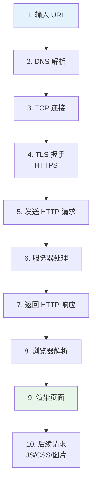
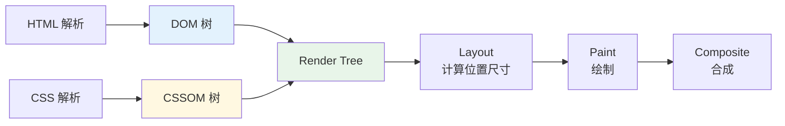

# 从输入 URL 到页面展示全过程

## 引子：一道题考遍所有知识

```
你在浏览器输入：https://www.google.com
按下回车
```

接下来 300 毫秒内发生了什么？

这道题是前端面试的"终极综合题"，一道题考遍：

1. **DNS 解析**：域名 → IP 地址
2. **TCP 连接**：三次握手
3. **TLS 握手**（HTTPS）：加密协商
4. **HTTP 请求**：发送请求报文
5. **服务器处理**：路由、数据库、渲染 HTML
6. **浏览器解析**：HTML → DOM → CSSOM → 渲染树
7. **页面绘制**：Layout → Paint → Composite

一道题，把前端的知识体系全部串起来。

---

## 一、全流程概览



---

## 二、各阶段详解

### 1. URL 解析

浏览器先解析 URL：`https://www.example.com:443/path?query=1#hash`
- 协议：`https`
- 主机：`www.example.com`
- 端口：`443`（HTTPS 默认）
- 路径：`/path`
- 查询参数：`query=1`
- 哈希：`#hash`

### 2. DNS 解析

域名 → IP 地址的查找过程：

```
浏览器缓存 → 系统缓存 → 路由器缓存 → ISP DNS → 根域名服务器 → 顶级域 → 权威域
```

**优化点**：
- DNS 预解析：`<link rel="dns-prefetch" href="//api.example.com">`
- HTTP/2+ 的 DNS 缓存更久

### 3. TCP 连接（三次握手）

```
客户端 → SYN → 服务端
客户端 ← SYN-ACK ← 服务端
客户端 → ACK → 服务端
```

**优化点**：
- TCP  Fast Open（TFO）
- 连接复用（HTTP/2 多路复用）

### 4. TLS 握手（HTTPS）

```
客户端 → ClientHello（支持的加密套件）→ 服务端
客户端 ← ServerHello（选定加密套件 + 证书）← 服务端
客户端 → 验证证书 + 生成预主密钥 → 服务端
客户端 ← Finished ← 服务端
```

**TLS 1.3 优化**：握手从 2-RTT 减少到 1-RTT。

### 5. 发送 HTTP 请求

```http
GET /path?query=1 HTTP/1.1
Host: www.example.com
User-Agent: Mozilla/5.0
Accept: text/html
Cookie: session=abc123
```

### 6. 服务器处理

- Web 服务器（Nginx / Apache）接收请求
- 应用服务器（Node / Spring）处理业务逻辑
- 可能查询数据库、调用其他服务
- 生成 HTML 响应

### 7. 返回 HTTP 响应

```http
HTTP/1.1 200 OK
Content-Type: text/html; charset=utf-8
Content-Length: 12345
Set-Cookie: token=xyz

<!DOCTYPE html>
<html>
<head>...</head>
<body>...</body>
</html>
```

### 8. 浏览器解析



**关键点**：
- HTML 解析遇 `<script>` 阻塞（除非 `defer` / `async`）
- CSS 阻塞渲染（必须构建 CSSOM）
- JS 执行可能修改 DOM / CSSOM

### 9. 渲染页面

- Layout → Paint → Composite → 显示到屏幕
- JS 执行（DOMContentLoaded 触发）
- 后续资源加载（图片、字体、异步脚本）
- `load` 事件触发

### 10. 后续请求

浏览器根据 HTML 中的引用继续请求：
- `<link rel="stylesheet">` → CSS
- `<script src>` → JS
- `` → 图片
- `@font-face` → 字体
- `fetch()` / `XMLHttpRequest` → AJAX

---

## 三、性能优化点

| 阶段 | 优化手段 |
|------|---------|
| DNS | DNS 预解析、DNS 缓存 |
| TCP | 连接复用、TCP Fast Open |
| TLS | TLS 1.3、会话复用 |
| HTTP | HTTP/2 多路复用、头部压缩、服务端推送 |
| 服务器 | CDN、缓存、压缩（Brotli） |
| 浏览器 | 关键 CSS 内联、JS defer/async、资源预加载 |
| 渲染 | 减少重排重绘、GPU 合成层 |

---

## 四、面试话术（60 秒版）

> "整个过程可以分 4 大块：
> 
> **网络阶段**：
> 1. 浏览器解析 URL
> 2. DNS 解析（域名 → IP），有缓存链路
> 3. TCP 三次握手（HTTP/2+ 可复用连接）
> 4. HTTPS 的 TLS 握手（TLS 1.3 只要 1-RTT）
> 5. 发送 HTTP 请求，服务器处理后返回响应
> 
> **解析阶段**：
> 6. 浏览器解析 HTML 构建 DOM 树，解析 CSS 构建 CSSOM 树
> 7. 合并为 Render Tree（去掉不可见节点）
> 
> **渲染阶段**：
> 8. Layout 计算位置尺寸
> 9. Paint 绘制像素
> 10. Composite GPU 合成
> 11. 显示到屏幕
> 
> **后续**：
> 12. 继续请求其他资源（JS、CSS、图片、字体）
> 13. JS 执行，可能修改 DOM 触发重新渲染
> 14. `load` 事件触发
> 
> **优化切入点**：DNS 预解析、连接复用、CDN、关键 CSS 内联、JS defer/async、减少重排重绘。"

---

## 五、交叉引用

- 主模块：[`09.front-end`](../../../09.front-end/) — 前端知识体系
- [浏览器渲染](../../../09.front-end/01-foundation/browser-rendering/README.md) — 浏览器渲染原理详解
