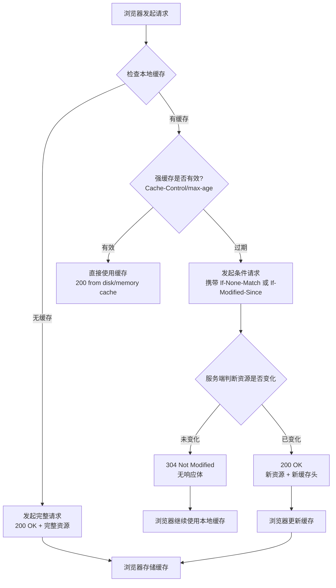

<!--
question:
  id: 09.front-end-http-cache
  topic: 09.front-end
  difficulty: 未标
  frequency: 中频
  scenario_type: 性能对比
  tags: [09.front-end, HTTP, http]
-->

# HTTP 缓存机制深度剖析

## 引子：为什么刷新页面有时快有时慢？

```
第一次访问：加载 2 秒
Ctrl+F5 强制刷新：还是 2 秒
普通刷新（F5）：0.5 秒！
再次访问：0.1 秒！
```

同一个页面，加载时间差了 **20 倍**。秘密就在 HTTP 缓存。

- **强缓存**：浏览器直接从本地读，不发请求（最快，0.1 秒）
- **协商缓存**：发一个轻量请求问服务端"文件变了吗？"（0.5 秒）
- **无缓存**：完整下载（2 秒）

两层缓存策略，在"性能"和"数据新鲜度"之间取得平衡。

---

> 📚 **前置知识**：[浏览器渲染](../../../09.front-end/01-foundation/browser-rendering/README.md)

## 一、核心原理

HTTP 缓存的核心思想是**"能不用网络就不用网络"**，分为两个层级：

**强缓存（Strong Cache）**：浏览器直接从本地缓存中读取资源，完全不发起网络请求。这是最高效的缓存方式，用户感知为瞬间加载。强缓存的有效期由服务端在响应头中设定（`Cache-Control: max-age` 或 `Expires`），在有效期内浏览器认为资源"绝对新鲜"，不会有任何网络活动。

**协商缓存（Negotiated Cache / Revalidation）**：当强缓存过期后，浏览器会向服务端发起一个"条件请求"（Conditional Request），携带资源的标识信息（ETag 或 Last-Modified）。服务端收到后判断资源是否真正发生变化：如果未变化，返回 `304 Not Modified`（无响应体，仅头部），浏览器继续使用本地缓存；如果已变化，返回 `200 OK` 和完整的新资源。协商缓存的本质是**用一次轻量级请求换取缓存有效性的确认**。

两者的关系是**串联执行**：浏览器先检查强缓存，命中则直接使用；未命中则进入协商缓存流程。这种设计在"缓存命中率"和"数据一致性"之间取得了平衡。

---

## 二、强缓存

强缓存完全依赖响应头中的缓存指令，浏览器在有效期内不会发起任何网络请求。

### 2.1 Cache-Control（HTTP/1.1，推荐）

`Cache-Control` 是 HTTP/1.1 引入的通用缓存控制字段，支持多个指令组合，优先级高于 `Expires`。常见取值如下：

| 指令 | 含义 | 典型场景 |
|------|------|----------|
| `max-age=N` | 资源在 N 秒内视为新鲜，N 秒后过期 | `max-age=31536000`（一年，用于带 hash 的静态资源） |
| `no-cache` | **每次使用前必须向服务端协商验证**，并非不缓存 | HTML 文档，确保页面结构最新 |
| `no-store` | 完全不缓存，包括响应体和元数据 | 敏感数据（密码、银行卡号） |
| `public` | 允许代理服务器（CDN、企业网关）缓存 | CDN 分发静态资源 |
| `private` | 仅终端浏览器可缓存，代理不可缓存 | 用户个性化内容 |
| `max-stale=N` | 允许使用过期不超过 N 秒的缓存 | 弱网环境下的降级策略 |
| `immutable` | 资源永不变，刷新页面也不重新验证 | 带 content-hash 的文件名 |

**关键细节**：
- `no-cache` 的命名具有误导性，它实际意思是"不直接使用缓存，每次都协商"，而非"不存储缓存"。真正的"不缓存"是 `no-store`。
- `max-age=0` 等价于 `no-cache`，都会触发协商缓存。
- `public/private` 主要影响共享缓存（如 CDN），对浏览器自身缓存行为无影响。
- 多个指令可以组合：`Cache-Control: public, max-age=31536000, immutable`。

### 2.2 Expires（HTTP/1.0，已废弃）

`Expires` 是 HTTP/1.0 的产物，值为一个绝对的 GMT 时间字符串，例如：

```
Expires: Wed, 21 Oct 2026 07:28:00 GMT
```

**缺陷**：
1. **时钟偏移问题**：如果客户端系统时间与服务端时间不一致，缓存行为会出错。例如客户端时间快了 1 小时，可能导致缓存提前过期或永远不过期。
2. **绝对时间的局限性**：无法表达相对有效期，服务端修改时间需要同步更新所有资源的 Expires 值。
3. **优先级低**：当 `Cache-Control` 和 `Expires` 同时存在时，浏览器以 `Cache-Control` 为准。

在现代 Web 开发中，`Expires` 仅作为 HTTP/1.0 兼容保留，实际应始终使用 `Cache-Control`。

---

## 三、协商缓存

当强缓存过期后，浏览器进入协商缓存阶段。协商缓存需要向服务端发起请求，但通过条件验证机制，可以在资源未变化时避免传输完整的响应体。

### 3.1 ETag + If-None-Match（优先方案）

**工作流程**：
1. 首次请求：服务端返回资源时，计算内容的哈希值（或采用版本号等策略），放入响应头 `ETag`。
   ```
   ETag: "a1b2c3d4e5f6"
   ```
2. 后续请求（强缓存过期后）：浏览器在请求头中携带 `If-None-Match`，值为上次收到的 ETag。
   ```
   If-None-Match: "a1b2c3d4e5f6"
   ```
3. 服务端比对：如果当前资源的 ETag 与 `If-None-Match` 匹配，返回 `304 Not Modified`；否则返回 `200 OK` 和新资源。

**优势**：
- **精确性高**：ETag 通常基于文件内容生成（如 MD5、SHA-1），内容不变则 ETag 不变，不会出现误判。
- **灵活性高**：服务端可以采用任意策略生成 ETag（内容哈希、版本号、时间戳组合等）。

**劣势**：
- **计算开销**：生成内容哈希需要额外的 CPU 计算，大文件尤其明显。
- **集群一致性**：在分布式部署中，不同服务器生成的 ETag 必须一致，否则会导致缓存失效。常见解决方案是使用统一的内容哈希算法或共享存储。

### 3.2 Last-Modified + If-Modified-Since（备选方案）

**工作流程**：
1. 首次请求：服务端返回资源的最后修改时间。
   ```
   Last-Modified: Wed, 21 Oct 2026 07:28:00 GMT
   ```
2. 后续请求：浏览器携带 `If-Modified-Since`，值为上次收到的 Last-Modified。
   ```
   If-Modified-Since: Wed, 21 Oct 2026 07:28:00 GMT
   ```
3. 服务端比对文件的最后修改时间：如果未变化，返回 `304`；否则返回 `200` 和新资源。

**劣势**：
- **秒级精度**：Last-Modified 的时间精度为秒，如果文件在 1 秒内被多次修改，可能检测不到变化。
- **误判问题**：文件内容可能未变化但修改时间变了（如 CI/CD 流水线重新打包），导致不必要的缓存失效。
- **无法处理未来时间**：如果服务端时钟错误，设置了未来的 Last-Modified，缓存将永久失效。

**最佳实践**：ETag 和 Last-Modified 可以同时存在，浏览器会优先使用 ETag 进行协商。现代 Web 框架（如 Nginx、Express）默认同时设置这两个字段，兼顾兼容性和精确性。

### 3.3 304 响应的特征

`304 Not Modified` 是一个特殊的响应状态码，其核心特征是：
- **无响应体**：服务端不返回资源内容，仅返回响应头，大幅减少传输量。
- **携带更新的缓存元数据**：304 响应中可以包含新的 `Cache-Control`、`ETag` 等头部，浏览器会更新本地缓存的元数据，延长下一次强缓存的有效期。
- **必要的头部**：304 响应必须包含 `ETag` 或 `Last-Modified`（如果首次响应中有），以便浏览器进行后续的协商。

---

## 四、缓存决策流程

浏览器的缓存决策是一个严格的线性流程，如下图所示：



**流程详解**：
1. **内存缓存（Memory Cache）优先**：浏览器首先检查内存中是否有缓存（如刚刚访问过的资源），命中则瞬间返回，显示为 `200 (from memory cache)`。
2. **磁盘缓存（Disk Cache）**：内存未命中则检查磁盘缓存，命中且强缓存有效则返回 `200 (from disk cache)`。
3. **强缓存过期**：进入协商缓存流程，发起条件请求。
4. **304 响应**：服务端确认资源未变化，浏览器继续使用本地缓存，并更新缓存元数据（如新的 ETag、延长的 max-age）。
5. **200 新资源**：服务端返回完整的新资源，浏览器替换本地缓存。

**缓存存储位置优先级**：Memory Cache > Disk Cache > Network。Memory Cache 速度快但生命周期短（页面关闭即释放），Disk Cache 持久化但读取较慢。

---

## 五、实战配置

不同类型的资源应采用不同的缓存策略，核心原则是：**高频变化的资源用协商缓存，低频变化的资源用强缓存**。

### 5.1 HTML 文档：no-cache（每次协商）

HTML 是页面的入口，变化频率高且无法通过文件名 hash 区分版本，应采用 `no-cache` 策略：

```nginx
location ~* \.html$ {
    add_header Cache-Control "no-cache, no-store, must-revalidate";
    add_header Pragma "no-cache";
    expires -1;
}
```

**为什么加 no-store？** 某些旧版浏览器对 `no-cache` 的支持不完善，叠加 `no-store` 可以确保缓存行为一致。`must-revalidate` 表示缓存过期后必须向服务端验证，不能使用过期缓存。

### 5.2 JS/CSS/图片：max-age + 文件名 hash（长期强缓存）

带有内容哈希的静态资源（如 `app.a1b2c3.js`）可以采用长期强缓存：

```nginx
location ~* \.(js|css|png|jpg|jpeg|gif|svg|woff2)$ {
    # 文件名包含 hash 时
    add_header Cache-Control "public, max-age=31536000, immutable";
    # 文件名不包含 hash 时（fallback）
    # add_header Cache-Control "public, max-age=604800";  # 7天
}
```

**关键点**：
- `immutable` 告诉浏览器该资源永不变，即使用户刷新页面也不会重新验证，进一步提升性能。
- 部署新版本时，通过构建工具（Webpack、Vite）生成新的文件名 hash，实现缓存自动失效。
- 对于不带 hash 的静态资源，设置较短的 max-age（如 7 天），平衡缓存命中率和更新及时性。

### 5.3 API 接口：按需配置

```nginx
location /api/ {
    # 实时数据：不缓存
    add_header Cache-Control "no-store";

    # 半实时数据：短时间强缓存 + 后台 revalidate
    # add_header Cache-Control "public, max-age=60, stale-while-revalidate=300";
}
```

**stale-while-revalidate**：允许在 max-age 过期后的指定时间内继续使用过期缓存，同时在后台异步更新缓存。适用于对实时性要求不高的数据接口。

### 5.4 CDN 缓存配置

CDN 作为共享缓存，需要显式设置 `public` 指令：

```
Cache-Control: public, max-age=86400, s-maxage=604800
```

- `s-maxage`：专门针对共享缓存（CDN）的 max-age，优先级高于 `max-age`。
- 当 `s-maxage` 和 `max-age` 同时存在时，浏览器使用 `max-age`，CDN 使用 `s-maxage`。
- CDN 缓存过期后，CDN 节点会向源站发起协商请求，减轻源站压力。

---

## 六、常见陷阱

### 6.1 no-cache 不是"不缓存"

这是最常见的误解。`no-cache` 的实际含义是**"每次使用前必须协商验证"**，浏览器仍然会存储缓存，只是在强缓存层面标记为"立即过期"。真正的"不缓存"是 `no-store`，它连缓存都不会存储。

**面试话术**："no-cache 是每次都去问服务端资源有没有变，但缓存还在；no-store 是根本不存缓存，每次都重新下载。"

### 6.2 Service Worker 拦截缓存

当页面注册了 Service Worker 时，SW 的 `fetch` 事件会拦截网络请求，浏览器原生的 HTTP 缓存机制可能被绕过。SW 内部的缓存策略（如 Cache First、Network First、Stale While Revalidate）会覆盖 HTTP 缓存头。

**调试技巧**：在 Chrome DevTools 的 Application > Service Workers 中勾选 "Bypass for network"，可以暂时禁用 SW 拦截，观察原生 HTTP 缓存行为。

### 6.3 浏览器后退按钮的缓存行为

点击浏览器后退按钮时，浏览器通常会从 **Back-Forward Cache（bfcache）** 中恢复页面，这是一个特殊的内存缓存，存储的是完整的页面状态（包括 DOM、JS 执行状态）。bfcache 独立于 HTTP 缓存，即使 HTTP 缓存设置为 `no-store`，bfcache 仍可能生效。

**强制刷新**：用户按 `Ctrl+F5`（Windows）或 `Cmd+Shift+R`（Mac）时，浏览器会发送 `Cache-Control: no-cache` 的请求头，强制跳过强缓存并重新验证。

### 6.4 Vary 头导致的缓存失效

`Vary` 头告诉浏览器哪些请求头会影响响应内容。例如 `Vary: Accept-Encoding` 表示不同编码（gzip/br）对应不同的响应。如果 `Vary` 设置不当（如 `Vary: *`），可能导致缓存永远无法命中。

**最佳实践**：仅在必要时设置 `Vary`，且只列出真正影响响应内容的请求头。

### 6.5 HTTPS 与缓存

早期浏览器对 HTTPS 资源默认不缓存，但现代浏览器（Chrome、Firefox、Safari）已取消这一限制。只要响应头中包含明确的缓存指令（`Cache-Control`、`ETag`），HTTPS 资源同样可以被缓存。区别在于：HTTPS 的缓存仅存储在磁盘加密区域，不会被其他应用读取。

---

## 七、面试话术（30 秒版）

> "HTTP 缓存分两级：强缓存和协商缓存。强缓存靠 `Cache-Control: max-age` 控制，有效期内浏览器不发请求，直接从本地读取；协商缓存在强缓存过期后触发，通过 `ETag + If-None-Match` 或 `Last-Modified + If-Modified-Since` 向服务端验证资源是否变化，未变化返回 304，变化返回 200。
>
> 实战中，HTML 用 `no-cache` 确保每次验证，带 hash 的 JS/CSS 用 `max-age=一年 + immutable` 长期缓存，API 按实时性需求配置。CDN 场景用 `s-maxage` 单独控制共享缓存。
>
> 注意 `no-cache` 不是不缓存，而是每次都协商；Service Worker 会拦截原生 HTTP 缓存；浏览器后退按钮走 bfcache，独立于 HTTP 缓存。"

---

## 八、交叉引用

- 主模块：[`09.front-end`](../../../09.front-end/) — 前端知识体系
- [性能优化](../../../09.front-end/06-performance/README.md) — 缓存是前端性能优化的核心手段

## 相关章节

- 深度阅读：[`09.front-end`](../../09.front-end/README.md) — 主模块详细内容

← [返回: 咬文嚼字 · http-cache](README.md)
