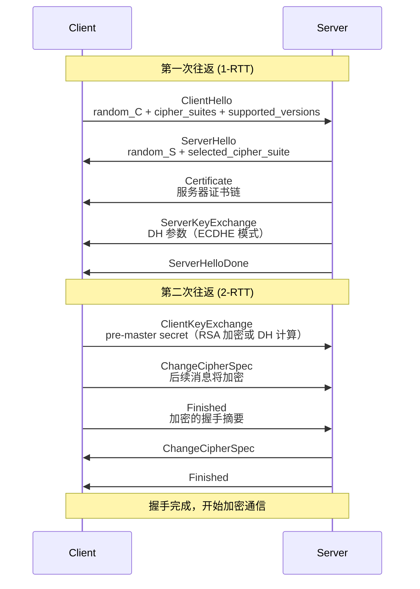
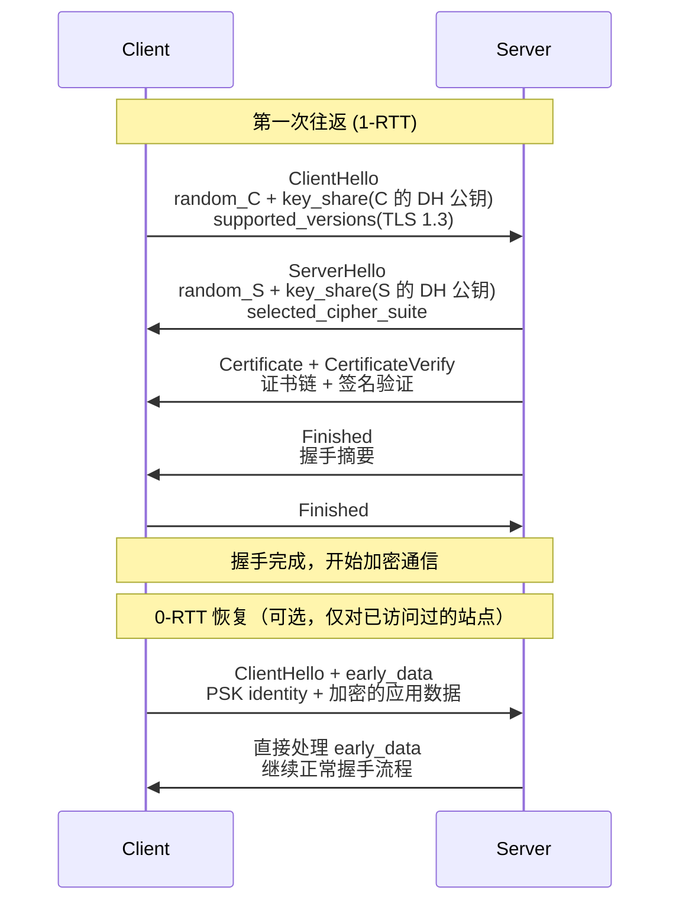

<!--
question:
  id: 09.front-end-https-handshake
  topic: 09.front-end
  difficulty: 未标
  frequency: 中频
  scenario_type: 性能对比
  tags: [09.front-end, HTTP, https]
-->

# HTTPS 握手过程深度剖析

## 引子：一把锁 🦒 是怎么保证你的密码不被窃听的？

```
浏览器 → https://bank.com/login
用户名：alice
密码：123456

→ 这串数据在网络上"裸奔"了吗？
→ 中间人能看到吗？
→ 怎么证明 server 真的是 bank.com？
```

答案：**HTTPS 通过三次握手 + 数字证书 + 混合加密，保证了数据的机密性、完整性和身份认证。**

握手过程的核心：
1. **非对称加密**：安全地交换"会话密钥"
2. **对称加密**：用会话密钥加密后续数据（快）
3. **数字证书**：证明 server 不是骗子

---

> 📚 **前置知识**：[CORS](../../09.front-end/cors/README.md)

## 一、核心原理

HTTPS 的本质是在 TCP 与 HTTP 之间插入一层 TLS（Transport Layer Security）安全协议。TLS 协议通过三种密码学技术的组合来保证通信安全：

**对称加密（AES / ChaCha20）**：加密效率高，适合大量数据传输。客户端和服务端使用相同的会话密钥进行加解密。但问题在于：如何在不安全的信道中安全地交换这个密钥？

**非对称加密（RSA / ECDHE）**：公钥加密、私钥解密，用于在握手阶段安全地交换"预主密钥"（pre-master secret）。RSA 密钥交换中，客户端用服务端公钥加密 pre-master secret；ECDHE 密钥交换中，双方通过椭圆曲线 Diffie-Hellman 算法各自独立计算出相同的共享密钥，无需传递密钥本身。

**数字签名（SHA256 + RSA/ECDSA）**：用于验证消息的完整性和发送方身份。CA 机构对服务器证书进行签名，客户端用 CA 公钥验证证书未被篡改。

**数字证书（X.509）**：由可信的 CA（Certificate Authority）颁发，包含服务器域名、公钥、有效期、颁发者等信息。证书本质是"公钥的数字身份证"，通过 CA 的背书建立信任链。

四者协作的核心思想：**用非对称加密安全地协商出对称加密的会话密钥，用数字证书验证对方身份，用对称加密高效地传输业务数据**。

---

## 二、TLS 1.2 握手（2-RTT）

TLS 1.2 的完整握手需要 2 个往返（2-RTT），包含以下关键步骤：



**第一步：ClientHello**
客户端生成随机数 `random_C`，列出支持的加密套件列表（如 `TLS_ECDHE_RSA_WITH_AES_128_GCM_SHA256`）和 TLS 版本，发送给服务端。

**第二步：ServerHello + Certificate + ServerKeyExchange**
服务端选择加密套件和 TLS 版本，生成随机数 `random_S`，返回自己的证书链。如果使用 ECDHE 密钥交换，还需发送 `ServerKeyExchange` 包含 DH 参数（椭圆曲线类型、公钥等）。最后发送 `ServerHelloDone` 表示握手参数发送完毕。

**第三步：ClientKeyExchange + ChangeCipherSpec + Finished**
客户端验证证书合法性后，执行密钥交换：RSA 模式下用证书中的公钥加密 pre-master secret 发送；ECDHE 模式下用自己的 DH 私钥和服务端的 DH 公钥计算出 pre-master secret。然后双方用 `random_C + random_S + pre-master secret` 通过 PRF（伪随机函数）生成 master secret，再衍生出会话密钥（session keys）。客户端发送 `ChangeCipherSpec` 通知后续消息将加密，再发送 `Finished`（包含之前所有握手消息的 HMAC 摘要，用会话密钥加密）供服务端验证。

**第四步：服务端响应 ChangeCipherSpec + Finished**
服务端同样计算会话密钥，验证客户端的 Finished 消息，然后发送自己的 ChangeCipherSpec 和 Finished。双方握手完成，之后所有 HTTP 数据都用会话密钥加密传输。

---

## 三、TLS 1.3 握手（1-RTT）

TLS 1.3 对握手流程进行了大幅简化，将握手延迟从 2-RTT 降低到 1-RTT，并可选支持 0-RTT 恢复连接。



**关键变化：**

1. **废弃 RSA 密钥交换**：TLS 1.3 只保留 ECDHE 密钥交换，强制要求前向保密。ClientHello 中直接携带客户端的 DH 公钥（key_share 扩展），服务端在 ServerHello 中直接返回服务端的 DH 公钥。双方在第一轮往返后即可独立计算出共享密钥，无需额外的 ClientKeyExchange 消息。

2. **合并握手消息**：服务端将 ServerHello、Certificate、CertificateVerify、Finished 合并在一个飞行（flight）中发送；客户端在收到后立即计算密钥并发送 Finished，只需 1-RTT 即可完成握手。

3. **0-RTT 快速恢复**：对于之前访问过的站点，客户端可以使用 PSK（Pre-Shared Key，基于上次会话派生的密钥）直接在 ClientHello 中携带加密的应用数据（early data）。服务端验证 PSK 后可立即处理这些请求，实现零往返延迟。但注意 0-RTT 数据不具备前向保密性，且可能被重放攻击，因此只能用于幂等的 GET 请求。

4. **加密握手摘要**：TLS 1.3 中 Certificate 和 CertificateVerify 消息本身也被加密传输（在 ChangeCipherSpec 之后），提升了隐私性。

---

## 四、证书链验证

HTTPS 的信任模型建立在 PKI（Public Key Infrastructure）体系之上，证书验证是握手过程中最关键的安全环节。

**证书链结构：**

```
Root CA（根证书，自签名，预置于操作系统/浏览器）
  └─ Intermediate CA（中间证书，由 Root CA 签名）
       └─ Server Certificate（服务器证书，由 Intermediate CA 签名）
```

**验证步骤：**

1. **域名匹配**：检查证书中的 Subject Alternative Name（SAN）字段是否包含当前访问的域名。例如访问 `www.example.com`，证书的 SAN 必须包含该域名或通配符 `*.example.com`。

2. **有效期检查**：确保证书在有效期内（Not Before ≤ 当前时间 ≤ Not After）。过期或未生效的证书会被拒绝。

3. **证书链追溯**：从服务器证书开始，逐级向上验证签名，直到找到受信任的 Root CA。每级证书用上级 CA 的公钥验证签名的合法性，确保证书未被篡改。

4. **吊销状态检查**：通过 CRL（Certificate Revocation List）或 OCSP（Online Certificate Status Protocol）查询证书是否已被 CA 提前吊销。OCSP Stapling 优化方案由服务端主动获取 OCSP 响应并随证书一起发送，避免客户端额外查询。

5. **密钥用途检查**：确保证书的 Extended Key Usage（EKU）字段包含 `serverAuth`，防止证书被滥用。

如果任何一步验证失败，浏览器会显示红色警告页面，阻止用户继续访问（除非用户手动忽略警告，但这会带来严重安全风险）。

---

## 五、前向保密（Forward Secrecy）

**前向保密的定义**：即使服务端的长期私钥在未来被泄露，攻击者也无法解密之前截获的加密通信内容。

**为什么 RSA 密钥交换不具备前向保密**：在 RSA 模式中，pre-master secret 是用服务端公钥加密的，任何拥有服务端私钥的人都可以解密出 pre-master secret，进而计算出会话密钥并解密所有历史通信。如果攻击者长期录制加密流量，等到私钥泄露后就能批量解密，这对敏感数据是致命威胁。

**ECDHE 如何实现前向保密**：ECDHE（Elliptic Curve Diffie-Hellman Ephemeral）每次握手时都生成临时的 DH 密钥对（ephemeral keys），握手完成后立即销毁。即使服务端私钥泄露，攻击者也只能伪造身份发起新的连接，无法解密历史通信——因为每次会话的 DH 私钥已经销毁，无法重新计算出当时的共享密钥。

**TLS 1.3 的强制前向保密**：正是出于安全考虑，TLS 1.3 彻底移除了 RSA 密钥交换和其他不具备前向保密的加密套件，只保留 ECDHE 一种密钥交换方式。目前主流的加密套件如 `TLS_AES_128_GCM_SHA256` 默认搭配 ECDHE 使用，确保所有 TLS 1.3 连接都具备前向保密特性。

---

## 六、性能优化

TLS 握手虽然增加了安全性，但也带来了额外的延迟。以下是常见的性能优化手段：

**会话复用（Session Resumption）**：
- **Session ID**：服务端为每个会话分配唯一的 Session ID 并缓存会话状态。客户端在 ClientHello 中携带 Session ID，如果服务端找到对应的缓存，则跳过密钥交换直接使用之前的会话密钥。缺点是服务端需要维护会话状态，分布式部署时需要共享 Session Store。
- **Session Ticket**（RFC 5077）：服务端将会话状态加密后作为 Ticket 发送给客户端，客户端在后续握手中携带 Ticket。服务端用只有自已知道的密钥解密 Ticket 恢复会话状态，无需维护会话存储，更适合分布式架构。

**TLS False Start**：客户端在发送 Finished 消息的同时就开始发送应用数据（如 HTTP 请求），无需等待服务端的 Finished 响应。这可以将 TLS 握手和 HTTP 请求合并，减少 1-RTT。前提是双方之前已经建立过连接，降低了重放攻击的风险。

**OCSP Stapling**：传统 OCSP 查询需要客户端额外向 CA 的 OCSP 服务器发起请求，增加延迟和隐私泄露风险。OCSP Stapling 由服务端定期从 CA 获取 OCSP 响应并缓存，在握手时随证书一起发送给客户端（通过 CertificateStatus 消息）。客户端直接验证响应即可，无需额外查询。

**TLS 1.3 的 1-RTT/0-RTT**：如前所述，TLS 1.3 通过简化握手流程和引入 PSK 机制，将首次握手延迟降至 1-RTT，复用连接时可降至 0-RTT，这是最有效的性能优化。

---

## 七、面试话术（30 秒版）

HTTPS 就是在 TCP 和 HTTP 之间加了 TLS 层，用三种技术保证安全：非对称加密用来协商密钥，对称加密用来传数据，数字证书用来验身份。

握手分两种：TLS 1.2 要 2 个往返，ClientHello 发随机数和加密套件列表，服务端回证书和 DH 参数，客户端算出密钥发 Finished，服务端确认后握手完成。TLS 1.3 简化到 1 个往返，ClientHello 直接带 DH 公钥，服务端回证书和 Finished 就搞定，还能用 PSK 做 0-RTT 秒开。

证书验证就是查户口：看域名对不对、有效期有没有过、能不能追溯到系统信任的根 CA、有没有被吊销。现在强制用 ECDHE 做密钥交换，每次握手用完就扔，就算私钥泄露也解不了以前的数据，这叫前向保密。

优化手段主要有三个：Session Ticket 复用会话不用重新握手，OCSP Stapling 让服务端打包证书吊销状态省一次查询，升级到 TLS 1.3 直接少一轮往返。

---

## 八、交叉引用

- 主模块：[`09.front-end`](../../../09.front-end/) — 前端知识体系

## 相关章节

- 深度阅读：[`09.front-end`](../../09.front-end/README.md) — 主模块详细内容
- TCP 基础：[`TCP 三次握手四次挥手`](../../02.computer-basics/tcp-handshake-teardown/README.md) — HTTPS 握手的底层 TCP 连接建立与断开

← [返回: 咬文嚼字 · https-handshake](README.md)
