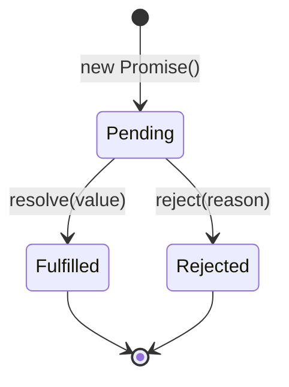

# Promise 手写实现

## 引子：前端面试的"试金石"

面试官：**手写一个 Promise。**

Promise 是 JavaScript 异步编程的基石。手写 Promise 考察的不仅是 API，而是对**状态机、异步调度、链式调用、错误冒泡**的深入理解。

你需要实现：
- 三种状态：Pending → Fulfilled / Rejected
- `then` 方法：支持链式调用，返回新 Promise
- `catch`、`finally`：错误处理
- `Promise.all`、`Promise.race`：并发控制

这道题做出来了，基本证明你理解了 JS 异步的本质。

---

## 一、Promise 核心机制



**三个状态**：
- **Pending**：初始状态
- **Fulfilled**：成功（调用 resolve）
- **Rejected**：失败（调用 reject）

**核心规则**：
1. 状态一旦改变就**不可逆**（Pending → Fulfilled/Rejected）
2. `then` 可以链式调用，返回新的 Promise
3. `then` 的回调是**微任务**

---

## 二、手写基础版

```javascript
class MyPromise {
  constructor(executor) {
    this.state = 'pending'
    this.value = undefined
    this.callbacks = []  // 存储 then 的回调
    
    const resolve = (value) => {
      if (this.state !== 'pending') return
      this.state = 'fulfilled'
      this.value = value
      this.callbacks.forEach(cb => cb.onFulfilled(value))
    }
    
    const reject = (reason) => {
      if (this.state !== 'pending') return
      this.state = 'rejected'
      this.value = reason
      this.callbacks.forEach(cb => cb.onRejected(reason))
    }
    
    try {
      executor(resolve, reject)
    } catch (err) {
      reject(err)
    }
  }
  
  then(onFulfilled, onRejected) {
    // 参数默认值
    onFulfilled = typeof onFulfilled === 'function' ? onFulfilled : v => v
    onRejected = typeof onRejected === 'function' ? onRejected : err => { throw err }
    
    return new MyPromise((resolve, reject) => {
      const handle = (callback) => {
        try {
          const result = callback(this.value)
          if (result instanceof MyPromise) {
            result.then(resolve, reject)
          } else {
            resolve(result)
          }
        } catch (err) {
          reject(err)
        }
      }
      
      if (this.state === 'pending') {
        this.callbacks.push({
          onFulfilled: () => handle(onFulfilled),
          onRejected: () => handle(onRejected)
        })
      } else if (this.state === 'fulfilled') {
        setTimeout(() => handle(onFulfilled), 0)  // 微任务
      } else {
        setTimeout(() => handle(onRejected), 0)
      }
    })
  }
  
  catch(onRejected) {
    return this.then(null, onRejected)
  }
}
```

---

## 三、Promise.all 手写

```javascript
Promise.myAll = function(promises) {
  return new Promise((resolve, reject) => {
    const results = []
    let count = 0
    
    if (promises.length === 0) {
      resolve([])
      return
    }
    
    promises.forEach((p, i) => {
      Promise.resolve(p).then(
        (value) => {
          results[i] = value
          count++
          if (count === promises.length) {
            resolve(results)
          }
        },
        reject  // 任一失败立即 reject
      )
    })
  })
}
```

**关键**：
- 全部成功 → resolve(结果数组，**保持顺序**)
- 任一失败 → 立即 reject

---

## 四、Promise.race 手写

```javascript
Promise.myRace = function(promises) {
  return new Promise((resolve, reject) => {
    promises.forEach(p => {
      Promise.resolve(p).then(resolve, reject)  // 谁先谁决定
    })
  })
}
```

---

## 五、Promise.allSettled（ES2020）

```javascript
Promise.myAllSettled = function(promises) {
  return new Promise((resolve) => {
    const results = []
    let count = 0
    
    if (promises.length === 0) {
      resolve([])
      return
    }
    
    promises.forEach((p, i) => {
      Promise.resolve(p).then(
        (value) => {
          results[i] = { status: 'fulfilled', value }
        },
        (reason) => {
          results[i] = { status: 'rejected', reason }
        }
      ).finally(() => {
        count++
        if (count === promises.length) {
          resolve(results)
        }
      })
    })
  })
}
```

**vs Promise.all**：allSettled 不会因一个失败而终止，返回所有结果。

---

## 六、Promise 常见陷阱

### 陷阱 1：then 回调是微任务

```javascript
console.log('A')
Promise.resolve().then(() => console.log('B'))
console.log('C')

// 输出：A → C → B（不是 A → B → C）
```

### 陷阱 2：Promise 构造函数立即执行

```javascript
const p = new Promise((resolve) => {
  console.log('executor')  // 立即执行
  resolve()
})
```

### 陷阱 3：then 返回新 Promise

```javascript
Promise.resolve(1)
  .then(x => x + 1)        // 返回 Promise(2)
  .then(x => x * 2)        // 返回 Promise(4)
  .then(x => console.log(x))  // 4
```

### 陷阱 4：async/await 是 Promise 语法糖

```javascript
async function foo() {
  return 1
}
// 等价于
function foo() {
  return Promise.resolve(1)
}
```

---

## 七、面试话术（30 秒版）

> "手写 Promise 要抓住 4 个核心：
>
> 1. **三状态**：Pending → Fulfilled/Rejected，不可逆
> 2. **executor 立即执行**：构造函数里调用 resolve/reject
> 3. **then 链式**：返回新 Promise，回调是微任务
> 4. **值穿透**：then 不传回调时，值向后传递
>
> **Promise.all**：
> - 全部成功 → resolve(结果数组，保持顺序)
> - 任一失败 → 立即 reject
>
> **Promise.race**：谁先完成谁决定结果
>
> **Promise.allSettled**：不短路，返回所有结果
>
> **陷阱**：
> - then 回调是微任务（Promise.then 后于同步代码）
> - executor 立即执行
> - async/await 是 Promise 语法糖
>
> **符合 Promises/A+ 规范**要处理：then 参数默认值、返回 Promise 的递归解析、错误捕获。"

---

## 八、交叉引用

- 主模块：[`09.front-end`](../../09.front-end/) — 前端知识体系
- 相关：[`13.split-hairs/09.front-end/event-loop/`](../event-loop/) — 事件循环（Promise 是微任务）
- 相关：[`13.split-hairs/09.front-end/closure/`](../closure/) — 闭包（Promise 内部状态保存）

## 相关章节

- 深度阅读：[`09.front-end`](../../09.front-end/README.md) — 主模块详细内容
