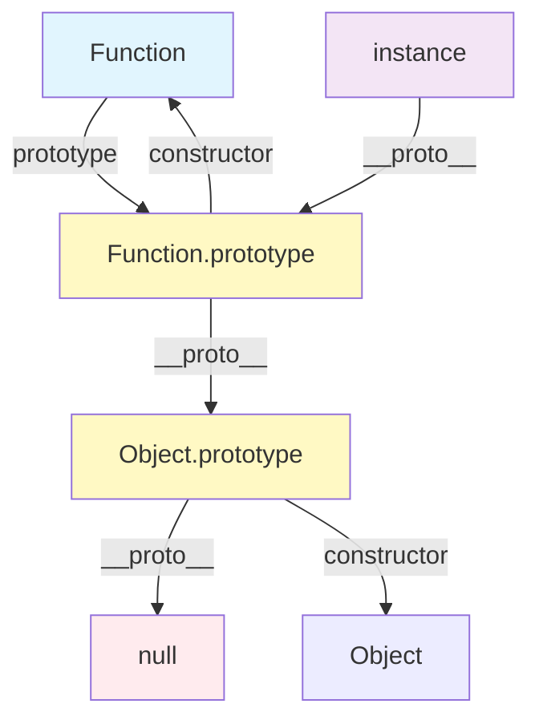
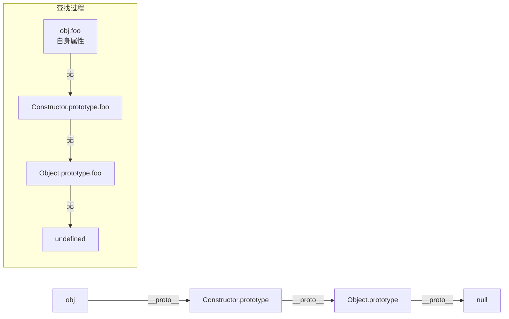
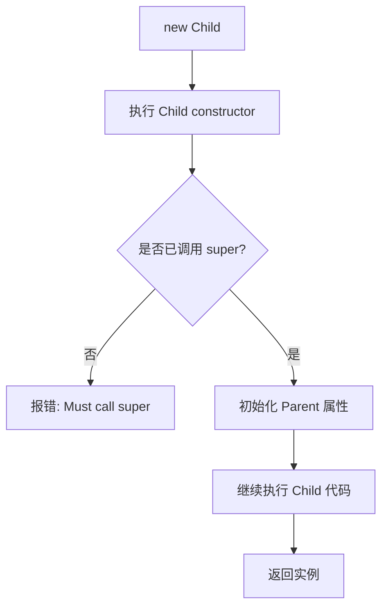

<!--
question:
  id: 09.front-end-prototype-chain
  topic: 09.front-end
  difficulty: ⭐⭐⭐⭐
  frequency: 中频
  scenario_type: 反直觉代码
  tags: [09.front-end, prototype, chain]
-->

# 原型链与继承深度剖析

> 一句话：JavaScript 通过 `__proto__` 将对象串联成链，属性查找沿链向上追溯，构成 JS 独有的委托式继承模型。

⭐⭐⭐⭐ 深度级别

---

## 引子：arr.toString 怎么没打印 "[object Array]"？

```js
const arr = [1, 2, 3];
arr.push(4);                  // arr 自己没有 push
// 浏览器发现 arr.__proto__ === Array.prototype
// Array.prototype.__proto__ === Object.prototype
// 在那一层找到 push
console.log(arr.toString());  // "1,2,3,4"，又找到了 Object.prototype
```

面试官一问："arr.toString() 为什么不打印 '[object Array]' 而是 '1,2,3,4'？"

99% 候选人答："Array 重写了 toString。"

**真相**：JS 的属性查找是 **链式向上**（委托式继承）：

1. 先查 `arr` 自己 → 没有
2. 查 `arr.__proto__` (Array.prototype) → 找到了 toString（自定义）
3. 查 `Array.prototype.__proto__` (Object.prototype) → 找到了 toString 原版
4. 直到顶端 `null` 才停止

**没搞懂原型链 = 看不懂 JS 任何 OOP 行为**（class 也是语法糖）。

## 一、核心原理

理解原型链需厘清三个关键概念：**prototype**、`__proto__`、**constructor**。

### 1.1 三者关系图



### 1.2 定义解析

| 概念 | 归属 | 说明 |
|------|------|------|
| `prototype` | **函数独有** | 存放所有实例共享的属性和方法 |
| `__proto__` | **实例对象** | 指向构造函数的 `prototype`（推荐用 `Object.getPrototypeOf()`） |
| `constructor` | **prototype 对象** | 指回构造函数本身 |

```javascript
function Person(name) { this.name = name; }
const p = new Person('Alice');

p.__proto__ === Person.prototype;        // true
Person.prototype.constructor === Person; // true
Object.getPrototypeOf(p) === Person.prototype; // true（推荐）
```

### 1.3 为什么需要 prototype？

`prototype` 的本质是**共享内存**：所有实例通过 `__proto__` 指向同一个原型对象，避免方法重复创建，节省内存。

```javascript
function Animal(type) { this.type = type; }
Animal.prototype.speak = function() {
    return `${this.type} makes a sound`;
};
// 所有实例共享同一个 speak 函数引用
```

---

## 二、原型链查找规则

### 2.1 查找路径

访问 `obj.foo` 时，引擎按以下顺序查找：

```
obj.foo → obj 自身 → obj.__proto__ → ... → Object.prototype → null → undefined
```



### 2.2 hasOwnProperty vs in 操作符

```javascript
function Dog(name) { this.name = name; }
Dog.prototype.breed = 'Labrador';
const dog = new Dog('Buddy');

dog.hasOwnProperty('name');   // true（仅查自身）
dog.hasOwnProperty('breed');  // false
'name' in dog;   // true（查自身+原型链）
'breed' in dog;  // true
```

| 对比项 | `hasOwnProperty` | `in` |
|--------|-----------------|------|
| 查找范围 | 仅自身属性 | 自身 + 整个原型链 |
| 用途 | 判断是否为实例自有属性 | 判断属性是否可用 |
| 安全写法 | `Object.prototype.hasOwnProperty.call(obj, key)` | 直接使用 |

### 2.3 属性遮蔽（Shadowing）

实例自身定义了与原型同名的属性时，原型上的属性被**遮蔽**：

```javascript
function Cat(name) { this.name = name; }
Cat.prototype.name = 'DefaultCat';
const cat = new Cat('Kitty');
console.log(cat.name);           // "Kitty"（自身优先）
delete cat.name;
console.log(cat.name);           // "DefaultCat"（暴露原型）
```

---

## 三、instanceof 原理

### 3.1 工作机制

`obj instanceof Constructor` 本质：**沿 `obj` 的原型链查找 `Constructor.prototype`**。

```javascript
function Car(brand) { this.brand = brand; }
const myCar = new Car('Toyota');
myCar instanceof Car;    // true
myCar instanceof Object; // true（原型链最终指向 Object）
```

### 3.2 手动实现 instanceof

```javascript
function myInstanceof(obj, Constructor) {
    if (obj === null || typeof obj !== 'object') return false;
    let proto = Object.getPrototypeOf(obj);
    while (proto !== null) {
        if (proto === Constructor.prototype) return true;
        proto = Object.getPrototypeOf(proto);
    }
    return false;
}
```

### 3.3 注意事项

- 对基本类型无效（`'hello' instanceof String` 为 `false`）
- 跨 iframe/window 时可能失效（原型对象不同）
- 数组检测推荐 `Array.isArray()` 而非 `instanceof Array`

---

## 四、ES6 class 继承

### 4.1 extends + super 语法

```javascript
class Animal {
    constructor(species) { this.species = species; }
    speak() { return `${this.species} makes a sound`; }
}

class Dog extends Animal {
    constructor(name, species = 'Dog') {
        super(species); // 必须先调用 super
        this.name = name;
    }
    speak() { return `${super.speak()}, woof!`; }
}

const dog = new Dog('Buddy');
dog.speak(); // "Dog makes a sound, woof!"
```

### 4.2 super 调用顺序



**关键规则**：子类构造函数中，**必须在访问 `this` 之前调用 `super()`**。

### 4.3 class 本质：寄生组合式继承的语法糖

ES6 class 底层仍是原型机制。Babel 转译核心逻辑：

```javascript
// ES6: class Child extends Parent {}
// 转译后：
function _inherits(Child, Parent) {
    Child.prototype = Object.create(Parent.prototype);
    Child.prototype.constructor = Child;
    Object.setPrototypeOf(Child, Parent);
}
function _callSuper(self, Parent, args) {
    return Parent.apply(self, args);
}
```

这与 ES5 **寄生组合式继承**完全一致：
- `Object.create(Parent.prototype)` 建立原型链
- `Parent.apply(this, arguments)` 借用父类构造函数

### 4.4 ES5 vs ES6 继承方案对比

| 方案 | 核心思路 | 优点 | 缺点 |
|------|---------|------|------|
| 原型链继承 | `Child.prototype = new Parent()` | 简单 | 无法传参；共享引用类型 |
| 借用构造 | `Parent.call(this, ...args)` | 可传参 | 无法复用原型方法 |
| 组合继承 | 原型链 + 借用构造 | 完整继承 | 父类构造函数执行两次 |
| 寄生组合 | `Object.create(Parent.prototype)` + 借用构造 | 最优解 | 代码复杂 |
| ES6 class | `extends` + `super` | 语法清晰 | 本质仍是寄生组合 |

---

## 五、常见陷阱

### 5.1 直接修改 `__proto__` 的风险

```javascript
// ❌ 危险：非标准 API，性能极差
obj.__proto__ = SomeOther.prototype;
// ✅ 推荐
Object.setPrototypeOf(obj, SomeOther.prototype);
Object.getPrototypeOf(obj); // 替代 __proto__
```

动态修改原型会破坏 JS 引擎优化（隐藏类/形状），导致性能下降。

### 5.2 原型污染攻击

```javascript
Object.prototype.isAdmin = true;
({}).isAdmin; // true（所有对象受影响）
```

防御措施：
- 使用 `Object.create(null)` 创建纯净对象
- 深拷贝时避免直接合并到 `Object.prototype`
- 用 `hasOwnProperty` 过滤原型链属性

### 5.3 循环原型链

```javascript
// CVE-2018-3721 原型污染漏洞
JSON.parse('{"__proto__": {"polluted": true}}');
```

### 5.4 箭头函数没有 prototype

```javascript
const fn = () => {};
fn.prototype; // undefined
new fn();     // TypeError: not a constructor
```

### 5.5 忘记 new 的后果

```javascript
function Person(name) { this.name = name; }
const p = Person('Alice'); // 忘记 new
console.log(window.name);  // "Alice"（this 指向全局）
```

修复：使用严格模式或构造函数内检查 `this instanceof Person`。

---

## 六、面试话术（30 秒版）

> **面试官：讲讲 JS 的原型链和继承？**

**回答模板**：

"JS 继承基于原型链。每个对象都有 `__proto__` 指向其构造函数的 `prototype`，而 `prototype` 又有 `constructor` 指回构造函数，形成三角关系。

访问属性时，引擎先查自身属性，找不到就沿 `__proto__` 逐级向上，直到 `Object.prototype` 的 `__proto__` 为 `null`。`instanceof` 的原理就是沿原型链找构造函数的 `prototype`。

ES5 最优方案是**寄生组合式继承**：用 `Object.create` 建立原型关系，用 `apply` 借用父类构造函数。ES6 的 `class extends` 本质就是这个的语法糖，`super()` 对应父类构造函数调用。

实际开发要注意：不要直接修改 `__proto__`，警惕原型污染，用 `hasOwnProperty` 区分自身和原型属性。"

---

## 七、交叉引用

- 主模块：[`09.front-end`](../../../09.front-end/) — 前端知识体系
- 相关主题：
  - [`closure/`](../closure/) — 闭包与作用域
  - [`this-binding/`](../this-binding/) — this 绑定规则
  - [`event-loop/`](../event-loop/) — 事件循环机制

---

## 相关章节

- 深度阅读：[`09.front-end`](../../09.front-end/README.md) — 主模块详细内容

← [返回: 咬文嚼字 · prototype-chain](../README.md)
