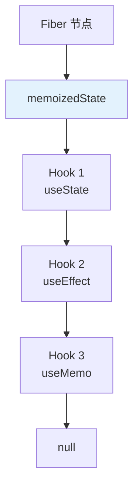

<!--
question:
  id: 09.front-end-react-hooks
  topic: 09.front-end
  difficulty: 未标
  frequency: 中频
  scenario_type: 反直觉代码
  tags: [09.front-end, React, react]
-->

# React Hooks 原理

## 引子：一个让人困惑的 Bug

```jsx
function Counter() {
  const [count, setCount] = useState(0)
  
  useEffect(() => {
    const timer = setInterval(() => {
      console.log(count)  // 永远是 0！
    }, 1000)
    return () => clearInterval(timer)
  }, [])  // 空依赖
  
  return <button onClick={() => setCount(count + 1)}>{count}</button>
}
// 页面上 count 在增加，但日志里永远是 0
```

为什么 `count` 在闭包里"过期"了？

因为 Hooks 的本质是**闭包 + 链表**。每次渲染都是一次新的闭包，`useEffect` 里捕获的是"旧闭包"里的 `count`。

---

## 一、为什么需要 Hooks

**Class 组件的痛点**：
- `this` 指向混乱
- 逻辑复用靠 HOC / Render Props（嵌套地狱）
- 生命周期方法中逻辑分散（componentDidMount / DidUpdate / WillUnmount）
- 复杂组件难以理解

**Hooks 的解决**：
- ✅ 函数组件（无 `this`）
- ✅ 逻辑复用（自定义 Hook）
- ✅ 相关逻辑集中（effect 中）
- ✅ 渐进式采用

---

## 二、核心 Hooks

### 2.1 useState

```jsx
function Counter() {
  const [count, setCount] = useState(0)
  
  return <button onClick={() => setCount(count + 1)}>{count}</button>
}
```

**原理**：
- React 为每个组件维护一个** Hooks 链表**
- `useState` 返回 `[当前值, setter]`
- **每次渲染都是新的闭包**（state 是当时的快照）

### 2.2 useEffect

```jsx
useEffect(() => {
  // 副作用逻辑
  const subscription = api.subscribe(handler)
  
  return () => {
    // 清理函数（componentWillUnmount）
    subscription.unsubscribe()
  }
}, [dependency1, dependency2])  // 依赖数组
```

**依赖数组规则**：
| 依赖数组 | 行为 |
|---------|------|
| 不传 | 每次渲染都执行 |
| `[]` | 只在挂载/卸载时执行 |
| `[dep1, dep2]` | dep 变化时执行 |

### 2.3 useMemo / useCallback

```jsx
// useMemo：缓存计算结果
const expensiveValue = useMemo(() => computeExpensive(a, b), [a, b])

// useCallback：缓存函数引用
const handleClick = useCallback(() => {
  console.log(count)
}, [count])
```

**使用场景**：
- 避免子组件不必要的重渲染（配合 `React.memo`）
- 昂贵计算的结果缓存

### 2.4 useRef

```jsx
function TextInput() {
  const inputRef = useRef(null)
  
  useEffect(() => {
    inputRef.current.focus()  // 直接操作 DOM
  }, [])
  
  return <input ref={inputRef} />
}
```

**特点**：
- `.current` 可变，**不触发重渲染**
- 跨渲染保持引用（类似实例属性）

---

## 三、Hooks 的实现原理

### 3.1 Hooks 链表



**每个 Fiber 节点**有一个 `memoizedState` 字段，指向**Hooks 链表**的头部。

### 3.2 调用顺序必须一致

```jsx
// ❌ 错误：条件调用，每次渲染顺序可能不同
if (condition) {
  useState()  // 位置 1
}
useEffect()   // 位置 2 vs 位置 1（不一致）

// ✅ 正确：总是按相同顺序调用
useState()    // 位置 1
useEffect()   // 位置 2
```

**为什么？** React 通过**调用顺序**（数组索引）定位 Hook。顺序不一致会导致状态错位。

### 3.3 闭包陷阱

```jsx
function Counter() {
  const [count, setCount] = useState(0)
  
  useEffect(() => {
    const timer = setInterval(() => {
      console.log(count)  // ❌ 永远是 0
    }, 1000)
    
    return () => clearInterval(timer)
  }, [])  // 空依赖
  
  return <button onClick={() => setCount(count + 1)}>{count}</button>
}
```

**问题**：`useEffect` 只在挂载时执行一次，闭包捕获的 `count` 永远是 0。

**解决方案**：

```jsx
// 方案 1：依赖数组加 count
useEffect(() => {
  const timer = setInterval(() => {
    console.log(count)  // ✅ 每次 count 变化重建闭包
  }, 1000)
  return () => clearInterval(timer)
}, [count])

// 方案 2：函数式更新
useEffect(() => {
  const timer = setInterval(() => {
    setCount(c => c + 1)  // ✅ 函数式更新，读最新值
  }, 1000)
  return () => clearInterval(timer)
}, [])

// 方案 3：useRef 保存最新值
const countRef = useRef(count)
countRef.current = count

useEffect(() => {
  const timer = setInterval(() => {
    console.log(countRef.current)  // ✅ 读到最新
  }, 1000)
  return () => clearInterval(timer)
}, [])
```

---

## 四、自定义 Hook（逻辑复用）

```jsx
// 自定义 Hook：监听窗口大小
function useWindowSize() {
  const [size, setSize] = useState({
    width: window.innerWidth,
    height: window.innerHeight,
  })
  
  useEffect(() => {
    const handleResize = () => {
      setSize({
        width: window.innerWidth,
        height: window.innerHeight,
      })
    }
    
    window.addEventListener('resize', handleResize)
    return () => window.removeEventListener('resize', handleResize)
  }, [])
  
  return size
}

// 使用
function App() {
  const { width, height } = useWindowSize()
  return <div>{width} x {height}</div>
}
```

**命名约定**：自定义 Hook 必须以 `use` 开头（如 `useXxx`），React 才能检查 Hook 规则。

---

## 五、Rules of Hooks

| 规则 | 原因 |
|------|------|
| **只在顶层调用** | 不在循环、条件、嵌套函数中调用 |
| **只在 React 函数中调用** | 组件或自定义 Hook |
| **调用顺序必须一致** | React 通过顺序定位 Hook |

**ESLint 插件**：`eslint-plugin-react-hooks` 自动检查。

---

## 六、React 18 的 Concurrent Features

### 6.1 Automatic Batching

```jsx
function handleClick() {
  setCount(c => c + 1)   // 不触发渲染
  setFlag(f => !f)        // 不触发渲染
  // React 18: 合并为一次渲染
}
```

**React 17 及之前**：setTimeout / Promise 中的 setState 不会批量更新。

### 6.2 useTransition

```jsx
function SearchResults() {
  const [query, setQuery] = useState('')
  const [isPending, startTransition] = useTransition()
  
  const handleChange = (e) => {
    setQuery(e.target.value)  // 紧急更新
    
    startTransition(() => {
      setSearchResults(e.target.value)  // 非紧急更新
    })
  }
  
  return (
    <>
      <input value={query} onChange={handleChange} />
      {isPending ? 'Loading...' : <Results />}
    </>
  )
}
```

**用途**：区分紧急 / 非紧急更新，避免阻塞用户交互。

---

## 七、面试话术（30 秒版）

> "React Hooks 让函数组件拥有状态和生命周期，本质是**闭包 + Hooks 链表**。
>
> **核心 Hooks**：
> - `useState`：状态管理
> - `useEffect`：副作用（依赖数组控制执行时机）
> - `useMemo` / `useCallback`：缓存计算结果 / 函数引用
> - `useRef`：跨渲染保持引用，不触发重渲染
>
> **实现原理**：
> - 每个 Fiber 节点维护一个 Hooks 链表
> - 通过**调用顺序**定位 Hook，所以必须在顶层调用
> - 每次渲染都是新的闭包，state 是当时的快照
>
> **闭包陷阱**：
> - useEffect 空依赖 + setInterval → 读到旧 state
> - 解决：函数式更新（`setCount(c => c + 1)`）或 useRef
>
> **Rules of Hooks**：
> 1. 只在顶层调用
> 2. 只在 React 函数中调用
> 3. 调用顺序必须一致
>
> **React 18**：
> - Automatic Batching：所有 setState 都批量更新
> - useTransition：区分紧急 / 非紧急更新
>
> **自定义 Hook**：逻辑复用，必须以 `use` 开头。"

---

## 八、交叉引用

- 主模块：[`09.front-end`](../../09.front-end/) — 前端知识体系
- 相关：[`13.split-hairs/09.front-end/event-loop/`](../event-loop/) — 事件循环（useEffect 执行时机）
- 相关：[`13.split-hairs/09.front-end/closure/`](../closure/) — 闭包（Hooks 本质）
- 相关：[`13.split-hairs/09.front-end/virtual-dom-diff/`](../virtual-dom-diff/) — Virtual DOM（Fiber 架构）

## 相关章节

- 深度阅读：[`09.front-end`](../../09.front-end/README.md) — 主模块详细内容
