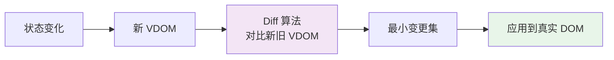
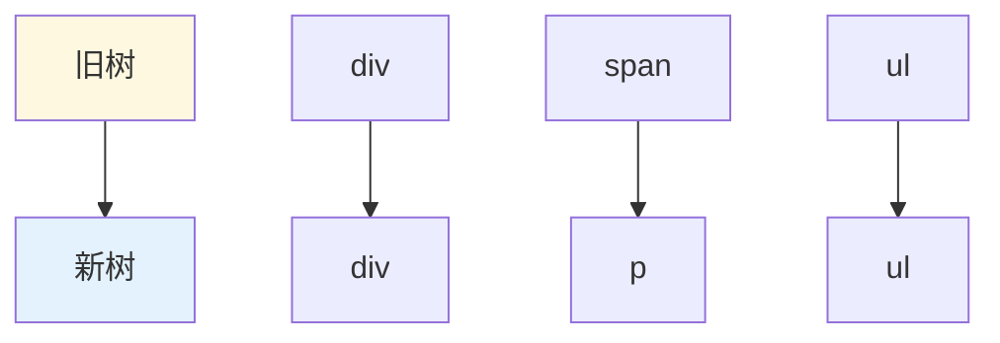
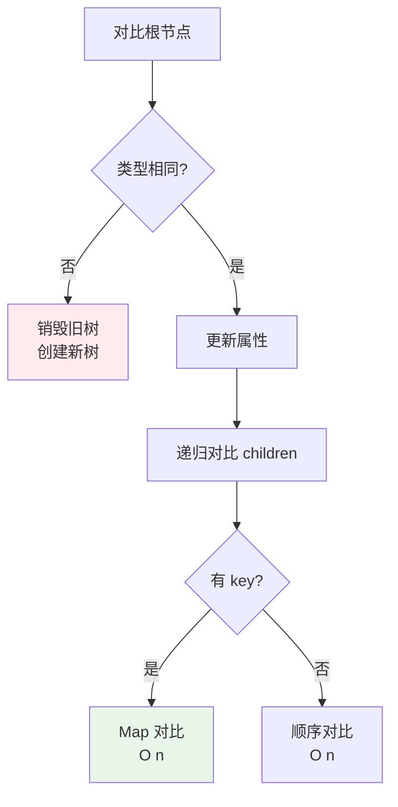
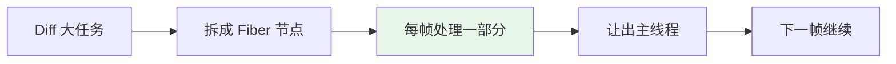

<!--
question:
  id: 09.front-end-virtual-dom-diff
  topic: 09.front-end
  difficulty: 未标
  frequency: 中频
  scenario_type: 性能对比
  tags: [09.front-end, virtual, dom]
-->

# Virtual DOM 与 Diff 算法

## 引子：为什么操作 DOM 这么慢？

```javascript
// 更新 1000 个列表项的状态
for (let i = 0; i < 1000; i++) {
  document.getElementById(`item-${i}`).textContent = "updated"
}
// 每次操作 DOM → 浏览器重新计算样式 → 重排 → 重绘 → 慢！

// React/Vue 的做法：
// 1. 用 JS 对象描述 DOM（Virtual DOM）
// 2. 对比新旧 Virtual DOM（Diff）
// 3. 只更新真正变化的部分（Patch）
```

直接操作真实 DOM 就像每次都重新装修整栋房子。

Virtual DOM 的策略：**先在图纸上（JS 对象）算好差异，再只改需要改的地方**。

Diff 算法以 O(n) 复杂度找出最小变更——这就是 React/Vue 高效更新的核心。

---

## 一、为什么需要 Virtual DOM

**直接操作真实 DOM 的问题**：
- DOM 操作昂贵（重排、重绘、GPU 合成）
- 频繁操作导致性能问题
- 难以追踪状态与 UI 的同步

**Virtual DOM 的解决思路**：
1. 用 **JS 对象**描述 DOM 结构
2. 状态变化时，**对比新旧 VDOM**（Diff）
3. 只把**变更的部分**应用到真实 DOM（Patch）



---

## 二、Virtual DOM 结构

```javascript
// JSX
<div className="container">
  <h1>Hello</h1>
  <p>World</p>
</div>

// 对应的 VDOM（JS 对象）
{
  type: 'div',
  props: { className: 'container' },
  children: [
    { type: 'h1', props: {}, children: ['Hello'] },
    { type: 'p', props: {}, children: ['World'] }
  ]
}
```

---

## 三、Diff 算法的 3 个策略

完整对比两棵树的时间复杂度是 **O(n³)**，React 通过 3 个假设降到 **O(n)**：

### 策略 1：同层比较



**假设**：不同类型的元素会生成不同的树（不会把 div 变成 span）

**结果**：**只比较同一层的节点**，不同层级的移动不做优化（直接销毁重建）

### 策略 2：Key 标识唯一性

```jsx
// ❌ 没有 key，Diff 会错误复用
<ul>
  {items.map(item => <li>{item.name}</li>)}
</ul>

// ✅ 有 key，Diff 正确识别增删改
<ul>
  {items.map(item => <li key={item.id}>{item.name}</li>)}
</ul>
```

**Key 的作用**：
- ✅ 识别节点的唯一身份
- ✅ 优化列表的增删改
- ❌ 不要用 index 作为 key（列表重排时失效）

### 策略 3：组件类型决定复用

```jsx
// 类型相同 → 复用组件，更新 props
<A count={1} />  →  <A count={2} />  // 复用 A

// 类型不同 → 销毁重建
<A />  →  <B />  // 销毁 A，创建 B
```

---

## 四、Diff 的具体流程



### 列表 Diff（有 key）

```
旧列表：[A(key=1), B(key=2), C(key=3)]
新列表：[A(key=1), C(key=3), D(key=4)]

Diff 结果：
- A：保留（位置和 key 都相同）
- B：删除（key=2 不存在）
- C：移动（从位置 2 → 位置 1）
- D：新增（新 key=4）
```

---

## 五、React Fiber 对 Diff 的优化

**React 15 及之前**：Diff 是**递归同步**的，大组件树会阻塞主线程。

**React 16+ Fiber**：
- 把 Diff 拆成**可中断的小任务**
- 使用**时间切片**（Time Slicing），让出主线程
- 支持**优先级调度**（高优先级先处理）



---

## 六、Vue 的 Diff 优化

Vue 在 React 基础上增加了：

### 6.1 静态提升（Static Hoisting）

```vue
<!-- 静态节点编译时提升，不参与 Diff -->
<div>
  <p>静态文本</p>     <!-- 提升为常量 -->
  <p>{{ dynamic }}</p> <!-- 动态节点参与 Diff -->
</div>
```

### 6.2 补丁标记（PatchFlags）

```javascript
// Vue 3 编译结果
createElement('div', null, [
  createElement('p', { key: 1 }, 'static'),  // 无标记
  createElement('p', { key: 2, patchFlag: 1 }, dynamic)  // 文本标记
])
```

**效果**：Diff 时只对比有 patchFlag 的节点，跳过静态节点。

### 6.3 最长递增子序列

```
旧：[A, B, C, D, E]
新：[A, C, B, E]

最长递增子序列：[A, C, E] 或 [A, B, E]
→ 不需要移动的子序列
→ 其他节点插入到合适位置
```

---

## 七、Key 的陷阱

### 陷阱 1：用 index 作为 key

```jsx
// 初始
[{id: 1, name: 'Alice'}, {id: 2, name: 'Bob'}]
// 渲染：<li key="0">Alice</li>, <li key="1">Bob</li>

// 删除 Alice
[{id: 2, name: 'Bob'}]
// Diff：
// key="0"：Alice → Bob（更新）
// key="1"：删除
// ❌ 错误地保留了 DOM，应该删除 key=0 的节点
```

**正确**：用稳定的业务 ID 作为 key。

### 陷阱 2：随机 key

```jsx
<li key={Math.random()}>  // ❌ 每次渲染 key 都变
```

每次渲染 React 都会**销毁重建所有节点**，性能灾难。

---

## 八、面试话术（30 秒版）

> "Virtual DOM 用 **JS 对象描述 DOM**，Diff 算法以 **O(n) 复杂度**找出最小变更。
>
> **React Diff 3 个策略**：
> 1. **同层比较**：不同类型直接销毁重建
> 2. **Key 标识**：列表用稳定 key，优化增删改
> 3. **组件类型**：类型相同复用，不同销毁重建
>
> **Fiber 优化**：React 16+ 把 Diff 拆成可中断的小任务，支持时间切片和优先级调度。
>
> **Vue 的额外优化**：
> - 静态提升（静态节点不参与 Diff）
> - 补丁标记（只对比动态节点）
> - 最长递增子序列（优化列表移动）
>
> **Key 陷阱**：
> - 不要用 index（列表重排时失效）
> - 不要用随机数（每次都重建）
> - 用稳定的业务 ID
>
> **本质**：Virtual DOM 的价值不是"更快"，而是**跨平台 + 声明式 + 自动优化**。"

---

## 九、交叉引用

- 主模块：[`09.front-end`](../../09.front-end/) — 前端知识体系
- 相关：[`13.split-hairs/09.front-end/event-loop/`](../event-loop/) — 事件循环（Fiber 调度）
- 相关：[`13.split-hairs/09.front-end/react-hooks/`](../react-hooks/) — React Hooks（与 Fiber 协作）

## 相关章节

- 深度阅读：[`09.front-end`](../../09.front-end/README.md) — 主模块详细内容

← [返回: 咬文嚼字 · virtual-dom-diff](README.md)
