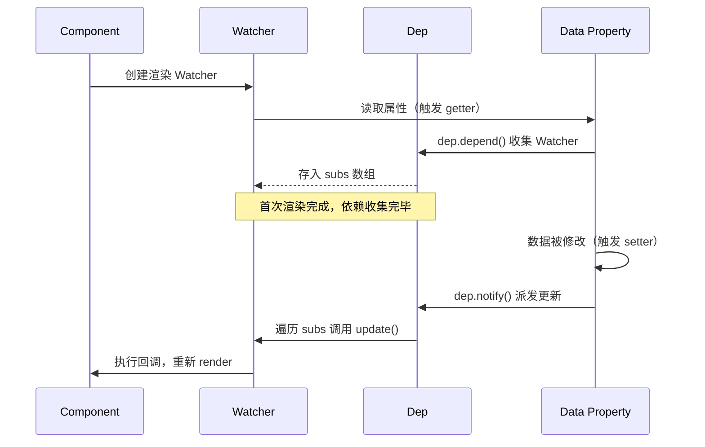

# Vue 响应式原理深度剖析

> 一句话：Vue 通过数据劫持（Object.defineProperty / Proxy）拦截数据的读写操作，结合发布-订阅模式实现「数据变化 → 自动更新视图」的响应式系统。

---

## 一、核心原理

Vue 响应式系统的本质是**数据驱动视图**。开发者只需修改数据，Vue 会自动检测变化并更新对应的 DOM。其核心思想可以概括为两个阶段：

1. **依赖收集**：在组件首次渲染时，记录哪些数据被访问过，建立「数据 → 观察者」的映射关系。
2. **派发更新**：当数据发生变化时，通知所有依赖该数据的观察者执行更新函数，重新渲染视图。

这种机制类似于**发布-订阅模式**：数据是发布者，Watcher 是订阅者，Dep 是调度中心。当数据被读取时，订阅者注册到调度中心；当数据被修改时，调度中心通知所有订阅者执行回调。

```mermaid
graph LR
    A[数据读取] --> B[getter 拦截]
    B --> C[dep.depend() 收集依赖]
    D[数据修改] --> E[setter 拦截]
    E --> F[dep.notify() 派发更新]
    F --> G[watcher.update() 触发重新渲染]
```

---

## 二、Vue 2 实现

Vue 2 使用 `Object.defineProperty` 对数据进行**递归劫持**，将普通对象转换为响应式对象。

### 2.1 核心类职责

| 类 | 职责 |
|---|---|
| **Observer** | 遍历对象的所有属性，用 `Object.defineProperty` 定义 getter/setter，为每个属性创建 Dep 实例 |
| **Dep** | 依赖管理器，内部维护一个 subs 数组存储所有订阅该属性的 Watcher |
| **Watcher** | 订阅者，持有更新函数 callback，当收到通知时执行更新 |
| **Compile** | 模板编译器，解析指令并为每个指令创建对应的 Watcher |

### 2.2 关键代码逻辑

```js
// Observer：递归劫持对象属性
function defineReactive(obj, key, val) {
  const dep5 = new Dep() // 每个属性拥有独立的 Dep
  Object.defineProperty(obj, key, {
    get() {
      if (Dep.target) { // Dep.target 指向当前正在求值的 Watcher
        dep.depend()     // 将 Watcher 添加到 subs 数组
      }
      return val
    },
    set(newVal) {
      if (newVal !== val) {
        val = newVal
        dep.notify()     // 通知所有 Watcher 执行 update
      }
    }
  })
}

// Dep：依赖收集与派发
class Dep {
  constructor() { this.subs = [] }
  depend() { if (Dep.target) this.subs.push(Dep.target) }
  notify() { this.subs.forEach(sub => sub.update()) }
}

// Watcher：订阅者
class Watcher {
  constructor(vm, exp, cb) {
    Dep.target = this   // 将自己设为全局目标
    vm[exp]             // 触发 getter，完成依赖收集
    Dep.target = null   // 收集完成后清空
  }
  update() { this.cb() } // 收到通知后执行回调
}
```

### 2.3 数组的特殊处理

`Object.defineProperty` 无法劫持数组索引的变化（如 `arr[0] = 1`）。Vue 2 的解决方案是**重写数组原型方法**：

```js
const arrayMethods = ['push', 'pop', 'shift', 'unshift', 'splice', 'sort', 'reverse']
const originalProto = Array.prototype
const arrayProto = Object.create(originalProto)

arrayMethods.forEach(method => {
  arrayProto[method] = function (...args) {
    const result = originalProto[method].apply(this, args)
    this.__ob__.dep.notify() // 手动触发通知
    return result
  }
})
```

这解释了为什么直接通过索引赋值 `arr[0] = 1` 不会触发更新，但调用 `arr.push(1)` 可以。

---

## 三、Vue 3 实现

Vue 3 改用 **Proxy + Reflect** 替代 `Object.defineProperty`，从根本上解决了 Vue 2 的局限性。

### 3.1 核心优势

| 对比项 | Vue 2 (defineProperty) | Vue 3 (Proxy) |
|---|---|---|
| 新增属性 | ❌ 无法检测 | ✅ 自动检测 |
| 删除属性 | ❌ 无法检测 | ✅ 自动检测 |
| 数组索引 | ❌ 需重写原型 | ✅ 自动检测 |
| 初始化性能 | ⚠️ 递归遍历所有属性 | ✅ 懒代理，按需深入 |
| Map/Set 支持 | ❌ | ✅ |

### 3.2 Proxy 实现要点

```js
function reactive(target) {
  return new Proxy(target, {
    get(target, key, receiver) {
      const result = Reflect.get(target, key, receiver)
      track(target, key) // 依赖收集
      return isObject(result) ? reactive(result) : result // 懒代理
    },
    set(target, key, value, receiver) {
      const oldValue = target[key]
      const result = Reflect.set(target, key, value, receiver)
      if (oldValue !== value) {
        trigger(target, key) // 派发更新
      }
      return result
    },
    deleteProperty(target, key) {
      const result = Reflect.deleteProperty(target, key)
      trigger(target, key) // 删除也触发更新
      return result
    }
  })
}
```

### 3.3 响应式 API 对比

| API | 说明 | 适用场景 |
|---|---|---|
| `reactive()` | 创建深层响应式对象 | 复杂对象状态 |
| `ref()` | 创建包含 `.value` 的响应式引用 | 基本类型值、需要替换整个对象 |
| `shallowRef()` | 仅 `.value` 是响应式，内部不递归 | 大型列表、性能敏感场景 |
| `shallowReactive()` | 仅第一层是响应式 | 不需要深层响应的对象 |

```js
// ref 的本质：内部包裹一个对象
function ref(value) {
  return reactive({ value })
}
// 所以 ref.value 的访问会被 Proxy 劫持
```

---

## 四、依赖收集流程

以 Vue 2 为例，依赖收集的完整时序如下：



**关键步骤解析：**

1. **render 开始前**：创建渲染 Watcher，设置 `Dep.target = watcher`
2. **render 执行中**：访问模板中绑定的数据 → 触发 getter → `dep.depend()` 将当前 Watcher 加入依赖列表
3. **render 结束后**：`Dep.target = null`，防止后续无关读取被收集
4. **数据变化时**：触发 setter → `dep.notify()` 遍历所有 Watcher → 调用 `watcher.update()` → 触发重新渲染

---

## 五、Vue 2 的局限

### 5.1 无法检测属性新增/删除

```js
const vm = new Vue({ data: { user: { name: 'Alice' } } })

// ❌ 新增属性不会被劫持，因为 defineProperty 只作用于已有属性
vm.user.age = 25

// ❌ 删除属性也不会触发更新
delete vm.user.name

// ✅ 正确做法：使用 $set / $delete
vm.$set(vm.user, 'age', 25)
vm.$delete(vm.user, 'name')
```

**根本原因**：`Object.defineProperty` 必须在属性已存在时才能定义，无法监听动态添加的属性。

### 5.2 无法检测数组索引变化

```js
const vm = new Vue({ data: { list: [1, 2, 3] } })

// ❌ 通过索引修改不会触发更新
vm.list[0] = 100

// ❌ 修改 length 也不会触发更新
vm.list.length = 0

// ✅ 正确做法：使用 splice
vm.list.splice(0, 1, 100)
vm.list.splice(0)
```

**根本原因**：JavaScript 引擎限制，`Object.defineProperty` 对数组索引的劫持成本过高。

### 5.3 $set 的实现原理

```js
Vue.prototype.$set = function (target, key, val) {
  if (Array.isArray(target)) {
    target.length = Math.max(target.length, key)
    target.splice(key, 1, val) // 利用重写的 splice 触发通知
    return val
  }
  if (key in target) {
    target[key] = val          // 已有属性直接赋值，触发 setter
    return val
  }
  const ob = target.__ob__
  if (!ob) {                   // 非响应式对象直接赋值
    target[key] = val
    return val
  }
  defineReactive(ob.value, key, val) // 为新属性定义响应式
  ob.dep.notify()              // 手动触发通知
  return val
}
```

---

## 六、常见陷阱

### 6.1 解构响应式数据丢失响应性

```js
import { reactive } from 'vue'

const state = reactive({ count: 0, name: 'Alice' })

// ❌ 解构后变成普通变量，失去响应性
let { count, name } = state
count++ // 不会触发任何响应式行为

// ✅ 使用 toRefs 保持响应性
import { toRefs } from 'vue'
let { count, name } = toRefs(state)
count.value++ // 仍然是响应式的
```

**原理**：`toRefs` 为源响应式对象的每个属性创建一个 ref，ref 的 `.value` 通过 getter/setter 与源对象保持同步。

```js
function toRefs(source) {
  const ret = {}
  for (const key in source) {
    ret[key] = computed(() => source[key]) // 每个属性变成一个 ref
  }
  return ret
}
```

### 6.2 深层对象性能问题

Vue 2 在初始化时会**递归遍历**所有嵌套对象，即使某些深层属性从未被使用。对于大型嵌套对象，这会带来显著的性能开销。

```js
// Vue 2：初始化时递归劫持所有层级
const state = reactive({
  level1: {
    level2: {
      level3: { /* ... 深层嵌套 */ }
    }
  }
})
// 所有层级都被 defineProperty 劫持，无论是否被模板使用

// Vue 3：懒代理，仅在访问时才深入
const state = reactive({
  level1: {
    level2: { deep: 'value' }
  }
})
// 只有访问 state.level1 时才会对 level1 进行代理
console.log(state.level1.level2.deep) // 此时才代理 level2
```

**优化方案**：
- Vue 2：使用 `Object.freeze()` 冻结不需要响应式的大对象
- Vue 3：使用 `shallowReactive()` / `shallowRef()` 仅代理第一层

### 6.3 ref 与 reactive 的选择

```js
// 场景1：基本类型必须用 ref
const count = ref(0)       // ✅
const count = reactive(0)  // ❌ reactive 只能用于对象

// 场景2：需要替换整个对象时用 ref
const form = ref({ name: '', age: 0 })
form.value = { name: 'Bob', age: 25 } // ✅ 整体替换

const form = reactive({ name: '', age: 0 })
// ❌ 不能直接替换，只能逐个属性修改
form.name = 'Bob'
form.age = 25
```

---

## 七、面试话术（30 秒版）

> 「Vue 的响应式系统基于**数据劫持 + 发布-订阅**。Vue 2 用 `Object.defineProperty` 劫持 getter/setter，getter 里收集依赖（Dep），setter 里通知更新（Watcher）。但它有两个致命缺陷：无法检测属性新增删除，无法检测数组索引变化，所以 Vue 2 提供了 `$set` / `$delete` 和重写数组原型方法来弥补。Vue 3 改用 `Proxy` 彻底解决了这些问题，Proxy 可以拦截 13 种操作，包括属性增删、数组索引等，而且采用懒代理策略，性能更好。日常开发中要注意解构响应式数据会丢失响应性，需要用 `toRefs` 转换。」

---

## 八、交叉引用

- 主模块：[`09.front-end`](../../../09.front-end/) — 前端知识体系
- [Vue 核心](../../../09.front-end/03-frameworks/README.md) — Vue 框架详解
