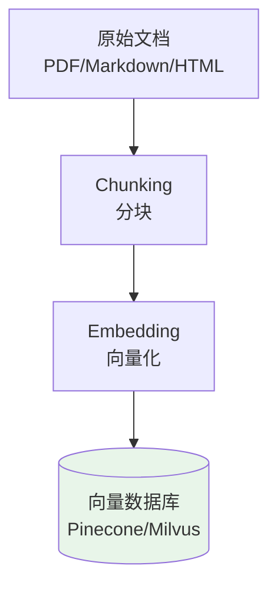
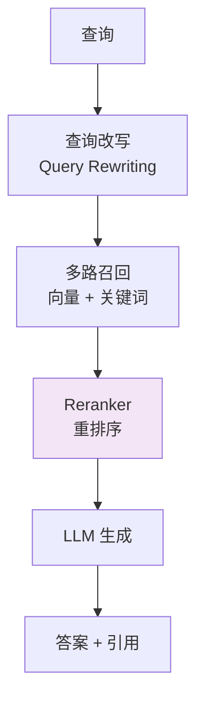

# RAG 架构设计

## 引子：让 LLM 读懂你的公司文档

```
用户：我们公司的报销流程是什么？

LLM：我不知道...我的训练数据里没有你们公司的文档。

RAG 方案：
1. 把公司文档切成小段
2. 用向量数据库存储
3. 用户提问时，先检索相关文档片段
4. 把检索结果 + 用户问题一起发给 LLM
5. LLM 基于检索结果回答

用户：我们公司的报销流程是什么？
LLM：根据您提供的文档，报销流程如下...
```

LLM 不知道你的私有数据。RAG（检索增强生成）让 LLM **基于你的文档**回答问题，而不是瞎编。

---

## 一、为什么需要 RAG

**LLM 的局限**：
- 训练数据有截止日期（不知道最新信息）
- 没有你的私有数据（企业文档、代码库）
- 可能"幻觉"（编造事实）
- 上下文窗口有限（塞不下 1000 页文档）

**RAG（Retrieval-Augmented Generation）的解决思路**：
1. 先**检索**相关文档片段
2. 把检索结果作为上下文塞进 Prompt
3. 让 LLM 基于上下文生成答案


---

## 二、RAG 完整流程

### 2.1 离线索引阶段



```python
from langchain.text_splitter import RecursiveCharacterTextSplitter
from langchain.embeddings import OpenAIEmbeddings
from langchain.vectorstores import Pinecone

# 1. 分块
splitter = RecursiveCharacterTextSplitter(
    chunk_size=1000,      # 每块 1000 字符
    chunk_overlap=200,    # 重叠 200 字符（保持上下文）
)
chunks = splitter.split_documents(documents)

# 2. 向量化 + 存储
embeddings = OpenAIEmbeddings()
vectorstore = Pinecone.from_documents(chunks, embeddings, index_name="docs")
```

### 2.2 在线查询阶段

```python
def rag_query(question: str):
    # 1. 检索
    relevant_chunks = vectorstore.similarity_search(question, k=5)
    context = "\n\n".join(chunk.page_content for chunk in relevant_chunks)
    
    # 2. 构造 Prompt
    prompt = f"""基于以下上下文回答问题。如果上下文中没有答案，说明不知道。

上下文：
{context}

问题：{question}

答案："""
    
    # 3. 生成
    response = llm.invoke(prompt)
    return response
```

---

## 三、Chunking 策略

| 策略 | 原理 | 适用 |
|------|------|------|
| **固定大小** | 每块 N 字符 | 简单通用 |
| **按段落** | 按 `\n\n` 分割 | 结构化文档 |
| **递归分割** | 先按大分隔（标题），再按小（段落） | 长文档 |
| **语义分割** | 按语义相似度切分 | 复杂文本 |
| **文档结构** | 按代码函数、Markdown 标题 | 代码、MD |

**经验值**：
- 块大小：**500-1500 字符**（太小丢上下文，太大噪音多）
- 重叠：**10-20%**（保持连续性）

---

## 四、向量数据库选型

| 数据库 | 类型 | 适用 |
|--------|------|------|
| **Pinecone** | 云托管 | 快速启动，免运维 |
| **Weaviate** | 开源 + 云 | GraphQL 查询，多模态 |
| **Milvus** | 开源 | 大规模，高性能 |
| **Qdrant** | 开源 | Rust 实现，性能优秀 |
| **pgvector** | PostgreSQL 插件 | 已有 PG 的团队 |
| **Chroma** | 开源 | 轻量，本地开发 |

---

## 五、Embedding 模型选型

| 模型 | 维度 | 多语言 | 适用 |
|------|------|--------|------|
| **OpenAI text-embedding-3** | 1536 | ✅ | 通用首选 |
| **Cohere embed-v3** | 1024 | ✅ | 多语言优秀 |
| **BGE-M3**（BAAI） | 1024 | ✅ | 开源最佳 |
| **Jina v2** | 768 | ✅ | 长文本支持 |
| **Nomic Embed** | 768 | ✅ | 开源轻量 |

**中文场景**：强烈推荐 **BGE-M3** 或 **Cohere embed-v3**（OpenAI 对中文支持弱）。

---

## 六、RAG 的优化

### 6.1 检索优化

| 优化 | 说明 |
|------|------|
| **混合检索** | 向量检索 + BM25 关键词检索 |
| **重排序（Reranking）** | 用 Cross-Encoder 重排检索结果 |
| **元数据过滤** | 按时间 / 作者 / 类别过滤 |
| **查询扩展** | 用 LLM 改写 / 扩展查询 |

### 6.2 生成优化

| 优化 | 说明 |
|------|------|
| **引用源** | 在回答中标注来源片段 |
| **置信度过滤** | 检索分数低于阈值不生成 |
| **Prompt 工程** | 强调"基于上下文回答，不知道就说不知道" |

### 6.3 Advanced RAG 模式



---

## 七、RAG vs Fine-tuning

| 维度 | RAG | Fine-tuning |
|------|-----|------------|
| **知识时效** | ✅ 随时更新 | ❌ 重新训练 |
| **私有数据** | ✅ 无需训练 | ⚠️ 需要大量样本 |
| **成本** | ✅ 低（仅推理） | ❌ 高（训练） |
| **幻觉** | ✅ 基于证据 | ⚠️ 仍可能幻觉 |
| **性能** | ⚠️ 检索质量影响 | ✅ 模型内化知识 |
| **适用** | **事实查询、企业文档** | **风格、语气、特定任务** |

**2026 共识**：**RAG 优先**，Fine-tuning 用于模型行为调整。

---

## 八、面试话术（30 秒版）

> "RAG 是**检索增强生成**，让 LLM 基于私有数据回答。
>
> **流程**：
> 1. **离线索引**：文档分块 → Embedding → 存入向量数据库
> 2. **在线查询**：问题向量化 → 检索相关片段 → 拼接 Prompt → LLM 生成
>
> **关键技术**：
> - **Chunking**：递归分割，块大小 500-1500 字符，重叠 10-20%
> - **Embedding 模型**：OpenAI text-embedding-3、BGE-M3（中文首选）
> - **向量数据库**：Pinecone / Weaviate / Milvus / pgvector
>
> **优化**：
> - **检索**：混合检索（向量 + BM25）+ Reranker 重排序
> - **生成**：引用源标注、置信度过滤、Prompt 工程
>
> **RAG vs Fine-tuning**：
> - RAG：随时更新、低成本、适合事实查询
> - Fine-tuning：内化知识、高成本、适合风格调整
>
> **2026 共识**：**RAG 优先**，Fine-tuning 补充。"

---

## 九、交叉引用

- 主模块：[`11.ai`](../../../11.ai/) — AI 知识体系
- [AI SDK](../../../12.front-end/09-frontend-and-ai/ai-sdk/README.md) — 前端集成 RAG
