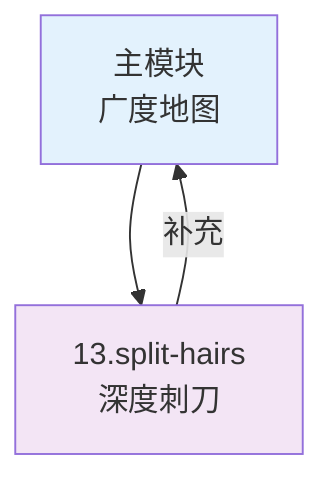

# 咬文嚼字 —— 高频面试题与难点深挖

> 一句话定位：**主模块的"刺刀版" —— 专治面试中那些"好像懂但说不清"的高频 / 高难度问题**

本仓库的主模块（`01.java` / `03.database` / `04.system-design` / `06.spring` / `11.ai` / `09.front-end`）是**广度知识地图**，每个模块 100-300 行，覆盖一个领域的核心脉络。

但面试中总会遇到这些题：
- "HashMap 扩容为什么是 2 倍？"
- "Spring 循环依赖的三级缓存到底怎么工作？"
- "Promise.all 和 Promise.allSettled 的区别？"
- "@Transactional 什么时候会失效？"

这些问题在主模块只能一笔带过，但面试却经常深挖。本模块就是**针对这类"咬文嚼字"式问题的专题集**——每篇 50-150 行，聚焦单一问题，从原理到陷阱到最佳实践一次讲透。

---

## 1. 与主模块的关系



| 维度 | 主模块 | split-hairs |
|------|--------|-------------|
| **定位** | 知识地图 | 面试刺刀 |
| **深度** | 广度覆盖 | 单点深挖 |
| **篇幅** | 100-300 行 / 模块 | 50-150 行 / 主题 |
| **使用场景** | 系统学习 | 面试准备 / 细节答疑 |
| **组织方式** | 主题聚合 | 一题一文 |

---

## 2. 6 大分类导航

| 编号 | 对齐主模块 | 主题 | 文章数 |
|------|----------|------|--------|
| 01 | [`01.java`](../01.java/) | Java 基础陷阱（缓存、扩容、并发） | [32 篇](01.java/) |
| 03 | [`03.database`](../03.database/) | 数据库细节（SQL 优化、Redis 机制） | [22 篇](03.database/) |
| 04 | [`04.system-design`](../04.system-design/) | 系统设计难点（MQ、缓存、分布式） | [13 篇](04.system-design/) |
| 06 | [`06.spring`](../06.spring/) | Spring 面试高频（IoC、AOP、事务） | [13 篇](06.spring/) |
| 11 | [`11.ai`](../11.ai/) | AI 新概念（Prompt/Context/Harness/Loop + Agent 架构 + 生产力度量） | [14 篇](11.ai/) |
| 12 | [`09.front-end`](../09.front-end/) | 前端细节（HTTP、存储、消息机制） | [25 篇](09.front-end/) |

**总计：121 篇**（原 55 篇，新增 66 篇）

---

## 3. 文章模板

每篇文章遵循统一结构：

```markdown
# 标题（明确问题）

## 一、核心原理（Why it works）
## 二、代码示例（Show me the code）
## 三、常见陷阱（What goes wrong）
## 四、最佳实践（Do this instead）
## 五、面试话术（How to answer in 30s）
## 六、交叉引用（Link back to main module）
```

---

## 速查表

| 分类 | 高频问题 | 核心考点 |
|------|---------|---------|
| **Java 陷阱** | HashMap 扩容、Integer 缓存、StringBuilder 重用 | 底层数据结构与机制 |
| **并发** | Atomic vs synchronized、volatile 语义 | CAS、内存模型 |
| **SQL 优化** | COUNT(*) vs COUNT(1)、索引失效 10 场景 | Explain + 索引设计 |
| **Redis** | 缓存穿透/击穿/雪崩、大 Key 治理 | 三大问题三连 |
| **分布式** | 分布式 ID、分布式事务（2PC/TCC/Saga） | 一致性方案选型 |
| **Spring** | @Transactional 失效 8 场景、Bean 生命周期、循环依赖三级缓存 | IoC/AOP 原理 |
| **系统设计** | MQ 消息积压、限流算法、缓存一致性、App 报价拆解 | 高可用 + 高性能 + 项目管理 |
| **前端** | Event Loop、闭包、Promise 手写、从 URL 到页面 | 浏览器 + JS 核心 |
| **AI** | Transformer 架构、Token 计费、RAG 设计、Prompt/Context/Harness/Loop 工程、生产力悖论 | LLM 原理与 AI 工程演进 + 研发效能度量 |

## 开源参考

本模块为面试专题集，引用的核心开源项目见各主模块的开源参考：
- [`01.java`](../01.java/README.md) — OpenJDK / JUnit 5 / Mockito
- [`03.database`](../03.database/README.md) — MySQL / Redis / HikariCP
- [`04.system-design`](../04.system-design/README.md) — Sentinel / Resilience4j
- [`06.spring`](../06.spring/README.md) — Spring 全家桶
- [`09.front-end`](../09.front-end/README.md) — React / Vue / Vite
- [`11.ai`](../11.ai/README.md) — Spring AI / LangChain / Dify

---

## 4. 何时该写 split-hairs？

**触发条件**：
- 主模块的某个点需要深度解释（> 100 字）
- 面试中反复被问到的细节问题
- "好像懂但说不清"的知识点
- 有明确陷阱或反直觉行为的技术细节

**不该写**：
- 主模块已经讲清楚的内容
- 过于冷门的问题
- 没有明确答案的开放性问题

---

## 5. 学习路径建议

### 按面试准备
1. **Java 后端**：01.java（32 篇） → 06.spring（13 篇） → 03.database（22 篇）
2. **系统设计**：04.system-design（10 篇） → 03.database（18 篇）
3. **前端**：09.front-end（23 篇） → 01-foundation / 02-language 的 split-hairs（待补）
4. **AI 方向**：11.ai（7 篇） → 主模块 11.ai

### 按主题深挖
- 看到主模块某处"详见 split-hairs"的引用 → 直接跳转阅读

---

## 6. 交叉引用

- 每个 split-hairs 文章底部都有"交叉引用"链接回主模块
- 主模块在需要深挖的地方也会链接到对应的 split-hairs 文章
- 形成"广度地图 + 深度刺刀"的双层知识体系

---

## 7. 与其他章节的关系

- **主模块**：[`01.java`](../01.java/) / [`03.database`](../03.database/) / [`04.system-design`](../04.system-design/) / [`06.spring`](../06.spring/) / [`11.ai`](../11.ai/) / [`09.front-end`](../09.front-end/)
- **故事章节**：[`12.story`](../12.story/) — 阿明餐厅故事（实战场景）
- **主仓库 README**：[`README.md`](../README.md)
