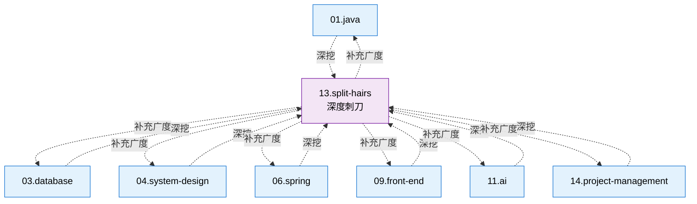

<!--
module:
  parent: split-hairs
  slug: split-hairs
  type: article
  category: 主模块子文章
  summary: 咬文嚼字面试题
-->

# 咬文嚼字 —— 高频面试题与难点深挖

> 一句话定位：**主模块的"刺刀版" —— 专治面试中那些"好像懂但说不清"的高频 / 高难度问题**

本仓库的主模块（`01.java` / `03.database` / `04.system-design` / `06.spring` / `11.ai` / `09.front-end` / `14.project-management`）是**广度知识地图**，每个模块 100-300 行，覆盖一个领域的核心脉络。

但面试中总会遇到这些题：
- "HashMap 扩容为什么是 2 倍？"
- "Spring 循环依赖的三级缓存到底怎么工作？"
- "Promise.all 和 Promise.allSettled 的区别？"
- "@Transactional 什么时候会失效？"

这些问题在主模块只能一笔带过，但面试却经常深挖。本模块就是**针对这类"咬文嚼字"式问题的专题集**——每篇 50-150 行，聚焦单一问题，从原理到陷阱到最佳实践一次讲透。

---

## 1. 与主模块的关系



| 维度 | 主模块 | split-hairs |
|------|--------|-------------|
| **定位** | 知识地图 | 面试刺刀 |
| **深度** | 广度覆盖 | 单点深挖 |
| **篇幅** | 100-300 行 / 模块 | 50-150 行 / 主题 |
| **使用场景** | 系统学习 | 面试准备 / 细节答疑 |
| **组织方式** | 主题聚合 | 一题一文 |

---

## 2. 分类导航（6 大主模块 + 1 项目管理外链）

> 2026-06-30 路径整理：项目管理类（3 题）已迁出，新主模块 [`14.project-management/`](../14.project-management/) 接手。

| 编号 | 对齐主模块 | 主题 | 文章数 |
|------|----------|------|--------|
| 01 | [`01.java`](../01.java/) | Java 基础陷阱（缓存、扩容、并发） | [33 篇](01.java/) |
| 03 | [`03.database`](../03.database/) | 数据库细节（SQL 优化、Redis 机制） | [29 篇](03.database/) |
| 04 | [`04.system-design`](../04.system-design/) | 系统设计难点（MQ、缓存、分布式）| [13 篇](04.system-design/) |
| 06 | [`06.spring`](../06.spring/) | Spring 面试高频（IoC、AOP、事务） | [13 篇](06.spring/) |
| 09 | [`09.front-end`](../09.front-end/) | 前端细节（HTTP、存储、消息机制） | [25 篇](09.front-end/) |
| 11 | [`11.ai`](../11.ai/) | AI 面试深挖（5 篇纯面试题 + 9 篇主模块配套精炼版） | [14 篇](11.ai/) |
| ✦ | [`14.project-management`](../14.project-management/) | **（外链）**决策实战 / 报价 / 外包 | 见主模块 |

**总计：127 篇面试题**（已含子目录内的全部文章与精炼版）

---

## 3. 文章模板

每篇文章遵循统一结构：

```markdown
# 标题（明确问题）

## 引子：一个具体场景（场景 + 反差 + 缘由）

## 一、核心原理（Why it works）
## 二、代码示例（Show me the code）
## 三、常见陷阱（What goes wrong）
## 四、最佳实践（Do this instead）
## 五、面试话术（How to answer in 30s）
## 六、交叉引用（Link back to main module）
```

> 📌 2026-06-30 增补 `## 引子`：每个面试题以**一个具体场景**开场（生产 bug / 反直觉代码 / 架构困境 / 性能对比），不再直接进概念定义。详见 [`QUESTION-FORMAT-SPEC.md`](./QUESTION-FORMAT-SPEC.md) §2 与 §3。

---

## 4. 保留边界：split-hairs 与主模块的分工

> **2026 路径整理**：split-hairs 不再无差别收录所有高频内容；下面是"什么属于 split-hairs / 什么应该迁回主模块"的判定标准。

### ✅ 属于 split-hairs（保留）

| 类型 | 示例 | 原因 |
|------|------|------|
| **高频面试陷阱** | `@Transactional` 失效 8 种场景 / SELECT * 内存爆炸 / volatile 死循环 | 90% 候选人会踩，单题面试能深挖 30 分钟 |
| **反直觉 / 易错的"细节"** | Integer 缓存 / `==` vs equals / HashMap 2 倍扩容 | 主模块一笔带过；面试必深挖根因 |
| **跨主模块的"陷阱横向对比"** | 5 万 vs 50 万 App 报价 / 分布式锁 3 大方案对比（**已迁 14**）| 决策类，但读者是老板/PM 时迁出，读者是开发者时保留 |
| **主模块配套的"精炼版"** | split-hairs/11.ai 下 9 篇精炼版 | 与 `11.ai/` 主模块并存，一篇广度 + 一篇陷阱 |
| **小众但"说得清才到位"的细分** | SPI / 泛型擦除 / Record + 泛型 | 主模块篇幅有限，split-hairs 单独展开 |

### ❌ 不属于 split-hairs（迁回主模块 / 新建主模块）

| 类型 | 例子 | 应该归到 |
|------|------|----------|
| **决策实战 + 管理学** | App 报价拆解 / 外包避坑 / App 跨端技术栈选型 | [`note/14.project-management/`](../../14.project-management/README.md) / 主模块 [`09.front-end/08-cross-platform/`](../../09.front-end/08-cross-platform/) |
| **主模块已经深度覆盖的"广度"** | 4 种创建线程方式 / SQL 调优总览 | 主模块对应章节，split-hairs 不重复广度 |
| **概念定义 + 全景图** | Transformer 是什么 / Java 反射的整体框架 | 主模块 [`01-fundamentals/transformer/`](../../11.ai/01-fundamentals/transformer/README.md)，split-hairs 只做精炼版 |
| **前端工程化 / 浏览器"广度"知识** | URL 到渲染全链路 | 主模块 [`09.front-end/01-foundation/browser-rendering/`](../../09.front-end/01-foundation/browser-rendering/README.md) |

### 判定 checklist（写作前自问）

- [ ] 能否用"一个具体场景"作为开场？（Yes → 适合 split-hairs）
- [ ] 是否高频 + 有明确陷阱 + 答案短但理由长？（Yes → 适合 split-hairs）
- [ ] 主模块已经有对应章节，且 split-hairs 内容与之**重复 80%+**？（Yes → 应迁回主模块，split-hairs 留 stub）
- [ ] 主题是"决策 / 管理 / 选型"，目标读者不是开发者？（Yes → 应迁到 `14.project-management/` 或主模块相关分类）

### 2026-06-30 已迁移记录

| 原 split-hairs 路径 | 新位置 | 决策原因 |
|---------------------|--------|----------|
| `04.system-design/project-management/app-quote-breakdown/` | `note/14.project-management/` | 决策实战，非面试陷阱 |
| `04.system-design/project-management/outsourcing-pitfalls/` | `note/14.project-management/` | 同上 |
| `04.system-design/project-management/mobile-tech-stack/` | `09.front-end/08-cross-platform/` | 跨端架构决策，应入主模块 |

---

## 5. 何时该写 split-hairs？

**触发条件**：
- 主模块的某个点需要深度解释（> 100 字）
- 面试中反复被问到的细节问题
- "好像懂但说不清"的知识点
- 有明确陷阱或反直觉行为的技术细节

**不该写**：
- 主模块已经讲清楚的内容（参 §4 判定 checklist）
- 过于冷门的问题
- 没有明确答案的开放性问题

---

## 6. 学习路径建议

### 按面试准备（数字与 §2 一致）
1. **Java 后端**：[01.java](01.java/) 33 篇 → [06.spring](06.spring/) 13 篇 → [03.database](03.database/) 29 篇
2. **系统设计 / 后端架构**：[04.system-design](04.system-design/) 13 篇 → [03.database](03.database/) 29 篇
3. **前端**：[09.front-end](09.front-end/) 25 篇（含网络/CSS/框架/安全/工程化）
4. **AI 方向**：[11.ai](11.ai/) 14 篇 = 5 篇纯面试题 + 9 篇主模块精炼版
5. **跨方向管理 / 决策**：[14.project-management](../../14.project-management/)（决策实战，非面试陷阱，**外链**而非本目录）

### 2026 新增主题（建议补到 split-hairs 时同步读）

- **AI 工程 4 阶段**：Prompt → Context → Harness → Loop（详见 11.ai 的 transformer / rag / function-calling）
- **AI 时代责任 / 数据真相 / 个人视角**：44 / 45 / 46（续集 18-20，详见 [12.story](../12.story/)）
- **AI 提示工程深挖**：见 [`42-prompt-engineering`](11.ai/prompt-engineering/)
- **回退至 Cheatsheet**：见 [`cheatsheet.md`](./cheatsheet.md)（每题一行核心心法）

---

## 速查表

| 分类 | 高频问题 | 核心考点 |
|------|---------|---------|
| **Java 陷阱** | HashMap 扩容、Integer 缓存、StringBuilder 重用 | 底层数据结构与机制 |
| **并发** | Atomic vs synchronized、volatile 语义 | CAS、内存模型 |
| **SQL 优化** | COUNT(*) vs COUNT(1)、索引失效 10 场景 | Explain + 索引设计 |
| **Redis** | 缓存穿透/击穿/雪崩、大 Key 治理 | 三大问题三连 |
| **分布式** | 分布式 ID、分布式事务（2PC/TCC/Saga） | 一致性方案选型 |
| **Spring** | @Transactional 失效 8 场景、Bean 生命周期、循环依赖三级缓存 | IoC/AOP 原理 |
| **系统设计** | MQ 消息积压、限流算法、缓存一致性、分布式 ID / 事务 / 锁 | 高可用 + 高性能 + 分布式经典 |
| **前端** | Event Loop、闭包、Promise 手写、从 URL 到页面 | 浏览器 + JS 核心 |
| **AI** | Transformer 架构、Token 计费、RAG 设计、Prompt/Context/Harness/Loop 工程、生产力悖论、Agent DAG/ReAct 选型 | LLM 原理与 AI 工程演进 + Agent 架构选型 + 研发效能度量 |

## 开源参考

本模块为面试专题集，引用的核心开源项目见各主模块的开源参考：
- [`01.java`](../01.java/README.md) — OpenJDK / JUnit 5 / Mockito
- [`03.database`](../03.database/README.md) — MySQL / Redis / HikariCP
- [`04.system-design`](../04.system-design/README.md) — Sentinel / Resilience4j
- [`06.spring`](../06.spring/README.md) — Spring 全家桶
- [`09.front-end`](../09.front-end/README.md) — React / Vue / Vite
- [`11.ai`](../11.ai/README.md) — Spring AI / LangChain / Dify

---

## 6. 交叉引用

- 每个 split-hairs 文章底部都有"交叉引用"链接回主模块
- 主模块在需要深挖的地方也会链接到对应的 split-hairs 文章
- 形成"广度地图 + 深度刺刀"的双层知识体系

---

## 7. 与其他章节的关系

- **主模块**：[`01.java`](../01.java/) / [`03.database`](../03.database/) / [`04.system-design`](../04.system-design/) / [`06.spring`](../06.spring/) / [`11.ai`](../11.ai/) / [`09.front-end`](../09.front-end/) / [`14.project-management`](../14.project-management/)
- **故事章节**：[`12.story`](../12.story/) — 阿明餐厅故事（实战场景）
- **主仓库 README**：[`README.md`](../README.md)
- **写作规范**：[`QUESTION-FORMAT-SPEC.md`](./QUESTION-FORMAT-SPEC.md) — 文章结构强制模板 + frontmatter schema

---

← [返回笔记目录](../README.md)
