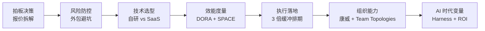

<!--
module:
  number: 14
  slug: project-management
  topic: 项目管理与成本控制
  audience: 老板 / PM / 技术总监 / 创业者
  category: 主模块
  summary: 从报价拆解到 AI 时代研发效能度量的项目决策实战手册。
-->

# 项目管理与成本控制

> **给老板 / PM / 技术总监的另一面** —— 技术之外的另一只手：报价拆解、外包风险、技术决策的成本账本。
>
> 本模块不属于"系统设计技术细节"，而是从**业务实战**视角，回答"花 50 万做 App 值不值？""花 50 万买 AI 工具一年回本不？"等问题。
>
> ⚠️ **定位说明**：本模块的内容是**决策+实战指南**，不是"面试刺刀"（面试高频问题请见 [`13.split-hairs`](../13.split-hairs/README.md)）。每篇 50-200 行，聚焦一个具体场景。

← [返回笔记目录](../README.md)

---

## 📚 1. 模块导航

| 编号 | 主题 | 核心内容 | 难度 |
|------|------|----------|------|
| 1 | [5 万 vs 50 万 App 报价差在哪](app-quote-breakdown/README.md) | 12 大成本维度拆解 + 决策矩阵 | ⭐⭐⭐ |
| 2 | [外包项目避坑指南](outsourcing-pitfalls/README.md) | 5 大隐性成本 + 合同 8 条必看 | ⭐⭐⭐ |
| 3 | [技术选型 ROI：自研 vs SaaS vs 外包](self-vs-saas-vs-outsourcing/README.md) | TCO 对比 + 5 大评估维度 + 决策树 + AI 时代变量 | ⭐⭐⭐ |
| 4 | [AI 项目管理账本：DORA + SPACE + ROI](ai-pm-dora-space/README.md) | DORA 4 指标 + SPACE 5 维度 + 月/季/年三阶段实施 | ⭐⭐⭐⭐ |
| 5 | [人力配比 + 排期估算：3 倍缓冲原则](team-sizing-3x-buffer/README.md) | 阿里 P5/P6/P7 "2-8-2" + 排期公式 + AI 时代修正 | ⭐⭐⭐ |
| 6 | [康威定律下的团队拓扑](conways-law-team-topologies/README.md) | 康威定律 + Team Topologies 4 类型 + 平台/业务比例 | ⭐⭐⭐⭐ |

> 📌 **章节说明**（2026-06-30 路径整理）：
> - 前 2 篇从 `13.split-hairs/04.system-design/project-management/` 迁回本主模块。
> - 后 4 篇（Path Z 新增）覆盖"决策 + AI 时代 + 执行 + 组织"4 大维度。
> - `mobile-tech-stack` 已迁至 [`09.front-end/08-cross-platform/`](../09.front-end/08-cross-platform/)。

### 候选（待扩展）

1. **决策类**：上云 vs 自建机房、微服务 vs 单体的"二次成本"
2. **执行类**：需求变更控制（MoSCoW / RICE）、项目风险登记册
3. **风险类**：技术债的财务账本（与 [12.story/46](../12.story/46-tech-debt-career-trap.md) 互补）
4. **组织类**：远程团队 / 跨时区协作
5. **AI 时代**：AI Agent 在 PM 流程中的嵌入（Harness / Verifier / Feedback 3 件套）

### 1.1 学习路径

- **快速入门**（30 分钟）：看 [app-quote-breakdown](app-quote-breakdown/README.md)
- **合同避坑**（1 小时）：看 [outsourcing-pitfalls](outsourcing-pitfalls/README.md)
- **技术选型**（30 分钟）：看 [self-vs-saas-vs-outsourcing](self-vs-saas-vs-outsourcing/README.md)
- **AI 时代**（1 小时）：看 [ai-pm-dora-space](ai-pm-dora-space/README.md)
- **执行类**（30 分钟）：看 [team-sizing-3x-buffer](team-sizing-3x-buffer/README.md)
- **组织进阶**（半天）：看 [conways-law-team-topologies](conways-law-team-topologies/README.md)

---

## 🔗 2. 与其他模块的关系

| 维度 | `note/04.system-design/` | `note/13.split-hairs/` | **本模块 `14.project-management/`** |
|------|---------------------------|------------------------|----------------------------------------|
| **定位** | 系统设计技术细节 | 面试刺刀 | 业务决策+实战 |
| **深度** | 技术广度 | 单点深挖 | 跨域决策 |
| **典型读者** | 后端 / 架构师 | 求职者 | 老板 / PM / 技术总监 / 创业者 |
| **典型问题** | "限流算法怎么实现？" | "令牌桶和漏桶区别？" | "5 万和 50 万 App 报价差在哪？" |
| **使用场景** | 实现 / 选型 | 面试准备 | 拍板 / 报价 / 合同 |

```
技术决策链路：
  13.split-hairs（高频坑）       → 避开 90% 的常见错
  + 04.system-design（架构基线）  → 学到 80% 的工程主流
  + 14.project-management（本模块）→ 把上述能力"定价" + "落地" + "防坑"
```

---

## 🗺️ 3. 知识脉络



---

## 📊 4. 速查表

| 场景 | 决策依据 | 关键数字 | 推荐章节 |
|------|----------|----------|----------|
| **报价差异** | 12 大成本维度 | 人月单价 2-8 万 | [app-quote-breakdown](app-quote-breakdown/README.md) |
| **外包合同** | 隐性成本 + 合同条款 | 5 大隐性 / 8 条必看 | [outsourcing-pitfalls](outsourcing-pitfalls/README.md) |
| **自研 vs SaaS** | 5 年 TCO + 团队规模 | < 50 人 SaaS 优先 | [self-vs-saas-vs-outsourcing](self-vs-saas-vs-outsourcing/README.md) |
| **研发效能** | DORA 4 + SPACE 5 | 月/季/年三阶段 | [ai-pm-dora-space](ai-pm-dora-space/README.md) |
| **排期估算** | 3 倍缓冲 + 黄金比例 | 2-8-2 配比 | [team-sizing-3x-buffer](team-sizing-3x-buffer/README.md) |
| **团队拓扑** | 4 类型 + 比例 | 平台 ≤ 30% | [conways-law-team-topologies](conways-law-team-topologies/README.md) |

---

## 📖 5. 核心内容（按场景展开）

### 5.1 拍板决策（报价 / 选型）

- 报价 12 维拆解：人力 / 测试 / 部署 / 合规 / 设计 / 运维 / 售后 / 隐性沟通税
- 自研 vs SaaS vs 外包：5 年 TCO 对比 + 团队规模 + 业务稳定性
- 微服务 vs 单体的"二次成本"：运维、数据一致性、跨团队沟通税

### 5.2 风险防控（合同 / 避坑）

- 5 大隐性成本：需求蔓延、沟通税、试错成本、运维债、人员流动
- 合同 8 条必看：SLA、知识产权、源码归属、验收标准、违约条款、付款节奏
- 项目风险登记册：识别 / 评估 / 响应 / 监控

### 5.3 效能度量（AI 时代 + 传统）

- DORA 4 指标：部署频率 / 前置时间 / 变更失败率 / MTTR
- SPACE 5 维度：满意度 / 绩效 / 活动 / 沟通 / 效率
- 代码流失率：6 周内被修改/重写/删除的代码比例（AI 时代关键）

### 5.4 执行落地（人力 / 排期）

- 阿里 P5/P6/P7 "2-8-2" 黄金比例
- 排期 3 倍缓冲原则：估算乐观值 × 3 = 实际承诺
- AI 时代修正：单人产能 × 1.5-2.5（看工具熟练度）

### 5.5 组织能力（康威 + Team Topologies）

- 康威定律：系统设计 = 组织沟通结构的镜像
- Team Topologies 4 类型：流对齐 / 平台 / 使能 / 复杂子系统
- 平台团队比例 ≤ 30%，流对齐团队 60-70%

---

## 🏆 6. 最佳实践

### 报价阶段

- ✅ **报价必须拆 12 维**，不能只给"总价"——同一 App 报价差异 10x 通常源于维度遗漏
- ✅ **留 15-20% 缓冲**给需求变更（特别是在合同不完善时）
- ✅ **要求外包方提供过往案例**和可验证的联系方式

### 选型阶段

- ✅ **TCO 计算要算 5 年**，而不是 1 年——SaaS 订阅累积往往超过自研
- ✅ **优先选有完整生态的开源**，避免被单一厂商绑定
- ✅ **AI 工具先试用再付费**，多数厂商提供免费层或 PoC

### 排期阶段

- ✅ **3 倍缓冲**：估算 × 3 = 承诺给老板的日期
- ✅ **2-8-2 配比**：团队中 20% 顶尖 + 80% 主力 + 20% 待优化
- ✅ **每周同步进度**，但不过细——日站会浪费 30% 时间

### 组织阶段

- ✅ **平台团队不超过 30%**，避免"为平台而平台"
- ✅ **流对齐团队 ≥ 60%**，直接交付业务价值
- ✅ **AI Coding 工具全团队铺开**，但保留资深工程师做 code review

---

## 🎯 7. 常见面试题

> 本模块主要面向业务决策者，技术面试高频问题请见 [`13.split-hairs`](../13.split-hairs/README.md)。

| 场景 | 典型问题 | 参考答案 |
|------|----------|----------|
| **项目管理** | 5 万 vs 50 万 App 报价差在哪？ | 见 [app-quote-breakdown](app-quote-breakdown/README.md) |
| **风险管理** | 外包项目最常见的隐性成本？ | 见 [outsourcing-pitfalls](outsourcing-pitfalls/README.md) |
| **技术选型** | 自研 vs SaaS vs 外包怎么选？ | 见 [self-vs-saas-vs-outsourcing](self-vs-saas-vs-outsourcing/README.md) |
| **效能度量** | DORA 4 指标是哪些？ | 部署频率 / 前置时间 / 失败率 / MTTR |
| **团队管理** | 康威定律怎么落地？ | 见 [conways-law-team-topologies](conways-law-team-topologies/README.md) |

---

## 👥 8. 适用人群

- 👔 **老板 / 创业者**：评估外包报价、控制项目成本、技术选型
- 📋 **PM / 项目经理**：管理需求变更、识别风险、推进交付、人力配比
- 🧑‍💼 **技术总监 / 架构师**：技术选型 ROI 计算、组织能力建设、康威定律落地
- 🤖 **AI 时代从业者**（2026+ 新）：AI Coding 工程账本、Harness 落地、研发效能度量

---

## 🔗 9. 相关章节

- 📋 [一页速查](./cheatsheet.md) —— 6 大场景决策矩阵 + 速算公式
- 主模块：[`note/04.system-design`](../04.system-design/README.md) — 技术选型的底层支撑
- 主模块：[`note/09.front-end`](../09.front-end/README.md) — 移动端跨端架构决策
- 故事：[`note/12.story/07-from-chef-to-ceo`](../12.story/07-from-chef-to-ceo.md) — 团队管理叙事版
- 故事：[`note/12.story/45-ai-productivity-paradox`](../12.story/45-ai-productivity-paradox.md) — AI 生产力悖论
- 故事：[`note/12.story/46-tech-debt-career-trap`](../12.story/46-tech-debt-career-trap.md) — 技术债困局
- 面试专题：[`note/13.split-hairs`](../13.split-hairs/README.md) — 技术细节高频坑

---

## 📖 10. 开源参考

| 项目 / 资料 | 说明 | 链接 |
|-------------|------|------|
| Team Topologies | 团队拓扑原书 | [teamtopologies.com](https://teamtopologies.com) |
| DORA | DevOps Research & Assessment | [dora.dev](https://dora.dev) |
| SPACE 框架 | 开发者生产力多维度量 | [queue.acm.org](https://queue.acm.org/detail.cfm?id=3454122) |
| 阿里 P 序列 | 阿里 P5/P6/P7 职级体系 | 行业通行参考 |
| 12 Story 餐厅系列 | 阿明餐厅团队管理叙事 | [`12.story/07`](../12.story/07-from-chef-to-ceo.md) |

---

← [返回笔记目录](../README.md)