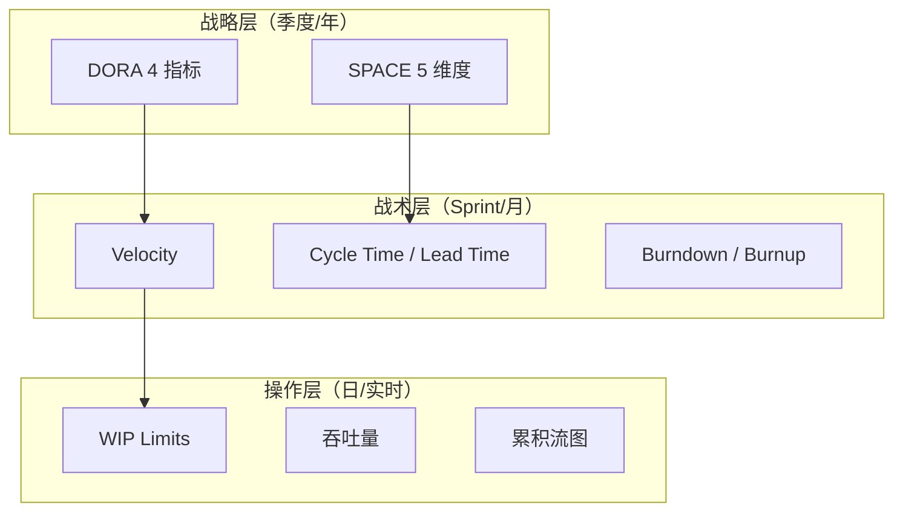

<!--
module:
  parent: project-management
  slug: project-management/agile-metrics
  type: article
  category: 主模块子文章
  summary: 敏捷度量实战手册：超越 DORA/SPACE 的团队效率可视化——Velocity、Burndown、Cycle Time、CFD 与度量反模式。
-->

# 敏捷度量 · Agile Metrics 实战

> 敏捷度量实战手册：超越 DORA/SPACE 的团队效率可视化——Velocity、Burndown、Cycle Time、CFD 与度量反模式。

---

## 一、一句话定位

**敏捷度量（Agile Metrics）**：用数据而非直觉来回答"团队做得怎么样"——从 Velocity 到 Cycle Time 到累积流图，构建多维度的团队效能画像。**但记住：度量是手段不是目的，被滥用的度量比不度量更危险。**

---

## 二、度量体系总览

### 2.1 三层度量框架



### 2.2 与 DORA/SPACE 的关系

> 本章聚焦**战术层 + 操作层**的度量指标。战略层的 DORA/SPACE 详见 [ai-pm-dora-space](../ai-pm-dora-space/README.md)。

| 层级 | 指标 | 更新频率 | 受众 |
|------|------|---------|------|
| 战略 | DORA 4 / SPACE 5 | 季度 | 管理层 / CTO |
| 战术 | Velocity / Cycle Time / Burndown | Sprint（2 周）| PM / Scrum Master |
| 操作 | WIP / 吞吐量 / CFD | 日 / 实时 | 团队自管理 |

---

## 三、Velocity（速度）

### 3.1 定义

**Velocity** = 团队在一个 Sprint 中完成的故事点（Story Points）总和。

### 3.2 使用规则

| 规则 | 说明 |
|------|------|
| **只看趋势，不看绝对值** | Velocity 用于观察"团队是否在进步"，不用于跨团队比较 |
| **取 3-5 个 Sprint 的平均值** | 单个 Sprint 波动大，平均值更可靠 |
| **不包括未完成的 Story** | 只做了一半 = 0 分（不计入 Velocity）|
| **不用作绩效指标** | 一旦用作 KPI，团队会膨胀 Story Points |

### 3.3 Velocity 趋势图

```
Sprint    Velocity    趋势
S1        32          ━━━━━━━━━━━━━━━━
S2        28          ━━━━━━━━━━━━━━
S3        35          ━━━━━━━━━━━━━━━━━━
S4        38          ━━━━━━━━━━━━━━━━━━━
S5        40          ━━━━━━━━━━━━━━━━━━━━
S6        42          ━━━━━━━━━━━━━━━━━━━━━
          ──── 3 周滚动均值: 40 ────
```

> **Goodhart 定律警告**：当 Velocity 成为目标，它就不再是好的度量——团队会把"3 点的 Story 拆成 5 点"。

---

## 四、Burndown & Burnup 图

### 4.1 Burndown（燃尽图）

**用途**：追踪 Sprint 内剩余工作量的消耗速度。

```
理想线 ╲
  40sp ──╲
         │ ╲  ●──── 实际线（前期慢）
  30sp   │   ╲  ●
         │    ╲   ●
  20sp   │     ╲     ●──●
         │      ╲          ●
  10sp   │       ╲            ●
         │        ╲
   0sp ──┼─────────╲──────────
         D1  D3  D5  D7  D9  D10
```

| 模式 | 形状 | 含义 |
|------|------|------|
| **理想** | 直线下降 | 节奏稳定 |
| **前慢后快** | 先平后陡 | 前期调研/阻塞、后期冲刺 |
| **前快后慢** | 先陡后平 | 容易的先做、难的卡住了 |
| **阶梯形** | 一段一段下降 | 大批量交付（不够持续）|
| **上升** | 往上走 | 需求蔓延（Sprint 内加 Story）|

### 4.2 Burnup（燃起图）

**用途**：展示已完成工作 + 总工作量的关系，特别适合追踪**范围变化**。

```
总范围 ─────────────────●────●
                        │    │
已完成 ────●──●──●──●──●──●──●
           D1 D2 D3 D4 D5 D6 D7
```

> **Burnup 优于 Burndown 的场景**：当 Sprint 中频繁加 Story 时，Burndown 看不出范围膨胀，Burnup 一目了然。

---

## 五、Cycle Time vs Lead Time

### 5.1 定义

```
Lead Time = 从"提出需求"到"交付上线"的总时间
            ├── 等待时间 ──┤── Cycle Time ──┤
            需求提出     开始开发          交付上线

Cycle Time = 从"开始开发"到"交付上线"的时间
             = 团队可控的时间段
```

### 5.2 对比

| 维度 | **Lead Time** | **Cycle Time** |
|------|-------------|--------------|
| 起点 | 需求提出 / 客户请求 | 开发开始（进入 In Progress）|
| 终点 | 上线 / 交付客户 | 上线 / 合并到 main |
| 可控性 | 部分可控（含等待） | 团队完全可控 |
| 用途 | 衡量端到端效率 | 衡量团队执行力 |
| 典型值 | 2-8 周 | 1-5 天 |

### 5.3 优化方向

| 瓶颈 | 表现 | 解决方案 |
|------|------|---------|
| **等待时间长** | Lead Time 远大于 Cycle Time | 优化需求审批流程、减少 Backlog 堆积 |
| **开发周期长** | Cycle Time 偏高 | 拆分更小的 Story、减少 WIP |
| **Review 等待** | PR 创建到合并时间长 | Code Review SLA（24h 内必回）|
| **部署瓶颈** | 合并到上线时间长 | CI/CD 自动化、一键部署 |

---

## 六、WIP Limits 与吞吐量

### 6.1 WIP Limits（在制品限制）

**原理**：限制同时进行中的工作数量，防止"开始很多、完成很少"。

| 阶段 | WIP Limit | 当前 WIP | 状态 |
|------|-----------|---------|------|
| To Do | ∞ | 15 | ✅ |
| In Progress | **3** | 3 | ⚠️ 已满 |
| In Review | **2** | 1 | ✅ |
| Done | ∞ | 8 | ✅ |

### 6.2 Little's Law

```
平均 WIP = 吞吐量 × 平均 Cycle Time

示例：
- WIP = 6 个任务
- 吞吐量 = 3 个/天
- → 平均 Cycle Time = 6 / 3 = 2 天

如果 WIP 增加到 12：
- 吞吐量不变 = 3 个/天
- → 平均 Cycle Time = 12 / 3 = 4 天（翻倍！）
```

> **核心洞察**：增加 WIP 不会增加吞吐量，只会增加 Cycle Time——多任务切换是效率杀手。

### 6.3 吞吐量（Throughput）

**定义**：单位时间内完成的工作项数量（如"每周完成 8 个 Story"）。

| 度量方式 | 优点 | 缺点 |
|---------|------|------|
| **按 Story 数量** | 简单直接 | 忽略 Story 大小差异 |
| **按 Story Points** | 考虑复杂度 | Points 可能膨胀 |
| **按 Issue 数量** | 最客观 | 粒度过细 |

> **推荐**：同时跟踪"Story 数量"和"Story Points"两个维度，取 3-5 周滚动平均。

---

## 七、累积流图（CFD）

### 7.1 什么是 CFD

**累积流图（Cumulative Flow Diagram）**：按状态堆叠展示工作项数量的趋势——一眼看出瓶颈在哪。

```
         ┌───────────────────────────────────── Done
         │▓▓▓▓▓▓▓▓▓▓▓▓▓▓▓▓▓▓▓▓▓▓▓▓▓▓▓▓▓▓▓▓▓▓│
         │                                     │
         │░░░░░░░░░░░░░░░░░░░░░░░░░░░░░░░░░░░░│ In Review
         │                                     │
         │█████████████████████████████████████│ In Progress ← 越来越宽 = 瓶颈
         │                                     │
         │▒▒▒▒▒▒▒▒▒▒▒▒▒▒▒▒▒▒▒▒▒▒▒▒▒▒▒▒▒▒▒▒▒│ To Do
         └─────────────────────────────────────
         W1  W2  W3  W4  W5  W6  W7  W8
```

### 7.2 从 CFD 读取信息

| 信号 | 含义 | 行动 |
|------|------|------|
| **某层越来越宽** | 该阶段是瓶颈 | 增加该阶段资源 / 减少上游输入 |
| **某层越来越窄** | 该阶段产能过剩 | 资源可以调到其他瓶颈 |
| **整体趋于平行** | 流动稳定 | 保持节奏 |
| **整体向上发散** | 需求进入 > 完成 | 减少新需求 / 增加团队产能 |
| **整体趋于收敛** | 接近完成 | 准备下一批工作 |

---

## 八、度量反模式（Anti-Patterns）

### 8.1 Goodhart 定律

> **"当一个度量成为目标，它就不再是好的度量。"**

| 度量 | 成为目标后的行为 | 正确用法 |
|------|----------------|---------|
| **Velocity** | 膨胀 Story Points | 只看趋势，不跨团队比 |
| **代码行数** | 写冗余代码 | 用 PR Review 质量替代 |
| **Bug 修复数** | 制造低优先级 Bug | 看 Bug 逃逸率（线上 Bug）|
| **加班时长** | 磨洋工 | 看交付成果 |
| **测试覆盖率** | 写无意义的测试 | 看关键路径覆盖 |

### 8.2 虚荣指标 vs 可行动指标

| 虚荣指标 🚫 | 可行动指标 ✅ |
|------------|-------------|
| 总代码行数 | 代码流失率（6 周内被修改的比例）|
| 总 Commit 数 | 有意义的 PR 合并数 |
| 测试覆盖率 % | 关键路径覆盖率 + 变异测试分数 |
| 加班小时数 | Cycle Time + 吞吐量 |
| Sprint 完成 Story 数 | Sprint 目标达成率 |

### 8.3 度量安全原则

| 原则 | 说明 |
|------|------|
| **度量是团队自改进工具** | 不是管理层监控工具 |
| **永远不将度量与绩效直接挂钩** | 一旦挂钩，度量就会被游戏化 |
| **多维度交叉看** | 单一指标容易被操纵，多维度交叉更难作弊 |
| **定期回顾度量本身** | 每季度问"这些度量还有用吗？" |
| **匿名聚合** | 看团队整体数据，不追踪个人 |

---

## 九、敏捷度量看板设计

### 9.1 团队级看板（每周更新）

| 指标 | 当前值 | 趋势 | 健康度 |
|------|--------|------|--------|
| Velocity（3 周均值）| 40 SP | ↑ 上升 | ✅ 健康 |
| Cycle Time（中位数）| 2.5 天 | → 稳定 | ✅ 健康 |
| WIP | 5 / Limit 6 | → 稳定 | ⚠️ 接近上限 |
| 吞吐量（周） | 8 Story | ↑ 上升 | ✅ 健康 |
| Sprint 目标达成率 | 85% | → 稳定 | ✅ 健康 |
| Bug 逃逸率 | 2 个/Sprint | ↓ 下降 | ✅ 改善中 |

### 9.2 管理层看板（每月/季度）

| 指标 | 来源 | 用途 |
|------|------|------|
| DORA 4 指标 | CI/CD 系统 | 研发效能趋势 |
| Lead Time 趋势 | Jira / Linear | 端到端交付效率 |
| 团队健康度 | SPACE 满意度调查 | 团队状态 |
| 代码流失率 | Git 分析 | AI 时代代码质量 |

---

## 十、常见问题

| 问题 | 原因 | 解决方案 |
|------|------|---------|
| Velocity 逐 Sprint 下降 | 技术债积累 / 团队士气低 | 安排技术债 Sprint / 1-on-1 了解原因 |
| Cycle Time 波动大 | Story 粒度不均匀 | Story 拆分工作坊（INVEST 原则）|
| WIP 经常超限 | 紧急插入太多 | 建立"快速通道"（WIP + 1 但必须有理由）|
| CFD 持续发散 | 需求进 > 完成 | 与 PO 协商减少 Sprint 承诺 |
| 度量数据没人看 | 看板不在视线内 | 挂在大屏 / 推送到 Slack |

---

← [返回: 项目管理与成本控制](../README.md)

## 📊 本节统计

- **战术层指标**：3 种（Velocity / Burndown-Burnup / Cycle Time-Lead Time）
- **操作层指标**：3 种（WIP Limits / 吞吐量 / CFD）
- **反模式**：5 种（Velocity 游戏化 / 代码行数 / Bug 修复数 / 加班时长 / 覆盖率注水）
- **核心公式**：Little's Law（WIP = 吞吐量 × Cycle Time）
- **看板层级**：2 层（团队级 + 管理层）
