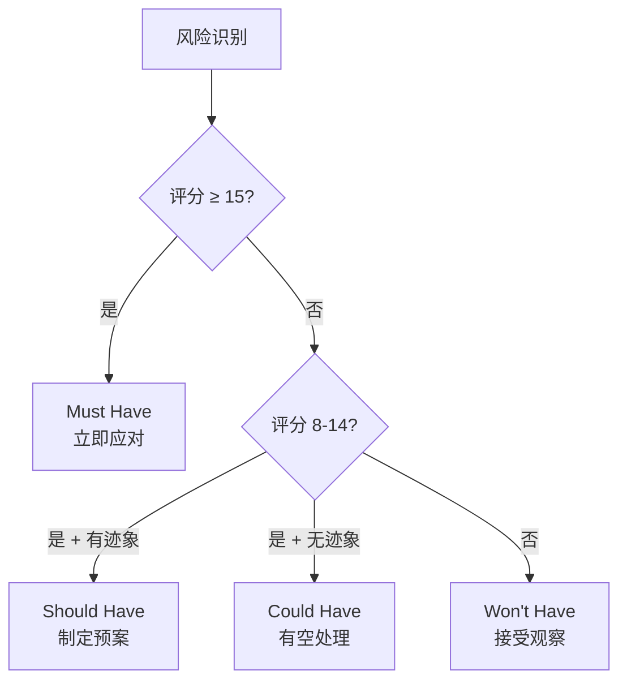
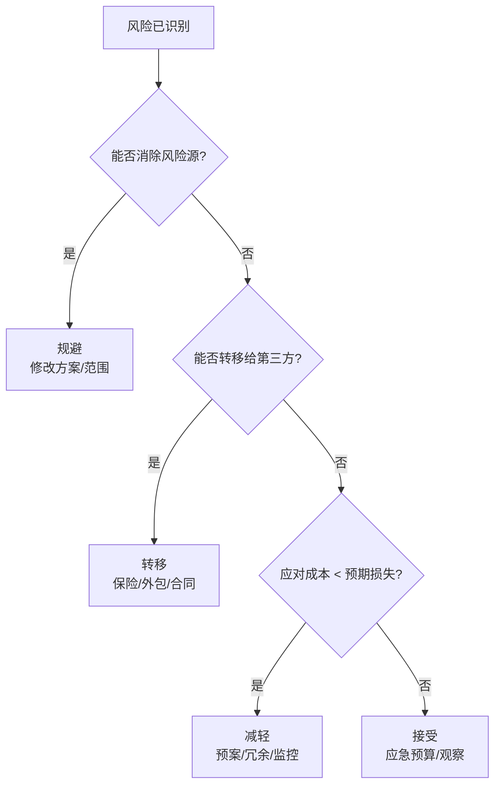

<!--
module:
  parent: project-management
  slug: project-management/risk-register
  type: article
  category: 主模块子文章
  summary: 项目风险登记册实战手册：从风险识别到应对策略，结合 MoSCoW 优先级与 RICE 评分的量化决策指南。
-->

# 项目风险登记册 · Risk Register 实战

> 项目风险登记册实战手册：从风险识别到应对策略，结合 MoSCoW 优先级与 RICE 评分的量化决策指南。

---

## 一、一句话定位

**项目风险登记册（Risk Register）**：项目管理的"体检报告"——把所有已知风险按结构化方式记录、评估、跟踪，确保"每个风险都有人管、有方案应对、有节点复查"。

---

## 二、风险登记册结构

### 2.1 标准字段

| 字段 | 说明 | 示例 |
|------|------|------|
| **风险 ID** | 唯一标识 | R-001 |
| **风险描述** | 清晰的风险陈述 | "核心开发人员可能中途离职" |
| **风险类别** | 技术 / 人员 / 进度 / 成本 / 外部 | 人员 |
| **概率（P）** | 1-5 分（1=极低, 5=极高）| 3（中等）|
| **影响（I）** | 1-5 分（1=极低, 5=灾难）| 4（高）|
| **风险评分** | P × I | 12 |
| **优先级** | MoSCoW / RICE | Must Handle |
| **应对策略** | 规避 / 转移 / 减轻 / 接受 | 减轻 |
| **应对措施** | 具体行动计划 | "交叉培训 + 文档化 + 备选外包" |
| **责任人** | 谁来跟踪和应对 | 技术总监 |
| **状态** | 开放 / 已关闭 / 已发生 | 开放 |
| **复查日期** | 下次评估时间 | 每 2 周 |

### 2.2 示例登记册

| ID | 描述 | P | I | 评分 | 策略 | 责任人 | 状态 |
|----|------|---|---|------|------|--------|------|
| R-001 | 核心后端工程师可能被挖走 | 3 | 4 | 12 | 减轻 | CTO | 开放 |
| R-002 | 第三方支付接口审批延迟 | 2 | 5 | 10 | 减轻 | PM | 开放 |
| R-003 | 需求方频繁变更范围 | 4 | 3 | 12 | 规避 | PM | 开放 |
| R-004 | 测试环境不稳定 | 3 | 2 | 6 | 接受 | DevOps | 开放 |
| R-005 | 安全审计发现高危漏洞 | 1 | 5 | 5 | 转移 | CISO | 开放 |

---

## 三、风险评估矩阵

### 3.1 概率 × 影响矩阵

```
影响 →  1(极低)  2(低)   3(中)   4(高)   5(灾难)
概率 ↓
5(极高)  5       10      15      20      25
4(高)    4       8       12      16      20
3(中)    3       6       9       12      15
2(低)    2       4       6       8       10
1(极低)  1       2       3       4       5
```

### 3.2 评分分区

| 风险评分 | 等级 | 处理方式 |
|---------|------|---------|
| **15-25** | 🔴 高风险 | 立即应对、管理层关注、每周期复查 |
| **8-14** | 🟡 中风险 | 制定预案、定期检查 |
| **1-7** | 🟢 低风险 | 接受或观察、每月复查 |

---

## 四、MoSCoW 优先级方法

在风险应对资源有限时，用 MoSCoW 决定先处理哪些风险：

| 分类 | 含义 | 风险场景 | 行动 |
|------|------|---------|------|
| **Must Have** | 必须应对 | 评分 ≥ 15 + 即将发生 | 立即行动、分配资源 |
| **Should Have** | 应该应对 | 评分 8-14 + 有触发迹象 | 制定预案、排入 Sprint |
| **Could Have** | 可以应对 | 评分 8-14 + 暂无迹象 | 有空时处理 |
| **Won't Have** | 暂不应对 | 评分 ≤ 7 | 记录观察、接受风险 |

### MoSCoW 决策流程



---

## 五、RICE 评分模型

RICE 是量化优先级排序的工具，特别适合在多个风险/需求之间做取舍：

### 5.1 RICE 公式

```
RICE 分数 = (Reach × Impact × Confidence) / Effort
```

| 维度 | 定义 | 取值范围 |
|------|------|---------|
| **Reach（影响范围）** | 影响多少人/系统 | 具体数字（如 500 用户）|
| **Impact（影响程度）** | 0.25 / 0.5 / 1 / 2 / 3 | 3=巨大, 0.25=微小 |
| **Confidence（信心）** | 对估算的确信度 | 100%=确定, 50%=猜测 |
| **Effort（工作量）** | 人月 / 人周 | 具体数字（如 2 人周）|

### 5.2 风险应对优先级排序示例

| 风险 | Reach | Impact | Confidence | Effort | RICE | 优先级 |
|------|-------|--------|-----------|--------|------|--------|
| R-001 核心人员离职 | 200 | 3 | 80% | 4 人周 | 120 | 1 |
| R-002 接口审批延迟 | 500 | 2 | 60% | 2 人周 | 300 | 2 |
| R-003 需求变更 | 1000 | 1 | 90% | 1 人周 | 900 | 3 |

> **解读**：RICE 分数越高，性价比越高——R-003 虽然影响小但应对成本极低，值得优先处理。

---

## 六、风险应对策略（4T 模型）

| 策略 | 英文 | 含义 | 适用场景 | 示例 |
|------|------|------|---------|------|
| **规避** | Avoid | 消除风险源 | 风险评分极高且可调整方案 | "不用未经验证的新技术" |
| **转移** | Transfer | 让第三方承担 | 可通过保险/合同转移 | "购买网络安全保险" / "外包非核心模块" |
| **减轻** | Mitigate | 降低概率或影响 | 大多数风险的首选 | "交叉培训 + 文档化" |
| **接受** | Accept | 主动或被动承担 | 低风险或应对成本过高 | "预留应急预算" |

### 6.1 策略选择决策树



---

## 七、风险登记册的运营节奏

| 频率 | 活动 | 参与者 |
|------|------|--------|
| **项目启动** | 初始风险识别（头脑风暴 + 历史复盘）| 全团队 |
| **每 2 周** | 风险复查（评分更新 + 新增/关闭）| PM + Tech Lead |
| **每月** | 风险报告（Top 5 风险 + 趋势）| 管理层 |
| **里程碑** | 风险审计（应对有效性回顾）| 全团队 |
| **风险发生时** | 应急响应 + Postmortem | 责任人 + PM |

---

## 八、与 12.story 的联动

> 本节风险管理的叙事版本见 [`12.story/44-tech-debt-career-trap`](../../12.story/44-tech-debt-career-trap.md)——技术债就是一种典型的"已接受风险"。

| 本章概念 | 12.story 对应 |
|---------|-------------|
| 风险登记册 | 阿明餐厅的"应急预案清单" |
| Error Budget 思维 | 技术债的"财务账本" |
| 减轻策略（交叉培训）| "不能只有一个人会做菜" |
| 接受策略（应急预算）| "留 20% 时间处理突发" |

---

## 九、常见问题

| 问题 | 原因 | 解决方案 |
|------|------|---------|
| 登记册写了没人看 | 缺乏运营节奏 | 绑定到 Sprint Review / 周会 |
| 风险评估全靠拍脑袋 | 没有历史数据参考 | 建立"风险数据库"，复盘时记录实际发生情况 |
| 应对方案太笼统 | "加强沟通"不是方案 | 要求每个措施有"谁、做什么、什么时候" |
| 风险评分通货膨胀 | 所有风险都打高分 | 用 MoSCoW + RICE 做二次排序 |

---

← [返回: 项目管理与成本控制](../README.md)

## 📊 本节统计

- **登记册字段**：12 个（ID / 描述 / 类别 / 概率 / 影响 / 评分 / 优先级 / 策略 / 措施 / 责任人 / 状态 / 复查日期）
- **评估矩阵**：5×5 = 25 格（红/黄/绿三区）
- **优先级方法**：2 种（MoSCoW + RICE）
- **应对策略**：4 种（规避 / 转移 / 减轻 / 接受）
- **运营节奏**：5 个频率（启动 / 双周 / 月 / 里程碑 / 发生时）
