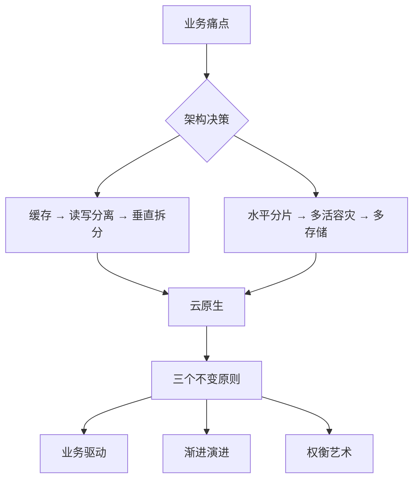

# 架构是"长"出来的

> 从阿明面馆的十年，看业务驱动下的系统演进与权衡

> **系列定位**：本篇是「阿明餐厅」系列的**前传**。讲述阿明从一间城中村小面馆，一步步走到支撑千万并发的智能餐饮平台。每一章都是一次真实的架构决策 —— 被业务逼出来的，不是提前设计好的。续集[《当餐厅长出大脑》](./01-ai-agent-architecture.md)讲的是阿明在此基础上接入 AI Agent 的故事。

---

## 引言：为什么用餐厅讲架构？

技术概念抽象难懂，但"开餐厅"人人都能理解。
今天，我们跟着阿明，从一间小厨房，走到支撑千万并发的智能餐饮平台，用一碗面的旅程，看懂架构的完整演进。

架构不是炫技，而是"生意大了，怎么让系统不崩"。

---

## 第一章：小本经营，一人一锅

阿明在城中村开了家"明记面馆"。

每天 30 碗面，阿明自己：接单、煮面、收银、收拾。所有订单记在一个小本本上。

```
订单本（单机 MySQL）
  桌号：1-10
  菜品：牛肉面 / 素面 / 加蛋
  状态：待做 / 进行中 / 已完成
```

优点：流程短、响应快、零沟通成本。
风险：阿明生病 = 停业；本子丢了 = 数据全丢。

业务初期，"简单"就是最高级的设计。别为了"可能的大流量"提前搞复杂架构。

---

## 第二章：排队太长，引入"预审员"

半年后，"明记"火了，饭点排队 1 小时。
顾客抱怨："就问个今天有啥菜，也要等阿明放下锅铲？"

引入缓存层，等于门口放菜单 + 预售员。

```
请求分流：
  查菜单 / 问价格 / 看等位 --> 预售员回答（Redis 缓存）
  下单 / 改需求 / 退菜    --> 阿明处理（MySQL 主库）
```

效果：60% 的咨询被拦截，阿明专注煮面，出餐速度提升。

### 缓存一致性的第一课

但新问题出现了：菜单改了，预售员不知道，顾客拿到的是旧菜单。

阿明需要选择**缓存更新策略**：

| 策略 | 做法 | 适合场景 |
|------|------|----------|
| Cache Aside | 先更新数据库，再删除缓存 | 读多写少（菜单更新频率低） |
| Write Through | 写入时同时更新缓存和数据库 | 数据一致性要求高 |
| Write Behind | 先更新缓存，异步写数据库 | 写多读少，可容忍短暂丢失 |

明记面馆选了 Cache Aside —— 菜单更新不频繁，删缓存后下次查询自动重建，简单够用。

缓存是性能优化的第一道防线，但"数据一致性"需要精心设计。这就是架构的本质：**用复杂度换性能，再用更多的复杂度管理这个复杂度**。

---

## 第三章：点单和做饭打架，分工！

生意继续火，新问题：

- 顾客不断点单（写操作）
- 阿明既要接单又要煮面（读写冲突）
- 效率反而下降，顾客等更久

**读写分离** = 前厅 + 后厨分工。

```
面馆动线改造：
  前厅（从库）：专职接单、查单、结账 --> 只读
  后厨（主库）：专职煮面、出餐     --> 只写
  传菜员（同步机制）：前厅订单 --> 后厨，实时同步
```

效果：专业的人做专业的事，并发处理能力提升。

但有个微妙的代价：刚下的单，前厅立刻查可能查不到 —— 因为主从同步需要时间。业务需要接受"秒级延迟"，技术上叫**最终一致性（Eventual Consistency）**：数据不会永远不一致，但在极短的时间窗口内，读到的可能是旧数据。

对明记面馆来说，这完全可以接受 —— 顾客下单后不会立刻去查订单状态，等几秒毫无影响。但如果是支付场景，就不能接受这种延迟了。

面多加水，水多加面。分离带来效率，也带来一致性成本。架构设计本质是"用复杂度换性能"。

---

## 第四章：业务扩张，按品类拆分

阿明开始卖奶茶、小吃、快餐。
问题：点奶茶的堵住了买面的通道，系统耦合严重。

**垂直拆分** = 按业务线独立运营。

```
明记餐饮集团：
  面食事业部 --> 独立厨房 + 订单系统（面库）
  饮品事业部 --> 独立吧台 + 库存系统（饮库）
  外卖事业部 --> 独立调度 + 配送系统（配送库）
```

效果：各业务线独立迭代，互不影响。

但新难题来了：顾客想"面 + 奶茶 + 小吃"一起下单，需要"订单中心"来聚合多条业务线的数据。拆得越细，"合"的逻辑越复杂。

康威定律在这里完美再现（详见[《从厨师到 CEO》第一章](./07-from-chef-to-ceo.md)）—— 系统架构反映组织分工。业务拆了，系统才能拆；业务没拆，强行拆系统只会制造更多沟通成本。

---

## 第五章：订单爆炸，分区域管理

外卖业务爆发，单月订单破千万。
"订单表"查一次要 10 秒，对账对到怀疑人生。

**水平分片** = 按区域 / 时间拆分数据。

```
拆分策略：
  按城市哈希：北京订单 --> 库 BJ，上海 --> 库 SH
  按时间归档：2024 年订单 --> 表_2024，历史数据冷存储
  热点隔离：爆款套餐单独分表，避免拖慢整体
```

效果：单库压力下降，查询响应回归毫秒级。

### 分片之后，"合"的代价

水平分片解决了单库性能问题，但引入了三个新挑战：

- **跨片查询**：用户想查"我在所有城市的订单"，需要聚合多个分片的数据
- **全局统计**：月度报表要跨所有分片汇总，不能直接 `COUNT(*)`
- **分布式事务**：一笔跨城市的订单，涉及两个分片的写入，如何保证要么全成功、要么全失败？

对于分布式事务，阿明调研了三种方案：

| 方案 | 原理 | 代价 |
|------|------|------|
| 2PC（两阶段提交） | 先预提交，再统一提交 / 回滚 | 同步阻塞，性能差 |
| Saga | 每步操作都有补偿操作，失败时逆向回滚 | 实现复杂，中间状态可见 |
| TCC（Try-Confirm-Cancel） | 预留资源 -> 确认 -> 取消 | 业务侵入性强，需要写三套逻辑 |

明记选了 Saga —— 外卖订单的补偿逻辑相对清晰（取消订单 -> 退款 -> 释放库存），比 2PC 性能好，比 TCC 实现成本低。

分治是应对规模的终极方案，但"分"得越细，"合"的逻辑越复杂。

---

## 第六章：单店风险，多店容灾

一场停电，阿明的总店停业 3 小时，损失惨重。
顾客抱怨："怎么你家一停电，全城都点不了？"

**集群部署 + 多地多活** = 中央厨房 + 区域分店。

```
容灾架构：
  中央厨房（主中心）：日常流量 70%，核心配方管理
  区域分店（备中心）：实时同步菜单，故障时自动接管
  云厨房（灾备）：纯外卖模式，极端情况保底运营
```

效果：单点故障不再致命，可用性从 99% 提升到 99.99%。

这个数字看着小，换算成实际影响：99% 意味着全年停机 3.65 天，99.99% 意味着全年停机 52 分钟。对于日均流水几十万的餐饮平台，这 3 天的差距就是几十万的损失。

新挑战：口味一致性（不同分店做出来的味道要一样）、库存同步（总店和分店的库存数据要实时对齐）、成本管控（多一套系统就多一份运维费用）。

高可用不是"多买几台服务器"，而是对业务连续性的系统性保障。

---

## 第七章：专业存储，各取所需

业务越来越杂，一种存储已经扛不住所有场景：

- 菜品图片（大文件）
- 用户评价（海量文本）
- 搜索"附近辣味面"（地理位置 + 模糊匹配）
- 秒杀"1 元奶茶"（超高并发）

阿明不再追求"一个数据库打天下"，而是让专业工具干专业活：

| 业务场景 | 存储方案 | 为什么选它 |
|----------|----------|-----------|
| 订单 / 支付 | MySQL | 强一致、事务保障 |
| 菜品详情 | MongoDB | 灵活结构、读写高效 |
| 用户行为日志 | Kafka + ClickHouse | Kafka 做高吞吐写入（也是[队列削峰](./04-peak-traffic-defense.md)的标配），ClickHouse 做实时分析 |
| 附近推荐 | Elasticsearch + Geo | 地理位置 + 全文检索 |
| 秒杀库存 | Redis + Lua 脚本 | 内存操作、原子扣减 |
| 菜品图片 | OSS + CDN | 静态资源加速、弹性扩容 |

每种数据用最适合的"容器"，整体效能最大化。

但这意味着运维团队要同时管理 6 种存储系统，技术栈碎片化带来的学习成本和运维压力是真实存在的。阿明的原则是：**只有当单一存储确实成为瓶颈时才引入新存储，每引入一种都要回答"为什么现有的不够用"。**

没有"银弹"数据库，只有"场景匹配"的技术选型。

---

## 终章：智能餐饮，云原生 + AI 运营

十年后，"明记"已成全国性智能餐饮平台。
阿明坐在指挥中心，看着：

- 实时热力图：哪里该增派骑手
- 自动扩缩容：午高峰前厨房资源自动扩容
- 智能预警：某分店出餐慢，系统自动派单支援

```
云原生核心：
  容器化（Docker）：新分店"镜像"一键部署
  K8s 编排：流量高峰自动"加厨师"，低谷自动"减资源"（详见[弹性伸缩](./04-peak-traffic-defense.md)）
  服务网格：订单 / 支付 / 配送服务间智能路由
  DevOps：菜品上线 --> 自动测试 --> 灰度发布 --> 全量

AI 智能加持：
  销量预测：提前备料，减少浪费
  智能调度：骑手路径 + 出餐时间 + 天气综合优化
  混沌工程：主动模拟"断网""爆单"，验证系统韧性（详见[全链路压测](./04-peak-traffic-defense.md)）
```

从"人肉救火"到"系统自愈"，效率与体验双提升。

阿明的感悟：
> "十年前，我愁的是面煮不过来；今天，我愁的是系统太聪明，人跟不上节奏。"

（续集预告：阿明接下来要在平台上接入 AI Agent —— 见[《当餐厅长出大脑》](./01-ai-agent-architecture.md)）

---

## 核心总结



### 三个不变原则

**业务驱动。** 所有架构升级，都源于真实痛点 —— 排队久？查单慢？易宕机？不是为了用新技术而用新技术。

**渐进演进。** 没有"一步到位"的完美架构，只有"小步快跑"的持续迭代。每一章的架构升级，都是被上一阶段的瓶颈逼出来的。

**权衡艺术。** 性能 / 成本 / 一致性 / 可维护性，永远在做选择题。选 A 就得接受 A 的代价，没有"全都要"的好事。

### 一句心法

> 面多加水，水多加面。
> 架构不是设计出来的，是"长"出来的。

### 给开发者的建议

| 阶段 | 关注点 | 行动建议 |
|------|--------|---------|
| 初级 | 写好一个接口 | 理解单机下的每一个细节 |
| 中级 | 思考"流量 x 10" | 预判瓶颈，设计降级方案 |
| 高级 | 平衡"过度设计"与"临时方案" | 用最小成本解决核心问题 |
| 顶级 | 让架构驱动业务创新 | 技术不是成本中心，而是增长引擎 |

---

## 延伸阅读

- [高峰保卫战](./04-peak-traffic-defense.md) —— 架构演进到云原生后，午高峰的流量洪水怎么扛？限流、熔断、降级、弹性伸缩
- [当餐厅长出大脑](./01-ai-agent-architecture.md) —— 架构演进到云原生后，AI Agent 是让系统"会思考"的下一步
- [厨房装监控](./05-observability.md) —— 系统拆成微服务后，出了问题怎么查？日志、指标、链路追踪
- [食安大检查](./06-security-architecture.md) —— 服务多了、接口多了，安全怎么保障？认证、权限、加密、零信任
- [从厨师到 CEO](./07-from-chef-to-ceo.md) —— 架构拆了，团队也要拆。康威定律、技术雷达、平台工程
- [给产品经理的重构说明书](./03-refactoring-guide-for-pm.md) —— 架构演进的过程中，技术债怎么管理？
- [厨房质检员](./08-qa-testing-strategy.md) —— 微服务架构下的测试策略：单元测试 + 契约测试 + E2E 测试
- [从接单到出餐](./09-cicd-devops.md) —— 架构演进后的持续交付：灰度发布、蓝绿部署、金丝雀发布
- [菜单设计学](./10-api-design.md) —— 微服务架构的核心挑战：API 设计、版本管理、向后兼容

---

## 结语

阿明的面馆故事，其实是无数互联网产品的缩影。
从一人一锅到智能平台，变的是技术栈，不变的是：

> 用工程思维解决业务问题，用演进视角看待系统成长。

下次当你纠结"要不要微服务""该不该上缓存"时，不妨问自己：

- 我的"阿明"现在卡在哪个环节了？
- 这个方案是解决真问题，还是制造新复杂度？
- 如果明天业务归零，这个架构还值得吗？

**好的架构，永远服务于人，而非炫技于代码。**

← [返回系列导读](./index.md)
