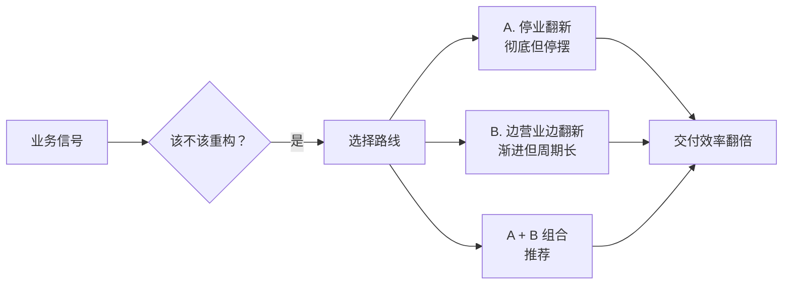

# 给产品经理的重构说明书

> 为什么阿明的厨房必须重新装修？

> **系列定位**：本篇是「阿明餐厅」系列的**番外**，用 PM 听得懂的语言讲重构。如果你是从[前传](./02-system-architecture-evolution.md)或[续集](./01-ai-agent-architecture.md)过来的技术同学，可以把这篇转发给你的产品经理。

> 写给 PM 的一句话：重构不是"工程师在浪费时间"，而是"在为你下一次大版本交付清空跑道"。

---

## 引言：研发说"要重构"，你该怎么听？

每隔几个月，研发负责人就会找你说："我们需要两周时间做重构。"

你的第一反应是："重构是什么？用户能看到变化吗？不能？那排期砍掉。"

这不怪你。重构这个词太技术化了，PM 很难理解它的价值。今天，我们用阿明餐厅的"厨房翻新"，把重构翻译成 PM 听得懂的语言。

看完这篇，你会知道：什么时候该批准重构、怎么评估重构的 ROI、怎么和研发高效协同。

---

## 五幕剧：当"加新菜"遇到"旧厨房"

> 本篇采用「五幕剧」结构（而非系列统一的「第 X 章」），刻意模拟产品经理熟悉的"用户故事"叙事节奏，帮助 PM 读者代入场景。

### 第一幕：MVP 时期，快就是王道

阿明的店刚开业，5 平米厨房，两口锅。
你（产品经理）说："明天上牛肉面。"
阿明把配方写在墙上，改个价格标签，搞定。

**对应产品阶段**：MVP 验证期，代码直白，需求交付以"天"为单位。

### 第二幕：疯狂迭代，技术债悄悄累积

生意火了，你不断提需求：
"加奶茶！""加轻食！""加满减活动！""加会员积分！"

阿明没扩厨房，只是：

- 插座拉满拖线板（硬编码）
- 砧板叠在收银台上（模块耦合）
- 冰箱塞到天花板（数据库臃肿）
- 传菜和洗菜路线交叉打架（逻辑混乱）

**对应产品阶段**：快速抢占市场，用"临时方案"换速度。表面能跑，内部已埋雷。

### 第三幕：大促压测，系统原地崩溃

双十一搞"满 100 减 30 + 套餐秒杀"，订单瞬间翻倍。厨房彻底瘫痪：

- 炒菜的找不到盐，做奶茶的打翻面汤
- 客人等 1 小时吃到冷饭，差评爆发
- 老厨师累到离职，新员工看不懂"祖传配方"

**对应产品阶段**：改 1 个 Bug 引出 3 个新 Bug；上线周期从 3 天拖到 3 周；PM 排期永远延期；线上事故频发。（流量视角的详细分析见[《高峰保卫战》](./04-peak-traffic-defense.md)）

### 第四幕：决定重构，两种翻新路线

阿明咬牙要修厨房。但怎么修？这是关键决策点。

**路线 A：停业翻新（大重构）**

停接新需求，专修厨房。不是买更贵的锅，而是：

1. 划分功能区（洗切 / 烹饪 / 出餐动线分离） --> 微服务拆分
2. 清理过期调料、统一配方卡 --> 代码规范化 + 注释文档
3. 升级排风 + 防滑地砖 --> 补全监控 + 自动化测试（详见[《厨房装监控》](./05-observability.md)）
4. 建立标准 SOP --> 接口契约 + CI/CD 流水线（详见[《从厨师到 CEO》第五章](./07-from-chef-to-ceo.md)）

产品视角：这一周"没上新功能"，排期看起来是"纯投入"。

**路线 B：边营业边翻新（渐进式重构）**

不是所有重构都需要"停摆"。阿明还可以选择**边做生意边改造**：

1. **绞杀者模式（Strangler Fig Pattern）**：新功能用新架构写，老功能一块一块迁移，新旧系统并行运行，直到老系统被"绞杀"干净。就像新厨房一间一间接着盖，旧厨房一间一间拆掉，全程不停业。

2. **分支抽象（Branch by Abstraction）**：在老代码和新代码之间加一层抽象接口，让调用方无感知地完成底层替换。就像换发动机 —— 外观不变，动力升级。

3. **特性开关（Feature Toggle）**：新逻辑上线后先对 1% 用户开放，验证无误再逐步放量，出问题一键回滚。这个思路在[流量治理的降级章节](./04-peak-traffic-defense.md)中也有应用。

| 路线 | 优点 | 缺点 | 适用场景 |
|------|------|------|----------|
| A：停业翻新 | 改得彻底，周期短 | 业务停摆，风险集中 | 系统已严重腐化，不修就要崩 |
| B：边营业边翻新 | 业务不停，风险分散 | 周期长，需要更强的工程能力 | 系统还能跑，但效率在下降 |

阿明最终选了 **A + B 的组合**：核心订单系统停业一周彻底翻新（路线 A），其余模块（会员、营销）用绞杀者模式逐步迁移（路线 B）。

### 第五幕：重新开业，交付效率翻倍

厨房翻新后，你再次提需求："上春季限定套餐"。

**翻修前**：研发看了一眼需求，叹了口气 —— 菜单模块和促销模块缠在一起，改个价格要同时改 5 个地方，测试要跑 3 天，上次类似的改动还搞崩了线上。"至少 2 周，还得看运气。"

**翻修后**：同样的需求，研发打开标准化的菜单配置后台，新增一个套餐品类，动线清晰的模块互不影响。自动化测试 10 分钟跑完，灰度发布 1 小时验证。**3 天交付，零故障。**

你继续提需求：

- "高峰期不卡单" --> 系统自动扩容，**零宕机**
- "新员工培训" --> 半天上岗，**不依赖老师傅**
- "食材损耗" --> 下降 30%，**运维成本骤降**

核心真相：重构没有改变"用户能吃到的菜"，但让**所有未来新菜的交付速度、稳定性和成本发生了质变**。

---

## PM 视角翻译表

| 餐厅场景 | 技术本质 | 产品 / 业务收益 |
|----------|----------|----------------|
| 拖线板满地、砧板叠放 | 代码耦合、技术债堆积 | 需求排期不断延期，改一处崩多处 |
| 传菜与洗菜路线交叉 | 服务边界模糊、调用混乱 | 跨端联调成本高，测试覆盖率低 |
| 停业翻新厨房 | 代码重构、架构优化 | 短期无可见功能，长期交付提速 50%+ |
| 边营业边翻新 | 渐进式重构（绞杀者模式） | 业务不中断，风险可控，持续交付 |
| 统一配方卡 + SOP | 接口规范 + 自动化测试 | 新人上手快，线上故障率下降 |
| 动线分离 + 设备升级 | 服务拆分 + 云原生改造 | 支撑 10 倍并发，大促不宕机 |

---

## 给产品经理的决策指南

### 1. 什么时候该批准重构？

当出现以下**业务信号**时，不要犹豫：

- 需求交付周期连续 3 个迭代超出原定周期
- 线上 P1/P2 故障率环比上升，且根因多为"历史逻辑冲突"
- 每次做相似需求（如加活动、改表单）都要从头写一遍
- 研发团队士气低迷，频繁抱怨"不敢改老代码"

### 2. 怎么评估重构 ROI？

别听技术黑话，看业务指标。向研发要这份"重构对账表"：

| 指标 | 重构前 | 重构后（预期） | 业务影响 |
|------|--------|---------------|---------|
| 需求平均交付周期 | 14 天 | 5-7 天 | 抢占市场窗口期 |
| 线上故障恢复时间（MTTR） | 2 小时 | 15-30 分钟 | 客诉率下降，口碑保护 |
| 新增功能复用率 | < 20% | 30-40% | 减少重复开发，降本 |
| 大促支撑能力 | 单实例扛不住 | 弹性扩缩容 | 活动 GMV 不流失 |

注意：复用率的预期不宜过高。重构后的复用能力需要时间积累，不会立竿见影地从 20% 跳到 60%。30-40% 是更现实的目标，后续随模块沉淀持续提升。

### 3. 如何与研发高效协同？

- **不砍重构排期，但控范围**：要求"按模块分期重构"，每次只动 1 个核心链路，不影响当期主线需求。
- **绑定业务目标**：把"重构完成"定义为"XX 功能交付提速 X 天"或"XX 大促零降级"，而非"代码变整洁了"。
- **建立技术债看板**：像管理产品需求池一样，给技术债排优先级，业务价值高的优先还。
- **允许渐进式方案**：不是每次重构都要"停业一周"。如果研发提出用绞杀者模式逐步迁移，这通常是更稳妥的选择。

---

## 核心总结：重构决策速查

| 关键问题 | 答案 |
|----------|------|
| 什么时候该重构？ | 交付周期连续超标、故障率上升、改一处崩多处 |
| 怎么评估 ROI？ | 看业务指标：交付周期、MTTR、复用率、大促能力 |
| 停业翻新还是渐进式？ | 核心系统可停业翻新，其余用绞杀者模式渐进迁移 |
| 怎么和研发协同？ | 不砍排期但控范围，绑定业务目标，建立技术债看板 |

### 一句心法

**重构不是"工程师的代码洁癖"，而是"产品经理的交付加速器"。** 清完跑道，你才能全速起飞。

---

## 延伸阅读

- [架构是"长"出来的](./02-system-architecture-evolution.md) —— 重构之后，架构还要继续演进。从缓存到微服务到云原生的完整路径
- [高峰保卫战](./04-peak-traffic-defense.md) —— 重构后的系统怎么应对大促？限流、熔断、降级的完整方案
- [厨房装监控](./05-observability.md) —— 重构时补全的监控，具体怎么设计？日志、指标、追踪、告警
- [食安大检查](./06-security-architecture.md) —— 重构也是补安全债的好时机：认证、权限、加密、审计日志
- [厨房质检员](./08-qa-testing-strategy.md) —— 重构时补全自动化测试，是"翻新厨房"的核心环节
- [从接单到出餐](./09-cicd-devops.md) —— 重构后的 CI/CD 流水线，让代码安全、快速地交付到生产环境
- [从厨师到 CEO](./07-from-chef-to-ceo.md) —— 重构需要组织保障：技术债的优先级怎么排？谁来拍板？
- [菜单设计学](./10-api-design.md) —— 重构过程中，API 的向后兼容是绞杀者模式的核心保障
- [当餐厅长出大脑](./01-ai-agent-architecture.md) —— AI Agent 系统也需要渐进式重构，技术债不会因为用了 AI 就消失
- [学徒的困境](./11-ai-learning-paradox.md) —— AI 时代的人机协作与学习之道，当 AI 越来越强，人还要不要练基本功
- [数据厨房](./12-data-kitchen.md) —— 数据架构与数据治理，10 家店 10 本账如何变成数据驱动决策
- [前厅翻修记](./13-frontend-renovation.md) —— 前端工程化与用户体验，后厨再快，前厅的门进不来一切白搭
- [阿明的省钱经](./14-cloud-finops.md) —— 云成本优化与 FinOps，120 万月账单如何降到 68 万
- [差评危机](./15-incident-response.md) —— 故障复盘与应急响应，从手忙脚乱到 10 分钟止血的方法论
- [外卖大战](./16-performance-optimization.md) —— 系统性能优化，3 秒生死线下的全链路优化实战
- [传菜窗口的智慧](./17-async-messaging.md) —— 引入消息队列本身就是一种重构，从同步耦合到异步解耦的架构翻新
- [十家店的烦恼](./18-distributed-puzzles.md) —— 分布式系统的一致性挑战，重构前需要理解 CAP 定理的权衡
- [阿明的加盟帝国](./19-saas-multitenant.md) —— SaaS 化的多租户重构，从单用户系统到多租户系统的大规模改造
- [厨房实况直播](./20-realtime-eventdriven.md) —— 实时系统的渐进式重构，从轮询到事件驱动的迁移路径
- [一个厨房四个门面](./21-multiplatform-architecture.md) —— 多端项目的重构挑战，多个客户端如何同步翻新
- [懂你的菜单](./22-search-recommendation.md) —— 搜索推荐系统的技术债管理，算法迭代的渐进式重构
- [菜谱标准化之路](./23-tech-docs-knowledge.md) —— 技术文档是重构决策的知识沉淀，ADR 记录每次"为什么改"
- [仓库搬家不停业](./24-database-migration.md) —— 数据库迁移是重构中最高风险的操作，在线 Schema 变更方法论
- [预制菜还是现炒](./25-lowcode-platform.md) —— 低代码 vs 全手写的选型决策，和重构决策一样需要权衡灵活与效率
- [阿明出海记](./26-globalization.md) —— 国际化重构的系统性规划，翻译只是表面，底层架构需要全面调整

---

## 结语

阿明翻新厨房的故事，说的是所有产品团队迟早要面对的一笔账：**技术债不会自己消失，拖得越久，利息越高。**

答案是：识别业务信号 → 评估 ROI → 选择路线（停业翻新 or 绞杀者模式）→ 绑定业务目标 → 渐进式交付。

下次研发说"要重构"时，不妨问自己：

- 这次重构，能帮我们下一个核心需求提前几天上线？
- 如果不做，下个版本线上出事故的概率有多大？
- 我们能不能先动最卡脖子的那 1 个模块，边还债边交付？

> 好产品需要好架构护航。别等跑道堆满障碍物才想起修缮 —— 现在就去和研发聊聊，找到那个最卡脖子的模块，迈出渐进式重构的第一步。

← [返回系列导读](./index.md)
