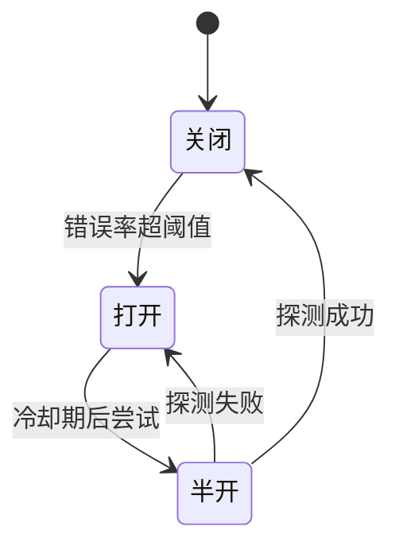
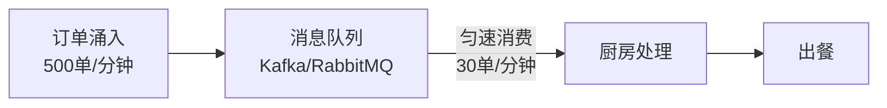
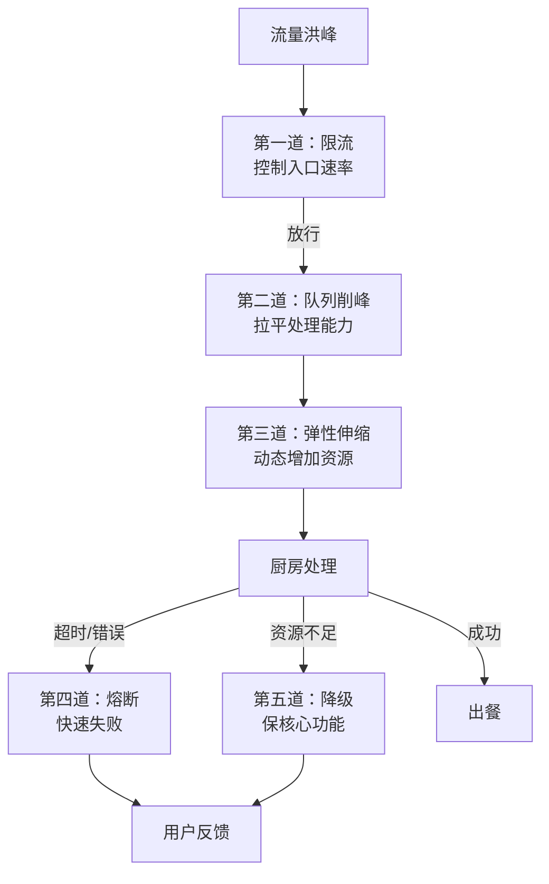

# 高峰保卫战

> 从阿明餐厅的午高峰，看流量治理的五道防线

> **系列定位**：本篇是「阿明餐厅」系列的**正传 1**。在[前传](./02-system-architecture-evolution.md)中，阿明完成了架构演进；在[续集](./01-ai-agent-architecture.md)中接入了 AI Agent；在[番外](./03-refactoring-guide-for-pm.md)中完成了重构。但所有这些能力，都要面对一个终极考验 —— 当流量洪峰真的来了，系统能不能扛住？

---

## 引言：午高峰，来了

阿明的餐厅上了外卖平台，生意火爆。
某天中午 11:30，系统突然涌入 500 个订单。

厨房瞬间崩了：

- 订单打印机卡纸（请求过载）
- 厨师同时炒 8 个锅，全糊了（资源耗尽）
- 退单电话打爆客服（雪崩效应）
- 顾客等到 13:00 还没吃上午饭，差评如潮

阿明看着后台的监控，满脸问号："我的系统明明能处理 200 单/分钟，为什么 500 单就全挂了？"

答案藏在一个关键区分里：**前厅的接单能力** ≠ **后厨的实际产能**。

前厅的接单、支付、派单等数字环节确实能扛 200 单/分钟，但后厨的真实产能只有 30 单/分钟（详见第二章）。当 500 单瞬间涌入，前厅不会崩，但远超后厨产能的订单堆积在队列中 —— 等太久 → 退单 → 客服电话打爆 → 差评如潮。流量治理的本质，不是让前厅"无限接单"，而是在**后厨产能有限**的前提下，**让系统"优雅地应对过载"**。

---

## 第一章：流量长什么样？

要治理流量，先要理解流量的形态。

```text
流量类型：
  平稳型：日常客流，可预测（工作日的午高峰）
  脉冲型：突发流量，不可预测（网红推荐带来的瞬间涌入）
  周期性：可预测的周期波动（节假日、大促）
  异常型：恶意流量（刷单、爬虫、DDoS 攻击）
```

阿明餐厅的日常客流是平稳型，但外卖平台大促（如"午餐免配送费"）会带来脉冲型流量，叠加节假日的周期性流量，再加上偶尔的恶意刷单，系统面临的是**多种流量形态的叠加**。

理解流量形态，是设计防护策略的前提。不同形态，需要不同的应对方案：

| 流量类型 | 应对策略 |
|----------|----------|
| 平稳型 | 容量规划，按峰值预留资源 |
| 脉冲型 | 弹性伸缩 + 队列削峰 |
| 周期性 | 提前扩容（预热），事后缩容 |
| 异常型 | 限流 + 风控拦截 |

> 📌 **关于"五道防线"**：本文标题中的"五道防线"指的是第二章到第六章的内容 —— **限流**（第二章）、**熔断**（第三章）、**降级**（第四章）、**队列削峰**（第五章）、**弹性伸缩**（第六章）。本章（第一章）是流量认知的基础铺垫，第七章（全链路压测）是验证防线效果的演练手段，两者是防线的支撑，不算在"五道防线"之内。

---

## 第二章：限流 —— 门口限号，保住厨房

阿明的厨房同时只能处理 30 个订单。如果 50 个订单同时涌进来，必然有 20 个要等。与其让 50 个订单全部"半做半停"地缓慢推进，不如**让 30 个订单快速完成，另外 20 个在队列里等待或直接拒绝**。

这就是限流的核心思想：**宁可拒绝一部分请求，也不要让整个系统崩掉**。

### 四种限流算法

| 算法 | 原理 | 类比 | 优缺点 |
|------|------|------|--------|
| 固定窗口 | 每分钟最多 30 单，超出拒绝 | 每分钟放 30 个号 | 简单，但有窗口边界突发问题 |
| 滑动窗口 | 过去 60 秒内最多 30 单 | 滚动计数 | 更平滑，但计算量大 |
| 令牌桶 | 每秒生成一个令牌，拿到令牌才能处理 | 匀速发号，无号等待 | 允许突发，但控制更精细 |
| 漏桶 | 所有请求先进桶，匀速流出 | 漏斗匀速滴漏 | 绝对匀速，但延迟高 |

阿明选了**令牌桶**：每秒生成一定数量的令牌，订单拿到令牌才能进入厨房处理。如果令牌用完，新订单要么排队等待，要么直接返回"当前繁忙，请稍后再试"。

令牌桶的优势在于：它允许一定程度的突发（桶里有存量令牌时），但长期平均速率是可控的。这比固定窗口更灵活，比漏桶更能应对突发场景。

限流是流量治理的第一道防线。它的本质是**承认资源有限，主动控制入口速率**。

---

## 第三章：熔断 —— 某道菜太慢，自动下架

午高峰，"红烧牛肉面"的出餐时间从平时的 5 分钟飙升到 15 分钟。如果系统继续接单，会发生什么？

- 新订单继续排队，队列越来越长
- 厨师被这道菜占满，其他菜没人做
- 整个厨房被一道菜拖垮

**熔断**的思想是：当某个服务的错误率或延迟超过阈值时，**自动切断对它的调用**，而不是让调用方无限等待。

### 熔断器的三种状态



**关闭状态（Closed）**：正常接单，统计错误率。如果"红烧牛肉面"的出餐超时率超过 50%，触发熔断。

**打开状态（Open）**：停止接单，直接告诉顾客"该菜品暂时售罄"。后厨专注做其他菜，不被这道菜拖累。

**半开状态（Half-Open）**：过一段时间后，尝试恢复接单。如果出餐时间恢复正常，解除熔断；如果还是超时，继续保持熔断。

熔断保护的不是"被熔断的服务"，而是**调用方和整个系统**。它的本质是**快速失败（Fail Fast）**，避免一个慢服务拖垮整个调用链。

---

## 第四章：降级 —— 高峰期只卖套餐

限流和熔断解决了"入口控制"和"故障隔离"，但如果流量确实很大，系统资源紧张，怎么办？

**降级**的核心是：**在资源不足时，主动放弃部分功能，保住核心业务**。

阿明的策略：

```text
正常时段：
  全部菜单可选
  支持自定义配料
  支持备注特殊要求
  支持预约下单

高峰降级：
  只卖 5 款爆款套餐（减少 SKU）
  不支持自定义（简化流程）
  不支持备注（减少沟通成本）
  暂停预约（专注当前订单）
```

降级的关键是**提前设计好降级方案**，而不是在高峰期临时拍脑袋。阿明和团队提前做了"降级预案表"：

| 触发条件 | 降级策略 | 恢复条件 |
|----------|----------|----------|
| CPU 使用率 > 80% | 关闭个性化推荐 | CPU < 60% |
| 订单队列 > 100 | 只卖爆款套餐 | 队列 < 50 |
| 支付服务超时 | 切换为货到付款 | 支付恢复 |
| 数据库响应 > 2s | 关闭历史订单查询 | 响应 < 500ms |

降级不是"系统变差"，而是**在极端场景下，用最小的功能集合保住最核心的用户体验**。

---

## 第五章：队列削峰 —— 订单排队，匀速出餐

限流控制了"进入系统的速率"，但已经进入系统的订单怎么处理？

如果 50 个订单同时到达厨房，厨师不可能同时做 50 碗面。正确的做法是：**订单进入队列，厨师按顺序匀速处理**。



队列的作用是**削峰填谷**：将瞬间的流量高峰，拉平成稳定的处理能力。

- 没有队列：500 单同时涌入 → 厨房崩溃 → 全部超时
- 有队列：500 单进入队列 → 厨房每分钟处理 30 单 → 最慢的订单等 16 分钟，但不会崩

16 分钟的等待虽然长，但比"系统崩溃、订单丢失、客服被打爆"要好得多。而且，队列可以配合**超时机制**：如果订单在队列里等了超过 10 分钟，自动取消并退款，避免无限等待。

消息队列（如 Kafka、RabbitMQ、RocketMQ）是削峰的标配。它的本质是**用时间换稳定性**，将"瞬间冲击"转化为"持续处理"。

---

## 第六章：弹性伸缩 —— 临时加灶台

前面五章都是在"限制流量"或"降低功能"，有没有办法**主动增加处理能力**？

有，这就是**弹性伸缩（Auto Scaling）**。

阿明的云厨房架构支持动态扩容：

```text
监控指标：CPU 使用率、订单队列长度、出餐延迟

扩容规则：
  CPU > 70% 持续 2 分钟 --> 新增 2 个灶台（容器实例）
  队列长度 > 50 --> 新增 1 个灶台
  
缩容规则：
  CPU < 30% 持续 10 分钟 --> 回收 1 个灶台
  队列清空 --> 回收到最小实例数
```

弹性伸缩的关键是**扩容要快，缩容要慢**。

扩容慢的话，流量高峰已经过了，新灶台才加好，毫无意义。缩容太激进的话，流量稍微下降就回收资源，结果下一波流量又来，又要重新扩容，造成"震荡"。

弹性伸缩依赖**实时监控指标**（如 CPU 使用率、队列长度），这些指标的设计思路详见[《厨房装监控》第三章](./05-observability.md)。没有好的 Metrics，弹性伸缩就是盲人开车。

阿明踩过一次坑：扩容阈值设得太低（CPU > 50% 就扩容），结果午高峰刚过，系统就缩容了；下午 5 点晚高峰一来，又要重新扩容。后来调整为"扩容快、缩容慢"，问题解决了。

弹性伸缩是云原生架构的核心能力。它的本质是**用按需付费的方式，应对流量波动**。

---

## 第七章：全链路压测 —— 模拟大促，提前演练

前面六章的策略，都是"事后应对"。有没有办法**提前发现问题**？

有，这就是**全链路压测（Full-link Stress Testing）**。

阿明在每次大促前，都会做一次"模拟午高峰"：

1. **构造流量**：用压测工具（如 JMeter、Gatling）模拟 1000 单/分钟的订单涌入
2. **观察系统**：监控 CPU、内存、数据库连接池、队列长度、出餐延迟
3. **发现问题**：哪个环节先撑不住？是订单服务、支付服务、还是后厨调度？
4. **优化调整**：针对瓶颈环节扩容、优化 SQL、调整限流阈值
5. **再次压测**：验证优化效果，直到系统能扛住目标流量

全链路压测的价值在于：**把"线上故障"变成"线下演练"**。与其在大促当天凌晨 3 点被报警电话叫醒，不如提前一周在压测环境中发现问题。

阿明的经验：每次大促前至少做 3 轮压测。第一轮总会发现问题，第二轮验证修复，第三轮确认稳定性。压测中发现问题后，需要借助[可观测性](./05-observability.md)（日志 + 指标 + 链路追踪）来定位根因。

---

## 核心总结：五道防线协同作战



> **注意**：五道防线并非严格的线性流水线，而是在不同层级（网关层、消息层、基础设施层、服务调用层、业务逻辑层）协同运作。此图为简化表达。

| 防线 | 核心思想 | 餐厅类比 | 技术实现 |
|------|----------|----------|----------|
| 限流 | 控制入口速率 | 门口限号 | 令牌桶 / 滑动窗口 |
| 队列削峰 | 拉平处理能力 | 订单排队 | Kafka / RabbitMQ |
| 弹性伸缩 | 动态增加资源 | 临时加灶台 | K8s HPA / Auto Scaling |
| 熔断 | 快速失败 | 某道菜自动下架 | Resilience4j / Sentinel |
| 降级 | 保核心功能 | 高峰期只卖套餐 | Feature Toggle / 预案表 |

> 📌 **表注**：五道防线协同运作，无固定顺序。它们在不同层级（网关层、消息层、基础设施层、服务调用层、业务逻辑层）并行发挥作用，并非严格的线性流水线关系。

### 一句心法

**流量治理不是"让系统无限快"，而是"让系统在过载时不崩溃"。** 宁可优雅地拒绝 30% 的请求，也不要让 100% 的请求全部超时。

---

## 延伸阅读

- [架构是"长"出来的](./02-system-architecture-evolution.md) —— 流量治理的前提是架构已经演进到云原生。从单机到微服务的路径
- [当餐厅长出大脑](./01-ai-agent-architecture.md) —— AI Agent 的限流、降级策略，和系统级流量治理原理相通
- [厨房装监控](./05-observability.md) —— 限流、熔断、降级策略的效果，需要可观测性来验证。日志 + 指标 + 追踪
- [食安大检查](./06-security-architecture.md) —— 异常流量中可能包含恶意攻击（DDoS、刷单），安全架构的限流和风控是第一道拦截
- [给产品经理的重构说明书](./03-refactoring-guide-for-pm.md) —— 如果系统扛不住流量，可能需要先重构架构，而不是单纯加机器
- [从厨师到 CEO](./07-from-chef-to-ceo.md) —— 限流、熔断、降级等能力应该沉淀到平台工程（IDP）中，让所有团队共享
- [厨房质检员](./08-qa-testing-strategy.md) —— 全链路压测是测试右移的典型实践，验证系统在高并发下的表现
- [从接单到出餐](./09-cicd-devops.md) —— 灰度发布是降级策略的进阶版，两者都通过"控制流量"降低风险
- [菜单设计学](./10-api-design.md) —— API 网关的限流、熔断能力，是流量治理的第一道防线
- [学徒的困境](./11-ai-learning-paradox.md) —— AI 时代的人机协作与学习之道，当 AI 越来越强，人还要不要练基本功
- [数据厨房](./12-data-kitchen.md) —— 数据架构与数据治理，10 家店 10 本账如何变成数据驱动决策
- [前厅翻修记](./13-frontend-renovation.md) —— 前端工程化与用户体验，后厨再快，前厅的门进不来一切白搭
- [阿明的省钱经](./14-cloud-finops.md) —— 云成本优化与 FinOps，120 万月账单如何降到 68 万
- [差评危机](./15-incident-response.md) —— 故障复盘与应急响应，从手忙脚乱到 10 分钟止血的方法论
- [外卖大战](./16-performance-optimization.md) —— 系统性能优化，3 秒生死线下的全链路优化实战
- [传菜窗口的智慧](./17-async-messaging.md) —— 消息队列是流量治理中"队列削峰"的技术实现细节
- [十家店的烦恼](./18-distributed-puzzles.md) —— 分布式系统中的限流和幂等性问题，与流量治理密切相关
- [阿明的加盟帝国](./19-saas-multitenant.md) —— 多租户场景的流量隔离，防止一个租户的流量洪峰影响其他租户
- [厨房实况直播](./20-realtime-eventdriven.md) —— 实时推送替代轮询，用更高效的方式应对突发流量
- [一个厨房四个门面](./21-multiplatform-architecture.md) —— 多端接入需要考虑不同渠道的流量特征和限流策略
- [懂你的菜单](./22-search-recommendation.md) —— 搜索推荐系统的降级策略，高峰期关闭个性化计算节省资源
- [菜谱标准化之路](./23-tech-docs-knowledge.md) —— 流量治理的限流阈值和降级规则需要标准化文档记录
- [仓库搬家不停业](./24-database-migration.md) —— 数据库迁移要避开流量高峰，迁移过程中的流量切换策略
- [预制菜还是现炒](./25-lowcode-platform.md) —— 低代码平台的活动页面可能成为流量爆点，需要纳入流量治理体系
- [阿明出海记](./26-globalization.md) —— 多区域部署的流量治理，不同时区的高峰时段不同，需要独立的限流策略

---

## 结语

阿明的午高峰保卫战，揭示了一个所有高并发系统都绕不开的核心矛盾：**资源有限，流量无限 —— 平衡点不在于无限扩容，而在于优雅地拒绝。**

答案是五道防线的协同：限流控制入口，队列拉平冲击，弹性增加资源，熔断隔离故障，降级保住核心。

下次当你设计高并发系统时，不妨问自己：

- 如果流量瞬间翻 5 倍，我的系统会怎样？
- 限流策略是什么？被限流的请求怎么处理？
- 如果某个下游服务挂了，会不会拖垮整个系统？
- 降级预案设计好了吗？有没有提前演练过？

> 好的流量治理，不是让系统"永远不崩"，而是让系统"崩得优雅、恢复得快"。

← [返回系列导读](./index.md)
