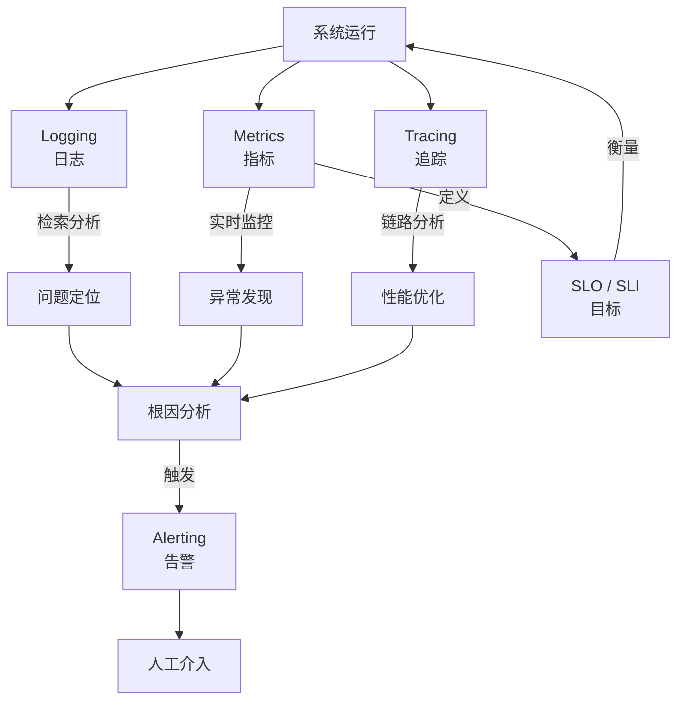

# 厨房装监控

> 从阿明餐厅的"出餐慢"投诉，看可观测性的三大支柱

> **系列定位**：本篇是「阿明餐厅」系列的**正传 2**。在[前传](./02-system-architecture-evolution.md)中，阿明完成了架构演进；在[高峰保卫战](./04-peak-traffic-defense.md)中学会了流量治理。但所有这些能力，都要建立在一个前提上 —— **你得知道系统哪里出了问题**。这就是可观测性的价值。

---

## 引言：一碗面等了 40 分钟

某天下午，阿明收到一条顾客投诉："我的牛肉面等了 40 分钟，太慢了！"

阿明想查原因，但：

- 没有监控，不知道订单卡在哪个环节
- 没有日志，不知道订单什么时候到后厨
- 没有追踪，不知道是哪个厨师接的单
- 没有告警，超时 40 分钟都没人发现

最后，阿明只能打电话给后厨主管："帮我查一下，38 号订单怎么回事？"

后厨主管翻了 10 分钟的纸质记录，回复："好像是打印机卡纸了，订单没打印出来。"

这个排查过程花了 30 分钟，而问题本身只需要 10 秒钟就能解决（重启打印机）。

**可观测性的本质，是让系统"自己告诉你哪里出了问题"，而不是让你去"猜"。**

---

## 第一章：黑盒困境 —— 为什么系统出了问题，你不知道？

传统的运维方式是"黑盒监控"：只看系统是否正常（HTTP 200 / 500），不看系统内部发生了什么。

这种方式的致命缺陷是：**当系统出问题时，你只知道"出问题了"，不知道"为什么出问题"**。

```
黑盒监控：
  用户下单 --> ??? --> 出餐成功 / 失败
  
可观测性：
  用户下单 --> 订单服务（200ms）--> 支付服务（500ms）--> 后厨调度（100ms）--> 打印机（超时 30s）--> 失败
```

可观测性（Observability）不是"监控"的升级版，而是一种**设计理念**：通过系统主动输出的信号（日志、指标、追踪），推断系统内部状态，而不仅仅是看"输入"和"输出"。

可观测性的三大支柱：Logging（日志）、Metrics（指标）、Tracing（追踪）。它们各有侧重，但必须协同使用。

---

## 第二章：Logging —— 厨房操作日志

阿明决定给厨房装一套"操作日志系统"：每个环节的关键操作都记录下来。

```
[2024-05-28 11:30:15] [订单服务] [INFO] 新订单 #12345：牛肉面 x1，桌号 3
[2024-05-28 11:30:15] [支付服务] [INFO] 订单 #12345 支付成功，金额 28 元
[2024-05-28 11:30:16] [后厨调度] [INFO] 订单 #12345 分配给厨师 A
[2024-05-28 11:30:16] [打印机]   [ERROR] 打印失败：纸张卡住，重试 3 次后放弃
[2024-05-28 11:30:46] [后厨调度] [WARN] 订单 #12345 等待出餐超时（30s）
```

有了这套日志，阿明 10 秒钟就能定位问题：打印机卡纸了。

### 日志设计的三个原则

**结构化**：日志不是自由文本，而是结构化的键值对。这样可以用 ELK（Elasticsearch + Logstash + Kibana）或 Loki 进行检索和分析。

```
// 差的日志
"订单 12345 支付成功"

// 好的日志（结构化）
{"order_id": "12345", "event": "payment_success", "amount": 28, "timestamp": "2024-05-28T11:30:15Z"}
```

**分级**：日志按严重程度分级（DEBUG / INFO / WARN / ERROR / FATAL），不同级别用于不同场景。生产环境通常只记录 INFO 及以上级别，避免日志量过大。

**关联**：每条日志都带上 `trace_id`（追踪 ID），这样可以把同一次请求的所有日志串联起来（下一章详述）。

日志是"事后排查"的基础。没有日志，出了问题只能靠猜。

日志不仅用于排障，也是[安全架构中审计日志](./06-security-architecture.md)的基础 —— 普通日志记录"发生了什么"，审计日志额外记录"谁做的"，满足合规要求。

---

## 第三章：Metrics —— 出餐速度仪表盘

日志记录了"发生了什么"，但阿明还需要知道"系统的整体健康状况如何"。这就是 Metrics（指标）的价值。

阿明在厨房装了一块"仪表盘"，实时显示关键指标：

```
实时指标（每分钟更新）：
  订单处理速率：32 单/分钟（正常范围：25-40）
  平均出餐时间：4.2 分钟（正常范围：3-6）
  打印机错误率：2%（正常范围：< 1%）⚠️
  厨师利用率：78%（正常范围：60-85%）
  订单队列长度：12（正常范围：5-20）
```

当"打印机错误率"超过 1% 时，仪表盘自动标红，提醒运维人员关注。

### 四种核心指标类型

| 类型 | 说明 | 示例 |
|------|------|------|
| Counter（计数器） | 累计值，只增不减 | 总订单数、总错误数 |
| Gauge（仪表盘） | 瞬时值，可增可减 | 当前队列长度、CPU 使用率 |
| Histogram（直方图） | 分布统计 | 出餐时间分布（P50 / P95 / P99） |
| Summary（摘要） | 分位数统计 | 95% 的订单在 6 分钟内出餐 |

阿明最关心的是 **P99 出餐时间**：99% 的订单在多少分钟内出餐？这个指标比"平均出餐时间"更能反映真实体验 —— 因为平均值会被少数极端值拉高或拉低，而 P99 能告诉你"最差的 1% 体验有多差"。

Metrics 是"实时监控"的基础。有了 Metrics，阿明可以在问题发生前就发现异常，而不是等问题发生后才去查日志。

---

## 第四章：Tracing —— 一碗面的全链路追踪

日志和 Metrics 解决了"发生了什么"和"系统整体如何"，但还有一个问题没解决：**一次请求经过了哪些服务，每个环节花了多少时间？**

这就是 Distributed Tracing（分布式追踪）的价值。

阿明给每个订单分配一个唯一的 `trace_id`，所有服务在处理这个订单时，都带上这个 ID，并记录自己的处理时间。

```
订单 #12345 的全链路追踪（trace_id: abc-123）：

[订单服务]     0ms - 50ms    (50ms)  接收订单
    ↓
[支付服务]     50ms - 600ms  (550ms) 支付验证
    ↓
[后厨调度]     600ms - 650ms (50ms)  分配厨师
    ↓
[打印机服务]   650ms - 30650ms (30000ms) 打印订单 ⚠️ 超时
    ↓
[出餐确认]     30650ms - 30700ms (50ms) 确认出餐

总耗时：30700ms（30.7 秒）
瓶颈：打印机服务（占总耗时 97.7%）
```

有了全链路追踪，阿明一眼就能看出：**打印机服务是瓶颈，花了 30 秒，占总耗时的 97.7%**。

### 追踪的核心概念

**Span**：一次操作的记录，包含操作名称、开始时间、耗时、状态。上面的每个方括号就是一个 Span。

**Trace**：一次完整请求的所有 Span 的集合。上面的整个链路就是一个 Trace。

**Context Propagation**：上下文传递。`trace_id` 和 `span_id` 在服务间传递，确保所有 Span 能串联成完整的 Trace。

常用的追踪系统有 Jaeger、Zipkin、SkyWalking。它们提供可视化界面，让开发者可以直观地看到每一次请求的完整链路。

Tracing 是"性能优化"的利器。有了 Tracing，阿明可以精准定位瓶颈，而不是"凭感觉"优化。

---

## 第五章：Alerting —— 超时自动报警

有了日志、指标、追踪，阿明可以"事后排查"和"实时监控"。但如果阿明在忙别的事，没看仪表盘呢？

**Alerting（告警）** 的作用是：当指标超过阈值时，**主动通知相关人员**。

```
告警规则：
  打印机错误率 > 5% 持续 2 分钟 --> 通知后厨主管（企业微信）
  平均出餐时间 > 10 分钟 持续 5 分钟 --> 通知运维团队（电话）
  订单队列长度 > 50 持续 3 分钟 --> 通知阿明（短信）
```

### 告警设计的三个原则

**分级**：告警按严重程度分级（P0 / P1 / P2 / P3），不同级别触发不同的通知方式。P0（系统崩溃）直接打电话，P3（轻微异常）只发企业微信。

**抑制**：避免"告警风暴"。如果某个服务挂了，可能会触发几十个相关告警。告警系统需要"聚合"和"抑制"，只发送一条汇总告警，而不是刷屏。

**可操作**：每条告警都要包含"怎么排查"和"怎么恢复"的指引。一条"打印机错误率过高"的告警，如果没告诉运维人员"检查打印机纸张、重启打印机"，就是一条无效告警。

阿明踩过一次坑：告警阈值设得太低（打印机错误率 > 1% 就告警），结果每天收到几十条告警，最后干脆把告警关了。后来调整为"分级 + 抑制"，告警量下降了 80%，但每一条都是真正需要关注的。

告警是"主动防御"的基础。有了告警，阿明不需要 24 小时盯着仪表盘，系统会主动告诉他"哪里出问题了"。告警还可以联动[流量治理的降级策略](./04-peak-traffic-defense.md) —— 当告警触发时，系统自动执行降级预案，无需人工干预。

---

## 第六章：SLO / SLI —— 定义"好"的标准

前面五章解决了"怎么发现问题"，但还有一个更根本的问题：**什么是"好"？什么是"不好"？**

阿明和团队讨论了很久，最终定义了三个核心 SLO（Service Level Objective，服务级别目标）：

| SLI（指标） | SLO（目标） | 说明 |
|-------------|-------------|------|
| 出餐成功率 | >= 99.9% | 每 1000 单，最多 1 单失败 |
| P99 出餐时间 | <= 10 分钟 | 99% 的订单在 10 分钟内出餐 |
| 系统可用性 | >= 99.95% | 全年停机时间 < 4.38 小时 |

**SLI（Service Level Indicator）** 是"度量什么"（如出餐时间），**SLO** 是"目标是多少"（如 <= 10 分钟）。

有了 SLO，阿明可以量化"系统是否健康"，而不是凭感觉判断。如果 SLO 达标，说明系统运行良好；如果 SLO 不达标，说明需要投入资源优化。

### 错误预算（Error Budget）

SLO 的另一个价值是**错误预算**：100% - SLO = 可以容忍的"失败空间"。

例如，出餐成功率 SLO = 99.9%，意味着每 1000 单可以容忍 1 单失败。如果本周已经失败了 0.8 单（接近预算上限），就需要暂停新功能开发，专注于稳定性优化。

错误预算的价值在于：**它把"稳定性"和"创新"的权衡，从"拍脑袋"变成了"用数据说话"**。

---

## 核心总结：可观测性的三大支柱协同



| 支柱 | 解决什么问题 | 餐厅类比 | 技术实现 |
|------|-------------|----------|----------|
| Logging | 发生了什么？ | 厨房操作日志 | ELK / Loki |
| Metrics | 系统整体如何？ | 出餐速度仪表盘 | Prometheus + Grafana |
| Tracing | 哪里慢了？ | 一碗面的全链路追踪 | Jaeger / Zipkin |
| Alerting | 主动通知 | 超时自动报警 | Alertmanager / PagerDuty |
| SLO / SLI | 什么是"好"？ | 服务级别目标 | 自定义仪表盘 |

### 一句心法

**可观测性不是"监控"的升级版，而是"让系统自己说话"的设计理念。** 没有可观测性，运维就是"盲人摸象"；有了可观测性，运维就是"上帝视角"。

---

## 延伸阅读

- [当餐厅长出大脑](./01-ai-agent-architecture.md) —— AI Agent 的反馈进化依赖可观测性数据：用户评分、推荐准确率、幻觉率
- [高峰保卫战](./04-peak-traffic-defense.md) —— 可观测性告诉你"系统过载了"，流量治理告诉你"怎么应对"
- [食安大检查](./06-security-architecture.md) —— 日志和追踪不仅用于排障，审计日志还满足安全合规要求
- [架构是"长"出来的](./02-system-architecture-evolution.md) —— 系统演进到微服务后，可观测性从"可选项"变成"必选项"
- [从厨师到 CEO](./07-from-chef-to-ceo.md) —— 故障复盘（Postmortem）依赖可观测性数据，是跨团队协作的核心机制之一
- [厨房质检员](./08-qa-testing-strategy.md) —— 测试发现问题，可观测性定位问题。两者形成"预防 + 治疗"的闭环
- [从接单到出餐](./09-cicd-devops.md) —— 部署后的监控告警，是可观测性在 CI/CD 中的典型应用
- [给产品经理的重构说明书](./03-refactoring-guide-for-pm.md) —— 可观测性数据（如模块错误率、延迟）是重构优先级排序的客观依据
- [菜单设计学](./10-api-design.md) —— API 网关的日志、指标、追踪，是可观测性的数据来源

---

## 结语

阿明装监控的故事，本质上是所有分布式系统都要面对的问题：**系统越复杂，越难知道"哪里出了问题"**。

可观测性的三大支柱（日志、指标、追踪）+ 告警 + SLO，构成了一个完整的"系统健康管理体系"。

下次当你设计系统时，不妨问自己：

- 如果系统出问题了，我能在 5 分钟内定位根因吗？
- 我的日志是结构化的吗？能检索吗？
- 我有全链路追踪吗？能看到一次请求的完整链路吗？
- 我的告警会不会"狼来了"？有没有抑制和分级？
- 我定义了 SLO 吗？什么是"好"，什么是"不好"？

> 好的系统，不是"永远不出问题"，而是"出了问题能自己告诉你"。

← [返回系列导读](./index.md)
