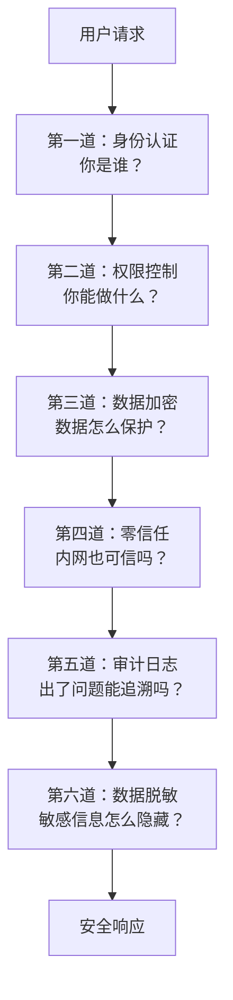

# 食安大检查

> 从阿明餐厅的突击检查，看安全架构的六大防线

> **系列定位**：本篇是「阿明餐厅」系列的**正传 3**。在[续集](./01-ai-agent-architecture.md)中，我们讨论了 AI Agent 的安全护栏（Prompt 注入防护、输出校验）。但系统安全远不止 AI 安全 —— 身份认证、权限控制、数据加密、零信任、审计日志，这些才是安全架构的基石。

> 最后更新: 2026-06-15


---

## 引言：市场监管局来了

某天下午，市场监管局的检查员突击检查阿明餐厅：

- "请出示所有员工的健康证。"（身份认证）
- "你们的秘方配方有保密措施吗？"（数据加密）
- "谁能进后厨？有没有权限管理？"（权限控制）
- "如果出了问题，能追溯到具体是谁操作的吗？"（审计日志）
- "外卖单上顾客的手机号是完整的吗？"（数据脱敏）

阿明一脸懵："我们……好像都没有。"

检查员开出了整改通知书："限期 30 天整改，否则暂停营业。"

安全架构的本质，不是"防黑客"，而是**让系统在合规的前提下，安全地运行**。

---

## 第一章：身份认证 —— 统一门禁系统

**整改第一周**，阿明先解决最基础的问题：谁能进餐厅的系统？

阿明的餐厅有 50 个员工，每人都有自己的工牌。但问题是：

- 张三的工牌能进后厨，也能进仓库（权限过大）
- 赵六离职了，工牌还没注销（孤儿账号）
- 王五的工牌丢了，被别人捡到后冒用（身份冒用）

**身份认证（Authentication）** 的核心是：**确认"你是谁"**。

### 三种认证方式

| 方式 | 原理 | 类比 | 安全性 |
|------|------|------|--------|
| 密码认证 | 用户名 + 密码 | 工牌 + 密码 | 低（密码易泄露） |
| 多因素认证（MFA） | 密码 + 短信验证码 / 指纹 | 工牌 + 指纹 | 高 |
| SSO（单点登录） | 一次登录，访问所有系统 | 一张门禁卡通用 | 中（便利性高） |

阿明选择了 **SSO + MFA** 的组合：员工用企业微信登录（SSO），登录时还需要短信验证码（MFA）。这样既方便了员工（不需要记多套密码），又提高了安全性（即使密码泄露，没有短信验证码也登录不了）。

### OAuth 2.0：第三方授权

阿明的餐厅接入了美团外卖平台，需要让美团读取菜单和库存信息。但阿明不想把数据库密码给美团。

**OAuth 2.0** 的解决方案是：阿明给美团一个**有限权限的令牌（Token）**，美团只能用这个令牌读取菜单和库存，不能访问其他数据。令牌有过期时间，阿明随时可以撤销。

```text
传统方式：
  阿明把数据库密码给美团 --> 美团能访问所有数据（危险）

OAuth 2.0：
  阿明给美团一个令牌（scope: read_menu, read_inventory）--> 美团只能读菜单和库存（安全）
```

身份认证是安全架构的第一道防线。它的本质是**确认身份，防止冒用**。

---

## 第二章：权限控制 —— 工牌等级制度

门禁装好了，但阿明很快发现第二个问题 —— 光能进门不够，还得管住每个人能碰什么。

身份认证解决了"你是谁"，但**你能做什么**？

阿明的餐厅有不同的角色：厨师、服务员、收银员、仓库管理员、店长。每个角色能访问的系统和数据是不同的。

### RBAC：基于角色的权限控制

**RBAC（Role-Based Access Control）** 的核心是：**权限绑定在角色上，而不是绑定在个人上**。

```text
角色权限表：
  厨师：能看订单、能操作后厨系统、不能看财务报表
  服务员：能看订单、能操作点餐系统、不能操作后厨系统
  收银员：能看订单、能操作支付系统、不能看后厨系统
  店长：能看所有系统、能修改配置、不能删除审计日志
  
员工分配：
  张三 --> 厨师角色 --> 自动继承厨师的权限
  赵六 --> 服务员角色 --> 自动继承服务员的权限
```

RBAC 的优势是**管理简单**：新员工入职，只需要分配一个角色，自动获得对应的权限。如果权限需要调整，只需要修改角色的权限，所有该角色的员工自动生效。

### ABAC：基于属性的权限控制

RBAC 的局限是**粒度不够细**。例如，阿明想设置"厨师只能看自己负责的订单"，RBAC 做不到（因为"自己负责的"是动态属性）。

**ABAC（Attribute-Based Access Control）** 的核心是：**权限基于属性（用户属性、资源属性、环境属性）动态计算**。

```text
ABAC 规则：
  IF 用户.角色 == "厨师" AND 订单.分配厨师 == 用户.姓名 THEN 允许查看
  IF 用户.角色 == "店长" AND 时间.小时 >= 9 AND 时间.小时 <= 18 THEN 允许修改配置
```

ABAC 更灵活，但配置更复杂。阿明的策略是：**大部分场景用 RBAC，少数需要细粒度控制的场景用 ABAC**。

权限控制是安全架构的第二道防线。它的本质是**最小权限原则（Least Privilege）**：每个人只能访问自己需要的资源。

---

## 第三章：数据加密 —— 配方保密措施

**整改第二周**，阿明开始保护最核心的资产 —— 配方。

阿明的"秘制牛肉面"配方是核心竞争力，绝对不能泄露。但配方需要在后厨系统中存储和传输，如何保护？

### 两种加密方式

**传输加密（TLS/SSL）**：数据在网络传输时加密，防止中间人窃听。

```text
未加密：
  客户端 --> [配方：牛肉 500g, 辣椒 50g, 秘制酱料 30g] --> 服务器
  （中间人可以窃听）

TLS 加密：
  客户端 --> [加密数据：x7f9a2b3c4d5e6f...] --> 服务器
  （中间人看到的只是乱码）
```

**存储加密（AES）**：数据在数据库或磁盘上加密存储，防止数据库被拖库后泄露。

阿明选择了 **TLS 1.3（传输加密）+ AES-256（存储加密）** 的组合。即使数据库被黑客攻破，没有解密密钥，拿到的也只是乱码。

### 密钥管理：加密的"保险箱"

加密的核心是**密钥**。如果密钥泄露，加密形同虚设。

阿明使用**密钥管理服务（KMS）** 管理密钥：

- 密钥定期轮换（每 90 天）
- 密钥访问需要 MFA 认证
- 密钥使用记录全程审计
- 密钥存储在硬件安全模块（HSM）中，物理隔离

数据加密是安全架构的第三道防线。它的本质是**即使数据泄露，也无法被利用**。

---

## 第四章：零信任 —— 每道门都要刷卡

**整改第三周**，检查员打来电话追问了一个更棘手的问题："如果内鬼作案呢？你们的员工进了内网就能为所欲为？"

传统的网络安全模型是"城堡模型"：**内网是可信的，外网是不可信的**。一旦进入内网，就可以自由访问所有资源。

但这种模型的致命缺陷是：**如果内网被攻破（如员工账号被盗、内鬼作案），攻击者可以在内网自由横走**。

**零信任（Zero Trust）** 的核心思想是：**永远不信任，始终验证**。无论是内网还是外网，每次访问都需要认证和授权。

想象一下：一个外卖员溜进后厨等餐，趁人不注意溜进了仓库偷拍配方。城堡模型下，他一旦通过了餐厅大门（防火墙），就能在后厨自由走动。零信任的做法是 —— 仓库门、冷库门、配方柜，每道门都要单独刷卡，外卖员即使进了后厨也打不开任何一道门。

```text
城堡模型：
  外网 --> 防火墙 --> 内网（自由访问）
  
零信任：
  外网 --> 认证 --> 服务 A --> 认证 --> 服务 B --> 认证 --> 数据库
  （每次访问都要认证，即使在内网）
```

阿明的零信任架构：

- 每个服务都有独立的身份认证（mTLS，双向 TLS）
- 服务间通信需要互相验证证书
- 每次 API 调用都需要携带令牌，令牌有过期时间和权限范围
- 网络微隔离（Micro-segmentation），不同服务在不同的网络区域，默认不通

零信任架构下，服务间的每次通信都有认证开销。这也是为什么在[架构演进](./02-system-architecture-evolution.md)中，阿明强调"不要随意引入新服务" —— 每多一个服务，就多一份零信任的配置和运维成本。

零信任的价值在于：**即使某个服务被攻破，攻击者也无法横向移动到其他服务**。

零信任是安全架构的第四道防线。它的本质是**假设内网也会被攻破，缩小爆炸半径**。

---

## 第五章：审计日志 —— 出问题能追溯

检查员的追问让阿明意识到，光有防御不够 —— 万一还是出了事，能不能查出来？

市场监管局检查时问："如果出了问题，能追溯到具体是谁操作的吗？"

阿明之前的日志只记录了"发生了什么"，没有记录"谁做的"。例如：

```text
差的审计日志：
  [2024-05-28 15:30:00] 菜单价格被修改：牛肉面 28 元 --> 35 元
  
好的审计日志：
  [2024-05-28 15:30:00] 用户：张三（厨师）, IP: 192.168.1.100, 操作：修改菜单价格, 对象：牛肉面, 旧值：28 元, 新值：35 元
```

### 审计日志的四个要素

**Who**：谁做的？（用户 ID、角色、IP 地址）

**What**：做了什么？（操作类型、操作对象、操作前后的值）

**When**：什么时候做的？（精确到毫秒的时间戳）

**Where**：在哪里做的？（IP 地址、设备信息、地理位置）

审计日志的价值不仅是"事后追溯"，还有**威慑作用**：当员工知道自己的所有操作都会被记录，就不敢轻易违规。

阿明还设置了**审计日志不可删除**：审计日志写入独立的存储系统，即使是管理员也无法删除或修改。这样即使内鬼作案，也无法销毁证据。

审计日志的格式设计、结构化存储、检索分析，和普通日志系统共用同一套基础设施。详见[《厨房装监控》第二章](./05-observability.md)。安全审计日志在此基础上额外要求了 Who（操作人）和不可篡改性。

审计日志是安全架构的第五道防线。它的本质是**让所有操作可追溯，形成威慑**。

---

## 第六章：数据脱敏 —— 外卖单不显示完整手机号

**整改第四周**，阿明在检查外卖流程时发现了一个被忽视的漏洞 —— 外卖单上印着顾客的完整手机号和家庭地址。

阿明的外卖订单上有顾客的姓名、手机号、地址。这些信息如果泄露，会侵犯顾客隐私，还可能被用于诈骗。

**数据脱敏（Data Masking）** 的核心是：**在不影响业务的前提下，隐藏敏感信息**。

```text
未脱敏：
  顾客：张三, 手机号：13812345678, 地址：北京市朝阳区 XX 路 XX 号

脱敏后：
  顾客：张*, 手机号：138****5678, 地址：北京市朝阳区**路**号
```

### 三种脱敏方式

| 方式 | 原理 | 适用场景 |
|------|------|----------|
| 掩码 | 部分字符替换为 * | 展示场景（如外卖单） |
| 哈希 | 不可逆散列（单向函数） | 唯一标识（如用户 ID） |
| 令牌化 | 替换为无意义的令牌 | 需要还原的场景（如支付） |

阿明的策略：

- 外卖单上的顾客信息：掩码（张*, 138****5678）
- 数据库中的用户密码：哈希（bcrypt）
- 支付系统中的银行卡号：令牌化（替换为 Token，需要时通过支付网关还原）

数据脱敏是安全架构的第六道防线。它的本质是**最小化敏感信息暴露，降低泄露风险**。

---

## 核心总结：安全架构的六大防线



| 防线 | 解决什么问题 | 餐厅类比 | 技术实现 |
|------|-------------|----------|----------|
| 身份认证 | 确认身份 | 统一门禁系统 | OAuth / SSO / MFA |
| 权限控制 | 控制访问 | 工牌等级制度 | RBAC / ABAC |
| 数据加密 | 保护数据 | 配方保密措施 | TLS / AES / KMS |
| 零信任 | 缩小爆炸半径 | 每道门都要刷卡 | mTLS / 微隔离 |
| 审计日志 | 追溯操作 | 操作记录不可删 | ELK + 独立存储 |
| 数据脱敏 | 隐藏敏感信息 | 外卖单不显示完整手机号 | 掩码 / 哈希 / 令牌化 |

### 一句心法

**安全架构不是"防黑客"，而是"假设系统一定会被攻破，如何缩小损失"。** 每一道防线都不是完美的，但叠加在一起，就形成了纵深防御（Defense in Depth）。

---

## 延伸阅读

- [厨房装监控](./05-observability.md) —— 审计日志的格式设计和检索分析，和普通日志系统共用基础设施
- [架构是"长"出来的](./02-system-architecture-evolution.md) —— 架构演进到微服务后，零信任和 mTLS 成为安全架构的必选项
- [高峰保卫战](./04-peak-traffic-defense.md) —— 异常流量（DDoS、刷单）的限流和风控拦截，是安全与流量治理的交叉地带
- [当餐厅长出大脑](./01-ai-agent-architecture.md) —— AI Agent 的安全护栏：Prompt 注入防护、权限沙箱、输出校验
- [从厨师到 CEO](./07-from-chef-to-ceo.md) —— 安全架构的落地需要组织保障：权限审批流程、安全评审、故障复盘
- [给产品经理的重构说明书](./03-refactoring-guide-for-pm.md) —— 重构也是补安全债的好时机：趁翻新厨房，把食安标准一并升级
- [厨房质检员](./08-qa-testing-strategy.md) —— 安全测试：渗透测试、漏洞扫描、依赖检查，是测试策略在安全领域的应用
- [从接单到出餐](./09-cicd-devops.md) —— 安全左移：在 CI/CD 流水线中集成安全扫描，让安全问题尽早暴露
- [菜单设计学](./10-api-design.md) —— API 网关的认证、授权、数据脱敏，是安全架构的核心环节
- [学徒的困境](./11-ai-learning-paradox.md) —— AI 时代的人机协作与学习之道，当 AI 越来越强，人还要不要练基本功
- [数据厨房](./12-data-kitchen.md) —— 数据架构与数据治理，10 家店 10 本账如何变成数据驱动决策
- [前厅翻修记](./13-frontend-renovation.md) —— 前端工程化与用户体验，后厨再快，前厅的门进不来一切白搭
- [阿明的省钱经](./14-cloud-finops.md) —— 云成本优化与 FinOps，120 万月账单如何降到 68 万
- [差评危机](./15-incident-response.md) —— 故障复盘与应急响应，从手忙脚乱到 10 分钟止血的方法论
- [外卖大战](./16-performance-optimization.md) —— 系统性能优化，3 秒生死线下的全链路优化实战
- [传菜窗口的智慧](./20-realtime-eventdriven.md) —— 消息队列的安全性：消息加密、防窃听、防重复消费
- [十家店的烦恼](./18-distributed-puzzles.md) —— 分布式系统中的拜占庭问题，节点间通信的安全与防篡改
- [阿明的加盟帝国](./19-saas-multitenant.md) —— 多租户数据隔离是安全架构在 SaaS 场景的延伸
- [厨房实况直播](./20-realtime-eventdriven.md) —— 实时推送消息的认证和授权，防止未授权的 WebSocket 连接
- [一个厨房，四个门面](./21-multiplatform-architecture.md) —— 多端渠道的安全统一管理，不同客户端的认证方式差异
- [懂你的菜单](./22-search-recommendation.md) —— 搜索推荐系统中的用户隐私保护，推荐数据的脱敏处理
- [菜谱标准化之路](./07-from-chef-to-ceo.md) —— 安全知识的文档化管理，安全规范和应急响应手册的版本控制
- [仓库搬家不停业](./24-database-migration.md) —— 数据库迁移中的数据安全，迁移过程中的加密和权限保障
- [预制菜还是现炒](./25-lowcode-platform.md) —— 低代码平台的安全挑战：恶意配置防护、沙箱隔离、权限管控
- [阿明出海记](./26-globalization.md) —— GDPR/APPI 等数据合规法规，是安全架构的法律层面
- [厨房大换岗](./27-ai-org-transformation.md) —— AI 转型中的权限重设计，岗位变化需要同步调整访问控制
- [阿明的二次创业](./28-ai-native-startup.md) —— AI 原生创业的安全基线，从第一天就建立 AI 安全实践
- [会自我进化的厨房](./29-self-evolving-company.md) —— Agent Loop 的安全策略层，Agent 的权限边界和安全过滤
- [AI 的"黑暗料理"](./30-ai-hallucination-safety.md) —— AI 幻觉是新的安全挑战，幻觉护栏是安全架构在 AI 时代的延伸

---

## 结语

阿明的食安大检查，揭示了一个所有系统都绕不开的问题：**便利和安全不是对立的 —— 好的安全架构让用户感觉不到它的存在，但让攻击者处处受限。**

第 30 天，检查员复查。他走了一圈，翻了翻审计日志，看了看脱敏的外卖单，最后说了一句："你们是我见过整改最认真的餐厅。"

阿明笑了。这 30 天的折腾，换来的是六大防线的纵深防御：身份认证确认身份，权限控制限制访问，数据加密保护数据，零信任缩小爆炸半径，审计日志追溯操作，数据脱敏隐藏敏感信息。

下次当你设计系统时，不妨问自己：

- 我的系统有身份认证吗？有没有孤儿账号？
- 权限控制是基于角色的吗？有没有"超级管理员"权限过大？
- 数据传输和存储都加密了吗？密钥怎么管理？
- 我假设内网也会被攻破了吗？有没有零信任？
- 审计日志能追溯到"谁、什么、何时、在哪里"吗？日志不可删除吗？
- 敏感信息（如手机号、银行卡号）做了脱敏吗？

> 好的安全架构，不是"让用户感觉不到安全"，而是"让攻击者感觉处处受限"。

← [返回系列导读](./index.md)
