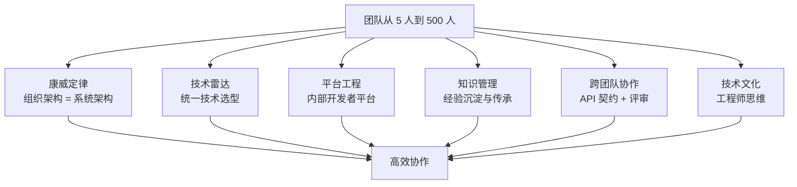

# 从厨师到 CEO

> 从阿明的 10 家店 500 人，看团队与组织的技术管理

> **系列定位**：本篇是「阿明餐厅」系列的**终章**。在前面的故事中，阿明完成了架构演进、AI Agent 接入、流量治理、可观测性、安全架构。但当团队从 5 人变成 500 人，技术管理的挑战全变了 —— 不再是"怎么实现"，而是"怎么让 500 个人高效协作"。

---

## 引言：5 个人和 500 个人的区别

阿明的第一家店只有 5 个员工：阿明（老板兼厨师长）、2 个厨师、1 个服务员、1 个收银员。

沟通成本几乎为零：阿明喊一声"加个新菜"，5 个人 10 分钟就能对齐。

十年后，阿明开了 10 家店，团队 500 人：

- 技术团队 80 人，分成 8 个小组
- 每家店有自己的运维团队
- 总部有产品、运营、市场、财务

新问题全变了：

- 每家店的菜单系统不一样（技术栈分裂）
- 新店要 3 个月才能上线（交付效率低）
- 老员工和新员工互相看不懂代码（知识传承断层）
- 5 个团队同时改同一个服务（协作冲突）

阿明坐在办公室里，第一次感到"技术不是最难的问题，人才是"。

---

## 第一章：康威定律 —— 组织架构 = 系统架构

阿明发现一个奇怪的现象：**系统的架构，总是和组织的架构惊人地相似**。

```
组织架构：
  前端团队 --> 订单服务
  后端团队 --> 支付服务
  数据团队 --> 推荐服务
  
系统架构：
  前端模块 --> 订单模块 --> 支付模块 --> 推荐模块
  （模块边界和团队边界完全一致）
```

这就是**康威定律（Conway's Law）**：系统的架构反映组织的沟通结构。

### 康威定律的两种应用

**正向应用**：先设计组织架构，再设计系统架构。阿明把团队按业务领域拆分（订单团队、支付团队、推荐团队），每个团队负责一个独立的服务，团队间通过 API 通信。这样系统自然形成了微服务架构，模块边界清晰。

**逆向康威**：先设计系统架构，再调整组织架构。阿明想把单体系统拆成微服务，于是先把团队拆成多个小组，每个小组负责一个微服务。组织架构变了，系统架构自然就变了。

阿明的经验：**康威定律不是"应该遵守的规律"，而是"可以利用的工具"**。想改变系统架构，先改变组织架构；想改变组织架构，先改变沟通方式。

这个定律在[架构演进的垂直拆分](./02-system-architecture-evolution.md)中已经初现端倪 —— 业务拆了，系统才能拆。在[AI Agent 的多智能体协同](./01-ai-agent-architecture.md)中同样适用 —— 智能体的分工边界，就是系统的模块边界。

---

## 第二章：技术雷达 —— 统一技术选型

阿明的 10 家店，技术栈五花八门：

- 第 1 家店用 Java + MySQL
- 第 3 家店用 Python + PostgreSQL
- 第 5 家店用 Go + MongoDB
- 第 8 家店用 Node.js + Redis

结果是：**新员工入职要学 4 种语言，跨店协作要对接 4 种数据库，运维团队要管 4 种技术栈**。

阿明决定引入**技术雷达（Technology Radar）**，统一技术选型。

### 技术雷达的四个象限

```
技术雷达（每季度更新）：

采纳（Adopt）：
  - Java 17（后端主力语言）
  - MySQL 8.0（关系型数据库）
  - Redis（缓存）
  - Kafka（消息队列）

试验（Trial）：
  - Go（高性能服务）
  - ClickHouse（OLAP 分析）
  - gRPC（服务间通信）

评估（Assess）：
  - Rust（系统级编程）
  - GraphQL（API 查询）

暂缓（Hold）：
  - PHP（新项目不再使用）
  - MongoDB（除非有特殊场景）
```

技术雷达的价值在于：**给团队一个明确的技术选型指南，避免"每个团队自己造轮子"**。

阿明的原则：

- 新项目必须从"采纳"象限中选择技术
- 如果想用"试验"象限的技术，需要技术委员会评审
- "暂缓"象限的技术，新项目禁止使用，老项目逐步迁移

技术雷达不是一成不变的，每季度更新一次，根据实际使用效果调整。

---

## 第三章：平台工程 —— 内部开发者平台

阿明的技术团队有 80 人，但每个团队都在重复造轮子：

- 订单团队搭了一套 CI/CD 流水线
- 支付团队也搭了一套 CI/CD 流水线
- 推荐团队又搭了一套 CI/CD 流水线

结果是：**3 个团队花了 3 倍的人力，做了 3 套功能差不多的流水线，而且互不兼容**。

阿明决定成立**平台工程团队（Platform Engineering）**，搭建一个**内部开发者平台（Internal Developer Platform, IDP）**。

### 内部开发者平台的核心能力

```
内部开发者平台（IDP）：
  服务脚手架：一键生成新项目（统一技术栈、统一目录结构）
  CI/CD 流水线：标准化的构建、测试、部署流程
  服务注册发现：统一的服务注册中心（Consul / Nacos）
  配置中心：统一的配置管理（Apollo / Nacos）
  监控告警：统一的 Metrics、Logging、Tracing、Alerting（详见[《厨房装监控》](./05-observability.md)）
  API 网关：统一的流量入口、限流、熔断、降级（详见[《高峰保卫战》](./04-peak-traffic-defense.md)）
```

平台工程的价值在于：**让业务团队专注于业务逻辑，不需要关心基础设施**。

阿明的效果：

- 新项目启动时间：从 2 周（自己搭基础设施）缩短到 1 天（用脚手架一键生成）
- CI/CD 流水线维护成本：从 3 个团队各维护 1 套，变成 1 个平台团队维护 1 套
- 新员工入职：不需要学各种内部工具，只需要学 IDP 的使用方式

平台工程不是"运维团队的升级版"，而是**把基础设施变成产品，让开发者成为用户**。

---

## 第四章：知识管理 —— 经验沉淀与传承

阿明的老厨师王师傅干了 8 年，掌握了很多"祖传配方"和"经验技巧"。但王师傅从来不写文档，所有知识都在他脑子里。

某天王师傅离职了，新员工小李接手，发现：

- 配方写在一张皱巴巴的纸上，字迹模糊
- 很多技巧（如"火候怎么掌握"）完全没有记录
- 系统里有一些奇怪的配置（如"这个参数必须是 7"），但没人知道为什么

这就是**知识孤岛**问题：关键知识掌握在少数人手里，没有沉淀和传承。

### 知识管理的三个层次

**文档化**：把隐性知识变成显性知识。阿明要求每个团队维护一份"技术文档"，包括：

- 架构设计文档（为什么这么设计）
- API 文档（接口定义、参数说明）
- 运维手册（怎么部署、怎么排查问题）
- 故障复盘（出了什么问题、怎么解决的、怎么避免）

**工具化**：把文档变成可执行的工具。阿明把"王师傅的经验"沉淀成自动化脚本：

```
王师傅的经验：
  "每次大促前，要提前 1 小时预热缓存"
  
工具化：
  自动化脚本：大促前 1 小时自动触发缓存预热
```

**平台化**：把工具变成平台能力。阿明把"缓存预热"做成了 IDP 的一个功能，所有团队都可以用，不需要自己写脚本。

知识管理的价值在于：**让知识不依赖于某个人，而是沉淀在系统中**。

---

## 第五章：跨团队协作 —— 从"各自为战"到"协同作战"

阿明的 8 个技术团队，各自为战，很少沟通。结果是：

- 订单团队改了订单接口，支付团队不知道，导致支付失败
- 推荐团队上了新功能，前端团队不知道，导致页面显示异常
- 运维团队改了配置，开发团队不知道，导致服务启动失败

**跨团队协作**的核心是：**建立规范的沟通机制和协作流程**。

### 三种协作机制

**API 契约（Contract）**：团队间通过 API 契约定义接口规范，修改接口前必须通知对方，并提供向后兼容的方案。

```
API 契约：
  订单服务 v1.0：
    POST /orders
    请求：{user_id, items, address}
    响应：{order_id, status}
    
  变更通知：
    订单服务 v1.1 将新增字段 coupon_id（可选），向后兼容
    上线时间：2024-06-01
    影响范围：支付服务、推荐服务
```

**技术评审（Tech Review）**：重大技术方案需要跨团队评审，确保方案合理、不影响其他团队。

**故障复盘（Postmortem）**：故障发生后，相关团队一起复盘，找出根因，制定改进措施。复盘不追究责任，只关注"怎么避免下次再犯"。高效的故障复盘依赖[可观测性](./05-observability.md)提供的数据：日志、指标、链路追踪，让复盘有数据支撑，而不是靠记忆和猜测。

阿明的经验：**跨团队协作不是"开更多的会"，而是"建立规范的流程和工具"**。API 契约、技术评审、故障复盘，这些机制让协作变成"默认行为"，而不是"靠人情"。

---

## 第六章：技术文化 —— 从厨师到工程师思维

阿明的团队有一个问题：**大家把自己当"厨师"，而不是"工程师"**。

厨师的思维是："按菜谱做菜，做完就行。"
工程师的思维是："不仅要做出菜，还要考虑可维护性、可扩展性、可测试性。"

### 工程师文化的五个特征

**代码审查（Code Review）**：每行代码都要经过至少一位同事的审查，确保代码质量。

**自动化测试**：单元测试覆盖率 > 80%，集成测试覆盖核心链路，上线前必须通过所有测试。

**持续学习**：每周一次技术分享，每月一次外部技术交流，鼓励团队成员学习新技术。

**故障不追责**：故障复盘只关注"怎么避免"，不追究"谁的责任"。鼓励大家主动暴露问题，而不是掩盖问题。

**技术驱动业务**：技术团队不是"被动接需求"，而是主动思考"技术怎么驱动业务创新"。

阿明的转变：

```
之前：
  产品经理提需求 --> 技术团队实现 --> 上线
  
之后：
  技术团队和产品经理一起讨论需求 --> 技术团队提出技术方案 --> 评估 ROI --> 实现 --> 上线
```

技术文化的价值在于：**让团队从"被动执行"变成"主动思考"**。

---

## 核心总结：团队与组织的技术管理



| 挑战 | 解决方案 | 核心思想 |
|------|----------|----------|
| 技术栈分裂 | 技术雷达 | 统一技术选型，避免各自造轮子 |
| 交付效率低 | 平台工程 | 把基础设施变成产品 |
| 知识传承断层 | 知识管理 | 文档化 -> 工具化 -> 平台化 |
| 协作冲突 | 跨团队协作 | API 契约 + 技术评审 + 故障复盘 |
| 团队思维固化 | 技术文化 | 从厨师思维到工程师思维 |

### 一句心法

**技术管理的本质，不是"管人"，而是"建立让 500 个人像 5 个人一样高效协作的机制"。** 康威定律、技术雷达、平台工程、知识管理、跨团队协作、技术文化，这些机制让组织从"人治"变成"法治"。

---

## 延伸阅读

- [架构是"长"出来的](./02-system-architecture-evolution.md) —— 康威定律在架构演进中的真实案例：垂直拆分背后的组织变革
- [当餐厅长出大脑](./01-ai-agent-architecture.md) —— Multi-Agent 的协同设计，是康威定律在 AI 系统中的新应用
- [高峰保卫战](./04-peak-traffic-defense.md) —— 限流、熔断、降级等流量治理能力，是平台工程（IDP）的核心组件
- [厨房装监控](./05-observability.md) —— 故障复盘（Postmortem）依赖可观测性数据，而非记忆和猜测
- [食安大检查](./06-security-architecture.md) —— 安全架构的落地需要组织保障：权限审批、安全评审、审计合规
- [给产品经理的重构说明书](./03-refactoring-guide-for-pm.md) —— 技术债的管理需要技术管理者和 PM 共同决策优先级
- [厨房质检员](./08-qa-testing-strategy.md) —— Code Review 和测试是工程师文化的两大支柱
- [从接单到出餐](./09-cicd-devops.md) —— CI/CD 是平台工程（IDP）的核心能力，应该沉淀为团队共享的基础设施
- [菜单设计学](./10-api-design.md) —— API 契约是跨团队协作的基础，API 设计是契约的核心

---

## 结语

阿明从厨师到 CEO 的故事，本质上是所有技术团队都要面对的成长挑战：**团队大了，怎么让 500 个人像 5 个人一样高效协作？**

答案是六大机制：康威定律指导组织设计，技术雷达统一技术选型，平台工程提升交付效率，知识管理沉淀经验，跨团队协作规范流程，技术文化塑造工程师思维。

下次当你管理团队时，不妨问自己：

- 我的组织架构和系统架构一致吗？有没有"一个团队维护多个服务"或"多个团队维护一个服务"？
- 我有技术雷达吗？还是每个团队自己选技术？
- 我有内部开发者平台吗？还是每个团队自己搭基础设施？
- 关键知识沉淀在文档和系统中，还是掌握在少数人手里？
- 团队间有 API 契约吗？还是靠口头沟通？
- 我的团队是"厨师思维"还是"工程师思维"？

> 好的技术管理，不是"让所有人都听话"，而是"让所有人都能发挥自己的价值"。

← [返回系列导读](./index.md)
