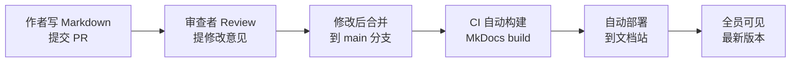
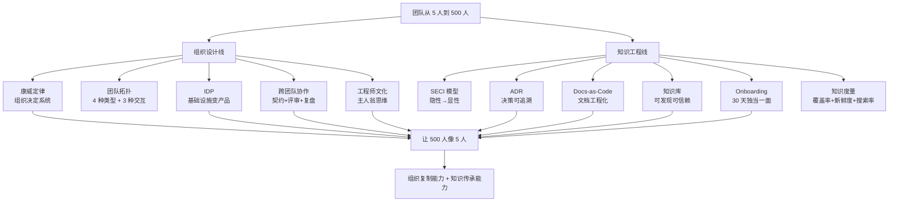

# 从厨师到 CEO

> 从阿明的 10 家店 500 人，看组织与知识的技术管理 —— 6 大机制让 500 人像 5 人一样高效协作

> **系列定位**：本篇是「阿明餐厅」系列的**终章**。在前面的故事中，阿明完成了[架构演进](./02-system-architecture-evolution.md)、[AI Agent 接入](./01-ai-agent-architecture.md)、[流量治理](./04-peak-traffic-defense.md)、[可观测性](./05-observability.md)、[安全架构](./06-security-architecture.md)。但当团队从 5 人变成 500 人，技术管理的挑战全变了 —— 不再是"怎么实现"，而是"怎么让 500 个人高效协作、让知识在系统中流动"。

> 最后更新: 2026-06-15


> **合并说明**：本篇由原《从厨师到 CEO（团队管理）》与《菜谱标准化之路（知识工程）》合并而成。团队管理的痛点 80% 来自知识不流动 —— 留人靠文化，复制靠机制，而机制的核心是知识工程。

---

## 引言：5 个人和 500 个人的区别

阿明的第一家店只有 5 个员工：阿明（老板兼厨师长）、2 个厨师、1 个服务员、1 个收银员。

沟通成本几乎为零：阿明喊一声"加个新菜"，5 个人 10 分钟就能对齐。

十年后，阿明开了 10 家店，团队 500 人：

- 技术团队 80 人，分成 8 个小组
- 每家店有自己的运维团队
- 总部有产品、运营、市场、财务

新问题全变了：

- 每家店的菜单系统不一样（技术栈分裂）
- 新店要 3 个月才能上线（交付效率低）
- 老员工和新员工互相看不懂代码（知识传承断层）
- 5 个团队同时改同一个服务（协作冲突）
- 老师傅退休了，三十年的"手感"全消失了（知识孤岛）

阿明坐在办公室里，第一次感到"技术不是最难的问题，人才是"。

答案由两条线交织而成：**组织设计**（怎么排兵布阵）和**知识工程**（怎么让经验可传承）。前者回答"如何让 500 人协同"，后者回答"如何让离开的人带不走核心资产"。

---

## 第一章：康威定律 —— 组织架构就是系统架构

阿明发现一个奇怪的现象：**系统的架构，总是和组织的架构惊人地相似**。

最典型的例子：前厅团队和后厨团队各管各的，结果前厅改了菜单排版，后厨的出餐顺序没跟着改，导致上菜顺序全乱了。系统也一样 —— 订单模块和支付模块分属两个团队，接口对不上是家常便饭。

```text
组织架构：
  前端团队 --> 订单服务
  后端团队 --> 支付服务
  数据团队 --> 推荐服务

系统架构：
  前端模块 --> 订单模块 --> 支付模块 --> 推荐模块
  （模块边界和团队边界完全一致）
```

这就是**康威定律（Conway's Law）**：系统的架构反映组织的沟通结构。

### 康威定律的两种应用

**正向应用**：先设计组织架构，再设计系统架构。阿明把团队按业务领域拆分（订单团队、支付团队、推荐团队），每个团队负责一个独立的服务，团队间通过 API 通信。这样系统自然形成了微服务架构，模块边界清晰。

**逆向康威**：先设计目标系统架构，再调整组织架构使之匹配。阿明先规划了微服务的目标架构（订单服务、支付服务、推荐服务），然后根据这个架构拆分团队——每个微服务由一个专门的小组负责。

阿明的经验：**康威定律不是"应该遵守的规律"，而是"可以利用的工具"**。想改变系统架构，先改变组织架构；想改变组织架构，先改变沟通方式。

这个定律在[架构演进的垂直拆分](./02-system-architecture-evolution.md)中已经初现端倪 —— 业务拆了，系统才能拆。在[AI Agent 的多智能体协同](./01-ai-agent-architecture.md)中同样适用 —— 智能体的分工边界，就是系统的模块边界。

---

## 第二章：团队拓扑 —— 让组织设计有章可循

康威定律告诉阿明"组织决定系统"，但他没有现成的方法去设计组织。直到老陈引入了**团队拓扑（Team Topologies）** —— 由 Matthew Skelton 和 Manuel Pais 提出的组织设计框架，把"怎么排兵布阵"变成了 4 种标准类型和 3 种交互模式。

### 团队拓扑的四种类型

```text
团队拓扑（Team Topologies）：

┌─────────────────────────────────────────────┐
│  流对齐团队（Stream-Aligned）               │
│  - 对齐业务价值流，长期端到端负责一个产品   │
│  - 例子：订单团队、推荐团队、收银团队       │
│  - 比例：占团队总数的大部分                 │
└─────────────────────────────────────────────┘
                     ▲
                     │ 用 API 通信
┌────────────────────┴────────────────────────┐
│  平台团队（Platform）                        │
│  - 提供内部开发者平台（IDP），被流对齐团队消费│
│  - 例子：基础架构团队、IDP 团队              │
│  - 心法：把基础设施当产品，让开发者成用户    │
└─────────────────────────────────────────────┘

┌──────────────────────┐  ┌────────────────────────┐
│  促成团队（Enabling） │  │ 复杂子系统团队          │
│  - 帮助流对齐团队     │  │（Complicated-Subsystem）│
│    掌握新技术，临时   │  │ - 专攻需要深度专业     │
│    性"教练"          │  │   知识的领域            │
│  - 例：性能优化教练   │  │ - 例：AI 推理引擎团队、 │
│    团队、可观测性     │  │   风控算法团队          │
│    教练团队           │  │                        │
└──────────────────────┘  └────────────────────────┘
```

四种类型各司其职：

- **流对齐团队**对齐业务流，长期端到端负责，是组织的主体。
- **平台团队**提供"自助式基础设施"—— 业务团队不要求助平台团队，自己就能用平台的能力（详见第五章 IDP）。
- **促成团队**像教练 —— 临时介入帮流对齐团队掌握新技术，用完就撤。
- **复杂子系统团队**专攻需要深度专业知识的领域（如 AI 推理、密码学），避免其他团队重复踩坑。

### 团队间的三种交互模式

团队拓扑不只定义"你是什么团队"，还定义"团队之间怎么沟通"：

| 交互模式 | 含义 | 适用场景 | 餐厅类比 |
|----------|------|----------|----------|
| 协作（Collaboration） | 两个团队密切配合，共担目标 | 探索新业务、试点项目 | A 店新菜和 B 店联手研发 |
| 服务（X-as-a-Service） | 一个团队用 API 给另一个团队"上菜" | 成熟领域、稳定边界 | 平台团队提供"一键部署"服务 |
| 促进（Facilitating） | 促成团队帮助流对齐团队掌握新技能 | 推广新技术、跨领域学习 | 老师傅带新人 1 周，然后撤 |

阿明的心得：**协作模式不要用太久**。试点期可以协作，验证后尽快切换成"服务"模式 —— 长期协作是两个团队的"债务"，边界永远扯不清。

### 认知负载 —— 团队不是"装得下"

团队拓扑还提出了一个关键概念：**认知负载（Cognitive Load）**。一个团队能"装"的事情是有限的：

- **内在负载（Intrinsic）**：业务本身的复杂度 —— 订单系统本身就比定时任务复杂。
- **外在负载（Extraneous）**：工具、流程、协作的复杂度 —— 跟业务无关的"杂事"。
- **关联负载（Germane）**：学习和创新的认知负担。

团队设计的核心目标：**最小化外在负载**，让团队把认知资源留给内在负载和关联负载。

阿明的反例：曾经让一个 5 人团队既负责订单核心服务，又维护自己的 CI/CD 流水线、自己的监控告警、自己的文档站 —— 外在负载占满，订单核心服务反而没人优化。引入平台团队后，把 CI/CD 和监控统一托管，外在负载降了 70%。

### 技术雷达：团队拓扑的支撑工具

流对齐团队用什么语言、什么框架、什么数据库？阿明用**技术雷达（Technology Radar）**统一技术选型，避免"每个团队自己造轮子"。

```text
技术雷达（每季度更新）：

采纳（Adopt）：
  - Java 17（后端主力语言）
  - MySQL 8.0（关系型数据库）
  - Redis（缓存）
  - Kafka（消息队列）

试验（Trial）：
  - Go（高性能服务）
  - ClickHouse（OLAP 分析）
  - gRPC（服务间通信）

评估（Assess）：
  - Rust（系统级编程）
  - GraphQL（API 查询）

暂缓（Hold）：
  - PHP（新项目不再使用）
  - MongoDB（除非有特殊场景，详见《架构是"长"出来的》第七章）
```

技术雷达的价值是**给流对齐团队一个明确的技术选型指南**，让新员工跨团队流动时不会"换个项目重学一遍"。原则：

- 新项目必须从"采纳"象限中选择技术
- 想用"试验"象限的技术，需要技术委员会评审
- "暂缓"象限的技术，新项目禁止使用，老项目逐步迁移

技术雷达不是一成不变的，每季度更新一次，根据实际使用效果调整。

---

## 第三章：知识流动 —— SECI 模型与隐性知识外化

团队拓扑解决了"组织怎么排"，但阿明很快撞上一个新问题：**老师傅的经验怎么留下来？**

老厨师王师傅干了 8 年，掌握了很多"祖传配方"和"经验技巧"。但王师傅从来不写文档，所有知识都在他脑子里。某天王师傅离职了，新员工小李接手，发现：

- 配方写在一张皱巴巴的纸上，字迹模糊
- 很多技巧（如"火候怎么掌握"）完全没有记录
- 系统里有一些奇怪的配置（如"这个参数必须是 7"），但没人知道为什么

这就是**知识孤岛**问题：关键知识掌握在少数人手里，没有沉淀和传承。技术团队也一样 —— "为什么用 Kafka 不用 RabbitMQ" 这种决策理由，除了当初的决策者，没人知道。

### SECI 模型 —— 知识转化的四种方式

老陈拿出一张图，叫 **SECI 模型** —— 日本学者野中郁次郎提出的知识转化理论。知识在"隐性"和"显性"之间有四种转化方式：

```text
SECI 模型（知识转化螺旋）：

          隐性知识                        显性知识
     （老师傅的手感）               （标准菜谱文档）
           │                              │
  社会化 ──┤                              ├── 组合化
  Socialization                    Combination
  （老带新、结对观察）            （文档归类、知识库建设）
           │                              │
           │                              │
  外化 ────┤                              ├── 内化
  Externalization                    Internalization
  （把"手感"写成"克数和秒数"）    （新人按文档练习、变成自己的技能）
```

| 转化方式 | 从什么到什么 | 餐厅做法 | 技术实践 |
|----------|------------|-----------|-----------|
| 社会化（S） | 隐性 → 隐性 | 小林站在老周旁边看他做菜 | 结对编程、Shadow On-Call |
| 外化（E） | 隐性 → 显性 | 把"盐适量"记录为"盐 2g / 100g 牛肉" | 架构决策记录（ADR）、事后复盘 |
| 组合化（C） | 显性 → 显性 | 把散落的菜谱整理成标准菜谱库 | 文档站建设、知识图谱 |
| 内化（I） | 显性 → 隐性 | 小林按标准菜谱练习 100 遍，形成本能 | 新人 Onboarding、实操训练 |

老陈说："王师傅的知识现在全是**隐性知识** —— 在他脑子里，说不清道不明。我们要做的第一步是**外化**：让他把'手感'翻译成'可量化的参数'。"

### 知识萃取的三种方法

外化不是自然而然发生的，阿明摸索出三种主动萃取的方法：

| 方法 | 做法 | 适用场景 | 餐厅示例 |
|------|------|----------|----------|
| 结对观察 | 专家做事，记录者在旁边观察、提问、记录 | 操作类技能 | 小林站在老周旁边，边看边问边记 |
| 事后复盘 | 事情做完后回顾"做了什么、为什么、效果如何" | 决策类经验 | 老周讲"为什么这道菜要用冰糖不用白糖" |
| 决策记录 | 在做决策的当下，记录"选项、评估、结论" | 架构类决策 | 记录"为什么选 Kafka 不选 RabbitMQ"（详见第四章 ADR） |

阿明的教训：**隐性知识不会自动变成显性知识 —— 它需要刻意的外化过程。** 而外化最大的障碍不是技术，而是"专家觉得没必要写下来"。解药是**让外化成为晋升和考核的硬指标** —— 王师傅不写菜谱就不算带出合格的徒弟。

### 从外化到平台化 —— 知识沉淀的三级跳

外化得到的显性知识如果停在文档里，价值有限。阿明的实践是**文档化 → 工具化 → 平台化**三级跳：

```text
知识沉淀三级跳：

1. 文档化（隐性 → 显性）：
   "每次大促前，要提前 1 小时预热缓存"
   沉淀为：《大促运维手册》第 3.2 节

2. 工具化（显性 → 自动化）：
   沉淀为：自动化脚本，大促前 1 小时自动触发

3. 平台化（工具 → 平台能力）：
   沉淀为：IDP 的"大促保障"功能
   业务团队点一下就能用，不需要自己写脚本
```

这套三级跳是知识工程的灵魂：让知识从"人脑"流到"文档"、从"文档"流到"工具"、从"工具"流到"平台"。**最终，知识不依赖于某个人，而是沉淀在系统中**。

---

## 第四章：ADR 与 Docs-as-Code —— 决策可追溯、文档工程化

外化出来的"为什么"放在哪里？阿明最初的方案是用 Word 写菜谱，存在共享文件夹里。结果一个月后出现了 5 个版本的"红烧肉_标准菜谱_最终版_真的最终版"，没人知道哪个是最新的。

老陈说："这个问题，技术界早就有解了 —— **把决策和文档当代码管理**。"

### 架构决策记录（ADR）—— 让"为什么"可追溯

老周退休前，阿明又想到一个问题：不只是菜谱，厨房里还有很多"为什么"也没有记录。"为什么蒸箱温度设 105 度不是 100 度？""为什么这个酱料要先放醋后放盐？"

在技术团队里，**代码能看到"怎么做的"，但看不到"为什么这样做"**。这就是**架构决策记录（Architecture Decision Record, ADR）**的价值 —— 把每一个重要的技术决策，以及**做出这个决策的理由**，用标准化的格式记录下来。

一份 ADR 的标准模板：

```text
# ADR-0042：为什么选择 Kafka 而非 RabbitMQ

## 状态
已采纳（2024-03-15）

## 上下文
我们的订单事件日志需要支持"回放"能力 —— 当新的数据分析服务上线时，
需要能够重新消费过去 30 天的所有订单事件来构建初始数据集。
当前日均事件量 500 万条，预计一年后增长到 2000 万条。

## 考虑的选项
1. RabbitMQ：团队更熟悉，运维经验更丰富
2. Kafka：支持日志持久化和消费者组回放，吞吐量更高
3. RocketMQ：功能折中，但社区活跃度较低

## 决策
选择 Kafka。核心原因是"日志回放"能力 —— Kafka 的消息持久化在
Topic Partition 中，消费者可以通过 seek 操作回到任意时间点重新消费。
RabbitMQ 的消息被消费后就会被删除，无法回放。

## 后果
正面：
- 支持新服务上线时的历史数据回放
- 吞吐量满足未来 3 年的增长预期
- 与现有的 ClickHouse 数据管道无缝集成

负面：
- 团队需要学习 Kafka 的运维知识
- 初期基础设施投入比 RabbitMQ 高约 30%
```

ADR 的生命周期有四个阶段：

| 阶段 | 含义 | 餐厅类比 | 示例 |
|------|------|-----------|------|
| 提议（Proposed） | 正在讨论，尚未决定 | "我在想要不要换蒸箱" | 团队讨论是否引入 gRPC |
| 采纳（Accepted） | 决定采用，开始执行 | "决定了，换！" | 正式引入 gRPC 并在第一个服务中落地 |
| 废弃（Deprecated） | 不再推荐使用，但旧系统仍在使用 | "这个蒸箱老了，新菜别用它" | 旧服务仍用 REST，新服务用 gRPC |
| 替代（Superseded） | 被新的决策取代 | "新蒸箱到了，旧的报废" | ADR-0042 被 ADR-0078 替代（升级到 Kafka 3.0） |

阿明要求团队从今天开始，每一个重要的技术决策都写一份 ADR。格式不重要，关键是记录**"上下文"和"为什么"** —— 因为代码能告诉你 How，但只有 ADR 能告诉你 Why。

三个月后，新来的工程师小林在代码里看到一行奇怪的配置：`max.partition.fetch.bytes = 1048576`。他正要改成默认值，老陈拦住他："先查 ADR。"小林翻到 ADR-0042，才发现这个参数是为了解决某次大消息消费超时而专门调整的。

**ADR 的核心价值是：让未来的自己（和同事）不再重复问"当初为什么要这样做"。**

### Docs-as-Code —— 让文档享受工程化待遇

ADR 解决了"决策"的可追溯，但阿明发现其他文档也存在版本混乱问题。他引入**Docs-as-Code** 实践 —— 文档用 Markdown 写，和代码一起存在 Git 仓库里，用同样的 Review 流程、版本控制、自动化发布。

```text
文档仓库结构：
docs/
├── recipes/                    # 标准菜谱（API/操作手册）
│   ├── hong-shao-rou.md
│   └── _template.md
├── adr/                        # 架构决策记录
│   ├── 0001-use-mysql.md
│   ├── 0042-kafka-over-rabbitmq.md
│   └── _template.md
├── runbooks/                   # 操作手册
│   ├── emergency-shutdown.md
│   └── new-store-setup.md
├── onboarding/                 # 新人入职
│   ├── day-1-checklist.md
│   └── first-30-days.md
└── mkdocs.yml                  # 文档站配置
```

Docs-as-Code 的三大好处：

| 好处 | 说明 | 餐厅类比 | 技术实现 |
|------|------|-----------|----------|
| 版本控制 | 每次修改都有记录，可追溯、可回滚 | 菜谱每改一次都有记录，谁改了什么一清二楚 | Git 提交历史 |
| Review 流程 | 修改必须经过审核，防止错误 | 新配方必须经过老师傅试菜才能正式使用 | Pull Request + Approve |
| 自动发布 | 合并后自动更新文档站，永远最新 | 新菜谱确认后，所有门店的电子版同步更新 | CI/CD + MkDocs / Docusaurus |



阿明还发现了一个意想不到的好处：**文档的更新频率明显提高了**。以前改一份 Word 文档要打开文件、编辑、保存、上传，流程繁琐。现在直接在 IDE 里改 Markdown，`git commit && git push`，和改代码一样自然。

关于"活文档"，老陈还做了一件事：**API 文档从 OpenAPI 规范自动生成**（详见[《菜单设计学》](./10-api-design.md)中的 OpenAPI 章节）。架构图从代码中的依赖关系自动生成。这些"活文档"不需要手动维护，代码变了，文档跟着变。

**Docs-as-Code 的核心是让文档享受代码的工程化待遇 —— 版本控制、Review 流程、自动化发布。** 23 的反模式"技术文档不版本化"（共享文件夹的"最终版_真的最终版"），本质上就是没把文档当代码。

---

## 第五章：IDP、协作与文化 —— 让机制沉淀为基础设施

组织排好了（团队拓扑）、知识流动起来了（SECI）、决策可追溯了（ADR/Docs-as-Code），最后还要把这一切**沉淀为可重复使用的机制**。本章讲阿明是如何把 5 大日常实践沉淀到平台和文化里的。

### 5.1 内部开发者平台（IDP）—— 让业务团队自助

阿明的技术团队有 80 人，但每个团队都在重复造轮子：3 个团队各搭一套 CI/CD 流水线，花了 3 倍的人力，做了 3 套功能差不多、互不兼容的东西。

老陈牵头成立了**平台工程团队（Platform Engineering）**，搭建一个**内部开发者平台（Internal Developer Platform, IDP）**，对应团队拓扑中的"平台团队"。

```text
内部开发者平台（IDP）核心能力：

服务脚手架：一键生成新项目（统一技术栈、统一目录结构）
CI/CD 流水线：标准化的构建、测试、部署流程
服务注册发现：统一的服务注册中心（Consul / Nacos）
配置中心：统一的配置管理（Apollo / Nacos）
监控告警：统一的 Metrics、Logging、Tracing、Alerting
API 网关：统一的流量入口、限流、熔断、降级
```

IDP 的效果立竿见影：

- 新项目启动时间：从 2 周（自己搭基础设施）缩短到 1 天（用脚手架一键生成）
- CI/CD 流水线维护成本：从 3 个团队各维护 1 套，变成 1 个平台团队维护 1 套
- 新员工入职：不需要学各种内部工具，只需要学 IDP 的使用方式

**IDP 是知识平台化的极致形态** —— 老师傅的经验、团队的 ADR、跨团队的协作规范，全部沉淀为 IDP 的一个功能，业务团队点一下就能用。

### 5.2 跨团队协作 —— 把沟通变成"默认行为"

8 个技术团队各自为战，是组织规模化最大的坑。阿明引入了三种协作机制：

**API 契约（Contract）**：团队间通过 API 契约定义接口规范，修改接口前必须通知对方，并提供向后兼容的方案。

```text
API 契约：
  订单服务 v1.0：
    POST /orders
    请求：{user_id, items, address}
    响应：{order_id, status}

  变更通知：
    订单服务 v1.1 将新增字段 coupon_id（可选），向后兼容
    上线时间：2024-06-01
    影响范围：支付服务、推荐服务
```

**技术评审（Tech Review）**：重大技术方案需要跨团队评审，确保方案合理、不影响其他团队。

**故障复盘（Postmortem）**：故障发生后，相关团队一起复盘，找出根因，制定改进措施。复盘不追究责任，只关注"怎么避免下次再犯"。高效的故障复盘依赖[可观测性](./05-observability.md)提供的数据：日志、指标、链路追踪，让复盘有数据支撑，而不是靠记忆和猜测。

阿明的经验：**跨团队协作不是"开更多的会"，而是"建立规范的流程和工具"**。API 契约、技术评审、故障复盘，这些机制让协作变成"默认行为"，而不是"靠人情"。

### 5.3 工程师文化 —— 主人翁思维

协作机制是骨架，文化是灵魂。阿明的团队一度弥漫着"执行者思维"—— "按菜谱做菜，做完就行。"他要塑造的是**主人翁思维**："不仅要做出菜，还要考虑可维护性、可扩展性、可测试性 —— 因为这盘菜最终是自己负责的。"

工程师文化的五个特征：

**代码审查（Code Review）**：每行代码都要经过至少一位同事的审查，确保代码质量。

**自动化测试**：单元测试覆盖率 > 80%，集成测试覆盖核心链路，上线前必须通过所有测试。

**持续学习**：每周一次技术分享，每月一次外部技术交流，鼓励团队成员学习新技术。

**故障不追责**：故障复盘只关注"怎么避免"，不追究"谁的责任"。鼓励大家主动暴露问题，而不是掩盖问题。

**技术驱动业务**：技术团队不是"被动接需求"，而是主动思考"技术怎么驱动业务创新"。

```text
之前：
  产品经理提需求 --> 技术团队实现 --> 上线

之后：
  技术团队和产品经理一起讨论需求 --> 技术团队提出技术方案 --> 评估 ROI --> 实现 --> 上线
```

### 5.4 知识库建设 —— 让知识可发现、可信赖

文档有了，ADR 有了，但阿明发现一个新问题：**东西太多，找不到。** 200 多份菜谱、150 多份 ADR、80 多份操作手册，全堆在文档仓库里，像一座没有索引的图书馆。

老陈决定建设一个**内部知识库**，并设计了知识新鲜度管理的三板斧：

```text
知识新鲜度管理：

1. 过期提醒
   - 每篇文档设置"过期日期"（默认 6 个月）
   - 到期前 2 周，自动发邮件给 Owner："你的文档该更新了"
   - 过期未更新的文档，搜索结果中标记为"⚠️ 可能已过期"

2. 定期审查
   - 每季度一次"文档大扫除"
   - 每个团队花半天时间，审查自己负责的文档
   - 过时的文档标记为"已归档"

3. Owner 机制
   - 每篇文档必须有一个明确的 Owner（个人，不是团队）
   - Owner 离职时，文档交接是离职 Checklist 的必选项
   - 没有 Owner 的文档，自动分配给团队负责人
```

阿明的教训：**知识库建设是 20% 的搭建 + 80% 的运营。建了不运营，半年后就是"信息坟场"。**

### 5.5 知识度量 —— 让"看不见"变成"看得见"

老陈说："度量什么，就得到什么。知识管理也一样。"他设计了四个核心指标：

| 指标 | 定义 | 目标值 | 度量方式 |
|------|------|--------|-----------|
| 文档覆盖率 | 多少模块/菜品有标准文档 | > 90% | 菜品总数 vs 有标准菜谱的菜品数 |
| 文档新鲜度 | 文档最后更新距今的平均天数 | < 90 天 | 自动统计 Git 提交时间 |
| 搜索成功率 | 新人搜索后能找到所需知识的比例 | > 80% | 搜索日志 + 用户反馈 |
| Onboarding 效率 | 新人从入职到独立上岗的平均天数 | < 30 天 | 考核通过率 + 上岗时间 |

阿明立了一条铁律：**每次故障复盘的改进项，必须有"更新文档"这一条。** 这条规则来自[《差评危机》](./15-incident-response.md)中的复盘方法论 —— 复盘结论要沉淀到知识库，否则下次遇到同样的问题又得重新摸索。

### 5.6 结构化 Onboarding —— 让新人 30 天独当一面

新人入职是知识传递的关键场景。老陈设计了一套**结构化的 Onboarding 体系**，核心是 30 天入职清单：

```text
新工程师 30 天入职计划：

第一周 - 学习与模仿:
  - 阅读《架构总览》《IDP 使用手册》
  - 在导师指导下完成第一个小需求
  考核: 能画出核心系统的模块图

第二周 - 独立操作:
  - 脱离导师独立完成 3 个需求
  - 参与一次 On-Call 实战
  考核: 代码通过 Review 率 100%

第三周 - 优化与贡献:
  - 在导师的服务上提出至少 1 条优化建议
  - 撰写第一份 ADR
  考核: 优化建议被采纳 1 条、ADR 通过评审

第四周 - 带教验证:
  - 带一名更新的实习生完成 1 个基础需求
  考核: 实习生成功完成，心得通过审核
```

"老带新"不是"你跟着看"，而是一个有明确目标、分阶段推进、可度量成果的结构化过程。**好的 Onboarding 让新人 30 天就能独当一面 —— 这是知识内化的极致。**

---

## 核心总结：组织与知识



| 挑战 | 解决方案 | 核心思想 |
|------|----------|----------|
| 组织架构与系统架构不一致 | 康威定律 | 组织架构 = 系统架构 |
| 组织设计没有章法 | 团队拓扑 | 4 种类型 + 3 种交互 + 认知负载 |
| 技术栈分裂 | 技术雷达 | 统一技术选型，避免各自造轮子 |
| 经验在人脑里 | SECI 模型 + 知识萃取 | "盐适量"变成"盐 2g / 100g 牛肉" |
| 决策理由没人记得 | ADR | 记录 Why，让未来不再重复问 |
| 文档版本混乱 | Docs-as-Code | 文档享受代码的工程化待遇 |
| 交付效率低 | 平台工程（IDP） | 把基础设施变成产品 |
| 知识找不到 | 知识库 | 可发现 + 可信赖 + 持续运营 |
| 新人入职全靠随缘 | 结构化 Onboarding | 30 天清单 + 知识漏斗 |
| 协作冲突 | 跨团队协作 | API 契约 + Tech Review + Postmortem |
| 团队思维固化 | 工程师文化 | 从执行者思维到主人翁思维 |
| 不知道做得好不好 | 知识度量 | 四大指标 + 反馈回路 |

### 一句心法

**小团队靠喊一声，大团队靠建机制 —— 技术管理是组织设计 + 知识工程的乘积：组织排兵布阵，知识沉淀为系统，两者合起来才能让 500 人像 5 人一样协作。**

---

## 延伸阅读

- [架构是"长"出来的](./02-system-architecture-evolution.md) —— 康威定律在架构演进中的真实案例：垂直拆分背后的组织变革
- [当餐厅长出大脑](./01-ai-agent-architecture.md) —— Multi-Agent 的协同设计，是康威定律在 AI 系统中的新应用
- [高峰保卫战](./04-peak-traffic-defense.md) —— 限流、熔断、降级等流量治理能力，是平台工程（IDP）的核心组件
- [厨房装监控](./05-observability.md) —— 故障复盘（Postmortem）依赖可观测性数据，而非记忆和猜测
- [食安大检查](./06-security-architecture.md) —— 安全架构的落地需要组织保障：权限审批、安全评审、审计合规
- [给产品经理的重构说明书](./03-refactoring-guide-for-pm.md) —— 技术债的管理需要技术管理者和 PM 共同决策优先级
- [厨房质检员](./08-qa-testing-strategy.md) —— Code Review 和测试是工程师文化的两大支柱
- [从接单到出餐](./09-cicd-devops.md) —— CI/CD 是平台工程（IDP）的核心能力，应该沉淀为团队共享的基础设施
- [菜单设计学](./10-api-design.md) —— API 契约是跨团队协作的基础，OpenAPI 规范是"活文档"的典范
- [学徒的困境](./11-ai-learning-paradox.md) —— AI 时代的人机协作与学习之道，知识传递漏斗与脚手架理论
- [数据厨房](./12-data-kitchen.md) —— 数据治理中的"主数据管理"和知识库中的"统一术语"是同一个思想
- [前厅翻修记](./13-frontend-renovation.md) —— Design System 文档化是前端知识库的重要组成部分
- [阿明的省钱经](./14-cloud-finops.md) —— 云成本优化的决策也需要 ADR 记录"为什么选这个实例规格"
- [差评危机](./15-incident-response.md) —— 故障复盘的改进项必须包含"更新文档"，这是知识反馈回路的关键
- [外卖大战](./16-performance-optimization.md) —— 性能优化的经验是最值得沉淀的"隐性知识"
- [厨房实况直播](./20-realtime-eventdriven.md) —— 异步消息的设计决策需要 ADR 记录，消息格式需要文档化
- [十家店的烦恼](./18-distributed-puzzles.md) —— 分布式系统中的跨团队数据一致性，需要明确的 ownership 和协作机制
- [阿明的加盟帝国](./19-saas-multitenant.md) —— 多租户架构的设计决策和运营手册是知识库的核心内容
- [一个厨房，四个门面](./21-multiplatform-architecture.md) —— 多端团队的组织协作，独立开发 vs 平台共享的平衡
- [懂你的菜单](./22-search-recommendation.md) —— 推荐算法的策略文档是"最难写但最有价值"的知识
- [仓库搬家不停业](./24-database-migration.md) —— 数据库迁移的方案设计和操作手册是 ADR 和 Runbook 的典型应用场景
- [预制菜还是现炒](./25-lowcode-platform.md) —— 低代码平台改变了技术团队的角色，从"写代码"到"维护平台"
- [阿明出海记](./26-globalization.md) —— 国际化涉及的合规知识、本地化经验是知识库中最需要定期更新的内容
- [厨房大换岗](./27-ai-org-transformation.md) —— AI 时代的团队管理挑战，岗位重塑是康威定律在 AI 时代的新体现
- [阿明的二次创业](./28-ai-native-startup.md) —— 创始人角色进化，从 CEO 到编排者的管理思维升级
- [会自我进化的厨房](./29-self-evolving-company.md) —— 自进化组织是团队管理的终极形态，Agent Loop 替代层级管理
- [AI 的"黑暗料理"](./30-ai-hallucination-safety.md) —— AI 幻觉的团队管理视角，如何建立 AI 输出的审核文化

> 备注：原《菜谱标准化之路》（23-tech-docs-knowledge）已合并到本篇，详见第四章 ADR/Docs-as-Code 和第五章知识库/Onboarding/度量。

---

## 结语

阿明从厨师到 CEO 的故事，是所有技术团队成长中都会撞上的墙：**五个人的默契无法复制到五百人 —— 但好的制度可以让五百人像五个人一样协作，且带不走核心资产。**

答案是组织设计与知识工程的乘积：用康威定律和团队拓扑指导组织设计，用技术雷达和 IDP 统一基础设施，用工程师文化塑造主人翁思维；用 SECI 模型把隐性知识外化，用 ADR 和 Docs-as-Code 让决策和文档可追溯，用知识库和 Onboarding 让经验持续传递，用度量体系让知识管理可见。

下次当你管理团队时，不妨问自己：

- 我的组织架构和系统架构一致吗？有没有"一个团队维护多个服务"或"多个团队维护一个服务"？
- 我用团队拓扑设计过组织吗？四种类型都齐了吗？认知负载超载了吗？
- 我有技术雷达吗？还是每个团队自己选技术？
- 我有内部开发者平台吗？还是每个团队自己搭基础设施？
- 关键知识沉淀在文档和系统中，还是掌握在少数人手里？
- 我有 ADR 吗？还是每个"为什么"都要去问当事人？
- 我的文档有版本控制和 Review 流程吗？还是共享文件夹里的"最终版_真的最终版"？
- 我的新人入职有结构化计划吗？还是全靠"老带新、随缘学"？
- 我度量过知识管理的健康度吗？还是建了知识库就不管了？
- 团队间有 API 契约吗？还是靠口头沟通？
- 我的团队是"执行者思维"还是"主人翁思维"？

> 好的技术管理，不是"让所有人都听话"，而是"让所有人都能发挥自己的价值 —— 且他们的价值不会随着离开而消失"。

← [返回系列导读](./index.md)
