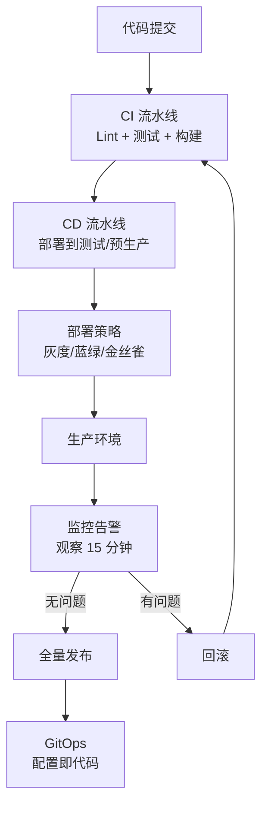

# 从接单到出餐

> 从阿明的"手写菜单"到自动化流水线，看 CI/CD 与 DevOps 的完整旅程

> **系列定位**：本篇是「阿明餐厅」系列的**正传 5**。在[前传](./02-system-architecture-evolution.md)中，阿明完成了架构演进；在[测试策略](./08-qa-testing-strategy.md)中建立了质量保障体系。但代码写完了、测试通过了，**怎么安全、快速地交付到生产环境？** 这就是 CI/CD 与 DevOps 的价值。

---

## 引言：新菜上线，手忙脚乱

阿明的厨师长研发了一道新菜"松露牛肉面"，想上线试卖。

传统流程：厨师长写好配方（代码写完了）→ 找阿明审批（人工审核）→ 手动更新菜单系统（手动部署）→ 更新错了，系统报错（出问题难回滚）→ 新菜上线，顾客反馈"太贵了"（没有灰度验证）。

整个过程花了 3 天，还出了两次事故。

阿明意识到：**从"代码写完"到"用户用上"之间，需要一条自动化流水线**。这条流水线要解决三个问题：自动化（减少人工干预）、安全（出问题能回滚）、快速（缩短交付周期）。

---

## 第一章：持续集成（CI）—— 代码合并的自动化

阿明的技术团队有 5 个人，各自开发不同功能。传统流程：每个人在自己的分支上开发 2 周，合并时冲突不断，花 3 天解决冲突，合并后才发现代码不兼容。

**持续集成（Continuous Integration, CI）** 的核心是：**频繁地（每天多次）将代码合并到主分支，并自动运行测试**。

### CI 流水线

```
开发者提交代码（git push）
    ↓
自动触发 CI 流水线：
  1. 代码检查（Lint）：语法规范、代码风格
  2. 单元测试：运行所有单元测试
  3. 集成测试：运行模块间交互测试
  4. 构建（Build）：编译代码，生成 Docker 镜像
  5. 代码覆盖率：检查测试覆盖率是否达标
    ↓
全部通过 → 合并成功 | 任一失败 → 合并失败，通知开发者
```

### CI 的价值与反模式

| 价值 | 说明 |
|------|------|
| 尽早发现冲突 | 每天合并，冲突少，容易解决 |
| 自动化测试 | 每次合并都跑测试，保证代码质量 |
| 快速反馈 | 5 分钟内知道代码是否有问题 |

**反模式：CI 流水线太慢**。阿明最初的 CI 流水线跑一次要 30 分钟。优化后：并行执行测试、缓存依赖、只运行受影响的测试，缩短到 5 分钟。

CI 的核心是**自动化 + 快速反馈**。没有 CI，持续交付就是空谈。

---

## 第二章：持续交付（CD）—— 从代码到生产的自动化

CI 保证了"代码合并后测试通过"，但**怎么把代码部署到生产环境？**

**持续交付（Continuous Delivery, CD）** 的核心是：**将部署过程自动化，随时可以一键部署到生产环境**。

### CD 流水线

```
CI 通过（代码测试通过，Docker 镜像构建完成）
    ↓
  1. 部署到测试环境（Staging）：自动部署，运行 E2E 测试
  2. 部署到预生产环境（Pre-prod）：自动部署，运行冒烟测试
  3. 部署到生产环境（Production）：人工审批后，自动部署
    ↓
部署完成 → 监控告警（观察 15 分钟，确认无异常）
```

### 部署和发布分离

很多团队认为"部署 = 发布"。正确做法：**部署和发布分离**。

- **部署（Deploy）**：代码部署到生产环境，但用户还看不到
- **发布（Release）**：通过特性开关（Feature Toggle）或灰度策略，逐步对用户开放

好处：部署后先观察 15 分钟，确认无异常再发布；出问题可以快速回滚，影响范围小。这里的特性开关和[高峰保卫战的降级策略](./04-peak-traffic-defense.md)使用的是同一套 Feature Toggle 基础设施。

CD 的核心是**自动化 + 可回滚**。没有 CD，部署就是一场赌博。

---

## 第三章：灰度发布 —— 新菜先给 1% 顾客试吃

阿明研发了一道新菜，定价 188 元。如果直接全量上线，可能面临：顾客觉得太贵差评如潮、系统出问题所有用户受影响、回滚成本高。

**灰度发布（Gray Release）** 的核心是：**新功能先对少数用户开放，验证无问题后再全量开放**。

### 灰度发布的策略

```
阶段 1：内部测试（0%）→ 只对内部员工开放
阶段 2：小流量灰度（1%）→ 观察错误率、用户反馈、系统性能
阶段 3：中流量灰度（10%）→ 继续观察
阶段 4：大流量灰度（50%）→ 确认无问题
阶段 5：全量发布（100%）→ 对所有用户开放
```

**反模式：灰度比例跳跃太大**。阿明最初的策略是 1% → 50% → 100%，结果 1% 没问题，跳到 50% 时系统扛不住。正确做法：**灰度比例逐步增加**（1% → 5% → 10% → 25% → 50% → 100%），每个阶段观察 15-30 分钟。

灰度发布的核心是**小步快跑 + 快速回滚**。没有灰度，发布就是一场豪赌。

---

## 第四章：蓝绿部署 —— 新旧系统并行，一键切换

灰度发布是"逐步放量"，但**如果新版本有严重 Bug，怎么快速回滚？** 传统做法回滚要 10-15 分钟，期间用户无法使用。

**蓝绿部署（Blue-Green Deployment）** 的核心是：**新老版本同时运行，通过路由切换流量，实现秒级回滚**。

```
初始状态：
  蓝环境（Blue）：运行 v1 版本，承接 100% 流量
  绿环境（Green）：空闲

部署新版本：
  绿环境：部署 v2 版本，运行冒烟测试
  
切换流量：
  蓝环境 → 绿环境：承接 100% 流量
  
观察 15 分钟：
  无问题 → 蓝环境升级为 v2，绿环境空闲
  有问题 → 流量切回蓝环境（秒级回滚）
```

| 价值 | 说明 |
|------|------|
| 秒级回滚 | 切换 Service selector 即可回滚 |
| 零停机 | 新老版本并行，切换时无感知 |
| 验证充分 | 绿环境部署后先内部测试，确认无问题再切换 |

**反模式：蓝绿环境资源不足**。蓝绿部署需要**两套环境**，成本翻倍。阿明的策略：**蓝绿环境资源配置一致**，切换后观察 15 分钟，确认无问题再释放蓝环境资源。

蓝绿部署的核心是**并行运行 + 秒级切换**。没有蓝绿，回滚就是一场豪赌。

---

## 第五章：金丝雀发布 —— 用真实用户验证

灰度发布和蓝绿部署都是"部署策略"，但**怎么知道新版本是否真的更好？**

**金丝雀发布（Canary Deployment）** 的核心是：**新版本先对少数真实用户开放，通过监控数据判断是否全量发布**。

### 金丝雀发布的判断标准

```
金丝雀阶段（1% 流量到新版本）：

监控指标：
  - 错误率：新版本 < 1%（老版本 0.5%）✅
  - P99 延迟：新版本 < 500ms（老版本 450ms）✅
  - 用户评分：新版本 4.5（老版本 4.3）✅

判断：
  所有指标优于或等于老版本 → 进入下一阶段（10%）
  任一指标劣于老版本 → 回滚到老版本
```

金丝雀发布依赖**实时监控指标**（如 P99 延迟、错误率），这些指标的设计和告警策略详见[《厨房装监控》](./05-observability.md)。没有好的 Metrics，金丝雀发布就是盲人开车。

**反模式：金丝雀阶段太短**。阿明最初的策略是 1% 流量跑 5 分钟就全量。问题是样本量太小、某些问题（如内存泄漏）需要长时间运行才暴露。正确做法：**金丝雀阶段至少 15-30 分钟**，确保至少 1000 次请求。

金丝雀发布的核心是**数据驱动 + 小步快跑**。没有金丝雀，发布就是"盲飞"。

---

## 第六章：GitOps —— 基础设施即代码

阿明的运维团队有一个问题：**配置变更难以追踪**。运维工程师手动修改 Kubernetes 配置（如副本数从 3 改为 5），修改后没有记录，出问题不知道谁改的、改了什么。

**GitOps** 的核心是：**把基础设施配置存储在 Git 仓库中，通过 Git 提交触发自动化部署**。

### GitOps 的流程

```
1. 开发者修改 Git 仓库中的配置文件（如 deployment.yaml）
2. 提交 Pull Request，团队 Review
3. Review 通过后合并到主分支
4. GitOps 工具（如 Argo CD）检测到 Git 变更
5. 自动将配置同步到 Kubernetes 集群
6. 监控配置变更，确认部署成功
```

| 价值 | 说明 |
|------|------|
| 版本控制 | 所有配置变更都有 Git 记录，可追溯 |
| 审计合规 | 谁改了什么、什么时候改的，一目了然（详见[安全架构的审计日志](./06-security-architecture.md)） |
| 自动化同步 | Git 变更后自动同步到集群，减少人工操作 |

**反模式：GitOps 和手动操作混用**。如果团队既用 GitOps 自动同步，又有人手动修改集群配置，会导致配置漂移。阿明的策略：**所有配置变更都通过 GitOps**，紧急情况下可以先手动修改，但事后必须同步到 Git。

GitOps 的核心是**配置即代码 + 自动化同步**。没有 GitOps，基础设施管理就是一场混乱。

---

## 核心总结：CI/CD 与 DevOps 的完整旅程



| 策略 | 核心问题 | 餐厅类比 | 技术实现 |
|------|----------|----------|----------|
| CI（持续集成） | 代码合并后测试通过吗？ | 新配方先小批量试做 | GitHub Actions / Jenkins |
| CD（持续交付） | 怎么自动化部署？ | 自动化出餐流水线 | Argo CD / Spinnaker |
| 灰度发布 | 怎么逐步放量？ | 新菜先给 1% 顾客试吃 | Nginx / Istio |
| 蓝绿部署 | 怎么秒级回滚？ | 新旧菜单并行，一键切换 | K8s Service + Deployment |
| 金丝雀发布 | 怎么数据驱动决策？ | 用真实用户反馈判断 | Istio / Prometheus |
| GitOps | 怎么管理配置变更？ | 菜单变更走审批流 | Argo CD / Flux |

### 一句心法

**CI/CD 不是"工具"，而是"文化"**。持续集成、持续交付、灰度发布、蓝绿部署、金丝雀发布、GitOps，这些实践的核心是**自动化、可回滚、快速反馈**。没有 CI/CD，DevOps 就是空谈。

---

## 延伸阅读

- [测试策略](./08-qa-testing-strategy.md) —— 测试是 CI/CD 流水线的核心环节，自动化测试让持续集成成为可能
- [架构是"长"出来的](./02-system-architecture-evolution.md) —— CI/CD 的前提是架构已经拆分到可独立部署的微服务
- [高峰保卫战](./04-peak-traffic-defense.md) —— 灰度发布是降级策略的进阶版，两者都通过"控制流量"降低风险
- [厨房装监控](./05-observability.md) —— 金丝雀发布依赖监控数据判断，可观测性是发布决策的基础
- [食安大检查](./06-security-architecture.md) —— 安全左移：在 CI/CD 流水线中集成安全扫描，让安全问题尽早暴露
- [给产品经理的重构说明书](./03-refactoring-guide-for-pm.md) —— 重构后的代码同样需要 CI/CD 保障，渐进式翻新需要安全的部署策略
- [从厨师到 CEO](./07-from-chef-to-ceo.md) —— CI/CD 是平台工程（IDP）的核心能力，应该沉淀为团队共享的基础设施
- [当餐厅长出大脑](./01-ai-agent-architecture.md) —— Agent 系统的持续交付：模型更新、Prompt 变更都需要安全的部署策略
- [API 设计](./10-api-design.md) —— 部署新版本时，API 向后兼容是灰度发布的前提

---

## 结语

阿明从"手写菜单"到"自动化流水线"的故事，本质上是所有工程团队都要面对的问题：**怎么安全、快速地交付代码，而不是靠"人工操作"和"运气"？**

答案是 CI/CD + 部署策略 + GitOps：持续集成保证代码质量，持续交付自动化部署，灰度/蓝绿/金丝雀降低发布风险，GitOps 管理配置变更。

下次当你发布代码时，不妨问自己：

- 我有 CI 流水线吗？每次合并都自动跑测试吗？
- 我用了灰度/蓝绿/金丝雀吗？还是直接全量发布？
- 出问题能快速回滚吗？回滚流程是自动化的吗？
- 配置变更有版本控制吗？还是手动修改，难以追踪？

> 好的 CI/CD，不是"让发布变快"，而是"让发布变安全"。自动化、可回滚、快速反馈，这三点是 CI/CD 的核心。

← [返回系列导读](./index.md)
