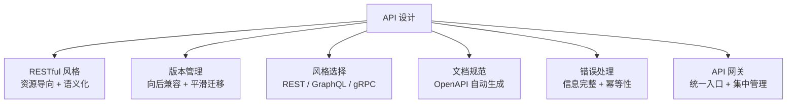

# 菜单设计学

> 从阿明的"口头点单"到标准化菜单，看 API 设计的艺术与科学

> **系列定位**：本篇是「阿明餐厅」系列的**正传 6**。在[前传](./02-system-architecture-evolution.md)中，阿明将系统拆分为微服务；在[从厨师到 CEO](./07-from-chef-to-ceo.md)中，团队通过 API 契约协作。但**API 本身怎么设计？** 这是微服务架构和跨团队协作的基础。

---

## 引言：口头点单的混乱

阿明的餐厅最初没有菜单，顾客口头点单："来碗面，加个蛋，不要葱。"

问题是：字迹潦草后厨看不懂（接口不规范）、"加个蛋"理解成"加两个蛋"（歧义）、新服务员不知道备注格式（缺少文档）、后厨改了菜名前厅不知道（接口变更不兼容）。

API 设计的本质，不是"定义接口"，而是**定义团队之间的沟通契约**。好的 API 设计，让调用方"一看就懂、一用就会、一改就知"。

---

## 第一章：RESTful API —— 标准化菜单

**REST（Representational State Transfer）** 是目前最主流的 API 设计风格。核心思想：**把后端数据抽象为"资源"，用 HTTP 方法操作资源**。

### REST 的核心原则

| 原则 | 说明 | 示例 |
|------|------|------|
| 资源导向 | URL 表示资源，而非操作 | `/orders/123`，而非 `/getOrder?id=123` |
| HTTP 方法语义化 | GET 查询、POST 创建、PUT 更新、DELETE 删除 | `GET /orders/123` |
| 状态码标准化 | 200 成功、404 不存在、500 服务器错误 | 订单不存在返回 404 |
| 无状态 | 每个请求携带完整信息 | 每次请求带 Token |

### 阿明的 RESTful 菜单

```text
GET    /orders          # 查询订单列表
POST   /orders          # 创建新订单
GET    /orders/{id}     # 查询订单详情
PUT    /orders/{id}     # 更新订单（全量）
PATCH  /orders/{id}     # 更新订单（部分）
DELETE /orders/{id}     # 删除订单
GET    /orders/{id}/items  # 查询订单的菜品明细
```

### REST 的反模式

**反模式 1：URL 中用动词**。`POST /createOrder` 不如 `POST /orders`，因为 HTTP 方法本身已经表达了操作语义。

**反模式 2：忽略状态码**。所有响应都返回 200，错误信息在 body 中 —— 这让调用方无法通过 HTTP 状态码快速判断请求结果。

REST 的核心是**资源导向 + 语义化**。设计时问自己："这个 URL 表示什么资源？用什么 HTTP 方法操作？"

---

## 第二章：版本管理 —— 菜单升级，老顾客怎么办？

阿明想把"牛肉面"改名为"秘制牛肉面"，价格从 28 涨到 38 元。直接改名会导致老顾客找不到、投诉涨价不通知（接口变更不兼容）。

**API 版本管理**的核心是：**新版本上线时，老版本继续可用，给调用方迁移时间**。

### 三种版本管理策略

| 策略 | 实现方式 | 优缺点 |
|------|----------|--------|
| URL 版本 | `/v1/orders` vs `/v2/orders` | 直观，但 URL 冗余 |
| Header 版本 | `Accept: application/vnd.restaurant.v1+json` | URL 干净，但不直观 |
| 参数版本 | `/orders?version=1` vs `/orders?version=2` | 灵活，但参数污染 |

阿明选择了 **URL 版本**，因为最直观。

### 向后兼容原则

**向后兼容的变更**（不需要升版本）：新增可选字段、新增接口。

**不向后兼容的变更**（必须升版本）：删除字段、修改字段类型、修改字段语义、修改 URL 路径。

阿明的策略：**所有不向后兼容的变更，必须升版本**，老版本至少保留 6 个月。向后兼容也是[灰度发布](./09-cicd-devops.md)的前提 —— 新旧版本必须能同时运行。

---

## 第三章：REST vs gRPC vs GraphQL —— 三种菜单风格

阿明的餐厅有三种点单方式：**标准菜单（REST）** 按固定菜单点、**定制菜单（GraphQL）** 自由组合配料、**后厨传菜窗口（gRPC）** 内部高速通道。

### 三种 API 风格对比

| 特性 | REST | GraphQL | gRPC |
|------|------|---------|------|
| 协议 | HTTP/1.1 | HTTP（通常 HTTP/1.1 或 HTTP/2）+ WebSocket（订阅） | HTTP/2 |
| 数据格式 | JSON | JSON | Protocol Buffers（二进制） |
| 查询方式 | 固定端点，固定字段 | 单一端点，客户端指定字段 | 固定端点，固定字段 |
| 性能 | 中 | 中 | 高（二进制 + 流式） |
| 学习成本 | 低 | 中 | 高 |
| 适用场景 | 通用 API、对外 API | 前端灵活查询、移动端 | 微服务间通信、高性能 |

### GraphQL：解决 Over/Under-fetching

```graphql
# 客户端指定需要的字段，避免 Over-fetching
query {
  order(id: 123) {
    id
    dish
    price
    # 不需要 user 信息，就不返回
  }
}

# 一次请求获取订单 + 菜品明细，避免 Under-fetching
query {
  order(id: 123) {
    id
    items { name, quantity }
  }
}
```

GraphQL 的优点是灵活，缺点是缓存困难、复杂查询可能拖慢数据库。

### gRPC：高性能的内部通信

如果 REST 是面向顾客的菜单，gRPC 就是**后厨传菜窗口** —— 用标准化的托盘（Protocol Buffers 二进制格式）高速传递菜品，不讲究摆盘，但要求又快又准。编译时自动检查类型，像调用本地函数一样调用远程服务。优点是高性能（二进制序列化、HTTP/2 多路复用），缺点是浏览器支持差、调试困难。

### 阿明的选择

| 场景 | 选择 | 原因 |
|------|------|------|
| 对外 API（给第三方） | REST | 生态成熟，文档友好 |
| 前端 API（Web/App） | GraphQL | 灵活查询，减少请求次数 |
| 微服务间通信 | gRPC | 高性能，强类型 |

API 风格没有"最好"，只有"最适合"。值得一提的是，[AI Agent 的 Function Calling](./01-ai-agent-architecture.md)本质上也是标准化 API 设计的应用 —— 智能体通过 JSON Schema 定义工具接口，和 RESTful 的资源导向思路一脉相承。

---

## 第四章：API 文档 —— 菜单要有说明

阿明的菜单设计好了，但顾客看不懂："'招牌牛肉面'和'秘制牛肉面'有什么区别？"

阿明对此有切肤之痛。第一个合作方接入他的 API 时，因为文档不全、示例缺失，对方工程师花了整整 **2 天**才调通第一个接口，期间反复打电话确认参数含义。后来阿明引入了 OpenAPI，第二个合作方拿到文档后，**半天**就完成了全部对接 —— 因为每个接口都有请求/响应示例，可以直接复制使用。

**OpenAPI（原 Swagger）** 是目前最流行的 API 文档标准。它用 YAML 或 JSON 描述 API，自动生成文档和客户端代码。

```yaml
openapi: 3.0.0
info:
  title: 阿明餐厅 API
  version: 1.0.0
paths:
  /v1/orders/{id}:
    get:
      summary: 查询订单详情
      parameters:
        - name: id
          in: path
          required: true
          schema:
            type: string
      responses:
        '200':
          description: 查询成功
        '404':
          description: 订单不存在
```

### API 文档的最佳实践

| 原则 | 说明 |
|------|------|
| 示例驱动 | 每个接口都有请求/响应示例，可直接复制使用 |
| 错误码说明 | 列出所有可能的错误码和含义 |
| 变更记录 | 每次 API 变更都记录在 Changelog 中 |
| 在线测试 | 提供 Swagger UI，调用方可直接测试接口 |

**反模式：文档和实现不同步**。阿明最初的文档是手动编写的 Markdown，后端改了接口忘记更新文档。策略：**用 OpenAPI 自动生成文档**，文档和代码一起提交，保证同步更新。这和[从厨师到 CEO 中的 API 契约](./07-from-chef-to-ceo.md)是同一思路 —— 契约必须可验证、可追踪。

---

## 第五章：错误处理 —— 菜单要标注"过敏原"

阿明的菜单上有一道菜"花生牛肉面"，但没有标注"含花生"。顾客对花生过敏，吃完后进了医院。

**API 错误处理**的核心是：**让调用方知道"哪里出错了、为什么出错、怎么处理"**。

### 错误响应设计

```json
// 好的错误响应（信息完整）
{
  "error": {
    "code": "INSUFFICIENT_STOCK",
    "message": "库存不足，无法创建订单",
    "details": {
      "dish_name": "牛肉面",
      "requested_quantity": 5,
      "available_quantity": 3
    },
    "request_id": "req_abc123",
    "documentation_url": "https://api.restaurant.com/docs/errors#INSUFFICIENT_STOCK"
  }
}
```

### 常见错误码

| 错误码 | HTTP 状态码 | 含义 |
|--------|-------------|------|
| `INVALID_PARAMETER` | 400 | 参数错误 |
| `UNAUTHORIZED` | 401 | 未认证 |
| `NOT_FOUND` | 404 | 资源不存在 |
| `INSUFFICIENT_STOCK` | 422 | 库存不足（业务规则校验失败） |
| `RATE_LIMIT_EXCEEDED` | 429 | 请求频率超限（详见[限流](./04-peak-traffic-defense.md)） |
| `INTERNAL_ERROR` | 500 | 服务器内部错误 |

### 幂等性：避免重复提交

顾客点击"下单"按钮两次，系统创建了两个订单。**幂等性（Idempotency）** 的核心是：**同一个请求执行多次，结果和执行一次相同**。

```http
POST /v1/orders
Idempotency-Key: order_123_20240528_120000

# 第一次请求：创建订单，返回 201
# 第二次请求（相同的 Idempotency-Key）：返回已创建的订单，返回 200
```

阿明的策略：**POST 操作必须支持幂等性**，通过 `Idempotency-Key` 避免重复执行。PUT 和 DELETE 在 HTTP 规范中本身就是幂等的，但仍需确保业务逻辑正确实现（如 PUT 的全量替换语义、DELETE 的幂等删除语义）。

---

## 第六章：API 网关 —— 统一入口，统一管理

阿明有 10 个服务，如果每个都暴露独立域名，调用方要记住 10 个地址。

**API 网关（API Gateway）** 的核心是：**提供统一入口，屏蔽后端服务的复杂性**。

```text
客户端请求
    ↓
API 网关：
  1. 认证授权：验证 Token（详见[安全架构](./06-security-architecture.md)）
  2. 限流熔断：控制请求频率（详见[高峰保卫战](./04-peak-traffic-defense.md)）
  3. 路由转发：根据 URL 路由到后端服务
  4. 协议转换：外部 REST → 内部 gRPC
  5. 日志监控：记录请求日志（详见[厨房装监控](./05-observability.md)）
    ↓
后端服务（订单、支付、菜品……）
```

| 价值 | 说明 |
|------|------|
| 统一入口 | 调用方只需要记住一个地址 |
| 集中管理 | 认证、限流、监控等横切关注点集中处理 |
| 协议转换 | 外部 REST，内部 gRPC，网关负责转换 |

**反模式：网关成为单点故障**。阿明的策略：网关至少 3 个实例高可用部署、检测到后端故障直接返回降级响应、性能指标实时监控。

API 网关的核心是**统一入口 + 集中管理**。没有网关，微服务架构就是一场混乱。

---

## 核心总结：API 设计的艺术与科学



| 设计原则 | 核心问题 | 餐厅类比 | 技术实现 |
|----------|----------|----------|----------|
| RESTful | 怎么定义资源？ | 标准化菜单 | URL 表示资源，HTTP 方法操作 |
| 版本管理 | 怎么平滑升级？ | 菜单升级，老顾客怎么办 | URL 版本（/v1/ vs /v2/） |
| 风格选择 | REST / GraphQL / gRPC 怎么选？ | 标准菜单 / 定制菜单 / 后厨传菜窗口 | 根据场景选择 |
| 文档规范 | 怎么让调用方一看就懂？ | 菜单要有说明 | OpenAPI / Swagger |
| 错误处理 | 怎么让调用方知道哪里出错？ | 菜单标注过敏原 | 错误码 + 幂等性 |
| API 网关 | 怎么统一管理？ | 统一入口 | Kong / Nginx / AWS API Gateway |

### 一句心法

**API 设计不是"定义接口"，而是"定义团队之间的沟通契约"。** 好的 API 设计，让调用方"一看就懂、一用就会、一改就知"。RESTful 是基础，版本管理是保障，文档是桥梁，网关是入口。

---

## 延伸阅读

- [从厨师到 CEO](./07-from-chef-to-ceo.md) —— API 契约是跨团队协作的基础，API 设计是契约的核心
- [架构是"长"出来的](./02-system-architecture-evolution.md) —— 微服务拆分后，API 设计成为系统间通信的核心挑战
- [从接单到出餐](./09-cicd-devops.md) —— 部署新版本时，API 向后兼容是灰度发布的前提
- [高峰保卫战](./04-peak-traffic-defense.md) —— API 网关的限流、熔断能力，是流量治理的第一道防线
- [厨房装监控](./05-observability.md) —— API 网关的日志、指标、追踪，是可观测性的数据来源
- [食安大检查](./06-security-architecture.md) —— API 网关的认证、授权、数据脱敏，是安全架构的核心环节
- [厨房质检员](./08-qa-testing-strategy.md) —— 契约测试验证 API 的向后兼容性，是 API 变更的质量保障
- [当餐厅长出大脑](./01-ai-agent-architecture.md) —— Function Calling 的标准化接口设计，是 API 设计在 AI 领域的应用
- [给产品经理的重构说明书](./03-refactoring-guide-for-pm.md) —— 重构过程中，API 的向后兼容是绞杀者模式的核心保障
- [学徒的困境](./11-ai-learning-paradox.md) —— AI 时代的人机协作与学习之道，当 AI 越来越强，人还要不要练基本功
- [数据厨房](./12-data-kitchen.md) —— 数据架构与数据治理，10 家店 10 本账如何变成数据驱动决策
- [前厅翻修记](./13-frontend-renovation.md) —— 前端工程化与用户体验，后厨再快，前厅的门进不来一切白搭
- [阿明的省钱经](./14-cloud-finops.md) —— 云成本优化与 FinOps，120 万月账单如何降到 68 万
- [差评危机](./15-incident-response.md) —— 故障复盘与应急响应，从手忙脚乱到 10 分钟止血的方法论
- [外卖大战](./16-performance-optimization.md) —— 系统性能优化，3 秒生死线下的全链路优化实战
- [传菜窗口的智慧](./20-realtime-eventdriven.md) —— 消息队列的 API 设计，Topic、Queue、Message 的命名规范本质上是异步 API
- [十家店的烦恼](./18-distributed-puzzles.md) —— 分布式系统中的 API 幂等性设计，跨服务调用的一致性保障
- [阿明的加盟帝国](./19-saas-multitenant.md) —— 多租户 API 设计，如何通过 API 实现租户隔离和定制化
- [厨房实况直播](./20-realtime-eventdriven.md) —— 实时通信的 API 设计，WebSocket 和 SSE 是实时 API 的两种形态
- [一个厨房，四个门面](./21-multiplatform-architecture.md) —— BFF（Backend For Frontend）是 API 适配多端的架构模式
- [懂你的菜单](./22-search-recommendation.md) —— 搜索推荐系统的 API 设计：查询接口、结果排序、分页策略
- [菜谱标准化之路](./07-from-chef-to-ceo.md) —— API 文档是技术文档的核心部分，OpenAPI 规范是 API 契约的一部分
- [仓库搬家不停业](./24-database-migration.md) —— 数据库迁移中的 API 兼容，Schema 变更时 API 必须保持向后兼容
- [预制菜还是现炒](./25-lowcode-platform.md) —— 低代码平台的 API 集成，可视化数据源绑定背后的接口设计
- [阿明出海记](./26-globalization.md) —— 国际化 API 设计，多语言响应、货币转换、时区处理的接口规范
- [厨房大换岗](./27-ai-org-transformation.md) —— AI 转型中 API 角色的变化，API 是人机协同的标准化接口
- [阿明的二次创业](./28-ai-native-startup.md) —— AI 原生创业的 API 设计，AI 工具链的 API 是创业的基础设施
- [会自我进化的厨房](./29-self-evolving-company.md) —— Agent Loop 的工具层 API，Agent 通过确定性 API 与世界交互
- [AI 的"黑暗料理"](./30-ai-hallucination-safety.md) —— AI 幻觉对 API 响应的影响，API 设计需要预留 AI 错误的处理空间

---

## 结语

阿明从"口头点单"到"标准化菜单"的旅程，揭示了微服务架构中最容易被忽视、却影响最深远的环节：**API 设计的质量，直接决定了团队协作的效率天花板。**

答案是 RESTful + 版本管理 + 文档规范 + 错误处理 + API 网关：RESTful 让接口语义化，版本管理保证向后兼容，文档让调用方一看就懂，错误处理让调用方知道哪里出错，API 网关提供统一入口。

下次当你设计 API 时，不妨问自己：

- 我的 API 是 RESTful 的吗？URL 表示资源，HTTP 方法操作资源？
- 我有版本管理吗？新版本上线时，老版本继续可用？
- 我选择了合适的 API 风格吗？REST / GraphQL / gRPC 根据场景选择？
- 错误处理完整吗？错误码、错误信息、幂等性都考虑到了？
- 我有 API 网关吗？统一入口、集中管理认证/限流/监控？

> 好的 API，不是"让后端写起来方便"，而是"让调用方用起来方便"。一看就懂、一用就会、一改就知。

← [返回系列导读](./index.md)
