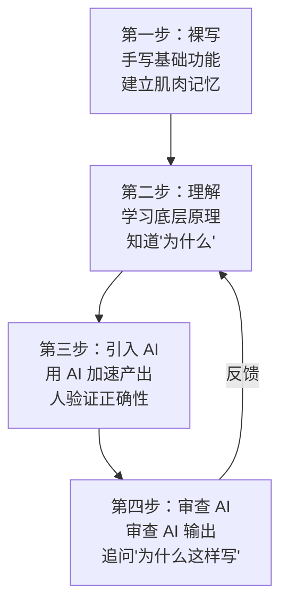
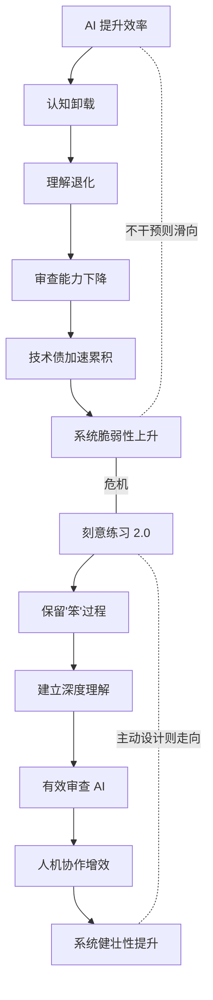

# 学徒的困境

> 从阿明的"AI 学徒危机"，看 AI 时代的人机协作与学习之道

> **系列定位**：本篇是「阿明餐厅」系列的**续集二**。在续集[《当餐厅长出大脑》](./01-ai-agent-architecture.md)中，阿明成功接入了 AI Agent 系统，让厨房具备了感知、记忆、规划和自我进化的能力。但当 AI 越来越能干，一个新问题浮出水面 —— **人还要不要学？**

> 最后更新: 2026-06-15


---

## 引言：当对手的厨房比你快三倍

阿明的老对手阿强，在隔壁街开了一家"闪电厨房"。

上个月，阿强全面引入 AI 烹饪系统：自动接单、智能配菜、机械臂翻炒。出餐速度比阿明快 3 倍，人力成本降 40%。朋友圈里，阿强天天晒数据，笑容灿烂。

阿明坐不住了。他咬咬牙，也上了一套 AI 辅助系统。半年后，效率确实上来了。但阿明发现一个诡异的现象 —— 新招的五个厨师，全是"AI 操作员"。他们能熟练地按 AI 提示操作，但没一个能脱离系统独立做出一桌像样的菜。

直到那个周五晚上，AI 服务器宕机两小时。整个厨房瘫痪了。五个厨师站在灶台前，面面相觑，不知道先放油还是先放蒜。

**效率提升了，能力却退化了。这才是 AI 时代最大的陷阱。**

---

## 第一章：效率陷阱 —— 快，不一定是好事

新厨师小周是阿明招来的"AI 原生厨师"。入职第一周，小周用 AI 助手的出餐速度就超过了干十年的老师傅。AI 告诉他"加 15 克盐、中火翻炒 90 秒"，他照做，又快又准。

但阿明注意到一个细节：小周从不问"为什么"。他不知道为什么要先热锅再下油，不知道为什么要分三次加水而不是一次性倒入。AI 说什么，他就做什么。

老师傅皱眉："这孩子，手是快的，脑子是懒的。"

### 认知卸载与 GPS 效应

这在认知科学里有个术语：**认知卸载（Cognitive Offloading）**。当你把思考过程外包给工具，大脑会逐渐"遗忘"这些能力。

最典型的例子是 GPS。有了导航之后，你还记得从家到公司怎么走吗？十年前你闭眼都能画出的路线图，现在离开手机就迷路了。这就是 **GPS 效应（GPS Effect）**。

在软件工程领域，这个现象更加隐蔽：

| 维度 | 传统工程师 | AI 原生工程师 | 差异 |
|------|-----------|--------------|------|
| 编码速度 | 中等 | 快 2-3 倍 | AI 胜出 |
| 底层原理理解 | 扎实 | 薄弱 | 传统胜出 |
| 调试能力 | 独立排查 | 依赖 AI 建议 | 传统胜出 |
| 架构设计 | 能权衡取舍 | 倾向于接受 AI 方案 | 传统胜出 |
| AI 宕机时 | 正常工作 | 效率断崖下跌 | 传统胜出 |

Copilot、Cursor 这类工具让编码效率飙升，但工程师如果不理解哈希表的底层实现、不知道索引为什么能加速查询、不清楚递归为什么会栈溢出 —— 写出的代码能跑，但出了问题就抓瞎。

```python
# AI 生成的代码 —— 能跑，但小周不知道为什么这样写
def find_duplicates(items):
    seen = set()
    duplicates = []
    for item in items:
        if item in seen:
            duplicates.append(item)
        else:
            seen.add(item)
    return duplicates

# 小周不知道：为什么用 set 而不是 list？
# 小周不知道：时间复杂度从 O(n²) 降到了 O(n)（平均情况）
# 小周不知道：当 items 有 100 万条时，这个选择决定了 1 秒 vs 1 小时
```

**效率陷阱的核心是用速度换来了产出，却丢掉了理解。**

---

## 第二章：新手断层 —— 没有"笨"过程，哪来"真"理解

阿明想起了自己的学徒时代。

十九岁进厨房，师傅让他切了三年土豆丝。第一年只切丝，第二年切片，第三年切丁。切到手指起泡、起茧、再起泡。他恨过师傅，但三年后，他闭着眼都能感知刀刃和食材的角度。

后来学炒菜，师傅让他站在旁边看了半年，只许看，不许碰锅。看老师傅怎么颠锅、怎么控油、怎么判断火候。半年后第一次上手，虽然笨拙，但他"知道"什么是对的。

现在的学徒呢？AI 直接给出最优方案，跳过了所有"笨"过程。

### 刻意练习与学习金字塔

认知心理学家安德斯·艾利克森提出的**刻意练习（Deliberate Practice）** 理论指出：专家级能力来自于**有目的的、超出舒适区的、持续获得反馈的反复练习**。不是简单的重复，而是每一次练习都在挑战边界。

**学习金字塔（Learning Pyramid）** 则揭示了不同学习方式的留存率差异（注：不同学习方式的知识留存率排序基于教育心理学的一般共识——主动学习优于被动学习，具体数值因研究而异，此处仅表达相对趋势）：

| 学习方式 | 类比 | 知识留存率 | AI 时代现状 |
|----------|------|-----------|------------|
| 教授他人 | 当师傅带徒弟 | 最高 | 受限 —— AI 可辅助答疑，但"教别人"本身的学习效果难以被 AI 替代，应鼓励新人做技术分享 |
| 实践练习 | 亲手炒菜 | 较高 | 被 AI 辅助，练习量大幅减少 |
| 小组讨论 | 厨师们交流经验 | 中等 | 仍然存在，但深度下降 |
| 观看演示 | 看师傅操作 | 较低 | 被 AI 视频教程替代 |
| 阅读文档 | 看菜谱 | 低 | 被 AI 总结替代，连看都不看了 |
| 听讲 | 听师傅讲原理 | 最低 | 没人讲了，AI 直接给答案 |

AI 把学习的"摩擦力"降到了零。但认知科学告诉我们：**适度的摩擦力恰恰是深度学习的必要条件**。就像肌肉需要阻力才能生长，大脑需要"挣扎"才能建立深层连接。

初级工程师不再手写排序算法、不再手动实现 CRUD、不再从零搭一个 HTTP 服务器 —— 这些看似"低效"的笨功夫，恰恰是理解系统本质的必经之路。

**新手断层的本质是跳过了"痛苦但必要"的学习过程。**

---

## 第三章：代码审查困境 —— AI 写的代码，谁来审？

一天，阿明让 AI 系统生成了一套"宴席出餐流程优化方案"。方案很长，有 30 多个步骤，逻辑严密，看起来无懈可击。

但阿明发现一个奇怪的步骤："在第三道菜出锅前，先将炒锅降温至 42°C，再加入花生油。"

为什么是 42°C？为什么不是直接热油？阿明问了三个厨师，没人知道。AI 给的理由是"基于最佳实践数据"。阿明试着去掉这一步，菜品质量没有任何变化。

这是一次典型的 **AI 幻觉（Hallucination）** —— 系统编造了一个看似合理实则无意义的步骤。问题是，没人能看出来。

### 代码可理解性的危机

这个困境在软件工程中更加严峻。AI 每天生成大量代码，但审查能力没有跟上：

| 问题 | 餐厅类比 | 技术表现 | 风险等级 |
|------|----------|----------|----------|
| 幻觉代码 | 凭空出现的"42°C 降温"步骤 | 调用不存在的 API、编造参数 | 极高 |
| 过度设计 | 炒个蛋炒饭用了 12 口锅 | 简单功能引入复杂设计模式 | 高 |
| 隐性依赖 | 第三步依赖第一步的余温 | 模块间隐式耦合，文档未标注 | 高 |
| 风格不一致 | 川菜和粤菜混在同一道菜里 | 生成的代码和项目风格冲突 | 中 |
| 安全漏洞 | 用了过期食材但看起来没问题 | SQL 注入、硬编码密钥 | 极高 |

详见[《厨房质检员》](./08-qa-testing-strategy.md)中关于代码审查的系统化方法论。AI 生成的代码更需要严格的审查流程，而不是"看起来对就通过"。

**代码可理解性（Code Comprehensibility）** 的核心问题是：如果写代码的"人"（AI）和审代码的"人"（工程师）都不完全理解代码为什么这样写，系统的长期可维护性就会急剧恶化。技术债在 AI 时代不是减少了，而是以更快的速度累积。

```python
# AI 生成的"正确但不可理解"的代码
def calculate_discount(order):
    # 这个折扣逻辑对不对？没人说得清
    base = order.total * (1 - order.coupon_rate)
    tier = min(base * 0.05, 50) if order.items > 3 else 0
    seasonal = base * 0.02 if is_holiday() else 0
    return max(0, base - tier - seasonal + order.loyalty_bonus)

# 问题：为什么 tier 上限是 50？0.05 和 0.02 从哪来？
# 如果 AI 不解释，三个月后没人记得这些数字的含义
```

**代码审查困境的本质是 AI 能写出"能跑"的代码，但只有人才能判断"该不该这样跑"。**

---

## 第四章：刻意练习 2.0 —— 什么值得手写，什么交给 AI

阿明痛定思痛，制定了一套新规则。

基础刀工？必须徒手练习。切土豆丝、切姜丝、剁肉馅 —— 这些基本功不能省。不是因为没有 AI 就切不了菜，而是因为**只有亲手切过一千个土豆，你才能感知食材的纹理、刀具的锋利度、以及"刚好"的力度**。

复杂宴席设计？可以让 AI 辅助。10 人宴会的菜品搭配、上菜顺序、成本核算 —— 这些涉及大量数据和排列组合的工作，AI 确实比人强。

关键是要分清：**什么是"用 AI 加速学习"，什么是"用 AI 跳过学习"。**

### 学习分级框架

阿明的分级逻辑，映射到软件工程中，就是一套 AI 时代的"必修 vs 选修"清单：

| 级别 | 餐厅类比 | 技术内容 | AI 角色 | 手写要求 |
|------|----------|----------|---------|----------|
| L1 必修 | 刀工、火候、调味 | 数据结构、算法、网络协议 | 禁用 AI | 必须手写，闭卷考试 |
| L2 基础 | 单道菜品的完整烹饪 | CRUD、API 开发、单元测试 | AI 辅助检查 | 先手写，再用 AI 对比 |
| L3 进阶 | 套餐设计与成本控制 | 系统设计、性能优化、架构决策 | AI 辅助生成方案 | 手写核心设计，AI 补充细节 |
| L4 专家 | 创新菜品、菜品体系 | 技术创新、框架设计、技术战略 | AI 作为讨论伙伴 | 人机协同，人做最终决策 |

这个框架的理论基础是**脚手架理论（Scaffolding）**：教育心理学中，脚手架是指在学生学习过程中提供的临时支持，随着学生能力提升逐步撤除。AI 应该是"可撤除的脚手架"，而不是"永久承重墙"。

```python
# L1 必修：手写排序算法（理解分治思想）
# 假设已实现 merge(left, right) 函数，将两个有序列表合并为一个有序列表
def merge_sort(arr):
    if len(arr) <= 1:
        return arr
    mid = len(arr) // 2
    left = merge_sort(arr[:mid])
    right = merge_sort(arr[mid:])
    return merge(left, right)

# L3 进阶：让 AI 辅助设计缓存策略，但核心逻辑自己写
# 人决策：用 LRU 还是 LFU？TTL 设多少？
# AI 辅助：生成缓存中间件的样板代码
```

**刻意练习 2.0 的核心不是"不用 AI"，而是"知道什么时候该放下 AI"。**

---

## 第五章：新学徒制 —— 人机协作的正确姿势

阿明设计了一套"四步成长法"，重新培训团队。

第一步，**裸写**。不管 AI 多方便，新人入职前三个月，基础功能必须手写。手写 HTTP 服务器、手写连接池、手写简单的 ORM。写得好不好不重要，重要的是**建立对底层的肌肉记忆**。

第二步，**理解**。写完"笨代码"之后，学习原理。为什么 HTTP 是请求-响应模型？为什么连接池能提升性能？为什么 ORM 的 N+1 查询会拖垮数据库？

第三步，**引入 AI**。有了基本功之后，开始用 AI 辅助提效。这时候 AI 是"加速器"而非"替代品"。你知道 AI 生成的代码对不对，因为你写过一遍。

第四步，**审查 AI**。最后一步是审查 AI 的输出。不只是看"能不能跑"，而是问"为什么这样写""有没有更好的方案""有没有安全隐患"。

### 渐进式 AI 引入

这个四步法在技术上对应**渐进式 AI 引入（Progressive AI Introduction）** 模式，核心思想与[《当餐厅长出大脑》](./01-ai-agent-architecture.md)中的 **Human-in-the-Loop** 理念一脉相承 —— 人始终在关键环节保持判断力和干预权。



| 阶段 | 人的角色 | AI 的角色 | 风险 | 持续时间 |
|------|---------|----------|------|----------|
| 裸写 | 独立实现 | 禁用 | 效率低，但建立深度理解 | 1-3 个月 |
| 理解 | 学习原理 | 辅助答疑 | 理论脱离实践 | 持续进行 |
| 引入 | 验证输出 | 生成代码 | 依赖度逐渐上升 | 日常工作 |
| 审查 | 质疑决策 | 解释理由 | 审查疲劳 | 每次提交 |

关键设计是**反馈环**：在审查 AI 输出时发现的每一个问题，都应该回到"理解"阶段去补课。审查不是走过场，而是持续学习的过程。

**新学徒制的核心是 AI 是你的"陪练"，不是你的"替身"。成长的路，没人能替你走。**

---

## 第六章：不可替代的能力 —— 审美、判断与创造

阿明带团队去早市选食材。

AI 可以根据历史数据推荐"性价比最高"的番茄。但阿明拿起一颗番茄，看了一眼色泽，捏了捏硬度，闻了闻蒂部的气味，说："这颗不行，大棚的，风味不够。那颗好，自然成熟的，酸甜比刚好。"

AI 不知道什么叫"好吃"。它能分析一万条点评数据告诉你"顾客偏好酸甜口"，但它无法像你一样，咬一口番茄就感受到阳光和土壤的味道。

### AI 无法替代的元能力

在软件工程中，同样存在 AI 无法替代的能力：

| 能力 | 餐厅类比 | 技术表现 | 为什么 AI 做不到 |
|------|----------|----------|-----------------|
| 品味（Taste） | 判断什么是"好吃" | 判断代码是否优雅、架构是否合理 | 品味来自经验和直觉，非数据可训练 |
| 系统思维（Systems Thinking） | 理解餐厅整体运营 | 理解技术债、组织、业务的交织关系 | AI 擅长局部优化，缺乏全局洞察 |
| 创造力（Creativity） | 发明一道全新菜品 | 提出前所未有的技术方案 | AI 是概率续写，难以跳出训练分布 |
| 价值判断（Value Judgment） | 决定"该不该做这道菜" | 权衡技术理想与现实约束 | 涉及伦理、商业、人文，超出代码范畴 |

详见[《从厨师到 CEO》](./07-from-chef-to-ceo.md)中关于工程师文化和技术判断力的讨论。这些能力的共同特征是：**它们不是"知识"，而是"智慧"；不是"技能"，而是"素养"。** 无法通过背题或刷量获得，只能在实践中沉淀。

阿明的经验是：每周安排一次"无 AI 创意时间"。团队围在一起，不打开电脑，用白板讨论架构方案、评审代码设计、分享踩坑心得。**最好的学习，发生在人与人的碰撞中，而不是人与 AI 的对话中。**

**不可替代能力的核心是 AI 能帮你切菜、帮你炒菜、帮你算账，但"什么是好菜"这个判断，只能你自己做。**

---

## 核心总结：AI 时代的学习悖论



| 模块 | 核心问题 | 餐厅类比 | 技术实现 |
|------|----------|----------|----------|
| 效率陷阱 | 快不等于好，速度换来产出丢掉理解 | AI 操作员 vs 真正的厨师 | 认知卸载、GPS 效应 |
| 新手断层 | 跳过笨过程就跳过了深度理解 | 切三年土豆丝的价值 | 刻意练习、学习金字塔 |
| 审查困境 | AI 写的代码没人真正看得懂 | 42°C 降温步骤之谜 | 代码可理解性、AI 幻觉 |
| 刻意练习 2.0 | 分清"加速学习"和"跳过学习" | 基础刀工必修，宴席设计选修 | 学习分级框架、脚手架理论 |
| 新学徒制 | 人机协作的正确姿势 | 四步成长法：裸写→理解→引入→审查 | 渐进式 AI 引入、Human-in-the-Loop |
| 不可替代能力 | AI 不能替你判断"什么是好" | 选番茄的品味 | 品味、系统思维、创造力 |

### 一句心法

**AI 是你的"外挂大脑"，但外挂永远替代不了你的"内功"。** 你可以让 AI 帮你切菜，但你必须自己知道什么叫"好吃"。

---

## 延伸阅读

- [当餐厅长出大脑](./01-ai-agent-architecture.md) —— 前篇，AI Agent 的完整架构，本文讨论的"AI"究竟是怎么工作的
- [架构是"长"出来的](./02-system-architecture-evolution.md) —— AI 时代更需扎实的系统架构基础，否则 AI 建在沙子上
- [给产品经理的重构说明书](./03-refactoring-guide-for-pm.md) —— AI 加速了技术债累积，重构决策变得更加紧迫
- [高峰保卫战](./04-peak-traffic-defense.md) —— 流量治理的限流降级策略，和认知卸载的"给自己限流"异曲同工
- [厨房装监控](./05-observability.md) —— 可观测性让你"看见"系统问题，审查能力让你"看见"代码问题
- [食安大检查](./06-security-architecture.md) —— AI 生成的代码更需要安全审查，安全意识是不可卸载的必修课
- [从厨师到 CEO](./07-from-chef-to-ceo.md) —— 工程师文化和技术判断力的培养，是 AI 时代团队管理的核心课题
- [厨房质检员](./08-qa-testing-strategy.md) —— 代码审查方法论，AI 时代的审查应该更严格而非更松懈
- [从接单到出餐](./09-cicd-devops.md) —— CI/CD 流水线中如何集成 AI 代码审查和质量门禁
- [菜单设计学](./10-api-design.md) —— API 设计的品味与判断力，是 AI 最难替代的能力之一
- [数据厨房](./12-data-kitchen.md) —— 数据架构与数据治理，10 家店 10 本账如何变成数据驱动决策
- [前厅翻修记](./13-frontend-renovation.md) —— 前端工程化与用户体验，后厨再快，前厅的门进不来一切白搭
- [阿明的省钱经](./14-cloud-finops.md) —— 云成本优化与 FinOps，120 万月账单如何降到 68 万
- [差评危机](./15-incident-response.md) —— 故障复盘与应急响应，从手忙脚乱到 10 分钟止血的方法论
- [外卖大战](./16-performance-optimization.md) —— 系统性能优化，3 秒生死线下的全链路优化实战
- [传菜窗口的智慧](./20-realtime-eventdriven.md) —— 异步编程是工程师必须掌握的基本功，回调、Promise、事件驱动的学习之道
- [十家店的烦恼](./18-distributed-puzzles.md) —— 分布式系统的基本功：CAP 定理、共识算法是 AI 无法替你理解的底层思维
- [阿明的加盟帝国](./19-saas-multitenant.md) —— 从技术到创业的知识跨越，SaaS 商业模式需要理解技术和产品的结合
- [厨房实况直播](./20-realtime-eventdriven.md) —— 实时系统的编程范式，事件驱动架构是"另一种思维方式"的学习
- [一个厨房，四个门面](./21-multiplatform-architecture.md) —— 跨端开发的学习路径，从后端到前端的知识拓展
- [懂你的菜单](./22-search-recommendation.md) —— 搜索推荐的算法学习，AI 可以辅助实现千人千面，但工程师需理解底层原理
- [菜谱标准化之路](./07-from-chef-to-ceo.md) —— 知识管理的核心方法论，把隐性知识转化为显性知识的学习之道
- [仓库搬家不停业](./24-database-migration.md) —— 数据库迁移是考验工程师基本功的高风险操作，AI 不能替你承担决策责任
- [预制菜还是现炒](./25-lowcode-platform.md) —— 低代码 vs 全手写的学习取舍，工具效率与基础功的平衡
- [阿明出海记](./26-globalization.md) —— 全球化视野的学习，多区域部署是工程师能力的新维度
- [厨房大换岗](./27-ai-org-transformation.md) —— AI 学习在组织层面的延伸，学会了还要在组织中落地
- [阿明的二次创业](./28-ai-native-startup.md) —— AI 原生创业中的人才培养，创始人也需要学会"不依赖 AI"
- [会自我进化的厨房](./29-self-evolving-company.md) —— 自进化组织中的持续学习，组织也在像个人一样不断成长
- [AI 的"黑暗料理"](./30-ai-hallucination-safety.md) —— AI 幻觉对学习者的挑战，学会辨别 AI 错误是新的学习能力

---

## 结语

阿明的 AI 学徒危机，本质上是所有技术团队都要面对的问题：**当工具越来越强，人还要不要练基本功？**

答案是"分层 + 渐进 + 不可替代"：基础能力必须手写苦练，进阶任务可以 AI 辅助，但审美、判断与创造力，永远是你的核心竞争力。AI 时代的学习不是"更少"，而是"更精准" —— 把时间花在 AI 替代不了的地方。

半年后，阿明听说阿强的"闪电厨房"出了大事故 —— AI 系统在一次高峰期推荐了过期的食材组合，三个顾客食物中毒，餐厅被停业整顿。阿明摇了摇头：效率的快，不能以理解为代价。

下次当你准备让 AI 帮你写代码时，不妨问自己：

- 你的团队里，新人能否不依赖 AI 独立完成一个完整功能？
- 你能看懂并审查 AI 生成的每一行代码吗？
- 如果 AI 工具全部宕机一天，你的团队还能正常工作吗？
- 你有没有刻意为团队设计"不用 AI"的练习环节？

> 好的 AI 协作，不是"让 AI 替你思考"，而是"让 AI 放大你的思考"。

← [返回系列导读](./index.md)
