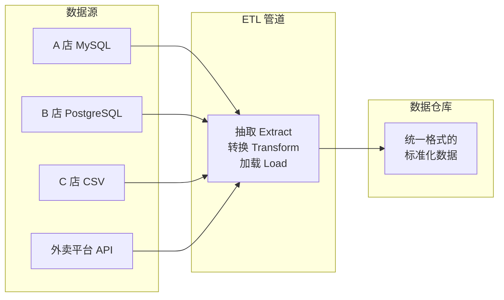
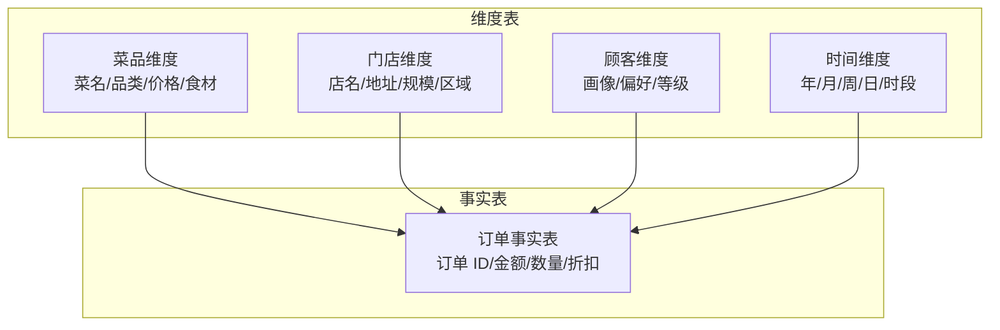
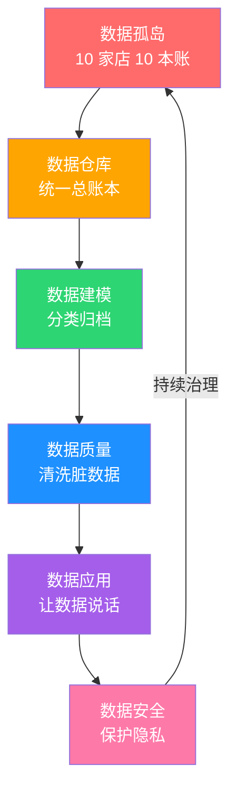

# 数据厨房

> 从阿明的"10 家店 10 本账"，看数据架构与数据治理的完整旅程

> **系列定位**：本篇是「阿明餐厅」系列的**正传 7**。在[前传](./02-system-architecture-evolution.md)中，阿明完成了从单机到云原生的架构演进。但当 10 家店的数据散落在 10 本 Excel 里，老板问"哪道菜最赚钱"却没人答得上来 —— 是时候认真对付"数据"了。

> 最后更新: 2026-06-15


---

## 引言：一道答不上来的问题

年度经营会上，投资人问了阿明一个问题："你 10 家店，哪道菜最赚钱？"

阿明愣住了。

他让财务查，财务说："每家店的报表格式不一样，有的记销售额，有的记毛利，有的只记份数。要汇总的话……大概需要三天。"

三天后，报告出来了。但阿明发现一个更严重的问题 —— 同一种菜，在不同店里叫不同名字。A 店叫"招牌红烧肉"，B 店叫"秘制红烧肉"，C 店叫"阿明红烧肉"。数据根本对不上。

阿明终于意识到：**系统建得再好，数据管不好，一切白搭**。

---

## 第一章：数据孤岛 —— 10 家店 10 本账

阿明让老陈盘点 10 家店的数据现状。结果触目惊心：

```text
10 家店的数据现状：
  A 店：MySQL + Excel 手工报表
  B 店：PostgreSQL + Google Sheets
  C 店：自建系统，没有数据库，用 CSV 文件
  D-J 店：各种组合，五花八门
  
  同一种菜的名字：平均有 3.2 种写法
  同一种"订单状态"：有 5 种编码方式
  金额单位：有的精确到分，有的精确到元
```

这就是**数据孤岛（Data Silos）**—— 每个系统各管各的，互不通信。

数据孤岛的危害不只是"数据分散"，更致命的是**"同一个事实有多种说法"**。当 A 店说"红烧肉卖了 100 份"，B 店说"红烧肉卖了 80 份"，总部说"红烧肉总共卖了 180 份" —— 但这里的"红烧肉"可能根本不是同一个东西。

在技术领域，解决这个问题需要**主数据管理（Master Data Management, MDM）**—— 为所有核心实体（菜品、门店、顾客、订单）建立统一的"标准定义"。

| 数据问题 | 餐厅类比 | 技术术语 | 影响 |
|----------|----------|----------|------|
| 同名异义 | "红烧肉"在不同店是不同菜 | 语义不一致 | 汇总数据失真 |
| 异名同义 | 同一道菜有三个名字 | 命名不统一 | 无法关联分析 |
| 格式不一 | 日期有"2024/01"和"2024-01"两种 | 格式不一致 | 解析错误 |
| 缺失值 | 有的订单没记顾客信息 | 数据不完整 | 分析样本偏差 |

**数据孤岛的核心不是"数据分散"，而是"同一个事实有多种说法"。**

---

## 第二章：数据仓库 —— 统一一本总账

阿明决定建一个"总账本"，把所有店的数据按统一格式汇聚到一起。

在技术世界里，这个"总账本"叫**数据仓库（Data Warehouse）**。它的核心任务不是"存数据"，而是**让数据"说同一种语言"**。

老陈设计了数据仓库的基本架构：



数据从各个系统**抽取（Extract）**，经过**转换（Transform）** 统一格式，最后**加载（Load）** 到仓库中。这就是经典的 **ETL 管道**。

近年来也出现了 **ELT**（先加载后转换）的模式，尤其在云原生数据仓库（如 BigQuery、Snowflake）中更流行 —— 先把原始数据灌进去，利用仓库的算力在库内做转换。

| 方案 | 全称 | 特点 | 适用场景 | 餐厅类比 |
|------|------|------|----------|----------|
| 数据仓库 | Data Warehouse | 结构化、高质量、查询快 | BI 分析、报表 | 总账本 |
| 数据湖 | Data Lake | 原始数据、格式不限、成本低 | 机器学习、探索性分析 | 什么都往里堆的冷库，找不找得到全靠记忆 |
| 数据湖仓 | Data Lakehouse | 兼具两者优点 | 通用场景 | 带索引的智能冷库 —— 什么都有、找得到、还保鲜 |

阿明选择了数据仓库，因为他当前的需求很明确：**出报表、看趋势、做决策**。等数据量大了、需要跑机器学习模型了，再考虑升级到数据湖仓。

详见[《架构是"长"出来的》](./02-system-architecture-evolution.md)中讲的存储选型思路 —— 没有最好的方案，只有最适合当前阶段的方案。

**数据仓库的核心是让数据"说同一种语言"。**

---

## 第三章：数据建模 —— 给数据分类归档

数据汇到了仓库，但还是一团乱麻。老陈说："需要对数据进行**建模**，把它们分门别类，建立关联。"

他采用了**维度建模（Dimensional Modeling）** 的方法，把数据分成两类：

**事实表（Fact Table）**：记录"发生了什么"。比如每一笔订单 —— 谁买的、买了什么、多少钱、什么时候。

**维度表（Dimension Table）**：描述"涉及的实体"。比如菜品信息、门店信息、顾客画像、时间维度。



这种结构叫**星型模型（Star Schema）** —— 事实表在中间，维度表围绕在四周，像一颗星星。

| 模型 | 结构特点 | 优点 | 缺点 | 适用场景 |
|------|----------|------|------|----------|
| 星型模型 | 维度表直接关联事实表 | 查询简单、性能好 | 可能存在数据冗余 | 大多数 BI 场景 |
| 雪花模型 | 维度表进一步规范化拆分 | 减少冗余、存储节省 | 查询复杂、性能较差 | 存储成本敏感场景 |

阿明选择星型模型。原因很简单：**分析师不是数据库专家，他们需要简单直接的查询体验**。一个 `JOIN` 能解决的问题，不要用三个 `JOIN`。

建模完成后，阿明第一次能回答那个问题了："哪道菜最赚钱？" —— 答案是一键查出来的，不需要三天。

**数据建模的核心是让数据"有结构地说话"。**

---

## 第四章：数据质量 —— 脏数据比没有数据更可怕

数据仓库建好了，模型也做好了。但阿明一看报表，发现了新问题：

- 有的菜品价格是 0 元（忘了填价格）
- 有的订单日期是 2099 年（系统 Bug）
- 有的顾客一个月"下了"200 单（重复录入）
- 门店 A 和门店 B 的营业额差了 30 万，但两家店规模差不多

老陈叹了口气："**脏数据比没有数据更可怕。** 没有数据你知道自己不知道，脏数据让你以为自己知道，其实是错的。"

这就是 **GIGO 原则（Garbage In, Garbage Out）**—— 垃圾进，垃圾出。

阿明建立了**数据质量治理体系**：

| 质量维度 | 含义 | 餐厅类比 | 检测方法 | 修复策略 |
|----------|------|----------|----------|----------|
| 完整性 | 字段是否有值 | 食材有没有称重 | 空值率检测 | 补录或标记缺失 |
| 准确性 | 值是否正确 | 价格标对了吗 | 规则校验 + 抽样审核 | 修正 + 源头整改 |
| 一致性 | 同一数据是否统一 | 菜名是否一致 | 跨表/跨系统比对 | 主数据标准化 |
| 及时性 | 数据是否按时到达 | 日报是否按时交 | 延迟监控 + 告警 | 优化 ETL 调度 |
| 唯一性 | 是否有重复 | 订单是否重复录入 | 去重检测 | 合并或标记 |

老陈还引入了**数据血缘（Data Lineage）**—— 追踪每一个数据字段从"产生"到"消费"的完整链路。当一个报表数字看起来不对，可以沿着血缘追溯回去，找到是哪个环节出了问题。

```text
数据血缘示例：
  门店 POS 系统 → ETL 抽取 → 清洗规则 → 订单事实表 → BI 报表
  
  当报表显示"某店月营收异常低"时：
  → 追溯到订单事实表：数据正常
  → 追溯到 ETL 抽取：发现漏抽取了 3 天数据
  → 根因：ETL 调度任务在那 3 天失败了，但没有告警
```

详见[《厨房装监控》](./05-observability.md)中的告警思路 —— 数据管道同样需要监控和告警，ETL 任务失败了要第一时间通知。

**数据质量的核心是"垃圾进，垃圾出"。没有质量保障的数据，比没有数据更危险。**

---

## 第五章：数据应用 —— 让数据说话

数据干净了，阿明终于可以用数据做决策了。

他搭建了四个层次的数据应用，用 B 店的故事串起来：

**第一层：描述性分析 —— "发生了什么？"**

用 BI 工具（阿明选了 Apache Superset）搭建数据看板：每日营收、菜品销量排行、门店对比、客流趋势。以前需要三天出的报表，现在实时更新。一天早上，阿明打开看板就看到了异常 —— **B 店上周营收下降了 20%**。以前这种问题要等月度复盘才会发现。

**第二层：诊断性分析 —— "为什么发生？"**

B 店为什么下降？阿明沿着数据钻取下去：不是菜品出了问题，也不是服务评分下滑 —— 是**午餐时段客流被分流了 35%**。再往下钻，发现 B 店周边上个月新开了一家竞品，主打午餐快餐，直接抢走了 B 店最赚钱的午市客流。

**第三层：预测性分析 —— "会怎样？"**

找到原因后，阿明用历史数据建模：如果不做调整，B 店下个月的营收预计还会再降 10%。同样，食材需求预测模型也发出了警告 —— 按当前客流趋势，B 店下周的牛肉采购量应该减少 25%，否则又会像以前一样多买浪费（食材浪费率曾高达 15%）。

**第四层：决策性分析 —— "该怎么做？"**

阿明决定针对 B 店做 **A/B 测试**：在外卖平台上，对 B 店周边的用户随机展示不同的午餐套餐定价 —— 一半看到原价 38 元，另一半看到新推的"午市特惠"28 元套餐。两周后数据说话：28 元套餐虽然单利润低，但**订单量翻了一倍多**，总利润反而比 38 元方案高出 12%。B 店的午市客流抢回来了。

数据不仅告诉你发生了什么、为什么、会怎样，还能直接告诉你**该怎么做**。

| 分析层次 | 核心问题 | 工具 | 餐厅类比 | 阿明的收益 |
|----------|----------|------|----------|-----------|
| 描述性分析 | 发生了什么？ | BI 看板、报表 | 每日经营简报 | 决策效率提升 10 倍 |
| 诊断性分析 | 为什么发生？ | 数据钻取、归因分析 | 经营分析会 | 问题定位从天级到分钟级 |
| 预测性分析 | 会怎样？ | 机器学习、时间序列 | 食材需求预测 | 浪费率从 15% 降到 9% |
| 决策性分析 | 该怎么做？ | A/B 测试、优化模型 | 菜单定价优化 | 营收提升 8% |

**数据应用的核心是从"看数据"到"用数据做决策"。**

---

## 第六章：数据安全与合规 —— 顾客的隐私不能卖

正当阿明为数据驱动决策高兴时，出事了。

一个店员把顾客的手机号和消费记录导出，卖给了推销公司。顾客接到骚扰电话后投诉到消协，阿明被罚了 20 万。

阿明这才意识到：**数据也是资产，也需要像食材一样被保护**。

详见[《食安大检查》](./06-security-architecture.md)中的安全架构六大防线 —— 数据安全是系统安全的重要组成部分。

老陈帮阿明建立了**数据分级与合规体系**：

| 数据等级 | 定义 | 示例 | 存储要求 | 访问控制 |
|----------|------|------|----------|----------|
| L1 公开 | 可公开的信息 | 菜品名称、门店地址 | 无特殊要求 | 无限制 |
| L2 内部 | 仅供内部使用 | 销售报表、库存数据 | 内网存储 | 员工可访问 |
| L3 敏感 | 需要保护的信息 | 顾客手机号、消费记录 | 加密存储 | 角色授权 + 脱敏 |
| L4 机密 | 高度敏感信息 | 支付信息、核心配方 | 独立加密 + 审计 | 最小权限 + 审批 |

**数据脱敏（Data Masking）** 是关键一环：客服看到的顾客手机号是 `138****1234`，分析师看到的消费金额是区间值（"100-200 元"）而非精确值。只有授权人员在特定场景下才能看到完整数据。

此外，阿明还建立了**数据访问审计日志** —— 谁在什么时间访问了什么数据，全部记录。一旦发生数据泄露，可以迅速追溯。

| 合规要求 | 法规依据 | 阿明的落地措施 |
|----------|----------|---------------|
| 知情同意 | 个人信息保护法 | 顾客注册时明确告知数据用途 |
| 最小收集 | GDPR / 个保法 | 只收集必要字段，不过度采集 |
| 数据删除权 | GDPR 第 17 条（删除权）/ 个保法第 47 条 | 顾客注销后 30 天内彻底删除个人数据 |
| 数据跨境 | 数据出境安全评估 | 海外门店数据本地化存储 |

**数据安全的核心是数据也是资产，也需要权限、审计和保护。**

---

## 核心总结：数据架构与数据治理



| 策略 | 核心问题 | 餐厅类比 | 技术实现 |
|------|----------|----------|----------|
| 数据治理 | 同一个事实有多种说法 | 统一菜名和编码 | MDM、数据标准 |
| 数据仓库 | 数据分散在各处 | 总账本 | ETL/ELT 管道 |
| 数据建模 | 数据没有结构 | 分类归档 | 星型/雪花模型 |
| 数据质量 | 脏数据比没数据更危险 | 贴错标签的食材 | 清洗、监控、血缘 |
| 数据应用 | 数据不能驱动决策 | 经营分析会 | BI、A/B 测试、预测 |
| 数据安全 | 顾客隐私不能卖 | 食材保管制度 | 分级、脱敏、审计 |

### 一句心法

**数据不是"越多越好"，而是"越准越好"。** 没有治理的数据，就像仓库里的食材全贴错了标签 —— 看着满满当当，但用起来全是坑。

---

## 延伸阅读

- [架构是"长"出来的](./02-system-architecture-evolution.md) —— 数据仓库是架构演进的必然产物，从业务库到分析库是一次架构升级
- [当餐厅长出大脑](./01-ai-agent-architecture.md) —— AI Agent 的记忆层本质上也是一种"数据管理"，RAG 就是数据检索
- [高峰保卫战](./04-peak-traffic-defense.md) —— 大数据量场景下的查询性能，需要缓存和限流策略保护
- [厨房装监控](./05-observability.md) —— 数据管道的监控告警，和系统监控思路一致
- [食安大检查](./06-security-architecture.md) —— 数据安全是系统安全的重要组成部分，脱敏和审计是通用能力
- [从厨师到 CEO](./07-from-chef-to-ceo.md) —— 数据驱动的决策文化，需要管理层推动
- [厨房质检员](./08-qa-testing-strategy.md) —— 数据质量测试和代码测试的理念一致：尽早发现问题
- [从接单到出餐](./09-cicd-devops.md) —— ETL 管道的 CI/CD，数据模型变更也需要版本管理和灰度发布
- [菜单设计学](./10-api-design.md) —— 数据 API 的设计质量直接影响数据消费的便利性
- [给产品经理的重构说明书](./03-refactoring-guide-for-pm.md) —— 数据治理项目的 ROI 评估，和重构决策类似
- [学徒的困境](./11-ai-learning-paradox.md) —— AI 时代的人机协作与学习之道，当 AI 越来越强，人还要不要练基本功
- [前厅翻修记](./13-frontend-renovation.md) —— 前端工程化与用户体验，后厨再快，前厅的门进不来一切白搭
- [阿明的省钱经](./14-cloud-finops.md) —— 云成本优化与 FinOps，120 万月账单如何降到 68 万
- [差评危机](./15-incident-response.md) —— 故障复盘与应急响应，从手忙脚乱到 10 分钟止血的方法论
- [外卖大战](./16-performance-optimization.md) —— 系统性能优化，3 秒生死线下的全链路优化实战
- [传菜窗口的智慧](./20-realtime-eventdriven.md) —— 消息队列是数据管道的基础设施，事件溯源与数据流的异步传递
- [十家店的烦恼](./18-distributed-puzzles.md) —— 分布式系统中的数据一致性问题，10 个节点如何达成"同一个事实"
- [阿明的加盟帝国](./19-saas-multitenant.md) —— 多租户数据架构，租户间的数据隔离与独立分析
- [厨房实况直播](./20-realtime-eventdriven.md) —— 实时事件流是数据管道的新形态，从批处理到流处理的升级
- [一个厨房，四个门面](./21-multiplatform-architecture.md) —— 多端数据的汇聚和融合，不同渠道的数据如何统一入仓
- [懂你的菜单](./22-search-recommendation.md) —— 搜索推荐依赖数据基础，用户行为数据是推荐算法的燃料
- [菜谱标准化之路](./07-from-chef-to-ceo.md) —— 数据治理中的元数据管理和数据字典，是知识工程在数据领域的应用
- [仓库搬家不停业](./24-database-migration.md) —— 数据库迁移中的数据治理，迁移过程中的数据映射和转换
- [预制菜还是现炒](./25-lowcode-platform.md) —— 低代码平台的数据模型设计，可视化配置背后的数据结构
- [阿明出海记](./26-globalization.md) —— 多区域数据架构，数据合规和跨境数据流动的管理
- [厨房大换岗](./27-ai-org-transformation.md) —— AI 组织转型中的数据角色变化，数据团队从报表到 AI 训练数据
- [阿明的二次创业](./28-ai-native-startup.md) —— AI 原生创业的数据基础，从第一天就建立数据驱动的决策文化
- [会自我进化的厨房](./29-self-evolving-company.md) —— Agent Loop 的传感器层依赖数据架构，数据质量决定 Agent 质量
- [AI 的"黑暗料理"](./30-ai-hallucination-safety.md) —— AI 幻觉与数据质量的关系，GIGO 原则在 AI 幻觉中同样适用

---

## 结语

阿明的数据厨房故事，揭示了一个所有数据驱动团队都要跨过的门槛：**系统产生了海量数据，但"有数据"和"用数据做决策"之间，隔着一条完整的治理链路。**

答案是六步法：打破数据孤岛统一口径，建设数据仓库汇聚一处，通过数据建模分类归档，保障数据质量去伪存真，利用数据应用驱动决策，守护数据安全合规底线。

下次当你面对数据问题时，不妨问自己：

- 你能在 1 小时内出一份准确的全业务报告吗？
- 你的数据有没有统一的"字典"（同一字段只有一种含义）？
- 你有数据质量监控吗？还是等用户投诉才发现数据问题？
- 你的数据血缘清晰吗？一个字段改了，能知道影响哪些报表？
- 你的数据合规做到位了吗？顾客的个人信息有脱敏处理吗？

> 好的数据治理，不是"让数据越多越好"，而是"让每一份数据都可信、可用、可追溯"。

← [返回系列导读](./index.md)
