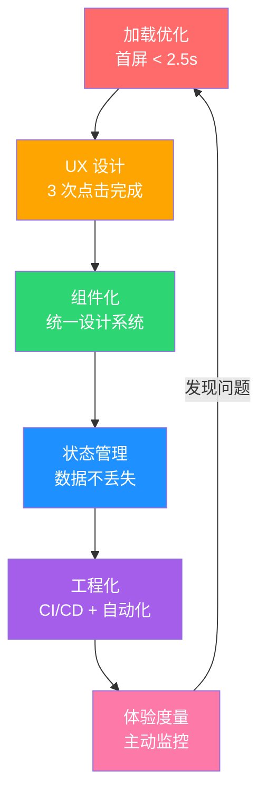

# 前厅翻修记

> 从阿明的"8 秒点餐页"，看前端工程化与用户体验的全面升级

> **系列定位**：本篇是「阿明餐厅」系列的**正传 8**。前面的故事都在讲"后厨"（后端架构、运维、安全）。但顾客第一个接触的不是后厨，而是"前厅" —— 点餐页面。如果前厅的门都进不来，后厨再快也没用。

> 最后更新: 2026-06-15


---

## 引言：8 秒的等待

阿明的手机点餐页面上线了。产品经理小美很满意："页面多漂亮啊，大图、动效、品牌色，高级感拉满。"

但上线一周后，数据打脸了 —— **页面加载平均 8 秒，跳出率 60%**。六成顾客还没看到"漂亮的页面"就走了。

有个顾客发微博："阿明家的网页比等位还慢。我点了个外卖，等页面加载完，饿劲都过了。"

阿明很困惑："后厨出餐只要 5 分钟，为什么顾客连页面都打不开？"

老陈一句话点醒了他："**后厨再快有什么用？前厅的门都进不来。**"

---

## 第一章：加载太慢 —— 顾客在门口就走了

阿明让老陈查"为什么这么慢"。

老陈打开浏览器的开发者工具，一看吓一跳：

```text
首屏加载分析：
  HTML 文档        ：200ms
  CSS 文件（8个）  ：1.8s
  JavaScript（12 个）：3.2s
  图片（23张）     ：2.5s
  第三方脚本（5 个）：1.3s
  ─────────────────
  总计             ：约 8 秒
```

8 个 CSS 文件、12 个 JavaScript 文件、23 张未压缩的图片、5 个第三方统计脚本 —— 页面就像一个"什么都往上堆"的自助餐台。

阿明问："不能少放点吗？"老陈说："产品经理说都要。"

在前端世界里，这涉及一个核心指标体系 —— **Core Web Vitals**（核心网页指标）：

| 指标 | 含义 | 餐厅类比 | 目标值 | 阿明现状 |
|------|------|----------|--------|----------|
| LCP（最大内容渲染） | 最大元素加载时间 | 菜单端到顾客面前的时间 | < 2.5s | 8s ❌ |
| INP（交互到下一次绘制） | 点击到页面响应 | 点菜到服务员确认 | < 200ms | 600ms ❌ |
| CLS（累积布局偏移） | 页面元素意外移动（无单位的比值，衡量布局偏移的相对幅度） | 菜单排版乱跳 | < 0.1 | 0.35 ❌ |

三个指标全红。老陈开始了优化三板斧：

**懒加载（Lazy Loading）**：首屏只加载可见区域的图片，其他图片滚动到可视区域时再加载。图片从 23 张降到首屏 5 张。

**代码分割（Code Splitting）**：把 12 个 JS 文件按需加载，首屏只加载必要的代码。

**资源压缩**：图片用 WebP 格式，CSS/JS 用 Brotli 压缩。

一周后，LCP 从 8 秒降到 1.8 秒，跳出率从 60% 降到 22%。

加载优化的核心是**让用户在失去耐心之前看到内容**。

---

## 第二章：菜单设计 —— 好不好用比好不好看重要

页面快了，但新问题来了。

客服反馈："顾客说找不到'加辣'选项，要翻好几层菜单。"还有老年顾客投诉："字太小了，按钮点不到。"

阿明亲自试了一下：想点一份"宫保鸡丁 + 加辣 + 米饭"，需要点击 **7 次**、跨越 **5 个页面**。

"这菜单谁设计的？"阿明问。

小美委屈地说："我参考了五家竞品，把最好的功能都加上了……"

问题就出在这 —— **功能堆砌不等于好用**。

老陈搬出了尼尔森（Jakob Nielsen）的**十大可用性原则**，挑出最关键的 5 条：

| 可用性原则 | 含义 | 阿明的问题 | 修复方案 |
|-----------|------|-----------|----------|
| 系统状态可见 | 让用户知道发生了什么 | 点完"下单"没反应，不知道在加载 | 加加载动画和状态提示 |
| 贴近用户心智 | 用用户的语言，而非系统术语 | "SKU 属性选择"——顾客看不懂 | 改成"规格：大份/小份" |
| 用户可控可撤 | 方便返回和取消 | 选错了无法返回上一步 | 加"上一步"按钮和撤销功能 |
| 一致性 | 相同的操作，相同的表现 | A 页面红色按钮是确认，B 页面红色是取消 | 统一按钮颜色和含义 |
| 容错设计 | 防止用户犯错 | 数量可以选 0 份，下单后才报错 | 前端校验 + 默认值 |

阿明让小美重新设计菜单，原则只有一个：**让顾客在 3 次点击内完成点餐**。

重新设计后，"宫保鸡丁 + 加辣 + 米饭"只需要 **3 次点击**。

UX 设计的核心是**减少用户的认知负担，而不是展示设计师的才华**。

---

## 第三章：组件化 —— 统一所有门店的门面

加载和菜单都优化了，但 10 家店的线上页面又出了新问题。

A 店的"收藏"按钮在右上角，B 店在左下角。C 店有"会员积分"入口，D 店没有。顾客换一家店就要重新学一遍操作。

阿明问："为什么不能统一？"

新来的实习生小王说："每家店的页面是不同团队做的，用的代码不一样。A 店用 React，B 店用 Vue，C 店用的还是 jQuery……"

这就是**技术栈分裂**的问题 —— 详见[《从厨师到 CEO》](./07-from-chef-to-ceo.md)第二章"技术雷达"中讲的，技术栈不统一，维护成本就会爆炸。

阿明决定建立一套**设计系统（Design System）**。老陈用了一个很形象的比喻："这就像中央厨房统一采购标准化餐具 —— 所有门店不再自己买碗买盘，而是从中央厨房领取统一规格的餐具。"

| 层次 | 餐厅类比 | 技术实现 | 解决的问题 |
|------|----------|----------|-----------|
| 设计令牌（Design Token） | 统一的配色方案和品牌标准 | 颜色、字体、间距的变量定义 | 视觉一致性 |
| 基础组件（Atoms） | 中央厨房统一采购的标准化餐具（碗、盘、杯、筷） | Button、Input、Card、Modal | 交互一致性 |
| 业务组件（Molecules） | 标准化的菜品摆盘规范（凉菜用圆盘、汤用深碗） | MenuItem、CartBar、OrderCard | 业务一致性 |
| 页面模板（Templates） | 标准化的门店装修方案（吧台位置、餐桌间距） | HomePage、MenuPage、OrderPage | 结构一致性 |

所有组件用 **Storybook** 做文档和预览，任何团队成员都能看到每个组件的用法和状态。

统一后，10 家店的页面风格一致，维护成本从"10 套代码"降到"1 套组件库 + 10 个配置"。新门店上线时间从 2 周缩短到 2 天。

组件化的核心是**让"一致性"变成默认行为，而不是靠人盯**。

---

## 第四章：状态管理 —— 购物车为什么又丢了

组件化做完了，但用户投诉了一个更严重的问题：**购物车会丢**。

顾客选了 5 个菜，点击"去领券"，再返回时发现 —— 购物车空了。选好的菜全没了。

阿明自己也试了一下，果然。"这谁受得了？选半天白选了！"

老陈分析原因：购物车数据存在**组件的本地状态**里，页面一切换，组件销毁，数据就没了。

```text
问题根源：
  菜品页（MenuPage）
    └─ 购物车状态存在组件 state 里
        └─ 点击"去领券" → 路由切换 → 组件销毁 → 状态丢失！
```

这就是**状态管理**的问题 —— 哪些数据放在哪里，需要仔细设计。

| 状态类型 | 餐厅类比 | 存储位置 | 生命周期 | 示例 |
|----------|----------|----------|----------|------|
| 组件状态 | 桌上的调料 | 组件内部 | 组件存活期间 | 下拉框是否展开 |
| 页面状态 | 服务员手里的点菜单 | 页面级 Store | 页面存活期间 | 筛选条件、排序方式 |
| 全局状态 | 收银台的总账单 | 全局 Store | 整个应用 | 购物车、用户信息、登录态 |
| 持久化状态 | 保险箱里的账本 | localStorage / 后端 | 跨会话 | 收货地址、历史订单 |

老陈把购物车提升为**全局状态**，并加了**持久化** —— 即使刷新页面，购物车数据也不会丢。

| 状态管理方案 | 特点 | 适用场景 | 阿明的选择 |
|-------------|------|----------|-----------|
| Redux / Vuex | 集中式，功能强大 | 大型应用、复杂状态 | ✅ 主应用 |
| Zustand / Pinia | 轻量，灵活 | 中小型应用 | ✅ 子应用 |
| React Context | 原生，简单 | 简单状态共享 | 主题/语言切换 |
| URL 参数 | 无状态，可分享 | 筛选/搜索条件 | 搜索和筛选 |

状态管理的核心是**让数据在正确的时间出现在正确的地方**。

---

## 第五章：前端工程化 —— 从手工作坊到流水线

技术问题一个个解决了，但阿明发现一个更深层的问题：**前端团队的开发方式太"手工"了**。

没有构建流程 —— 代码改完直接 FTP 上传到服务器。没有代码规范 —— 每个人的代码风格不一样。没有自动化测试 —— 每次上线全靠"点一点看看有没有问题"。

有一次，小王改了一行 CSS，结果整个页面的按钮都消失了。上线后才发现，紧急回滚花了 2 小时。

阿明说："后厨都有标准化流程，前端为什么没有？"

详见[《从接单到出餐》](./09-cicd-devops.md)中讲的 CI/CD 流水线 —— 前端同样需要。

阿明建立了**前端工程化五大支柱**：

| 支柱 | 餐厅类比 | 工具 | 解决的问题 |
|------|----------|------|-----------|
| 构建工具 | 标准化的灶台 | Vite / Webpack | 统一构建流程，代码编译打包自动化 |
| 代码规范 | 统一的菜谱格式 | ESLint + Prettier | 代码风格一致，减少低级错误 |
| 类型检查 | 食材规格校验 | TypeScript | 编译期发现类型错误 |
| 单元测试 | 每道菜的试吃环节 | Vitest / Jest | 保证组件逻辑正确 |
| E2E 测试 | 全流程试营业 | Playwright / Cypress | 模拟用户操作，验证完整流程 |

接入 CI/CD 后，每次代码提交自动运行：lint 检查 → 单元测试 → 构建 → E2E 测试 → 预览环境部署。任何一步失败都会阻断上线。

小王改 CSS 导致按钮消失的问题？ESLint 会报 warning，E2E 测试会直接 fail，根本到不了生产环境。

前端工程化的核心是**让"质量"成为流程的产物，而不是个人的自觉**。

---

## 第六章：体验度量 —— 怎么知道顾客满不满意

所有技术优化都做了，但阿明还有一个问题："怎么知道顾客到底满不满意？"

以前只有两个渠道知道用户不满：**投诉**（滞后指标，用户已经愤怒了）和**流失**（更滞后，用户已经走了）。

老陈说："我们不能等用户投诉了才发现问题。要**在用户投诉前，就主动看到问题**。"

这和[《厨房装监控》](./05-observability.md)中的可观测性思路一模一样 —— 后厨需要监控，前厅同样需要。

阿明建立了**体验度量三层模型**：

| 层次 | 度量类型 | 具体指标 | 采集方式 | 餐厅类比 |
|------|----------|----------|----------|----------|
| 技术指标 | 页面性能 | LCP/INP/CLS/TTFB | RUM（真实用户监控） | 出餐速度 |
| 行为指标 | 用户行为 | 跳出率、转化率、点击热力图 | 埋点 + 行为分析 | 翻台率、点菜偏好 |
| 主观反馈 | 用户满意度 | NPS、CSAT、应用评分 | 问卷 + 评价系统 | 顾客意见表 |

老陈用 **RUM（Real User Monitoring）** 采集真实用户的性能数据，发现了一个之前完全没注意到的问题：**某个型号的安卓手机上，页面加载时间是平均值的 3 倍**。之前只在 iPhone 上测试，完全没发现这个问题。

阿明还引入了 **A/B 测试**：新菜单设计和老菜单设计同时上线，随机分配用户，看哪个版本的转化率更高。结果显示新版转化率提升了 23% —— 有数据支撑，不再靠"我觉得"。

体验度量的核心是**从"等用户投诉"到"在用户投诉前发现问题"**。

---

## 核心总结：前端工程化与用户体验



| 策略 | 核心问题 | 餐厅类比 | 技术实现 |
|------|----------|----------|----------|
| 加载优化 | 顾客在门口就走了 | 开门要快 | Core Web Vitals、懒加载、代码分割 |
| UX 设计 | 菜单不好用 | 3 次点击点完 | 可用性原则、信息架构 |
| 组件化 | 门店门面不统一 | 统一装修风格 | Design System、Storybook |
| 状态管理 | 购物车丢了 | 点菜单不能丢 | 全局 Store、数据持久化 |
| 工程化 | 开发全靠手工 | 标准化厨房 | Vite、ESLint、CI/CD、E2E 测试 |
| 体验度量 | 不知道顾客满不满意 | 主动询问反馈 | RUM、A/B 测试、行为分析 |

---

## Core Web Vitals 三大核心指标详解

Google 的 Core Web Vitals 是前端体验的"健康体检"：

| 指标 | 含义 | 餐厅类比 | 优秀阈值 | 优化手段 |
|------|------|----------|---------|---------|
| LCP（Largest Contentful Paint） | 最大内容绘制时间 | 主菜上桌时间 | < 2.5 秒 | CDN、预加载、图片优化 |
| FID（First Input Delay） | 首次输入延迟 | 服务员响应时间 | < 100 毫秒 | 代码分割、长任务拆分 |
| CLS（Cumulative Layout Shift） | 累积布局偏移 | 菜单跳来跳去 | < 0.1 | 固定尺寸、骨架屏 |
| INP（Interaction to Next Paint） | 交互到下次绘制 | 点完菜到反应时间 | < 200 毫秒 | 事件委托、Web Worker |

**阿明的 3 阶段优化**：

1. **监控阶段**：接入 RUM（Real User Monitoring），看真实用户指标
2. **优化阶段**：按 P75 / P95 数据优化最差的 20% 场景
3. **保持阶段**：CI/CD 集成 Lighthouse，PR 提交自动检测回归

---

## 前端组件库治理

当公司有 3+ 前端团队时，组件库治理是必修课：

### 组件库的 3 个生命周期阶段

| 阶段 | 特征 | 治理重点 |
|------|------|---------|
| 起步期 | 1 个团队，5-10 个组件 | 跑通即可，不必治理 |
| 成长期 | 3-5 个团队，30+ 组件 | 统一规范，避免重复造轮子 |
| 成熟期 | 10+ 团队，100+ 组件 | 强制 + 治理委员会 |

### 组件库的 4 级分类

| 级别 | 名称 | 例子 | 强制使用 |
|------|------|------|---------|
| L0 | 基础原子 | Button / Input / Icon | ✅ 强制 |
| L1 | 复合组件 | Search / Pagination | ✅ 强制 |
| L2 | 业务组件 | MenuCard / OrderItem | ⚠️ 推荐 |
| L3 | 业务页面 | HomePage / OrderPage | ❌ 自由 |

**治理铁律**：
- L0/L1 强制使用（避免 5 个团队写 5 个 Button）
- L2 推荐使用（业务相似时可复用）
- L3 自由发挥（每个产品有差异）

### 组件库的反模式

1. **过早抽象**：MVP 阶段就把所有组件抽出来 → 维护成本 > 复用收益
2. **过度设计**：每个组件支持 20 种 props → 90% 用不到
3. **缺乏文档**：组件库只有代码没有 Storybook → 团队不会用
4. **不向后兼容**：升级版本直接 breaking change → 业务方拒绝升级

---

## 3 个前端翻车案例

### 案例 1：图片没懒加载，移动端首屏 5 秒

2024 年，阿明的电商首页有 30 张商品图，全在首屏加载，移动端 LCP 5.2 秒。优化：图片懒加载 + WebP + CDN + 响应式图片，LCP 降到 1.8 秒。

**教训**：**图片是首屏性能的最大杀手**，必须 lazy load + 压缩 + CDN 三件套。

### 案例 2：状态管理混乱，购物车丢单

2025 年初，3 个团队各用各的状态管理（Vuex / Pinia / 自建），用户加购后切换页面购物车数据丢失。优化：统一用 Pinia + 持久化到 localStorage + 服务端同步。

**教训**：**状态管理必须统一**，否则多团队协作就是灾难。

### 案例 3：CSS 全局污染，样式串了

2024 年 9 月，新人写的 CSS 选择器太宽泛（`div > a`），导致所有链接颜色变红。优化：CSS Modules + BEM 命名 + Style Lint 检查。

**教训**：**CSS 必须有作用域**，否则新人改一处样式，全站受影响。

---

## 前端工程化完整工具链

| 环节 | 工具 | 作用 |
|------|------|------|
| 包管理 | pnpm / Yarn | 依赖管理 |
| 构建 | Vite / Webpack | 打包构建 |
| 类型 | TypeScript | 类型安全 |
| Lint | ESLint + Prettier | 代码规范 |
| 测试 | Vitest + Playwright | 单元 + E2E |
| 组件库 | Storybook | 组件预览 |
| 监控 | Sentry / 自建 RUM | 错误监控 |
| 性能 | Lighthouse CI | 性能回归 |
| 部署 | Vercel / 自建 | CI/CD 部署 |

### 一句心法

**前端不是"画页面"，而是"设计体验"。** 后厨再快，前厅的门进不来，一切都是零。

---

## 延伸阅读

- [架构是"长"出来的](./02-system-architecture-evolution.md) —— 前端的状态管理问题，和后端的缓存一致性问题本质相通 —— 都是"数据在多个地方保持同步"
- [当餐厅长出大脑](./01-ai-agent-architecture.md) —— AI Agent 的"感知层"需要前端提供高质量的用户输入，前端体验直接影响 AI 的输入质量
- [高峰保卫战](./04-peak-traffic-defense.md) —— 前端也需要"限流"—— 防抖和节流就是前端版的流量治理
- [厨房装监控](./05-observability.md) —— RUM（真实用户监控）是可观测性在前端的延伸
- [食安大检查](./06-security-architecture.md) —— 前端安全同样重要：XSS 防护、CSRF 防护、敏感数据不存前端
- [从厨师到 CEO](./07-from-chef-to-ceo.md) —— 组件化和设计系统是"技术雷达"在前端领域的落地
- [厨房质检员](./08-qa-testing-strategy.md) —— 前端的测试金字塔：单元测试（组件）→ 集成测试（交互）→ E2E 测试（流程）
- [从接单到出餐](./09-cicd-devops.md) —— 前端 CI/CD 是后端 CI/CD 的延伸，构建、测试、部署同样需要自动化
- [菜单设计学](./10-api-design.md) —— 前端消费 API，API 设计的好坏直接影响前端的复杂度和性能
- [给产品经理的重构说明书](./03-refactoring-guide-for-pm.md) —— 前端重构同样需要渐进式策略，不要一次性"翻修"
- [学徒的困境](./11-ai-learning-paradox.md) —— AI 时代的人机协作与学习之道，当 AI 越来越强，人还要不要练基本功
- [数据厨房](./12-data-kitchen.md) —— 数据架构与数据治理，10 家店 10 本账如何变成数据驱动决策
- [阿明的省钱经](./14-cloud-finops.md) —— 云成本优化与 FinOps，120 万月账单如何降到 68 万
- [差评危机](./15-incident-response.md) —— 故障复盘与应急响应，从手忙脚乱到 10 分钟止血的方法论
- [外卖大战](./16-performance-optimization.md) —— 系统性能优化，3 秒生死线下的全链路优化实战
- [传菜窗口的智慧](./20-realtime-eventdriven.md) —— 消息队列的异步模式在前端的应用，EventSource 和 WebSocket 是前端的"传菜窗口"
- [十家店的烦恼](./18-distributed-puzzles.md) —— 前端如何处理分布式系统的一致性问题，最终一致性的 UI 展示策略
- [阿明的加盟帝国](./19-saas-multitenant.md) —— 多租户前端定制，不同租户的界面风格、主题、组件差异化
- [厨房实况直播](./20-realtime-eventdriven.md) —— WebSocket 和 SSE 是前端实时更新的两种实现方式
- [一个厨房，四个门面](./21-multiplatform-architecture.md) —— 多端架构是前端工程的延伸，跨平台方案的选型与适配
- [懂你的菜单](./22-search-recommendation.md) —— 搜索推荐的前端交互设计，搜索框、推荐列表、筛选器的 UX 优化
- [菜谱标准化之路](./07-from-chef-to-ceo.md) —— 前端技术文档和组件 Storybook，前端知识的沉淀与共享
- [仓库搬家不停业](./24-database-migration.md) —— 数据库迁移对前端的影响，Schema 变更时前端的兼容处理
- [预制菜还是现炒](./25-lowcode-platform.md) —— 低代码平台的可视化编辑器是前端工程化的新方向
- [阿明出海记](./26-globalization.md) —— 国际化前端适配，多语言 RTL 布局、本地化日期和货币显示
- [厨房大换岗](./27-ai-org-transformation.md) —— AI 转型对前端工程师的影响，前端需要适配 AI 增强的人机交互
- [阿明的二次创业](./28-ai-native-startup.md) —— AI 原生创业的前端体验，MVP 的前端是用户的第一接触点
- [会自我进化的厨房](./29-self-evolving-company.md) —— Agent Loop 的用户反馈层，前端是收集用户反馈的核心触点
- [AI 的"黑暗料理"](./30-ai-hallucination-safety.md) —— AI 幻觉在前端的展示，如何在界面上处理 AI 的不确定性

---

## 结语

阿明的前厅翻修故事，点出了一个所有做用户产品的团队都容易犯的错：**把力气全花在后厨，却忘了顾客第一个接触的是前厅 —— 技术再好，用户感受不到，就等于没有。**

答案是六步法：加载优化让用户进得来，UX 设计让用户用得顺，组件化让体验一致，状态管理让数据可靠，工程化让质量可控，体验度量让问题可发现。

下次当你做前端产品时，不妨问自己：

1. 你的首屏加载时间是多少？有没有超过 3 秒？
2. 你的用户能在 3 次点击内完成核心操作吗？
3. 你有统一的设计系统吗？还是每个页面各做各的？
4. 你的前端有自动化测试吗？还是全靠手工回归？
5. 你在主动监控用户体验指标吗？还是等投诉了才知道？

> 好的前端，不是"让页面更好看"，而是"让用户忘记页面的存在，只记得体验的流畅"。

← [返回系列导读](./index.md)
