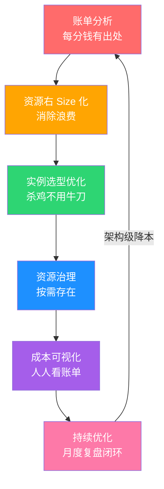

# 阿明的省钱经

> 从阿明的"120 万云账单"，看云成本优化与 FinOps 的落地实践

> **系列定位**：本篇是「阿明餐厅」系列的**番外二**。在[番外《给产品经理的重构说明书》](./03-refactoring-guide-for-pm.md)中，阿明学会了用 PM 能理解的语言沟通技术决策。这一篇，他面对的不再是技术问题，而是一个更现实的问题 —— **钱不够花了**。

---

## 引言：120 万的账单

月底，阿明收到云服务商的月度账单。

他打开一看，差点从椅子上摔下来 —— **120 万**。比预算超了整整 3 倍。

阿明把技术总监老陈叫过来："这个月花了这么多，涨在哪了？"

老陈翻了翻账单："业务增长嘛，服务器多了，费用当然涨。"

阿明追问："那业务涨了多少？"老陈愣了一下，答不上来。

阿明让财务把账单按服务拆开，结果越拆越心惊 —— 有些钱花得毫无道理，有些资源根本没人知道是干什么的。

阿明终于明白了：**上云容易，管好云上的钱，比管好技术还难**。

---

## 第一章：账单惊吓 —— 钱花哪了？

阿明让老陈和财务一起，把 120 万的账单一笔笔拆开。

结果令人震惊：

```text
云费用构成（月度）：
  计算资源（ECS/EC2）    ：56 万（47%）
  数据库（RDS/Redis）    ：28 万（23%）
  存储（OSS/S3）         ：15 万（13%）
  网络带宽 / CDN         ：12 万（10%）
  其他（消息队列/监控）   ：8 万（7%）
  不明资源               ：8000 元（0.7%）
```

"不明资源"是什么？查了半天，发现有 23 个零散资源实例（未挂载的云盘、过期的快照、没有流量的弹性 IP 等），创建者早已离职，没人知道干什么用的，但每月照扣不误。

阿明苦笑："这就像餐厅里有 23 个小灶台，天天烧着煤气，但没人知道在煮什么。"

在技术世界里，这叫**云成本归因（Cloud Cost Attribution）**—— 把每一笔费用追溯到具体的团队、项目、服务。做不到归因，就做不了优化。

| 成本类别 | 典型占比 | 餐厅类比 | 优化难度 |
|----------|----------|----------|----------|
| 计算资源 | 35-50% | 灶台的燃气费 | 中（选型 + 右Size 化） |
| 数据库 | 15-25% | 食材仓库的租金 | 高（架构级优化） |
| 存储 | 10-15% | 冷库的电费 | 低（生命周期策略） |
| 网络 | 5-15% | 外卖配送费 | 中（CDN + 压缩） |
| 其他 | 5-10% | 杂项开支 | 视具体情况 |

账单分析的核心是**把"一笔糊涂账"变成"每分钱都有出处"**。

---

## 第二章：资源浪费 —— 一半的灶台从来没开过火

账单拆清楚了，阿明开始查利用率。

老陈导出了所有服务器的 CPU 和内存利用率数据，画了一张图：

```text
服务器利用率分布（40 台）：
  CPU > 50%：  4 台（10%）—— 真正忙碌的
  CPU 20-50%：8 台（20%）—— 正常工作的
  CPU 5-20%： 13 台（33%）—— 半闲置的
  CPU < 5%：  15 台（37%）—— 几乎闲置的
```

37% 的服务器几乎闲置！阿明问："这些机器为什么还开着？"

老陈尴尬地说："有的是大促时临时扩的，大促完忘了缩回去。有的是某个项目下线了，但资源没释放。还有的是开发环境，建了就没管过。"

这就是**资源浪费** —— 买的时候觉得便宜，放着不管才是真的贵。

阿明决定做两件事：

**第一，右Size 化（Right-Sizing）**：把利用率低的服务器换成更小的规格。一台 8 核 32G 的机器，CPU 利用率只有 3%，换成 2 核 8G 完全够用，月费从 3200 降到 800。

**第二，清理闲置资源**：包括未挂载的云盘、过期的快照、空闲的负载均衡器、没有流量的弹性 IP。

| 浪费场景 | 餐厅类比 | 月浪费 | 修复方案 | 修复后月省 |
|----------|----------|--------|----------|-----------|
| 低利用率大机器 | 小炒用了大灶 | 18 万 | 右Size 化 | 12 万 |
| 大促后未缩容 | 宴席结束没撤桌 | 6 万 | 自动缩容策略 | 6 万 |
| 未挂载云盘 | 空着的冰箱 | 2 万 | 自动清理脚本 | 2 万 |
| 过期快照 | 过期的食材 | 1.5 万 | 生命周期策略 | 1.5 万 |
| 闲置负载均衡 | 空着的传菜台 | 0.8 万 | 手动清理 | 0.8 万 |

资源浪费的核心是**"买的时候觉得便宜，放着不管才是真的贵"**。

---

## 第三章：实例选型 —— 杀鸡不用牛刀

右Size 化做完，阿明又发现一个问题：实例类型选错了。

那个日志查询服务，用的是"计算优化型"实例（16 核 32G），月费 8000 元。但日志查询的特点是**读多写少、CPU 密集但内存需求低**。换成"通用型"4 核 16G，性能完全够用，月费只要 2000 元。

老陈解释："当初建这个项目时，开发同学选了最大规格，想着'反正先买大的，以后再说'。然后就没有以后了。"

云服务商提供了几十种实例类型，选错了就是花冤枉钱。

### 三种付费模式

除了实例类型，付费模式也是一笔大账：

| 付费模式 | 类比 | 折扣力度 | 适用场景 | 风险 |
|----------|------|----------|----------|------|
| 按需付费（On-Demand） | 按次点菜 | 无折扣 | 临时需求、测试 | 最贵 |
| 预留实例（Reserved） | 包年套餐 | 30-60% off | 稳定负载、核心服务 | 提前锁定，不够灵活 |
| 竞价实例（Spot） | 尾单特价 | 60-90% off | 可中断的批处理任务 | 随时可能被回收 |

阿明的策略：

- **核心服务**（订单、支付）：预留实例，锁定 1 年，省 40%
- **弹性负载**（推荐、搜索）：按需付费 + 自动伸缩
- **批处理任务**（数据导出、报表生成）：竞价实例，省 70%，中断后自动重试

实例选型的核心是**"用最小的钱，买够用的资源"**。

---

## 第四章：资源治理 —— 别让灶台一直烧着空锅

做完右Size 化和实例选型，阿明发现还有一个大问题：**测试环境**。

阿明有 3 套测试环境（开发/测试/预发布），每套都 7x24 小时运行。但测试团队只在工作日 9:00-20:00 使用。也就是说，**每周 168 小时中，只有 55 小时在用，利用率 33%**。

阿明给测试环境加了"定时开关机"：工作日 9:00 开机，20:00 关机（与团队实际使用时间对齐）。仅此一项，每月省了 4 万。

但更深层的问题是：**资源建了就不管，没有生命周期管理**。

阿明建立了一套**资源治理规范**：

| 治理策略 | 餐厅类比 | 具体措施 | 预期效果 |
|----------|----------|----------|----------|
| 定时开关机 | 打烊后关灶 | 测试环境工作日 9:00-20:00 | 省 65% 测试环境费用 |
| 自动缩容 | 客人走了收桌 | 非高峰期自动减少实例数 | 省 30% 计算费用 |
| 资源标签 | 食材贴标签 | 所有资源必须打标签（团队/项目/环境） | 100% 成本可归因 |
| 闲置回收 | 过期食材清理 | 闲置 30 天的资源自动通知，60 天自动回收 | 消除"僵尸资源" |
| 预算告警 | 月度预算控制 | 团队月度预算超 80% 自动告警 | 防止费用失控 |

关于资源标签，阿明踩过一个坑：之前有 20% 的资源没有标签，费用无法归因到具体团队。他强制要求**所有新资源必须带标签才能创建**，存量资源一个月内补齐。一个月后，100% 的资源都可以按团队/项目拆分成本。

详见[《从厨师到 CEO》](./07-from-chef-to-ceo.md)中的技术雷达 —— 资源治理也是技术管理的一部分。

阿明后来总结了一条铁律：**资源不问就不管，等于花钱养僵尸。**

---

## 第五章：成本可视化 —— 让每个团队看到自己的账单

做了这么多优化，阿明发现一个根本问题：**花钱的人不知道自己在花钱**。

订单团队的工程师申请了一台新服务器，他不知道这台机器每月要花 3200 元。推荐团队的同学选了一个大规格数据库，他不知道每月多花 5000 元。

阿明做了一个决定：**把成本可视化，让每个团队看到自己的账单**。

他搭建了一个"成本看板"：

```text
成本看板（按团队拆分）：

订单团队：
  本月费用：12.5 万
  预算：15 万（使用 83%）
  环比上月：+8%
  Top 3 资源：主数据库(3.2万) / 缓存集群(2.8万) / 应用服务器(1.5万)

推荐团队：
  本月费用：8.3 万
  预算：8 万（超支 4%）⚠️
  环比上月：+15%
  Top 3 资源：向量数据库(2.5万) / GPU 实例(2.1万) / 特征存储(1.2万)
```

当推荐团队看到自己超支了，主动排查发现有一个 GPU 实例跑了半个月，但模型训练任务早就结束了。关掉后，下月费用立刻降下来。

这就是**成本可视化**的力量 —— 当每个人都能看到自己的"账单"，省钱就从"财务的事"变成了"每个人的事"。

在 FinOps 体系中，这叫做 **Showback**（展示成本）。更进一步的做法是 **Chargeback**（分摊成本），把云费用直接计入各团队的预算，让团队负责人对成本负责。

| 模式 | 类比 | 做法 | 效果 | 适用阶段 |
|------|------|------|------|----------|
| Showback | 公示各窗口营业额 | 成本看板展示各团队费用 | 提升成本意识 | 初期 |
| Chargeback | 各窗口独立核算 | 云费用计入团队预算 | 团队主动优化 | 成熟期 |

成本可视化的核心是**让"省钱"从财务的事变成每个人的事**。

---

## 第六章：持续优化 —— 省钱不是一次性的事

经过三个月的优化，阿明的月度云费用从 120 万降到了 68 万，省了 43%。需要说明的是，这三个月中业务规模增长了约 20%，如果不做任何优化，按业务增长的自然增量计算，月费用本应涨到约 145 万 —— 也就是说，实际节省远不止账面看到的 52 万。

但阿明知道，这不能停下来。业务在增长，资源在变化，新的浪费会不断出现。

他成立了一个"成本优化委员会"，由技术、财务、运维各出一人，每月做一次成本复盘：

- 本月费用趋势如何？哪些团队超支了？
- 有没有新的闲置资源？
- 有没有更好的实例选型或付费模式？
- 架构层面有没有降本的空间？

这就是 **FinOps**（云财务管理）的核心理念 —— 成本优化不是一次性项目，而是一种**持续的文化**。

FinOps 基金会定义了三个成熟度阶段：

| 阶段 | 名称 | 特征 | 阿明的表现 |
|------|------|------|-----------|
| Crawl（爬行） | 被动应对 | 账单来了才看，出了问题才优化 | 月初看到 120 万账单才行动 |
| Walk（行走） | 主动管理 | 有预算、有看板、有定期复盘 | 建立成本看板和月度复盘 |
| Run（奔跑） | 架构驱动 | 成本意识融入架构设计，自动化优化 | 新服务设计时就考虑成本效率 |

详见[《架构是"长"出来的》](./02-system-architecture-evolution.md)中的架构演进 —— 好的架构不仅性能好，成本效率也要高。

阿明还发现，很多成本问题和架构设计直接相关：

- 数据库太贵？可能是因为没用缓存，导致数据库压力过大需要高配
- 带宽太贵？可能是因为没用 CDN，所有请求都回源
- 计算太贵？可能是因为同步处理太多，可以用消息队列削峰

这些都是**架构层面的成本优化**，比单纯的右Size 化效果大 10 倍。详见[《高峰保卫战》](./04-peak-traffic-defense.md)中的弹性伸缩和[《厨房装监控》](./05-observability.md)中的资源监控 —— 可观测性不仅帮你看性能问题，也帮你看成本问题。

阿明在复盘会上说了一句话让大家印象深刻："省钱最难的不是找到浪费，而是**让省钱变成习惯而不是运动**。"

---

## 核心总结：云成本优化与 FinOps



| 策略 | 核心问题 | 餐厅类比 | 技术实现 |
|------|----------|----------|----------|
| 账单分析 | 钱花哪了？ | 查账本 | 成本归因、标签体系 |
| 右Size 化 | 有没有浪费？ | 关掉空灶台 | 利用率分析、规格调整 |
| 实例选型 | 有没有花冤枉钱？ | 杀鸡不用牛刀 | 实例类型 + 付费模式选型 |
| 资源治理 | 资源该不该存在？ | 打烊后关灶 | 定时开关机、生命周期管理 |
| 成本可视化 | 谁花了多少？ | 各窗口独立账本 | Showback/Chargeback |
| 持续优化 | 怎么一直省下去？ | 月度经营分析会 | FinOps 闭环、架构级降本 |

### 一句心法

**云成本优化不是抠门，是让每一分钱都花在刀刃上 —— 省下来的不是利润，是未来扩张的弹药。**

---

## 延伸阅读

- [架构是"长"出来的](./02-system-architecture-evolution.md) —— 好的架构不仅性能好，成本效率也要高。缓存、读写分离、分片都是"架构级降本"
- [当餐厅长出大脑](./01-ai-agent-architecture.md) —— AI Agent 的 Token 费用也是一种"云成本"，需要纳入成本治理
- [高峰保卫战](./04-peak-traffic-defense.md) —— 弹性伸缩是"按需付费"的基础，扩得快才能省得多
- [厨房装监控](./05-observability.md) —— 资源利用率监控是成本优化的数据来源，可观测性帮你看性能也看成本
- [食安大检查](./06-security-architecture.md) —— 安全合规也有成本，需要在安全和成本之间找到平衡
- [从厨师到 CEO](./07-from-chef-to-ceo.md) —— FinOps 文化需要组织保障，成本意识要从管理层推动
- [厨房质检员](./08-qa-testing-strategy.md) —— 测试环境的资源治理（定时开关机）是成本优化的低垂果实
- [从接单到出餐](./09-cicd-devops.md) —— CI/CD 流水线本身的资源也可以优化（按需构建 vs 常驻 Runner）
- [菜单设计学](./10-api-design.md) —— API 设计影响数据传输量，进而影响网络成本
- [给产品经理的重构说明书](./03-refactoring-guide-for-pm.md) —— 用 PM 能理解的语言沟通成本优化决策（"省 52 万/月"比"右Size 化"更有说服力）
- [学徒的困境](./11-ai-learning-paradox.md) —— AI 时代的人机协作与学习之道，当 AI 越来越强，人还要不要练基本功
- [数据厨房](./12-data-kitchen.md) —— 数据架构与数据治理，10 家店 10 本账如何变成数据驱动决策
- [前厅翻修记](./13-frontend-renovation.md) —— 前端工程化与用户体验，后厨再快，前厅的门进不来一切白搭
- [差评危机](./15-incident-response.md) —— 故障复盘与应急响应，从手忙脚乱到 10 分钟止血的方法论
- [外卖大战](./16-performance-optimization.md) —— 系统性能优化，3 秒生死线下的全链路优化实战
- [传菜窗口的智慧](./20-realtime-eventdriven.md) —— 消息队列的成本优化：Broker 存储成本、消费计算成本、消息保留策略
- [十家店的烦恼](./18-distributed-puzzles.md) —— 分布式系统的多节点成本，节点越多成本越高，需要精细化的资源治理
- [阿明的加盟帝国](./19-saas-multitenant.md) —— 多租户共享基础设施的成本分摊模式，FinOps 在 SaaS 场景的应用
- [厨房实况直播](./20-realtime-eventdriven.md) —— 实时推送的带宽和服务器成本，推送 vs 轮询的成本效益分析
- [一个厨房，四个门面](./21-multiplatform-architecture.md) —— 多端开发的团队和工具成本，跨平台方案的成本效益对比
- [懂你的菜单](./22-search-recommendation.md) —— 搜索推荐系统的成本收益分析，算法成本 vs 用户转化率提升
- [菜谱标准化之路](./07-from-chef-to-ceo.md) —— 知识工程的成本投入和长期收益，技术文档的 ROI 评估
- [仓库搬家不停业](./24-database-migration.md) —— 数据库迁移的成本评估，新旧系统并行期间的双倍资源开销
- [预制菜还是现炒](./25-lowcode-platform.md) —— 低代码平台的成本效益分析，开发效率提升 vs 平台维护成本
- [阿明出海记](./26-globalization.md) —— 多区域部署的成本差异，海外云资源定价和网络传输成本的管理
- [厨房大换岗](./27-ai-org-transformation.md) —— AI 算力成本与组织转型，AI 引入后的成本结构重新核算
- [阿明的二次创业](./28-ai-native-startup.md) —— AI 原生创业的成本意识，AI 工具成本与人力成本的平衡
- [会自我进化的厨房](./29-self-evolving-company.md) —— Burn Tokens 的成本控制，Agent Loop 的 Token 消耗需要 FinOps 思维
- [AI 的"黑暗料理"](./30-ai-hallucination-safety.md) —— AI 幻觉修复的隐性成本，错误输出的修复成本应纳入成本核算

## 跨章节衔接

- [19-saas-multitenant.md](./19-saas-multitenant.md) —— 番外三，SaaS 多租户的成本分摊与 FinOps：每租户的成本可视化、计费基础
- [04-peak-traffic-defense.md](./04-peak-traffic-defense.md) —— 正传 1，弹性伸缩的成本与流量治理的平衡：峰值期的资源成本最贵
- [05-observability.md](./05-observability.md) —— 正传 2，成本可观测性是 FinOps 的基础：没有指标无法优化成本

---

## 结语

阿明的省钱故事，是所有上云企业迟早会撞上的现实：**云让资源获取变得容易，但也让资源浪费变得隐蔽 —— 120 万的账单不会因为你不看它就消失。**

答案是六步法：账单分析找到出处，右Size 化消除浪费，实例选型花对的钱，资源治理按需存在，成本可视化人人有责，持续优化形成文化。

下次当你收到云账单时，不妨问自己：

1. 你能在 5 分钟内说出上月云费用的前三大支出项吗？
2. 你的服务器平均 CPU 利用率是多少？超过 30% 了吗？
3. 你有定期清理闲置资源的机制吗？还是只加不减？
4. 每个团队知道自己花了多少云费用吗？
5. 你的架构设计有没有考虑过"成本效率"？

> 好的云成本管理，不是"什么都用最便宜的"，而是"让每一分钱都花出最大的价值"。

← [返回系列导读](./index.md)
