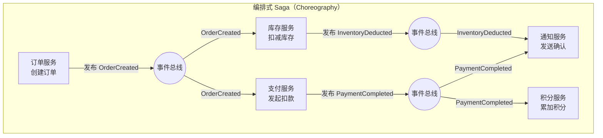
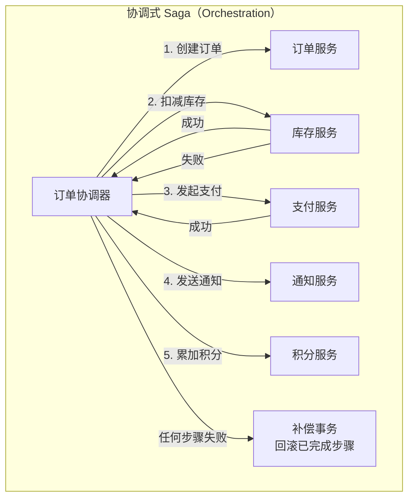
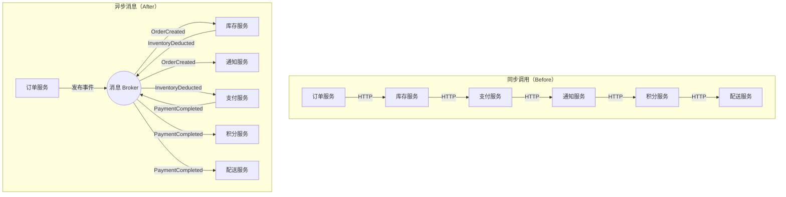

# 传菜窗口的智慧

> 从阿明的"前后厨大混乱"，看消息队列与异步架构的设计哲学

> **系列定位**：本篇是「阿明餐厅」系列的**正传 11**。在正传 1[《高峰保卫战》](./04-peak-traffic-defense.md)中，阿明学会了用队列削峰应对流量洪峰。但那只是消息队列的一个侧面 —— 当系统越来越复杂，服务间的"同步调用"开始拖垮一切时，阿明需要重新思考：**服务之间到底该怎么"说话"？** 如果你还没读过[前传](./02-system-architecture-evolution.md)，建议先看架构演进的全貌；如果你关心消息的可靠性保障，也可以结合[正传 9《差评危机》](./15-incident-response.md)中的故障应急策略一起阅读。

---

## 引言：当 20 个服务排成一列

阿明的餐厅已经不是当年的小面馆了。

经过[前传](./02-system-architecture-evolution.md)的架构演进、[正传 1](./04-peak-traffic-defense.md)的流量治理、[正传 8](./13-frontend-renovation.md)的前端翻新，系统从最初的 5 个服务扩展到了 20 个微服务。还记得[外卖大战](./16-performance-optimization.md)中那个让人揪心的 4.2 秒吗？现在我们来看更深层的原因 —— 一次下单要同步调用订单、库存、支付、通知、积分、配送 6 个服务，总耗时 4.2 秒。

某天，库存服务出现了一次 200ms 的抖动 —— 在平时这根本不算事。但这次不同：订单服务在等库存，支付在等订单，通知在等支付……整条链路全部超时。订单成功率从 99% 跌到 72%，客服电话被打爆，差评如潮。

老陈拿着故障报告，脸色铁青："阿明，你知道问题出在哪吗？同步调用就像服务员必须盯着厨师做完菜才能去接下一单 —— 一个环节卡住，整个餐厅都停了。"

阿明愣了愣："那传菜窗口呢？以前小面馆的时候，厨师做完菜往窗口一放，服务员有空了再来端，不用互相等啊。"

老陈眼睛一亮："对！我们需要的就是 —— **一个传菜窗口**。"

---

## 第一章：同步调用的七宗罪

阿明让老陈梳理了一下现有系统的调用链路，画出来像一碗意大利面 —— 20 个服务互相调用，你中有我，我中有你。

老陈在白板上列出了同步调用的"七宗罪"：

"你看，上次库存服务抖了 200ms，本来是个小问题。但订单服务在等它，支付服务在等订单服务，通知服务在等支付服务 —— 200ms 的抖动被放大成了 4.2 秒的全链路超时。这就是**级联故障**和**延迟叠加**的组合拳。"

| 罪状 | 餐厅类比 | 技术表现 | 后果 |
|------|----------|----------|------|
| 强耦合 | 服务员必须盯着厨师 | 调用方必须等待被调用方响应 | 一荣俱荣，一损俱损 |
| 延迟叠加 | 每道菜做完才能做下一道 | 6 个服务各 200ms = 总耗时 1.2s+ | 用户体验恶化 |
| 级联故障 | 一个厨师请假，所有菜停做 | 下游超时拖垮上游 | 雪崩效应 |
| 扩展性差 | 厨师和服务员必须 1:1 配对 | 无法独立扩缩容 | 资源浪费或瓶颈 |
| 重试风暴 | 服务员反复催问"好了没" | 超时后大量重试请求 | 下游被彻底压垮 |
| 事务边界模糊 | 谁负责退款？谁负责通知？ | 分布式事务难以保证一致性 | 数据不一致 |
| 调试困难 | 出了问题不知道是谁的锅 | 链路长、日志分散 | 排查耗时 |

老陈画了一张对比表：

| 维度 | 同步调用 | 异步消息 |
|------|----------|----------|
| 耦合度 | 高（调用方知道被调用方地址） | 低（通过 Broker 中转） |
| 延迟 | 请求-响应往返，延迟叠加 | 发完即走，延迟解耦 |
| 故障传播 | 下游故障直接传导到上游 | 下游故障不影响上游发送 |
| 扩展性 | 上下游必须同步扩容 | 各自独立扩缩容 |
| 吞吐量 | 受限于最慢的环节 | 受限于 Broker 的处理能力 |
| 数据一致性 | 容易实现强一致（但代价高） | 天然最终一致 |
| 调试 | 链路清晰但长 | 需要消息追踪能力 |
| 适用场景 | 实时查询、强一致操作 | 通知、事件驱动、后台处理 |

阿明听完沉默了一会儿："这么说，我们之前把所有东西都做成同步调用，就像让 20 个服务员排成一列，一个传一个 —— 中间任何一个走神，整条链就断了？"

老陈点头："没错。是时候装个传菜窗口了。"

> 💡 **金句**：同步调用不是错，但在微服务架构中，"默认同步"是架构债务的最大来源。

---

## 第二章：消息队列选型 —— 选哪个传菜窗口？

阿明决定引入消息队列，但市面上的选择太多了。老陈拉了一张对比表：

| 维度 | Kafka | RabbitMQ | RocketMQ | Pulsar |
|------|-------|----------|----------|--------|
| 定位 | 分布式流平台 | 传统消息中间件 | 金融级消息中间件 | 云原生流平台 |
| 吞吐量 | 百万级/秒 | 万级/秒 | 十万级/秒 | 百万级/秒 |
| 延迟 | 毫秒级（批量） | 微秒级 | 毫秒级 | 毫秒级 |
| 消息模型 | 发布-订阅（Topic + Partition） | 队列 + 发布-订阅（Exchange） | 发布-订阅 + 队列 | 发布-订阅（Topic + Partition） |
| 消息回溯 | ✅ 支持（基于 offset） | ❌ 不支持 | ✅ 支持 | ✅ 支持 |
| 顺序消息 | 分区内有序 | 单队列有序 | 分区内有序 | 分区内有序 |
| 事务消息 | ❌ 原生不支持 | ❌ 不支持 | ✅ 支持 | ❌ 不支持 |
| 死信队列 | 需自行实现 | ✅ 原生支持 | ✅ 支持 | ✅ 支持 |
| 运维复杂度 | 中（依赖 ZooKeeper/KRaft） | 低 | 中 | 高（三层架构） |
| 生态 | 极其丰富（Flink/Spark/ClickHouse） | 丰富（Spring AMQP） | 阿里生态 | 发展中 |
| 适用场景 | 日志流、事件流、大数据管道 | 业务消息、任务队列、延迟消息 | 金融交易、电商订单 | 多租户、大规模流处理 |

阿明问："那我们应该选哪个？"

老陈的回答很务实："**不是一种队列解决所有问题**。我们的场景分两类："

1. **日志流和事件流**（用户行为日志、系统指标采集、CDC 数据同步）—— 用 **Kafka**。它天生就是做这件事的，吞吐量高，支持消息回溯，生态极其丰富。
2. **业务消息**（下单通知、库存扣减、积分累加、配送调度）—— 用 **RabbitMQ**。它的路由模型灵活（Direct/Topic/Fanout/Headers），延迟低，死信队列原生支持，延迟消息（通过插件或死信队列 + TTL 实现），运维简单。

```yaml
# 阿明餐厅的消息队列分工
messaging:
  kafka:
    purpose: "事件流 & 日志流"
    topics:
      - user_behavior_log    # 用户行为日志
      - order_event_stream   # 订单事件流（分析用）
      - inventory_change_log  # 库存变更日志（CDC）
      - system_metrics        # 系统指标
    retention: 7d
    partitions: 12

  rabbitmq:
    purpose: "业务消息 & 任务队列"
    exchanges:
      - name: order_events
        type: topic
        bindings:
          - routing_key: "order.created"
            queue: inventory_deduct
          - routing_key: "order.created"
            queue: notification_send
          - routing_key: "order.paid"
            queue: points_credit
          - routing_key: "order.paid"
            queue: delivery_dispatch
    dead_letter:
      exchange: dlx_exchange
      queue: dead_letter_queue
```

> 💡 **金句**：消息队列选型不是"哪个最好"，而是"哪个最适合"。日志流选 Kafka，业务消息选 RabbitMQ，金融交易选 RocketMQ —— 各有所长。

---

## 第三章：消息可靠性三板斧 —— 消息不能丢！

阿明最担心的问题："消息发了，万一丢了怎么办？顾客付了钱，消息没到厨房，那不就出大事了？"

老陈竖起三根手指："消息可靠性，靠**三板斧**。"

### 第一板斧：生产端确认（Publisher Confirm）

生产者发消息到 Broker，Broker 收到后返回一个确认（ACK）。如果没收到确认，生产者重试。

```python
# RabbitMQ 生产端确认示例
import pika

connection = pika.BlockingConnection(pika.ConnectionParameters('localhost'))
channel = connection.channel()

# 开启 Publisher Confirms
channel.confirm_delivery()

try:
    channel.basic_publish(
        exchange='order_events',
        routing_key='order.created',
        body=json.dumps({
            'order_id': 'ORD-20260601-001',
            'amount': 128.5,
            'items': ['红烧牛肉面', '凉拌黄瓜'],
            'timestamp': '2026-06-01T12:00:00Z'
        }),
        properties=pika.BasicProperties(
            delivery_mode=2,       # 消息持久化
            message_id='msg-uuid-001',  # 唯一消息 ID（幂等用）
            content_type='application/json'
        ),
        mandatory=True  # 如果路由不到队列，返回给生产者
    )
    print("✅ 消息已确认送达 Broker")
except pika.exceptions.UnroutableError:
    print("❌ 消息无法路由到队列，需要处理退回")
except Exception as e:
    print(f"❌ 消息发送失败，需要重试: {e}")
```

### 第二板斧：Broker 持久化

消息到达 Broker 后，写入磁盘。即使 Broker 重启，消息也不会丢失。

```text
Broker 持久化配置：
├── Exchange 持久化：durable = true
├── Queue 持久化：durable = true
└── Message 持久化：delivery_mode = 2（持久化到磁盘）

注意：持久化 ≠ 不丢消息
  - 写入磁盘有延迟（毫秒级），在写入前 Broker 崩溃仍可能丢失
  - 解决方案：镜像队列（Classic Mirrored Queue）或 Quorum Queue
  - Quorum Queue 基于 Raft 协议，多数派写入成功后才返回 ACK
```

### 第三板斧：消费端手动 ACK

消费者处理完消息后，手动告诉 Broker："我处理完了，可以删除了。"如果消费者崩溃，Broker 会把消息重新投递给其他消费者。

以下为精简版伪代码，展示核心流程（完整版含连接管理、日志埋点等，见附录）：

```python
# RabbitMQ 消费端手动 ACK 示例（精简版）
def on_message(channel, method, properties, body):
    order = json.loads(body)

    try:
        if is_duplicate(properties.message_id):          # 1. 幂等检查
            channel.basic_ack(delivery_tag=method.delivery_tag)
            return

        process_order(order)                              # 2. 业务处理
        mark_as_processed(properties.message_id)          # 3. 标记已处理
        channel.basic_ack(delivery_tag=method.delivery_tag)  # 4. ACK

    except Exception:
        if retry_count(properties.message_id) < 3:       # 5. 失败重试
            channel.basic_nack(delivery_tag=method.delivery_tag, requeue=True)
        else:
            channel.basic_nack(delivery_tag=method.delivery_tag, requeue=False)  # 进死信队列

channel.basic_qos(prefetch_count=10)
channel.basic_consume(queue='inventory_deduct', on_message_callback=on_message)
```

### 死信队列（Dead Letter Queue）

处理失败的消息不能直接丢弃，而是发送到死信队列，由人工或自动化工具处理。

```text
消息生命周期：
  生产者 → Exchange → Queue → 消费者
                                ├── ✅ 处理成功 → ACK → 消息删除
                                ├── 🔄 处理失败 → NACK → 重新入队（重试 ≤ 3 次）
                                └── 💀 超过重试 → NACK(requeue=false) → Dead Letter Queue
                                                                          ↓
                                                                  人工处理 / 自动补偿
```

> 💡 **金句**：消息可靠性的本质是"三段式确认" —— 发送确认、存储持久化、消费确认。任何一段缺失，都可能丢消息。

---

## 第四章：消息模式实战 —— 怎么传话？

阿明的系统里有各种各样的"对话"场景：下单后通知库存扣减、支付成功后通知积分和配送、库存不足时通知订单取消。老陈说："不同的场景需要不同的消息模式。"

### 三种基本模式

| 模式 | 说明 | 餐厅类比 | 技术实现 |
|------|------|----------|----------|
| 发布/订阅（Pub/Sub） | 一条消息，多个消费者 | 厨房喊"3 号菜好了"，传菜员、质检员都听到 | Fanout Exchange / Topic |
| 点对点（P2P） | 一条消息，一个消费者 | 指定某个厨师做某道菜 | Direct Exchange / Queue |
| 请求/响应（Async RPC） | 发请求，等异步响应 | 服务员递单给厨师，厨师做完后按铃通知 | Reply Queue + Correlation ID |

### 事件驱动 vs 命令驱动

这是两种根本不同的设计哲学：

```text
命令驱动（Command-Driven）：
  "库存服务，请扣减 1 份红烧牛肉面"
  → 发送方知道接收方是谁，知道它该做什么
  → 本质是"远程过程调用"的异步版
  → 耦合度：中

事件驱动（Event-Driven）：
  "订单已创建（OrderCreated 事件）"
  → 发送方不知道谁会关心，只声明发生了什么
  → 下游服务自行决定要做什么
  → 耦合度：低
```

老陈建议阿明的系统以**事件驱动**为主："你想想，传菜窗口放了一盘菜，它不会喊'传菜员小张来端'，它只是放在那里，谁有空谁来端。这就是事件驱动。"

### Saga 编排式 vs 协调式

在[前传](./02-system-architecture-evolution.md)中，阿明接触过 Saga 的概念。现在要在消息架构中落地，老陈画了两种实现方式的对比：





| 维度 | 编排式（Choreography） | 协调式（Orchestration） |
|------|----------------------|----------------------|
| 控制方式 | 去中心化，每个服务自主响应事件 | 中心化，协调器控制流程 |
| 耦合度 | 低（服务间互不知道） | 中（协调器知道所有服务） |
| 可观测性 | 差（流程分散在各服务中） | 好（协调器掌握全局状态） |
| 复杂度 | 服务少时简单，服务多时混乱 | 服务多时更清晰 |
| 补偿事务 | 各服务自行处理 | 协调器统一调度 |
| 适用场景 | 3-4 个服务的简单流程 | 5+ 个服务的复杂业务 |

老陈的建议："我们的下单流程涉及 6 个服务，用**协调式 Saga** 更合适。流程清晰，补偿事务好管理。但如果只是简单的通知推送，用编排式就够了。"

> 💡 **金句**：命令驱动是"告诉别人怎么做"，事件驱动是"告诉世界发生了什么"。后者的扩展性远好于前者。

---

## 第五章：顺序消息与幂等消费 —— 先做哪个？

### 顺序消息：先扣库存还是先建订单？

阿明遇到了一个诡异问题：有时候订单创建成功了，但库存没扣；有时候库存扣了，订单却创建失败。

老陈分析："这是消息乱序导致的。在分布式系统中，消息的顺序不能天然保证。"

```text
正确顺序：
  1. 扣减库存（InventoryDeducted）
  2. 创建订单（OrderCreated）
  3. 发起支付（PaymentInitiated）

乱序情况：
  消费者 A 收到 OrderCreated（时刻 T1）
  消费者 B 收到 InventoryDeducted（时刻 T2 > T1）
  → 消费者 A 处理时发现库存还没扣，校验失败！
```

**分区有序 vs 全局有序**：

| 方式 | 说明 | 吞吐量 | 适用场景 |
|------|------|--------|----------|
| 全局有序 | 所有消息严格有序（单分区） | 低（单线程消费） | 金融交易、强顺序依赖 |
| 分区有序 | 同一分区内有序，不同分区无序 | 高（多分区并行） | 同一订单的消息有序即可 |
| 无序 | 不保证顺序 | 最高 | 通知类、日志类 |

阿明的场景是"同一订单的消息需要有序，不同订单之间不需要"。老陈的方案是：用 `order_id` 作为分区键，确保同一订单的所有消息进入同一个分区。

```python
# Kafka 分区键示例：同一订单的消息进入同一分区
from kafka import KafkaProducer

producer = KafkaProducer(
    bootstrap_servers=['kafka:9092'],
    key_serializer=lambda k: k.encode('utf-8'),
    value_serializer=lambda v: json.dumps(v).encode('utf-8')
)

order_id = 'ORD-20260601-001'

# 以下消息会进入同一分区，保证顺序
producer.send(
    topic='order_events',
    key=order_id,  # 分区键：同一 order_id → 同一分区
    value={'event': 'InventoryDeducted', 'order_id': order_id}
)
producer.send(
    topic='order_events',
    key=order_id,
    value={'event': 'OrderCreated', 'order_id': order_id}
)
producer.send(
    topic='order_events',
    key=order_id,
    value={'event': 'PaymentInitiated', 'order_id': order_id}
)
```

### 幂等消费：同一条消息可能被处理多次

在分布式系统中，消息**至少被投递一次**（At-Least-Once），意味着同一条消息可能被消费者处理多次（网络抖动、消费者重启、ACK 丢失）。如果不做幂等处理，就会出现重复扣款、重复发货等严重问题。

老陈给阿明展示了三种幂等消费的实现方式：

| 方式 | 原理 | 适用场景 | 优缺点 |
|------|------|----------|--------|
| 数据库唯一键 | `INSERT ... ON DUPLICATE KEY UPDATE` | 有数据库写入的场景 | 简单可靠，但依赖数据库 |
| Redis 去重窗口 | 用消息 ID 做 SETNX，设置过期时间 | 高并发、无数据库写入 | 快速，但有窗口期限制 |
| 状态机防重入 | 检查业务状态，已完成则跳过 | 有明确状态流转的场景 | 最灵活，但需设计状态机 |

```python
# 幂等消费实现：唯一消息 ID + Redis 去重 + 数据库兜底
import redis
import pymysql

redis_client = redis.Redis(host='redis', port=6379, decode_responses=True)
db = pymysql.connect(host='mysql', user='root', password='***', db='orders')

def consume_order_message(message):
    msg_id = message['message_id']
    order_id = message['order_id']

    # 第一层：Redis 去重（快速拦截重复消息）
    lock_key = f"msg:processing:{msg_id}"
    if not redis_client.set(lock_key, "1", nx=True, ex=3600):
        print(f"⏭️ Redis 拦截重复消息: {msg_id}")
        return

    # 第二层：数据库幂等检查（兜底，防止 Redis 过期后的重复）
    cursor = db.cursor()
    try:
        cursor.execute(
            "INSERT INTO processed_messages (message_id, order_id, status) "
            "VALUES (%s, %s, 'processing')",
            (msg_id, order_id)
        )
        db.commit()
    except pymysql.err.IntegrityError:
        # 唯一键冲突，说明已经处理过
        print(f"⏭️ 数据库拦截重复消息: {msg_id}")
        redis_client.delete(lock_key)
        return

    try:
        # 业务处理
        process_order(order_id, message)

        # 更新状态
        cursor.execute(
            "UPDATE processed_messages SET status = 'completed' WHERE message_id = %s",
            (msg_id,)
        )
        db.commit()
        print(f"✅ 消息处理完成: {msg_id}")

    except Exception as e:
        # 处理失败，回滚
        cursor.execute(
            "DELETE FROM processed_messages WHERE message_id = %s",
            (msg_id,)
        )
        db.commit()
        redis_client.delete(lock_key)
        raise e
```

> 💡 **金句**：在分布式消息系统中，"至少一次"是承诺，"恰好一次"是幻觉。幂等消费不是可选项，而是必选项。

---

## 第六章：可观测性与运维 —— 传菜窗口也要装监控

消息队列引入了新的中间层，也引入了新的运维挑战。阿明问老陈："传菜窗口装好了，但如果窗口堵了、菜放久了没人端，我怎么知道？"

老陈说："[厨房要装监控](./05-observability.md)，传菜窗口也要装。"

### 消息队列三大核心指标

```text
┌─────────────────────────────────────────────────────────┐
│               消息队列健康仪表盘                          │
├──────────────────┬──────────────────┬───────────────────┤
│  生产速率         │  消费速率         │  积压量            │
│  (Publish Rate)  │  (Consume Rate)  │  (Backlog Size)   │
│                  │                  │                   │
│  1200 msg/s ✅   │  1180 msg/s ⚠️   │  24000 msg 🔴     │
│  目标: ≥ 1000    │  目标: ≥ 生产速率  │  目标: ≤ 1000     │
│                  │                  │                   │
│  趋势: ↑ 稳定    │  趋势: ↓ 下降     │  趋势: ↑ 增长     │
│                  │                  │  → 消费跟不上！     │
└──────────────────┴──────────────────┴───────────────────┘
```

| 指标 | 说明 | 告警阈值 | 餐厅类比 |
|------|------|----------|----------|
| 生产速率 | 生产者每秒发送的消息数 | 突增 3 倍以上告警 | 下单速度 |
| 消费速率 | 消费者每秒处理的消息数 | 低于生产速率 80% 告警 | 做菜速度 |
| 积压量 | 队列中未被消费的消息数 | 超过 10000 条告警 | 传菜窗口堆了多少菜 |
| 消费延迟 | 消息从产生到被消费的时间差 | 超过 5 秒告警 | 菜放了多久没人端 |
| 死信数量 | 进入死信队列的消息数 | 超过 100 条/分钟告警 | 退回厨房的菜 |
| 消费者存活数 | 在线消费者实例数 | 低于预期数量告警 | 在岗服务员数 |

### 消息追踪：Trace ID 贯穿全链路

在[正传 2《厨房装监控》](./05-observability.md)中，阿明学会了用 Trace ID 串联一次请求的所有日志。消息队列场景下，Trace ID 需要**跟着消息走**。

```json
{
  "trace_id": "trace-abc-123",
  "span_id": "span-order-create",
  "parent_span_id": null,
  "message_id": "msg-uuid-001",
  "event": "OrderCreated",
  "timestamp": "2026-06-01T12:00:00.000Z",
  "service": "order-service",
  "metadata": {
    "order_id": "ORD-20260601-001",
    "amount": 128.5
  }
}
```

```text
消息追踪链路：
  [order-service] 创建订单
       │ trace_id: trace-abc-123
       ↓ 发送消息（携带 trace_id）
  [Broker] order_events 队列
       │
       ↓ 消费消息（提取 trace_id，继续追踪）
  [inventory-service] 扣减库存
       │ trace_id: trace-abc-123（同一个 trace！）
       ↓ 发送消息
  [Broker] inventory_events 队列
       │
       ↓
  [notification-service] 发送通知
       │ trace_id: trace-abc-123（仍然是同一个 trace！）
       ↓
  [Jaeger/Zipkin] 完整链路可视化
```

### 消息积压的应急处理

阿明有一次大促后，积压了 50 万条消息。老陈的应急方案：

```bash
# 1. 快速诊断：查看队列状态
rabbitmqctl list_queues name messages consumers consume_rate
# 输出：
# inventory_deduct    500000    3    120

# 2. 紧急扩容：增加消费者实例（从 3 个扩到 20 个）
kubectl scale deployment inventory-consumer --replicas=20

# 3. 如果消息有优先级：先处理高优先级消息
# 将 VIP 客户的订单路由到优先队列

# 4. 如果积压消息已过时（如过期促销）：批量丢弃
# 谨慎操作！需要业务确认
rabbitmqctl purge_queue expired_promotion_queue

# 5. 事后复盘：为什么会积压？
# - 消费速率不够？→ 优化消费逻辑 / 增加并行度
# - 生产速率突增？→ 限流 / 流量预判
# - 消费者宕机？→ 健康检查 / 自动重启
```

> 💡 **金句**：消息队列不是"装上就完事"。生产速率、消费速率、积压量 —— 这三个指标必须时刻盯着，它们就是传菜窗口的"温度计"。

---

## 核心总结：从同步到异步的架构跃迁



| 章节 | 核心问题 | 解决方案 | 关键技术 |
|------|----------|----------|----------|
| 第一章 | 同步调用的七宗罪 | 引入异步消息架构 | 同步 vs 异步对比 |
| 第二章 | 消息队列怎么选 | 按场景选型，混合使用 | Kafka + RabbitMQ |
| 第三章 | 消息不能丢 | 三段式可靠性保障 | 生产确认 + 持久化 + 手动 ACK |
| 第四章 | 消息怎么传 | 选对消息模式 | Pub/Sub + Saga 编排/协调 |
| 第五章 | 顺序和幂等 | 分区有序 + 幂等消费 | 分区键 + Redis 去重 + 唯一键 |
| 第六章 | 怎么运维 | 三大指标 + 消息追踪 | 积压监控 + Trace ID 贯穿 |

### 一句心法

**同步是默认选项，异步是架构选择。当你发现服务间"说太多话"时，该装个传菜窗口了。**

---

## 延伸阅读

- [架构是"长"出来的](./02-system-architecture-evolution.md) —— 异步消息架构的前提是系统已经从单体演进到微服务，理解架构演进的全貌
- [当餐厅长出大脑](./01-ai-agent-architecture.md) —— AI Agent 的工具调用本质上也是异步消息模式，Function Calling 和消息队列的设计哲学相通
- [高峰保卫战](./04-peak-traffic-defense.md) —— 消息队列削峰是流量治理的五道防线之一，本篇是它的深度展开
- [厨房装监控](./05-observability.md) —— 消息队列的可观测性需要融入整体的日志、指标、追踪体系
- [食安大检查](./06-security-architecture.md) —— 消息队列中的消息也需要加密和审计，防止敏感数据泄露
- [给产品经理的重构说明书](./03-refactoring-guide-for-pm.md) —— 从同步调用重构为异步消息，是典型的架构级重构决策
- [从厨师到 CEO](./07-from-chef-to-ceo.md) —— 消息驱动架构需要跨团队协作，平台工程（IDP）可以提供统一的消息基础设施
- [厨房质检员](./08-qa-testing-strategy.md) —— 异步消息的测试比同步调用更复杂，需要契约测试和集成测试的配合
- [从接单到出餐](./09-cicd-devops.md) —— 消息队列的配置（Topic、Queue、Exchange）也应该纳入 GitOps 管理
- [菜单设计学](./10-api-design.md) —— API 设计中的幂等性概念，与消息幂等消费一脉相承
- [学徒的困境](./11-ai-learning-paradox.md) —— AI 时代的学习方法论，理解异步架构的设计思维也是工程师的核心能力
- [数据厨房](./12-data-kitchen.md) —— 消息队列（尤其是 Kafka）是数据管道的核心组件，与 ETL 和数据仓库紧密关联
- [前厅翻修记](./13-frontend-renovation.md) —— 前端的状态管理和事件总线，与后端的消息队列设计哲学相通
- [阿明的省钱经](./14-cloud-finops.md) —— 消息队列的成本优化：合理选择实例规格、消息保留策略、冷热分层
- [差评危机](./15-incident-response.md) —— 消息积压是常见故障场景，应急预案和快速止血策略在这里详解
- [外卖大战](./16-performance-optimization.md) —— 消息队列的性能优化：批量发送、压缩、分区策略，是全链路优化的一环
- [十家店的烦恼](./18-distributed-puzzles.md) —— 消息队列解决了服务间通信，但引出了分布式一致性难题：CAP、分布式锁、最终一致性
- [阿明的加盟帝国](./19-saas-multitenant.md) —— 多租户资源隔离需要消息队列做租户级别限流和配额管理
- [厨房实况直播](./20-realtime-eventdriven.md) —— 消息队列是事件驱动架构的基础设施，事件流处理的底层依赖
- [一个厨房，四个门面](./21-multiplatform-architecture.md) —— BFF 层通过消息队列与后端服务异步通信，解耦多端适配
- [懂你的菜单](./22-search-recommendation.md) —— 推荐系统的用户行为日志通过 Kafka 实时采集，消息队列是数据管道
- [菜谱标准化之路](./23-tech-docs-knowledge.md) —— 消息队列的架构决策（选型、Topic 设计）应该记录为 ADR
- [仓库搬家不停业](./24-database-migration.md) —— 数据库迁移中的双写方案本质上是一种异步消息传递模式
- [预制菜还是现炒](./25-lowcode-platform.md) —— 低代码平台的组件间通信可以通过事件总线（轻量消息队列）实现
- [阿明出海记](./26-globalization.md) —— 跨区域数据同步需要 Kafka 跨区域复制，消息队列是多区域架构的纽带
- [厨房大换岗](./27-ai-org-transformation.md) —— AI 转型中的消息传递模式变化，人机协同需要新的异步机制
- [阿明的二次创业](./28-ai-native-startup.md) —— AI 原生创业中的异步架构选择，消息队列支撑 AI 系统扩展性
- [会自我进化的厨房](./29-self-evolving-company.md) —— Agent Loop 中的异步消息传递，Agent 之间通过消息总线协同
- [AI 的"黑暗料理"](./30-ai-hallucination-safety.md) —— AI 输出的异步校验，消息队列可用于 AI 结果的延迟审核

---

## 结语

阿明的"传菜窗口"，本质上是在解决一个古老的问题：**当多个角色需要协作时，如何让他们高效地沟通而不用互相等待？**

从同步调用到异步消息，从强耦合到事件驱动，从"服务员盯着厨师"到"传菜窗口自主流转" —— 这不是技术的升级，而是**思维方式的转变**。阿明站在传菜窗口前，看着一盘盘菜有序地端出厨房，服务员各取所需，不再互相等待。他笑了笑："原来好的架构，就像一个好的传菜窗口 —— 你感觉不到它的存在，但一切都在顺畅地运转。"

下次当你设计微服务间的通信时，不妨问自己：

- 这个调用真的需要同步等待吗？还是可以用消息异步解耦？
- 如果下游服务挂了，上游会怎样？有没有级联故障的风险？
- 消息丢了、重复了、乱序了，我的系统能正确处理吗？
- 消息积压了 10 万条，我有应急预案吗？
- 我能不能在 5 分钟内定位一条消息从发送到消费的完整链路？

> 好的消息架构，不是让服务"不说话"，而是让它们"说对的话、在对的时间、用对的方式"。

← [返回系列导读](./index.md)
