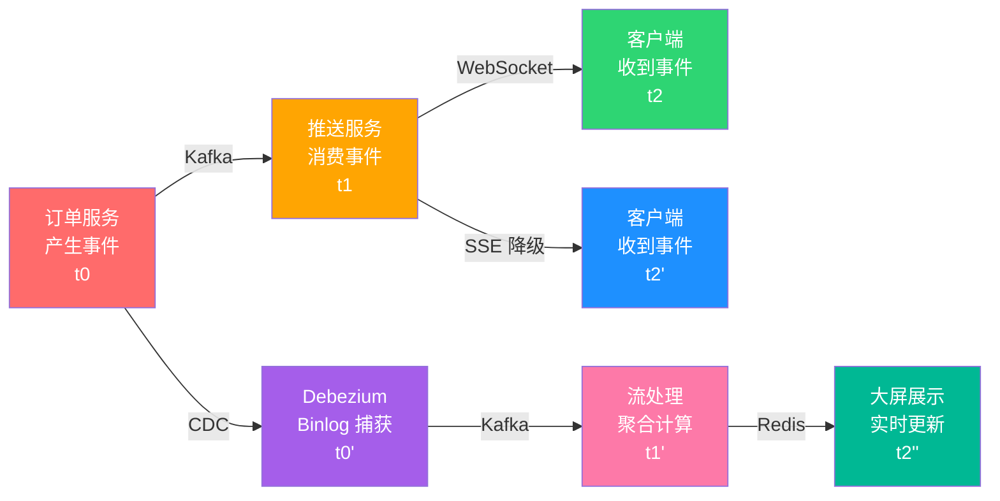
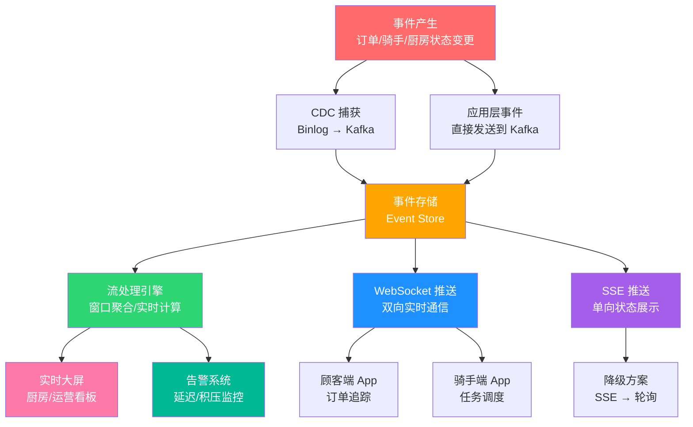

# 厨房实况直播

> 从阿明的"外卖骑手追踪系统"，看实时系统与事件驱动架构

> **系列定位**：本篇是「阿明餐厅」系列的**正传 13**。在正传 11[《传菜窗口的智慧》](./17-async-messaging.md)中，阿明学会了用消息队列解耦服务。但消息队列解决的是"异步传递"，还有一个更刺激的需求 —— **实时**。当顾客问"我的外卖到哪了"、老板问"现在哪个灶台空闲"，你需要的不只是消息队列，而是一个实时事件流。

---

## 引言：每 10 秒一次的夺命连环问

阿明上线了外卖业务，第一周就收到了大量投诉。

投诉的不是菜不好吃，而是 —— **"我的外卖到哪了？"**

顾客下单后，看不到厨房有没有开始做，看不到骑手有没有取餐，只能干等。更让人焦虑的是，页面上的状态永远是"商家处理中"，到底处理到哪一步了？没人知道。

竞争对手已经做到了实时追踪骑手位置、预计送达时间、厨房出餐进度，顾客像看直播一样看着自己的外卖一步步靠近。

阿明的系统还在用"轮询"—— 顾客的手机 App 每 10 秒向服务器发一次请求："我的订单好了吗？""我的订单好了吗？""我的订单好了吗？"

午高峰 3000 个在线用户，每 10 秒轮询一次，意味着每秒 300 次请求打到服务器上。服务器被刷崩了三次。

老陈叹了口气："轮询就像每 10 秒打电话问一次'好了没'。**我们需要的是一有进展就主动通知，而不是被 3000 个人同时追问。**"

阿明终于意识到：**实时不是"更快地轮询"，而是"从被动应答到主动推送"的思维革命。**

---

## 第一章：实时通信的四种方式

阿明问老陈："不用轮询，那用什么？"

老陈拿出了一张对比表，把四种实时通信方式摆在一起：

| 通信方式 | 原理 | 延迟 | 资源消耗 | 复杂度 | 适用场景 | 餐厅类比 |
|----------|------|------|----------|--------|----------|----------|
| 短轮询（Short Polling） | 客户端定时发请求问"有变化吗？" | 高（取决于轮询间隔） | 高（大量无效请求） | 低 | 简单场景、低频查询 | 每 10 秒跑去厨房问一次 |
| 长轮询（Long Polling） | 服务端收到请求后不立刻返回，等有新数据再响应 | 中 | 中（连接占用） | 中 | 兼容性要求高的场景 | 站在厨房门口等，有菜了再端走 |
| SSE（Server-Sent Events） | 服务端单向推送事件流到客户端 | 低 | 低 | 中 | 单向通知（状态推送、大屏展示） | 厨房装了喇叭，做好一道菜喊一声 |
| WebSocket | 全双工通信，服务端和客户端可以互相发消息 | 极低 | 低 | 高 | 双向交互（聊天、实时协作、追踪） | 厨房和大厅之间装了对讲机 |

```text
四种方式的通信模型：

短轮询：
  Client → "有新消息吗？" → Server → "没有"
  Client → "有新消息吗？" → Server → "没有"
  Client → "有新消息吗？" → Server → "有！给你"
  （大量无效请求，但实现最简单）

长轮询：
  Client → "有新消息吗？" → Server（hold 住连接，等待...）→ "有！给你"
  Client → "有新消息吗？" → Server（hold 住连接，等待...）
  （减少了无效请求，但连接一直被占用）

SSE：
  Client → "我订阅了，有事告诉我"
  Server → "事件1：订单已接单"
  Server → "事件2：厨师开始做菜"
  Server → "事件3：菜品已出餐"
  （单向推送，客户端只能接收，不能发送）

WebSocket：
  Client ←→ Server（全双工，随时互相发消息）
  Client → "我追踪订单 #12345"
  Server → "骑手已到达餐厅"
  Client → "我修改了收货地址"
  Server → "已更新，骑手收到新地址"
  （双向通信，最灵活，但最复杂）
```

阿明做了选择：

- **骑手追踪** → WebSocket：顾客和骑手双向交互（顾客能看到骑手位置，骑手能收到顾客的新指令）
- **厨房大屏** → SSE：大屏只需要接收厨房的状态推送，不需要回发消息
- **订单状态查询（低频）** → 长轮询：兼容老版本 App，作为 WebSocket 的降级方案

**实时通信的核心是"选对方式比追求最新技术更重要"。**

---

## 第二章：事件驱动架构（EDA）

搞定了通信方式，老陈提出了一个更根本的问题："骑手追踪只是表象。更深层的问题是 —— **你的系统不是事件驱动的**。"

阿明不解："什么意思？"

老陈解释："现在你的系统是'命令式'的。顾客下单，系统执行一个命令：创建订单、扣减库存、通知厨房。但这一切都是同步调用的，一环扣一环。**任何一个环节出问题，整条链路都断了。**"

"而事件驱动架构（EDA）的思路完全不同 —— **每个服务只做自己的事，做完后发一个'事件'出去，谁关心谁订阅。**"

老陈首先区分了三个容易混淆的概念：

| 概念 | 定义 | 时态 | 餐厅类比 |
|------|------|------|----------|
| 命令（Command） | "请做某件事" | 面向未来 | "请炒一份宫保鸡丁" |
| 事件（Event） | "某件事已经发生了" | 面向过去 | "宫保鸡丁已经出锅了" |
| 消息（Message） | 传递信息的载体 | 通用 | 传菜窗口递出去的纸条 |

事件驱动架构的核心是**事件**。事件是"已经发生的事实"，不可变、不可撤销。

老陈进一步引入了**事件溯源（Event Sourcing）** 的概念：

```text
传统做法（存"当前状态"）：
  订单 #12345 的当前状态：已出餐

事件溯源（存"所有发生过的事"）：
  10:01  事件：顾客下单（菜品：宫保鸡丁 × 1）
  10:02  事件：订单已确认（接单员：小张）
  10:03  事件：厨房已接单（厨师：张师傅）
  10:08  事件：菜品已开始制作
  10:12  事件：菜品已出餐
  10:13  事件：骑手已取餐（骑手：小陈）
  10:25  事件：骑手已送达

  → 当前状态可以通过回放所有事件计算得出
  → 任何时刻的历史状态都可以精确还原
  → 不存在"数据被覆盖"的问题
```

老陈用了一个类比："传统做法就像只记住'这桌点了红烧肉'。事件溯源就像记住'10:01 顾客坐下 → 10:03 点菜 → 10:05 下单 → 10:12 出餐 → 10:15 上桌'。**前者是快照，后者是录像。**"

与事件溯源配套的是 **CQRS（Command Query Responsibility Segregation，命令查询职责分离）**：

```mermaid
graph LR
    subgraph 写端（Command）
        A["命令处理器<br/>接收命令 → 产生事件"] --> B["事件存储<br/>Event Store"]
    end
    subgraph 读端（Query）
        B --> C["事件消费者<br/>投影到读模型"]
        C --> D["读数据库<br/>查询优化的视图"]
    end
    D --> E["查询接口<br/>快速响应读请求"]
    style A fill:#ff6b6b,color:#fff
    style B fill:#ffa502,color:#fff
    style C fill:#2ed573,color:#fff
    style D fill:#1e90ff,color:#fff
    style E fill:#a55eea,color:#fff
```

写操作走事件流（保证一致性），读操作走投影视图（保证性能）。两者解耦，互不影响。

详见[《传菜窗口的智慧》](./17-async-messaging.md)中的消息队列 —— 事件驱动是消息队列的进阶形态，从"传递消息"升级到"记录事实"。

**事件驱动的核心是"不要告诉别人该做什么，而是告诉别人发生了什么"。**

---

## 第三章：CDC —— 数据变更捕获

理论讲完了，阿明问了一个现实问题："我现有的系统不是事件驱动的，所有数据都直接写 MySQL。难道要全部重写？"

老陈笑了："不用。**有一种技术可以在不改动现有代码的情况下，把数据库的每一次变更都变成事件。**"

这个技术叫 **CDC（Change Data Capture，变更数据捕获）**。

原理是监听数据库的 **Binlog**（二进制日志）。MySQL 每次写操作（INSERT / UPDATE / DELETE）都会记录 Binlog，原本是给主从同步用的。CDC 工具把自己伪装成一个 MySQL 从库，订阅 Binlog，把数据变更实时转发到消息队列。

用餐厅的话说，CDC 就像在厨房门口安排了一位**专职记录员** —— 厨师每做一步（接单、备料、出餐），他就原原本本地抄录在日志本上，然后通过对讲机实时汇报给前台。这位记录员不是偷偷摸摸的窃听者，而是餐厅正式编制的工作人员，光明正大、一字不落地记录厨房里发生的每一件事。

```text
CDC 工作流程：

  MySQL 写入 → Binlog 记录变更 → CDC 工具（Canal/Debezium）捕获
       → 转换为事件格式 → 发送到 Kafka
       → 下游消费者订阅处理

示例：
  1. 顾客下单，订单服务写入 MySQL：INSERT INTO orders (id, status) VALUES (12345, 'created')
  2. MySQL Binlog 记录了这次 INSERT
  3. Debezium 捕获 Binlog，转换为事件：
     {"table": "orders", "op": "INSERT", "data": {"id": 12345, "status": "created"}}
  4. 事件发送到 Kafka Topic：orders-changes
  5. 骑手服务订阅 orders-changes，收到事件后立刻通知骑手取餐
```

阿明问："这和直接在代码里写'下单后发消息到 Kafka'有什么区别？"

老陈画了一张对比表：

| 对比维度 | 应用层双写 | CDC（Binlog 捕获） |
|----------|------------|-------------------|
| 侵入性 | 需要改业务代码 | 零侵入，不需要改一行代码 |
| 一致性 | 可能不一致（DB 写成功但消息发送失败） | 保证一致（从 Binlog 读，和 DB 完全同步） |
| 顺序保证 | 难以保证 | Binlog 天然有序 |
| 遗漏风险 | 异常路径可能漏发消息 | 不会遗漏，Binlog 记录所有变更 |
| 维护成本 | 每个服务都要加发消息的逻辑 | 统一配置，一处接入 |
| 延迟 | 极低（同步发送） | 低（毫秒级，Binlog 解析有少许延迟） |

阿明选了 **Debezium + Kafka Connect** 的方案。配置完成后，订单表的每一次变更都自动变成事件流，骑手端在订单创建后 200 毫秒内就能收到通知。

```yaml
# Debezium MySQL Connector 配置示例
name: orders-connector
config:
  connector.class: io.debezium.connector.mysql.MySqlConnector
  database.hostname: mysql-primary
  database.port: 3306
  database.user: debezium
  database.password: ${DB_PASSWORD}
  database.server.id: 1
  database.server.name: aming-orders
  database.include.list: aming_db
  table.include.list: aming_db.orders
  topic.prefix: cdc
  # 只关注 orders 表的变更
  # 自动将 INSERT/UPDATE/DELETE 转换为 Kafka 事件
```

老陈提醒："CDC 虽然好用，但有一个注意点 —— **Schema 变更要小心**。如果你改了表结构（比如加了一个字段），Debezium 需要重新解析 Schema，可能会短暂中断。生产环境建议用 Schema Registry 管理。"

详见[《仓库搬家不停业》](./24-database-migration.md)中的数据迁移 —— CDC 不仅是实时系统的利器，也是数据库迁移时保持数据同步的核心工具。

**CDC 的核心是"不改代码也能让数据流动起来，Binlog 是数据库送给实时系统的礼物"。**

---

## 第四章：实时流处理

事件流接好了，但阿明发现一个新问题：**原始事件太多了，人看不过来。**

每秒产生 200 个事件（订单创建、状态变更、骑手移动、库存变化……），一天 1700 万个事件。阿明不可能一条条看，他需要的是**实时聚合后的洞察**：

- 过去 5 分钟的平均出餐时间是多少？
- 当前有多少订单等待超过 10 分钟？
- 哪个灶台的效率最高？哪个最慢？
- 今天的订单量趋势和昨天同时段比怎么样？

老陈引入了**实时流处理（Stream Processing）**。

流处理的核心概念是**窗口（Window）**—— 把无限的事件流切成有限的时间段，然后在每个窗口内做聚合计算：

```text
三种窗口类型：

滚动窗口（Tumbling Window）：固定长度，不重叠
  |--- 5 分钟 ---|--- 5 分钟 ---|--- 5 分钟 ---|
  [事件1,事件2,事件3] [事件4,事件5] [事件6,事件7,事件8]
  → 每 5 分钟计算一次"过去 5 分钟的订单量"

滑动窗口（Sliding Window）：固定长度，有重叠
  |--- 5 分钟 ---|
        |--- 5 分钟 ---|
              |--- 5 分钟 ---|
  → 每 1 分钟滑动一次，计算"过去 5 分钟的订单量"
  → 更平滑，能看到趋势变化

会话窗口（Session Window）：按活动间隔切分
  [事件1][事件2]    [事件3][事件4][事件5]
  ← 会话1（间隔<30s）→ ← 会话2（间隔<30s）→
  → 适合用户行为分析（"一次点餐会话"）
```

老陈选了 **Kafka Streams**（轻量级，不需要额外集群）来做实时计算。一段关键代码：

```python
# 流处理逻辑伪代码（实际 Kafka Streams 需用 Java 实现）
# 展示流处理思路

class WaitingOrdersProcessor:
    """
    实时统计：当前有多少订单从"已接单"到"已出餐"超过 10 分钟
    """

    def process(self, event):
        if event["type"] == "order_accepted":
            # 记录接单时间
            self.state_store.put(
                key=event["order_id"],
                value={"accepted_at": event["timestamp"]}
            )

        elif event["type"] == "order_ready":
            # 计算出餐等待时间
            accepted = self.state_store.get(event["order_id"])
            if accepted:
                wait_minutes = (
                    event["timestamp"] - accepted["accepted_at"]
                ) / 60

                if wait_minutes > 10:
                    # 超过 10 分钟，触发告警
                    self.alert_service.send(
                        level="warning",
                        message=f"订单 {event['order_id']} 等待了 {wait_minutes:.1f} 分钟",
                    )
                    self.metrics.increment("orders.waiting_over_10min")

                self.state_store.delete(event["order_id"])
```

在技术选型上，老陈比较了两个主流方案：

| 对比维度 | Kafka Streams | Apache Flink |
|----------|---------------|--------------|
| 部署方式 | 嵌入式（随应用部署） | 独立集群 |
| 资源开销 | 低 | 高 |
| 状态管理 | 本地 RocksDB | 分布式 Checkpoint |
| 精确一次语义 | 支持 | 支持 |
| 时间语义 | 事件时间 + 处理时间 | 事件时间 + 处理时间 + 水位线 |
| 适用规模 | 中小规模 | 大规模 |
| 学习曲线 | 低（Java/Scala 库） | 高（独立框架） |

阿明当前规模用 Kafka Streams 足够。等日订单量突破 100 万时，再考虑升级到 Flink。

详见[《厨房装监控》](./05-observability.md)中的指标聚合 —— 流处理本质上是对实时指标的计算引擎，和监控系统的指标采集理念一脉相承。

**流处理的核心是"把无限的事件流切成有限的窗口，在窗口里算出业务需要的洞察"。**

---

## 第五章：WebSocket 实战

通信方式选了 WebSocket，但真正用起来，老陈发现坑比想象中多。

第一个问题：**连接管理**。

WebSocket 是长连接，一旦建立就保持。但网络不稳定时，连接会断。断了之后怎么办？

```python
# WebSocket 连接管理 —— 心跳 + 自动重连
class WebSocketClient:
    def __init__(self, url, order_id):
        self.url = url
        self.order_id = order_id
        self.ws = None
        self.reconnect_attempts = 0
        self.max_reconnect = 5

    def connect(self):
        self.ws = websocket.connect(self.url)
        self.reconnect_attempts = 0
        # 订阅特定订单的状态变更
        self.ws.send(json.dumps({
            "action": "subscribe",
            "channel": f"order:{self.order_id}"
        }))
        # 启动心跳（每 30 秒一次）
        self.start_heartbeat(interval=30)

    def on_disconnect(self):
        # 指数退避重连：1s → 2s → 4s → 8s → 16s
        delay = min(2 ** self.reconnect_attempts, 30)
        self.reconnect_attempts += 1
        if self.reconnect_attempts <= self.max_reconnect:
            sleep(delay)
            self.connect()
        else:
            # 重连失败，降级为 SSE
            self.fallback_to_sse()

    def fallback_to_sse(self):
        # WebSocket 降级为 SSE（单向推送）
        sse_client = SSEClient(f"/api/orders/{self.order_id}/events")
        sse_client.subscribe()

    def fallback_to_polling(self):
        # SSE 也失败，最终降级为轮询
        while True:
            status = http_get(f"/api/orders/{self.order_id}/status")
            self.update_ui(status)
            sleep(10)  # 每 10 秒轮询一次
```

老陈设计了**三级降级策略**：WebSocket → SSE → 长轮询。保证在任何网络环境下，用户都能看到订单状态，只是实时程度不同。

第二个问题：**水平扩展**。

一台服务器最多维持约 5 万个 WebSocket 连接。阿明午高峰有 3 万个在线用户，一台服务器勉强够用。但如果业务翻倍呢？多台服务器时，一个 WebSocket 连接在服务器 A 上，但订单事件可能被服务器 B 处理 —— 消息怎么送达？

```text
水平扩展的消息路由：

用户 A 的 WebSocket 连接在 Server 1
用户 B 的 WebSocket 连接在 Server 2

订单 #12345 的状态变更事件产生 → 发送到 Redis Pub/Sub 或 Kafka
  → Server 1 收到事件，检查：用户 A 在追踪订单 #12345 吗？是的 → 推送
  → Server 2 收到事件，检查：用户 B 在追踪订单 #12345 吗？不是 → 忽略

关键设计：
  1. 每个 Server 维护本地连接表：{order_id → [ws_connection_1, ws_connection_2]}
  2. 事件通过 Redis Pub/Sub 广播到所有 Server
  3. 每个 Server 只推送给自己管理的、相关订单的连接
```

```python
# WebSocket 服务器端的房间/频道模型
class WebSocketServer:
    def __init__(self):
        # 本地连接表：channel → [connections]
        self.rooms = defaultdict(list)

    def on_connect(self, ws, channel):
        self.rooms[channel].append(ws)
        # 同时注册到 Redis，让其他 Server 知道这个连接在这里
        self.redis.sadd(f"ws:room:{channel}", self.server_id)

    def on_disconnect(self, ws, channel):
        self.rooms[channel].remove(ws)

    def on_event(self, event):
        # 从 Redis Pub/Sub 收到事件
        channel = event["channel"]  # 如 "order:12345"
        # 只推送给本地关注这个 channel 的连接
        for ws in self.rooms.get(channel, []):
            ws.send(json.dumps(event))

    # Redis Pub/Sub 订阅所有频道的事件
    def subscribe_to_events(self):
        pubsub = self.redis.pubsub()
        pubsub.subscribe("order_events")
        for message in pubsub.listen():
            self.on_event(json.loads(message["data"]))
```

老陈还做了一个细节优化：**连接数监控**。每个 Server 实时上报自己管理的 WebSocket 连接数到 Prometheus，运维可以看到连接在各节点上的分布是否均匀。

详见[《高峰保卫战》](./04-peak-traffic-defense.md)中的弹性伸缩 —— WebSocket 是有状态服务，扩容时需要配合 Redis Pub/Sub 做消息路由，不能简单加机器。

**WebSocket 实战的核心是"连接是脆弱的，要做好心跳、重连、降级三道保险"。**

---

## 第六章：实时系统的可观测性

系统上线一个月后，阿明收到一条差评："说好的实时追踪，我等了 3 分钟状态都没更新。"

老陈一查，发现问题出在**事件延迟** —— 从"骑手取餐"事件产生，到顾客手机上显示"骑手已取餐"，中间延迟了 180 秒。

"3 分钟？那还叫什么实时？"阿明很不满。

老陈解释："实时系统比普通系统更需要可观测性。**因为延迟是隐形的，不像报错那样明显。** 你不监控，就不知道延迟已经悄悄涨到了 3 分钟。"

他设计了三个维度的可观测性：

**第一维：事件延迟监控**

```text
事件延迟追踪（每个事件记录时间戳）：

  事件产生时间（t0）：10:15:03.200  — 骑手点击"已取餐"
  事件入队时间（t1）：10:15:03.450  — 写入 Kafka（延迟 250ms）
  事件消费时间（t2）：10:15:04.100  — 推送服务消费（延迟 650ms）
  事件推送时间（t3）：10:15:04.350  — WebSocket 推送（延迟 250ms）
  端到端延迟（t3 - t0）：1.15 秒 ✅（正常）

  异常案例：
  事件产生时间（t0）：10:30:01.000
  事件入队时间（t1）：10:30:01.200  — 正常
  事件消费时间（t2）：10:33:00.500  — ⚠️ 延迟 3 分钟！
  事件推送时间（t3）：10:33:01.100

  根因：推送服务的消费者积压了 5000 条消息（消费者处理能力不足）
```

老陈给每个事件加了一个 `trace_id`，串联从产生到消费的完整链路。这和[《厨房装监控》](./05-observability.md)中的分布式追踪是同一个思路 —— 只不过追踪的对象从"HTTP 请求"变成了"事件"。

**第二维：端到端追踪**



**第三维：背压（Backpressure）处理**

当生产者（事件源）的速度超过消费者（推送服务）的处理能力时，消息会积压。这就是**背压问题**。

老陈设计了三种应对策略：

| 策略 | 做法 | 优点 | 缺点 | 适用场景 | 餐厅类比 |
|------|------|------|------|----------|----------|
| 缓冲（Buffer） | 消息暂存在队列中，消费者按自己速度处理 | 不丢消息 | 延迟增加，内存压力大 | 短暂峰值 | 菜品先放在传菜台等着 |
| 丢弃（Drop） | 丢弃低优先级的旧消息 | 保持低延迟 | 可能丢失信息 | 高频但不重要的数据 | 过期的叫号直接跳过 |
| 限流（Throttle） | 限制生产者的发送速度 | 系统稳定 | 上游被降速 | 可以容忍上游延迟 | 排队叫号，控制入场速度 |

```python
# 背压处理示例 —— 动态调整消费者并发数
class AdaptiveConsumer:
    def __init__(self, max_concurrency=10):
        self.max_concurrency = max_concurrency
        self.current_concurrency = 5
        self.lag_threshold = 1000  # 积压超过 1000 条告警

    def process_batch(self, messages):
        current_lag = self.get_consumer_lag()

        if current_lag > self.lag_threshold * 5:
            # 严重积压：扩容消费者 + 告警
            self.scale_up(target=self.max_concurrency)
            self.alert("critical", f"事件积压 {current_lag} 条，已扩容至 {self.max_concurrency} 并发")

        elif current_lag > self.lag_threshold:
            # 轻度积压：逐步扩容
            new_concurrency = min(self.current_concurrency + 2, self.max_concurrency)
            self.scale_up(target=new_concurrency)

        elif current_lag < self.lag_threshold // 10:
            # 积压消除：逐步缩容，节省资源
            new_concurrency = max(self.current_concurrency - 1, 2)
            self.scale_down(target=new_concurrency)

        # 正常消费
        self.consume_parallel(messages, concurrency=self.current_concurrency)
```

老陈总结了三条监控铁律：

1. **每个事件必须带时间戳**，端到端延迟 = 消费时间 - 产生时间
2. **消费者积压量必须告警**，积压超过阈值说明消费能力不足
3. **WebSocket 连接数必须监控**，连接数异常暴增可能是 DDoS 或 Bug

详见[《厨房装监控》](./05-observability.md)中的可观测性三大支柱 —— 日志、指标、追踪在实时系统中同样适用，只是追踪的对象从 HTTP 请求变成了事件流。

**实时系统可观测性的核心是"延迟是隐形的敌人，不监控就不知道已经输了"。**

---

## 核心总结：实时系统与事件驱动架构



| 章节 | 核心问题 | 餐厅类比 | 技术实现 |
|------|----------|----------|----------|
| 实时通信 | 用什么方式推送？ | 电话/喇叭/对讲机 | 轮询/SSE/WebSocket |
| 事件驱动 | 系统架构怎么设计？ | 录像 vs 快照 | EDA + Event Sourcing + CQRS |
| CDC | 现有系统怎么接入？ | 厨房门口的记录员 | Debezium + Binlog + Kafka |
| 流处理 | 海量事件怎么聚合？ | 窗口里的流水账 | 窗口计算 + Kafka Streams/Flink |
| WebSocket | 长连接怎么管理？ | 对讲机的电池和信号 | 心跳/重连/降级/水平扩展 |
| 可观测性 | 延迟怎么监控？ | 秒表计时 | 事件延迟追踪 + 背压告警 |

### 一句心法

**好的实时系统，让用户感受不到"等待"的存在 —— 不是数据传得最快，而是用户在需要的那一刻就已经知道了。**

---

## 延伸阅读

- [当餐厅长出大脑](./01-ai-agent-architecture.md) —— AI Agent 的全景拆解，实时事件流可以作为 AI Agent 的感知输入源
- [架构是"长"出来的](./02-system-architecture-evolution.md) —— 从单机到云原生的架构演进，事件驱动是架构成熟后的自然升级
- [给产品经理的重构说明书](./03-refactoring-guide-for-pm.md) —— 从同步架构迁移到事件驱动是一次大重构，需要产品经理理解技术价值
- [高峰保卫战](./04-peak-traffic-defense.md) —— WebSocket 连接的弹性伸缩和限流策略，与流量治理一脉相承
- [厨房装监控](./05-observability.md) —— 可观测性的三大支柱（日志/指标/追踪）在实时系统中同样关键
- [食安大检查](./06-security-architecture.md) —— WebSocket 连接的安全认证和加密传输，防止事件流被窃听
- [从厨师到 CEO](./07-from-chef-to-ceo.md) —— 实时系统需要跨团队协作，事件驱动的思维方式需要全组织推广
- [厨房质检员](./08-qa-testing-strategy.md) —— 事件驱动系统的测试策略，如何测试异步事件的正确性和顺序
- [从接单到出餐](./09-cicd-devops.md) —— 事件驱动系统的 CI/CD 挑战，Event Schema 的变更管理
- [菜单设计学](./10-api-design.md) —— WebSocket 的消息协议设计，和 REST API 设计同样重要
- [学徒的困境](./11-ai-learning-paradox.md) —— AI 时代的人机协作与学习之道，当 AI 越来越强，人还要不要练基本功
- [数据厨房](./12-data-kitchen.md) —— 事件流是数据管道的实时版本，ETL 是批处理，CDC 是流处理
- [前厅翻修记](./13-frontend-renovation.md) —— 前端如何消费实时事件流，WebSocket 客户端的状态管理
- [阿明的省钱经](./14-cloud-finops.md) —— WebSocket 连接和流处理的资源成本，实时系统的 FinOps
- [差评危机](./15-incident-response.md) —— 实时系统的故障响应，事件积压和连接风暴的应急处理
- [外卖大战](./16-performance-optimization.md) —— 实时系统的性能优化，降低端到端延迟的全链路方法
- [传菜窗口的智慧](./17-async-messaging.md) —— 消息队列是事件驱动的基础，从异步消息到事件溯源的进阶
- [十家店的烦恼](./18-distributed-puzzles.md) —— 分布式系统的一致性问题，事件溯源和最终一致性的关系
- [阿明的加盟帝国](./19-saas-multitenant.md) —— 多租户场景下的实时系统，需要按租户隔离 WebSocket 连接和事件流
- [一个厨房，四个门面](./21-multiplatform-architecture.md) —— 多平台架构中实时通信的统一事件总线设计
- [懂你的菜单](./22-search-recommendation.md) —— 实时事件流驱动推荐系统的实时更新
- [菜谱标准化之路](./23-tech-docs-knowledge.md) —— 事件驱动架构的技术文档，帮助团队理解 EDA 的设计范式
- [仓库搬家不停业](./24-database-migration.md) —— CDC 在数据库迁移中的应用，实现零停机的数据同步
- [预制菜还是现炒](./25-lowcode-platform.md) —— 低代码平台如何支持事件驱动的编排和工作流
- [阿明出海记](./26-globalization.md) —— 全球化场景下的实时系统挑战，跨地域的事件传播延迟
- [厨房大换岗](./27-ai-org-transformation.md) —— AI 转型需要实时数据支撑决策，实时反馈加速组织变革
- [阿明的二次创业](./28-ai-native-startup.md) —— AI 原生创业的实时需求，实时响应是 AI 产品的核心竞争力
- [会自我进化的厨房](./29-self-evolving-company.md) —— Agent Loop 的传感器层和学习层依赖实时数据流
- [AI 的"黑暗料理"](./30-ai-hallucination-safety.md) —— AI 幻觉的实时检测，事件驱动架构用于 AI 输出的即时校验

---

## 结语

阿明的实时追踪故事，揭示了每一个面向用户的系统都会遇到的转折点：**当用户开始问"现在怎么样了"，你的系统就必须从"你问我答"进化到"有事我告诉你"。**

答案是六层架构：选对实时通信方式（轮询/SSE/WebSocket），用事件驱动重塑系统思维，用 CDC 无侵入地捕获数据变更，用流处理从海量事件中提取实时洞察，用 WebSocket 实战解决连接管理和水平扩展的工程难题，用可观测性确保延迟这个隐形敌人无处可藏。

下次当你面对实时性需求时，不妨问自己：

- 你的系统里有多少数据是靠"轮询"获取的？如果改成推送，服务器压力能降多少？
- 你的架构是命令式的还是事件式的？服务之间是"互相指挥"还是"各自广播"？
- 你知道你的系统里，一个数据变更从写入数据库到用户看到，中间延迟了多少吗？
- 你的 WebSocket 连接断了之后，有自动重连和降级策略吗？还是用户只能刷新页面？
- 你有事件积压的监控告警吗？当消费者处理不过来时，系统会怎么处理？

> 好的实时系统，不是"快"，而是"恰到好处"—— 在用户需要知道的那一刻，把正确的信息推到他面前。

← [返回系列导读](./index.md)
