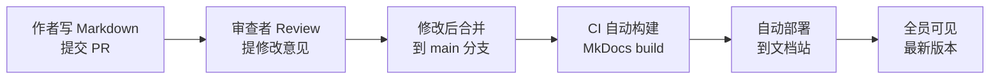
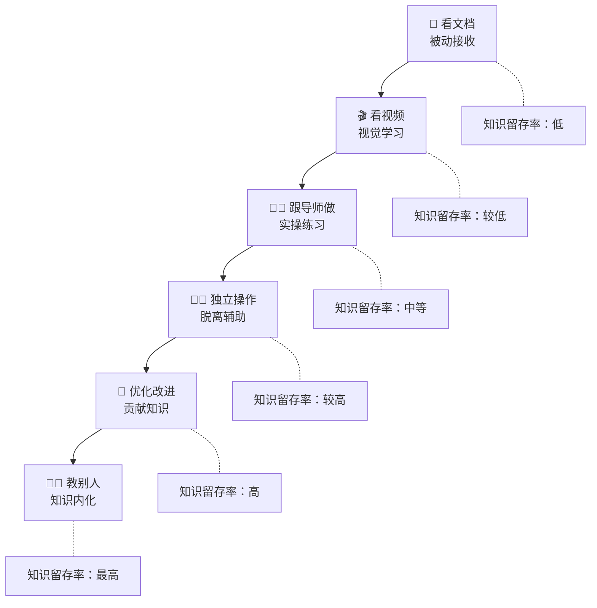
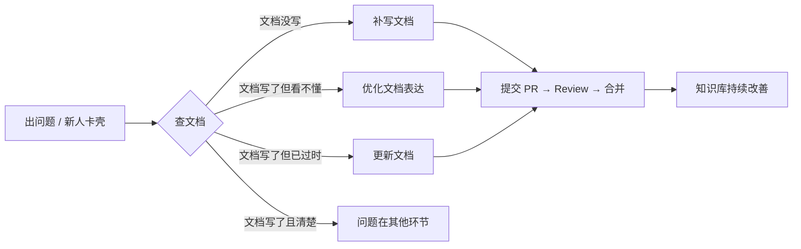
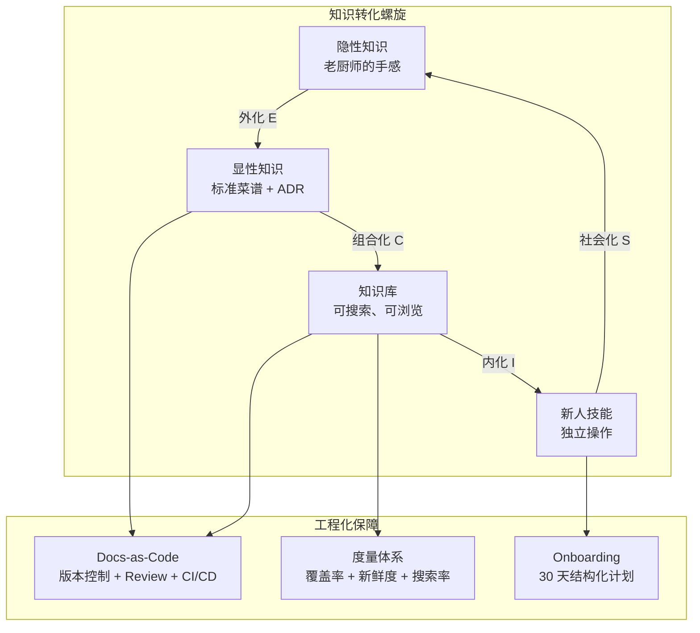

# 菜谱标准化之路

> 从阿明的"祖传秘方"到"标准菜谱库"，看技术文档与知识工程的体系化建设

> **系列定位**：本篇是「阿明餐厅」系列的**番外五**。在终章[《从厨师到 CEO》](./07-from-chef-to-ceo.md)中，阿明学会了知识管理。但那篇文章聚焦于"为什么重要"，这一篇要回答更难的问题 —— **怎么做？** 如何把老厨师脑子里的"盐适量、火候到位"变成任何新人都能执行的标准菜谱？

---

## 引言：三十年的经验，装不进一个 U 盘

阿明最厉害的老师傅老周，在厨房干了三十年。

他的红烧肉是一绝 —— 色泽红亮、入口即化、肥而不腻。无数食客专程来吃，同行来偷师也学不会。阿明问过老周："师傅，你这红烧肉的秘诀到底是什么？"老周笑笑："盐适量，糖看颜色，大火收汁，差不多熟了就行。"

"盐适量"是多少？"大火"是多大？"差不多熟了"是几分钟？

新来的厨师小赵，照着老周的口头描述做了一遍。味道差了一大截 —— 不是咸了就是淡了，不是糊了就是没入味。小赵委屈地说："师傅说的'适量'，我真的不知道是多少啊。"

更糟糕的是，老周下个月要退休了。三十年的经验，全在他脑子里。阿明坐在办公室里，第一次感到一种比系统宕机更深的恐惧：**如果知识只存在于一个人的大脑里，那这个人离开的那天，知识就消失了。**

---

## 第一章：从隐性知识到显性知识

阿明找到老陈，说了自己的焦虑。老陈想了想，说："这个问题，管理学上早就研究过了。"

他拿出一张图，叫 **SECI 模型** —— 日本学者野中郁次郎提出的知识转化理论。知识在"隐性"和"显性"之间有四种转化方式：

```text
SECI 模型（知识转化螺旋）：

          隐性知识                        显性知识
     （老厨师的手感）               （标准菜谱文档）
           │                              │
  社会化 ──┤                              ├── 组合化
  Socialization                    Combination
  （老带新、结对观察）            （文档归类、知识库建设）
           │                              │
           │                              │
  外化 ────┤                              ├── 内化
  Externalization                    Internalization
  （把"手感"写成"克数和秒数"）    （新人按文档练习、变成自己的技能）
```

| 转化方式 | 从什么到什么 | 餐厅做法 | 技术实践 |
|----------|------------|-----------|-----------|
| 社会化（S） | 隐性 → 隐性 | 小赵站在老周旁边看他做菜 | 结对编程、Shadow On-Call |
| 外化（E） | 隐性 → 显性 | 把"盐适量"记录为"盐 2g / 100g 牛肉" | 架构决策记录（ADR）、事后复盘 |
| 组合化（C） | 显性 → 显性 | 把散落的菜谱整理成标准菜谱库 | 文档站建设、知识图谱 |
| 内化（I） | 显性 → 隐性 | 小赵按标准菜谱练习 100 遍，形成本能 | 新人 Onboarding、实操训练 |

老陈说："老周的知识现在全是**隐性知识** —— 在他脑子里，说不清道不明。我们要做的第一步是**外化**：让他把'手感'翻译成'可量化的参数'。"

阿明让老周做了一道红烧肉，小赵在旁边全程录像、称量、计时。最后得到了一份精确的菜谱：

```yaml
# 标准菜谱：阿明红烧肉 v1.0
菜品: 红烧肉
份量: 2 份
难度: 中级

食材:
  - 五花肉: 500g（肥瘦比 3:7）
  - 冰糖: 30g
  - 生抽: 25ml
  - 老抽: 10ml
  - 料酒: 30ml
  - 八角: 2 颗
  - 桂皮: 1 小块（约 3g）

步骤:
  - 步骤: 1
    操作: 五花肉切 3cm 方块，冷水下锅焯水
    时间: 3 分钟
    火候: 大火
    要点: 水开后撇去浮沫，捞出沥干

  - 步骤: 2
    操作: 锅中放少量油，加冰糖小火炒至琥珀色
    时间: 2 分钟
    火候: 小火
    要点: 糖色变成深琥珀色立刻下肉，过了会发苦

  - 步骤: 3
    操作: 放入五花肉翻炒上色，加调料
    时间: 3 分钟
    火候: 中火
    要点: 每块肉均匀裹上糖色

  - 步骤: 4
    操作: 加开水没过肉面，大火烧开转小火炖
    时间: 60 分钟
    火候: 先大火后小火
    要点: 必须加开水，冷水会让肉收紧

  - 步骤: 5
    操作: 大火收汁
    时间: 5 分钟
    火候: 大火
    要点: 汤汁浓稠挂在肉上即可
```

小赵照着这份菜谱做了一遍，味道达到了老周 85% 的水平。阿明感慨：**"知识外化"不是要把人变成机器，而是要让经验可传承。**

知识萃取的三种方法：

| 方法 | 做法 | 适用场景 | 餐厅示例 |
|------|------|----------|----------|
| 结对观察 | 专家做事，记录者在旁边观察、提问、记录 | 操作类技能 | 小赵站在老周旁边，边看边问边记 |
| 事后复盘 | 事情做完后回顾"做了什么、为什么、效果如何" | 决策类经验 | 老周讲"为什么这道菜要用冰糖不用白糖" |
| 决策记录 | 在做决策的当下，记录"选项、评估、结论" | 架构类决策 | 记录"为什么选 Kafka 不选 RabbitMQ" |

阿明的教训：**隐性知识不会自动变成显性知识 —— 它需要刻意的外化过程。而外化最大的障碍不是技术，而是"专家觉得没必要写下来"。**

---

## 第二章：架构决策记录（ADR）

老周退休前，阿明又想到一个问题：不只是菜谱，厨房里还有很多"为什么"也没有记录。

"为什么蒸箱温度设 105 度不是 100 度？""为什么这个酱料要先放醋后放盐？""为什么外卖包装要用双层盒？"

每一个"为什么"背后，都有一个当初做决策的故事。但这些故事从来没有被记录下来 —— 做决策的人走了，"为什么"就变成了"不知道"。

老陈说："在技术团队里，这个问题更严重。代码能看到'怎么做的'，但看不到'为什么这样做'。"

这就是**架构决策记录（Architecture Decision Record, ADR）**的价值 —— 把每一个重要的技术决策，以及**做出这个决策的理由**，用标准化的格式记录下来。

一份 ADR 的标准模板：

```text
# ADR-0042：为什么选择 Kafka 而非 RabbitMQ

## 状态
已采纳（2024-03-15）

## 上下文
我们的订单事件日志需要支持"回放"能力 —— 当新的数据分析服务上线时，
需要能够重新消费过去 30 天的所有订单事件来构建初始数据集。
当前日均事件量 500 万条，预计一年后增长到 2000 万条。

## 考虑的选项
1. RabbitMQ：团队更熟悉，运维经验更丰富
2. Kafka：支持日志持久化和消费者组回放，吞吐量更高
3. RocketMQ：功能折中，但社区活跃度较低

## 决策
选择 Kafka。核心原因是"日志回放"能力 —— Kafka 的消息持久化在
Topic Partition 中，消费者可以通过 seek 操作回到任意时间点重新消费。
RabbitMQ 的消息被消费后就会被删除，无法回放。

## 后果
正面：
- 支持新服务上线时的历史数据回放
- 吞吐量满足未来 3 年的增长预期
- 与现有的 ClickHouse 数据管道无缝集成

负面：
- 团队需要学习 Kafka 的运维知识
- 初期基础设施投入比 RabbitMQ 高约 30%
```

ADR 的生命周期有四个阶段：

| 阶段 | 含义 | 餐厅类比 | 示例 |
|------|------|-----------|------|
| 提议（Proposed） | 正在讨论，尚未决定 | "我在想要不要换蒸箱" | 团队讨论是否引入 gRPC |
| 采纳（Accepted） | 决定采用，开始执行 | "决定了，换！" | 正式引入 gRPC 并在第一个服务中落地 |
| 废弃（Deprecated） | 不再推荐使用，但旧系统仍在使用 | "这个蒸箱老了，新菜别用它" | 旧服务仍用 REST，新服务用 gRPC |
| 替代（Superseded） | 被新的决策取代 | "新蒸箱到了，旧的报废" | ADR-0042 被 ADR-0078 替代（升级到 Kafka 3.0） |

阿明要求团队从今天开始，每一个重要的技术决策都写一份 ADR。格式不重要，关键是记录**"上下文"和"为什么"** —— 因为代码能告诉你 How，但只有 ADR 能告诉你 Why。

三个月后，新来的工程师小林在代码里看到一行奇怪的配置：`max.partition.fetch.bytes = 1048576`。他正要改成默认值，老陈拦住他："先查 ADR。"小林翻到 ADR-0042，才发现这个参数是为了解决某次大消息消费超时而专门调整的。

**ADR 的核心价值是：让未来的自己（和同事）不再重复问"当初为什么要这样做"。**

---

## 第三章：Docs-as-Code 实践

标准菜谱写好了，ADR 也开始记录了。但新问题来了 —— 这些文档存在哪里？

阿明最初的方案是：用 Word 写菜谱，存在共享文件夹里。结果一个月后：

```text
共享文件夹现状：
  红烧肉_标准菜谱.docx
  红烧肉_标准菜谱_最终版.docx
  红烧肉_标准菜谱_最终版_真的最终版.docx
  红烧肉_标准菜谱_最终版_真的最终版_老陈改的.docx
  红烧肉_标准菜谱_v2.0_不要用旧版.docx
```

五个文件，没人知道哪个是最新的。更糟的是，有人改了配方但没通知其他人，导致两家店做出来的红烧肉味道不一样。

老陈说："这个问题，技术界早就有解了 —— **把文档当代码管理（Docs-as-Code）**。"

核心思想很简单：**文档用 Markdown 写，和代码一起存在 Git 仓库里，用同样的 Review 流程、版本控制、自动化发布。**

```bash
# 文档仓库结构
docs/
├── recipes/                    # 标准菜谱
│   ├── hong-shao-rou.md       # 红烧肉
│   ├── qing-zheng-lu-yu.md    # 清蒸鲈鱼
│   └── _template.md           # 菜谱模板
├── adr/                        # 架构决策记录
│   ├── 0001-use-mysql.md
│   ├── 0042-kafka-over-rabbitmq.md
│   └── _template.md
├── runbooks/                   # 操作手册
│   ├── emergency-shutdown.md
│   └── new-store-setup.md
├── onboarding/                 # 新人入职
│   ├── day-1-checklist.md
│   └── first-30-days.md
└── mkdocs.yml                  # 文档站配置
```

Docs-as-Code 的三大好处：

| 好处 | 说明 | 餐厅类比 | 技术实现 |
|------|------|-----------|-----------|
| 版本控制 | 每次修改都有记录，可追溯、可回滚 | 菜谱每改一次都有记录，谁改了什么一清二楚 | Git 提交历史 |
| Review 流程 | 修改必须经过审核，防止错误 | 新配方必须经过老师傅试菜才能正式使用 | Pull Request + Approve |
| 自动发布 | 合并后自动更新文档站，永远最新 | 新菜谱确认后，所有门店的电子版同步更新 | CI/CD + MkDocs / Docusaurus |

文档自动化发布流程：



阿明还发现了一个意想不到的好处：**文档的更新频率明显提高了**。以前改一份 Word 文档要打开文件、编辑、保存、上传，流程繁琐。现在直接在 IDE 里改 Markdown，`git commit && git push`，和改代码一样自然。

关于文档自动生成，老陈还做了一件事：**API 文档从 OpenAPI 规范自动生成**（详见[《菜单设计学》](./10-api-design.md)中的 OpenAPI 章节）。架构图从代码中的依赖关系自动生成。这些"活文档"不需要手动维护，代码变了，文档跟着变。

**Docs-as-Code 的核心是让文档享受代码的工程化待遇 —— 版本控制、Review 流程、自动化发布。**

---

## 第四章：内部知识库建设

文档有了，ADR 有了，但阿明发现一个新问题：**东西太多，找不到。**

标准菜谱 200 多份、ADR 150 多份、操作手册 80 多份、故障复盘 60 多份 —— 全堆在文档仓库里，像一座没有索引的图书馆。新厨师小赵想找"怎么做出糖醋排骨的酸甜口"，搜了半天，搜出来的全是无关内容。

阿明说："这就像我们的仓库 —— 东西全在里面，但没有分类、没有标签、没有导购员。找一棵白菜要翻遍整个仓库。"

老陈决定建设一个**内部知识库**，把零散的文档组织成一个可搜索、可浏览、有结构的知识体系。

知识的分类和分层：

| 知识类型 | 说明 | 餐厅示例 | 技术示例 | 更新频率 |
|----------|------|-----------|-----------|----------|
| 操作手册（Runbook） | "怎么做" —— 按步骤执行的操作指南 | 开店准备流程、关店清洁流程 | 部署手册、故障处理手册 | 低（流程稳定后很少改） |
| 设计文档 | "为什么这样做" —— 系统设计的思路和决策 | 厨房布局设计理念 | 架构设计文档、ADR | 中（架构演进时更新） |
| 故障复盘 | "出了什么问题" —— 事故分析和改进 | 菜品质量事故分析 | Postmortem 报告 | 高（每次故障后新增） |
| 最佳实践 | "怎么做得更好" —— 经验总结和技巧 | 老师傅的独门技巧 | 性能优化技巧、编码规范 | 中（持续积累） |

关于知识库的形态选择，老陈做了一个对比：

| 形态 | 优点 | 缺点 | 适合场景 |
|------|------|------|-----------|
| Wiki（如 Confluence） | 在线编辑方便，非技术人员也能贡献 | 版本控制弱，容易变成"信息坟场" | 团队协作、头脑风暴 |
| 文档站（如 Docusaurus） | 结构清晰，搜索强，版本控制 | 需要 Git 基础，非技术人员门槛高 | 技术文档、API 文档 |
| 知识图谱 | 知识间关联可视化，智能推荐 | 建设成本高，维护复杂 | 大型组织的知识管理 |

阿明选了"文档站 + 全文搜索"的方案 —— 技术团队用 Git 管理，非技术团队通过 Web 界面浏览和搜索。

但知识库建好后，阿明遇到了一个**更棘手的问题**：**知识的新鲜度。**

三个月后，小赵按照操作手册里的步骤配置新设备，发现第三步就执行不下去了 —— 设备型号已经换了，但手册还是旧的。阿明查了一下，知识库里有 40% 的文档超过 6 个月没更新过。

老陈说："知识库最大的敌人不是'建不起来'，而是'建了没人维护'。"

知识新鲜度管理的三板斧：

```text
知识新鲜度管理：

1. 过期提醒
   - 每篇文档设置"过期日期"（默认 6 个月）
   - 到期前 2 周，自动发邮件给 Owner："你的文档该更新了"
   - 过期未更新的文档，搜索结果中标记为"⚠️ 可能已过期"

2. 定期审查
   - 每季度一次"文档大扫除"
   - 每个团队花半天时间，审查自己负责的文档
   - 过时的文档标记为"已归档"，避免误导新人

3. Owner 机制
   - 每篇文档必须有一个明确的 Owner（个人，不是团队）
   - Owner 离职时，文档交接是离职 Checklist 的必选项
   - 没有 Owner 的文档，自动分配给团队负责人
```

阿明的教训：**知识库建设是 20% 的搭建 + 80% 的运营。建了不运营，半年后就是"信息坟场"。**

**知识库的核心是"可发现、可信赖、可持续" —— 找不到等于不存在，不可信等于有害。**

---

## 第五章：新人入职与知识传递

知识库建好了，阿明开始关注一个更具体的场景：**新人入职**。

以前的新人入职，全靠"老带新" —— 老周带着小赵，小赵跟着看、跟着学。但问题是：

- 老周教什么，全凭心情，遗漏很多
- 小赵学到什么程度，没有标准衡量
- 老周退休了，谁来带新人？

阿明说："这就像没有标准菜谱的时候 —— 出什么菜全看厨师心情。"

老陈设计了一套**结构化的 Onboarding 体系**，核心是一份 **30 天入职清单**：

```yaml
# 新厨师 30 天入职计划
角色: 新入职厨师
导师: 指定资深厨师（非直属上级）

第一周 - 学习与模仿:
  目标: 了解厨房布局、标准流程、基础菜品
  任务:
    - 阅读《厨房操作手册》和《食品安全规范》
    - 观看 5 道核心菜品的教学视频
    - 在导师指导下，按标准菜谱完成 3 道菜
  考核: 能说出厨房 6 大区域的用途、背出 5 道核心菜的关键参数

第二周 - 独立操作:
  目标: 脱离导师，独立完成基础菜品
  任务:
    - 脱离菜谱，独立完成 5 道核心菜品
    - 每道菜由导师品尝评分（满分 10 分，8 分及格）
    - 参与一次午高峰实战
  考核: 5 道菜平均分 ≥ 8 分

第三周 - 优化与贡献:
 目标: 发现问题，提出改进
  任务:
    - 在标准菜谱基础上，提出至少 1 条优化建议
    - 参与一次菜品质量复盘会
    - 开始学习高级菜品
  考核: 优化建议被采纳至少 1 条

第四周 - 带教验证:
  目标: 能教别人，才算真正学会
  任务:
    - 带一名更新的实习生完成 1 道基础菜品
    - 撰写一份"我眼中的标准菜谱"学习心得
  考核: 实习生成功做出菜品，心得通过审核
```

这个 30 天计划背后的知识传递漏斗：



这个漏斗来自**学习金字塔理论** —— 主动实践和教授他人的知识留存率显著高于被动接收（注：具体百分比因研究而异，此处仅为趋势示意）。阿明把它变成了具体的行动指南：**"你能教别人做这道菜，才算真正学会了这道菜。"**

"老带新"不是"你跟着看"，而是一个有明确目标、分阶段推进、可度量成果的结构化过程。导师的职责不是"什么都教"，而是"在关键节点给予指导，让新人自己摸索"。

关于导师制度的更多细节，这和[《学徒的困境》](./11-ai-learning-paradox.md)中讨论的"脚手架理论"高度一致 —— 好的导师像脚手架，随着新人能力的增长逐步撤除支撑，而不是永远替新人做决定。

**新人入职的核心是把"老带新"从"随缘"变成"标准化流程" —— 好的 Onboarding 让新人 30 天就能独当一面。**

---

## 第六章：知识度量与持续改进

所有体系都建好了，阿明问了最后一个问题："怎么知道这些努力有没有效果？"

老陈说："度量什么，就得到什么。知识管理也一样。"

他设计了四个核心指标，用来衡量知识管理的健康度：

| 指标 | 定义 | 目标值 | 度量方式 | 餐厅类比 |
|------|------|--------|-----------|-----------|
| 文档覆盖率 | 多少模块/菜品有标准文档 | > 90% | 菜品总数 vs 有标准菜谱的菜品数 | "200 道菜里，180 道有标准菜谱" |
| 文档新鲜度 | 文档最后更新距今的平均天数 | < 90 天 | 自动统计 Git 提交时间 | "菜谱平均 2 个月更新一次" |
| 搜索成功率 | 新人搜索后能找到所需知识的比例 | > 80% | 搜索日志 + 用户反馈 | "小赵搜'糖醋排骨'，第一次就找到了" |
| Onboarding 效率 | 新人从入职到独立上岗的平均天数 | < 30 天 | 考核通过率 + 上岗时间 | "新厨师 28 天就能独立出菜" |

但度量只是手段，**持续改进**才是目的。老陈建立了一个**文档质量的反馈回路**：



阿明立了一条铁律：**每次故障复盘的改进项，必须有"更新文档"这一条。**

这条规则来自[《差评危机》](./15-incident-response.md)中的复盘方法论 —— 故障复盘不能只停留在"修 Bug"层面，还要回答"这个 Bug 能不能通过更新文档来预防"。如果操作手册写清楚了"部署前检查证书有效期"，那 SSL 证书过期导致的支付崩溃就不会再次发生。

知识度量的仪表盘：

```text
知识管理健康度看板（月度）：
┌──────────────────────────────────────────┐
│  文档覆盖率    ████████████████░░  82%    │
│  文档新鲜度    ██████████████████░  76天  │
│  搜索成功率    ███████████████░░░░  74%   │
│  Onboarding    ████████████████████ 26天  │
│                                          │
│  本月新增文档：12 篇                      │
│  本月更新文档：28 篇                      │
│  本月过期文档：3 篇（已通知 Owner）       │
│  待补文档 TOP3：                          │
│    1. 清蒸鲈鱼标准菜谱（缺）              │
│    2. 外卖包装操作手册（过期）            │
│    3. 新门店开业 Checklist（缺）           │
└──────────────────────────────────────────┘
```

阿明看着看板，发现"清蒸鲈鱼"的标准菜谱一直没写。一查，Owner 是已经退休的老周。他立刻把这篇文档的 Owner 改成了小赵，并在看板上标记为"紧急"。

**知识度量的核心是让知识管理"可见" —— 看不见的东西，就不会被管理。**

---

## 核心总结：技术文档与知识工程



| 章节 | 核心问题 | 解决方案 | 餐厅类比 |
|------|-----------|-----------|-----------|
| 第一章 | 经验在人脑里，说不清 | SECI 模型 + 知识萃取 | "盐适量"变成"盐 2g" |
| 第二章 | 决策理由没人记得 | ADR 记录 Why | "为什么用冰糖不用白糖" |
| 第三章 | 文档版本混乱、找不到 | Docs-as-Code + Git | 菜谱和代码一样管理 |
| 第四章 | 知识库变成信息坟场 | 分类 + 搜索 + 新鲜度管理 | 仓库要有索引和导购 |
| 第五章 | 新人入职全靠随缘 | 30 天 Onboarding + 知识漏斗 | 从"看"到"做"到"教" |
| 第六章 | 不知道做得好不好 | 四大指标 + 反馈回路 | 看板驱动持续改善 |

### 一句心法

**知识最大的风险不是"不知道"，而是"只有一个人知道"。把脑子里的东西写下来，不是浪费时间，是在给团队买保险。**

---

## 延伸阅读

- [架构是"长"出来的](./02-system-architecture-evolution.md) —— 架构演进过程中的每一个决策，都应该用 ADR 记录下来
- [当餐厅长出大脑](./01-ai-agent-architecture.md) —— AI Agent 的记忆系统本质上是一种"机器知识管理"，RAG 就是知识库的 AI 版
- [给产品经理的重构说明书](./03-refactoring-guide-for-pm.md) —— 重构决策需要 ADR 记录"为什么现在要重构、为什么选这个方案"
- [高峰保卫战](./04-peak-traffic-defense.md) —— 限流、熔断的阈值配置需要文档化，否则下次调整没人记得为什么
- [厨房装监控](./05-observability.md) —— 故障复盘依赖可观测性数据，复盘结论要沉淀到知识库中
- [食安大检查](./06-security-architecture.md) —— 安全策略和权限配置是最需要文档化的知识，否则审计时一片空白
- [从厨师到 CEO](./07-from-chef-to-ceo.md) —— 知识管理是团队管理的四大支柱之一，本篇是其方法论的深度展开
- [厨房质检员](./08-qa-testing-strategy.md) —— 测试用例本身就是一种"可执行的文档"，测试覆盖率也是知识度量的一种
- [从接单到出餐](./09-cicd-devops.md) —— Docs-as-Code 的 CI/CD 流程与代码的 CI/CD 流程高度相似
- [菜单设计学](./10-api-design.md) —— OpenAPI 规范是"API 文档即代码"的最佳实践
- [学徒的困境](./11-ai-learning-paradox.md) —— AI 时代的学习方法论，与知识传递漏斗中的"教别人才算学会"理念一致
- [数据厨房](./12-data-kitchen.md) —— 数据治理中的"主数据管理"和知识库中的"统一术语"是同一个思想
- [前厅翻修记](./13-frontend-renovation.md) —— Design System 文档化是前端知识库的重要组成部分
- [阿明的省钱经](./14-cloud-finops.md) —— 云成本优化的决策也需要 ADR 记录"为什么选这个实例规格"
- [差评危机](./15-incident-response.md) —— 故障复盘的改进项必须包含"更新文档"，这是知识反馈回路的关键
- [外卖大战](./16-performance-optimization.md) —— 性能优化的经验是最值得沉淀的"隐性知识"
- [传菜窗口的智慧](./17-async-messaging.md) —— 异步消息的设计决策需要 ADR 记录，消息格式需要文档化
- [十家店的烦恼](./18-distributed-puzzles.md) —— 分布式系统的复杂性更需要文档和知识管理来降低认知负担
- [阿明的加盟帝国](./19-saas-multitenant.md) —— 多租户架构的设计决策和运营手册是知识库的核心内容
- [厨房实况直播](./20-realtime-eventdriven.md) —— 实时系统的故障模式和处理流程需要详细的 Runbook
- [一个厨房，四个门面](./21-multiplatform-architecture.md) —— 多平台架构需要统一的设计文档和 API 规范
- [懂你的菜单](./22-search-recommendation.md) —— 推荐算法的策略文档是"最难写但最有价值"的知识
- [仓库搬家不停业](./24-database-migration.md) —— 数据库迁移的方案设计和操作手册是 ADR 和 Runbook 的典型应用场景
- [预制菜还是现炒](./25-lowcode-platform.md) —— 低代码平台的选型决策需要 ADR，使用手册需要持续更新
- [阿明出海记](./26-globalization.md) —— 全球化涉及的合规知识、本地化经验是知识库中最需要定期更新的内容
- [厨房大换岗](./27-ai-org-transformation.md) —— AI 转型的知识沉淀，岗位变化需要同步更新知识管理体系
- [阿明的二次创业](./28-ai-native-startup.md) —— AI 原生创业的知识积累，从第一天就建立知识驱动的开发文化
- [会自我进化的厨房](./29-self-evolving-company.md) —— Agent Loop 的活手册是知识工程的极致，文档自动更新和进化
- [AI 的"黑暗料理"](./30-ai-hallucination-safety.md) —— AI 幻觉与知识准确性，知识库的质量是防止 AI 幻觉的基础

---

## 结语

阿明的菜谱标准化之路，本质上回答了一个所有技术团队都会遇到的问题：**当关键知识只存在于少数人的大脑里，你该怎么办？**

答案是六个递进的步骤：用 SECI 模型把隐性知识外化成显性知识，用 ADR 记录每个决策的"为什么"，用 Docs-as-Code 让文档享受工程化待遇，用知识库让知识可发现可信赖，用结构化 Onboarding 让新人 30 天独当一面，用度量体系让知识管理持续可见。

老周退休的那天，阿明送了他一份特别的礼物 —— 一本装订精美的《老周菜谱集》，里面是他三十年经验的标准化的 28 道菜。老周翻了翻，笑着说："嘿，比我记得清楚多了。"

小赵接过老周的围裙，打开标准菜谱，开始做今天的红烧肉。味道和老周做的一模一样。

下次当你面对"知识在人脑里"的困境时，不妨问自己：

- 团队里有没有"老周"—— 关键知识全在他脑子里，一旦离职就断档？
- 你有 ADR 吗？还是每个"为什么"都要去问当事人？
- 你的文档有版本控制吗？还是存在共享文件夹里变成"最终版_真的最终版"？
- 你的新人入职有结构化计划吗？还是全靠"老带新、随缘学"？
- 你度量过知识管理的健康度吗？还是建了知识库就不管了？

> 知识就像菜品 —— 放在冰箱里不标记会过期，放在脑子里不写下来会消失。

← [返回系列导读](./index.md)
