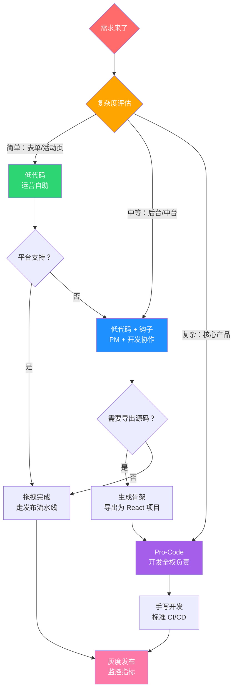

# 预制菜还是现炒

> 从阿明的"标准化与灵活性之争"，看低代码平台的技术选型与架构设计

> **系列定位**：本篇是「阿明餐厅」系列的**番外六**。在番外一[《给产品经理的重构说明书》](./03-refactoring-guide-for-pm.md)中，阿明学会了用 PM 听得懂的语言沟通技术决策。但有一类需求让 PM 和技术都头疼 —— **"这个页面能不能让我自己配？"** 低代码平台承诺"人人都是开发者"，但现实远比宣传复杂。

---

## 引言：运营说"不用找开发"，技术反而更忙了

PM 小美拿着一份需求单找到阿明："运营要做 10 个不同的活动页面，每个都有倒计时、优惠券、分享按钮。能不能做个工具，让运营自己拖拖拽拽就生成页面？不用每次都找开发。"

阿明觉得有道理。他让老陈带团队花了 3 个月，搭了一个低代码平台 —— 可视化编辑器、组件库、数据源绑定、一键发布，功能齐全。运营很高兴，第一周就自己做了 20 个页面。阿明很开心："终于不用为活动页排队了。"

但一个月后问题来了：页面 A 在手机屏幕上按钮错位了，运营不知道怎么调；页面 B 的优惠券叠加逻辑有 Bug，但页面是"拖"出来的不是代码，开发看不懂也改不了；页面 C 需要对接一个新的支付接口，但平台的组件库里没有，整个平台不支持。

老陈苦笑着说："低代码解决了一部分人的问题，但制造了另一部分人的问题。运营是解放了，但我们多了一整套新系统要维护。"

阿明终于明白：**低代码不是免费的午餐，它只是把成本从"写代码"转移到了"维护平台"。**

---

## 第一章：低代码的光谱 —— 预制菜、半成品还是从零做菜？

阿明去食品展逛了一圈，发现"做菜"这件事，其实有很多层次。

第一种：**预制菜**。工厂做好，加热就能上桌。标准化程度最高，但口味固定，不能改。对应技术世界的**无代码（No-Code）** 平台 —— 用户只能拖拽组件，完全不能写代码，适合简单的表单、问卷、营销页。

第二种：**半成品**。工厂做好基础食材，厨师需要自己调味、装盘。对应**低代码（Low-Code）** 平台 —— 大部分逻辑通过拖拽完成，但允许写少量代码（自定义函数、事件钩子）来处理特殊需求。

第三种：**从零做菜**。从买菜、洗菜、切菜开始，完全自由。对应**Pro-Code（全手写）**—— 用传统开发框架，完全自主编码，灵活度最高但效率最低。

小美问阿明："那我们到底该用哪种？"阿明说："这取决于你要做什么菜。"

| 维度 | 无代码（No-Code） | 低代码（Low-Code） | Pro-Code（全手写） |
|------|-------------------|---------------------|---------------------|
| 餐厅类比 | 预制菜 | 半成品 | 从零做菜 |
| 目标用户 | 非技术人员（运营/市场） | 有一定技术基础的用户 | 专业开发者 |
| 灵活度 | 低（受限于组件库） | 中（拖拽 + 少量代码） | 高（完全自由） |
| 开发速度 | 极快（分钟级） | 快（小时级） | 慢（天级） |
| 可维护性 | 差（配置黑盒） | 中（配置 + 代码混合） | 好（代码可读可审查） |
| 性能上限 | 低 | 中 | 高 |
| 适用场景 | 问卷、落地页、简单表单 | 管理后台、营销活动页、内部工具 | 核心产品、复杂交互、高性能场景 |
| 代表产品 | Wix、Notion、Airtable | OutSystems、Mendix、Retool | React、Vue、Spring Boot |

阿明总结了一个"光谱选择法"：

```text
需求复杂度低 ←————————————————————→ 需求复杂度高
    |                |                  |
  无代码          低代码            Pro-Code
 （预制菜）      （半成品）         （从零做菜）
    |                |                  |
  运营自助       PM + 开发协作       开发全权负责
```

"做活动页就像加热预制菜，标准化、快速出餐。做核心下单页面就像给 VIP 客户定制宴席，必须从零开始。"

**低代码的光谱告诉我们：没有"最好的开发方式"，只有"最适合当前场景的开发方式"。**

---

## 第二章：低代码平台的核心架构 —— 阿明的"中央厨房"

阿明决定把低代码平台好好研究一遍。老陈在白板上画出了平台的架构图：

"你看，低代码平台就像一个中央厨房 —— 有标准化的食材（组件）、标准化的菜谱（模板）、标准化的出餐流程（渲染引擎）。"

```text
┌─────────────────────────────────────────────────────────────┐
│                    低代码平台架构                              │
├─────────────────────────────────────────────────────────────┤
│                                                             │
│  ┌──────────────┐   ┌──────────────┐   ┌──────────────┐    │
│  │  可视化编辑器  │   │  组件注册表   │   │  模板市场     │    │
│  │  (拖拽/配置)  │──→│  (标准组件库) │──→│  (页面模板)   │    │
│  └──────┬───────┘   └──────────────┘   └──────────────┘    │
│         │                                                   │
│         ▼                                                   │
│  ┌──────────────┐   ┌──────────────┐   ┌──────────────┐    │
│  │  JSON Schema │──→│   渲染引擎    │──→│  发布管理     │    │
│  │  (页面描述)   │   │ (Schema→页面)│   │ (版本/灰度)   │    │
│  └──────────────┘   └──────────────┘   └──────────────┘    │
│         │                                                   │
│         ▼                                                   │
│  ┌──────────────┐   ┌──────────────┐                       │
│  │  数据源管理   │   │  权限管理     │                       │
│  │  (API 绑定)  │   │  (谁能编辑/  │                       │
│  │              │   │   谁能发布)   │                       │
│  └──────────────┘   └──────────────┘                       │
│                                                             │
└─────────────────────────────────────────────────────────────┘
```

老陈解释了四大核心模块：

**第一，可视化编辑器**。用户在这里拖拽组件、调整布局、配置属性。最终产出的不是代码，而是一份 JSON Schema —— 一份"页面说明书"。

```json
{
  "pageId": "activity-summer-2026",
  "components": [
    {
      "type": "Banner",
      "props": {
        "imageUrl": "/images/summer-sale.jpg",
        "title": "夏日特惠",
        "subtitle": "满 100 减 30"
      }
    },
    {
      "type": "Countdown",
      "props": {
        "targetTime": "2026-07-01T00:00:00+08:00",
        "style": "flip"
      }
    },
    {
      "type": "CouponCard",
      "props": {
        "couponId": "SUMMER30",
        "discount": "30",
        "threshold": "100"
      },
      "events": {
        "onClick": {
          "action": "claimCoupon",
          "dataSource": "api://coupons/claim"
        }
      }
    }
  ],
  "layout": "vertical",
  "theme": "summer"
}
```

**第二，组件注册表**。所有可用的组件都在这里注册，每个组件有明确的输入（Props）、输出（Events）和约束（Constraints）。就像餐厅的食材库 —— 每种食材都有标准的规格和使用说明。

```text
组件三层模型：

第一层：UI 组件（原子组件）
  ├── Button（按钮）
  ├── Input（输入框）
  ├── Image（图片）
  └── Text（文本）

第二层：业务组件（组合组件）
  ├── CouponCard（优惠券卡片 = 图片 + 文本 + 按钮 + 倒计时）
  ├── ProductCard（商品卡片 = 图片 + 标题 + 价格 + 按钮）
  └── OrderForm（订单表单 = 多个 Input + 验证逻辑）

第三层：页面模板（整体方案）
  ├── 营销活动页模板
  ├── 商品详情页模板
  └── 管理后台模板
```

**第三，渲染引擎**。把 JSON Schema 翻译成真实页面。浏览器端用 React/Vue 动态渲染，也可以服务端渲染（SSR）提高性能。

**第四，数据源管理**。让组件能绑定后端 API。优惠券组件绑定 `api://coupons/claim`，商品列表绑定 `api://products/list`。

| 模块 | 餐厅类比 | 核心职责 | 技术实现 |
|------|----------|----------|----------|
| 可视化编辑器 | 中央厨房的操作台 | 拖拽组件、配置属性、输出 Schema | React DnD / Monaco Editor |
| 组件注册表 | 食材库 + 食材规格卡 | 统一管理可用组件及其接口 | JSON Schema + 组件 NPM 包 |
| 渲染引擎 | 出餐流水线 | Schema → 真实页面 | 动态组件加载 + SSR/CSR |
| 数据源管理 | 食材采购渠道 | 绑定后端 API、管理数据流 | GraphQL / REST 适配器 |

阿明恍然大悟："原来低代码平台不是'没有代码'，而是把代码藏在了平台里。用户看到的是拖拽，背后跑的是一整套渲染和编译系统。"

**低代码平台的本质是"把复杂性封装在平台里，把简单性暴露给用户" —— 但复杂性不会消失，只是换了个地方存在。**

---

## 第三章：标准化 vs 灵活性的权衡 —— 80/20 法则的甜蜜与陷阱

平台上线半年后，阿明发现了一个规律：运营做的页面，80% 都在用同样的 5 种组件 —— 横幅、倒计时、优惠券、商品列表、分享按钮。剩下 20% 的需求五花八门：有人要做一个"摇一摇抽奖"的互动游戏，有人要做一个"实时排行"的竞技榜单，还有人要在页面上嵌入一个 3D 菜品展示。

老陈拿出数据：

```text
页面需求分布（200 个页面，半年）：

标准组件可满足的需求：
  横幅 + 倒计时 + 优惠券 + 商品列表 + 分享     → 160 个页面（80%）
  需要 1-2 个额外组件                           → 28 个页面（14%）
  需要大量自定义逻辑                             → 12 个页面（6%）

开发耗时对比：
  低代码生成（标准页面）：平均 2 小时
  低代码 + 少量代码（中等页面）：平均 1 天
  全手写（复杂页面）：平均 5 天
```

80% 的需求，低代码平台效率极高。但阿明犯了一个致命的错误 —— **他试图用低代码覆盖 100% 的需求**。

最典型的一次教训：阿明让团队把核心下单页面也用低代码生成。"既然低代码这么快，为什么不让所有页面都用低代码？"

结果：

- 下单页面有复杂的优惠叠加逻辑（满减 + 折扣 + 会员价 + 赠品），低代码平台的事件绑定系统处理不了
- 下单页面需要极致的性能（首屏 < 1 秒），低代码生成的页面多了一层渲染引擎的开销，首屏变成了 1.4 秒
- 下单页面需要精细的 A/B 测试，低代码平台不支持组件级的实验分流

性能测试报告让阿明吓了一跳：**低代码生成的下单页面，比手写的慢 40%**。转化率下降 2.3%。

老陈说了一句让阿明印象深刻的话："低代码的 80/20 法则 —— 80% 的需求用 20% 的组件就够了。但如果你试图用低代码覆盖那 20% 的复杂需求，**你不是在节省时间，而是在制造技术债**。"

| 场景 | 推荐方案 | 原因 | 餐厅类比 |
|------|----------|------|----------|
| 营销活动页 | ✅ 低代码 | 标准化高、迭代快、运营自助 | 预制菜：快速出餐，口味标准 |
| 表单 / 问卷 | ✅ 低代码 | 字段固定、逻辑简单 | 套餐：固定搭配，选 A 或 B |
| 管理后台 | ✅ 低代码 | CRUD 为主、不需要花哨交互 | 员工餐：实用为主 |
| 核心产品页面 | ❌ Pro-Code | 性能要求高、交互复杂 | 招牌菜：必须手工现做 |
| 复杂互动游戏 | ❌ Pro-Code | 自定义动画、实时交互 | 定制宴席：客户要什么做什么 |
| 高性能落地页 | ❌ Pro-Code | 极致加载速度、SEO 优化 | 外卖爆款：快就是一切 |

阿明最终定下了规矩：**"标准页面用低代码，复杂页面用 Pro-Code，中间地带用低代码生成骨架再手写业务逻辑。"**

**标准化和灵活性永远是一对矛盾 —— 低代码的价值在于标准化，低代码的局限也在于标准化。试图用标准化解决所有问题，本身就是一种不标准。**

---

## 第四章：可扩展性设计 —— 给平台装上"逃生舱"

阿明吸取了教训，让老陈重新设计了平台的可扩展性架构。核心理念三个字：**"能逃出去"**。

**第一，插件机制**。允许自定义组件注入平台。

老陈设计了一套组件注册协议：

```typescript
// 自定义组件注册
import { defineLowCodeComponent } from '@aming/lowcode-sdk'

export default defineLowCodeComponent({
  name: 'ShakeLottery',           // 组件名称
  category: 'interaction',        // 分类
  displayName: '摇一摇抽奖',       // 编辑器中显示的名字
  icon: '🎰',

  // 组件的可配置属性（在编辑器右侧面板显示）
  props: [
    {
      name: 'prizeList',
      label: '奖品列表',
      type: 'array',
      required: true
    },
    {
      name: 'shakeThreshold',
      label: '摇动灵敏度',
      type: 'number',
      default: 5
    }
  ],

  // 组件的事件（在编辑器中可绑定动作）
  events: ['onWin', 'onMiss'],

  // 组件的渲染实现（真正的代码）
  render(props, context) {
    return <ShakeLotteryView {...props} context={context} />
  }
})
```

运营在编辑器里看不到代码，但可以看到"摇一摇抽奖"组件。拖进去，配置奖品列表，绑定"中奖后跳转"事件 —— 和标准组件一样的使用体验。

**第二，Escape Hatch（逃生舱）**。低代码生成的页面可以一键导出为源码。运营做了一个页面，觉得某些逻辑需要微调，点击"导出为源码"，得到一份标准的 React 项目。开发者接手后，就像接手一个普通项目一样修改。

```text
低代码 → 源码导出流程：

JSON Schema（页面描述）
    │
    ▼
代码生成器（Schema → React 源码）
    │
    ▼
标准 React 项目：
  ├── src/
  │   ├── pages/
  │   │   └── summer-sale.tsx       ← 页面主文件
  │   ├── components/
  │   │   ├── Banner.tsx             ← 横幅组件
  │   │   ├── Countdown.tsx          ← 倒计时组件
  │   │   └── CouponCard.tsx         ← 优惠券组件
  │   └── styles/
  │       └── summer-sale.css        ← 样式文件
  ├── package.json
  └── README.md
```

"导出的代码要像人写的一样，不能是机器生成的乱码。"老陈强调，"这样开发者接手时才不至于想骂人。"

**第三，事件钩子**。在组件生命周期的关键节点插入自定义逻辑。

```text
组件生命周期钩子：

  onBeforeRender    → 渲染前（可修改 props）
  onAfterRender     → 渲染后（可操作 DOM）
  onBeforeApiCall   → API 调用前（可拦截/修改请求）
  onAfterApiCall    → API 调用后（可处理返回数据）
  onError           → 出错时（可自定义错误处理）
```

比如，运营想在一个标准的优惠券组件上添加逻辑："如果用户是 VIP 会员，优惠券金额翻倍。"这个逻辑组件库里没有，但可以通过 `onBeforeRender` 钩子注入：

```javascript
// 在优惠券组件的 onBeforeRender 钩子中
if (context.user.isVIP) {
  props.discount = props.discount * 2
  props.label = `VIP 专享：满${props.threshold}减${props.discount}`
}
```

阿明的最终方案：

```text
阿明的低代码使用策略：

场景 A：标准营销页
  → 纯低代码，运营自助完成，0 行代码

场景 B：中等复杂度页面（标准组件 + 少量定制逻辑）
  → 低代码搭骨架 + 事件钩子注入自定义逻辑

场景 C：复杂页面（核心下单页 / 互动游戏）
  → 低代码生成初始骨架 → 导出源码 → 开发者手写业务逻辑
  → 该页面从此脱离低代码平台，进入 Pro-Code 管理
```

**可扩展性的核心理念是"进得去，也出得来" —— 低代码生成的东西，永远不能变成黑盒。**

---

## 第五章：版本管理与协作 —— 当"拖拽"遇上"版本控制"

平台运行一年后，阿明遇到了一个意想不到的问题：**运营做的页面，没人知道谁改了什么。**

在传统的代码开发中，Git 记录每一行代码的变更 —— 谁改的、什么时候改的、改了哪一行。但低代码平台的"代码"是一份 JSON Schema，运营在编辑器里拖了一个组件、改了一个属性，Schema 就变了。

老陈展示了一个典型场景：

```text
运营 A 上午 10 点编辑了"夏日促销"页面：
  - 把横幅图片换了一张
  - 把倒计时延长了 3 天

运营 B 下午 2 点也编辑了"夏日促销"页面：
  - 把优惠券从满减改成了折扣
  - 加了一个分享按钮

结果：运营 B 的修改覆盖了运营 A 的修改。
因为 JSON Schema 的 diff 不像代码那样可以按行合并。
```

更麻烦的是发布流程。运营做了一个页面，没有经过任何审核就发布了。结果页面上的优惠券金额写错了 —— 满 100 减 300，不是减 30。一小时内被薅了 50 万。

老陈发现异常后 15 分钟内就完成了回滚 —— 页面恢复到上一个正确版本。同时，客服团队逐一联系已下单的 500 多位用户，说明优惠券配置错误并取消异常订单，每位用户补偿一张 30 元无门槛优惠券作为致歉。大部分用户表示理解，只有不到 20 单产生了投诉。

这次事故让老陈下定决心，紧急设计了三套机制：

**第一，Schema 版本控制**。每次保存自动生成版本号，支持回滚。

```yaml
# 页面版本管理配置
page:
  id: summer-sale-2026
  versions:
    - version: "1.0.0"
      author: "运营-小马"
      timestamp: "2026-06-15T10:00:00+08:00"
      status: archived
      schema_hash: "a3f2c8..."

    - version: "1.1.0"
      author: "运营-小何"
      timestamp: "2026-06-15T14:00:00+08:00"
      status: archived
      schema_hash: "b7d4e1..."

    - version: "1.2.0"
      author: "运营-小马"
      timestamp: "2026-06-16T09:00:00+08:00"
      status: current
      schema_hash: "c9a5f3..."
```

**第二，多人协作冲突检测**。当两个人同时编辑同一个页面时，系统锁定编辑权，避免覆盖。

**第三，发布审批流程**。这是最重要的 —— 呼应[《从接单到出餐》](./09-cicd-devops.md)中的 CI/CD 理念，低代码页面也需要经过完整的发布流水线。

```text
低代码页面发布流水线：

  运营创建/修改页面
       │
       ▼
  ┌─────────────┐
  │ 自动检查     │ ← Schema 合法性验证
  │ (Schema      │ ← 组件版本兼容性检查
  │  Lint)       │ ← 性能预估（组件数量 > 阈值则警告）
  └──────┬──────┘
         ▼
  ┌─────────────┐
  │ PM 审核     │ ← 内容审核（文案、图片、优惠券金额）
  │             │ ← 业务逻辑审核（优惠规则是否正确）
  └──────┬──────┘
         ▼
  ┌─────────────┐
  │ 技术验证     │ ← 多端适配测试（手机/平板/PC）
  │             │ ← 性能测试（首屏加载 < 2 秒）
  └──────┬──────┘
         ▼
  ┌─────────────┐
  │ 灰度发布     │ ← 先放 5% 流量验证
  │             │ ← 监控转化率、错误率
  └──────┬──────┘
         ▼
  ┌─────────────┐
  │ 全量发布     │ ← 确认无异常后全量上线
  └─────────────┘
```

阿明说："这和我之前管代码发布是一样的道理。代码要 CI/CD，低代码页面也要。不能因为'不是代码'就跳过检查。"

老陈补充："而且 JSON Schema 的 diff 和 merge 比代码更难。代码是一行一行的文本，可以用 Git 的三向合并。Schema 是一棵 JSON 树，树结构的合并容易冲突。所以我们做了自己的 Schema Merge Engine。"

| 挑战 | 代码开发 | 低代码开发 | 解决方案 |
|------|----------|-----------|----------|
| 版本控制 | Git（成熟） | Schema 版本管理（不成熟） | 自建 Schema 版本服务 |
| 变更追踪 | Git diff（按行） | Schema diff（按节点） | JSON Diff + 可视化对比 |
| 多人协作 | Git branch + merge | 页面级锁定 / 分区编辑 | 乐观锁 + 冲突提示 |
| 发布流程 | CI/CD 流水线 | 需要类似的审批流水线 | Schema Lint + 审批 + 灰度 |
| 回滚 | Git revert | Schema 版本回滚 | 一键回滚到任意历史版本 |

**低代码的版本管理比代码更难，因为你管的不是一行行文本，而是一棵棵配置树 —— 但再难也不能跳过，否则一个手抖就是 50 万的教训。**

---

## 第六章：低代码的隐性成本 —— "省下来的时间"去哪了？

低代码平台运行两年后，阿明让财务算了一笔账。

"当初做这个平台，是为了节省开发时间。运营自己做页面，开发不用排队。但两年下来，到底省了多少钱？"

财务给出了详细的核算：

```text
低代码平台 ROI 分析（两年）：

节省的开发时间：
  运营自助制作了 300 个页面
  每个页面如果找开发做，平均需要 2 天
  节省：300 × 2 = 600 人天 ≈ 200 万（按人均日薪 3300 计算）

平台投入成本：
  初期开发（3 个月 × 5 人）            ：150 万
  持续维护（2 年 × 2 人专职维护）        ：120 万
  组件库更新（2 年 × 20 个新组件）       ：40 万
  服务器 + 基础设施                     ：15 万
  培训运营人员                           ：5 万
  ─────────────────────────────────────
  总投入                                ：330 万

净收益：200 万 - 330 万 = -130 万（亏损）
```

阿明看到这个数字差点没坐稳。"花了 330 万，省了 200 万？"

老陈解释："这还没算隐性成本。"

**隐性成本一：技术债务转移**。低代码并没有消除技术债，只是把"代码债务"变成了"配置债务"。300 个页面的 Schema 分散在各处，有些用了已经废弃的组件版本，有些引用了已经下线的 API。每次平台升级，都要检查所有页面是否兼容。

**隐性成本二：性能天花板**。低代码平台生成的页面，多了一层运行时（Runtime）的开销 —— 需要先加载渲染引擎，再解析 Schema，再渲染组件。比手写页面多了约 200ms 的首屏延迟。对于活动页无所谓，对于核心页面就是致命的。

**隐性成本三：供应商锁定**。如果未来要换低代码平台（或者平台停止维护），300 个页面的 Schema 全部要重新迁移。这比迁移 300 个手写页面更难 —— 因为 Schema 是平台特有的格式，不是通用代码。

**隐性成本四：排障困难**。一个低代码页面出了 Bug，开发者需要先理解 Schema → 理解渲染引擎 → 理解组件逻辑 → 才能定位问题。排障路径比直接看代码长得多。

阿明没有被亏损吓倒，而是做了三个务实的调整决策：

**第一，缩小平台范围**。把低代码平台从"全场景覆盖"收缩为"仅服务营销活动页和内部工具"。核心下单页面、骑手 App 等高性能场景全部迁回 Pro-Code，减少了 40% 的组件维护量和性能优化成本。

**第二，精简维护团队**。原来 2 人专职维护平台，调整后改为 1 人兼职维护 + 1 个轮值 On-Call，年维护成本从 60 万降到约 25 万。同时冻结了组件库的扩张 —— 不再开发新组件，只维护现有的 15 种高频组件。

**第三，一年后重新核算**。调整方案执行一年后，财务重新算账：平台年维护成本从 165 万降到 60 万，运营仍然自助完成了 180 个活动页面（节省约 120 万开发时间），净收益从 -130 万翻正为 +60 万。阿明在复盘会上说："低代码不是不行，是之前摊子铺太大了。缩小范围后，ROI 自然就正了。"

阿明总结了一个经验公式：

```text
低代码的净收益 = 节省的开发时间 - 平台维护时间 - 隐性成本

当「节省的开发时间」<「平台维护时间 + 隐性成本」时：
  → 低代码不值得，不如直接写代码

当「节省的开发时间」>「平台维护时间 + 隐性成本」时：
  → 低代码值得，但要持续监控 ROI
```

| 成本类型 | 显性/隐性 | 餐厅类比 | 阿明的实际数据 |
|----------|-----------|----------|----------------|
| 平台开发 | 显性 | 建中央厨房 | 150 万 |
| 持续维护 | 显性 | 中央厨房的日常运营 | 120 万/2 年 |
| 组件库更新 | 显性 | 研发新菜品 | 40 万/2 年 |
| 配置债务 | 隐性 | 300 份配方要定期更新 | 无法量化，约 30 万 |
| 性能损失 | 隐性 | 预制菜不如现炒好吃 | 核心页面转化降 2.3% |
| 排障困难 | 隐性 | 出了问题不知道是配方还是厨房的问题 | 平均排障时间 +50% |
| 供应商锁定 | 隐性 | 换了供应商，300 份配方要重写 | 潜在迁移成本 100 万+ |

阿明在年度复盘上说了一句话："低代码平台不是'免费的工具'，而是'一个你决定自己造的产品'。造之前要算清楚 ROI，造之后要持续算 ROI。**当低代码节省的开发时间小于平台维护时间时，就不值得了。**"

**低代码最大的隐性成本不是技术，而是"以为它免费"的心态 —— 任何降低复杂性的工具，本身都有复杂性需要管理。**

---

## 核心总结：低代码平台的选型与设计



| 维度 | 核心问题 | 餐厅类比 | 解决方案 | 关键原则 |
|------|----------|----------|----------|----------|
| 光谱选择 | 用哪种开发方式？ | 预制菜 vs 半成品 vs 从零做菜 | 按需求复杂度分级选择 | 没有最好，只有最合适 |
| 平台架构 | 低代码平台怎么建？ | 中央厨房的四大模块 | 编辑器 + 组件库 + 渲染引擎 + 数据源 | 封装复杂性，暴露简单性 |
| 标准化 vs 灵活性 | 低代码能覆盖多少需求？ | 80% 预制菜 + 20% 现炒 | 80/20 法则，不强求 100% 覆盖 | 试图标准化一切本身就是不标准 |
| 可扩展性 | 平台不够用怎么办？ | 给厨房加新灶台 | 插件机制 + 逃生舱 + 事件钩子 | 进得去，也出得来 |
| 版本管理 | 配置怎么管版本？ | 300 份配方要追溯 | Schema 版本控制 + 审批流水线 | 低代码也要 CI/CD |
| 隐性成本 | 低代码真的省钱吗？ | 中央厨房的运营成本 | ROI 持续核算，低于阈值则止损 | 以为它免费才是最大的成本 |

### 一句心法

**低代码不是"消灭程序员"，而是"让程序员专注在复杂问题上"。简单的事情让平台做，复杂的事情让人做 —— 关键是分清什么是简单、什么是复杂。**

---

## 延伸阅读

- [当餐厅长出大脑](./01-ai-agent-architecture.md) —— AI Agent 的全景架构，低代码平台也可以接入 AI 实现"智能生成页面"
- [架构是"长"出来的](./02-system-architecture-evolution.md) —— 架构演进的全貌，低代码平台本身也是一个需要"长出来"的系统
- [给产品经理的重构说明书](./03-refactoring-guide-for-pm.md) —— 用 PM 听得懂的语言沟通技术决策，低代码选型也需要 PM 参与
- [高峰保卫战](./04-peak-traffic-defense.md) —— 流量治理五道防线，低代码生成的页面也要扛得住高并发
- [厨房装监控](./05-observability.md) —— 可观测性三大支柱，低代码页面的性能和错误也需要监控
- [食安大检查](./06-security-architecture.md) —— 安全架构六大防线，低代码平台的权限管理和数据安全同样重要
- [从厨师到 CEO](./07-from-chef-to-ceo.md) —— 团队管理，低代码改变了开发和运营的协作方式
- [厨房质检员](./08-qa-testing-strategy.md) —— 测试策略，低代码生成的页面也需要自动化测试
- [从接单到出餐](./09-cicd-devops.md) —— CI/CD 流水线，低代码页面的发布也需要审批和灰度
- [菜单设计学](./10-api-design.md) —— API 设计，低代码平台的数据源管理依赖标准化的 API 接口
- [学徒的困境](./11-ai-learning-paradox.md) —— AI 时代的学习之道，低代码会不会让开发者"丧失基本功"？
- [数据厨房](./12-data-kitchen.md) —— 数据架构与数据治理，低代码页面的数据分析需要统一的数据管道
- [前厅翻修记](./13-frontend-renovation.md) —— 前端工程化，低代码平台的编辑器本身就是一个复杂的前端应用
- [阿明的省钱经](./14-cloud-finops.md) —— 云成本优化，低代码平台的服务器和存储也是一种云成本
- [差评危机](./15-incident-response.md) —— 故障复盘与应急响应，低代码平台本身也可能出故障
- [外卖大战](./16-performance-optimization.md) —— 性能优化，低代码生成页面的性能天花板需要关注
- [传菜窗口的智慧](./17-async-messaging.md) —— 异步消息与事件驱动，低代码组件间的事件通信可以借鉴消息队列思想
- [十家店的烦恼](./18-distributed-puzzles.md) —— 分布式系统的经典难题，低代码平台的多区域部署也面临同样挑战
- [阿明的加盟帝国](./19-saas-multitenant.md) —— SaaS 多租户架构，低代码平台天然适合多租户模式
- [厨房实况直播](./20-realtime-eventdriven.md) —— 实时与事件驱动架构，低代码页面的实时更新需要事件驱动
- [一个厨房四个门面](./21-multiplatform-architecture.md) —— 多端架构，低代码平台需要支持多端渲染
- [懂你的菜单](./22-search-recommendation.md) —— 搜索与推荐，低代码页面可以集成个性化推荐组件
- [菜谱标准化之路](./23-tech-docs-knowledge.md) —— 技术文档与知识管理，低代码的组件文档和使用指南需要系统化管理
- [仓库搬家不停业](./24-database-migration.md) —— 数据库迁移，低代码平台底层的 Schema 存储也可能需要迁移
- [阿明出海记](./26-globalization.md) —— 国际化与多区域部署，低代码平台也需要支持多语言和多区域

---

## 结语

阿明的低代码之旅，揭示了技术选型中最常见的陷阱：**被"简单"的承诺吸引，忽略了背后的复杂性。**

低代码平台确实解放了运营，300 个页面不用找开发。但它也带来了新的问题 —— 330 万的平台成本、配置债务、性能天花板、排障困难、供应商锁定。

答案是清醒的选型策略：按需求复杂度选择开发方式（无代码 / 低代码 / Pro-Code），建设可扩展的平台架构（插件 + 逃生舱 + 钩子），严格执行版本管理和发布审批，持续核算 ROI。

下次当你考虑引入低代码平台时，不妨问自己：

- 你的需求中，有多少比例是"标准化的简单需求"？如果低于 60%，低代码可能不值得
- 你的低代码平台有"逃生舱"吗？生成的页面能导出为源码吗？
- 你有低代码页面的发布审批流程吗？还是运营可以不经审核就上线？
- 你核算过低代码平台的完整 ROI 吗？包括隐性成本？
- 如果低代码平台停止维护，你的迁移方案是什么？

> 好的低代码策略，不是"让所有人都变成开发者"，而是"让开发者专注在真正需要创造力的问题上"。

阿明站在运营部的白板前，看着上面密密麻麻的页面排期表。300 个活动页面，每一个都是运营同事自己拖拽完成的。他笑了笑，转头对老陈说："低代码确实好用，但 —— 下次的核心下单页面改版，还是让兄弟们手写吧。有些菜，必须现炒才好吃。"

老陈点头："这就对了。预制菜和现炒，从来不矛盾。关键是 —— **用对的地方用对的东西。**"

← [返回系列导读](./index.md)
