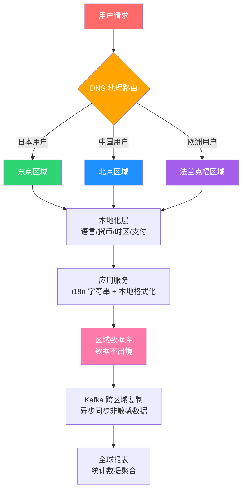

# 阿明出海记

> 从阿明的"东京分店"，看国际化与多区域部署的工程实践

> **系列定位**：本篇是「阿明餐厅」系列的**番外七（系列收官篇）**。在[前传](./02-system-architecture-evolution.md)中，阿明从一家小面馆做到了全国连锁。现在，他要把餐厅开到海外 —— 第一站：东京。但"出海"不只是翻译菜单那么简单：**时区、货币、法规、网络延迟、数据合规**，每一个都是全新的挑战。

---

## 引言：东京银座，开业第一天的三个"惊喜"

阿明在东京银座开了第一家海外分店。

装修用了三个月，团队培训了两个月，一切看起来准备就绪。开业当天，阿明站在收银台后面，信心满满地等着第一位顾客。

第一个"惊喜"来自登录页面。日本顾客习惯用 LINE 登录，但系统只支持微信和手机号登录。顾客看了一眼登录界面，直接转身走了。

第二个"惊喜"来自收银台。第一位点餐的顾客看到屏幕上显示"牛肉面 28 元"，一脸困惑地问店员："28 什么？日元吗？这也太便宜了吧？"店员解释半天，顾客才明白 —— 这是人民币价格，换算成日元大约是 580 円。

第三个"惊喜"来自技术团队。老陈在北京的办公室里盯着监控面板，发现东京店的页面加载时间高达 3 秒。原因很简单 —— 东京的 HTTP 请求要跨越海底光缆到北京，一个往返就是 80ms，加上 TLS 握手、DNS 解析、资源加载，3 秒已经算快的了。更糟的是，法务打来电话："东京用户的数据存到了北京的服务器，日本 APPI 法规要求用户数据必须在本土存储，你们合规了吗？"

阿明站在银座的店里，看着空荡荡的座位，感叹道：**"在国内跑得很好的系统，出了国就是一堆新问题。出海不是翻译一下菜单，而是要重新设计一遍系统。"**

---

## 第一章：国际化（i18n）与本地化（l10n） —— 同一碗面，四种叫法

阿明在东京开业前，以为"国际化"就是把菜单翻译成日文。他找了个翻译公司，把中文菜单全部翻译了一遍，信心满满地上线了。

结果日本顾客一看菜单，眉头紧皱：

- "招牌红烧牛肉面"被翻译成了"看板赤焼牛肉麺"—— 语法正确但日本人不会这么说，应该叫"名物 牛肉ラーメン"
- "微辣 / 中辣 / 特辣"被翻译成了"少し辛い / 中くらい辛い / とても辛い"—— 日本人用"辛口 / 中辛 / 大辛"
- "加蛋 2 元"的"元"没有换算成日元，也没有翻译

老陈解释说："国际化和本地化是两件事。**国际化（i18n）是让系统支持多语言，本地化（l10n）是让内容适应特定地区。**"

| 概念 | 缩写 | 含义 | 餐厅类比 | 示例 |
|------|------|------|----------|------|
| 国际化 | i18n（i + 18 个字母 + n） | 让系统架构支持多语言、多地区 | 厨房里准备好各种调料，能做各国菜 | 代码中的字符串全部外置，不写死 |
| 本地化 | l10n（l + 10 个字母 + n） | 让内容适配特定地区的文化和习惯 | 在日本用味噌，在泰国用冬阴功 | 日文菜单 + 日元定价 + 日本节日活动 |

老陈带着团队做了三件基础工作：

**第一，字符串外置**。所有用户可见的文字，不能写死在代码里，必须放到语言包文件中。

```json
// locales/zh-CN.json（中国大陆）
{
  "menu.signature_beef": "招牌红烧牛肉面",
  "spicy_level.mild": "微辣",
  "spicy_level.medium": "中辣",
  "spicy_level.hot": "特辣",
  "topping.egg": "加蛋 ¥{price}",
  "cart.empty": "购物车是空的",
  "order.success": "下单成功，预计 {minutes} 分钟出餐"
}
```

```json
// locales/ja-JP.json（日本）
{
  "menu.signature_beef": "名物 牛肉ラーメン",
  "spicy_level.mild": "辛口",
  "spicy_level.medium": "中辛",
  "spicy_level.hot": "大辛",
  "topping.egg": "卵追加 ¥{price}",
  "cart.empty": "カートは空です",
  "order.success": "注文完了、約{minutes}分でお届けします"
}
```

```json
// locales/ar-SA.json（沙特阿拉伯）
{
  "menu.signature_beef": "رامن لحم بقري مميز",
  "spicy_level.mild": "حار قليلاً",
  "spicy_level.medium": "حار متوسط",
  "spicy_level.hot": "حار جداً",
  "topping.egg": "إضافة بيض {price} ر.س",
  "cart.empty": "السلة فارغة",
  "order.success": "تم الطلب، التوصيل خلال {minutes} دقيقة"
}
```

**第二，格式化本地化**。日期、时间、数字、货币的格式，每个地区都不一样。

```python
from datetime import datetime
from babel.numbers import format_currency
from babel.dates import format_datetime

# 同一个时间点，不同地区的展示方式
dt = datetime(2026, 6, 1, 14, 30)

# 中国：2026年6月1日 14:30
format_datetime(dt, locale='zh_CN')

# 日本：2026年6月1日 14:30
format_datetime(dt, locale='ja_JP')

# 美国：Jun 1, 2026, 2:30 PM
format_datetime(dt, locale='en_US')

# 沙特：١ يونيو ٢٠٢٦ ٢:٣٠ م（从右到左书写）
format_datetime(dt, locale='ar_SA')

# 同一个价格，不同货币的展示
# 中国：¥28.00（人民币）
format_currency(28, 'CNY', locale='zh_CN')

# 日本：¥580（日元，没有小数）
format_currency(580, 'JPY', locale='ja_JP')

# 沙特：28.00 ر.س（沙特里亚尔）
format_currency(28, 'SAR', locale='ar_SA')
```

**第三，复数规则**。不同语言的复数规则差异巨大：

```text
复数规则差异：

英语：1 item / 2 items（2 种形式）
日语：1 個 / 2 個 / 3 個（没有复数变化，都用「個」）
阿拉伯语：有 6 种复数形式
  - zero（0 个）
  - one（1 个）
  - two（2 个）
  - few（3-10 个）
  - many（11-99 个）
  - other（100+ 个）
俄语：有 3 种复数形式，取决于数字的尾数
```

阿明感慨："同一碗面，在中国叫'牛肉面'，在日本叫'牛肉ラーメン'，在泰国叫'ราเมนเนื้อ'，在沙特叫'رامن لحم بقري'。而且阿拉伯语的页面要从右往左排版 —— 整个 UI 都要镜像翻转。"

**国际化的核心不是"翻译"，而是"把所有和文化相关的假设，从代码里抽出来"。**

---

## 第二章：时区处理 —— 每天少算 1 小时营收的惨痛教训

东京店开业第一个月底，阿明对账时发现一个诡异的问题：**东京店的每日营收和订单数对不上。** 按订单明细加总是 180 万日元，但系统日报显示只有 172 万日元。差了 8 万日元。

老陈排查了两天，终于找到了原因 —— **时区**。

东京是 UTC+9，北京是 UTC+8。系统"每日结算"的时间点设在北京时间的凌晨 0 点（UTC+8 00:00），对应东京时间凌晨 1 点（UTC+9 01:00）。也就是说，东京时间凌晨 0 点到 1 点的订单（正好是夜宵高峰的尾巴），被算到了"第二天"。

```text
时区导致的"丢单"：

北京时间（UTC+8）：
  00:00 ─── 每日结算分割线 ─────────────── 23:59

东京时间（UTC+9）：
        01:00 ─── 实际分割线 ─────── 00:00
           ↑
     00:00 - 01:00 的订单
     被算到了"第二天"
     但东京店员已经做了日结
     → 这一小时的营收"消失"了
```

老陈制定了时区处理的"黄金法则"：

**第一，存储用 UTC**。数据库里的所有时间戳，统一用 UTC 存储。不管用户在哪个时区，数据库里永远是 UTC。

```text
数据库存储（统一 UTC）：
  order_id: 10086
  created_at: 2026-06-01T05:30:00Z     ← UTC 时间
  store_timezone: Asia/Tokyo            ← 门店所在时区

前端展示（本地化）：
  东京用户看到：2026年6月1日 14:30（UTC+9）
  北京用户看到：2026年6月1日 13:30（UTC+8）
  纽约用户看到：Jun 1, 2026 01:30 AM（UTC-4, 夏令时）
```

**第二，展示用本地时区**。前端根据用户所在的时区，自动把 UTC 时间转换成本地时间。

**第三，业务逻辑用门店时区**。每日结算、营业时段、促销活动的时间，都按门店所在时区计算。

```python
from datetime import datetime, timezone
from zoneinfo import ZoneInfo

# 订单创建时（统一存 UTC）
order_time = datetime.now(timezone.utc)  # 2026-06-01T05:30:00Z

# 每日结算时（按门店时区计算）
store_tz = ZoneInfo('Asia/Tokyo')
store_time = order_time.astimezone(store_tz)  # 2026-06-01 14:30 JST

# 判断这笔订单属于哪一天（东京的"今天"）
business_date = store_time.date()  # 2026-06-01

# 跨时区的定时任务（日本凌晨 2 点结算）
# 日本凌晨 2 点 = UTC 17:00（前一天）= 北京凌晨 1 点
settlement_hour_utc = 17  # UTC 17:00
```

| 时区陷阱 | 餐厅类比 | 后果 | 解决方案 |
|----------|----------|------|----------|
| 时间存储不统一 | 各门店用自己的钟表记账 | 对账对不上 | 数据库统一存 UTC |
| 夏令时变化 | 有的国家调钟有的不调 | 定时任务时间错误 | 使用 IANA 时区库自动处理 |
| 跨时区定时任务 | 北京说"明天早上"，东京是"今天深夜" | 结算时间错位 | 定时任务明确指定时区 |
| 时区变更 | 政府突然改时区（历史上多次发生） | 历史数据时间不对 | 使用 IANA 时区数据库（持续更新） |
| 日期计算 | "7 天后"在不同时区可能是不同日期 | 优惠券过期时间混乱 | 日期运算统一在 UTC 下进行 |

阿明在对账复盘会上说："一个小小的时区问题，就让我们少算了 8 万日元。如果是 10 个国家呢？**时区是分布式系统的噩梦，但也是必须面对的现实。**"

**时区处理的黄金法则是"存 UTC、显本地、算门店" —— 三条线各走各的，不要混淆。**

---

## 第三章：多区域部署 —— 80ms 的延迟就是一道鸿沟

东京开业后，阿明最头疼的是性能问题。

东京用户访问系统，HTTP 请求要经过海底光缆到北京的数据中心，一个网络往返（RTT）就要 80ms。听起来不多，但叠加起来就很可观：

```text
东京用户访问北京服务器的延迟分析：

  DNS 解析          ：20ms
  TCP 握手          ：80ms（1 个 RTT）
  TLS 握手          ：TLS 1.2：160ms（2 个 RTT）；TLS 1.3：80ms（1 个 RTT）
  HTTP 请求/响应     ：80ms（1 个 RTT）
  页面资源加载（5个） ：400ms（5 × 80ms，串行）
  ─────────────────────────────
  总延迟            ：740ms（还没算服务端处理时间）

加上服务端处理（200ms）和资源渲染（500ms）：
  总页面加载时间    ：约 1.5 - 3 秒

而日本用户的期望值：< 1 秒
```

阿明问老陈："能不能在东京也放一套服务器？"

老陈画了三种多区域部署方案：

**方案一：Active-Passive（主备）**

北京是主节点，东京是备份节点。正常情况下所有流量走北京，北京挂了才切换到东京。

```text
Active-Passive（主备）：

  东京用户 ──→ 北京（主）    ← 延迟 80ms
               ↕ 数据复制
              东京（备）     ← 平时不用，故障时接管
```

优点：架构简单。缺点：东京用户延迟没改善（还是走北京）。

**方案二：Active-Active（双活）**

北京和东京各一套完整系统，各自服务本地用户。数据通过 Kafka 跨区域复制保持同步。

```text
Active-Active（双活）：

  东京用户 ──→ 东京（主）    ← 延迟 5ms ✅
               ↕ Kafka 跨区域复制（异步）
  北京用户 ──→ 北京（主）    ← 延迟 5ms ✅
```

优点：本地用户延迟低。缺点：数据同步有延迟，需要处理冲突。

**方案三：Follow-the-Sun（跟着太阳走）**

根据当前时间，把流量路由到正在白天的区域。白天在亚洲，晚上切到美洲。适合全球化企业。

```text
Follow-the-Sun：

  UTC 00:00-08:00  → 亚洲节点（白天）
  UTC 08:00-16:00  → 欧洲节点（白天）
  UTC 16:00-24:00  → 美洲节点（白天）
```

阿明选了 Active-Active。东京和北京各部署一套完整系统，东京用户的服务请求在东京本地处理，页面加载从 3 秒降到 0.3 秒。

但数据同步是个挑战：

```text
数据同步策略：

  强一致性（同步复制）：
    北京写入 → 复制到东京 → 确认成功 → 返回用户
    延迟：每次写入多 80ms
    适合：支付、订单（不能出错）

  最终一致性（异步复制）：
    北京写入 → 立即返回用户 → 异步复制到东京
    延迟：0ms（用户无感知）
    适合：评论、收藏（可以延迟几秒）

  阿明的策略：
    订单/支付 → 强一致性（跨区域同步）
    菜单/评论 → 最终一致性（Kafka 异步复制）
    用户资料 → 本地优先（各自读写，冲突时合并）
```

| 方案 | 延迟 | 复杂度 | 适用场景 | 阿明的选择 |
|------|------|--------|----------|-----------|
| 单区域（北京） | 高（80ms RTT） | 低 | 业务只在国内 | ❌ 不适用 |
| Active-Passive | 高（同单区域） | 中 | 灾备为主 | ❌ 延迟没改善 |
| Active-Active | 低（本地 5ms） | 高 | 多区域用户体验 | ✅ 选中 |
| Follow-the-Sun | 中 | 极高 | 全球化 24h 运营 | ❌ 过度设计 |

**多区域部署的核心是"让用户离服务器更近" —— 但距离缩短了，复杂性就增加了。**

---

## 第四章：数据合规与隐私 —— "数据不出境"的铁律

东京开业第三周，法务发来一封紧急邮件：

"日本 APPI（个人信息保护法）要求，日本用户的个人信息存储和处理必须在日本境内。你们把东京用户的手机号、地址、支付信息都存在了北京的服务器，这是违规的。最高罚款 1 亿日元。"

阿明一看，不仅是日本。如果以后开到欧洲，GDPR 更严格 —— 违规最高罚款全球营收的 4%。

老陈梳理了主要地区的数据法规差异：

| 法规 | 地区 | 核心要求 | 数据出境 | 违规罚款 | 关键差异 |
|------|------|----------|----------|----------|----------|
| PIPL | 中国 | 个人信息保护 | 严格限制出境，需安全评估 | 最高 5000 万元或年营收 5% | 数据分类分级管理 |
| APPI | 日本 | 个人信息保护 | 原则上需用户同意 | 最高 1 亿日元 | 对"要配慮個人情報"有特殊保护 |
| GDPR | 欧盟 | 通用数据保护 | 限制出境，需充分性认定或 SCC | 最高全球营收 4% | 被遗忘权、DPO 制度 |
| CCPA | 美国加州 | 消费者隐私 | 不限制出境，但需告知 | 每次违规最高 7500 美元 | "Opt-out"机制（用户可拒绝出售数据） |

老陈设计了合规架构：

**第一，数据分区存储**。按用户所在区域路由到对应区域的数据库，数据不出境。

```text
数据分区路由：

  用户请求 → 识别用户区域 → 路由到对应数据库

  中国用户 ──→ 北京数据库（存储中国用户数据）
  日本用户 ──→ 东京数据库（存储日本用户数据）
  欧洲用户 ──→ 法兰克福数据库（存储欧洲用户数据）

  跨区域查询（如总部要看全球报表）：
    → 只聚合统计数据（不传输个人数据）
    → 个人数据始终留在本区域
```

**第二，独立的加密密钥**。每个区域的数据库使用独立的加密密钥，由本区域的 KMS（密钥管理服务）管理。

```yaml
# 各区域加密配置
regions:
  china:
    database: mysql-beijing.aming.com
    kms: arn:aws:kms:cn-north-1:key/beijing-key
    data_retention: 3 years
    pii_fields:
      - phone_number
      - address
      - payment_info

  japan:
    database: mysql-tokyo.aming.com
    kms: arn:aws:kms:ap-northeast-1:key/tokyo-key
    data_retention: 5 years
    pii_fields:
      - phone_number
      - address
      - payment_info
      - my_number  # 日本个人编号，特殊保护

  europe:
    database: mysql-frankfurt.aming.com
    kms: arn:aws:kms:eu-central-1:key/frankfurt-key
    data_retention: 2 years  # GDPR 数据最小化原则
    pii_fields:
      - phone_number
      - address
      - payment_info
      - ip_address  # GDPR 认为 IP 也是个人数据
```

**第三，数据删除权**。用户要求删除数据时，必须在所有系统中彻底删除（包括备份）。

**第四，Cookie 同意弹窗**。欧洲用户第一次访问时，必须弹出 Cookie 同意框。

```text
Cookie 同意策略（按地区）：

  欧洲（GDPR）：
    → 必须先获得同意，才能设置非必需 Cookie
    → 用户可以选择"接受全部"或"仅接受必要"
    → 同意记录要保存，作为合规证据

  日本（APPI）：
    → 需要告知用户 Cookie 的使用目的
    → 不需要明确的"同意"操作，但要有退出机制

  中国（PIPL）：
    → 需要告知用户数据收集范围
    → 敏感数据需要单独同意
```

阿明感慨："以前觉得合规是法务的事，现在才知道 —— 合规是架构的事。你的系统架构如果不支持数据分区，合规就无从谈起。"

**数据合规的核心不是"翻译隐私政策"，而是"让数据留在它应该在的地方" —— 架构设计要从第一天就把数据主权考虑进去。**

---

## 第五章：支付与货币 —— 28 元人民币等于多少日元？

东京开业第一天，阿明就发现了一个尴尬的问题：**系统里的价格全是人民币。**

一碗牛肉面定价 28 元人民币，在东京应该卖 580 日元。但系统显示的是"28"，日本顾客以为只要 28 日元（约 1.3 元人民币），纷纷下单后在收银台傻眼。

老陈着手设计多币种系统。核心问题有三个：

**第一，多币种定价**。每个门店有自己的定价，不是简单的汇率换算。

```json
{
  "product_id": "beef-noodle",
  "prices": {
    "CNY": { "amount": 28.00, "currency": "CNY" },
    "JPY": { "amount": 580, "currency": "JPY" },
    "USD": { "amount": 4.99, "currency": "USD" },
    "EUR": { "amount": 4.50, "currency": "EUR" },
    "THB": { "amount": 169, "currency": "THB" }
  },
  "pricing_strategy": "local",
  "note": "各区域独立定价，非汇率换算。含本地成本、税费、市场策略"
}
```

**第二，本地支付方式**。不同地区的支付习惯完全不同。

| 地区 | 主流支付方式 | 市场占比 | 接入难度 | 餐厅类比 |
|------|-------------|----------|----------|----------|
| 中国大陆 | 微信支付 / 支付宝 | 90%+ | 低（已接入） | 扫码即付 |
| 日本 | PayPay / 交通卡（Suica）/ 信用卡 | 各占约 30% | 中 | 刷卡 + 刷卡 + 刷卡 |
| 韩国 | KakaoPay / Naver Pay | 60%+ | 中 | 手机支付 |
| 东南亚 | GrabPay / GCash / 货到付款 | 分散 | 高 | 各国有各国的习惯 |
| 欧美 | 信用卡 / PayPal / Apple Pay | 信用卡为主 | 中 | 刷卡或手机钱包 |
| 中东 | 信用卡 / mada / 货到付款 | 货到付款占 40% | 高 | 现金为王 |

阿明的方案是用 Stripe 作为国际支付的基础设施，本地支付方式作为插件扩展：

```text
支付网关架构：

  用户下单
    │
    ▼
  支付路由器（根据门店区域 + 用户偏好选择支付方式）
    │
    ├──→ 中国门店 → 微信支付 / 支付宝（直连）
    │
    ├──→ 日本门店 → Stripe（信用卡/Apple Pay）
    │              → PayPay（本地支付插件）
    │              → Suica（交通卡插件）
    │
    ├──→ 欧洲门店 → Stripe（信用卡/PayPal/SEPA）
    │              → iDEAL（荷兰本地支付）
    │
    └──→ 东南亚门店 → Stripe（信用卡）
                     → GrabPay（本地钱包插件）
                     → 货到付款（线下结算）
```

**第三，对账挑战**。不同币种、不同汇率、不同结算周期，对账是个大工程。

```text
对账挑战示例：

  东京门店某天的营收：
    信用卡支付（日元）：500,000 JPY → Stripe T+2 结算
    PayPay 支付（日元）：200,000 JPY → PayPay T+1 结算
    微信支付给中国游客（人民币）：3,500 CNY → 微信 T+1 结算

  总部看报表时需要统一换算成人民币：
    500,000 JPY × 汇率(0.047) = 23,500 CNY
    200,000 JPY × 汇率(0.047) = 9,400 CNY
    3,500 CNY（已经是人民币）

  当日总营收：36,400 CNY

  但汇率是浮动的：
    下单时汇率：1 CNY = 21.2 JPY
    结算时汇率：1 CNY = 21.5 JPY
    汇兑损益：约 150 CNY（损失）
```

阿明最终定下规矩：各门店用本地货币定价和结算，总部报表统一按月末汇率折算，汇兑损益单独记账。

**支付出海的核心不是"接入更多支付方式"，而是"让每个地区的用户都能用最习惯的方式付钱" —— 支付习惯的差异比语言差异更难跨越。**

---

## 第六章：性能优化与 CDN —— 从 3 秒到 0.8 秒

东京店的多区域部署完成后，页面加载从 3 秒降到了 0.8 秒。但老陈不满足 —— "0.8 秒还不够快，日本用户的期望是 0.5 秒以内。"

优化分三层来做：

**第一层：静态资源全球 CDN 分发**。

所有图片、CSS、JavaScript 文件上传到 CDN，在全球 2000+ 个节点缓存。东京用户加载图片时，从东京的 CDN 节点获取，不需要回源到北京。

```text
CDN 分发架构：

  图片上传（北京）
    │
    ▼
  源站（北京 OSS）
    │
    ├──→ CDN 节点-东京     ← 东京用户就近获取
    ├──→ CDN 节点-新加坡   ← 东南亚用户就近获取
    ├──→ CDN 节点-法兰克福 ← 欧洲用户就近获取
    ├──→ CDN 节点-弗吉尼亚 ← 美洲用户就近获取
    └──→ CDN 节点-悉尼     ← 澳洲用户就近获取

  效果：
    图片加载从 800ms → 50ms（东京节点）
    CSS/JS 从 400ms → 30ms（东京节点）
```

**第二层：动态内容加速**。

API 请求不能缓存（因为每个用户的数据不同），但可以优化路由。老陈使用了智能路由 —— 东京用户的 API 请求走最近的东京节点，如果需要查询北京的数据，由东京节点和北京节点之间走专线通信，比用户的请求走公网快得多。

```text
动态内容加速：

  不用加速（用户直连北京）：
    东京用户 → [公网 80ms] → 北京服务器 → 查询 DB → 返回 → [公网 80ms]
    总延迟：160ms（网络） + 200ms（处理） = 360ms

  使用智能路由（边缘计算）：
    东京用户 → [本地 5ms] → 东京边缘节点
                                │
                      可缓存的数据 → 边缘节点直接返回
                      不可缓存的数据 → [专线 30ms] → 北京服务器
    总延迟：10ms（本地） + 30ms（专线） + 200ms（处理） = 240ms
```

**第三层：DNS 地理路由**。

根据用户的 IP 地址，DNS 解析到最近的服务器。

```text
DNS 地理路由：

  tokyo.aming.com  → 日本用户 → 解析到东京服务器（13.xx.xx.xx）
  shanghai.aming.com → 中国用户 → 解析到北京服务器（47.xx.xx.xx）
  frankfurt.aming.com → 欧洲用户 → 解析到法兰克福服务器（35.xx.xx.xx）

  统一的入口：
    www.aming.com → DNS GeoIP 解析 → 自动路由到最近节点
```

**第四层：多区域对象存储**。

图片、视频等静态资源在每个区域都有存储副本，避免跨区域回源。

```yaml
# 多区域存储配置
storage:
  regions:
    - name: china
      endpoint: oss-cn-beijing.aliyuncs.com
      bucket: aming-assets-beijing
      role: primary  # 主存储，上传先到这里

    - name: japan
      endpoint: s3.ap-northeast-1.amazonaws.com
      bucket: aming-assets-tokyo
      role: replica  # 副本，自动同步

    - name: europe
      endpoint: s3.eu-central-1.amazonaws.com
      bucket: aming-assets-frankfurt
      role: replica  # 副本，自动同步

  sync:
    strategy: async  # 异步跨区域复制
    delay: < 5 minutes  # 最大同步延迟
    conflict_resolution: primary_wins  # 冲突时以主存储为准
```

经过全面优化，东京店的页面加载时间从 3 秒降到了 0.8 秒，转化率提升了 15%。

| 优化层 | 优化前 | 优化后 | 技术实现 | 餐厅类比 |
|--------|--------|--------|----------|----------|
| 静态资源 CDN | 800ms | 50ms | 全球 2000+ 节点缓存 | 在各地建分仓库，就近取货 |
| 动态内容加速 | 360ms | 240ms | 边缘计算 + 专线回源 | 在各地设中转站，加快信息传递 |
| DNS 地理路由 | 随机分配 | 就近分配 | GeoIP DNS 解析 | 让顾客去最近的门店 |
| 多区域存储 | 跨区域回源 | 本地副本 | 异步跨区域复制 | 每个门店都有自己的食材库 |

**性能优化的核心是"缩短距离" —— 让用户离数据更近、让请求离服务器更近、让资源离用户更近。**

---

## 核心总结：国际化与多区域部署



| 维度 | 核心问题 | 餐厅类比 | 解决方案 | 关键原则 |
|------|----------|----------|----------|----------|
| i18n / l10n | 如何让系统适应不同语言和文化？ | 同一道菜在不同国家的叫法 | 字符串外置 + 格式化本地化 + 复数规则 | 国际化是架构，本地化是内容 |
| 时区 | 跨时区的时间如何统一？ | 各门店用不同的钟表 | 存 UTC、显本地、算门店 | 三条时间线各走各的 |
| 多区域部署 | 如何让用户就近访问？ | 在每个城市开分店 | Active-Active + 智能路由 | 距离缩短了，复杂性增加了 |
| 数据合规 | 数据应该存在哪里？ | 每个国家的食品安全法规不同 | 数据分区存储 + 独立加密密钥 | 数据留在它应该在的地方 |
| 支付货币 | 如何让每个地区的用户方便支付？ | 不同国家的付款习惯 | Stripe 统一 + 本地支付插件 | 用用户最习惯的方式收钱 |
| 性能优化 | 如何缩短全球用户的加载时间？ | 让食材离厨房更近 | CDN + 边缘计算 + DNS 地理路由 | 缩短一切距离 |

### 一句心法

**出海不是"翻译一下"，而是"重新设计一遍"。每一个你以为理所当然的假设（时区、货币、法规、网络），出了国都不成立。**

---

## 延伸阅读

- [当餐厅长出大脑](./01-ai-agent-architecture.md) —— AI Agent 的全景架构，智能客服的多语言对话也需要国际化支持
- [架构是"长"出来的](./02-system-architecture-evolution.md) —— 架构演进的全貌，从一家小面馆到全国连锁再到全球部署的完整旅程
- [给产品经理的重构说明书](./03-refactoring-guide-for-pm.md) —— 用 PM 听得懂的语言沟通技术决策，出海的产品决策同样需要技术支撑
- [高峰保卫战](./04-peak-traffic-defense.md) —— 流量治理五道防线，不同国家的高峰时段不同（日本午餐 11:30，西班牙午餐 14:00）
- [厨房装监控](./05-observability.md) —— 可观测性三大支柱，多区域部署需要跨区域的监控和告警
- [食安大检查](./06-security-architecture.md) —— 安全架构六大防线，不同国家的安全法规要求不同的合规措施
- [从厨师到 CEO](./07-from-chef-to-ceo.md) —— 团队管理，跨国团队需要跨文化协作和异步沟通
- [厨房质检员](./08-qa-testing-strategy.md) —— 测试策略，多语言界面需要本地化测试（包括 RTL 布局测试）
- [从接单到出餐](./09-cicd-devops.md) —— CI/CD 流水线，多区域部署需要跨区域发布和灰度策略
- [菜单设计学](./10-api-design.md) —— API 设计，多区域的 API 需要考虑本地化参数（语言、时区、货币）
- [学徒的困境](./11-ai-learning-paradox.md) —— AI 时代的学习之道，出海团队如何快速学习不同市场的技术栈
- [数据厨房](./12-data-kitchen.md) —— 数据架构与数据治理，多区域数据的聚合分析需要跨区域 ETL
- [前厅翻修记](./13-frontend-renovation.md) —— 前端工程化，多语言 UI 的组件化和 Design System 需要支持 RTL
- [阿明的省钱经](./14-cloud-finops.md) —— 云成本优化，多区域部署的成本翻倍，FinOps 更加重要
- [差评危机](./15-incident-response.md) —— 故障复盘与应急响应，多区域的故障排查更复杂（哪个区域先出问题？）
- [外卖大战](./16-performance-optimization.md) —— 性能优化，多区域的性能优化需要端到端的全链路视角
- [传菜窗口的智慧](./20-realtime-eventdriven.md) —— 异步消息，跨区域数据同步的核心技术就是异步消息复制
- [十家店的烦恼](./18-distributed-puzzles.md) —— 分布式系统的经典难题，多区域部署就是更大规模的分布式
- [阿明的加盟帝国](./19-saas-multitenant.md) —— SaaS 多租户架构，出海时不同国家的租户隔离策略不同
- [厨房实况直播](./20-realtime-eventdriven.md) —— 实时与事件驱动架构，跨区域的事件传播延迟是核心挑战
- [一个厨房，四个门面](./21-multiplatform-architecture.md) —— 多端架构，不同国家的用户偏好不同的客户端（LINE / WhatsApp / 微信）
- [懂你的菜单](./22-search-recommendation.md) —— 搜索与推荐，推荐算法需要适应不同国家的饮食文化差异
- [菜谱标准化之路](./07-from-chef-to-ceo.md) —— 技术文档与知识管理，出海文档需要多语言版本
- [仓库搬家不停业](./24-database-migration.md) —— 数据库迁移，多区域部署可能涉及跨区域的数据迁移
- [预制菜还是现炒](./25-lowcode-platform.md) —— 低代码平台，多语言的低代码编辑器本身也需要国际化
- [厨房大换岗](./27-ai-org-transformation.md) —— AI 组织转型的全球化考量，不同文化背景下 AI 转型路径不同
- [阿明的二次创业](./28-ai-native-startup.md) —— AI 原生创业的全球化市场，AI 产品如何适配不同地区的用户
- [会自我进化的厨房](./29-self-evolving-company.md) —— Agent Loop 的多区域部署，Agent 在不同时区和文化中自我进化
- [AI 的"黑暗料理"](./30-ai-hallucination-safety.md) —— AI 幻觉的多语言多文化差异，不同语言环境下的幻觉模式和治理策略

---

## 结语

阿明的出海故事，揭示了一个所有想要走向全球的企业都必须面对的现实：**世界的复杂性远超你的想象 —— 一个小小的时区问题就能让你少算 8 万日元，一个数据合规问题就能罚款 1 亿日元。**

答案是系统化的出海方法论：国际化打好架构基础（字符串外置、格式化本地化），时区处理遵循"存 UTC、显本地、算门店"，多区域部署让用户就近访问（Active-Active），数据合规确保数据不出境，支付货币适配本地习惯，性能优化用 CDN 和智能路由缩短全球距离。

下次当你考虑"出海"时，不妨问自己：

- 你的代码里有硬编码的中文字符串吗？有没有做过完整的字符串外置？
- 你的数据库里存的时间是什么时区？跨时区查询会出问题吗？
- 你的用户数据存在哪里？如果要求数据不出境，你的架构支持吗？
- 你支持几种支付方式？目标市场的主流支付方式接入了吗？
- 你的页面在海外的加载时间是多少？有没有做过跨区域的性能测试？

> 好的出海架构，不是"把国内系统搬到国外"，而是"从第一天就为全球用户设计"。

### 系列回顾：从 5 平米厨房到全球连锁

夜深了，东京银座的街道安静下来。

阿明站在店里，透过玻璃窗看着外面闪烁的霓虹灯。他想起了十年前，在城中村那个 5 平米的小厨房里，自己一个人接单、煮面、收银、收拾。所有的订单记在一个小本本上，一台 MySQL 就够了。

后来，店火了。排队太长，引入了缓存。点单和做饭打架，做了读写分离。菜品种类太多，做了垂直拆分。分店越开越多，做了水平分片。流量洪峰来了，学会了限流和熔断。出了故障，建了监控和告警。食品安全来了，做了安全架构。团队从 5 人涨到 500 人，学会了技术管理。AI 来了，接入了智能体。

现在，他把店开到了东京。从一个人、一口锅、一碗面，走到了全球多区域部署、多语言支持、多币种结算。

老陈从北京打来视频电话："明哥，东京店今天的营业额出来了 —— 180 万日元，达标。"

阿明笑了："十年前，我一天的营业额是 300 块。"

他挂了电话，又看了一眼店里的智能系统 —— 东京的订单在东京本地处理，数据留在日本的服务器上，日元支付自动结算，日文菜单自动加载，凌晨 2 点按东京时区自动日结。

一切运转得像那个 5 平米小厨房里一样顺畅。只是，背后的系统已经复杂了一万倍。

阿明关灯锁门，走进银座的夜色中。他不知道下一家店会开在哪里 —— 也许是曼谷，也许是迪拜，也许是纽约。但他知道，不管开到哪里，**好的架构不是一开始就设计好的，而是被生意一步步"逼"出来的 —— 就像好的餐厅不是装修出来的，而是被顾客一口一口"吃"出来的。**

这就是阿明的故事。也是每一个技术人的故事。

← [返回系列导读](./index.md)
