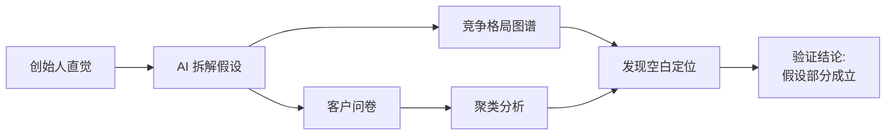
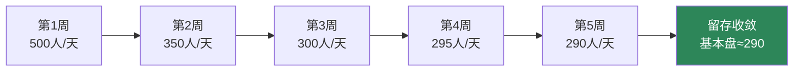
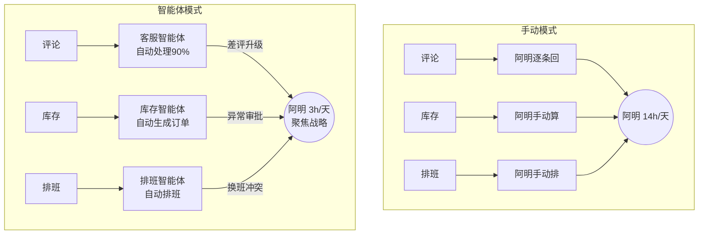
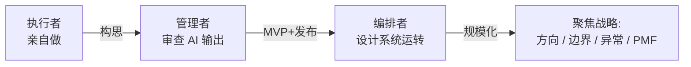
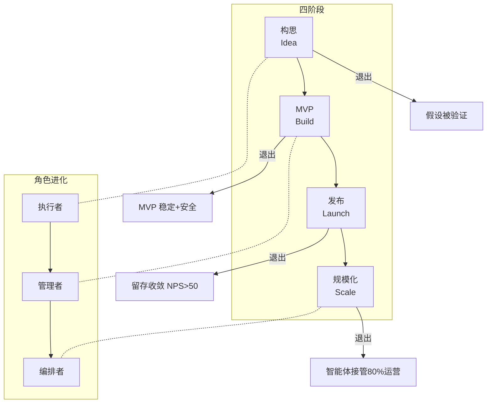

# 阿明的二次创业

> 从阿明用 AI 开第二家店，看 AI 原生创业的四阶段方法论

> **系列定位**：本篇是「阿明餐厅」系列的**续集四**。在[《厨房大换岗》](./27-ai-org-transformation.md)中，阿明学会了"AI 时代怎么用人"；本篇回到更早的时间线——如果阿明从一开始就用 AI 来创业，应该怎么做？

---

## 引言：从"凭经验开店"到"用 AI 创业"

阿明想把第一家店的成功经验复制到第二家店，听说 AI 能帮写代码、做市场分析、自动化运营。他决定做一个"AI 原生"的新店——从第一天起就让 AI 参与每一个环节。

但他很快发现，**AI 原生创业 ≠ 用 AI 写代码就完了。创始人的核心能力从"执行"变成"编排 + 判断"。**

这篇故事对应 AI 原生创业的四个核心阶段（构思 → MVP → 发布 → 规模化）和两个贯穿主题（工具选择 + 角色进化），共六章。

---

## 第一章：构思阶段 —— 用 AI 验证"要不要开第二家店"

阿明以前的习惯是"看中铺面就签合同"。第一家店运气好，选对了。但第二家不能靠运气。他打开 AI 工具，输入"帮我分析大学城附近开中式快餐有没有市场"，几分钟就拿到了一份结构化报告：周边 3 公里 4 所大学、8 万学生、23 家快餐、客单价 15-30 元、午间供不应求……

以前这种分析至少跑一周。现在，AI 把构思阶段的验证效率提升了一个数量级。

### AI 辅助验证的三板斧

**验证问题假设**：阿明假设"大学生需要平价、快速、健康的午餐"。AI 帮他拆解为三个可验证子命题——"平价"的锚点是多少？"快速"的期望是多长时间？"健康"的定义是什么？

**绘制竞争格局**：AI 按"价格-速度-品类"三维度画了竞争矩阵。阿明发现"中等价位 + 现炒 + 10 分钟出餐"几乎空白。

**AI 辅助客户发现**：AI 设计了访谈问卷并做了聚类分析——发现"出餐速度"和"能不能看到炒菜过程"是大学生最在意的两个点，而不是他以为的"价格最低"。

| 验证步骤 | 传统方式 | AI 原生方式 |
|----------|----------|------------|
| 问题假设 | 创始人拍脑袋，朋友聊天验证 | AI 拆解假设、生成验证方案、分析反面证据 |
| 竞争分析 | 实地走访 + 翻评论 | AI 爬取公开数据，自动生成竞争矩阵 |
| 客户发现 | 手动设计问卷 + 人工统计 | AI 设计问卷 + 自动聚类 + 生成洞察 |
| 决策周期 | 2-4 周 | 2-4 天 |



### AI 不能替你做的那个判断

分析做完后，阿明关掉屏幕，去大学城实地走了一下午。他发现一家刚关门的快餐店——因为房东要涨租 40%。那个"空白定位"可能不是没人做，而是做了也扛不住房租。

**AI 能帮你分析得更快、更全，但"这个风险我能不能承受"的判断，只有创始人能做。**

---

## 第二章：MVP 阶段 —— AI 帮写代码但埋技术债

确认了方向，阿明开始做 MVP。目标很简单：扫码点餐、在线支付、叫号取餐。以前找外包至少两个月，现在他打开 AI 编程工具，三天就生成了一个能跑的系统。阿明激动坏了。但"能跑"和"能稳定跑"是两码事。

### "它工作了" ≠ "它是对的"

上线第一周出了三个问题：午高峰 200 人同时扫码，数据库崩了；一笔支付回调丢失，顾客付了钱没收到餐号；搜索功能没做参数过滤，存在 SQL 注入风险。老朋友小林审查完代码叹气："框架有了，地基是泡沫做的。"

```python
# AI 生成的点餐接口 —— 看起来能用，但藏着三个雷

@app.route('/api/order', methods=['POST'])
def create_order():
    data = request.json
    # 雷1: 没有并发控制，高峰期超卖
    # 两人同时点最后一份宫保鸡丁，都能下单成功
    for item in data['items']:
        stock = db.execute(f"SELECT stock FROM menu WHERE id = {item['id']}")
        if stock > 0:
            db.execute(f"UPDATE menu SET stock = stock - 1 WHERE id = {item['id']}")

    # 雷2: 搜索框直接拼接 SQL，存在注入风险
    keyword = data.get('keyword', '')
    results = db.execute(f"SELECT * FROM menu WHERE name LIKE '%{keyword}%'")

    # 雷3: 没有幂等设计，网络抖动会导致重复下单
    order_id = generate_id()
    db.execute(f"INSERT INTO orders VALUES ('{order_id}', ...)")
    return {'order_id': order_id, 'status': 'created'}
```

### MVP 的三条生存法则

**架构与范围控制**：AI 不知道"什么该做什么不该做"。MVP 边界必须创始人来定——这个版本只做点餐和支付，不做会员、不做外卖。范围一膨胀，AI 会"高效地"做一堆不需要的东西。

**安全实践**：参数化查询、输入校验、权限控制不是"以后再说"的事，是 MVP 的底线。

**技术债预算**：AI 生成的代码一定有技术债。要分清哪些可以后面还（代码风格），哪些必须上线前还（安全漏洞、数据丢失风险）。

| 技术债类型 | 可以拖后 | 必须立刻修 |
|-----------|---------|-----------|
| 代码风格 | 命名不规范、缺注释 | —— |
| 性能 | 页面加载慢 0.5 秒 | 高峰期数据库崩溃 |
| 安全 | —— | SQL 注入、支付漏洞 |
| 架构 | 单体暂不拆分 | 无状态设计导致会话丢失 |

**AI 写的代码和实习生写的一样——速度快、热情高，但需要老手把关。创始人的判断力，是 AI 生成代码的最后一道防线。**

---

## 第三章：发布阶段 —— 区分真 PMF 和早期炒作

### 开业排到马路上，第三周客流掉 40%

靠着"现炒 + 快出餐 + 透明厨房"的定位，第二家店开业第一周天天排队。阿明看着翻台 8 轮的数据想："这不就是 PMF 了吗？"但第三周，客流掉了 40%。阿明慌了。

### 真 PMF 还是早期炒作？

AI 帮他搭建了一个**PMF 衡量框架**，核心是区分"好奇心驱动的一次消费"和"真实需求驱动的复购"：

**留存曲线**：第一周 500 个顾客，第二周回来多少？第三周呢？如果第四周趋于平稳（如 30%），说明找到了核心用户群。

**NPS（净推荐值，Net Promoter Score）**：推荐者占比减去贬损者占比。NPS > 50 说明有口碑效应。

**同期群分析（Cohort Analysis）**：按首次到店日期分组追踪复购率。后期群组留存更高，说明产品在变好。

| 信号类型 | 真 PMF 信号 | 炒作 / 虚假信号 |
|----------|------------|----------------|
| 客流趋势 | 热潮后稳定在基准线以上 | 持续下降不收敛 |
| 复购率 | 首月 30%+ 第二月复购 | 复购率 < 10% |
| NPS | NPS > 50，有自发口碑 | NPS < 20，推荐靠打折 |
| 用户反馈 | "你们什么时候开在我家附近？" | "味道还行，但没理由再来" |
| 获客成本 | 自然流量占比逐渐上升 | 全靠投放和打折拉人 |



阿明的数据：留存率从 60% 降到 32% 后稳定，NPS 58，后期群组留存反而更高。**不是炒作，是真的有 PMF。**

**真正的 PMF 不是"所有人都在排队"，而是"热度褪去后还有一群人持续回来"。AI 帮你算清楚这条线，但"基本盘够不够养活这家店"，还是创始人来判断。**

---

## 第四章：规模化 —— 智能体工作流替代创始人注意力

PMF 确认后，阿明开始考虑规模化——却发现自己成了最大瓶颈。每天 14 小时：查库存、回评论、排班、处理纠纷、核流水……真正做战略思考的时间不到 1 小时。

### 用智能体工作流"复制"创始人的注意力

AI 原生创业在规模化阶段的关键动作：**用智能体工作流（Agentic Workflows）替代创始人在重复性决策上的注意力。**

阿明为每个高频场景设计了智能体：

- **客服智能体**：好评自动感谢，中评自动跟进，差评升级到阿明亲自处理
- **库存智能体**：每天分析销售数据、预测需求、生成采购订单，异常单才需审批
- **排班智能体**：根据客流和员工偏好自动排班，换班冲突才需介入
- **品控智能体**：监控出餐时间和退菜率，异常自动预警



### 委托边界的设计原则

**完全委托**：好评回复、常规补货、标准排班——AI 自动处理，阿明看汇总。

**审批制**：大额采购、新员工录用、菜单调整——AI 出方案，阿明审批。

**亲自处理**：差评危机、供应商纠纷、战略决策——AI 只能提供信息，决策必须是人。

效果：每天 14 小时降到 6 小时，3 小时战略思考，3 小时关键决策。

**规模化的本质不是"做更多的事"，而是"让系统替你做不需要亲自做的事"。创始人的注意力是最稀缺的资源。**

---

## 第五章：工具矩阵 —— 什么阶段用什么 AI 工具

阿明踩了不少坑后总结出：**不同创业阶段需要不同类型的 AI 工具，用错了要么大材小用，要么力不从心。**

他把 AI 工具分成三类：

**对话式 AI（Chat）**：随叫随到的顾问。适合头脑风暴、信息检索、快速分析。"一问一答"，轻量探索。

**协作式 AI（Cowork）**：能干活的搭档。适合多步骤复杂任务——写长文档、数据分析、项目管理。"持续协作"，能记住上下文。

**代码式 AI（Code）**：编程搭档。适合写代码、审查代码、调试问题。"深度技术参与"。

| 创业阶段 | Chat（对话） | Cowork（协作） | Code（代码） |
|----------|-------------|----------------|-------------|
| 构思 | 头脑风暴、竞争分析 | 撰写商业计划书 | —— |
| MVP | 讨论技术方案 | 管理开发进度 | 生成代码、审查质量 |
| 发布 | 分析用户反馈 | 分析 PMF 数据 | 搭建数据看板 |
| 规模化 | 日常决策咨询 | 构建智能体工作流 | 开发自动化系统 |

阿明用餐厅类比：Chat 像**和前厅经理聊天**——快速获取信息；Cowork 像**和运营总监一起工作**——持续推进复杂任务；Code 像**和设备工程师一起干活**——动手做技术工作。

他犯过的错：构思阶段就用 Code 写系统（还没想清楚做什么就开始写代码），规模化阶段还用 Chat 做运营分析（数据量太大，对话式处理不了）。

**AI 工具不是"越高级越好"，而是"越匹配越好"。创始人的能力不在于会用多少工具，而在于知道什么时候该用哪个。**

---

## 第六章：创始人的角色进化 —— 从掌勺者到编排者

第二家店做到第六个月，一切运转良好，阿明却陷入迷茫。以前每天炒菜虽然累但有成就感，现在每天看报表、批方案，手上不沾锅铲，总觉得"自己好像什么都没做"。他问小林："我是不是被 AI 架空了？"小林笑了："你不是被架空，是升级了。以前你是掌勺的厨师，现在你是设计厨房的人。"

### 从"做事"到"设计做事的系统"

这是 AI 原生创业最核心的角色转变：**创始人从个人贡献者（Individual Contributor）变成编排者（Orchestrator）。**



### 什么时候保留人的判断，什么时候委托给 AI

阿明总结出一条原则：**可逆的、低风险的、有明确规则的决策委托给 AI；不可逆的、高影响的、需要价值判断的决策保留给人。**

| 决策类型 | 委托给 AI | 保留给人 |
|---------|----------|---------|
| 日常运营 | 库存补货、常规排班、好评回复 | —— |
| 客户体验 | 常规投诉、推荐菜品 | 差评危机、VIP 维护 |
| 产品方向 | 数据分析、A/B 测试执行 | 品类调整、定价策略 |
| 财务决策 | 日常流水核对、常规采购审批 | 大额投资、融资决策 |

这和[《从厨师到 CEO》](./07-from-chef-to-ceo.md)中的康威定律（Conway's Law）遥相呼应：当组织从小变大，管理者的角色从"做事"变成"设计做事的系统"。AI 原生创业只是把这个转变压缩到了 6 个月内完成。

**AI 原生创业的终极竞争力不是"AI 有多强"，而是"创始人能不能从做事的人变成设计系统的人"。放不了手的创始人，会成为自己公司最大的瓶颈。**

---

## 核心总结



| 阶段 | 目标 | AI 工具 | 常见陷阱 | 退出标准 |
|------|------|---------|---------|---------|
| 构思 | 验证问题假设和市场需求 | Chat | 只看 AI 分析不去实地验证 | 问题假设被用户数据证实 |
| MVP | 做出能验证核心价值的最小产品 | Code + Chat | "能跑"就当"能上线" | MVP 稳定运行，安全底线达标 |
| 发布 | 找到真实 PMF | Cowork + Chat | 把开业热度误判为 PMF | 留存曲线收敛，NPS > 50 |
| 规模化 | 用智能体替代创始人注意力 | Cowork + Code | 什么都委托或什么都不委托 | 智能体接管 80% 运营 |

### 一句心法

**AI 原生创业的核心不是"用 AI 替代人"，而是"用 AI 放大创始人的判断力"——先验证再投入，先自动化再规模化。**

---

## 延伸阅读

- [架构是"长"出来的](./02-system-architecture-evolution.md) —— 系统架构和创业一样，不是一步到位，是"长"出来的
- [当餐厅长出大脑](./01-ai-agent-architecture.md) —— AI Agent 的 7 大模块，规模化阶段智能体工作流的技术基础
- [高峰保卫战](./04-peak-traffic-defense.md) —— MVP 阶段扛住流量高峰的限流、降级策略
- [厨房装监控](./05-observability.md) —— 可观测性是衡量 PMF 的数据基础，"看不见就没法判断"
- [食安大检查](./06-security-architecture.md) —— MVP 阶段不能跳过的安全底线
- [厨房质检员](./08-qa-testing-strategy.md) —— AI 生成的代码更需要系统化测试
- [从接单到出餐](./09-cicd-devops.md) —— 从 MVP 到规模化的持续交付策略
- [菜单设计学](./10-api-design.md) —— 智能体协作依赖标准化 API，接口设计是规模化的地基
- [从厨师到 CEO](./07-from-chef-to-ceo.md) —— 康威定律与组织管理，创始人角色进化的组织视角
- [给产品经理的重构说明书](./03-refactoring-guide-for-pm.md) —— MVP 技术债的偿还策略
- [学徒的困境](./11-ai-learning-paradox.md) —— AI 时代创始人还需要懂技术吗？
- [数据厨房](./12-data-kitchen.md) —— PMF 分析依赖可靠的数据管道
- [前厅翻修记](./13-frontend-renovation.md) —— MVP 的前端体验同样重要
- [阿明的省钱经](./14-cloud-finops.md) —— 创业阶段精打细算，AI 工具的 Token 费用也是成本
- [差评危机](./15-incident-response.md) —— 发布后差评和故障怎么处理的实战方法论
- [外卖大战](./16-performance-optimization.md) —— MVP 性能优化，高峰期系统不能崩是底线
- [传菜窗口的智慧](./20-realtime-eventdriven.md) —— 智能体之间的异步通信，消息队列是规模化工作流的基础
- [十家店的烦恼](./18-distributed-puzzles.md) —— 规模化后多门店数据一致性的分布式挑战
- [阿明的加盟帝国](./19-saas-multitenant.md) —— 从一家店到加盟体系的多租户架构
- [厨房实况直播](./20-realtime-eventdriven.md) —— 事件驱动让智能体实时感知运营变化
- [一个厨房，四个门面](./21-multiplatform-architecture.md) —— 多渠道获客的多端架构设计
- [懂你的菜单](./22-search-recommendation.md) —— 个性化推荐提升复购率，发布阶段提升 PMF 的利器
- [菜谱标准化之路](./07-from-chef-to-ceo.md) —— SOP 不沉淀，智能体就无法接管运营
- [仓库搬家不停业](./24-database-migration.md) —— 从 MVP 到规模化的数据库迁移与架构升级
- [预制菜还是现炒](./25-lowcode-platform.md) —— 智能体工作流搭建：低代码编排 vs 手写 Pipeline
- [阿明出海记](./26-globalization.md) —— 第二家店开在另一个城市？全球化思维从创业第一天就要有
- [厨房大换岗](./27-ai-org-transformation.md) —— AI 时代怎么用人，和本篇的角色进化互为补充
- [会自我进化的厨房](./29-self-evolving-company.md) —— 规模化之后从自动化到自治的系统进化
- [AI 的"黑暗料理"](./30-ai-hallucination-safety.md) —— AI 幻觉防范，创业中 AI 给了错误的市场分析怎么办

---

## 结语

阿明的第二家店最终成功了。开业半年后，日均客流稳定在 290 人左右，NPS 达到 62，三个智能体接管了 80% 的日常运营。

但他学到的最重要的一课，不是"AI 能做什么"，而是**"AI 不能替我做什么"**。AI 不能替他判断"这家店值不值得开"——那是创始人的勇气。AI 不能替他决定"品质底线在哪里"——那是创始人的价值观。AI 不能替他在差评危机中真诚道歉——那是创始人的担当。

**AI 原生创业的真正奥义，是用 AI 把创始人从琐事中解放出来，让他有更多时间做"只有他能做的事"。**

下次当你考虑用 AI 创业时，不妨问自己：

- 我验证过问题假设吗？还是 AI 告诉我"有市场"我就信了？
- 我的 MVP 里，有哪些技术债是"上线前必须还的"？
- 开业热度褪去后，我的留存曲线收敛了吗？
- 我是公司的瓶颈吗？哪些决策可以委托给系统？
- 我是在"用 AI 做得更快"，还是在"用 AI 想得更清楚"？

> 好的 AI 原生创业，不是"用 AI 做得更快"，而是"用 AI 想得更清楚"。

← [返回系列导读](./index.md)
