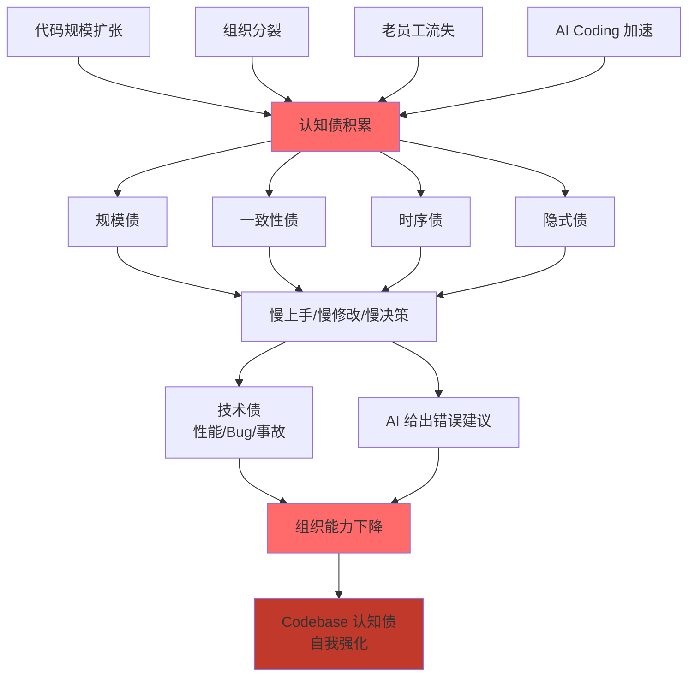

# Codebase 认知债

> 从阿明的 500 道菜 50 万行代码，看 AI 时代最大的隐形负债 —— 认知债

> **系列定位**：本篇是「阿明餐厅」系列的**续集七**。在前 28 篇文章中，我们谈过[技术债](./03-refactoring-guide-for-pm.md)、[架构演进](./02-system-architecture-evolution.md)、[可观测性](./05-observability.md)、[AI Agent](./01-ai-agent-architecture.md)。但 2026 年的 Tech Radar 浮现了一个新词汇 —— **Codebase 认知债（Cognitive Debt）**：代码已经"跑得动"了，却没人"读得懂"。这是 AI 时代特有的负债形式，比传统技术债更隐蔽、更危险。

---

## 引言：500 道菜，5 人都能做；500 道菜，500 人也做不全

阿明的菜单从最早的 5 道菜，扩张到了 500 道。代码仓库从 1 千行增长到 50 万行。

第一年，阿明信心满满：业务增长这么快，代码也跟着长，应该是个好事。

第五年，问题来了。

新入职的工程师小林，要在订单模块加一个"拼单"功能。**他花了两周才摸清楚订单模块的现状**：

- 订单创建有 3 条路径：API 入口、小程序入口、后台手工补单
- 每条路径的"取消订单"实现都不一样
- 订单状态机散落在 5 个文件里，每个文件的字段命名都不一致
- 关键的一段"加锁逻辑"没有任何注释，老员工说"千万别动，当时调了 3 天"

小林崩溃了："这代码能跑得动，但我**看不懂**，我**不敢动**。我每一次提交都担心把别的地方搞坏。"

老陈说："这就是 **Codebase 认知债**。它不是技术债 —— 技术债是'跑得慢/容易崩'。认知债是'看不懂/不敢动'。**技术债是机器的痛，认知债是人的痛。**"

更麻烦的是 2026 年，AI Agent 写代码越来越普及。**AI 比人更快地"看懂"代码吗？不，AI 更快地"假装看懂"代码**。认知债让 AI 给出看起来合理、实际错误的建议，把隐性 bug 加速放大。

阿明第一次意识到：Codebase 认知债，是 AI 时代比技术债更危险的一种负债。

---

## 第一章：什么是 Codebase 认知债

**Codebase 认知债（Cognitive Debt）** 是指：**把代码读懂、改对所需的认知资源，已经超过了一个新成员（人 或 AI）能合理承担的上限。**

它不是 Bug，不是性能问题，不是安全漏洞 —— 这些是"机器的痛"。认知债是"人的痛"：新人需要花数周甚至数月才能"上手"；老员工改一段代码要反复确认"会不会影响别的地方"；AI 给出错误的建议而没人发现。

餐厅类比一下：

```text
菜单：
  5 道菜 → 老厨师全记在脑子里，5 分钟点单，10 分钟出菜
  50 道菜 → 老厨师要查菜谱，5 分钟点单，15 分钟出菜
  500 道菜 → 没人能记住所有菜，新员工要查 3 个系统才能点单
  
代码：
  1 万行 → 新员工 1 周上手
  10 万行 → 新员工 1-3 个月上手
  50 万行 → 新员工 3-6 个月才能独立贡献，且仍然"不敢动"核心模块
```

认知债和技术债的根本区别：

| 维度 | 技术债 | 认知债 |
|------|--------|--------|
| 受害方 | 机器（性能、稳定性） | 人 / AI（理解力、信心） |
| 表现 | 慢、崩、占资源 | 慢上手、慢修改、慢决策 |
| 度量 | 性能指标、故障率、覆盖率 | 新人上手天数、修改前阅读时间 |
| 修复方式 | 重构代码 | 重构代码 + 重构文档 + 沉淀决策 |
| 隐藏深度 | 较浅（运行即暴露） | 极深（要"读"才暴露） |

阿明一针见血：**"技术债让机器痛苦，认知债让人/AI 痛苦；前者影响线上，后者影响组织能力。"**

---

## 第二章：认知债的 4 大来源

阿明带着团队做了一个内部调研：让 10 个工程师各花一周时间，列出"看不懂的代码"。结果，认知债的来源高度集中在 4 类。

### 2.1 规模债 —— 代码物理膨胀

最直观的来源：代码行数、文件数、模块数。

阿明的代码规模演进：

```text
2018 - 1 万行：
  - 1 个 Java 项目，1 个 MySQL
  - 新人 1 周上手

2021 - 10 万行：
  - 拆成 5 个微服务，2 个存储
  - 新人 1-3 个月上手

2024 - 30 万行：
  - 12 个微服务，5 个存储，多个中间件
  - 新人 3-6 个月上手
  - 跨服务调用链 8-15 层

2026 - 50 万行：
  - 20 个微服务，10 个存储，3 个消息队列
  - 新人 6 个月仍然"看不懂"
  - 一次简单修改要 cross-check 5+ 个服务
```

但**单纯规模不是问题**。50 万行写得好的代码（如 Linux Kernel），新人能从 5 个核心文件开始，逐步扩展认知。规模债的真正问题是**认知扩张速度跟不上代码扩张速度**。

餐厅类比：50 道菜、500 道菜都不怕，怕的是 500 道菜还**没有索引、没有分类、命名混乱**。

### 2.2 一致性债 —— 同名不同义，同义不同名

小林吐槽："我搜 `cancelOrder`，搜出来 7 个函数，每个实现都不一样。"这就是典型的**一致性债**。

常见症状：

- **同名不同义**：`getOrder()` 在 A 模块返回完整订单，在 B 模块只返回订单 ID
- **同义不同名**："用户" 在 A 模块叫 `user`，在 B 模块叫 `customer`，在 C 模块叫 `account`
- **同类不同型**：`price` 在 A 处是 `int`（分），在 B 处是 `float`（元），在 C 处是 `string`（带货币符号）
- **相同模式不同实现**：A 团队用 Saga 处理分布式事务，B 团队用 TCC，C 团队用 2PC + 本地消息表

一致性债的可怕之处是**局部合理、全局混乱**。每个团队写自己代码时都"没问题"，但放在一起就是灾难。**它是康威定律的"反派"：组织分裂导致代码分裂，代码分裂导致认知分裂。**

这与[《从厨师到 CEO》](./07-from-chef-to-ceo.md)中讨论的"团队拓扑"互为表里：一致性债，本质是"4 种团队类型缺乏统一语言"的产物。

### 2.3 时序债 —— 过去的决策无人记得

小林在订单模块看到一段奇怪的代码：

```java
if (order.getUserId() % 7 == 0) {
    // 神秘分支
    doSomethingMagic();
}
```

他问了一圈，没人知道为什么。**代码能看到 How，但看不到 Why。**

这就是**时序债** —— 过去的决策（架构选型、参数选择、模式取舍）只存在于当事人的脑子里或散落的邮件里。当事人离职、邮件归档、记忆淡忘，**决策就"消失"了**，只剩代码这个"果"。

餐厅类比：老厨师王师傅知道"红烧肉必须加冰糖不用白糖"是因为"用白糖上色不亮"，但他没写下来。5 年后小林接手，照着"加白糖"试做，味道不对，但不知道为什么。

**时序债是 4 类中唯一的"时间维度"债**。它和[《从厨师到 CEO》](./07-from-chef-to-ceo.md)第四章讲的 ADR（架构决策记录）正相关 —— 没有 ADR，时序债就会指数级增长。

### 2.4 隐式债 —— 代码"说"一套，"做"一套

最危险的一类。代码注释、文档、命名都"说"它做了 A，**实际做了 A+B+C**。

```java
/**
 * 取消订单
 */
public void cancelOrder(Long orderId) {
    // 实际还做了：退款 + 释放库存 + 通知商家 + 记录审计日志
    // 还有个隐藏的 if：用户是 VIP 时不发通知（因为 VIP 不想被打扰）
    // 也没有任何测试覆盖
}
```

注释说"取消订单"，但实际是"取消订单的 5 个副作用"。新人按注释调用 `cancelOrder()`，**会触发 5 个未预期的副作用**。

隐式债的 3 种伪装：

- **注释说一套，代码做另一套**（最常见）
- **类型签名说一套，运行时做另一套**（如返回 `Optional<T>` 但实际可能返回 `null`）
- **文档说一套，配置做另一套**（如 README 说用 MySQL，实际配置连了 PostgreSQL）

隐式债的修复成本极高 —— 你要先发现隐式，再理解隐式，再补上文档或修正代码。

餐厅类比：菜谱写"红烧肉 30 分钟"，实际"老周的红烧肉 30 分钟，王师傅的 45 分钟，张师傅的 20 分钟" —— **菜谱说的和厨房做的对不上**。

---

## 第三章：认知债 vs 技术债 —— 因与果

阿明让团队做了一次复盘：所有"线上事故"中，有多少和认知债有关？

结果出乎意料：**60% 的 P0/P1 事故，其根本原因都指向某个"认知债"**：

- 事故 A：工程师不知道某段代码有隐式调用，修改时没考虑 → 隐式债
- 事故 B：工程师不知道某参数的历史原因，盲目"优化" → 时序债
- 事故 C：3 个团队各自实现了一个"用户中心"模块，互相覆盖 → 一致性债
- 事故 D：新人改了核心路径导致全站故障，因为没人预警这是"核心" → 规模债 + 知识断层

阿明画了一个因果图：

```text
┌─────────────────────────────────────────────┐
│         Codebase 认知债（隐性负债）         │
│   规模 / 一致性 / 时序 / 隐式 4 大来源      │
└─────────────────────────────────────────────┘
                     │
        ┌────────────┼────────────┐
        ▼            ▼            ▼
   慢上手       慢修改       慢决策
   （新人 6+月）（不敢动）  （靠老员工）
        │            │            │
        └────────────┼────────────┘
                     ▼
        ┌────────────────────────────────┐
        │     技术债（显性负债）          │
        │  性能 / Bug / 安全 / 可靠性     │
        └────────────────────────────────┘
                     │
                     ▼
                线上事故
```

**认知债是"因"，技术债是"果"**。但人们常常只修"果"（重构代码修 Bug），不修"因"（沉淀决策、统一规范、写活文档）。结果 Bug 越修越多，老员工越来越累。

阿明的心得：**"修代码容易，修认知难。但不修认知，技术债永远修不完。"**

### 认知债的"复利"特性

认知债比技术债更可怕，因为它有"复利"效应：

- 认知债 → 新人不敢动 → 老员工超负荷 → 老员工离职 → 认知债加重
- 认知债 → 修改前要 cross-check 大量文件 → 修改慢 → 业务等不及 → 临时方案 → 代码更乱
- 认知债 → 团队间互相"甩锅" → 协作成本高 → 团队间设立"边界" → 一致性债加剧

**认知债是"自我强化的债务循环"**。技术债可以靠"一次性大重构"还清，认知债必须靠"持续工程化实践"才能遏制。

---

## 第四章：度量认知债

阿明意识到："**看不见的东西，就不会被管理。**"（这句心法出自[《从厨师到 CEO》](./07-from-chef-to-ceo.md)第五章）老陈设计了 4 个可量化的认知债指标。

### 4.1 上手时间（Onboarding Time）

定义：新员工从入职到能独立提交第一个 PR 所需的天数。

| 阶段 | 目标值 | 警戒线 |
|------|--------|--------|
| 入职 1 周 | 完成环境配置 | > 2 周 = 工具/文档债 |
| 入职 1 月 | 提交第一个小 PR | > 2 月 = 规模债 |
| 入职 3 月 | 独立完成中等功能 | > 6 月 = 一致性/隐式债 |
| 入职 6 月 | 独立完成跨模块功能 | > 12 月 = 严重认知债 |

餐厅类比：老厨师带新厨师，从"能切菜"到"能独立做一道菜"要多久？

### 4.2 修改前阅读时间（Pre-Change Reading Time）

定义：工程师修改一段代码前，需要先"读懂相关代码"所花的平均时间。

衡量方法：在 IDE/编辑器埋点，统计"打开文件 → 提交" 的时长分布。

```text
健康分布：
  < 30 分钟的修改  ─── 占 70%（简单修改）
  30-120 分钟      ─── 占 25%（中等修改）
  > 120 分钟       ─── 占 5%（困难修改）

认知债过高：
  < 30 分钟        ─── 仅占 20%
  30-120 分钟      ─── 占 40%
  > 120 分钟       ─── 占 40%（困难修改太多）
```

阿明的真实数据：2025 年新员工的平均修改前阅读时间是 2021 年的 3 倍 —— 表面看是"代码质量下降"，本质是"认知债上升"。

### 4.3 跨服务调用链深度（Cross-Service Call Chain Depth）

定义：从用户请求入口到业务完成的调用链所跨越的服务/模块数。

| 深度 | 风险等级 | 餐厅类比 |
|------|----------|----------|
| 1-3 层 | 健康 | 厨师直接做完一道菜 |
| 4-7 层 | 中等 | 厨师做完要 3 个人协同 |
| 8-15 层 | 警戒 | 1 道菜要 5 个部门协同 |
| 15+ 层 | 危险 | 1 道菜要 10 个部门协同，几乎不可能不出错 |

深度越深，认知债越重 —— 因为"理解一次请求的全貌"需要熟悉所有相关服务。

### 4.4 "不敢动"模块占比（Untouchable Module Ratio）

定义：90 天内被修改过的文件数 / 总文件数。占比越低，说明大量模块"没人敢动"。

```text
健康：> 60% 的文件 90 天内有修改
警戒：30-60% 的文件 90 天内有修改
危险：< 30% 的文件 90 天内有修改（大量"僵尸代码"）
```

阿明查到 30% 的模块超过 1 年没被修改，但仍在被依赖 —— 这是认知债的"高危区"。

### 认知债仪表盘

```text
Codebase 认知债健康度看板（月度）：
┌──────────────────────────────────────────┐
│  新人上手时间    ████░░░░░░░░░░  110 天  │
│  修改前阅读时间  ██████░░░░░░░░  75 分钟 │
│  调用链深度      ████████████░░  12 层   │
│  可改模块占比    ████████░░░░░░  70%     │
│                                          │
│  认知债来源 TOP3：                         │
│    1. 隐式债（注释与实现不一致）         │
│    2. 时序债（无 ADR，老员工流失）       │
│    3. 一致性债（跨服务命名/模式混乱）   │
│                                          │
│  P0/P1 事故中认知债相关占比：60%          │
└──────────────────────────────────────────┘
```

**度量不是目的，是改进的起点。** 阿明看到"修改前阅读时间 75 分钟"这个数据后，立刻立项做"模块化拆分 + 关键模块 ADR 补全"。

---

## 第五章：AI 时代为什么认知债更危险

2026 年，阿明的团队大规模使用 AI Agent 写代码（基于[《当餐厅长出大脑》](./01-ai-agent-architecture.md)的架构）。AI 写代码的速度是人的 5-10 倍，但 **AI"看不懂"代码的速度也是人的 5-10 倍**。

### 5.1 AI 的"假装看懂"

老陈说了一句让阿明惊出一身冷汗的话：**"AI 不是'读懂'代码，AI 是'统计相关性'。认知债让 AI 的统计相关性变成统计错觉。"**

案例：阿明让 AI 给订单模块加"拼单"功能。AI 看了 1 小时代码，给出方案：

- 调用 `createOrder()` 创建主单
- 循环调用 `addItem()` 给每个子单加商品
- 完成后调用 `cancelOrder()` 取消主单

听起来很合理，对吧？**但 `cancelOrder()` 隐藏了"退款 + 释放库存 + 通知商家"的副作用。** AI 的方案会导致每个子单都被退款。

为什么会这样？因为 AI 看的是"代码做了什么"，不是"代码为什么这么做"。**当代码里没有注释、没有 ADR、没有"为什么"时，AI 只能基于表面文本模式推断意图，认知债让这种推断极其危险。**

### 5.2 上下文窗口不是"理解力"

很多人误以为：**"上下文窗口大 = AI 懂得多"**。这是 2026 年最大的认知误区。

```text
GPT-4 类模型：8K-128K tokens 上下文
Claude 类模型：200K tokens 上下文
Gemini 类模型：1M-2M tokens 上下文

阿明代码仓：50 万行 ≈ 2.5M tokens
```

理论上 Gemini 能一次性"喂"进阿明的全部代码。但实际上：

- **注意力稀释**：200K+ 的上下文，模型对早期内容的注意力显著下降
- **"lost in the middle" 效应**：模型对中间部分的理解最差
- **缺乏全局语义**：模型看到的不是"系统"，是"50 万行字符"
- **无法执行/调试**：模型不能像人一样"跑一下试试"

**上下文窗口是"能看到多少"，不是"能理解多少"。** 认知债让 AI 看到的"代码"和真实"系统"差距更大。

### 5.3 RAG 和 Codebase Index 的边界

为了应对上下文限制，2026 年的主流做法是 **RAG（Retrieval-Augmented Generation）+ Codebase Index**：

```text
工作流：
  工程师问 AI："订单模块的取消逻辑在哪？"
  → RAG 在 codebase 中检索相关文件
  → 找到 5 个相关文件
  → 喂给 AI 上下文
  → AI 基于这 5 个文件给出建议
```

但 RAG 解决的是"找到相关代码"，不是"理解相关代码"。**当认知债严重时，RAG 找到的 5 个文件本身就是混乱的、矛盾的、隐式的** —— AI 给出错误建议的概率反而上升。

阿明的经验：**RAG 的质量上限 = 认知债的下限**。认知债不修，RAG 也不会真正帮上忙。

### 5.4 认知债的"AI 加速"效应

最可怕的是，AI 写代码会**主动加深认知债**：

- AI 倾向于模仿现有代码风格（连坏风格一起继承）
- AI 倾向于添加"小聪明"逻辑（让隐式债更严重）
- AI 不会主动写 ADR（让时序债更严重）
- AI 不会主动抽象和统一（让一致性债更严重）

**AI 是认知债的"加速器"：它放大生产力的同时，也在放大混乱。** 没有良好的工程化实践，AI Coding 只是"更快地写出更难懂的代码"。

这呼应了[《当餐厅长出大脑》](./01-ai-agent-architecture.md)中的核心观点：**可控比聪明更重要**。认知债让"可控"变得几乎不可能。

---

## 第六章：6 大降低认知债的策略

阿明带着团队用了 18 个月，把认知债从"高危"降到"中等"。核心是 6 大策略。

### 6.1 一致性公约 —— 用"宪法"约束命名和模式

认知债的最大单一来源是"不一致"。阿明建立了一份**《代码宪法》**（Code Constitution）：

```text
《代码宪法》核心条款：

1. 命名一致性
   - 用户：统一用 "user"（不用 customer/account/member）
   - 订单：统一用 "order"（不用 o/ord/OrderEntity）
   - 货币：统一用 integer "cents"（不用 float/string）
   - 时间：统一用 ISO 8601 + UTC（不用 timestamp/string）

2. 模式一致性
   - 分布式事务：统一用 Saga（不用 2PC/TCC/本地消息表）
   - 错误处理：统一用 Result<T, Error>（不用 exception + null）
   - 配置：统一用 Apollo/Nacos（不用 .yml + 环境变量）

3. 边界一致性
   - 每个服务的"公开 API" 必须用 OpenAPI 定义
   - 每个服务的"内部实现" 不允许被其他服务直接依赖
```

**关键：公约不是"建议"，是"CI 流水线强制"**。lint 工具检查命名，架构测试检查依赖，PR 模板要求引用公约条款。

餐厅类比：10 家店的"红烧肉"必须用同一份菜谱、同一份配料表 —— 不允许"老周版红烧肉"和"王师傅版红烧肉"在菜单上同时出现。

### 6.2 渐进式文档 —— ADR + Why 文档 + 关键决策注释

时序债的唯一解药是**记录"为什么"**。阿明要求每个 PR 回答 3 个问题：

```text
PR 模板（必填）：

1. 我做了什么？（What）—— 代码 diff 已经清楚，但用一句话总结
2. 我为什么这么做？（Why）—— 关键决策的"上下文"
3. 我考虑了哪些替代方案？（Alternatives）—— 为什么不选它们
```

**重要的决策写成 ADR，存到 `docs/adr/`**，作为项目的一部分。这与[《从厨师到 CEO》](./07-from-chef-to-ceo.md)第四章的 ADR 实践一脉相承。

此外，阿明还引入了**"Why 注释"** —— 注释不写"做什么"（代码自己会说话），只写"为什么"：

```java
// 错误示例：
// 取消订单
public void cancelOrder(Long orderId) { ... }

// 正确示例：
// 取消订单的 5 个副作用必须保持原子性（见 ADR-0042）：
// 1. 订单状态变更
// 2. 退款（异步，由 PaymentService 监听 OrderCancelled 事件）
// 3. 释放库存（异步，由 InventoryService 监听）
// 4. 通知商家（异步，但 VIP 用户不发）
// 5. 审计日志（同步，必须成功）
public void cancelOrder(Long orderId) { ... }
```

### 6.3 模块化与边界清晰 —— 限制"认知扩张速度"

认知债的核心是"理解整个系统"。但**没有一个人需要理解整个系统**，需要的是"理解自己负责的部分 + 理解依赖的接口"。

阿明推行的模块化原则：

```text
模块化三层公约：

1. 业务模块（Domain Module）
   - 命名：<domain>.<sub-domain>（如 order.core、order.api）
   - Owner：流对齐团队
   - 依赖：只允许依赖其他模块的"公开 API"
   - 文档：必须包含 module.md（职责、依赖、关键决策）

2. 共享内核（Shared Kernel）
   - 命名：common.*（如 common.types、common.errors）
   - Owner：平台团队
   - 依赖：被业务模块单向引用，不允许反向依赖
   - 文档：必须包含 API 兼容性承诺

3. 技术服务（Technical Service）
   - 命名：infra.*（如 infra.db、infra.cache）
   - Owner：平台团队
   - 依赖：业务模块不直接依赖，通过 IDP 抽象
   - 文档：自动化生成（来自 OpenAPI/Proto 定义）
```

关键指标：**单个模块的代码行数不超过 1 万行，公开 API 不超过 50 个**。超出的模块必须拆分。

这与[《架构是"长"出来的》](./02-system-architecture-evolution.md)第八章讲的"按业务能力划分限界上下文"完全一致 —— DDD 的限界上下文，本质是"认知的边界"。

### 6.4 抽象层次的统一 —— 一个文件只做一件事

认知债的"杀手"是"一个文件里做 3 个层次的事"：

```java
// 反例：一个方法做了 3 层抽象
public OrderDTO createOrder(CreateOrderRequest req) {
    // 1. HTTP 层：解析 token
    String userId = jwtService.parse(req.getToken());
    
    // 2. 业务层：业务规则
    if (userService.isVip(userId)) {
        // VIP 逻辑
    }
    
    // 3. 数据层：SQL 拼接
    String sql = "INSERT INTO orders ...";
    jdbcTemplate.update(sql, ...);
}
```

小林看这段代码，要同时理解 3 个层次（HTTP/业务/数据），认知负载爆炸。

阿明推行**"单一抽象层次原则（SLAP, Single Level of Abstraction Principle）"**：

```java
// 正例：每个方法只做同一抽象层次的事
public OrderDTO createOrder(CreateOrderRequest req) {
    String userId = authService.extractUserId(req);
    Order order = orderService.create(userId, req.getItems());
    return orderMapper.toDTO(order);
}
```

**好处**：阅读代码时，可以"折叠"细节，只看当前关心的层次。认知负载立刻降一半。

### 6.5 "Code Tour" 制度 —— 把隐性知识"导游化"

老员工脑子里有大量"隐性知识"（如"这个模块千万别动"、"这个参数是为某次大促调的"），新人无法从代码中获取。

阿明推行 **"Code Tour"（代码导游）**制度：

```text
Code Tour 模板（每个核心模块必须有一份）：

模块：order.core
导游：张师傅（资深工程师）

第一站：架构总览（5 分钟）
  - 3 张图：模块关系、调用链、状态机
  - 一句话职责："管理订单生命周期"

第二站：核心数据结构（5 分钟）
  - Order 实体 7 个字段，重点讲 3 个易错字段
  - "orderState" 字段：5 个枚举值，重点讲 PROCESSING 的特殊语义

第三站：常见修改场景（10 分钟）
  - 加字段：3 步走（实体 + 持久化 + API 兼容性）
  - 改状态机：必须先看 ADR-0023

第四站：血泪教训（5 分钟）
  - "千万不要" 列表：5 个真实踩坑案例
  - "如果 X 报错"：3 个常见问题的快速排查

总时长：25 分钟，新人 1 周内必看
```

**Code Tour 制度把"老员工脑子里的知识"沉淀为"团队资产"**。它不替代 ADR，但补充了 ADR 缺失的"经验层"信息。

这与[《从厨师到 CEO》](./07-from-chef-to-ceo.md)第五章的 Onboarding 制度形成闭环 —— Onboarding 提供"上手清单"，Code Tour 提供"深度理解"。

### 6.6 活文档系统 —— 让文档与代码同步演进

文档最大的问题是**"写完就过时"**。阿明引入"活文档"系统：

```text
活文档的三层实践：

1. 代码即文档
   - 类型签名强制表达意图（不要靠注释）
   - OpenAPI/Proto 自动生成 API 文档
   - 测试用例即使用文档（新人读测试 = 读使用方式）

2. 决策即文档
   - ADR 强制与代码同仓库、PR 流程
   - "Code Tour" 嵌入 module.md

3. 度量即文档
   - 自动统计"模块修改频率""文档新鲜度"
   - 过时文档自动标记 ⚠️
   - 文档"健康度"是 Owner 考核指标
```

这与[《从厨师到 CEO》](./07-from-chef-to-ceo.md)第四章的 Docs-as-Code 完全一致 —— 文档享受代码的工程化待遇。认知债问题的终极解法，本质是**让"代码 + 文档 + 决策"作为整体演化**。

---

## 核心总结：Codebase 认知债



| 挑战 | 解决方案 | 核心思想 |
|------|----------|----------|
| 认知债看不见 | 4 大度量指标 | 上手时间 + 阅读时间 + 调用链深度 + 可改模块占比 |
| 命名/模式混乱 | 一致性公约 | 命名 + 模式 + 边界三层宪法，CI 强制 |
| 决策理由消失 | ADR + Why 注释 | 代码能说 How，文档说 Why |
| 模块边界不清 | 模块化三层公约 | 业务模块 + 共享内核 + 技术服务 |
| 抽象层次混乱 | 单一抽象层次 | 一个方法只做同一层次的事 |
| 隐性知识断层 | Code Tour 制度 | 把老员工脑子里的知识"导游化" |
| 文档过时 | 活文档系统 | 代码即文档 + 决策即文档 + 度量即文档 |
| AI 加剧认知债 | RAG + 上下文治理 | 认知债下限 = RAG 质量上限 |

### 一句心法

**AI 时代最大的隐形负债不是技术债，而是认知债。代码能跑只是及格，能被理解才能传承。Codebase 的可读性，就是组织未来的生产力。**

---

## 延伸阅读

- [架构是"长"出来的](./02-system-architecture-evolution.md) —— DDD 与限界上下文，是"认知边界"的工程化体现
- [当餐厅长出大脑](./01-ai-agent-architecture.md) —— AI Agent 的"可控"前提是 codebase 可被理解，否则 AI 给出错误建议
- [给产品经理的重构说明书](./03-refactoring-guide-for-pm.md) —— 技术债的治理逻辑同样适用于认知债
- [厨房装监控](./05-observability.md) —— 可观测性是"机器的可读性"，认知债是"人的可读性"，方法论相通
- [从厨师到 CEO](./07-from-chef-to-ceo.md) —— ADR、Docs-as-Code、Code Tour、Onboarding 都是降低认知债的工程化手段
- [厨房质检员](./08-qa-testing-strategy.md) —— 测试用例即使用文档，是"代码即文档"的典范
- [菜单设计学](./10-api-design.md) —— OpenAPI 是"接口即文档"，RAG/Codebase Index 的检索基础
- [差评危机](./15-incident-response.md) —— 60% 的 P0 事故根因是认知债，故障复盘要追溯到认知层
- [厨房实况直播](./20-realtime-eventdriven.md) —— 异步消息的设计决策尤其需要 ADR，否则时序债最严重
- [懂你的菜单](./22-search-recommendation.md) —— 搜索/推荐算法策略是"最难写但最有价值"的文档，认知债最重灾区
- [会自我进化的厨房](./29-self-evolving-company.md) —— Agent Loop 中的"可读性"是 AI 时代组织的基础设施
- [AI 的"黑暗料理"](./30-ai-hallucination-safety.md) —— AI 幻觉与认知债：AI 在认知债严重的代码上幻觉率显著上升

---

## 结语

阿明在团队内部发了一封邮件，主题是"Codebase 是公司的资产，不是工程师的负担"：

> 各位同事：
>
> 我们花了很多精力治理性能、安全、可观测性，但很少讨论"代码的可读性"。
>
> 2026 年的现实是：AI 让写代码更快了，但**代码的可读性没有自动变好**。AI 模仿的是现有的混乱，而不是未来的清晰。Codebase 认知债是 AI 时代的隐形负债 —— 它让新人上手更慢、修改更慢、决策更慢、修复更慢，最终让组织能力下降。
>
> 治理认知债不是"写更多文档" —— 文档本身也会过时。治理认知债是"**让代码 + 文档 + 决策作为整体演化**"：用一致性公约约束命名和模式，用 ADR 记录"为什么"，用 Code Tour 把老员工脑子里的知识沉淀为团队资产，用活文档系统让代码与文档同步演进。
>
> 一句话：**代码能跑只是及格，能被理解才能传承。Codebase 的可读性，就是组织未来的生产力。**
>
> 下次当你觉得"这段代码真难看懂"时，别沉默 —— 这是认知债在向你发出信号。问自己 5 个问题：
>
> 1. 这个模块有没有"一致性公约"？命名、目录、错误处理是否符合团队规范？
> 2. 这个决策有没有"ADR"？为什么这样做，而不是那样做，团队成员都查得到吗？
> 3. 这个复杂模块有没有"Code Tour"？老员工的脑子里的隐性知识有沉淀吗？
> 4. 这篇文档是"活文档"还是"死文档"？代码改了文档会自动跟着改吗？
> 5. 这个 Onboarding 流程，新人多久能独立交付第一个 PR？比上季度快还是慢？

阿明看着仪表盘上的数字，欣慰的是上手时间从 110 天降到了 75 天、调用链深度从 12 层降到了 9 层。但更让他欣慰的是：团队的工程师开始主动提"这个模块能不能加个 Code Tour"、"这个决策要不要写 ADR"。

**认知债治理的最高境界，不是"治理认知债"，而是"让治理认知债成为文化"。**

← [返回系列导读](./index.md)
