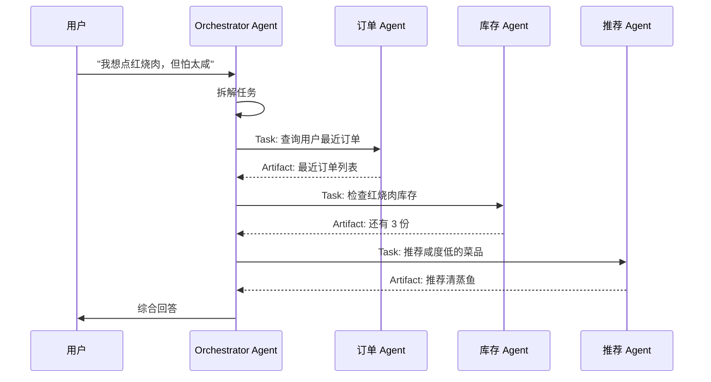
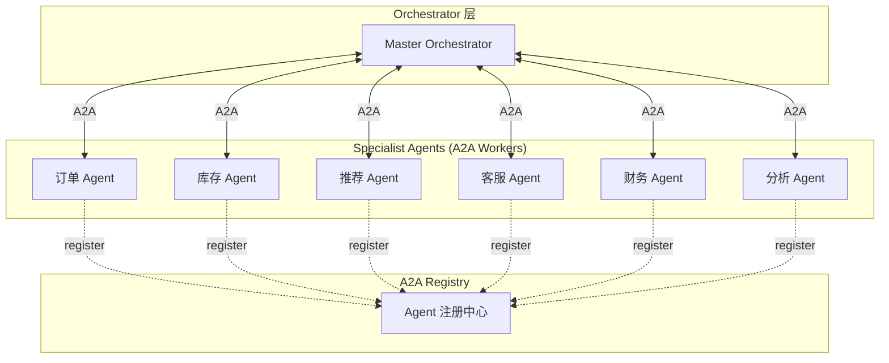
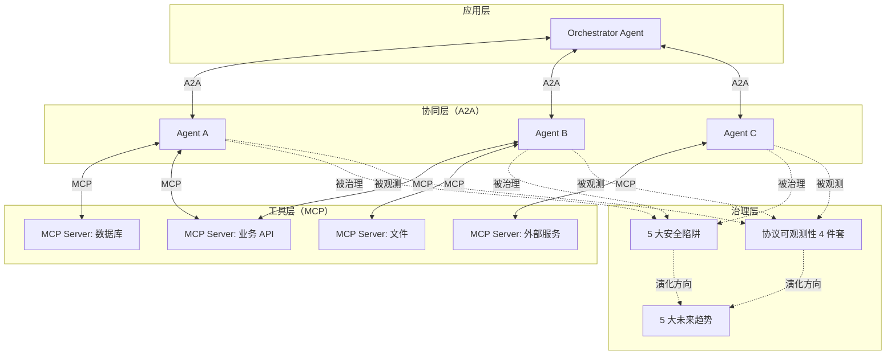

# 35b · A2A 协议 + 协议治理（续集十一 · 下）

> 从阿明的 20 个 Agent 各自为政，到全栈打通 —— 看 AI 时代的"TCP/IP"：**A2A 协议 + 协议治理**

> **系列定位**：本篇是「阿明餐厅」系列的**续集十一（下）**。本篇接续[35a · MCP 协议（上）](./35a-mcp-protocol.md)。上篇讲 MCP —— Agent 调用工具的"USB-C"；本篇讲 **A2A —— Agent 协同的"邮件协议"**，以及**协议层的治理**（安全 / 可观测 / 趋势）。本篇与上篇是一对孪生篇 —— 上篇讲"工具层"，下篇讲"协同层 + 治理层"。

> **兄弟篇**：35a · MCP 协议（[← 点击阅读](./35a-mcp-protocol.md)）

---

## 引言：从 MCP 到 A2A + 治理

[35a · MCP 协议（上）](./35a-mcp-protocol.md)讲的是 **MCP** —— Agent ↔ 工具的"USB-C"。MCP 解决了"工具接入的复杂度"，但没解决"Agent 之间怎么协同"。

本篇回答 3 个问题：

1. **A2A 是什么？** Agent ↔ Agent 的"邮件协议"（第二章）
2. **A2A 怎么落地？** Orchestrator + 复杂任务编排（第六章）
3. **协议层怎么治理？** 安全陷阱 / 可观测性 / 未来趋势（第七/八/九章）

---

## 第二章：A2A 是什么 —— Agent 协同的"邮件协议"

### 2.1 A2A 的诞生

2025 年 4 月，Google 联合 50+ 厂商（包括 Salesforce、Atlassian、LangChain、Anthropic 后续加入）发布 **A2A（Agent-to-Agent）协议**。

**目标**：让不同厂商、不同框架的 Agent 能够互相发现、互相通信、互相协作。

类比传统互联网：

```text
TCP/IP：机器 ↔ 机器
SMTP / IMAP：邮件 ↔ 邮件
A2A：Agent ↔ Agent
```

### 2.2 A2A 的核心概念

```text
1. Agent Card（Agent 卡片）
   Agent 的"自我介绍"
   例："我是订单 Agent，能做查询订单、修改地址、退款"

2. Task（任务）
   Agent 间的协作单元
   "我请你做一件事，做完告诉我结果"

3. Artifact（产物）
   任务完成后产出的"结果"
   例：生成的报告、修改后的数据、决策建议

4. Message（消息）
   Agent 间的通信内容
   "用户想要查询订单 123 的状态"
```

### 2.3 A2A 的工作流



### 2.4 A2A 的关键特性

**特性 1：能力发现（Capability Discovery）**

```python
# Orchestrator Agent 想知道"附近有哪些 Agent"
async def discover_agents():
    # 通过 A2A 协议，扫描已注册的 Agent Cards
    agents = await a2a_registry.discover(capability="order_management")
    for agent in agents:
        print(f"{agent.name}: {agent.description}")
        print(f"Skills: {agent.skills}")
```

**特性 2：任务委派（Task Delegation）**

```python
# 派发任务给订单 Agent
task = await a2a.send_task(
    to="order-agent",
    skill="query_order",
    inputs={"order_id": "123"},
)

# 异步等结果
result = await task.wait_for_completion(timeout=30)
```

**特性 3：流式协作（Streaming Collaboration）**

```text
A2A 支持 server-sent events (SSE)
  → 任务执行中持续推送进度
  → Orchestrator 实时更新 UI

例：
  "正在查询订单..." (10%)
  "正在检查库存..." (50%)
  "正在生成推荐..." (80%)
  "完成" (100%)
```

**特性 4：多模态产物（Multimodal Artifacts）**

```text
任务的产物可以是：
  - 文本（回答、报告）
  - 图像（生成的图）
  - 文件（生成的 PDF）
  - 数据（结构化 JSON）
  - 引用（"详见 X 文档"）
```

### 2.5 A2A 的安全模型

A2A 设计时考虑了 4 层安全：

```text
Layer 1 - 身份认证
  Agent 之间用 mTLS / OAuth 互相认证
  "你是真的订单 Agent，不是冒牌"

Layer 2 - 能力证明
  Agent Card 声明的能力必须可验证
  "你说你能退款，但有没有退款权限？"

Layer 3 - 任务隔离
  每个任务有独立 context
  任务间不共享敏感信息

Layer 4 - 审计日志
  所有 A2A 通信都有不可篡改的日志
  事故可追溯
```

### 2.6 A2A 解决了什么问题

**问题 1：跨厂商 Agent 互操作**

```text
场景：阿明用 Anthropic 的 Claude Agent + Google 的 ADK Agent + 自研 Agent

没有 A2A：
  每两个 Agent 之间要写胶水代码
  3 个 Agent = 3 套适配器

有 A2A：
  每个 Agent 实现 A2A 接口
  自动发现 + 自动协作
```

**问题 2：Agent 间的"长任务"协作**

```text
场景：用户问"分析上季度销售数据并写报告"
  → 涉及 5 个 Agent（数据 Agent + 分析 Agent + 报告 Agent + 图表 Agent + 审核 Agent）
  → 任务耗时 30 分钟

A2A 支持：
  异步任务 + 状态推送 + 部分结果返回
  → 用户可以"挂着"等，30 分钟后再看
```

**问题 3：异构 Agent 统一管理**

```text
企业内部有：
  - LangChain 写的客服 Agent
  - CrewAI 写的分析 Agent
  - AutoGen 写的决策 Agent

A2A 提供统一管理：
  - 统一注册中心
  - 统一监控
  - 统一计费
  - 统一安全审计
```

---

## 第六章：A2A 落地实践

### 6.1 阿明的 A2A 架构



### 6.2 Agent Card 示例

```yaml
# order_agent_card.yaml
name: order-agent
version: 1.2.0
description: 处理订单查询、修改、退款
provider: 阿明餐厅
skills:
  - name: query_order
    description: 查询订单状态
    inputs:
      order_id: string
    outputs:
      order: object
  - name: update_address
    description: 修改订单地址
    inputs:
      order_id: string
      new_address: string
    outputs:
      success: boolean
    requires_hitl: true
  - name: refund_order
    description: 退款
    inputs:
      order_id: string
      amount: number
      reason: string
    outputs:
      refund_id: string
    requires_hitl:
      threshold: 200
auth:
  type: oauth2
  scopes: [order:read, order:write]
security:
  rate_limit: 100/min
  allowed_callers: [orchestrator, customer-service-agent]
```

### 6.3 复杂任务的 A2A 编排

```python
# Master Orchestrator 派发"分析上季度销售并写报告"
async def quarterly_report_task():
    # 任务 1: 数据 Agent 拉数据
    task1 = await a2a.send_task(
        to="data-agent",
        skill="query_sales",
        inputs={"quarter": "Q1-2026"},
    )
    sales_data = await task1.wait_for_completion()

    # 任务 2 & 3 并行：分析 + 图表
    task2 = await a2a.send_task("analysis-agent", "analyze_trends", {"data": sales_data})
    task3 = await a2a.send_task("chart-agent", "generate_charts", {"data": sales_data})

    trends = await task2.wait_for_completion()
    charts = await task3.wait_for_completion()

    # 任务 4: 报告 Agent 综合
    task4 = await a2a.send_task(
        to="report-agent",
        skill="generate_report",
        inputs={"trends": trends, "charts": charts},
    )
    report = await task4.wait_for_completion()

    # 任务 5: 审核 Agent 审核
    task5 = await a2a.send_task(
        to="review-agent",
        skill="review_report",
        inputs={"report": report},
        requires_human_approval=True,  # 关键报告人工审核
    )
    final_report = await task5.wait_for_completion()

    return final_report
```

### 6.4 A2A 的错误处理

```python
# A2A 的 4 类错误
class A2AError:
    AGENT_UNAVAILABLE = "agent_unavailable"     # 目标 Agent 不可用
    SKILL_NOT_FOUND = "skill_not_found"         # 技能不存在
    TIMEOUT = "timeout"                          # 超时
    PARTIAL_FAILURE = "partial_failure"          # 部分失败

# Orchestrator 的错误处理策略
async def send_task_with_retry(agent, skill, inputs, max_retries=3):
    for attempt in range(max_retries):
        try:
            return await a2a.send_task(agent, skill, inputs, timeout=30)
        except A2AError.AGENT_UNAVAILABLE:
            # 尝试备用 Agent
            backup_agent = get_backup_agent(skill)
            if backup_agent:
                return await a2a.send_task(backup_agent, skill, inputs, timeout=30)
        except A2AError.TIMEOUT:
            # 重试
            await asyncio.sleep(2 ** attempt)
    raise Exception(f"Failed after {max_retries} retries")
```

---

## 第七章：协议层的 5 大安全陷阱

协议层给了我们便利，**也给了我们新的攻击面**。阿明结合[33 致命三件套](./33-ai-fatal-trio.md)总结了 5 大陷阱。

### 7.1 陷阱 1：MCP Server 是新的"特权代码"

```text
传统攻击面：应用代码有 SQL 注入 / RCE 漏洞
MCP 时代攻击面：MCP Server 本身

攻击场景：
  黑客攻破一个 MCP Server
  → 拿到所有调用方的上下文
  → 在工具返回中插入"Prompt 注入"（间接注入）
  → 所有调用的 Agent 都被劫持
```

**防御**：

- MCP Server 最小权限（只给必要的工具 / 只给必要的数据）
- MCP Server 的输出也要"清洗"（防间接注入）
- MCP Server 的审计日志

### 7.2 陷阱 2：A2A 的"信任传递"漏洞

```text
场景：
  Orchestrator Agent 信任订单 Agent
  订单 Agent 被攻破 → Orchestrator 信任了恶意内容

信任传递链：
  A 信任 B → B 信任 C → A 信任 C（错误的！）
```

**防御**：

- A2A 通信不直接信任，需 Orchestrator 二次验证
- 关键决策必须 HITL
- 异常行为检测

### 7.3 陷阱 3：协议层的 DoS

```text
攻击场景：
  注册 1000 个假 Agent → 占据注册中心
  或用大量调用压垮 MCP Server
```

**防御**：

- 注册中心鉴权 + 限流
- MCP Server 限流 + 熔断
- 异常 Agent 自动拉黑

### 7.4 陷阱 4：协议版本的"中间人"

```text
攻击场景：
  老版本 MCP Client 不知道新协议的能力
  攻击者伪造"新协议响应"骗取旧 Client 执行危险操作
```

**防御**：

- 协议版本固定 + 显式声明
- 升级强制 + 灰度
- 关键操作必须最新协议

### 7.5 陷阱 5：跨协议的数据外泄

```text
攻击场景：
  MCP 调数据库 → 数据传到 A2A Agent
  → A2A Agent 把数据发给外部 API
  → 数据离开企业边界

跨协议链：
  数据库（隔离）→ MCP Server → A2A Agent（信任）→ 外部 API（不信任）
```

**防御**：

- 跨协议传递的字段必须有"敏感标签"
- 敏感字段在跨协议时自动脱敏
- 完整的链路审计

---

## 第八章：协议层的可观测性

协议层有了，**观测也要跟上**。阿明建立了"协议可观测性 4 件套"。

### 8.1 4 件套

```text
指标 1 - 协议调用量
  每分钟 MCP 调用次数 / A2A 任务数
  趋势、异常峰值

指标 2 - 协议成功率
  MCP 调用成功率 / A2A 任务完成率
  失败原因分类

指标 3 - 协议延迟
  MCP 调用 P50/P99 / A2A 任务耗时
  超时率

指标 4 - 协议成本
  LLM token / 网络流量 / 计算资源
  按 Agent / 按任务 / 按租户分摊
```

### 8.2 协议层的 Trace

```python
# MCP 调用自动 trace
from opentelemetry import trace

tracer = trace.get_tracer(__name__)

async def call_mcp_with_trace(server, tool, args):
    with tracer.start_as_current_span(f"mcp_call:{server}:{tool}") as span:
        span.set_attribute("mcp.server", server)
        span.set_attribute("mcp.tool", tool)
        span.set_attribute("mcp.args", str(args))

        try:
            result = await mcp_client.call_tool(server, tool, args)
            span.set_attribute("mcp.result_size", len(str(result)))
            return result
        except Exception as e:
            span.set_status(trace.Status.ERROR, str(e))
            raise
```

### 8.3 协议层的告警

| 告警 | 触发条件 | 响应 |
|------|----------|------|
| MCP Server 不可用 | 连续 3 次调用失败 | 自动切备用 Server |
| A2A 任务积压 | 任务队列 > 100 | 扩容 Worker |
| 协议调用量突增 | 1 分钟内 > 10× 均值 | 检查是否被攻击 |
| 协议成本异常 | 单次调用 > $1 | 限流 + 人工 review |
| 协议失败率飙升 | 5 分钟内失败率 > 20% | 紧急排查 |

---

## 第九章：协议层的未来趋势

阿明跟踪了协议层的 5 大趋势（2026-2028）。

### 9.1 趋势 1：协议标准化加速

```text
2024: MCP 出现（Anthropic 单家）
2025: A2A 出现（Google 牵头 50+ 厂商）
2026: MCP 和 A2A 开始融合
2027 (预测): "MCP+A2A" 联盟，可能形成 IETF 标准
2028 (预测): 协议成为 AI 基础设施，类比 HTTP/TLS
```

### 9.2 趋势 2：协议层安全标准化

```text
当前：各家协议安全模型不同
未来：统一的协议安全标准
  - 强制 mTLS
  - 统一审计格式
  - AI BOM 与协议绑定
```

### 9.3 趋势 3：协议与可观测性深度结合

```text
当前：协议 + OpenTelemetry 集成
未来：
  - 协议调用即 trace
  - 协议失败即告警
  - 协议成本即 dashboard
  - 协议安全即 AI BOM
```

### 9.4 趋势 4：协议层的"市场"

```text
当前：MCP Server 各自开发
未来：
  - MCP Server Marketplace
  - 商业版 MCP Server（带 SLA）
  - 协议层计费 / 结算标准
```

### 9.5 趋势 5：协议层的"开源治理"

```text
当前：MCP（Anthropic 主导）/ A2A（Linux Foundation）
未来：
  - 基金会治理（避免厂商锁定）
  - 开放标准 + 多实现
  - 协议兼容性认证
```

---

## 核心总结（下篇）：A2A + 协议治理全景



| 维度 | A2A | 治理 |
|------|-----|------|
| **层级** | 协同协议 | 协议层治理 |
| **解决** | Agent ↔ Agent | 安全 / 可观测 / 趋势 |
| **类比** | SMTP | 协议治理（类比 BGP / DNS 治理） |
| **生态** | 50+ 厂商 | OWASP LLM Top 10 / OTel |
| **成熟度** | 2026 早期 | 持续演进 |

### 下篇心法

**协议层不只要"立起来"（MCP + A2A），还要"管起来"（安全 + 可观测 + 趋势）。** 没有治理的协议层是"裸奔的高速公路"；有治理的协议层才是"可控可观测的 AI 基础设施"。

---

## 延伸阅读

- [35a · MCP 协议（上篇）](./35a-mcp-protocol.md) —— MCP 诞生 + 架构 + 选型 + 6 大原则 + 5 场景落地
- [当餐厅长出大脑](./01-ai-agent-architecture.md) —— 续集一，AI Agent 7 大模块，第五章多智能体协同是本篇前传
- [Agent Harness](./32-agent-harness.md) —— 续集八，Harness 内的 Tool 设计直接对接 MCP 协议
- [AI 致命三件套](./33-ai-fatal-trio.md) —— 续集九，协议层是三件套的"新攻击面"
- [厨房装监控](./05-observability.md) —— 正传 2，协议层的可观测性与传统 observability 同构
- [AI 评测工程](./34-ai-evaluation.md) —— 续集十，协议层是评测的对象之一
- [从厨师到 CEO](./07-from-chef-to-ceo.md) —— 终章，协议治理是平台工程 IDP 的核心
- [会自我进化的厨房](./29-self-evolving-company.md) —— 续集五，Agent 协议让自进化组织的"自循环"成为可能
- [Codebase 认知债](./31-codebase-cognitive-debt.md) —— 续集七，协议文档化能降低认知债
- [学徒的困境](./11-ai-learning-paradox.md) —— 续集二，协议标准化降低新人学习成本
- [差评危机](./15-incident-response.md) —— 正传 9，协议层事故的应急响应

---

## 跨章节衔接

- [11.ai/03-engineering/ai-platforms/README.md](../11.ai/03-engineering/ai-platforms/README.md) —— Dify/Coze/LangGraph 平台实现 —— MCP/A2A 协议在主流平台中的落地
- [11.ai/02-technology-stack/README.md](../11.ai/02-technology-stack/README.md) —— AI 技术栈 61 概念 —— 协议层在 AI 技术栈中的位置

---

## 结语

阿明花了 3 个月把 20 个 Agent 从"各自为政"重构成"MCP + A2A"架构，效果立竿见影：

```text
重构前：
  - 20 个 Agent × 50 个工具 = 复杂矩阵
  - 加 1 个工具 = 改 10 个 Agent 代码
  - Agent 间通信 4 套协议
  - 安全审计 4 套标准
  - 上线一个新场景：2 周

重构后：
  - 20 个 Agent（统一 MCP Client + A2A Worker）
  - 50 个 MCP Server + 1 个 A2A Registry
  - 1 套协议（MCP）+ 1 套协同（A2A）
  - 统一安全模型（OAuth + 审计 + 5 大防御）
  - 统一可观测性（4 件套 + trace + 告警）
  - 加新工具 = 1 个 MCP Server
  - 上线一个新场景：3 天
```

阿明对团队说：

> "**协议层是 AI 时代的基础设施**。没有 MCP，每个 Agent 都要重造轮子；有了 MCP，加工具就是加积木。没有 A2A，Agent 协同就是私搭乱建；有了 A2A，Agent 协作就是搭乐高。**MCP 和 A2A 加起来，就是 AI 时代的 TCP/IP；而协议治理（安全 + 可观测 + 趋势）则是这条高速公路上的红绿灯、监控摄像头和路政规划。**"

下次当你设计 AI 系统时，不妨问自己：

- 我的 Agent 用 MCP 了吗？还是自己写 HTTP 调工具？
- 我的 Agent 间协同用 A2A 了吗？还是写"胶水代码"？
- 我的 MCP Server 是不是"最小权限"？能读取所有数据库的 MCP Server 是灾难
- 我的 Agent Card 是不是"完整"？能力 / 权限 / HITL 规则都写清楚了吗？
- 我的协议层**有 trace 吗**？调用链路能追踪吗？
- 我的协议层**有告警吗**？失败 / 异常 / 攻击能发现吗？
- 我考虑过协议层的**安全陷阱**吗？（间接注入 / 信任传递 / 跨协议外泄）

> 好的协议层设计，不是"加了 MCP / A2A 就完事"，而是"用协议思维重新设计整个 AI 架构 + 用治理思维保证协议层可控可观测"。这是 AI 时代工程化的**新基建**。

← [返回系列导读](./index.md) | [上篇：35a MCP →](./35a-mcp-protocol.md)