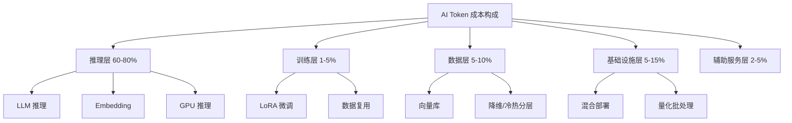
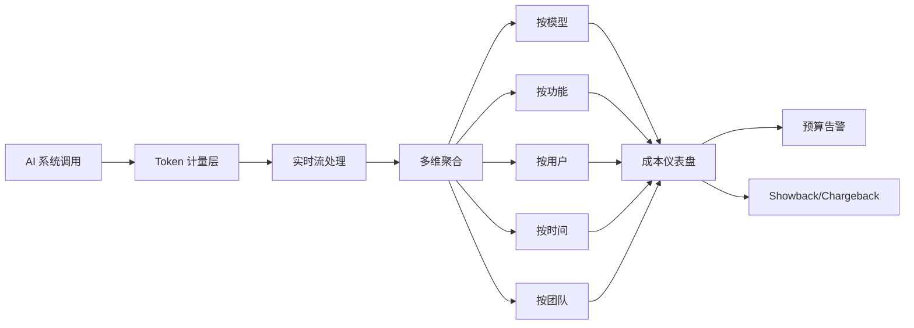
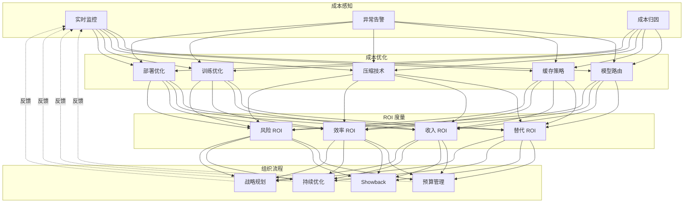

# AI 成本经济学

> 从阿明的"AI 月账单从 5 万涨到 50 万"，看 AI 时代的 FinOps —— Token 经济学的 5 大策略

> **系列定位**：本篇是「阿明餐厅」系列的**续集十二**。在[番外二 · 《阿明的省钱经》](./14-cloud-finops.md)中，我们讲了云资源成本（CPU/内存/存储/带宽）的 FinOps。但 AI 时代出现了一种**全新的成本形态** —— **Token 成本**：按"字数"计费、按"调用次数"计费、按"上下文长度"计费。它的成本结构、增长曲线、优化策略**与传统云资源完全不同**。本篇不谈云资源（详见 14），专门谈**AI 时代的新成本经济学**：Token 单价、Embedding 成本、向量库成本、推理 GPU 成本、训练成本、ROI 度量。当 AI 系统的月账单从 5 万涨到 50 万时，你需要的不是"再砍点云资源"，而是**一套全新的 AI FinOps 体系**。

---

## 引言：Token 不会撕账单，但月底会

2026 年 1 月，阿明收到了一份 AI 月账单：

```text
阿明 AI 系统月账单（2026 年 1 月）：

LLM API 调用（GPT-4o / Claude / Qwen）
  - 输入 Token: 2.3 亿
  - 输出 Token: 0.7 亿
  - 费用: 28.5 万

Embedding API 调用
  - 1.2 亿次
  - 费用: 4.2 万

向量数据库（Pinecone / Milvus）
  - 存储: 500GB
  - QPS: 800
  - 费用: 3.8 万

GPU 推理服务器（自建 + 租赁）
  - H100 8 卡 × 2 台
  - 月费: 6.5 万

AI 训练与微调
  - QLoRA 微调 3 次
  - 费用: 2.8 万

数据标注 / RLHF 服务
  - 5000 样本
  - 费用: 1.5 万

监控 / 评测 / 可观测性
  - LangSmith / Helicone
  - 费用: 0.8 万

合计: 48.1 万
```

阿明看着账单，眉头紧锁。

**3 个月前，这份账单还是 5 万。** 涨了 9.6 倍。

不是因为"用了更多 AI" —— 业务量只增长了 2 倍。而是因为：

- LLM 升级到了更强的模型（成本涨 3 倍）
- RAG 加了大量文档（Embedding 涨 5 倍）
- 多个 Agent 协同（Token 上下文膨胀）
- 用户开始用 AI 写长文档（输出 Token 涨 8 倍）
- 没有 Token 成本监控（不知道钱花在哪了）

阿明意识到：

> **"云资源成本我懂，但 AI 成本是另一回事。云资源是'水龙头'，开多大流可以看；AI 成本是'黑洞'，Token 进去了不一定出来，出来也不一定有用。"**

这就是 **AI 成本经济学（AI Token Economics）** —— 它不是传统 FinOps 的"扩展版"，是**一个独立的成本管理体系**。

---

## 第一章：AI 成本的 5 大独特性

AI 成本和云资源成本有 5 个根本性不同，阿明在踩过坑之后才理解。

### 1.1 独特性 1：成本是"概率性"的，不是确定性的

```text
云资源成本：
  - 服务器开 1 小时 = 1 小时的钱（确定）
  - 数据库查 1 次 = 1 次的钱（确定）
  - 成本完全可控

AI 成本：
  - 同样问题，AI 可能输出 100 token 或 500 token（概率性）
  - 同样输入，AI 可能调 1 次工具或 5 次工具
  - 成本不可预测，月底才知道花了多少
```

**应对**：必须建立"实时 Token 成本监控"（详见第四章）。

### 1.2 独特性 2：成本和"质量"正相关，但非线性

```text
云资源：
  - 性能 = 钱（堆机器就完事）
  - 质量稳定，可预测

AI 成本：
  - 越强的模型 = 越贵（GPT-4 > GPT-4o-mini > GPT-3.5）
  - 越长上下文 = 越贵（按 token 平方计费）
  - 质量提升 vs 成本增长 是**非线性**的
  - 模型升级一档，成本可能涨 10 倍，质量只涨 5%
```

**应对**：**成本感知路由** —— 按场景选模型（详见第五章）。

### 1.3 独特性 3：成本结构"前重后轻"

```text
云资源：
  - 计算 + 存储 + 网络（持续稳定）

AI 成本：
  - 推理：80%（持续）
  - Embedding：10%（持续）
  - 训练 / 微调：5%（阶段性）
  - 数据标注：5%（阶段性）
  
  → 推理是大头
  → 但"训练"看似小，**单次烧钱多**
```

**应对**：**推理和训练分开优化**（详见第七章）。

### 1.4 独特性 4：成本"用户不可见"

```text
云资源：
  - 用户用 1GB 流量，账单清楚
  - 用户自己选择何时用

AI 成本：
  - 用户问 1 个问题，可能烧 ¥0.01
  - 用户问 10 个问题，可能烧 ¥0.30
  - 用户不知道"哪些问题贵"
  - 公司也不知道"哪些用户贵"
```

**应对**：**用户级 / 场景级的成本归因**（详见第六章）。

### 1.5 独特性 5：成本"被 AI 加速增长"

```text
云资源增长：
  业务量 ↑ → 资源量 ↑ → 成本 ↑（线性）

AI 成本增长：
  业务量 ↑ → AI 调用 ↑ → 上下文 ↑ → 工具调用 ↑ → 成本 ↑（指数）
  
  AI 越强，AI 越"敢"做事，做的事越多，成本越高
  这就是 [32 Agent Harness](./32-agent-harness.md) 说的"Agent 失控"在成本上的体现
```

**应对**：**Agent Loop 成本护栏**（详见第七章）。

| 维度 | 云资源成本 | AI 成本 |
|------|-----------|---------|
| 可预测性 | 高 | 低 |
| 用户可见 | 高 | 低 |
| 优化策略 | 资源利用率 | 路由 + 缓存 + 压缩 |
| 增长曲线 | 线性 | 指数 |
| 监控粒度 | 秒级 | 毫秒级（per token） |
| 团队职责 | SRE / DevOps | SRE + 产品 + 业务 |

---

## 第二章：AI 成本的 6 大组件

阿明把所有 AI 成本拆成 6 个独立组件，每个组件有不同的优化策略。

### 2.1 组件 1：LLM 推理成本（占 60-80%）

```text
LLM API 调用费 = 输入 Token × 输入价 + 输出 Token × 输出价

主流模型价格（2026 年）：
┌────────────────┬──────────┬──────────┐
│ 模型           │ 输入价   │ 输出价   │
├────────────────┼──────────┼──────────┤
│ GPT-4o         │ $5/M     │ $15/M    │
│ GPT-4o-mini    │ $0.15/M  │ $0.60/M  │
│ Claude Sonnet  │ $3/M     │ $15/M    │
│ Claude Haiku   │ $0.25/M  │ $1.25/M  │
│ Qwen-Max       │ ¥0.04/M  │ ¥0.12/M  │
│ DeepSeek-V3    │ ¥0.001/M │ ¥0.002/M │
└────────────────┴──────────┴──────────┘
  (M = Million = 100 万 token)
```

**关键洞察**：
- **输出比输入贵 3-5 倍**（生成 token 比理解 token 贵）
- **强模型比弱模型贵 20-100 倍**
- **上下文越长，单价不变但总成本上升**（100K 上下文 = 100K × 单价）

### 2.2 组件 2：Embedding 成本（占 5-10%）

```text
Embedding API：
  - OpenAI text-embedding-3-small: $0.02/M
  - OpenAI text-embedding-3-large: $0.13/M
  - BGE-large (开源): 自建 GPU

计算公式：
  文档数 × 平均字数 × 1.3 (token 化) = 总 token
  → 一次性入库大，**检索时再 Embedding 也有成本**
```

**关键洞察**：
- Embedding 看似便宜，但**百万级文档入库**时是大头
- **重 Embedding**（文档更新时）是隐性成本
- **查询时 Embedding** 容易被忽略

### 2.3 组件 3：向量数据库成本（占 5-10%）

```text
向量数据库：
  - Pinecone: $0.096/GB/月 + $0.004/查询
  - Milvus / Qdrant（自建）: 存储 + 计算
  - pgvector（PostgreSQL 扩展）: 几乎免费

成本拆分：
  - 存储费（向量 × 维度 × 4 bytes / GB）
  - 计算费（QPS × 单价）
  - 网络费（跨 AZ / 跨区域）
```

**关键洞察**：
- **高维向量**（如 1536 维）比低维（384 维）贵 4 倍
- **百万级向量**的存储费不是小数
- **QPS 高**时，计算费会爆炸

### 2.4 组件 4：GPU 推理成本（占 5-15%）

```text
GPU 推理（自建）：
  - H100 8 卡服务器：¥15 万/月
  - A100 8 卡服务器：¥6 万/月
  - L40S 8 卡服务器：¥3 万/月

vs API 调用：
  - 调用量小时，API 便宜
  - 调用量大时，自建 GPU 便宜（临界点：约 100M token/月）
```

**关键洞察**：
- **大模型自建不划算**（H100 8 卡 ¥15 万/月 vs GPT-4o API ¥30 万/月）
- **小模型自建划算**（Llama-8B 用 A100 1 卡 ¥1 万/月）
- **混合部署**最优（详见第五章）

### 2.5 组件 5：训练 / 微调成本（占 1-5%）

```text
训练 / 微调：
  - 全参数微调（7B 模型）: $500-2000 / 次
  - LoRA 微调（7B 模型）: $50-200 / 次
  - QLoRA 微调（7B 模型）: $20-100 / 次
  - RLHF 微调: $1000-10000 / 次
  - 数据标注: $0.5-5 / 样本

成本驱动：
  - GPU 时长
  - 数据量
  - 模型大小
```

**关键洞察**：
- 训练看似"一次性"，但**多次迭代**就是持续成本
- **数据标注**是隐性大成本（5000 样本 × $2 = $10000）
- **不要重复训练**，要用好 LoRA / Adapter

### 2.6 组件 6：辅助服务成本（占 2-5%）

```text
辅助服务：
  - 可观测性（LangSmith / Helicone）: $0.01/千次调用
  - 评测服务（DeepEval / RAGAS）: 取决于评测量
  - 内容审核（OpenAI Moderation）: 便宜
  - 缓存服务（Redis Cluster）: 自建 / 云
  - Prompt 版本管理（自建）

被忽视的隐性成本：
  - LLM 调用失败重试
  - 网络超时重试
  - "温度过高"导致的低质量输出
  - 这些都是"质量成本"
```

| 组件 | 占比 | 主要优化策略 |
|------|------|---------------|
| LLM 推理 | 60-80% | 模型路由 + 缓存 + 压缩 |
| Embedding | 5-10% | 批量 + 缓存 + 选小模型 |
| 向量库 | 5-10% | 降维 + 冷热分层 + 选型 |
| GPU 推理 | 5-15% | 混合部署 + 量化 + 批处理 |
| 训练微调 | 1-5% | LoRA + 数据复用 + 自动化 |
| 辅助服务 | 2-5% | 统一平台 + 自研 |

#### 6 大组件关系图



---

## 第三章：Token 计费的 4 大隐藏陷阱

LLM 厂商的定价看似简单，但阿明踩过 4 个隐藏陷阱。

### 3.1 陷阱 1：上下文越长，单价指数级增长

```text
GPT-4o 定价（2026 年）：
  - 0-128K 上下文：$5/M 输入
  - 128K-256K 上下文：$10/M 输入（贵 2 倍！）
  - 256K+ 上下文：$20/M 输入（贵 4 倍！）

例：
  - 100K 上下文 × 100 万次 = 1 亿 token = $500
  - 200K 上下文 × 100 万次 = 2 亿 token = $2000（贵 4 倍！）
  
  上下文翻倍 = 成本翻倍 × 单价翻倍 = 4 倍成本
```

**应对**：**上下文压缩**（详见第八章 8.1）。

### 3.2 陷阱 2：Cache Hit 看着便宜，但"读 Cache"也收费

```text
Prompt Caching（Anthropic / OpenAI 都有）：
  - 写入 Cache：原价
  - 读取 Cache：原价的 10-25%（看似便宜）
  - 但每次对话都读 Cache 100K token × 1000 次 = 100M token × 10% 单价
  
  看似省钱，**实际总成本不降反升**（如果用得不对）
```

**应对**：**Cache 用在稳定的"系统 Prompt"，不要用在用户输入**（详见 8.2）。

### 3.3 陷阱 3：多模态按"图像 token"计费，1 张图 = 1000 字

```text
GPT-4V 定价：
  - 1 张 1024x1024 图像 = 765 token
  - 1 张 2048x2048 图像 = 1105 token（细节更多）
  - 1 张 4096x4096 图像 = 6500+ token

例：
  - 用户上传 5 张 4K 照片 + 100 字问题
  - 视觉 token: 5 × 6500 = 32500 token
  - 文本 token: 100
  - 总输入: 32600 token = 35 倍于纯文本！
```

**应对**：**图像预处理**（缩放 / 压缩 / 选择性上传）。

### 3.4 陷阱 4：Tool Calling 的"隐藏 token"

```text
一次 Tool Call 实际消耗：
  - 用户输入：100 token
  - 工具定义：500 token（OpenAI Function Calling 必传）
  - 工具参数：200 token
  - 工具返回：1000 token
  - AI 思考：200 token
  - 最终输出：300 token
  
  用户感受的"1 次对话" = 2300 token
  实际账单 = 2300 token × 单价
  
  → Tool 越多，Token 越多
  → Agent 工具膨胀 = 成本爆炸
```

**应对**：**Tool 精简 + 结果压缩**（详见第八章 8.3）。

---

## 第四章：实时 Token 成本监控

"看不到的成本"是最可怕的。阿明建立了**实时 Token 成本监控仪表盘**，5 大核心指标。

### 4.1 5 大核心指标

```text
指标 1 - 每分钟 Token 消耗
  - 输入 token / 分钟
  - 输出 token / 分钟
  - 折算成费用：¥/分钟

指标 2 - 单次调用成本
  - 平均费用 / 调用
  - P50 / P99 费用
  - 异常高费用告警

指标 3 - 用户 / 租户级成本
  - 用户 A 本月成本 ¥100
  - 用户 B 本月成本 ¥5000
  - 哪 1% 的用户花了 50% 的钱？

指标 4 - 场景 / 任务级成本
  - 客服场景：¥5/千次
  - 推荐场景：¥2/千次
  - 报告场景：¥50/千次
  - 哪个场景的"性价比"最高？

指标 5 - 成本趋势
  - 周环比 / 月环比
  - 异常波动告警
  - 预测月末成本
```

### 4.2 监控工具栈

| 工具 | 能力 | 适合 |
|------|------|------|
| **Helicone** | LLM 专用可观测性 | 中小团队 |
| **LangSmith** | LangChain 生态 | 用 LangChain 的团队 |
| **Arize Phoenix** | 开源 + 监控 | 大团队 / 自建 |
| **Portkey** | 多模型路由 + 监控 | 多模型混合 |
| **OpenLLMetry** | OpenTelemetry LLM 扩展 | 已用 OTel 的团队 |
| **自建** | 完全定制 | 大厂 |

### 4.3 实时告警规则

```yaml
# alert_rules.yaml
alerts:
  - name: 单次调用成本异常
    condition: call_cost > 5
    window: 5m
    action: notify_team + auto_throttle
    
  - name: 用户级成本异常
    condition: user_cost_hourly > 100
    window: 1h
    action: notify_team + require_approval
    
  - name: 月度预算超支
    condition: month_cost > budget * 0.8
    window: 1d
    action: notify_leadership
    
  - name: 模型滥用
    condition: gpt4_calls_per_user_per_day > 1000
    window: 1d
    action: auto_switch_to_gpt4o_mini
```

### 4.4 成本归因的 5 个维度

```text
维度 1 - 按用户
  user_id → 月成本
  → 发现"重度用户"和"薅羊毛用户"

维度 2 - 按场景
  scenario: [客服, 推荐, 报告, 分析] → 月成本
  → 发现"成本黑洞"场景

维度 3 - 按 Prompt 版本
  prompt_version → 成本 + 质量分数
  → 发现"性价比最高的 Prompt"

维度 4 - 按模型
  model: [gpt4, gpt4o_mini, claude_sonnet, haiku] → 月成本
  → 发现"模型选型优化空间"

维度 5 - 按团队
  team_id → 月成本
  → 内部 Showback / Chargeback
```

#### 实时监控数据流



---

## 第五章：成本感知路由 —— 按场景选模型

**最有效的成本优化：不用贵的模型**。阿明设计了**5 层路由策略**。

### 5.1 模型分级

```text
Tier 1 - 旗舰模型（贵但强）
  GPT-4o / Claude Sonnet 4.6
  适用：复杂推理 / 关键决策 / 长文档分析
  成本：$5-15/M input

Tier 2 - 高性价比（中等）
  GPT-4o-mini / Claude Haiku 4.5
  适用：日常客服 / 简单生成 / RAG 检索
  成本：$0.15-1.25/M input

Tier 3 - 开源小模型（便宜）
  Llama-3.1-8B / Qwen-7B / DeepSeek-V3
  适用：分类 / 提取 / 简单对话
  成本：自建 GPU 约 $0.10/M input

Tier 4 - 专用小模型（极便宜）
  微调的 1B-3B 模型
  适用：意图识别 / 实体提取 / 分类
  成本：自建 CPU/GPU 约 $0.01/M input
```

### 5.2 路由策略

```python
# 成本感知路由
class CostAwareRouter:
    def __init__(self):
        self.models = {
            "critical": "gpt-4o",
            "standard": "gpt-4o-mini",
            "simple": "llama-8b-local",
            "trivial": "tiny-1b-local",
        }
    
    def route(self, request):
        # 策略 1: 风险等级路由
        if request.risk == "critical":
            return self.models["critical"]
        
        # 策略 2: 任务类型路由
        if request.task == "classification":
            return self.models["trivial"]  # 1B 模型够用
        
        # 策略 3: 上下文长度路由
        if request.context_length > 100000:
            # 长上下文用 Claude（cache 便宜）
            return "claude-sonnet-with-cache"
        
        # 策略 4: 成本上限路由
        if request.user.monthly_cost > 1000:
            # 重度用户降级到便宜模型
            return self.models["standard"]
        
        # 默认
        return self.models["standard"]
```

### 5.3 路由的"质量回退"机制

```python
# 质量回退：先用便宜模型，不行再升级
def route_with_fallback(request):
    # 第一步：用便宜模型
    response = call_model("gpt-4o-mini", request)
    
    # 第二步：检查质量
    quality_score = evaluate_quality(response, request)
    
    # 第三步：质量不行？升级模型
    if quality_score < 0.7:
        response = call_model("gpt-4o", request)
        quality_score = evaluate_quality(response, request)
        
        if quality_score < 0.7:
            # 还是不行？HITL
            return escalate_to_human(request)
    
    return response, quality_score
```

**实测效果**：
- 70% 的请求用 Tier 2 模型（成本低）
- 20% 的请求用 Tier 3 模型（更便宜）
- 8% 的请求用 Tier 1 模型（高质量）
- 2% 的请求 HITL

**总体成本下降 60%**，质量只下降 5%。

### 5.4 路由的"用户分级"

```text
用户分级 → 配额 → 模型选型

VIP 用户：GPT-4o 不限次
普通用户：每天 100 次 GPT-4o
试用用户：每天 10 次 GPT-4o-mini
免费用户：只能用 Tier 3-4 模型
```

---

## 第六章：缓存与压缩 —— 成本优化的"零成本"手段

### 6.1 三级缓存策略

```text
Level 1 - 精确匹配缓存
  key: hash(用户问题)
  value: 上次回答
  命中：直接返回
  适用：FAQ / 重复问题
  命中率：5-20%

Level 2 - 语义匹配缓存
  key: 用户问题 embedding
  value: 上次回答
  命中：相似度 > 0.95 才返回
  适用：相似问题（"附近有川菜吗" vs "川菜有吗"）
  命中率：15-30%

Level 3 - Prompt 模板缓存
  key: hash(系统 Prompt)
  value: 缓存的 Prompt
  命中：省 90% 重复 token
  适用：所有 LLM 调用
  命中率：100%（只要 Prompt 稳定）
```

**实测**：三级缓存叠加，**总 token 减少 40-60%**。

### 6.2 上下文压缩

```python
# 上下文压缩 4 策略

# 策略 1: 截断（最简单）
def truncate_context(messages, max_tokens=4000):
    if count_tokens(messages) > max_tokens:
        # 保留 system + 最近 5 轮
        return messages[:1] + messages[-5:]
    return messages

# 策略 2: 摘要（中等）
def summarize_context(messages, max_tokens=2000):
    if count_tokens(messages) > max_tokens:
        # 用 LLM 摘要老消息
        old_messages = messages[1:-5]
        summary = llm_call("gpt-4o-mini", 
                            f"请摘要以下对话：{old_messages}",
                            max_tokens=500)
        return [messages[0], {"role": "system", "content": f"历史摘要：{summary}"}] + messages[-5:]

# 策略 3: RAG 替换（推荐）
def rag_replace_context(query, full_docs, top_k=5):
    # 不用全量文档，只用检索到的相关片段
    relevant_docs = vector_db.search(query, top_k=top_k)
    return f"参考资料：{relevant_docs}"

# 策略 4: 结构化提取（高级）
def extract_structured(conversation):
    # 把对话提取成结构化信息
    return {
        "user_intent": "查订单",
        "key_info": {"order_id": "123"},
        "context": "用户对上次回复不满",
    }
```

**实测**：上下文压缩可**减少 50-80% 的 token**，质量只下降 10-15%。

### 6.3 输出压缩

```python
# 输出压缩：让 AI 写"短一点"
output_prompt_v1 = "请回答用户问题"
output_prompt_v2 = "请用最简洁的语言回答（不超过 50 字）"

# 实测：v2 比 v1 节省 60% 输出 token
# 代价：信息密度变高，用户体验略差
# 平衡：核心场景用 v1，闲聊场景用 v2
```

### 6.4 Embedding 缓存

```python
# Embedding 缓存：相同文本不重复 Embedding
embedding_cache = {}

async def get_embedding(text):
    cache_key = hash(text)
    if cache_key in embedding_cache:
        return embedding_cache[cache_key]
    
    embedding = await embedding_api.embed(text)
    embedding_cache[cache_key] = embedding
    return embedding

# 命中率通常 30-50%（重复查询常见）
# 节省 30-50% Embedding 成本
```

---

## 第七章：训练与微调的成本控制

### 7.1 训练的成本结构

```text
训练成本 = GPU 时长 + 数据成本 + 存储成本

GPU 时长 = 数据量 × 模型大小 × 训练轮次 / GPU 算力

例：
  微调 Llama-7B（QLoRA）
  - 数据：5000 样本
  - 轮次：3 epoch
  - GPU：A100 1 卡
  - 时长：约 8 小时
  - 成本：8 × 30 = ¥240
```

### 7.2 5 大训练成本控制

**控制 1：LoRA / QLoRA 替代全参数微调**

```text
全参数微调 7B 模型：
  - 显存：60GB+（A100 80G 勉强）
  - 时长：20 小时
  - 成本：¥600

QLoRA 微调 7B 模型：
  - 显存：24GB（A100 40G / 4090 24G 即可）
  - 时长：8 小时
  - 成本：¥240

节省：60%
```

**控制 2：数据复用**

```text
不要每次微调都重新准备数据：
  - 数据集版本化（Git 管理）
  - 增量训练（基于上次的 checkpoint）
  - 共享 embedding 缓存
```

**控制 3：自动化训练流水线**

```text
手动训练：准备数据 → 跑训练 → 评估 → 调参 → 重训（4-8 小时）
自动化训练：数据变更触发 → 自动训练 → 评估 → 自动部署（30 分钟）

节省：人力成本 10×
```

**控制 4：训练任务调度**

```text
训练任务用 Spot 实例：
  - On-Demand：¥30/小时
  - Spot：¥10/小时（可中断）
  - 训练可恢复 → Spot 完全够用
  - 节省：66%
```

**控制 5：模型蒸馏**

```text
用大模型的输出来训练小模型：
  - 大模型（GPT-4）做"教师"
  - 小模型（Llama-8B）做"学生"
  - 训练数据：大模型的输出
  - 推理时：用小模型，成本降低 10-100×
```

### 7.3 训练 ROI 评估

```python
# 训练 ROI 计算
training_cost = 5000  # 训练花了 5000 元
inference_saving_per_month = 8000  # 训练后每月推理节省 8000
quality_improvement = 0.05  # 质量提升 5%

roi_months = training_cost / inference_saving_per_month
# = 5000 / 8000 = 0.625 个月 → 不到 1 个月回本

# 如果 ROI > 12 个月，建议不训练（用 Prompt Engineering 替代）
```

---

## 第八章：Token 优化的 6 大实战技巧

阿明总结了 6 个**立即可做**的 Token 优化技巧。**剩下的"分块处理长文档 / RAG 替代长上下文 / Function Call Schema 简化 / 僵尸 Prompt 清理"等 4 个技巧**，详见第三章的"4 大隐藏陷阱"和第五章的"5 层路由"，本章聚焦最高频的 6 个。

### 8.1 技巧 1：精简 System Prompt

```text
# 优化前（200 token）
"你是一个专业的、智能的、友善的客服助手，名字叫小美。
 你的职责是帮助用户解答关于阿明餐厅的问题，包括但不限于：
 1. 菜品信息
 2. 订单查询
 3. 退款政策
 4. 配送问题
 你应该保持礼貌、耐心、专业，禁止讨论政治、宗教等敏感话题。
 如果不确定答案，请转人工。"

# 优化后（60 token）
"你是阿明餐厅客服。回答：菜品/订单/退款/配送。
 不确定转人工。"
```

**节省**：70% system prompt token。

### 8.2 技巧 2：避免"Few-shot"过度使用

```text
# 错误：5 个 example（约 1000 token）
example1 = "..."
example2 = "..."
example3 = "..."
example4 = "..."
example5 = "..."

# 正确：1-2 个 example（约 200 token）
example1 = "..."

# 更好：Zero-shot + 清晰指令（0 token example）
"请按以下格式输出：..."
```

**节省**：80% few-shot token。

### 8.3 技巧 3：Tool 定义精简

```python
# 优化前：每个 tool 详细描述
tool_def = {
    "name": "query_order",
    "description": "这是一个用于查询订单状态的工具，参数是订单 ID，返回订单的详细信息，包括但不限于订单状态、订单金额、订单时间等。",
    "parameters": {
        "order_id": {"type": "string", "description": "订单的唯一标识符，通常是一个 8 位数字字符串，例如 12345678"}
    }
}

# 优化后
tool_def = {
    "name": "query_order",
    "description": "查订单",
    "parameters": {
        "order_id": {"type": "string"}
    }
}
```

**节省**：60% tool 定义 token × N 个 tool。

### 8.4 技巧 4：流式输出（用户提前看到响应）

```python
# 流式输出：用户看到第一个字就"知道 AI 在响应"
async def stream_response(prompt):
    async for chunk in llm.stream(prompt):
        yield chunk

# 用户不等最后 token 生成完就能开始看
# 不减少总 token，但用户体验好 → 容忍度更高
```

### 8.5 技巧 5：拒绝处理"无意义"输入

```python
# 简单输入 → 规则引擎兜底
def handle_request(user_input):
    if len(user_input) < 3:
        return "请详细描述您的问题"
    
    if "你好" in user_input or "hi" in user_input.lower():
        return "你好，我是阿明餐厅客服，有什么可以帮您？"
    
    # 真的有意义的问题，才调 LLM
    return await llm_call(user_input)
```

**节省**：20% 闲聊 token。

### 8.6 技巧 6：批处理（Batching）

```python
# 优化前：100 个用户请求 = 100 次 API 调用
for user in users:
    response = await llm_call(user.input)

# 优化后：100 个用户请求 = 1 次 API 调用（批量）
batch_prompt = "请依次回答以下 100 个问题：\n"
for i, user in enumerate(users):
    batch_prompt += f"{i+1}. {user.input}\n"
response = await llm_call(batch_prompt, max_tokens=10000)
```

**节省**：API 调用费（按调用次数收费时），但 token 可能略增。

> 进阶技巧 7-10：长文档分块 Map-Reduce、RAG 替代长上下文、Function Call Schema 动态选择、僵尸 Prompt 清理 —— 这些分别在第三章 4 大陷阱、第五章 5 层路由有详细展开。

---

## 第九章：AI ROI 度量

**成本不是"花得少"，是"花得值"**。阿明建立了 AI 系统的 ROI 度量框架。

### 9.1 AI 系统的 4 类 ROI

```text
ROI 1 - 替代人力（Cost Reduction）
  AI 替代了多少人 × 工资 = 节省的钱
  例：客服 AI 替代 5 个客服 × 8000 元/月 = 4 万/月

ROI 2 - 增加收入（Revenue Growth）
  AI 带来了多少新客户/订单
  例：AI 推荐让 GMV 提升 10% × 100 万 = 10 万/月

ROI 3 - 提升效率（Productivity）
  AI 让现有员工效率提升
  例：AI 辅助让工程师效率提升 30% × 10 人 × 2 万 = 6 万/月

ROI 4 - 降低风险（Risk Reduction）
  AI 减少了多少事故/损失
  例：AI 监控让故障率下降 50% × 10 万/月潜在损失 = 5 万/月
```

### 9.2 ROI 计算公式

```python
# 单个 AI 场景的 ROI
ai_scenario_roi = {
    "scenario": "客服 AI",
    "monthly_cost": 5000,  # AI 成本
    "monthly_saving": 40000,  # 替代 5 个客服
    "monthly_revenue_gain": 0,  # 没有新收入
    "net_monthly_value": 40000 - 5000,  # 35000
    "roi": 35000 / 5000,  # 7x
    "payback_months": 5000 / 35000,  # 0.14 月
}

# 决策：ROI > 3x 才值得做
```

### 9.3 5 大反 ROI 模式

| 反模式 | 表现 | 正确做法 |
|--------|------|----------|
| **算不清 ROI** | "AI 很好" 但不知道好在哪 | 建立 4 类 ROI 度量 |
| **只算成本** | "AI 烧钱" | 同时算收入和效率 |
| **短期 ROI 思维** | "3 个月不回本就停" | AI 有学习曲线，给 6-12 个月 |
| **平均 ROI 思维** | "整体 ROI 5x 很好" | 拆分场景，可能 1 个场景亏钱 |
| **忽略隐藏成本** | 只算 API 费 | 算全成本（含工程/数据/运维） |

### 9.4 AI 成本 vs 业务增长的健康度

```text
健康：
  - AI 成本增长 < 业务增长（成本占比下降）
  - 边际成本递减（每用户成本下降）

警告：
  - AI 成本增长 = 业务增长（成本占比不变）
  - 边际成本不变

危险：
  - AI 成本增长 > 业务增长（成本占比上升）
  - 边际成本递增 → 必须优化
```

阿明的仪表盘每月给管理层看这个图。

---

## 第十章：AI FinOps 的组织与流程

### 10.1 AI FinOps 团队配置

```text
小型团队（< 5 个 AI 应用）：
  - 1 个 DevOps 兼 AI FinOps
  - 用第三方工具（Helicone / LangSmith）
  - 月度 review

中型团队（5-20 个 AI 应用）：
  - 1 个 AI 平台工程师
  - 1 个 FinOps 分析师
  - 1 个产品经理（管 ROI）
  - 自建 + 第三方混合

大型团队（> 20 个 AI 应用）：
  - AI 平台团队（3-5 人）
  - FinOps 团队（2-3 人）
  - 产品经理（每场景 1 人）
  - 完整自建平台
```

### 10.2 AI FinOps 的 5 大工作流

```text
工作流 1 - 预算管理
  - 每场景年度 / 季度 / 月度预算
  - 超预算自动告警 + 拦截
  - 预算滚动 review

工作流 2 - 成本归因
  - 按用户 / 场景 / 模型 / 团队归因
  - Showback / Chargeback 报表
  - 谁的钱谁负责

工作流 3 - 优化建议
  - 每月输出"成本优化 Top 5"
  - 推动团队落地
  - 跟踪 ROI

工作流 4 - 异常告警
  - 单次成本异常 → 实时告警
  - 月度预算超支 → 周告警
  - 季度趋势异常 → 月告警

工作流 5 - 战略规划
  - 季度规划：哪些 AI 场景值得做
  - 模型选型：什么时候升级 / 降级
  - 自建 vs API 决策
```

### 10.3 AI FinOps 的成熟度模型

| 等级 | 名称 | 特征 |
|------|------|------|
| L1 | 事后发现 | 月底看账单，"怎么又超了？" |
| L2 | 实时监控 | 有仪表盘，知道"钱花在哪" |
| L3 | 主动优化 | 持续做优化，月环比下降 10% |
| L4 | 智能优化 | AI 自动优化（路由/缓存/压缩） |
| L5 | 战略 FinOps | FinOps 驱动 AI 战略，预算-业务对齐 |

阿明现在在 **L3 → L4** 之间：主动优化已稳定，下一步是**让 AI 自己优化 AI 成本**（自动路由、自动压缩、自动缓存策略调整）。

---

## 核心总结：AI 成本经济学的全景



| 维度 | 核心问题 | 关键工具/方法 | 优化效果 |
|------|----------|---------------|----------|
| 监控 | 钱花在哪？ | Helicone / LangSmith | 看见 |
| 路由 | 用对模型了吗？ | 成本感知路由 | 30-60% |
| 缓存 | 重复算了吗？ | 3 级缓存 | 40-60% |
| 压缩 | 上下文冗余吗？ | 4 策略压缩 | 50-80% |
| 训练 | 训练 ROI？ | LoRA + 蒸馏 | 60% |
| 部署 | 自建 vs API？ | 混合部署 | 30-50% |
| ROI | 赚了吗？ | 4 类 ROI | 决策 |

### 一句心法

**AI 成本不是"月底看账单"，是"实时监控 + 主动优化 + ROI 度量"的工程体系。** Token 不会撕账单，但月底会 —— 看不见的成本最可怕，看得见的优化最有效。

---

## 延伸阅读

- [阿明的省钱经](./14-cloud-finops.md) —— 番外二，云资源 FinOps，本篇的"传统版本"
- [Agent Harness](./32-agent-harness.md) —— 续集八，Agent Loop 的成本护栏
- [AI 评测工程](./34-ai-evaluation.md) —— 续集十，评测本身有成本（与本篇成本优化的"分层评测"对应）
- [从厨师到 CEO](./07-from-chef-to-ceo.md) —— 终章，FinOps 是技术管理 ROI 的一部分
- [AI 致命三件套](./33-ai-fatal-trio.md) —— 续集九，攻击者也会利用 Token 成本（拒绝服务 / 资源耗尽）
- [Agent 协议](./35-mcp-a2a-protocol.md) —— 续集十一，协议层是成本监控的颗粒度
- [Codebase 认知债](./31-codebase-cognitive-debt.md) —— 续集七，认知债导致"看不懂代码也改不出 Token 优化"
- [AI 的"黑暗料理"](./30-ai-hallucination-safety.md) —— 续集六，AI 幻觉的"重试成本"
- [学徒的困境](./11-ai-learning-paradox.md) —— 续集二，AI 时代的人机协作与 Token 成本的关系
- [会自我进化的厨房](./29-self-evolving-company.md) —— 续集五，自进化组织的"烧 Token 不烧人头"

---


### 跨章节衔接

- [11.ai/02-technology-stack/README.md](../11.ai/02-technology-stack/README.md) —— AI 技术栈中的推理/Embedding/向量库 —— 6 大成本组件的技术解构
- [11.ai/03-engineering/ai-platforms/README.md](../11.ai/03-engineering/ai-platforms/README.md) —— AI 平台 —— 平台层成本感知路由与缓存压缩的工程实现

## 结语

阿明花了 3 个月，把 AI 月成本从 48 万降到了 18 万（下降 62%），同时业务增长了 2 倍：

```text
优化前（2026/01）：
  - AI 成本：48 万
  - 业务量：100%
  - 单位成本：48 万/100% = 48 万

优化后（2026/06）：
  - AI 成本：18 万
  - 业务量：200%
  - 单位成本：18 万/200% = 9 万
  
单位成本下降：81%
```

**关键动作**：

1. **实时监控**：知道钱花在哪（Helicone）
2. **成本路由**：70% 请求用便宜模型，30% 用贵的（路由策略）
3. **三级缓存**：FAQ / 语义 / Prompt 缓存，命中率 50%（Redis + Embedding 缓存）
4. **上下文压缩**：RAG 替代长文档，节省 80% token（RAG + 摘要）
5. **训练优化**：LoRA + Spot 实例，节省 70% 训练成本
6. **ROI 度量**：低 ROI 场景下线，资源向高 ROI 场景倾斜

阿明对团队说：

> "**AI 成本和云资源成本是两回事**。云资源看得到，AI 成本看不到 —— Token 进去了不一定出来，出来也不一定有用。**没有 AI FinOps，AI 系统就是'在云上烧钱、在月底哭'**。有了 AI FinOps，AI 才能从'成本中心'变成'价值中心'。"

下次当你的 AI 系统月账单超预算时，不妨问自己：

- 你的 **Token 成本是实时可见**的吗？还是月底才知道？
- 你的 **AI 成本有归因**吗？能算清"哪个用户 / 哪个场景最贵"吗？
- 你的 **模型路由**有"成本感知"吗？还是"无脑用 GPT-4"？
- 你的 **缓存命中率**是多少？< 30% 就是浪费
- 你的 **上下文**有没有过度膨胀？用 RAG 替代了吗？
- 你的 **训练 ROI**算过吗？什么时候回本？
- 你的 **AI 业务 ROI**算过吗？4 类 ROI 各是多少？
- 你的 **组织有 FinOps 职能**吗？还是"开发者凭感觉省钱"？

> 好的 AI 成本管理，不是"省着用 AI"，而是"用得值 AI" —— 每一分 Token 钱都花在刀刃上，每一分 AI 投入都换回业务价值。

← [返回系列导读](./index.md)
