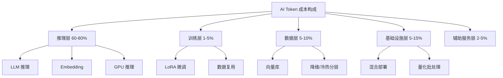
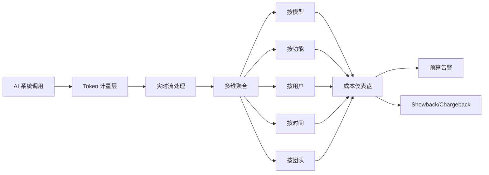
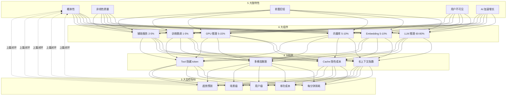

# 36a · AI 成本结构（续集十二 · 上）

> 从阿明的"AI 月账单从 5 万涨到 50 万"，看 AI 时代的 FinOps —— Token 经济学**上篇：成本结构与监控**

> **系列定位**：本篇是「阿明餐厅」系列的**续集十二（上）**。在[番外二 · 《阿明的省钱经》](./14-cloud-finops.md)中，我们讲了云资源成本（CPU/内存/存储/带宽）的 FinOps。但 AI 时代出现了一种**全新的成本形态** —— **Token 成本**：按"字数"计费、按"调用次数"计费、按"上下文长度"计费。它的成本结构、增长曲线、优化策略**与传统云资源完全不同**。本篇不谈云资源（详见 14），专门谈**AI 时代的新成本经济学**。**上篇讲成本结构（"看见成本"）**，下篇[36b](./36b-ai-token-cost-optimization.md)讲优化与 ROI（"优化成本"）。

> **兄弟篇**：36b · AI 成本优化（[← 点击阅读](./36b-ai-token-cost-optimization.md)）

---

## 引言：Token 不会撕账单，但月底会

2026 年 1 月，阿明收到了一份 AI 月账单：

```text
阿明 AI 系统月账单（2026 年 1 月）：

LLM API 调用（GPT-4o / Claude / Qwen）
  - 输入 Token: 2.3 亿
  - 输出 Token: 0.7 亿
  - 费用: 28.5 万

Embedding API 调用
  - 1.2 亿次
  - 费用: 4.2 万

向量数据库（Pinecone / Milvus）
  - 存储: 500GB
  - QPS: 800
  - 费用: 3.8 万

GPU 推理服务器（自建 + 租赁）
  - H100 8 卡 × 2 台
  - 月费: 6.5 万

AI 训练与微调
  - QLoRA 微调 3 次
  - 费用: 2.8 万

数据标注 / RLHF 服务
  - 5000 样本
  - 费用: 1.5 万

监控 / 评测 / 可观测性
  - LangSmith / Helicone
  - 费用: 0.8 万

合计: 48.1 万
```

阿明看着账单，眉头紧锁。

**3 个月前，这份账单还是 5 万。** 涨了 9.6 倍。

不是因为"用了更多 AI" —— 业务量只增长了 2 倍。而是因为：

- LLM 升级到了更强的模型（成本涨 3 倍）
- RAG 加了大量文档（Embedding 涨 5 倍）
- 多个 Agent 协同（Token 上下文膨胀）
- 用户开始用 AI 写长文档（输出 Token 涨 8 倍）
- 没有 Token 成本监控（不知道钱花在哪了）

阿明意识到：

> **"云资源成本我懂，但 AI 成本是另一回事。云资源是'水龙头'，开多大流可以看；AI 成本是'黑洞'，Token 进去了不一定出来，出来也不一定有用。"**

这就是 **AI 成本经济学（AI Token Economics）** —— 它不是传统 FinOps 的"扩展版"，是**一个独立的成本管理体系**。

**本篇（上）** 聚焦"看见成本"：AI 成本的独特性、6 大组件、4 大隐藏陷阱、实时监控。
**下篇[36b](./36b-ai-token-cost-optimization.md)** 聚焦"优化成本"：路由、缓存、压缩、训练优化、ROI、FinOps 组织。

---

## 第一章：AI 成本的 5 大独特性

AI 成本和云资源成本有 5 个根本性不同，阿明在踩过坑之后才理解。

### 1.1 独特性 1：成本是"概率性"的，不是确定性的

```text
云资源成本：
  - 服务器开 1 小时 = 1 小时的钱（确定）
  - 数据库查 1 次 = 1 次的钱（确定）
  - 成本完全可控

AI 成本：
  - 同样问题，AI 可能输出 100 token 或 500 token（概率性）
  - 同样输入，AI 可能调 1 次工具或 5 次工具
  - 成本不可预测，月底才知道花了多少
```

**应对**：必须建立"实时 Token 成本监控"（详见第四章）。

### 1.2 独特性 2：成本和"质量"正相关，但非线性

```text
云资源：
  - 性能 = 钱（堆机器就完事）
  - 质量稳定，可预测

AI 成本：
  - 越强的模型 = 越贵（GPT-4 > GPT-4o-mini > GPT-3.5）
  - 越长上下文 = 越贵（按 token 平方计费）
  - 质量提升 vs 成本增长 是**非线性**的
  - 模型升级一档，成本可能涨 10 倍，质量只涨 5%
```

**应对**：**成本感知路由** —— 按场景选模型（详见[36b 第五章](./36b-ai-token-cost-optimization.md#第五章成本感知路由--按场景选模型)）。

### 1.3 独特性 3：成本结构"前重后轻"

```text
云资源：
  - 计算 + 存储 + 网络（持续稳定）

AI 成本：
  - 推理：80%（持续）
  - Embedding：10%（持续）
  - 训练 / 微调：5%（阶段性）
  - 数据标注：5%（阶段性）

  → 推理是大头
  → 但"训练"看似小，**单次烧钱多**
```

**应对**：**推理和训练分开优化**（详见[36b 第七章](./36b-ai-token-cost-optimization.md#第七章训练与微调的成本控制)）。

### 1.4 独特性 4：成本"用户不可见"

```text
云资源：
  - 用户用 1GB 流量，账单清楚
  - 用户自己选择何时用

AI 成本：
  - 用户问 1 个问题，可能烧 ¥0.01
  - 用户问 10 个问题，可能烧 ¥0.30
  - 用户不知道"哪些问题贵"
  - 公司也不知道"哪些用户贵"
```

**应对**：**用户级 / 场景级的成本归因**（详见[36b 第六章](./36b-ai-token-cost-optimization.md#第六章缓存与压缩--成本优化的零成本手段)）。

### 1.5 独特性 5：成本"被 AI 加速增长"

```text
云资源增长：
  业务量 ↑ → 资源量 ↑ → 成本 ↑（线性）

AI 成本增长：
  业务量 ↑ → AI 调用 ↑ → 上下文 ↑ → 工具调用 ↑ → 成本 ↑（指数）

  AI 越强，AI 越"敢"做事，做的事越多，成本越高
  这就是 [32 Agent Harness](./32-agent-harness.md) 说的"Agent 失控"在成本上的体现
```

**应对**：**Agent Loop 成本护栏**（详见[36b 第七章](./36b-ai-token-cost-optimization.md#第七章训练与微调的成本控制)）。

| 维度 | 云资源成本 | AI 成本 |
|------|-----------|---------|
| 可预测性 | 高 | 低 |
| 用户可见 | 高 | 低 |
| 优化策略 | 资源利用率 | 路由 + 缓存 + 压缩 |
| 增长曲线 | 线性 | 指数 |
| 监控粒度 | 秒级 | 毫秒级（per token） |
| 团队职责 | SRE / DevOps | SRE + 产品 + 业务 |

---

## 第二章：AI 成本的 6 大组件

阿明把所有 AI 成本拆成 6 个独立组件，每个组件有不同的优化策略。

### 2.1 组件 1：LLM 推理成本（占 60-80%）

```text
LLM API 调用费 = 输入 Token × 输入价 + 输出 Token × 输出价

主流模型价格（2026 年）：
┌────────────────┬──────────┬──────────┐
│ 模型           │ 输入价   │ 输出价   │
├────────────────┼──────────┼──────────┤
│ GPT-4o         │ $5/M     │ $15/M    │
│ GPT-4o-mini    │ $0.15/M  │ $0.60/M  │
│ Claude Sonnet  │ $3/M     │ $15/M    │
│ Claude Haiku   │ $0.25/M  │ $1.25/M  │
│ Qwen-Max       │ ¥0.04/M  │ ¥0.12/M  │
│ DeepSeek-V3    │ ¥0.001/M │ ¥0.002/M │
└────────────────┴──────────┴──────────┘
  (M = Million = 100 万 token)
```

**关键洞察**：

- **输出比输入贵 3-5 倍**（生成 token 比理解 token 贵）
- **强模型比弱模型贵 20-100 倍**
- **上下文越长，单价不变但总成本上升**（100K 上下文 = 100K × 单价）

### 2.2 组件 2：Embedding 成本（占 5-10%）

```text
Embedding API：
  - OpenAI text-embedding-3-small: $0.02/M
  - OpenAI text-embedding-3-large: $0.13/M
  - BGE-large (开源): 自建 GPU

计算公式：
  文档数 × 平均字数 × 1.3 (token 化) = 总 token
  → 一次性入库大，**检索时再 Embedding 也有成本**
```

**关键洞察**：

- Embedding 看似便宜，但**百万级文档入库**时是大头
- **重 Embedding**（文档更新时）是隐性成本
- **查询时 Embedding** 容易被忽略

### 2.3 组件 3：向量数据库成本（占 5-10%）

```text
向量数据库：
  - Pinecone: $0.096/GB/月 + $0.004/查询
  - Milvus / Qdrant（自建）: 存储 + 计算
  - pgvector（PostgreSQL 扩展）: 几乎免费

成本拆分：
  - 存储费（向量 × 维度 × 4 bytes / GB）
  - 计算费（QPS × 单价）
  - 网络费（跨 AZ / 跨区域）
```

**关键洞察**：

- **高维向量**（如 1536 维）比低维（384 维）贵 4 倍
- **百万级向量**的存储费不是小数
- **QPS 高**时，计算费会爆炸

### 2.4 组件 4：GPU 推理成本（占 5-15%）

```text
GPU 推理（自建）：
  - H100 8 卡服务器：¥15 万/月
  - A100 8 卡服务器：¥6 万/月
  - L40S 8 卡服务器：¥3 万/月

vs API 调用：
  - 调用量小时，API 便宜
  - 调用量大时，自建 GPU 便宜（临界点：约 100M token/月）
```

**关键洞察**：

- **大模型自建不划算**（H100 8 卡 ¥15 万/月 vs GPT-4o API ¥30 万/月）
- **小模型自建划算**（Llama-8B 用 A100 1 卡 ¥1 万/月）
- **混合部署**最优（详见[36b 第五章](./36b-ai-token-cost-optimization.md#第五章成本感知路由--按场景选模型)）

### 2.5 组件 5：训练 / 微调成本（占 1-5%）

```text
训练 / 微调：
  - 全参数微调（7B 模型）: $500-2000 / 次
  - LoRA 微调（7B 模型）: $50-200 / 次
  - QLoRA 微调（7B 模型）: $20-100 / 次
  - RLHF 微调: $1000-10000 / 次
  - 数据标注: $0.5-5 / 样本

成本驱动：
  - GPU 时长
  - 数据量
  - 模型大小
```

**关键洞察**：

- 训练看似"一次性"，但**多次迭代**就是持续成本
- **数据标注**是隐性大成本（5000 样本 × $2 = $10000）
- **不要重复训练**，要用好 LoRA / Adapter

### 2.6 组件 6：辅助服务成本（占 2-5%）

```text
辅助服务：
  - 可观测性（LangSmith / Helicone）: $0.01/千次调用
  - 评测服务（DeepEval / RAGAS）: 取决于评测量
  - 内容审核（OpenAI Moderation）: 便宜
  - 缓存服务（Redis Cluster）: 自建 / 云
  - Prompt 版本管理（自建）

被忽视的隐性成本：
  - LLM 调用失败重试
  - 网络超时重试
  - "温度过高"导致的低质量输出
  - 这些都是"质量成本"
```

| 组件 | 占比 | 主要优化策略 |
|------|------|---------------|
| LLM 推理 | 60-80% | 模型路由 + 缓存 + 压缩 |
| Embedding | 5-10% | 批量 + 缓存 + 选小模型 |
| 向量库 | 5-10% | 降维 + 冷热分层 + 选型 |
| GPU 推理 | 5-15% | 混合部署 + 量化 + 批处理 |
| 训练微调 | 1-5% | LoRA + 数据复用 + 自动化 |
| 辅助服务 | 2-5% | 统一平台 + 自研 |

#### 6 大组件关系图



---

## 第三章：Token 计费的 4 大隐藏陷阱

LLM 厂商的定价看似简单，但阿明踩过 4 个隐藏陷阱。

### 3.1 陷阱 1：上下文越长，单价指数级增长

```text
GPT-4o 定价（2026 年）：
  - 0-128K 上下文：$5/M 输入
  - 128K-256K 上下文：$10/M 输入（贵 2 倍！）
  - 256K+ 上下文：$20/M 输入（贵 4 倍！）

例：
  - 100K 上下文 × 100 万次 = 1 亿 token = $500
  - 200K 上下文 × 100 万次 = 2 亿 token = $2000（贵 4 倍！）

  上下文翻倍 = 成本翻倍 × 单价翻倍 = 4 倍成本
```

**应对**：**上下文压缩**（详见[36b 第八章 8.1](./36b-ai-token-cost-optimization.md#81-技巧-1精简-system-prompt)）。

### 3.2 陷阱 2：Cache Hit 看着便宜，但"读 Cache"也收费

```text
Prompt Caching（Anthropic / OpenAI 都有）：
  - 写入 Cache：原价
  - 读取 Cache：原价的 10-25%（看似便宜）
  - 但每次对话都读 Cache 100K token × 1000 次 = 100M token × 10% 单价

  看似省钱，**实际总成本不降反升**（如果用得不对）
```

**应对**：**Cache 用在稳定的"系统 Prompt"，不要用在用户输入**（详见[36b 8.2](./36b-ai-token-cost-optimization.md#82-技巧-2避免-few-shot-过度使用)）。

### 3.3 陷阱 3：多模态按"图像 token"计费，1 张图 = 1000 字

```text
GPT-4V 定价：
  - 1 张 1024x1024 图像 = 765 token
  - 1 张 2048x2048 图像 = 1105 token（细节更多）
  - 1 张 4096x4096 图像 = 6500+ token

例：
  - 用户上传 5 张 4K 照片 + 100 字问题
  - 视觉 token: 5 × 6500 = 32500 token
  - 文本 token: 100
  - 总输入: 32600 token = 35 倍于纯文本！
```

**应对**：**图像预处理**（缩放 / 压缩 / 选择性上传）。

### 3.4 陷阱 4：Tool Calling 的"隐藏 token"

```text
一次 Tool Call 实际消耗：
  - 用户输入：100 token
  - 工具定义：500 token（OpenAI Function Calling 必传）
  - 工具参数：200 token
  - 工具返回：1000 token
  - AI 思考：200 token
  - 最终输出：300 token

  用户感受的"1 次对话" = 2300 token
  实际账单 = 2300 token × 单价

  → Tool 越多，Token 越多
  → Agent 工具膨胀 = 成本爆炸
```

**应对**：**Tool 精简 + 结果压缩**（详见[36b 8.3](./36b-ai-token-cost-optimization.md#83-技巧-3tool-定义精简)）。

---

## 第四章：实时 Token 成本监控

"看不到的成本"是最可怕的。阿明建立了**实时 Token 成本监控仪表盘**，5 大核心指标。

### 4.1 5 大核心指标

```text
指标 1 - 每分钟 Token 消耗
  - 输入 token / 分钟
  - 输出 token / 分钟
  - 折算成费用：¥/分钟

指标 2 - 单次调用成本
  - 平均费用 / 调用
  - P50 / P99 费用
  - 异常高费用告警

指标 3 - 用户 / 租户级成本
  - 用户 A 本月成本 ¥100
  - 用户 B 本月成本 ¥5000
  - 哪 1% 的用户花了 50% 的钱？

指标 4 - 场景 / 任务级成本
  - 客服场景：¥5/千次
  - 推荐场景：¥2/千次
  - 报告场景：¥50/千次
  - 哪个场景的"性价比"最高？

指标 5 - 成本趋势
  - 周环比 / 月环比
  - 异常波动告警
  - 预测月末成本
```

### 4.2 监控工具栈

| 工具 | 能力 | 适合 |
|------|------|------|
| **Helicone** | LLM 专用可观测性 | 中小团队 |
| **LangSmith** | LangChain 生态 | 用 LangChain 的团队 |
| **Arize Phoenix** | 开源 + 监控 | 大团队 / 自建 |
| **Portkey** | 多模型路由 + 监控 | 多模型混合 |
| **OpenLLMetry** | OpenTelemetry LLM 扩展 | 已用 OTel 的团队 |
| **自建** | 完全定制 | 大厂 |

### 4.3 实时告警规则

```yaml
# alert_rules.yaml
alerts:
  - name: 单次调用成本异常
    condition: call_cost > 5
    window: 5m
    action: notify_team + auto_throttle

  - name: 用户级成本异常
    condition: user_cost_hourly > 100
    window: 1h
    action: notify_team + require_approval

  - name: 月度预算超支
    condition: month_cost > budget * 0.8
    window: 1d
    action: notify_leadership

  - name: 模型滥用
    condition: gpt4_calls_per_user_per_day > 1000
    window: 1d
    action: auto_switch_to_gpt4o_mini
```

### 4.4 成本归因的 5 个维度

```text
维度 1 - 按用户
  user_id → 月成本
  → 发现"重度用户"和"薅羊毛用户"

维度 2 - 按场景
  scenario: [客服, 推荐, 报告, 分析] → 月成本
  → 发现"成本黑洞"场景

维度 3 - 按 Prompt 版本
  prompt_version → 成本 + 质量分数
  → 发现"性价比最高的 Prompt"

维度 4 - 按模型
  model: [gpt4, gpt4o_mini, claude_sonnet, haiku] → 月成本
  → 发现"模型选型优化空间"

维度 5 - 按团队
  team_id → 月成本
  → 内部 Showback / Chargeback
```

#### 实时监控数据流



---

## 核心总结（上篇）：AI 成本结构的全景



| 维度 | 核心问题 | 关键工具/方法 | 何时行动 |
|------|----------|---------------|---------|
| 独特性 | 为什么 AI 成本这么"诡异"？ | 5 大独特性认知 | 立项 |
| 组件 | 钱花在哪？ | 6 大组件拆分 | 复盘 |
| 陷阱 | 哪里有"看不见的坑"？ | 4 大陷阱清单 | 选型 / 优化 |
| 监控 | 钱花得是否合理？ | Helicone / LangSmith | 持续 |

### 上篇心法

**AI 成本不是"看见就行"，是"看见 + 理解 + 监控"的认知闭环。** Token 不会撕账单，但月底会 —— 看不见的成本最可怕，看得见的结构才可控。

下一步阅读[36b · AI 成本优化](./36b-ai-token-cost-optimization.md)—— 知道结构之后，怎么省、怎么赚。

---

## 延伸阅读

- [36b · AI 成本优化（下篇）](./36b-ai-token-cost-optimization.md) —— 路由 + 缓存 + 压缩 + 训练 + ROI + FinOps
- [阿明的省钱经](./14-cloud-finops.md) —— 番外二，云资源 FinOps，本篇的"传统版本"
- [Agent Harness](./32-agent-harness.md) —— 续集八，Agent Loop 的成本护栏
- [AI 评测工程（基础篇）](./34a-ai-evaluation-fundamentals.md) / [（流水线篇）](./34b-ai-evaluation-pipeline.md) —— 续集十，评测本身有成本（与本篇成本优化的"分层评测"对应）
- [AI 致命三件套](./33-ai-fatal-trio.md) —— 续集九，攻击者也会利用 Token 成本（拒绝服务 / 资源耗尽）
- [MCP 协议](./35a-mcp-protocol.md) / [A2A 协议](./35b-a2a-protocol.md) —— 续集十一，协议层是成本监控的颗粒度
- [37 · AI 可观测性](./37-ai-observability.md) —— AI 时代可观测性专题（与 4.2 工具栈配套）
- [39 · 向量数据库与 Embedding 实战](./39-vector-database-and-embedding.md) —— 39 续集十五，2.2/2.3 组件详解

---

## 跨章节衔接

- [11.ai/02-technology-stack/README.md](../11.ai/02-technology-stack/README.md) —— AI 技术栈中的推理/Embedding/向量库 —— 6 大成本组件的技术解构
- [11.ai/03-engineering/ai-platforms/README.md](../11.ai/03-engineering/ai-platforms/README.md) —— AI 平台 —— 平台层成本监控的工程实现

## 结语

> 好的成本管理，不是"少调用几次 API 就行"，而是"**看懂 Token 账单的每一行，像管餐厅食材一样精细化管理每一次 AI 调用**"。

← [返回系列导读](./index.md) | [下篇：36b 成本优化 →](./36b-ai-token-cost-optimization.md)