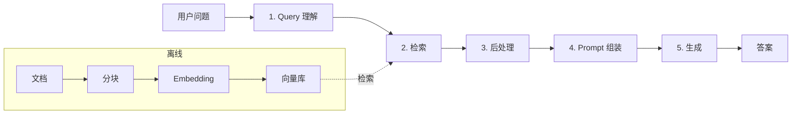

# 38 · RAG 检索增强生成专题（续集十四）

> 从阿明的"AI 凭空捏造答案"，看 RAG 检索增强生成 —— **5 大核心环节 + 7 大高级模式 + 评测体系 + 生产化**

> **系列定位**：本篇是「阿明餐厅」系列的**续集十四**。在[正传 4 · 《厨房质检员》](./08-qa-testing-strategy.md)第四章，我们提到了 RAG 的"忠实性"维度。在[续集六 · 《AI 的"黑暗料理"》](./30-ai-hallucination-safety.md)，我们提到过 RAG 是抑制幻觉的主要手段。在[34b · AI 评测流水线](./34b-ai-evaluation-pipeline.md)第六章，我们讲了 RAG 评测的 4 大指标。本篇是 **RAG 专题** —— 从架构到优化、从基础到高级模式、从离线评测到生产化，完整讲透 RAG。

---

## 引言：AI 一本正经地胡说八道

2025 年底，阿明的客服 AI 上线 2 个月。

一个用户问："你们的红烧肉热量是多少？"

AI 回答："**每份红烧肉约 480 千卡，含蛋白质 25 克、脂肪 35 克、碳水化合物 15 克。建议每日摄入不超过 2000 千卡。**"

听起来很专业，对吧？

但阿明翻遍了所有文档，**从未记录过红烧肉的热量数据**。

AI 在**编造数据**（幻觉）。

这就是 LLM 的核心问题：**没有外部知识，LLM 只能"基于训练时的模式"生成回答 —— 可能是对的，也可能是编的**。

解决思路：**检索增强生成（Retrieval-Augmented Generation, RAG）** —— 先从知识库"检索"相关文档，再让 LLM 基于检索结果"生成"答案。

```text
传统 LLM：
  用户问 → LLM（基于训练数据）→ 答案（可能是幻觉）

RAG：
  用户问 → 检索相关文档 → LLM（基于检索结果）→ 答案（基于事实）
```

RAG 不是新技术，但 2026 年它成了**生产级 AI 应用的事实标准**。本篇完整讲透 RAG。

---

## 第一章：RAG 的 5 大核心环节 —— 先翻菜谱再下锅，别凭空瞎炒

### 1.1 整体流程



### 1.2 5 大环节详解

**环节 1：Query 理解**

```text
输入：用户原始问题
输出：优化后的查询

关键操作：
  - Query 改写（"附近有川菜吗" → "附近的川菜餐厅推荐"）
  - HyDE（Hypothetical Document Embeddings，先生成假设答案，再检索）
  - Multi-Query（一个问题生成多个变体查询）
  - Step-Back（抽象问题 → 具体问题 → 检索 → 具体回答）

工具：LangChain / LlamaIndex QueryTransform
```

**环节 2：检索**

```text
输入：优化后的查询
输出：相关文档片段（top-K）

检索方式：
  - 向量检索（Dense Retrieval）：基于语义相似度
  - 关键词检索（Sparse Retrieval）：BM25 / Elasticsearch
  - 混合检索（Hybrid）：向量 + 关键词
  - 重排序（ReRank）：用更强模型对 top-K 重排

工具：Qdrant / Milvus / pgvector + Elasticsearch + Cohere Rerank
```

**环节 3：后处理**

```text
输入：检索到的 top-K 文档
输出：精简后的相关文档

关键操作：
  - 去重（相似文档合并）
  - 过滤（按时间 / 来源 / 权限）
  - 压缩（提取关键句子）
  - 重排（ReRank 提升相关文档排名）

工具：LlamaIndex Postprocessor / Cohere Rerank / BGE Rerank
```

**环节 4：Prompt 组装**

```text
输入：用户问题 + 检索文档 + 系统 Prompt
输出：完整 Prompt

关键模板：
  系统 Prompt：你是客服 AI，只基于参考资料回答，不知道就说不知道
  用户 Prompt：
    参考资料：
    [1] {{doc1}}
    [2] {{doc2}}
    [3] {{doc3}}

    用户问题：{{user_query}}
    请基于参考资料回答。
```

**环节 5：生成**

```text
输入：完整 Prompt
输出：答案

约束：
  - 温度：0（事实性问题）/ 0.7（创造性问题）
  - 引用标注：每个事实标注来源 [1][2][3]
  - 兜底："我不知道"（当文档不相关时）
  - Length 控制：避免过长输出

工具：OpenAI / Claude / Qwen / DeepSeek
```

### 1.3 RAG vs 长上下文 vs 微调

| 维度 | RAG | 长上下文 | 微调 |
|------|-----|---------|------|
| **知识更新** | 秒级（更新文档） | 不可 | 慢（重训） |
| **成本** | 低（检索 + 短 Prompt）| 高（百万 token × 多次）| 高（训练） |
| **事实性** | 高（基于文档） | 中（可能幻觉）| 中（可能过拟合） |
| **适用场景** | 知识密集 / 时效性强 | 一次性分析 | 风格 / 领域适应 |
| **2026 趋势** | ⭐⭐⭐⭐⭐ | ⭐⭐⭐ | ⭐⭐ |

**结论**：**RAG 是 2026 年事实性 AI 应用的首选**，长上下文是补充，微调是次选。

---

## 第二章：RAG 的 7 大高级模式 —— 混合翻书、多问几遍、先猜再查，七种高阶翻法

### 2.1 模式 1：Hybrid Search（混合检索）

```python
# 向量 + 关键词混合检索
def hybrid_search(query, top_k=10, alpha=0.7):
    # 1. 向量检索
    vector_results = vector_db.search(query, top_k=top_k)

    # 2. 关键词检索
    keyword_results = bm25.search(query, top_k=top_k)

    # 3. 加权融合
    combined = {}
    for r in vector_results:
        combined[r.id] = combined.get(r.id, 0) + alpha * r.score
    for r in keyword_results:
        combined[r.id] = combined.get(r.id, 0) + (1 - alpha) * r.score

    # 4. 取 top-K
    return sorted(combined.items(), key=lambda x: -x[1])[:top_k]
```

**为什么需要混合？**

```text
向量检索强项：语义理解（"川菜" ≈ "辣的食物"）
关键词检索强项：精确匹配（产品型号、专有名词）

混合检索 = 取长补短
实测：Hybrid 比纯向量检索提升 10-15% Recall
```

### 2.2 模式 2：ReRank（重排序）

```python
# 用更强模型重排
from sentence_transformers import CrossEncoder

reranker = CrossEncoder("BAAI/bge-reranker-large")

def rerank(query, docs, top_k=5):
    # 1. 计算相关性分数
    pairs = [[query, d.content] for d in docs]
    scores = reranker.predict(pairs)

    # 2. 按分数重排
    ranked = sorted(zip(docs, scores), key=lambda x: -x[1])

    # 3. 取 top-K
    return [d for d, _ in ranked[:top_k]]
```

**为什么需要 ReRank？**

```text
向量检索：快，但粗排（top-100 可能相关但排序不准）
ReRank：慢，但精排（top-5 准确度大幅提升）

典型流程：
  向量检索 top-100 → ReRank top-5 → 给 LLM

实测：ReRank 提升 Faithfulness 5-10%
```

### 2.3 模式 3：Query Transformation（查询转换）

```python
# Multi-Query：一个问题生成多个查询
def multi_query_retrieval(query, llm):
    # 1. 让 LLM 生成 3-5 个查询变体
    variants = llm.generate(f"""
        请基于以下问题生成 3 个不同的查询，用于检索：
        原问题：{query}
        要求：每个查询角度不同，覆盖更全面。
    """)

    # 2. 多次检索
    all_docs = []
    for variant in variants:
        docs = vector_db.search(variant, top_k=10)
        all_docs.extend(docs)

    # 3. 去重 + 重排
    return rerank(query, all_docs, top_k=5)
```

### 2.4 模式 4：HyDE（Hypothetical Document Embeddings）

```python
# HyDE：先生成假设答案，再用假设答案检索
def hyde_retrieval(query, llm):
    # 1. 让 LLM 生成"假设答案"
    hypothetical = llm.generate(f"假设你是这个领域的专家，请回答：{query}")

    # 2. 用假设答案的 Embedding 检索
    docs = vector_db.search(hypothetical, top_k=5)

    # 3. 返回文档
    return docs
```

**为什么 HyDE 有效？**

```text
传统：用户问题的 Embedding vs 文档 Embedding（差距大）
HyDE：假设答案的 Embedding vs 文档 Embedding（更接近）

实测：HyDE 在某些领域提升 15-20% Recall
```

### 2.5 模式 5：Self-RAG / Corrective RAG

```python
# Self-RAG：AI 自己判断检索结果是否相关
def self_rag(query, llm):
    # 1. 检索
    docs = vector_db.search(query, top_k=10)

    # 2. 让 LLM 判断每个文档是否相关
    relevant_docs = []
    for doc in docs:
        relevance = llm.generate(f"""
            问题：{query}
            文档：{doc.content}
            这个文档是否包含回答问题所需的信息？
            请回答 YES / NO。
        """)
        if "YES" in relevance:
            relevant_docs.append(doc)

    # 3. 基于相关文档生成答案
    if relevant_docs:
        answer = llm.generate(build_prompt(query, relevant_docs))
    else:
        answer = "抱歉，知识库中没有相关信息。"

    return answer
```

### 2.6 模式 6：Multi-Step / Agentic RAG

```python
# Multi-Step RAG：分步检索 + 推理
def multi_step_rag(query, llm):
    # 1. 拆解问题
    sub_questions = llm.generate(f"将以下问题拆解成 2-3 个子问题：{query}")

    # 2. 分别检索每个子问题
    all_docs = []
    for sub_q in sub_questions:
        docs = vector_db.search(sub_q, top_k=5)
        all_docs.extend(docs)

    # 3. 综合推理
    answer = llm.generate(f"""
        子问题：
        {sub_questions}

        检索到的资料：
        {all_docs}

        请综合所有资料回答原问题：{query}
    """)
    return answer
```

### 2.7 模式 7：GraphRAG（图谱 RAG）

```text
GraphRAG = 知识图谱 + RAG

传统 RAG：检索文档片段
GraphRAG：检索实体关系（"川菜" → "辣" → "红烧肉" → "480 千卡"）

优势：
  - 关系推理（"川菜有什么菜？" 能找到所有川菜）
  - 多跳问题（"老周是哪个菜的主厨？" → 老周 → 主厨 → 红烧肉）

工具：Neo4j + LangChain / LlamaIndex
```

---

## 第三章：RAG 的 5 大调优技巧 —— 菜谱字号、书签位置、重点标注，让 AI 看得准

### 3.1 调优 1：Chunk 策略

```text
Chunk 大小选择：
  - 太小（< 200 字）：信息不足，AI 拼不出答案
  - 太大（> 2000 字）：噪音多，AI 容易分心
  - 适中（500-1000 字）：大多数场景最佳

Chunk 重叠：
  - overlap = 10-20%（避免切断关键信息）

切分方法：
  - 固定长度（最简单）
  - 按段落（保持语义完整）
  - 按标题（结构化文档）
  - 语义切分（LLM 判断边界，最智能但最慢）
```

### 3.2 调优 2：Embedding 模型选择

| 模型 | 维度 | 强项 | 弱项 |
|------|------|------|------|
| **OpenAI text-embedding-3-large** | 3072 | 通用 | 贵 |
| **BGE-large-zh-v1.5** | 1024 | 中文 | 英文略弱 |
| **M3E-large** | 1024 | 中文 + 多任务 | 略旧 |
| **Cohere embed-multilingual-v3** | 1024 | 多语言 | 国内访问难 |

**选型建议**：

```text
中文为主：BGE-large-zh-v1.5（开源 + 私有化）
英文为主：OpenAI text-embedding-3-large
多语言：Cohere embed-multilingual-v3
```

### 3.3 调优 3：检索参数优化

```python
# 关键参数
config = {
    "top_k": 5,  # 检索文档数（太多浪费 token，太少信息不足）
    "score_threshold": 0.7,  # 相似度阈值（过滤不相关文档）
    "search_type": "hybrid",  # 检索方式
    "rerank": True,  # 是否 ReRank
    "rerank_top_k": 20,  # ReRank 前 K 个
    "filter": {"source": "internal", "date": ">2025-01-01"},  # 元数据过滤
}
```

### 3.4 调优 4：Prompt 工程

```text
# 系统 Prompt 模板
你是一个专业的客服 AI。

## 规则：
1. 只基于参考资料回答，不要编造信息
2. 如果参考资料不相关，请回答"抱歉，我不清楚这个问题"
3. 引用必须标注来源 [1][2][3]
4. 保持简洁，不超过 200 字

## 参考资料：
[1] {{doc1.title}}: {{doc1.content}}
[2] {{doc2.title}}: {{doc2.content}}
[3] {{doc3.title}}: {{doc3.content}}

## 用户问题：
{{user_query}}

请基于参考资料回答，并标注引用来源。
```

### 3.5 调优 5：引用验证

```python
# 让 AI 验证自己的引用
answer_prompt = """
请回答以下问题，并标注引用来源：

问题：{query}
资料：{docs}

回答后请自检：
1. 每个事实是否都有引用？
2. 引用是否真的支持这个事实？
3. 如果有不支持的，请重新组织答案。
"""
```

---

## 第四章：RAG 的 4 大常见陷阱 —— 找到了没看到、找对了做错了、凭空脑补

### 4.1 陷阱 1：检索到了，但 AI 没"看到"

```text
原因：
  - Chunk 切分过大，关键信息在 chunk 中间
  - 检索 top-K 太小，错过关键文档
  - Prompt 中"淹没"了检索内容（system prompt 过长）

应对：
  - 调小 chunk_size + 增加 overlap
  - 增大 top_K
  - 把检索内容放在 Prompt 最前面
```

### 4.2 陷阱 2：检索对了，但生成错了

```text
原因：
  - Prompt 没强调"基于参考资料"
  - 温度太高，AI 自由发挥
  - LLM 太弱，理解不了复杂文档

应对：
  - Prompt 强调"只基于参考资料"
  - 温度设为 0
  - 用更强的 LLM（GPT-4o / Claude Sonnet）
```

### 4.3 陷阱 3：检索错了

```text
原因：
  - Embedding 模型不适合（中文场景用了英文模型）
  - 文档质量差（OCR 错误 / 格式混乱）
  - 用户问题太模糊（"那个东西"）

应对：
  - 选合适的 Embedding 模型
  - 文档预处理（清理 OCR、统一格式）
  - Query 改写 / HyDE
```

### 4.4 陷阱 4：检索对了，但"幻觉"了

```text
原因：
  - LLM 没有"不知道"选项
  - 文档中部分相关，AI 脑补了其他部分
  - 用户诱导（"你刚才说..."）

应对：
  - 显式"我不知道"兜底
  - Self-RAG 让 AI 自检
  - 引用验证
```

---

## 第五章：RAG 评测体系 —— 四维度试吃打分，查得准不准做得像不像

### 5.1 4 大核心指标（详见 [34b 第六章](./34b-ai-evaluation-pipeline.md#第六章rag-系统的专项评测)）

| 指标 | 含义 | 工具 |
|------|------|------|
| **Context Precision** | 召回的文档中相关比例 | RAGAS |
| **Context Recall** | 相关文档被召回比例 | RAGAS |
| **Faithfulness** | 答案忠于上下文 | RAGAS / HHEM |
| **Answer Relevancy** | 答案切题 | RAGAS |

### 5.2 RAG 黄金集构建

```yaml
# 黄金集示例
cases:
  - case_id: faq_001
    question: "红烧肉热量是多少？"
    expected_answer: "480 千卡"
    relevant_docs: ["menu/red_cooked_meat.md#nutrition"]
    irrelevant_docs_should_not_appear: ["menu/other_dishes.md"]
    difficulty: easy

  - case_id: complex_002
    question: "老周的红烧肉和普通的有什么区别？"
    expected_answer: "老周的是祖传配方，使用 XX 酱油..."
    relevant_docs: ["chef/zhou.md", "menu/red_cooked_meat.md"]
    difficulty: hard
```

### 5.3 RAG 评测流水线

```python
# RAGAS 评测示例
from ragas import evaluate
from ragas.metrics import (
    context_precision,
    context_recall,
    faithfulness,
    answer_relevancy,
)

result = evaluate(
    dataset,  # 黄金集 + 实际检索结果 + 实际生成结果
    metrics=[context_precision, context_recall, faithfulness, answer_relevancy],
)
print(result)
```

---

## 第六章：RAG 的生产化与成本 —— 从试菜到大灶，每翻一次菜谱多少钱

### 6.1 RAG 的成本结构

```text
RAG 调用成本（单次）：
  - Embedding（用户问题）：$0.0001
  - 向量检索：$0.00001
  - LLM 生成（基于检索结果）：$0.01-0.1
  - 总计：约 $0.01-0.1 / 次

每月 100 万次调用 ≈ $10,000 - $100,000

详见 [36a 第二章 2.1 LLM 推理成本](./36a-ai-token-cost-structure.md#21-组件-1llm-推理成本占-60-80)
```

### 6.2 RAG 的性能优化

```python
# 关键优化手段
optimizations = {
    # 1. Embedding 缓存
    "embedding_cache": "Redis 缓存，命中率 30-50%",

    # 2. 检索结果缓存
    "retrieval_cache": "语义相似度缓存，命中率 20-30%",

    # 3. Prompt 缓存
    "prompt_cache": "稳定 system prompt 缓存",

    # 4. 批处理
    "batching": "100 个查询 → 1 次 Embedding 调用",

    # 5. 异步并发
    "async": "检索 + Embedding 并发执行",

    # 6. 预热
    "warmup": "高频查询预计算 Embedding",
}
```

### 6.3 RAG 的可观测性

RAG 系统需要专门的 RAG Observability（详见 [37 · AI Observability](./37-ai-observability.md)）：

```text
观测指标：
  - 检索命中率（检索到相关文档的比例）
  - 平均检索 top-K
  - 平均 Faithfulness 分数
  - 检索延迟 / 生成延迟
  - 每次调用的成本
  - 用户反馈（点赞 / 点踩）

工具：LangSmith + RAGAS + 自建仪表盘
```

---

## 第七章：RAG 的未来趋势（2026-2028） —— 翻菜谱成了行规，未来厨师还会看图做菜

### 7.1 趋势 1：Agentic RAG 成为主流

```text
传统 RAG：固定检索 + 生成
Agentic RAG：AI 自主决定"要不要检索 / 检索几次 / 用哪些工具"

Agentic RAG 的典型流程：
  AI 收到问题
  → 决定是否需要检索
  → 如果需要，自主选择检索策略
  → 检索后判断信息是否足够
  → 不够则再次检索
  → 足够则生成答案

工具：LangGraph / LangChain Agents
```

### 7.2 趋势 2：GraphRAG 普及

```text
传统 RAG：文档片段
GraphRAG：实体关系

适合场景：
  - 关系密集（社交网络、推荐系统）
  - 多跳问题（"X 的朋友的同事是谁？"）
  - 全局问题（"公司所有产品线"）

工具：Neo4j + LangChain / Microsoft GraphRAG
```

### 7.3 趋势 3：RAG + 长上下文混合

```text
纯 RAG：检索 top-5 → 短 Prompt
纯长上下文：百万 token 全文
混合：关键部分长上下文（背景）+ 检索补充（最新信息）

适合场景：
  - 一次性的深度分析（财报分析、合同审查）
  - 长期记忆 + 短期上下文
```

### 7.4 趋势 4：多模态 RAG

```text
传统 RAG：检索文本
多模态 RAG：检索文本 + 图像 + 表格 + 视频

工具：
  - CLIP（图像 Embedding）
  - ColPali（文档图像检索）
  - GPT-4V / Claude Vision
```

---

## 核心总结：RAG 全景

| 维度 | 核心内容 | 工具 / 方法 |
|------|----------|------------|
| **5 大环节** | Query / Retrieval / Postprocess / Prompt / Generate | LangChain / LlamaIndex |
| **7 大高级模式** | Hybrid / ReRank / Multi-Query / HyDE / Self-RAG / Multi-Step / Graph | 见第二章 |
| **5 大调优** | Chunk / Embedding / 检索参数 / Prompt / 引用验证 | 见第三章 |
| **4 大陷阱** | 检索不到 / 生成错 / 检索错 / 幻觉 | 见第四章 |
| **4 大评测指标** | Context Precision / Recall / Faithfulness / Answer Relevancy | RAGAS |
| **生产化** | 成本 / 性能 / 可观测 | 见第六章 |
| **4 大趋势** | Agentic / Graph / 混合 / 多模态 | 见第七章 |

### 一句心法

**RAG 是 2026 年事实性 AI 应用的事实标准：从基础到高级，从评测到生产化，构成了完整的"基于事实回答"工程体系。** 没有 RAG，AI 就是"幻觉机器"；有了 RAG，AI 才是"可信赖的知识助手"。

---

## 延伸阅读

- [厨房质检员](./08-qa-testing-strategy.md) —— 正传 4，RAG 忠实性维度
- [AI 的"黑暗料理"](./30-ai-hallucination-safety.md) —— 续集六，RAG 是抑制幻觉的主要手段
- [AI 评测工程 34a/34b](./34a-ai-evaluation-fundamentals.md) / [34b](./34b-ai-evaluation-pipeline.md) —— 续集十，RAG 评测的 4 大指标详解
- [AI 可观测性 37](./37-ai-observability.md) —— 续集十三，RAG 的可观测性
- [AI 成本结构 36a](./36a-ai-token-cost-structure.md) / [36b](./36b-ai-token-cost-optimization.md) —— 续集十二，RAG 的成本与优化
- [向量数据库与 Embedding 39](./39-vector-database-and-embedding.md) —— 39 续集十五，RAG 的向量库与 Embedding 详解

---

## 跨章节衔接

- [11.ai/02-technology-stack/README.md](../11.ai/02-technology-stack/README.md) —— AI 技术栈 —— RAG 在 AI 技术栈中的位置
- [11.ai/03-engineering/ai-platforms/README.md](../11.ai/03-engineering/ai-platforms/README.md) —— AI 平台 —— Dify/Coze/LangGraph 的 RAG 实现

---

## 结语

阿明引入 RAG 后，AI 的"幻觉率"从 29% 降到了 3%，用户满意度大幅提升。

```text
引入 RAG 前：
  - AI 幻觉率：29%
  - 用户满意度：60%
  - 月度投诉：200+ 起

引入 RAG 后：
  - AI 幻觉率：3%（-90%）
  - 用户满意度：88%（+47%）
  - 月度投诉：20 起（-90%）
```

下次当你做 AI 应用时，不妨问自己：

- 我的 AI 是**基于事实**回答，还是**凭空捏造**？
- 我的知识库**多久更新**一次？能否秒级更新？
- 我的检索**是否 Hybrid**（向量 + 关键词）？
- 我有 **ReRank** 吗？top-K 排序准确吗？
- 我的 **Prompt** 有没有强调"只基于参考资料"？
- 我的 AI 有 **"我不知道"兜底**吗？
- 我用 **RAGAS** 评测 Faithfulness 吗？
- 我的 RAG **能处理多模态**吗？

> 好的 RAG 不是"加个向量库就完事"，而是"5 大环节 + 7 大高级模式 + 评测 + 生产化"的完整工程。这是 AI 时代**事实性应用**的基石。

← [返回系列导读](./index.md)