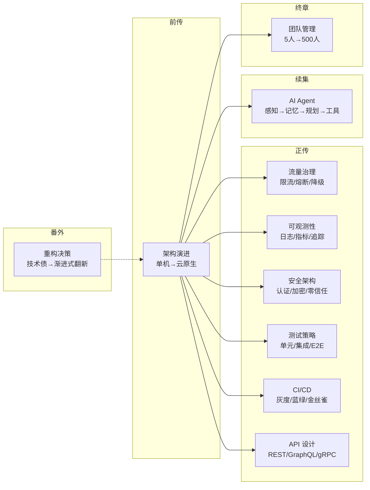

# 「阿明餐厅」技术系列

> 用开餐厅的故事，讲明白十件技术大事。
> 从架构演进到 AI 智能体，从流量治理到测试策略，从 CI/CD 到团队管理 —— 一篇一个核心主题，篇篇独立又互相串联。

---

## 系列全景



---

## 十篇文章

### 前传：[架构是"长"出来的](./02-system-architecture-evolution.md)

> 从阿明面馆十年，看业务驱动下的系统架构演进

一碗面的旅程，走完架构的完整演进：单机 MySQL → Redis 缓存 → 读写分离 → 垂直拆分 → 水平分片 → 多活容灾 → 云原生。每一步都是被业务逼出来的，不是提前设计好的。

**核心概念**：缓存一致性 · 最终一致性 · 分布式事务（Saga/TCC） · 多存储引擎选型

**适合**：工程师 / 架构师

---

### 续集：[当餐厅长出大脑](./01-ai-agent-architecture.md)

> 从阿明智慧厨房，拆解 AI Agent 的 7 大核心模块

阿明的平台要接入 AI Agent —— 感知、记忆、规划、工具调用、多智能体协同、反馈进化、安全护栏。不堆术语，只讲本质。包含 ToT/GoT 推理、Procedural Memory、Prompt 注入防护等前沿内容。

**核心概念**：多模态感知 · RAG · ReAct/ToT/GoT · Function Calling · Multi-Agent · RLHF

**适合**：工程师 / AI 从业者

---

### 正传 1：[高峰保卫战](./04-peak-traffic-defense.md)

> 从午高峰订单洪水，看流量治理的五道防线

午高峰涌入 500 单，厨房瞬间崩了。五道防线协同作战：限流控制入口，队列拉平冲击，弹性增加资源，熔断隔离故障，降级保住核心。

**核心概念**：令牌桶/漏桶 · 熔断器三态 · 消息队列削峰 · K8s HPA · 全链路压测

**适合**：工程师 / SRE

---

### 正传 2：[厨房装监控](./05-observability.md)

> 从"出餐慢"投诉，看可观测性的三大支柱

顾客投诉"面等了 40 分钟"，但查不出原因。可观测性三大支柱（Logging / Metrics / Tracing）+ 告警 + SLO，让系统"自己告诉你哪里出了问题"。

**核心概念**：结构化日志 · P99 指标 · 分布式追踪 · 告警分级 · SLO/SLI · 错误预算

**适合**：工程师 / SRE

---

### 正传 3：[食安大检查](./06-security-architecture.md)

> 从市场监管局突击检查，看安全架构的六大防线

食安检查来了，阿明一脸懵。六大防线纵深防御：身份认证、权限控制、数据加密、零信任、审计日志、数据脱敏。

**核心概念**：OAuth 2.0 / SSO / MFA · RBAC/ABAC · TLS/AES/KMS · 零信任 · 数据脱敏

**适合**：工程师 / 安全工程师

---

### 正传 4：[厨房质检员](./08-qa-testing-strategy.md)

> 从"祖传配方"到标准化质检，看测试金字塔的落地

新员工做错了菜，顾客投诉"味道不对"。测试金字塔（单元 70% / 集成 20% / E2E 10%）+ TDD + 测试左移/右移，让问题尽早暴露。

**核心概念**：测试金字塔 · TDD · 契约测试 · 测试左移/右移 · FIRST 原则 · 反模式

**适合**：工程师 / QA

---

### 正传 5：[从接单到出餐](./09-cicd-devops.md)

> 从"手写菜单"到自动化流水线，看 CI/CD 与 DevOps 的完整旅程

新菜上线手忙脚乱，部署出错难回滚。CI/CD 流水线 + 灰度发布 + 蓝绿部署 + 金丝雀发布 + GitOps，让代码安全、快速地交付到生产环境。

**核心概念**：CI/CD · 灰度发布 · 蓝绿部署 · 金丝雀发布 · GitOps · Feature Toggle

**适合**：工程师 / DevOps / SRE

---

### 正传 6：[菜单设计学](./10-api-design.md)

> 从"口头点单"到标准化菜单，看 API 设计的艺术与科学

口头点单混乱，后厨和服务员沟通出错。RESTful 风格 + 版本管理 + REST/GraphQL/gRPC 选型 + OpenAPI 文档 + 错误处理 + API 网关，让团队高效协作。

**核心概念**：RESTful · API 版本管理 · GraphQL · gRPC · OpenAPI · 幂等性 · API 网关

**适合**：工程师 / 架构师

---

### 终章：[从厨师到 CEO](./07-from-chef-to-ceo.md)

> 从 5 人到 500 人，看团队与组织的技术管理

团队大了，技术管理的挑战全变了。康威定律、技术雷达、平台工程（IDP）、知识管理、跨团队协作、工程师文化 —— 让 500 个人像 5 个人一样高效协作。

**核心概念**：康威定律 · Technology Radar · IDP · API 契约 · 故障复盘 · Code Review

**适合**：CTO / 技术管理者

---

### 番外：[给产品经理的重构说明书](./03-refactoring-guide-for-pm.md)

> 为什么阿明的厨房必须重新装修？

用 PM 听得懂的语言讲重构。五幕剧拆解技术债的累积与爆发，两种重构路线（停业翻新 vs 绞杀者模式）的权衡，重构 ROI 的业务指标量化。

**核心概念**：技术债 · 绞杀者模式 · 分支抽象 · Feature Toggle · 重构 ROI

**适合**：产品经理 / 技术管理者

---

## 系列辅助资料

- [术语表](./glossary.md) —— 60+ 核心技术术语速查，按 9 大主题分类
- [一页纸速查](./cheatsheet.md) —— 10 篇文章的核心概念、关键表格、金句心法汇总

---

## 推荐阅读路线

| 你是谁 | 推荐路线 | 为什么 |
|--------|----------|--------|
| 后端工程师 | 前传 → 正传 4 → 正传 5 → 正传 6 → 续集 | 架构全貌 → 测试 → 交付 → API → AI，完整技术成长路径 |
| SRE / 运维 | 正传 1 → 正传 2 → 正传 5 → 前传 | 流量治理 → 可观测性 → CI/CD → 架构演进 |
| 安全工程师 | 正传 3 → 续集第七章 → 正传 5 | 系统安全 → AI 安全 → 安全左移（CI/CD 中集成安全） |
| QA / 测试 | 正传 4 → 正传 5 → 正传 2 | 测试策略 → CI/CD → 可观测性（测试 + 监控闭环） |
| 架构师 | 前传 → 续集 → 正传 1/2/3/6 → 终章 | 从架构到 AI 到工程到管理，全局视角 |
| 产品经理 | 番外 → 前传 | 先理解重构价值，再看架构全貌 |
| CTO / VP | 终章 → 前传 → 续集 → 正传 5 | 组织 → 架构 → AI → 交付效率 |
| 快速了解 | 任选一篇 | 每篇自成体系，独立阅读无障碍 |

---

## 阿明的故事时间线

```
前传：小面馆 → 缓存 → 读写分离 → 垂直拆分 → 水平分片 → 多活容灾 → 云原生
                                                                      ↓
                    ┌─────────────────────────────────────────────────┘
                    ↓
正传 1：午高峰 500 单 → 限流 → 熔断 → 降级 → 队列削峰 → 弹性伸缩
正传 2：出餐慢投诉   → 日志 → 指标 → 链路追踪 → 告警 → SLO
正传 3：食安检查     → 认证 → 权限 → 加密 → 零信任 → 审计 → 脱敏
正传 4：新员工做错菜 → 单元测试 → 集成测试 → E2E → TDD → 测试左移/右移
正传 5：新菜上线混乱 → CI → CD → 灰度 → 蓝绿 → 金丝雀 → GitOps
正传 6：口头点单混乱 → REST → 版本管理 → GraphQL/gRPC → OpenAPI → API 网关
终章：5 人 → 500 人 → 康威定律 → 技术雷达 → 平台工程 → 知识管理
                                                                      ↓
续集：AI Agent → 感知 → 记忆 → 规划 → 工具 → 多智能体 → 反馈 → 安全
番外：技术债累积 → 系统崩溃 → 决定重构 → 渐进式翻新 → 效率翻倍
```

---

## 概念交叉索引

下表展示核心概念在不同文章中的出现位置，帮助你发现文章间的关联：

| 概念 | 主要出处 | 关联文章 |
|------|----------|----------|
| 弹性伸缩 / Auto Scaling | 正传 1 Ch.6 | 前传终章（K8s 编排）|
| 降级 / Feature Toggle | 正传 1 Ch.4 | 番外（特性开关）、正传 5（灰度发布） |
| 队列 / 消息队列 | 正传 1 Ch.5 | 前传 Ch.7（Kafka 存储）|
| 日志 / Logging | 正传 2 Ch.2 | 正传 3 Ch.5（审计日志） |
| SLO / 可用性 | 正传 2 Ch.6 | 前传 Ch.6（99% → 99.99%）|
| 链路追踪 / Trace ID | 正传 2 Ch.4 | 续集 Ch.4（工具调用追踪）|
| 零信任 / mTLS | 正传 3 Ch.4 | 续集 Ch.7（AI 权限沙箱）|
| RBAC / 最小权限 | 正传 3 Ch.2 | 续集 Ch.7（工具调用权限）|
| 康威定律 | 终章 Ch.1 | 前传 Ch.4（垂直拆分）、续集 Ch.5（Multi-Agent）|
| API 契约 | 终章 Ch.5 | 续集 Ch.4（Function Calling）、正传 6（API 设计）|
| 故障复盘 | 终章 Ch.5 | 正传 2（可观测性驱动根因分析）|
| 技术债 | 番外 | 前传（架构演进的代价）|
| 绞杀者模式 | 番外 | 前传 Ch.4（垂直拆分的渐进方式）|
| 全链路压测 | 正传 1 Ch.7 | 番外第三幕（大促崩溃的教训）、正传 4（测试右移）|
| 测试金字塔 | 正传 4 Ch.1 | 番外（重构时补测试）、终章（工程师文化）|
| TDD | 正传 4 Ch.5 | 终章 Ch.6（工程师文化）|
| 契约测试 | 正传 4 Ch.3 | 正传 6（API 向后兼容）|
| CI/CD | 正传 5 Ch.1-2 | 终章 Ch.3（平台工程 IDP）|
| 灰度发布 | 正传 5 Ch.3 | 正传 1（降级策略）、番外（特性开关）|
| 蓝绿部署 | 正传 5 Ch.4 | 正传 1（快速回滚）|
| 金丝雀发布 | 正传 5 Ch.5 | 正传 2（监控数据驱动决策）|
| GitOps | 正传 5 Ch.6 | 正传 3（审计合规）|
| RESTful | 正传 6 Ch.1 | 续集 Ch.4（Function Calling 标准化接口）|
| API 版本管理 | 正传 6 Ch.2 | 正传 5（灰度发布的前提）|
| OpenAPI | 正传 6 Ch.4 | 终章 Ch.5（API 契约文档化）|
| API 网关 | 正传 6 Ch.6 | 正传 1（限流熔断）、正传 3（认证授权）|

---

## 版权与引用

本系列文章采用 [CC BY-NC-SA 4.0](https://creativecommons.org/licenses/by-nc-sa/4.0/) 许可协议。欢迎转载、引用，但请注明出处。
